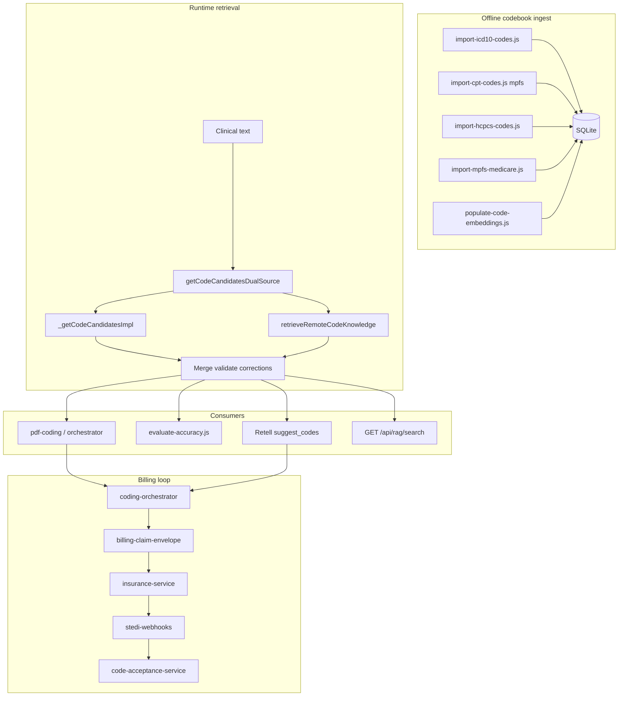

# Medical coding architecture

> **Last reviewed:** 2026-07-10  
> **Status:** Voice Kelly coding spine implemented; live Retell call proof is manual. See [VOICE_CODING_SPINE.md](./VOICE_CODING_SPINE.md).

This document describes the **implemented** medical coding stack in `middleware-platform`. It is the canonical reference for how ICD-10, CPT, and HCPCS codes are retrieved, validated, suggested to the voice agent, and attached to claims.

**Voice Kelly path (collect_insurance → quote → book):** [VOICE_CODING_SPINE.md](./VOICE_CODING_SPINE.md)

---

## 1. Purpose and scope

The medical coding layer suggests **billable diagnosis and procedure codes** from clinical text (voice transcripts, PDF notes, API queries). It is optimized for **US outpatient** workflows:

- **ICD-10-CM** diagnoses (FY2025 codebook in dev)
- **CPT** procedures (Medicare Physician Fee Schedule / MPFS, ~17k codes)
- **HCPCS Level II** (supplies, wellness G-codes, telehealth G-codes)

Downstream systems apply **pair validation**, **modifiers**, **POS codes**, and **Stedi 837P** professional claims. This document covers retrieval and suggestion; see [Financial Layer](../architecture/README.md#financial-financial-layer-architecture) in the consolidated architecture index for claims depth.

---

## 2. Status snapshot

| Metric | Dev (reference) | Production (GCS 2026-07-10) |
|--------|-----------------|----------------------------|
| `icd10_codes` | ~74,260 | **74,260** |
| `cpt_codes` | ~17,170 (MPFS) | **16,851** (MPFS — not DHS ~1,299) |
| `hcpcs_codes` | ~9,006 | **9,006** |
| `fee_schedules` | ~30,586 | **30,586** |
| `code_embeddings` | ~110k+ | **110,017** (specialty backfill + CDT) |
| DB file size | varies | **~3.1 GB** — see [PROD_DB_PARITY.md](../deployment/PROD_DB_PARITY.md) |
| Eval golden cases | 150+ | `eval:coding:fast` (CI) / `eval:coding:prod` (nightly) |
| Eval mode | `EVAL_USE_SEMANTIC=false`, `RAG_API_URL=disabled` | Fast for PR; prod profile uses semantic + Pinecone |
| **MT-03 tenant filter** | Client + callers + CI gate | **Done** — see [KELLY_CODING_MASTER_EXECUTION_PLAN.md](./KELLY_CODING_MASTER_EXECUTION_PLAN.md) §0.C |
| **CP-05 ranking SSOT** | `select-primary-codes.js` + CI gate | **Done** 2026-07-11 — `verify-ranking-ssot.cjs` |
| **§6 MT–PY backlog** | Phases 5–8 | **Eng complete** 2026-07-11 |
| **Coverage matrix (copay $)** | Pilot `plan_rules` sample | [COVERAGE_MATRIX.md](./COVERAGE_MATRIX.md) placeholder — refresh on PY-01 |

---

## 3. End-to-end flow



---

## 4. Data layer

### SQLite tables (via `database.js` → `medical-codes` repository)

| Table | Role | Approx. dev count |
|-------|------|-------------------|
| `icd10_codes` | ICD-10-CM descriptions | ~74,260 |
| `cpt_codes` | CPT/HCPCS procedure codes for search | ~17,170 (MPFS) |
| `hcpcs_codes` | HCPCS Level II | ~9,006 |
| `code_embeddings` | `text-embedding-3-small` vectors per code (see [§ Embedding model version](#embedding-model-version)) | ~110,017 |
| `fee_schedules` | Medicare allowed amounts (MPFS import) | ~30,586 |
| `code_acceptance_rates` | Payer outcomes for confidence (Stedi webhook) | grows with claims |

### CPT source: MPFS vs DHS

- **Correct:** `import-cpt-codes.js --source mpfs --file ../Knowledge/fee-schedules/PPRRVU.csv` (or RVU26A when downloaded from CMS).
- **Wrong for E/M:** DHS addendum only (~1,299 rows) — missing **99202–99215**, **90834**, etc.

MPFS descriptions use CMS abbreviations (e.g. `Office o/p est low 20 min`). Phrase expansion in `knowledge-service` maps lay terms (`established patient`) to searchable shorthand (`office o/p est`).

<a id="embedding-model-version"></a>

### Embedding model version (N-04)

Index-time and query-time embeddings **must use the same model and dimension** or semantic search and Pinecone similarity scores are invalid.

| Setting | Default | Where used |
|---------|---------|------------|
| `OPENAI_EMBEDDING_MODEL` / `EMBEDDING_MODEL_ID` | `text-embedding-3-small` | `embedding-provider.js`, `populate-code-embeddings.js` |
| `EMBEDDING_DIM` | `1536` | Must match Pinecone index dimension |
| `EMBEDDING_PROVIDER` | `openai` | Required for live vectors (`vector-sync-knowledge-chunks.cjs`) |

**SSOT modules:** `middleware-platform/services/embedding-provider.js` (runtime config), `semantic-search-service.js` (query embed for local hybrid search), `scripts/populate-code-embeddings.js` (batch index).

**Version change procedure:**

1. Record old model ID and row counts from `verify:prod-codebook`.
2. Update env vars on Cloud Run **and** local import hosts together.
3. Re-run `populate-code-embeddings.js --until-done` for all `code_type` values (or per-type incremental).
4. If Pinecone code-metadata index was built with the old model, re-index per [CODEBOOK_REFRESH_CALENDAR.md](./CODEBOOK_REFRESH_CALENDAR.md).
5. Re-baseline `eval:coding` and nightly `eval:coding:prod`.

`knowledge_vector_index_meta` (migration 035) stores `embedding_model` and `dimensions` from the last `vector-sync-knowledge-chunks.cjs` run for audit.

### Knowledge JSON (no static export required)

| Asset | Path |
|-------|------|
| Lay-language phrase map | `Knowledge/rules/lay-language-icd-expansions.json` |
| ICD term corrections | `Knowledge/RAG/icd10_term_corrections.json` |
| Concept corrections (optional export) | `Knowledge/RAG/concept_icd10_corrections.json` |
| Modifier / time rules | `Knowledge/rules/modifier-rules.json`, `time-based-cpt-rules.json` |
| Optional Colab export | `Knowledge/RAG/knowledge_export.json` — **not required**; dual-source no longer depends on it |

---

## 5. Retrieval layer

### 5.1 Unified entry: `getCodeCandidatesDualSource`

All benchmark-aligned surfaces should call this function. It runs **local** and **remote** retrieval in parallel, merges, validates against SQLite, and applies ICD term corrections.

```922:946:middleware-platform/services/knowledge-service.js
async function getCodeCandidatesDualSource(clinicalText, options = {}) {
  const text = (clinicalText || '').toString().trim().slice(0, 2000);
  // ...
  const remoteTimeoutMs = options.remoteTimeoutMs ?? parseInt(process.env.REMOTE_RAG_TIMEOUT_MS || '2000', 10);
  const [remoteSettled, localSettled] = await Promise.allSettled([
    retrieveRemoteCodeKnowledge(
      { query: text, specialty, top_k: Math.max(maxIcd10, maxCpt, maxHcpcs) },
      { timeoutMs: remoteTimeoutMs }
    ),
    _getCodeCandidatesImpl(text, { ...options, maxIcd10, maxCpt, maxHcpcs, useSemantic: options.useSemantic !== false })
  ]);
  // ... merge, validateCodesExist, applyRemoteIcdCorrections
```

**Options:** `maxIcd10`, `maxCpt`, `maxHcpcs`, `useSemantic`, `perceptualState`, `remoteTimeoutMs`, `clinicId`, `callId`.

### 5.2 Local path: `_getCodeCandidatesImpl`

1. **Normalize** — `expandMedicalAbbreviations`, `normalizeMedicalTerms`.
2. **Intent** — `buildSearchIntent` from perceptual state when present (`layer2-rag/search-intent-builder.js`).
3. **Phrases** — `MEDICAL_PHRASES` + `PHRASE_EXPANSIONS` + loaded lay-language JSON.
4. **Keyword SQL** — `searchIcd10Codes`, `searchCptCodes`, `searchHcpcsCodes` (`database/repositories/medical-codes.js`).
5. **Optional semantic** — `semantic-search-service.hybridSearch` (keyword prefilter + embedding similarity on `code_embeddings`).
6. **Heuristics**
   - If ICD hits exist but no E/M CPT → boost `office o/p est` codes (99213–99215 family).
   - If telehealth/visit cues → `rankCptWithTelehealthContext` puts E/M ahead of telehealth G-codes.
7. **Guidelines / negation** — `filterIcd10ByGuidelines`, `filterCodesByNegativeConstraints`.
8. **Perceptual rerank** — `rerankByPerceptualRelevance` when Layer 1 state exists.

### 5.3 Remote path: `retrieveRemoteCodeKnowledge`

Implemented in `services/layer2-rag/remote-rag-client.js`:

1. **Primary:** `pinecone-code-metadata-client` — embed query, query Pinecone, aggregate `icd10_codes` / `cpt_codes` / `hcpcs_codes` from chunk metadata.
2. **Optional:** Colab Flask `/retrieve` when `RAG_API_URL` is set to a real URL.
3. **Timeout:** `REMOTE_RAG_TIMEOUT_MS` (default 2000ms) so voice stays within tool budget.

**Production:** set `RAG_API_URL=disabled`. Unset `RAG_API_URL` no longer defaults to `localhost:4000`.

#### 5.3.1 Pinecone code-metadata re-index (D-03)

When ICD/CPT/HCPCS corpora or `EMBEDDING_MODEL` change:

1. Run dev import chain per [OPERATIONS.md](./OPERATIONS.md) until `npm run verify:prod-codebook` passes locally.
2. `populate-code-embeddings.js --until-done` for affected `code_type` values on the target DB.
3. Re-upsert Pinecone namespace via `pinecone-code-metadata-client` batch sync (same model + `EMBEDDING_DIM` as query-time embed).
4. Set `PINECONE_MIN_SCORE` / `PINECONE_FALLBACK_MIN_SCORE` from staging eval evidence (see `.env.staging.example`).
5. Deploy with `PINECONE_DEPLOY_GATE=1` and `RAG_API_URL=disabled`; run `verify-live-spine.cjs` + `verify-triage-spine.cjs` on staging before prod.

Rollback: restore GCS DB backup; revert Pinecone namespace to prior snapshot if a partial re-index occurred.

### 5.4 Post-merge

- `_mergeRemoteAndLocalCodes` — confidence-weighted union.
- `validateCodesExist` — drop codes not in SQLite (anti-hallucination).
- `applyRemoteIcdCorrections` — inject ICD from `icd10_term_corrections.json` when query terms match.

`enrichCandidatesFromExport` is **not** called on the dual-source path. It may still run on legacy `getCodeCandidates` when `knowledge_export.json` exists.

### 5.5 Layer-2 RAG helpers

| Module | Role |
|--------|------|
| `search-intent-builder.js` | Perceptual state → query + specialty + region |
| `guideline-resolver.js` | ICD Excludes-style filtering from JSON rules |
| `negative-constraints.js` | “No X” → exclude conflicting descriptions |
| `reranking-service.js` | Lexical rerank vs perceptual findings |
| `patient-education-*.js` | Patient education passages (separate from billing codes) |

---

## 6. Coding and confidence

| Service | Role |
|---------|------|
| `medical-coding-service.js` | Groq LLM: `generateCodingSuggestion` from note + RAG context |
| `coding-orchestrator.js` | SIMPLE / MODERATE / COMPLEX bands, φ confidence caps, prior auth, telehealth modifiers, fee schedule |
| `pdf-coding-service.js` | PDF extract → `runCodingPipeline` |
| `fee-schedule-service.js` | Allowed amounts from `fee_schedules` |
| `code-acceptance-service.js` | Historical payer acceptance rates |

---

## 6.1 Prior authorization (PA)

Coding supports **PA detection** and a confidence cap (φ_auth_cap), but it does not implement the full PA case lifecycle. The canonical PA workflow (detect → request → decision → auth number on claim) is documented in:

- [`docs/RCM/ARCHITECTURE.md`](../RCM/ARCHITECTURE.md)

## 7. Voice and API entry points

### Voice (Retell)

`suggest_codes_from_symptoms` uses **dual-source** retrieval:

```1448:1458:middleware-platform/webhooks/retell-websocket.js
            const remoteTimeoutMs = parseInt(process.env.REMOTE_RAG_TIMEOUT_MS || '2000', 10);
            const result = await knowledgeService.getCodeCandidatesDualSource(clinicalText.trim(), {
                maxIcd10,
                maxCpt,
                maxHcpcs: 3,
                clinicId,
                callId,
                perceptualState,
                useSemantic,
                remoteTimeoutMs
            });
```

- **Semantic default:** off unless token budget allows and `SEMANTIC_SEARCH_ENABLED` is on.
- **Other tools:** `search_icd10_codes`, `search_cpt_codes`, `search_hcpcs_codes`, `validate_code_pair`, `check_payer_guidelines`.

Optional: `coding-state-service.js` FSM, `coding-graph.js` LangGraph (env-gated).

### HTTP routes

| Route | Service |
|-------|---------|
| `GET /api/rag/search` | `routes/rag-search.js` → dual-source |
| `POST /api/pdf-coding/process` | `routes/pdf-coding.js` |
| `POST /webhooks/stedi/claim-status` | Claim outcomes → acceptance rates |

### Video consult

`video-consult.js`, `video-consult-assistant-service.js`, `video-consult-graph.js` call dual-source for overlay coding.

### Paths still on local-only `getCodeCandidates`

These do **not** yet use Pinecone merge (known gap):

- `patient-orchestrator-service.js`
- `triage-rag-service.js` (v2 uses dual-source when available)
- `context-assembler-service.js`

---

## 8. Billing and learning loop

```mermaid
sequenceDiagram
  participant Codes as Suggested codes
  participant Orch as coding-orchestrator
  participant Env as billing-claim-envelope
  participant Stedi as insurance-service
  participant WH as stedi-webhooks
  participant DB as code_acceptance_rates

  Codes --> Orch
  Orch --> Env
  Note over Env: POS 02 telehealth<br/>modifiers 95 GT
  Env --> Stedi
  Stedi --> WH
  WH --> DB
```

- **Telehealth:** POS `02`, modifiers `95` / `GT` via `billing-claim-envelope-service.js`.
- **Claims:** `STEDI_CLAIM_SUBMISSION_MODE=professional` (837P).
- **Learning:** webhook updates `code_acceptance_rates` when configured.

---

## 9. Environment variables

| Variable | Typical prod | Effect |
|----------|--------------|--------|
| `SEMANTIC_SEARCH_ENABLED` | `true` | Allows embedding search when caller sets `useSemantic` |
| `RAG_API_URL` | `disabled` | Skips Colab; use Pinecone |
| `PINECONE_API_KEY` | required | Remote metadata retrieval |
| `PINECONE_INDEX_HOST` | required | Pinecone index |
| `REMOTE_RAG_TIMEOUT_MS` | `2000` | Cap remote leg for voice |
| `OPENAI_API_KEY` | required | Embeddings for semantic + Pinecone query embed |
| `EVAL_USE_SEMANTIC` | `false` | Fast eval regression |
| `STEDI_CLAIM_SUBMISSION_MODE` | `professional` | 837P |
| `STEDI_WEBHOOK_SECRET` | from Stedi | HMAC on claim-status webhook |

See [OPERATIONS.md](./OPERATIONS.md) and [deployment OPERATIONS.md](../deployment/OPERATIONS.md).

---

## 10. Testing and quality

| Asset | Path |
|-------|------|
| Golden cases | `middleware-platform/tests/medical-coding/voice-agent-test-cases.json` |
| Eval runner | `middleware-platform/scripts/evaluate-accuracy.js` |
| CPT coverage audit | `middleware-platform/scripts/audit-eval-cpt-coverage.cjs` |
| Unit tests | `__tests__/lay-language-phrases.test.js`, `pfs-rvu-cpt-import.test.js`, `medical-codes-repository.test.js` |

**Metric:** recall@5 on ICD/CPT prefix lists per case (`icd10_contains`, `cpt_contains`, `hcpcs_contains`).

---

## 11. Conceptual model vs implemented stack

Reference diagrams often show ElasticSearch, FAISS, Cohere rerank, and a six-module validation UI. This table maps those ideas to **what exists today**:

| Conceptual component | Implemented equivalent | Notes |
|---------------------|------------------------|--------|
| Lexical / BM25 index | SQLite `LIKE` + phrase-driven multi-term search | No ElasticSearch |
| Abbreviation expansion | `medical-abbreviations.json` + `PHRASE_EXPANSIONS` | In `knowledge-service` |
| Semantic embeddings | `code_embeddings` + `semantic-search-service` | OpenAI `text-embedding-3-small` |
| Vector DB (FAISS/Pinecone) | Pinecone chunk metadata + optional local embeddings scan | Primary remote = Pinecone |
| Merge + rerank | `_mergeRemoteAndLocalCodes` + perceptual rerank | No Cohere rerank API |
| LLM coding | `medical-coding-service` (Groq) | PDF + orchestrator path |
| Code validity | `validateCodesExist`, `validateCodePair` | SQLite-backed |
| Age/gender rules | Partial via guidelines JSON | Not full CMS edits engine |
| Payer eligibility | Eligibility APIs + acceptance rates | Separate from retrieval |
| Human feedback loop | Not built as UI | Stedi outcomes feed DB only |

---

## 12. Roadmap / known gaps

1. **Prod DB** — MPFS import + embeddings on production host.
2. **Stedi webhook** — register URL + secret for acceptance-rate learning.
3. **Dual-source everywhere** — migrate remaining `getCodeCandidates` call sites.
4. **Semantic eval** — baseline full-suite with `useSemantic: true` without multi-hour localhost RAG hangs.
5. **Eval failures** — five ICD phrase/abbrev cases (see §2).
6. **Optional:** ElasticSearch or dedicated reranker if scale/latency requires it.

---

## 13. Related documentation

- [README.md](./README.md) — index
- [OPERATIONS.md](./OPERATIONS.md) — commands
- [middleware-platform/ARCHITECTURE.md](../../middleware-platform/ARCHITECTURE.md) — middleware layout
- [docs/voice-agent/README.md](../voice-agent/README.md) — Retell/Kelly setup
- [OPERATIONS.md](./OPERATIONS.md) — imports and deploy gates


---

<a id="operations"></a>

## OPERATIONS

*Merged from `docs/Medical Coding/OPERATIONS.md` on 2026-06-02.*

# Medical coding — operations

> **Last reviewed:** 2026-05-25  
> Thin runbook. Full import and CMS file paths live in [OPERATIONS.md](./OPERATIONS.md) and [CODEBOOK_REFRESH_CALENDAR.md](./CODEBOOK_REFRESH_CALENDAR.md).

## Production checklist (before trusting live coding)

1. **Prod DB** — MPFS CPT (~17k rows) + CPT embeddings on production SQLite. See [PROD_DB_PARITY.md](../deployment/PROD_DB_PARITY.md).
2. **Verify counts** — on prod host: `npm run verify:prod-codebook`
3. **Cloud Run env** — [deployment OPERATIONS.md](../deployment/OPERATIONS.md) and Appendix A in [KELLY_CODING_MASTER_EXECUTION_PLAN.md](./KELLY_CODING_MASTER_EXECUTION_PLAN.md):
   - `SEMANTIC_SEARCH_ENABLED=true`
   - `RAG_API_URL=disabled` (use Pinecone via `PINECONE_*`; do not leave unset → old localhost default in some tools)
   - `REMOTE_RAG_TIMEOUT_MS=2000`
   - `STEDI_CLAIM_SUBMISSION_MODE=professional`
   - `STEDI_WEBHOOK_SECRET` + register `/webhooks/stedi/claim-status`
4. **Stedi webhook** — steps in [OPERATIONS.md](./OPERATIONS.md) and RCM docs

## Dev codebook build (reference)

From `middleware-platform/` with CMS files under `Knowledge/`:

```bash
export SKIP_STARTUP_MIGRATIONS=1
node scripts/import-icd10-codes.js
node scripts/import-cpt-codes.js --source mpfs --file ../Knowledge/fee-schedules/PPRRVU.csv
node scripts/import-hcpcs-codes.js
node scripts/import-mpfs-medicare.js --file ../Knowledge/fee-schedules/PPRRVU.csv
node scripts/populate-code-embeddings.js --type cpt --incremental --until-done --batch-size 5000
node scripts/populate-code-embeddings.js --until-done --batch-size 5000
```

**Do not** use DHS-only CPT import (~1,299 rows) for production or eval — missing E/M codes 99202–99215.

## Verify and audit

| Command | Purpose |
|---------|---------|
| `npm run verify:prod-codebook` | CPT ≥ 15k, CPT embeddings parity |
| `npm run audit:eval-cpt` | Expected eval CPTs exist in `cpt_codes` |
| `npm run verify:stedi-env` | 837P mode + webhook secret present (local check) |

## Accuracy eval (regression)

Fast path (matches voice default: keyword + phrase + dual-source, semantic off):

```bash
SKIP_STARTUP_MIGRATIONS=1 RAG_API_URL=disabled EVAL_USE_SEMANTIC=false npm run eval:coding
```

Optional semantic-on (slow; not fully baselined):

```bash
SKIP_STARTUP_MIGRATIONS=1 RAG_API_URL=disabled npm run eval:coding
# or EVAL_USE_SEMANTIC=true explicitly
```

Output: `middleware-platform/tmp/coding-accuracy-report.json`

## Embeddings daemon (long runs)

```bash
npm run embeddings:daemon
npm run embeddings:daemon:status
npm run embeddings:daemon:stop
```

Log: `middleware-platform/tmp/embeddings-daemon.log`

## Optional Flask RAG service

Only if you maintain a separate Colab/Render `medical-rag-api`: [Knowledge/RAG/FLASK_DEPLOY_CPT.md](../../Knowledge/RAG/FLASK_DEPLOY_CPT.md). Production default is **direct Pinecone** from middleware, not Flask.

## Fee schedules

```bash
npm run fee-schedule:mpfs
# or: node scripts/import-mpfs-medicare.js --file ../Knowledge/fee-schedules/PPRRVU.csv
```

See [Knowledge/fee-schedules/README.md](../../Knowledge/fee-schedules/README.md).

<a id="codebook-rollback"></a>

### Codebook rollback (N-05)

Use when a bad import corrupts row counts, eval/regression fails post-refresh, or prod smoke shows missing E/M codes.

**Before any prod import:** snapshot DB to GCS `backups/` (mandatory):

```bash
gsutil cp gs://somo-staging-db-somo-callsomo/middleware-staging.db \
  gs://somo-staging-db-somo-callsomo/backups/middleware-pre-codebook-$(date +%Y%m%d-%H%M%S).db
```

**Rollback steps:**

1. **Stop writers** — pause deploys; ensure no `populate-code-embeddings` daemon on prod host.
2. **List backups** — `gsutil ls gs://$GCS_DB_BUCKET/backups/`
3. **Restore** — copy known-good object to working path:

```bash
gsutil cp gs://somo-staging-db-somo-callsomo/backups/middleware-pre-codebook-YYYYMMDD-HHMMSS.db \
  gs://somo-staging-db-somo-callsomo/middleware-staging.db
# Or local: cp backups/middleware-pre-codebook-*.db "$DB_PATH"
```

4. **Verify** — `npm run verify:prod-codebook` (CPT ≥ 15k; CPT embeddings parity).
5. **Smoke** — `npm run verify:kelly-http-collect`, `node scripts/verify-triage-spine.cjs`.
6. **Pinecone** — if index was partially re-built on bad corpus, re-sync or revert namespace per D-03; local SQLite rollback does not auto-revert Pinecone.
7. **Document** — incident note + root cause (wrong CMS file, DHS import, partial embed).

**Do not** roll back middleware Cloud Run revision alone for codebook issues — app code and DB codebook are independent. For service rollback see [ROLLBACK_DRILL.md](../runbooks/ROLLBACK_DRILL.md).

Annual refresh checklist: [CODEBOOK_REFRESH_CALENDAR.md](./CODEBOOK_REFRESH_CALENDAR.md).

---

## Refactor boundaries

Voice Kelly coding orchestration is documented in [VOICE_CODING_SPINE.md](./VOICE_CODING_SPINE.md). For **PR review**, invariants, test matrix, and module extraction map, use [CODING_LAYER_REVIEW.md](./CODING_LAYER_REVIEW.md).

**Do not refactor in one PR:**

- Kelly triage gates (`voice-triage-guards.js`) and Retell tool routing (`retell-websocket.js`)
- Verify script consolidation and resolver parity changes
- `database.js` repository extraction (one domain repo per PR)

**Preferred edit targets** after modularization:

| Concern | Edit here, not in god file |
|---------|----------------------------|
| Insurance collect / quote | `services/voice-insurance-collect-service.js`, `resolve-insurance-codes.js` |
| Kelly collect tool | `services/kelly-tool-executor/collect-insurance.js` |
| Post-call verification | `scripts/lib/coding-spine-checks.cjs` |
| Deploy env gates | `scripts/lib/deploy-readiness.cjs` |
