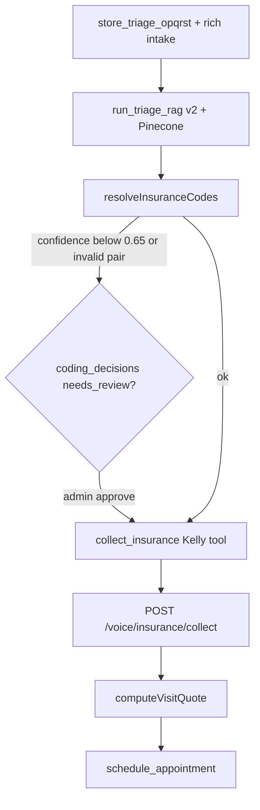

# Voice Kelly Coding Spine

> **Last reviewed:** 2026-07-10  
> **Scope:** Kelly voice agent → triage RAG → insurance collect → quote → book

This document is the canonical reference for **production voice coding orchestration** in `middleware-platform`. PDF/orchestrator flows are described in [ARCHITECTURE.md](./ARCHITECTURE.md).

---

## Golden path



Kelly must **not** pass client `service_code` on internal HTTP collect — the route resolves CPT from the triage spine via [`resolve-insurance-codes.js`](../../middleware-platform/services/resolve-insurance-codes.js).

---

## SSOT modules

| Module | Role |
|--------|------|
| [`config/coding-thresholds.js`](../../middleware-platform/config/coding-thresholds.js) | `CODING_CONFIDENCE_THRESHOLD` (0.65), HITL approved confidence, borderline window |
| [`resolve-insurance-codes.js`](../../middleware-platform/services/resolve-insurance-codes.js) | Shared resolver: harness block, confidence, pair validation, CPT spine |
| [`coding-review-service.js`](../../middleware-platform/services/coding-review-service.js) | HITL queue, approve/reject, resume meta |
| [`coding-hitl-resume.js`](../../middleware-platform/services/coding-hitl-resume.js) | Post-approval Kelly turn hints; cleared after successful collect |
| [`preventive-visit-spine.js`](../../middleware-platform/services/preventive-visit-spine.js) | Routine/no-symptoms Z00.x + preventive CPT |
| [`select-primary-codes.js`](../../middleware-platform/services/select-primary-codes.js) | **CP-05 SSOT** — ranked primary ICD/CPT/HCPCS (billing + suggest paths) |
| [`visit-codes-service.js`](../../middleware-platform/services/visit-codes-service.js) | Shared suggest path; delegates primaries to `select-primary-codes` |

---

## Environment

| Variable | Production value |
|----------|------------------|
| `CODING_SPINE_ONLY` | `1` |
| `USE_TRIAGE_RAG_V2` | `1` |
| `KELLY_RAILS_FAST_RAG` | `0` |
| `CODING_CONFIDENCE_THRESHOLD` | `0.65` (default) |
| `REMOTE_RAG_TIMEOUT_MS` | `8000` |
| `DB_PATH` | `./var/db/middleware-dev.db` (dev) |

Generate Cloud Run env: `node middleware-platform/scripts/generate-cloudrun-env-yaml.cjs`

---

## Coding path router

Tenants do not all use full RAG. See [CODING_PATH_MATRIX.md](./CODING_PATH_MATRIX.md).

- **Router SSOT:** [`resolve-visit-codes.js`](../../middleware-platform/services/resolve-visit-codes.js)
- **Dental / disabled clinic:** admin phrase map (no `run_triage_rag`)
- **Dermatology / required triage:** OPQRST → dual-source RAG

## Voice vs chat RAG (intentional)

| | Voice | Chat |
|---|-------|------|
| HyDE | Off | On (`TRIAGE_HYDE_ENABLED`) |
| Remote timeout | 2000ms | 8000ms |

Configured in [`voice-rag-config.js`](../../middleware-platform/services/voice-rag-config.js). Voice prioritizes turn latency over maximum recall. Regression: `eval:coding:prod` (nightly) uses full stack.

---

## Verification commands

From `middleware-platform/`:

```bash
# Full evidence bundle
npm run capture:coding-prod-evidence

# Kelly HTTP contract (no service_code on POST)
npm run verify:kelly-http-collect

# Post real call (manual)
npm run verify:live-call -- --session_id=<SESSION_ID>
```

See [`LIVE_CALL_CHECKLIST.md`](../../middleware-platform/var/evidence/phase1/LIVE_CALL_CHECKLIST.md).

---

## HITL admin

- Queue: `coding_decisions` where `validation_status = 'needs_review'`
- Admin UI: [`unified-dashboard/admin/coding-reviews.html`](../../unified-dashboard/admin/coding-reviews.html)
- Approve API: `POST /api/admin/coding-reviews/:id/approve`
- On approve: triage spine updated, `coding_hitl_resume_pending` meta set, Kelly rails injects collect hint on next turn

---

## Closed bypass paths (L1–L4)

- Fast-RAG synthetic writer: test-only (`triage-rag-fast-complete.js`)
- Routine `CPT_TABLE`: replaced by preventive spine
- Voice HTTP `getCptCodeForVisit` fallback: removed from collect/eligibility
- Terminal 99213 injection: removed; use `--no-assist` for agent-only E2E
