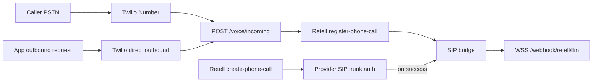
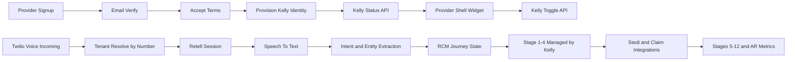
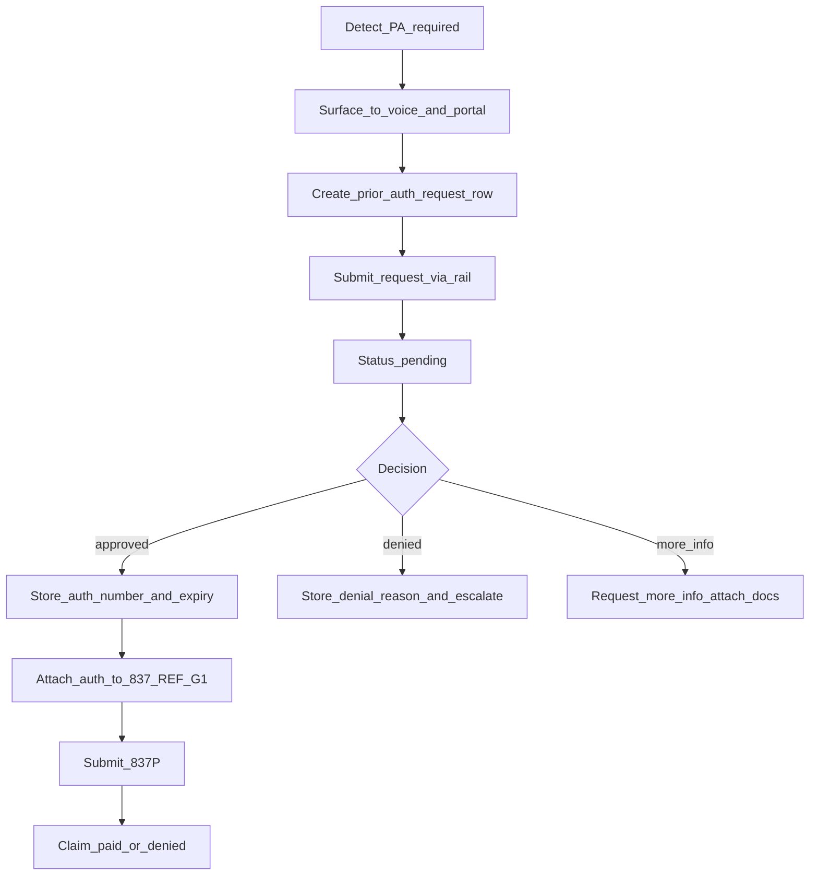
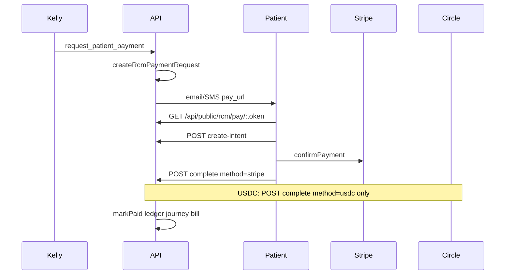

# ARCHITECTURE

**Last updated:** 2026-06-02


---

<a id="kelly-rcm-architecture"></a>

## KELLY RCM ARCHITECTURE

*Merged from `docs/RCM/KELLY_RCM_ARCHITECTURE.md` on 2026-06-02.*

# Kelly RCM Architecture

Kelly is the provider-facing virtual assistant inside a revenue-cycle-first platform. The product goal is not generic call automation; it is faster and cleaner movement of money across the patient, provider, and payor loop.

## Product contract

- Each new provider signup gets a unique Kelly identity:
  - `retell_agent_id`
  - `twilio_phone_number`
  - lifecycle status (`pending|active|paused|error`)
  - provisioning state (`requested|provisioning|ready|failed`)
- Kelly number and status must be clearly visible in the provider shell on every page.
- Providers can turn Kelly on/off with a first-class toggle.
- "Use existing number" is a custom onboarding path (support-assisted).
- The app remains RCM-first; Kelly is the orchestration interface.

## RCM pipeline alignment

RCM stages are repeatable for each new patient journey:

1. Pre-registration
2. Registration
3. Charge Capture
4. Prior Authorization (Utilization Review)
5. Medical Coding
6. Clinical Documentation Integrity (CDI)
7. Claim Submission (Delays and Denials)
8. Remittance Processing
9. Follow-up (Phone)
10. Patient Collection
11. Bill
12. Metrics: Accounts Receivable / Days

### Kelly active-management scope

Kelly must actively manage and track stages 1-4.

Stages 5-12 are integration-driven (claims, remittance, collections), with Kelly providing timeline visibility and follow-up actions.

### Provider visibility contract (2026-06)

Doctors see Kelly work and next actions without digging into logs:

| Surface | Data source | Behavior |
|---------|-------------|----------|
| Today — Kelly activity | `GET /api/kelly/activity` ← `kelly_call_events` | Live feed (30s poll): bookings, payment links, language, guardrails |
| Today — Needs action | `GET /api/rcm/journeys?status=open` | Stage chips link via `ppJourneyStageHref` |
| Patients roster | `GET /api/rcm/patient-context` | Action chip + PA badge per card |
| Collection | `POST /api/rcm/collection-queue/:id/resend` | Resend via Kelly + `recordAgentAction` |
| **Revenue hub** | `revenue.html?tab=` | Single sidebar entry; tabs: pipeline, claims, payments, work |

**Revenue hub URL contract:** `revenue.html?tab=pipeline|claims|payments|work`. Legacy pages (`rcm.html`, `billing.html?section=*`, `patient-payments.html`, `claims.html`) redirect to matching tabs. Firebase Hosting rewrites `/business/billing.html` to `/business/revenue.html?tab=payments` (see `unified-dashboard/firebase.json`); `billing.html` remains as a client redirect stub for direct file opens. `STAGE_CTA_HREF` in `provider-shell.js` targets these URLs.

Badge counts: `GET /api/rcm/metrics/health` → `metrics.revenue_badges` (sidebar aggregate + per-tab).

Shared helpers in `provider-shell.js`: `ppJourneyStageHref`, `ppJourneyStageChip`, `ppFetchKellyActivity`, `ppResendViaKelly`.

Voice latency: `KELLY_VOICE_FILLER_MS` interim reply + `KELLY_RAILS_FAST_RAG=1` on booking paths. Probe: `scripts/kelly-voice-latency-probe.cjs`.

## Current architecture (implemented baseline)

- Signup flow creates provider account and verifies email.
- Terms acceptance flow provisions:
  - Retell agent (if missing)
  - Twilio number for SaaS customers (if missing)
- Inbound voice routing maps inbound number to provider/customer and uses the mapped Retell agent.
- Provider settings already expose voice settings and Twilio visibility.

This baseline exists, but status and controls are not yet fully unified into a single canonical Kelly API and global shell widget.

## Current production state (2026-05)

### Runtime and hosting

| Surface | Host | Platform |
|---------|------|----------|
| Provider portal (SPA) | `https://callsomo.com` | Firebase Hosting |
| Middleware API | `https://api.callsomo.com` | Google Cloud Run (`somo-middleware`, `us-central1`) |

Operational deploy/rollback: [`docs/runbooks/GCP_DEPLOY_ROLLBACK_RUNBOOK.md`](../runbooks/GCP_DEPLOY_ROLLBACK_RUNBOOK.md).  
Voice transport detail: [`docs/deployment/VOICE_CURRENT_ARCHITECTURE.md`](../deployment/VOICE_CURRENT_ARCHITECTURE.md).

### Canonical voice endpoints

| Purpose | URL |
|---------|-----|
| Twilio inbound webhook | `POST https://api.callsomo.com/voice/incoming` |
| Twilio status callbacks | `POST https://api.callsomo.com/voice/status-callback` |
| Retell custom LLM (WSS) | `wss://api.callsomo.com/webhook/retell/llm` |
| Retell lifecycle events | `POST https://api.callsomo.com/webhook/retell/events` |
| Liveness (startup probe) | `GET https://api.callsomo.com/health/live` |
| Voice dependency check | `GET https://api.callsomo.com/health/voice-deps` |

Required env (production): `RETELL_API_KEY`, `RETELL_AGENT_ID`, `RETELL_LLM_WEBSOCKET_URL`, `TWILIO_*`, `BASE_URL` / `API_BASE_URL` = `https://api.callsomo.com`.  
Env generation: [`middleware-platform/scripts/generate-cloudrun-env-yaml.cjs`](../../middleware-platform/scripts/generate-cloudrun-env-yaml.cjs).

### Voice path status

| Path | Status | Notes |
|------|--------|-------|
| Inbound PSTN → Twilio → `/voice/incoming` → Retell register → SIP → custom LLM | **Operational** | Returns SIP TwiML; `retell_llm_dynamic_variables` must be strings (omit null `merchant_id`). |
| Outbound via Twilio-direct → `/voice/incoming` | **Operational** | Used by [`make-outbound-call.js`](../../middleware-platform/scripts/make-outbound-call.js) and [`POST /api/voice/outbound/call`](../../middleware-platform/routes/outbound-call.js). |
| Outbound via Retell `POST /v2/create-phone-call` (custom telephony) | **Supported with external dependency** | Fails with `telephony_provider_permission_denied` when Retell↔Twilio SIP trunk auth/URI mismatch. |

### Voice flow (production)



### Code touchpoints

| Area | Path |
|------|------|
| Inbound handler | [`middleware-platform/server.js`](../../middleware-platform/server.js) (`POST /voice/incoming`) |
| Retell LLM WebSocket | [`middleware-platform/webhooks/retell-websocket.js`](../../middleware-platform/webhooks/retell-websocket.js) |
| Retell API wrapper | [`middleware-platform/services/retell-service.js`](../../middleware-platform/services/retell-service.js) |
| Agent push to Retell | [`middleware-platform/configure-retell.js`](../../middleware-platform/configure-retell.js) |
| Outbound API | [`middleware-platform/routes/outbound-call.js`](../../middleware-platform/routes/outbound-call.js) |
| Agent inventory (verify) | [`docs/deployment/retell-agent-inventory.json`](../deployment/retell-agent-inventory.json) |

### Cloud Run scaling (voice)

Recommended production settings applied on recent revisions:

- `min-instances=2`, `concurrency=30`, startup probe `GET /health/live`
- `429 Rate exceeded` with body `Rate exceeded.` is enforced by **Cloud Run** when no container instance is available (not app rate limiting). See GCP runbook.

## Target system design



## Data model additions

- `customers`
  - `kelly_status`
  - `provisioning_state`
- `rcm_journeys`
  - journey-level lifecycle and current stage
- `rcm_journey_events`
  - append-only timeline of stage transitions and external events
- `ledger_entries` (next phase)
  - immutable financial postings with idempotency keys

## API surface (planned)

- `GET /api/kelly/status`
- `PATCH /api/kelly/toggle`
- `POST /api/kelly/provision/retry`
- `GET /api/rcm/journeys`
- `GET /api/rcm/journeys/:id`
- `GET /api/rcm/metrics/ar-days`

## Financial rails direction

North-star flow is programmable movement of value:

- patient wallet -> provider
- payor -> provider
- provider/payor -> patient (refund/reversal path)

All flows should be represented as immutable ledger entries and reconciled against claim/remittance events.

## Non-functional guardrails

- Idempotency for payment and journey events
- Replay protection for webhook/event ingestion
- Tenant isolation checks on all new Kelly and RCM endpoints
- Provisioning SLOs and observability for `pending|failed` Kelly states


---

<a id="pa-architecture"></a>

## PA ARCHITECTURE

*Merged from `docs/RCM/PA_ARCHITECTURE.md` on 2026-06-02.*

# Prior Authorization (PA) Architecture

This document is the **canonical** description of how Somo handles **insurance prior authorization**.

It intentionally separates:

1. **Detection** (is PA likely required?) — implemented today.
2. **Case workflow** (submit → pending → approve/deny → auth number) — mostly missing today.
3. **Claims attachment** (REF*G1 on 837P) — missing today.

> Note: “PA” here means **insurance prior authorization**. Stripe “payment pre-auth” is a separate concept.

---

## 1. Two PA layers: plan-level vs case-level

### 1.1 Plan-level (benefit metadata)

Plan search can return `prior_auth_required` / `prior_auth` for a benefit need. This is **not** a submitted authorization case; it is a **plan coverage flag**.

- Source: PBP ingest → coverage rollup (Medicare plan search).
- Runtime: [`middleware-platform/routes/public-plan-search.js`](../../middleware-platform/routes/public-plan-search.js)

### 1.2 Case-level (what prevents denials)

Case-level PA is the operational workflow tied to a specific:

- patient/member
- payer
- requested CPT/HCPCS
- diagnosis ICD-10
- date of service, place of service
- rendering/billing provider identifiers

Case-level PA produces an **authorization number** that must be stored and attached to the claim.

**Target system of record:** `prior_auth_requests` (to be built).

---

## 2. Current state (implemented): detection + confidence cap

### 2.1 Static CPT prior-auth rules

Static list of CPT codes that typically require PA:

- [`Knowledge/rules/prior-auth-rules.json`](../../Knowledge/rules/prior-auth-rules.json)

### 2.2 Runtime signal: `requiresPriorAuth(cptCode)`

`knowledge-service` loads the rules and exposes:

- `requiresPriorAuth(cptCode)`
- `getPhiAuthCap()` (defaults to `0.6`)

### 2.3 Coding pipeline cap: `applyPriorAuthCap()`

The coding orchestrator caps CPT confidence when PA is required but `authOnFile` is not set:

- [`middleware-platform/services/coding-orchestrator.js`](../../middleware-platform/services/coding-orchestrator.js)

This is the “denial risk” layer. It does **not** create a PA case or submit anything to payers.

### 2.4 Metadata: `requires_prior_auth` on enriched CPT suggestions

`knowledge-service.addCptMetadata()` can attach `requires_prior_auth` to CPT objects. This metadata is not consistently surfaced to patient/provider UX today.

---

## 3. Current state (implemented): payer data access (UHC read)

UHC FHIR read path can retrieve PA-related resources for a patient (read-only):

- [`middleware-platform/services/uhc-fhir-service.js`](../../middleware-platform/services/uhc-fhir-service.js) — `pullPriorAuthData()` reads:
  - `ServiceRequest` (auth requests)
  - `Task` (auth workflow status)

This is not a general multi-payer PA workflow and does not yet submit new requests.

---

## 4. Stedi scope reality (important constraint)

Stedi supports eligibility/claims/status (270/271, 837, 276/277). **Stedi does not currently support X12 278 prior authorization submission.**

This repo already documents the constraint in:

- [`docs/integrations/README.md`](../integrations/README.md) — “Stedi: ❌ No prior auth management”

Therefore, a “PA v1” that relies on Stedi must either:

1. Use Stedi for **detection signals** (271 “auth required” indicators) and for the **claims loop**, and
2. Route actual case submission to **UHC FHIR write** or a **PA partner platform**, or treat submission as **manual** while still tracking the case lifecycle in `prior_auth_requests`.

---

## 5. Target workflow (full lifecycle)



### 5.1 Status model (case-level)

Minimum statuses for `prior_auth_requests.status`:

- `pending`
- `approved`
- `denied`
- `more_info_needed`
- `cancelled`

### 5.2 “Polling” strategy (avoid constant checking)

PA decisions are typically **hours to days**. The correct approach is:

1. **Webhook first** when the rail supports it.
2. **Backoff polling job** only for `pending` rows (e.g., every 4–6 hours), and stop on terminal states.
3. Manual “refresh status” in provider portal for on-demand checks.

---

## 6. Data model (to be implemented)

### 6.1 `prior_auth_requests` table (minimum viable)

Columns (proposed):

- identity: `id`, `appointment_id`, `claim_id`, `patient_id`, `payer_id`
- request: `cpt_code`, `icd10_code`, `place_of_service`, `date_of_service`
- workflow: `submission_rail`, `status`, `tracking_number`
- approval: `auth_number`, `expiry_date`
- denial: `denial_reason`
- storage: `raw_request_json`, `raw_response_json`, `created_at`, `updated_at`

### 6.2 Appointment fields (so the patient/provider can see PA state)

Add minimal appointment fields:

- `requires_prior_auth` (boolean)
- `auth_status` (`pending|approved|denied|not_required|unknown`)
- `prior_auth_request_id` (FK/id reference)

---

## 7. Claim attachment (to be implemented)

When a PA request is **approved**, attach the auth number to the 837P.

Target behavior:

- On claim submit, look up the appointment’s approved PA.
- Attach to Loop 2300 REF segment (commonly `REF*G1`).
- If PA required but not approved, block claim submission and surface an actionable error in provider portal.

---

## 8. Surfaces and responsibilities

### 8.1 Kelly (patient voice concierge)

Target behaviors:

- If PA required: explain that scheduling/coverage depends on insurer approval and the clinic will handle it.
- Provide status updates: pending/approved/denied (without exposing PHI).

### 8.2 Provider portal

Target behaviors:

- Queue of pending PA requests, status, and required attachments.
- “Refresh status” button and escalation path for denials/more-info.
- Claim submit gated on PA approval for PA-required services.

---

## 9. Implementation workstream

See: [`STEDI_PA_WORKSTREAM.md`](./STEDI_PA_WORKSTREAM.md)


---

<a id="stedi-pa-workstream"></a>

## STEDI PA WORKSTREAM

*Merged from `docs/RCM/STEDI_PA_WORKSTREAM.md` on 2026-06-02.*

# Stedi + Prior Authorization Workstream

This document scopes what we can complete with **Stedi** in the PA/claims workflow, and what must be routed to other rails.

## Key constraint

Stedi supports core EDI transactions for eligibility, claims, and claim status (270/271, 837, 276/277). **Stedi does not currently support X12 278 prior authorization submission.**

Implication: the “Stedi part” of PA v1 is:

1. Improve **PA detection** using eligibility response signals (271).
2. Build **PA case tracking** (`prior_auth_requests`) and surface status in UX.
3. Complete the **claims loop** to payers via Stedi (837 submit + webhook + polling).
4. Gate claim submission on approved PA and attach auth number when present.

Actual electronic PA submission must use:

- UHC FHIR write (UHC members), and/or
- a PA partner platform (Availity / Coverage Gorilla / other) with portal fallback, and/or
- manual submission with tracked status.

---

## 1. What Stedi can do for PA v1

### 1.1 Detect “PA required?” from 271 / eligibility

Stedi’s eligibility JSON can include benefit detail fields such as `authOrCertIndicator` (payer-specific). This is a **requirement signal**, not a case decision.

Docs references:

- Stedi guide (Oct 29, 2025): https://www.stedi.com/blog/how-to-check-for-prior-authorization-requirements-in-a-271-eligibility-response
- Stedi API reference: https://www.stedi.com/docs/healthcare/api-reference/post-healthcare-eligibility

What to look for in the response:

- `benefitsInformation[].authOrCertIndicator`:
  - `Y` = prior auth required
  - `N` = not required
  - `U` = unknown (payer needs more context; check free-text notes)
- Optional free-text notes:
  - `benefitsInformation[].additionalInformation[].description` may contain precert/prior-auth rules

Implementation targets:

- Extend [`middleware-platform/services/stedi-271-parser.js`](../../middleware-platform/services/stedi-271-parser.js) to parse and normalize:
  - `prior_auth_indicator`: `Y|N|U` (unknown)
  - optional mapping to the requested `procedureCode` / `serviceTypeCodes`
- Persist on `eligibility_checks` (new columns or JSON payload)

Exit criteria:

- A test matrix showing example eligibility responses for a few payers/CPTs.

Suggested initial test matrix (update with real payer IDs and sandbox members):

| payer_id | member_id | CPT | STC | Expected |
|----------|-----------|-----|-----|----------|
| (TBD) | (TBD) | 93306 | 30 | Y/N/U |
| (TBD) | (TBD) | 70551 | 30 | Y/N/U |
| (TBD) | (TBD) | 90834 | MH | Y/N/U + notes |

### 1.2 Claims submission and status (already present but needs completion)

Existing building blocks:

- [`middleware-platform/services/insurance-service.js`](../../middleware-platform/services/insurance-service.js)
  - `checkEligibility()` (270/271)
  - `submitClaim()` (837P/837I depending on `STEDI_CLAIM_SUBMISSION_MODE`)
  - `checkClaimStatus()` (276/277-style)
- Claim status webhook:
  - [`middleware-platform/routes/stedi-webhooks.js`](../../middleware-platform/routes/stedi-webhooks.js) (`/webhooks/stedi/claim-status`)
- Polling script fallback:
  - [`middleware-platform/scripts/poll-claim-statuses.cjs`](../../middleware-platform/scripts/poll-claim-statuses.cjs)

**Provider submit (implemented):** `POST /api/claims/:id/submit-payment` calls `InsuranceService.submitExistingClaim()` — 837 translate, Stedi Healthcare `raw-x12-submission` when `STEDI_API_KEY` is set, eligibility re-verify (30-day grace), PA gate, and `x12_claim_id` persistence.

### 1.3 Stedi Test Mode (local / sandbox)

Eligibility uses **Healthcare API v3 JSON** (`POST .../eligibility/v3`) with the request body sent **directly** (not wrapped in `{ json: ... }` — that shape is only for legacy translate on `core.us.stedi.com`).

**Scripts:**

| Script | Purpose |
|--------|---------|
| `node scripts/stedi-test-mode-probe.cjs` | DNS + eligibility v3 scenarios; reports `eligibilityApproved` |
| `node scripts/stedi-sandbox-integration.cjs` | Full audit (270/271, reverify, 837, gateway, 278/835/275 stubs) |

**Required `.env` (test key):**

```env
STEDI_API_KEY=test_...
STEDI_TEST_MODE=1
STEDI_API_BASE=https://core.us.stedi.com
STEDI_HEALTHCARE_BASE=https://healthcare.us.stedi.com
STEDI_CLAIM_SUBMISSION_MODE=professional
STEDI_TEST_PAYER_ID=STEDI
STEDI_TEST_MEMBER_ID=0000000001
```

**Pass criteria:** `stedi-sandbox-integration.cjs` marks 270/271 **PASS** only when `stediFallback` is false (real Stedi response, not simulation).

### Verified in sandbox (2026-05-26)
- **Eligibility (270/271):** Works via Stedi Healthcare **eligibility v3** (`POST .../eligibility/v3`) and requires the app to send the correct subscriber identity (patient name + DOB).
- **Reverify at submit:** Runs the eligibility re-check before claim submission (30-day grace window).
- **Provider submit loop:** 837 translate + claim row persistence works; in Test Mode, healthcare submit may still be denied (so `healthcareSubmitted=false` / `stediFallback=true` can occur).
- **276/277 status:** Polling returns a status and updates claim rows (full paid/remittance details depend on real Stedi claim status + 835 events).

---

## 2. What Stedi cannot do (must not be implied)

- Submit X12 278 prior authorization requests.
- Provide a general multi-payer PA case status stream for authorization cases.
- Replace payer portals for PA attachments and documentation requirements.

These limitations must be stated in:

- [`docs/RCM/PA_ARCHITECTURE.md`](./PA_ARCHITECTURE.md)
- [`docs/integrations/README.md`](../integrations/README.md)

---

## 3. Task list (Stedi workstream)

### Task 0 — Verify Stedi eligibility PA signals

Document the shape of Stedi eligibility responses for PA signals:

- confirm whether `authOrCertIndicator` appears in `benefitsInformation[]` for sandbox data
- confirm how the indicator relates to `procedureCode` vs `serviceTypeCodes`

Implementation/verification status:
- `services/stedi-271-parser.js` parses `authOrCertIndicator` into `prior_auth_indicator` and captures related notes into `prior_auth_notes`.
- `insurance-service.js` stores the indicator/notes on `eligibility_checks` from the v3 JSON eligibility response.
- `PUT /api/patient/insurance` now re-runs eligibility using the loaded FHIR patient's `name` + `birthDate` (prevents Stedi AAA 71 DOB-mismatch caused by defaults).

### Task 1 — Parse and store 271 PA indicators

- Implement parser output fields and persist them on `eligibility_checks`.
- Expose the new fields in the eligibility responses returned to Kelly / provider flows.

### Task 2 — Build PA case tracking tables

- Add `prior_auth_requests`.
- Add appointment-level fields: `requires_prior_auth`, `auth_status`, `prior_auth_request_id`.

### Task 3 — Complete Stedi claims loop from provider portal

- Wire provider “Submit claim” to call `InsuranceService.submitClaim()` (or `PayerGatewayService.submitClaim()`).
- Keep the DB-only status flip endpoint only for “internal workflow” if still needed, but do not label it as payer submission.

### Task 4 — Attach auth number to 837 (when approved)

- On claim submit: if PA approved → attach auth number (e.g., REF*G1) to the claim envelope.
- If PA required but not approved → block submission with clear error.

### Task 5 — Ops runbook (production)

Maintain the Stedi production checklist in:

- [`docs/deployment/RENDER_PRODUCTION_CHECKLIST.md`](../deployment/RENDER_PRODUCTION_CHECKLIST.md)

Key env vars:

- `STEDI_API_KEY`
- `STEDI_API_BASE`
- `STEDI_CLAIM_SUBMISSION_MODE=professional`
- `STEDI_WEBHOOK_SECRET`

Manual steps:

- Stedi webhook registration to `/webhooks/stedi/claim-status`

- Stedi webhook signature (optional, recommended):
  - If `STEDI_WEBHOOK_SECRET` is set, the server verifies HMAC-SHA256 using the header `x-stedi-signature` (or `stedi-signature`).

---

- Stedi webhook registration to `/webhooks/stedi/remittance-advice` (835):
  - Expected behavior:
    - Updates `insurance_claims.remittance_835_*` columns (`received_at`, `paid_amount`, `adjustment_reason`)
    - Stores full captured detail in `insurance_claims.remittance_835_detail`
    - Stores a lightweight 835 summary under `insurance_claims.response_data.remittance_835`
  - Note: ERA/835 ingestion remains webhook-driven in this Phase-1 implementation.

- Prior authorization status events to `/webhooks/stedi/prior-auth-status`:
  - Phase-1 behavior:
    - Best-effort maps the decision into the matching `prior_auth_requests` row (using any available identifiers: `priorAuthRequestId`, `tracking_number`, `appointment_id`, `claim_id`, `stedi_correlation_id`).
    - Updates the linked `appointments` PA fields so claims can pass the PA gate.
    - Persists the full raw decision payload into `prior_auth_requests.raw_response_json`.

---

When to use webhooks vs polling (fallback rules):
1. If webhooks are live for `claim-status` and `remittance-advice`, keep polling at low-frequency sanity-check levels (or disable).
2. If webhooks are missing/unreliable, polling restores eventual consistency for:
   - submitted/processing claim status transitions (276/277-style)
   - 835 reconciliation remains partially placeholder until Phase-2 polling/ingest is fully implemented.

Background job schedules (recommended starting points):
- `scripts/poll-claim-statuses.cjs`
  - Run every 15 minutes
  - Poll claims in `submitted`/`processing` older than 24 hours (override with `--hours`)
- `scripts/poll-remittance-advice.cjs`
  - Run daily (log-only placeholder); real 835 ingest is via `/webhooks/stedi/remittance-advice`
- `scripts/poll-prior-auth-statuses.cjs`
  - Stub/no-op placeholder for Phase-2 rail polling; keep off (or run manually during bring-up)

---

## 4. Phase 2 rails (outside Stedi)

- UHC FHIR write path: POST `ServiceRequest`, poll `Task` (UHC members)
- PA partner platform adapter (portal fallback, attachments)


---

<a id="rcm-e2e-test-flow"></a>

## RCM E2E TEST FLOW

*Merged from `docs/RCM/RCM_E2E_TEST_FLOW.md` on 2026-06-02.*

# RCM end-to-end test flow

This document describes how to verify the full 11-stage revenue cycle (provider portal, patient wallet, Stedi eligibility, and payment rails).

## Environment checklist

### Stedi (Phase 1 gate)

```bash
cd middleware-platform
node scripts/stedi-test-mode-probe.cjs   # copy recommendedEnv into .env
node scripts/stedi-sandbox-integration.cjs   # 270/271 must PASS (no stediFallback)
```

Required variables (see also `docs/RCM/STEDI_PA_WORKSTREAM.md`):

| Variable | Purpose |
|----------|---------|
| `STEDI_API_KEY` | Stedi Healthcare API key (`test_` for sandbox) |
| `STEDI_TEST_MODE=1` | Force sandbox test identity |
| `STEDI_TEST_PAYER_ID` | Trading partner id (e.g. `STEDI` or `60054`) |
| `STEDI_TEST_MEMBER_ID` | Sandbox member id |
| `STEDI_TEST_DOB` | `YYYY-MM-DD` matching Stedi test member |
| `STEDI_TEST_SUBSCRIBER_FIRST` / `STEDI_TEST_SUBSCRIBER_LAST` | Subscriber name |
| `STEDI_TEST_PROVIDER_NPI` | Provider NPI for eligibility |

Demo payer aliases (`UHC`, `BCBS`, `AETNA`) are mapped to `STEDI_TEST_PAYER_ID` in test mode. **Do not** send bare demo ids to Stedi in production.

AAA codes **79** (invalid participant) and **71** (DOB mismatch) appear in eligibility API responses as `aaa_codes` / `aaa_messages`.

### API E2E server profile

| Variable | Value |
|----------|--------|
| `DEV_LIGHT_START=1` | Skip heavy post-listen workers |
| `SKIP_STARTUP_MIGRATIONS=1` | Faster startup for local E2E |
| `FACE_READ_AUTO_START=0` | Avoid background face-read worker |
| `RCM_E2E_SKIP_GATES=1` | Optional gate bypass for scripts |

### Payment rails (optional live paths)

| Variable | Purpose |
|----------|---------|
| `STRIPE_SECRET_KEY` / `STRIPE_PUBLISHABLE_KEY` | Card on `patients/pay.html` |
| `RCM_E2E_STRIPE_LIVE=1` | Money path probes Stripe intent |
| `CIRCLE_*` + `RCM_E2E_USDC_LIVE=1` | USDC settlement path |
| `PUBLIC_PAY_BASE_URL` | Base URL for `/patients/pay.html?token=` links |
| `RCM_PAY_PROBE_CIRCLE_BALANCE=1` | Show USDC balance on pay page |

See also: [RCM_PATIENT_PAY_GATEWAY.md](./RCM_PATIENT_PAY_GATEWAY.md) (Kelly `request_patient_payment` flow).

## Automated test commands

```bash
cd middleware-platform
node scripts/stedi-sandbox-integration.cjs
npm run test:rcm
npm run test:e2e:rcm:all
npm run test:e2e:rcm:playwright
npm run test:e2e:rcm:pay-ui
```

Kelly agentic pay gateway (tool only — no conversation):

```bash
RCM_E2E_USE_EXISTING_SERVER=1 npm run test:e2e:rcm:pay-gateway
RCM_E2E_STRIPE_LIVE=1 RCM_E2E_USE_EXISTING_SERVER=1 npm run test:e2e:rcm:pay-gateway
```

Kelly **conversation** diagnostic (multi-turn `processTurn` — derm → book → copay → pay):

```bash
# Requires ANTHROPIC_API_KEY or GROQ_API_KEY
RCM_E2E_USE_EXISTING_SERVER=1 npm run test:e2e:rcm:conversation
RCM_E2E_STRIPE_LIVE=1 RCM_E2E_USE_EXISTING_SERVER=1 npm run test:e2e:rcm:conversation
```

See scorecard and failure categories in [RCM_PATIENT_PAY_GATEWAY.md](./RCM_PATIENT_PAY_GATEWAY.md#conversation-e2e--scorecard-interpretation-2026-05-31-run).

## Manual UI verification

### Provider

1. Log in at `/business/login.html` (demo: `provider@callsomo.com` / `demo123`).
2. **RCM Command Center** (`/business/rcm.html`) — stage labels, collection queue, recently paid.
3. **Patient Payments** (`/business/patient-payments.html`) — paid rows, journey stage labels, copy pay link.

### Patient

1. **Wallet** (`/patients/wallet.html`) — **Bills & claims** card shows status chips and pay link when due.
2. **Pay link** (`/patients/pay.html?token=…`) — card/USDC rails; Stripe `return_url` set for 3DS.

## 11-stage API golden path

Stages (orchestrator contract): pre_registration → registration → charge_capture → prior_authorization → medical_coding → cdi → claim_submission → remittance_processing → follow_up_phone → patient_collection → bill.

`scripts/e2e-rcm-golden-path.cjs` advances each stage via:

- `POST /api/rcm/journeys/start`
- `POST /api/rcm/journeys/:id/events` with `stage_to`
- `PATCH /api/rcm/journeys/:id` (close)

## Money path

`scripts/rcm-e2e-money-path.cjs`:

1. `POST /api/rcm/payments/request` → `pay_token`, `pay_url`
2. Default: `POST /api/rcm/payments/:id/mark-paid`
3. Optional: public pay USDC/Stripe when live env flags set

## Stedi success criteria

In the Stedi dashboard, eligibility for the configured test member should show **Succeeded**, not **Failed 79/71**, after env + payer mapping fixes.

## Troubleshooting

| Symptom | Likely cause |
|---------|----------------|
| Failed **79** | Wrong `tradingPartnerServiceId` (demo payer id sent raw) |
| Failed **71** | DOB mismatch — use FHIR `birthDate` or `STEDI_TEST_DOB` |
| Registration gate | No `eligibility_checks` row — run eligibility or E2E `skip_gates` |
| Login timeout on E2E | Start server with `DEV_LIGHT_START=1` |


---

<a id="rcm-patient-pay-gateway"></a>

## RCM PATIENT PAY GATEWAY

*Merged from `docs/RCM/RCM_PATIENT_PAY_GATEWAY.md` on 2026-06-02.*

# RCM patient pay gateway (Kelly-initiated)

> **Last reviewed:** 2026-05-31

Kelly creates a secure pay link; the patient pays on [`unified-dashboard/patients/pay.html`](../../unified-dashboard/patients/pay.html); settlement runs via **Stripe (card)** or **Circle (USDC)**.

## Flow



## Kelly tool

| Tool | When |
|------|------|
| `request_patient_payment` | Copay or balance due after eligibility / RCM journey |
| `create_appointment_checkout` | **New appointment** checkout only (different page: `/payment/:token`) |

**Never** collect card numbers on the call. Kelly sends a link and asks the patient to open it.

### Tool args

- `amount` — optional if journey `amount_due` or eligibility `copay_amount` exists
- `journey_id`, `patient_id`
- `patient_email`, `patient_phone`
- `delivery` — `email` | `sms` | `both`

## Public pay API

Mounted at `/api/public/rcm` ([`routes/rcm-public.js`](../../middleware-platform/routes/rcm-public.js)).

| Method | Path | Purpose |
|--------|------|---------|
| GET | `/pay/:token` | Context + rails |
| POST | `/pay/:token/create-intent` | Stripe PaymentIntent |
| POST | `/pay/:token/complete` | `{ method: "stripe", payment_intent_id }` or `{ method: "usdc" }` |

Amounts in API responses are **dollars** (not cents).

## Environment

| Variable | Purpose |
|----------|---------|
| `STRIPE_SECRET_KEY` / `STRIPE_PUBLISHABLE_KEY` | Card rail |
| `CIRCLE_*` | USDC rail |
| `PUBLIC_PAY_BASE_URL` | Pay link host (prod: `https://api.callsomo.com`) |
| `RCM_PAY_PROBE_CIRCLE_BALANCE=1` | Show USDC balance on pay page |
| `RCM_E2E_STRIPE_LIVE=1` | Live Stripe in gateway E2E |
| `RCM_E2E_USDC_LIVE=1` | Live USDC in gateway E2E |
| `RCM_E2E_PATIENT_ID` | FHIR patient id for USDC tests |

### Kelly conversation E2E (visit + pay rails)

| Variable | Purpose |
|----------|---------|
| `KELLY_E2E_SKIP_TRIAGE=1` | Relax Kelly RAG confidence/differential gates when fixture sets `kelly_e2e_skip_triage=1` — **Kelly only** |
| `RCM_E2E_SKIP_GATES=1` | Skip RCM journey stage gates in HTTP API — **does not unlock Kelly slots** |
| `KELLY_E2E_VISIT_ONLY=1` | Run conversation E2E T1–T4 only (visit line exit) |
| `RCM_E2E_WALLET_TEST=1` | Run wallet bill-status stage with seeded patient session |

Fixtures: [`e2e/helpers/kelly-conversation-fixtures.cjs`](../../middleware-platform/e2e/helpers/kelly-conversation-fixtures.cjs)

| Script | npm command |
|--------|-------------|
| Visit line F1a | `test:e2e:kelly:visit` |
| Booking fixture F1b | `test:e2e:kelly:booking-fixture` |
| Pay fixture F1c | `test:e2e:kelly:pay-fixture` |
| Full conversation F2 | `test:e2e:rcm:conversation` |
| **Browser golden path** | `test:e2e:kelly:golden` |

See also [`todos/pending/KELLY_CONVERSATION_RAILS_TODOS.md`](../../todos/pending/KELLY_CONVERSATION_RAILS_TODOS.md).

### Playwright browser golden path

Chains **`triage.html`** (T1–T6) → real **`pay_token`** from DB → **`pay.html`** live Stripe.

| Script | npm command | What it proves |
|--------|-------------|----------------|
| **Golden path (full)** | `test:e2e:kelly:golden` | Browser triage chat → pay token → `pay.html` settlement |
| **Visit only** | `test:e2e:kelly:golden:visit` | T1–T4 on `triage.html` only |
| **Skip triage** | `test:e2e:kelly:golden:skip-triage` | Booking-ready fixture → T3+ |

```bash
# Server on :4000 with chat enabled + LLM keys (dotenv loads .env automatically)
FEATURE_PATIENT_CHAT_ENABLED=1 npm start
PW_API_BASE_URL=http://127.0.0.1:4000 npm run test:e2e:kelly:golden:visit

# Full chain with live Stripe
RCM_E2E_STRIPE_LIVE=1 STRIPE_SECRET_KEY=sk_test_... \
  PW_API_BASE_URL=http://127.0.0.1:4000 npm run test:e2e:kelly:golden
```

Scorecard: `playwright-report/kelly-golden-path-report.json`. Auth: `localStorage.patient_session_id` (not cookies).

Seed Circle test wallets: `node scripts/seed-rcm-circle-test.cjs`

## Test commands

Two E2E layers — do not confuse them:

| Script | npm command | What it proves |
|--------|-------------|----------------|
| **Tool gateway** | `test:e2e:rcm:pay-gateway` | `KellyToolExecutor.execute('request_patient_payment')` → pay link → optional Stripe/USDC |
| **Conversation diagnostic** | `test:e2e:rcm:conversation` | Full multi-turn `KellyAgentService.processTurn` (derm → book → copay → pay) |
| **Pay UI (mocked)** | `test:e2e:rcm:pay-ui` | Playwright on `pay.html` (no LLM) |
| **Browser golden path** | `test:e2e:kelly:golden` | Playwright `triage.html` → `pay.html` with real pay token |

```bash
cd middleware-platform
npm start   # :4000, DEV_LIGHT_START=1 recommended

# Mocked Playwright (no secrets)
npm run test:e2e:rcm:pay-ui

# Kelly tool → API golden path (no conversation)
RCM_E2E_USE_EXISTING_SERVER=1 npm run test:e2e:rcm:pay-gateway

# Full agentic conversation diagnostic (needs LLM keys)
RCM_E2E_USE_EXISTING_SERVER=1 npm run test:e2e:rcm:conversation

# Live Stripe money (gateway or conversation)
RCM_E2E_USE_EXISTING_SERVER=1 RCM_E2E_STRIPE_LIVE=1 npm run test:e2e:rcm:pay-gateway
RCM_E2E_USE_EXISTING_SERVER=1 RCM_E2E_STRIPE_LIVE=1 npm run test:e2e:rcm:conversation

# Live USDC money
RCM_E2E_USE_EXISTING_SERVER=1 RCM_E2E_USDC_LIVE=1 RCM_E2E_PATIENT_ID=Patient/... npm run test:e2e:rcm:pay-gateway
```

### Conversation E2E — scorecard interpretation (2026-05-31 run)

Script: [`e2e-kelly-rcm-pay-conversation.cjs`](../../middleware-platform/scripts/e2e-kelly-rcm-pay-conversation.cjs)

**Result:** 67% (8/12 non-skipped stages passed). Exit code 1.

| Stage | Result | Category |
|-------|--------|----------|
| Bootstrap + DB seed | PASS | — |
| Turn 1–2 derm intake | PASS | Kelly in skincare intake phase |
| Turn 3 availability | **FAIL** | **Product gap** — Kelly loops skin-type intake instead of `get_available_slots` |
| Turn 4 booking | **FAIL** | Blocked by Turn 3 |
| Turn 5 copay question | PASS | Conversational only; no eligibility tool called |
| Turn 6 pay now | **FAIL** | **Product gap** — Kelly did not call `request_patient_payment` |
| Pay link GET | **FAIL** | Downstream of Turn 6 |
| Live Stripe settlement | SKIP | Set `RCM_E2E_STRIPE_LIVE=1` |
| Wallet bill-status | SKIP | **Auth gap** — `requirePatientSession`, no test bypass |
| Webhook + receipt wiring | PASS | Static checks |
| Provider payment list | SKIP | No `payment_id` from conversation |

**Gaps to fix (product):**

1. **Phase routing** — Intake phase must yield to booking when patient asks for appointments (`get_available_slots`).
2. **Billing phase** — When patient asks to pay copay, Kelly must invoke `request_patient_payment` (prompt exists in `kelly-prompt-builder.js` but LLM did not call tool).
3. **No tools invoked** — Entire run had `toolsUsed=[]`; investigate orchestrator phase / tool list exposure for voice channel.

**Known skips (documented, not bugs):**

- Patient wallet API requires login.
- Live money requires `RCM_E2E_STRIPE_LIVE=1`.

## Money lands where

| Rail | Gateway | Provider receipt |
|------|---------|------------------|
| Stripe | Platform Stripe account (test/live) | RCM ledger + `rcm_payments` |
| USDC | Circle transfer patient → clinic wallet | `circle_transfer_id` on payment row |

Stripe Connect (clinic bank payout) is not in this sprint.

## Related

- [RCM_E2E_TEST_FLOW.md](./RCM_E2E_TEST_FLOW.md)
- [ENVIRONMENT_VARIABLES_BY_SURFACE.md](../setup/ENVIRONMENT_VARIABLES_BY_SURFACE.md)


---

<a id="rcm-ledger-rollback"></a>

## RCM LEDGER ROLLBACK

*Merged from `docs/RCM/RCM_LEDGER_ROLLBACK.md` on 2026-06-02.*

# RCM ledger migration rollback (G2)

> **Last reviewed:** 2026-05-29

## Scope

Tables: `rcm_payments`, `rcm_journeys`, `rcm_journey_events`, `ledger_entries`, `copay_payments`

## Pre-deploy checklist

1. Snapshot SQLite: `cp middleware-dev.db middleware-dev.db.bak-$(date +%Y%m%d)`
2. Run migrations on staging copy first
3. Verify `npm run test:rcm` and `__tests__/rcm-payment-idempotency.test.js`

## Rollback procedure

1. Stop middleware processes using the DB
2. Restore DB snapshot from backup
3. Revert application code to previous release tag
4. Confirm no orphaned `rcm_payments` without matching `ledger_entries` via:

```sql
SELECT p.id FROM rcm_payments p
LEFT JOIN ledger_entries l ON l.reference_id = p.id
WHERE p.status = 'paid' AND l.id IS NULL;
```

## Idempotency policy (G1)

- Journey events: `dedupe_key` on `rcm_journey_events` — duplicate append returns `{ deduped: true }`
- Payment settlement: Stripe webhook handler must check payment status before second `markPaid`
- Kelly `request_patient_payment`: one open `rcm_payments` row per journey stage transition

## SLO notes (G4)

- Kelly provisioning: monitor `GET /api/kelly/status` latency + `provisioning_state=failed` rate
- Alert when Kelly toggle PATCH error rate > 1% over 15m


---

<a id="voice-vs-rcm-tables"></a>

## VOICE VS RCM TABLES

*Merged from `docs/RCM/VOICE_VS_RCM_TABLES.md` on 2026-06-02.*

# Voice SaaS tables vs RCM / financial tables

> **Last reviewed:** 2026-05-29 (W4-05)

## Separation

| Domain | Tenant key | Default merchant fallback |
|--------|------------|---------------------------|
| **Somo voice SaaS** | `customers.id`, `merchants.id` for settings | Must **not** use `akin-dunbar` for authenticated SaaS owners |
| **RCM / coding / payor** | `clinics`, `merchants` (commerce), payor registry | Legacy demo merchant may exist for codebook eval — do not wire voice settings to it |

## Voice SaaS (see Database docs)

- `customers`, `voice_agent_settings`, `voice_call_log`, `voice_call_states`
- Twilio/Retell columns on `customers`

## RCM / financial (examples)

- `prior_auth_requests`, payor `provider_*` tables, reconciliation, `merchant_orders` for commerce checkout
- Medical code tables: `icd10_codes`, `cpt_codes`, embeddings

## Rule

RCM routes and voice agent settings must not share a **default** `merchant_id` fallback. Voice resolves tenant from `req.customer` or explicit `customer_id` on webhooks.

## Related

- [TENANT_MODEL.md](../Database/TENANT_MODEL.md)
- [Medical Coding/ARCHITECTURE.md](../Medical%20Coding/ARCHITECTURE.md)
