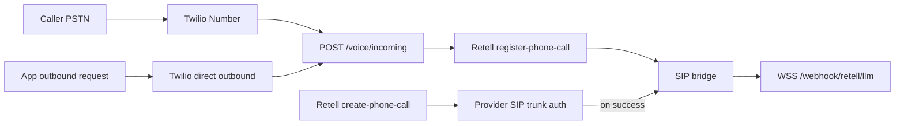
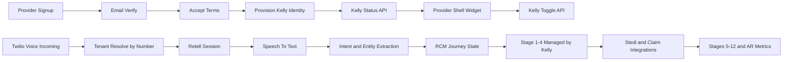

# Kelly RCM Architecture

Kelly is the provider-facing virtual assistant inside a revenue-cycle-first platform. The product goal is not generic call automation; it is faster and cleaner movement of money across the patient, provider, and payor loop.

## Product contract

- Each new provider signup gets a unique Kelly identity:
  - `retell_agent_id`
  - `twilio_phone_number`
  - lifecycle status (`pending|active|paused|error`)
  - provisioning state (`requested|provisioning|ready|failed`)
- Kelly number and status must be clearly visible in the provider shell on every page.
- Providers can turn Kelly on/off with a first-class toggle.
- "Use existing number" is a custom onboarding path (support-assisted).
- The app remains RCM-first; Kelly is the orchestration interface.

## RCM pipeline alignment

RCM stages are repeatable for each new patient journey:

1. Pre-registration
2. Registration
3. Charge Capture
4. Prior Authorization (Utilization Review)
5. Medical Coding
6. Clinical Documentation Integrity (CDI)
7. Claim Submission (Delays and Denials)
8. Remittance Processing
9. Follow-up (Phone)
10. Patient Collection
11. Bill
12. Metrics: Accounts Receivable / Days

### Kelly active-management scope

Kelly must actively manage and track stages 1-4.

Stages 5-12 are integration-driven (claims, remittance, collections), with Kelly providing timeline visibility and follow-up actions.

## Current architecture (implemented baseline)

- Signup flow creates provider account and verifies email.
- Terms acceptance flow provisions:
  - Retell agent (if missing)
  - Twilio number for SaaS customers (if missing)
- Inbound voice routing maps inbound number to provider/customer and uses the mapped Retell agent.
- Provider settings already expose voice settings and Twilio visibility.

This baseline exists, but status and controls are not yet fully unified into a single canonical Kelly API and global shell widget.

## Current production state (2026-05)

### Runtime and hosting

| Surface | Host | Platform |
|---------|------|----------|
| Provider portal (SPA) | `https://myskinandcare.com` | Firebase Hosting |
| Middleware API | `https://api.myskinandcare.com` | Google Cloud Run (`myskin-middleware`, `us-central1`) |

Operational deploy/rollback: [`docs/runbooks/GCP_DEPLOY_ROLLBACK_RUNBOOK.md`](../runbooks/GCP_DEPLOY_ROLLBACK_RUNBOOK.md).  
Voice transport detail: [`docs/deployment/VOICE_CURRENT_ARCHITECTURE.md`](../deployment/VOICE_CURRENT_ARCHITECTURE.md).

### Canonical voice endpoints

| Purpose | URL |
|---------|-----|
| Twilio inbound webhook | `POST https://api.myskinandcare.com/voice/incoming` |
| Twilio status callbacks | `POST https://api.myskinandcare.com/voice/status-callback` |
| Retell custom LLM (WSS) | `wss://api.myskinandcare.com/webhook/retell/llm` |
| Retell lifecycle events | `POST https://api.myskinandcare.com/webhook/retell/events` |
| Liveness (startup probe) | `GET https://api.myskinandcare.com/health/live` |
| Voice dependency check | `GET https://api.myskinandcare.com/health/voice-deps` |

Required env (production): `RETELL_API_KEY`, `RETELL_AGENT_ID`, `RETELL_LLM_WEBSOCKET_URL`, `TWILIO_*`, `BASE_URL` / `API_BASE_URL` = `https://api.myskinandcare.com`.  
Env generation: [`middleware-platform/scripts/generate-cloudrun-env-yaml.cjs`](../../middleware-platform/scripts/generate-cloudrun-env-yaml.cjs).

### Voice path status

| Path | Status | Notes |
|------|--------|-------|
| Inbound PSTN → Twilio → `/voice/incoming` → Retell register → SIP → custom LLM | **Operational** | Returns SIP TwiML; `retell_llm_dynamic_variables` must be strings (omit null `merchant_id`). |
| Outbound via Twilio-direct → `/voice/incoming` | **Operational** | Used by [`make-outbound-call.js`](../../middleware-platform/scripts/make-outbound-call.js) and [`POST /api/voice/outbound/call`](../../middleware-platform/routes/outbound-call.js). |
| Outbound via Retell `POST /v2/create-phone-call` (custom telephony) | **Supported with external dependency** | Fails with `telephony_provider_permission_denied` when Retell↔Twilio SIP trunk auth/URI mismatch. |

### Voice flow (production)

### Code touchpoints

| Area | Path |
|------|------|
| Inbound handler | [`middleware-platform/server.js`](../../middleware-platform/server.js) (`POST /voice/incoming`) |
| Retell LLM WebSocket | [`middleware-platform/webhooks/retell-websocket.js`](../../middleware-platform/webhooks/retell-websocket.js) |
| Retell API wrapper | [`middleware-platform/services/retell-service.js`](../../middleware-platform/services/retell-service.js) |
| Agent push to Retell | [`middleware-platform/configure-retell.js`](../../middleware-platform/configure-retell.js) |
| Outbound API | [`middleware-platform/routes/outbound-call.js`](../../middleware-platform/routes/outbound-call.js) |
| Agent inventory (verify) | [`docs/deployment/retell-agent-inventory.json`](../deployment/retell-agent-inventory.json) |

### Cloud Run scaling (voice)

Recommended production settings applied on recent revisions:

- `min-instances=2`, `concurrency=30`, startup probe `GET /health/live`
- `429 Rate exceeded` with body `Rate exceeded.` is enforced by **Cloud Run** when no container instance is available (not app rate limiting). See GCP runbook.

## Target system design

## Data model additions

- `customers`
  - `kelly_status`
  - `provisioning_state`
- `rcm_journeys`
  - journey-level lifecycle and current stage
- `rcm_journey_events`
  - append-only timeline of stage transitions and external events
- `ledger_entries` (next phase)
  - immutable financial postings with idempotency keys

## API surface (planned)

- `GET /api/kelly/status`
- `PATCH /api/kelly/toggle`
- `POST /api/kelly/provision/retry`
- `GET /api/rcm/journeys`
- `GET /api/rcm/journeys/:id`
- `GET /api/rcm/metrics/ar-days`

## Financial rails direction

North-star flow is programmable movement of value:

- patient wallet -> provider
- payor -> provider
- provider/payor -> patient (refund/reversal path)

All flows should be represented as immutable ledger entries and reconciled against claim/remittance events.

## Non-functional guardrails

- Idempotency for payment and journey events
- Replay protection for webhook/event ingestion
- Tenant isolation checks on all new Kelly and RCM endpoints
- Provisioning SLOs and observability for `pending|failed` Kelly states
