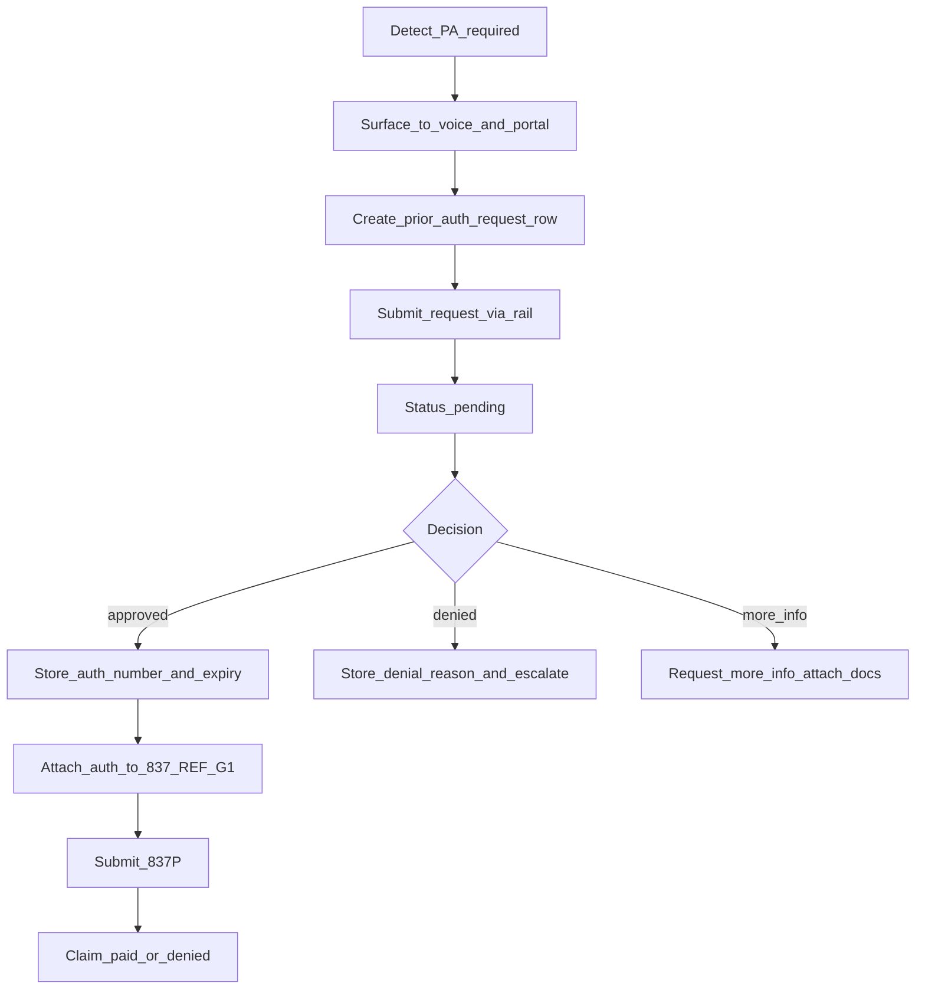

# Prior Authorization (PA) Architecture

This document is the **canonical** description of how DocLittle handles **insurance prior authorization**.

It intentionally separates:

1. **Detection** (is PA likely required?) — implemented today.
2. **Case workflow** (submit → pending → approve/deny → auth number) — mostly missing today.
3. **Claims attachment** (REF*G1 on 837P) — missing today.

> Note: “PA” here means **insurance prior authorization**. Stripe “payment pre-auth” is a separate concept.

---

## 1. Two PA layers: plan-level vs case-level

### 1.1 Plan-level (benefit metadata)

Plan search can return `prior_auth_required` / `prior_auth` for a benefit need. This is **not** a submitted authorization case; it is a **plan coverage flag**.

- Source: PBP ingest → coverage rollup (Medicare plan search).
- Runtime: [`middleware-platform/routes/public-plan-search.js`](../../middleware-platform/routes/public-plan-search.js)

### 1.2 Case-level (what prevents denials)

Case-level PA is the operational workflow tied to a specific:

- patient/member
- payer
- requested CPT/HCPCS
- diagnosis ICD-10
- date of service, place of service
- rendering/billing provider identifiers

Case-level PA produces an **authorization number** that must be stored and attached to the claim.

**Target system of record:** `prior_auth_requests` (to be built).

---

## 2. Current state (implemented): detection + confidence cap

### 2.1 Static CPT prior-auth rules

Static list of CPT codes that typically require PA:

- [`Knowledge/rules/prior-auth-rules.json`](../../Knowledge/rules/prior-auth-rules.json)

### 2.2 Runtime signal: `requiresPriorAuth(cptCode)`

`knowledge-service` loads the rules and exposes:

- `requiresPriorAuth(cptCode)`
- `getPhiAuthCap()` (defaults to `0.6`)

### 2.3 Coding pipeline cap: `applyPriorAuthCap()`

The coding orchestrator caps CPT confidence when PA is required but `authOnFile` is not set:

- [`middleware-platform/services/coding-orchestrator.js`](../../middleware-platform/services/coding-orchestrator.js)

This is the “denial risk” layer. It does **not** create a PA case or submit anything to payers.

### 2.4 Metadata: `requires_prior_auth` on enriched CPT suggestions

`knowledge-service.addCptMetadata()` can attach `requires_prior_auth` to CPT objects. This metadata is not consistently surfaced to patient/provider UX today.

---

## 3. Current state (implemented): payer data access (UHC read)

UHC FHIR read path can retrieve PA-related resources for a patient (read-only):

- [`middleware-platform/services/uhc-fhir-service.js`](../../middleware-platform/services/uhc-fhir-service.js) — `pullPriorAuthData()` reads:
  - `ServiceRequest` (auth requests)
  - `Task` (auth workflow status)

This is not a general multi-payer PA workflow and does not yet submit new requests.

---

## 4. Stedi scope reality (important constraint)

Stedi supports eligibility/claims/status (270/271, 837, 276/277). **Stedi does not currently support X12 278 prior authorization submission.**

This repo already documents the constraint in:

- [`docs/integrations/README.md`](../integrations/README.md) — “Stedi: ❌ No prior auth management”

Therefore, a “PA v1” that relies on Stedi must either:

1. Use Stedi for **detection signals** (271 “auth required” indicators) and for the **claims loop**, and
2. Route actual case submission to **UHC FHIR write** or a **PA partner platform**, or treat submission as **manual** while still tracking the case lifecycle in `prior_auth_requests`.

---

## 5. Target workflow (full lifecycle)

### 5.1 Status model (case-level)

Minimum statuses for `prior_auth_requests.status`:

- `pending`
- `approved`
- `denied`
- `more_info_needed`
- `cancelled`

### 5.2 “Polling” strategy (avoid constant checking)

PA decisions are typically **hours to days**. The correct approach is:

1. **Webhook first** when the rail supports it.
2. **Backoff polling job** only for `pending` rows (e.g., every 4–6 hours), and stop on terminal states.
3. Manual “refresh status” in provider portal for on-demand checks.

---

## 6. Data model (to be implemented)

### 6.1 `prior_auth_requests` table (minimum viable)

Columns (proposed):

- identity: `id`, `appointment_id`, `claim_id`, `patient_id`, `payer_id`
- request: `cpt_code`, `icd10_code`, `place_of_service`, `date_of_service`
- workflow: `submission_rail`, `status`, `tracking_number`
- approval: `auth_number`, `expiry_date`
- denial: `denial_reason`
- storage: `raw_request_json`, `raw_response_json`, `created_at`, `updated_at`

### 6.2 Appointment fields (so the patient/provider can see PA state)

Add minimal appointment fields:

- `requires_prior_auth` (boolean)
- `auth_status` (`pending|approved|denied|not_required|unknown`)
- `prior_auth_request_id` (FK/id reference)

---

## 7. Claim attachment (to be implemented)

When a PA request is **approved**, attach the auth number to the 837P.

Target behavior:

- On claim submit, look up the appointment’s approved PA.
- Attach to Loop 2300 REF segment (commonly `REF*G1`).
- If PA required but not approved, block claim submission and surface an actionable error in provider portal.

---

## 8. Surfaces and responsibilities

### 8.1 Kelly (patient voice concierge)

Target behaviors:

- If PA required: explain that scheduling/coverage depends on insurer approval and the clinic will handle it.
- Provide status updates: pending/approved/denied (without exposing PHI).

### 8.2 Provider portal

Target behaviors:

- Queue of pending PA requests, status, and required attachments.
- “Refresh status” button and escalation path for denials/more-info.
- Claim submit gated on PA approval for PA-required services.

---

## 9. Implementation workstream

See: [`STEDI_PA_WORKSTREAM.md`](./STEDI_PA_WORKSTREAM.md)

