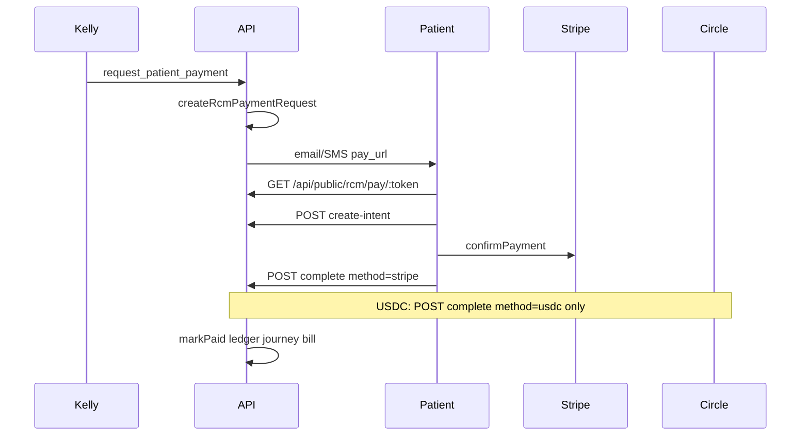

# RCM patient pay gateway (Kelly-initiated)

> **Last reviewed:** 2026-05-31

Kelly creates a secure pay link; the patient pays on [`unified-dashboard/patients/pay.html`](../../unified-dashboard/patients/pay.html); settlement runs via **Stripe (card)** or **Circle (USDC)**.

## Flow



## Kelly tool

| Tool | When |
|------|------|
| `request_patient_payment` | Copay or balance due after eligibility / RCM journey |
| `create_appointment_checkout` | **New appointment** checkout only (different page: `/payment/:token`) |

**Never** collect card numbers on the call. Kelly sends a link and asks the patient to open it.

### Tool args

- `amount` — optional if journey `amount_due` or eligibility `copay_amount` exists
- `journey_id`, `patient_id`
- `patient_email`, `patient_phone`
- `delivery` — `email` | `sms` | `both`

## Public pay API

Mounted at `/api/public/rcm` ([`routes/rcm-public.js`](../../middleware-platform/routes/rcm-public.js)).

| Method | Path | Purpose |
|--------|------|---------|
| GET | `/pay/:token` | Context + rails |
| POST | `/pay/:token/create-intent` | Stripe PaymentIntent |
| POST | `/pay/:token/complete` | `{ method: "stripe", payment_intent_id }` or `{ method: "usdc" }` |

Amounts in API responses are **dollars** (not cents).

## Environment

| Variable | Purpose |
|----------|---------|
| `STRIPE_SECRET_KEY` / `STRIPE_PUBLISHABLE_KEY` | Card rail |
| `CIRCLE_*` | USDC rail |
| `PUBLIC_PAY_BASE_URL` | Pay link host (prod: `https://api.callsomo.com`) |
| `RCM_PAY_PROBE_CIRCLE_BALANCE=1` | Show USDC balance on pay page |
| `RCM_E2E_STRIPE_LIVE=1` | Live Stripe in gateway E2E |
| `RCM_E2E_USDC_LIVE=1` | Live USDC in gateway E2E |
| `RCM_E2E_PATIENT_ID` | FHIR patient id for USDC tests |

### Kelly conversation E2E (visit + pay rails)

| Variable | Purpose |
|----------|---------|
| `KELLY_E2E_SKIP_TRIAGE=1` | Relax Kelly RAG confidence/differential gates when fixture sets `kelly_e2e_skip_triage=1` — **Kelly only** |
| `RCM_E2E_SKIP_GATES=1` | Skip RCM journey stage gates in HTTP API — **does not unlock Kelly slots** |
| `KELLY_E2E_VISIT_ONLY=1` | Run conversation E2E T1–T4 only (visit line exit) |
| `RCM_E2E_WALLET_TEST=1` | Run wallet bill-status stage with seeded patient session |

Fixtures: [`e2e/helpers/kelly-conversation-fixtures.cjs`](../../middleware-platform/e2e/helpers/kelly-conversation-fixtures.cjs)

| Script | npm command |
|--------|-------------|
| Visit line F1a | `test:e2e:kelly:visit` |
| Booking fixture F1b | `test:e2e:kelly:booking-fixture` |
| Pay fixture F1c | `test:e2e:kelly:pay-fixture` |
| Full conversation F2 | `test:e2e:rcm:conversation` |
| **Browser golden path** | `test:e2e:kelly:golden` |

See also [`todos/pending/KELLY_CONVERSATION_RAILS_TODOS.md`](../../todos/pending/KELLY_CONVERSATION_RAILS_TODOS.md).

### Playwright browser golden path

Chains **`triage.html`** (T1–T6) → real **`pay_token`** from DB → **`pay.html`** live Stripe.

| Script | npm command | What it proves |
|--------|-------------|----------------|
| **Golden path (full)** | `test:e2e:kelly:golden` | Browser triage chat → pay token → `pay.html` settlement |
| **Visit only** | `test:e2e:kelly:golden:visit` | T1–T4 on `triage.html` only |
| **Skip triage** | `test:e2e:kelly:golden:skip-triage` | Booking-ready fixture → T3+ |

```bash
# Server on :4000 with chat enabled + LLM keys (dotenv loads .env automatically)
FEATURE_PATIENT_CHAT_ENABLED=1 npm start
PW_API_BASE_URL=http://127.0.0.1:4000 npm run test:e2e:kelly:golden:visit

# Full chain with live Stripe
RCM_E2E_STRIPE_LIVE=1 STRIPE_SECRET_KEY=sk_test_... \
  PW_API_BASE_URL=http://127.0.0.1:4000 npm run test:e2e:kelly:golden
```

Scorecard: `playwright-report/kelly-golden-path-report.json`. Auth: `localStorage.patient_session_id` (not cookies).

Seed Circle test wallets: `node scripts/seed-rcm-circle-test.cjs`

## Test commands

Two E2E layers — do not confuse them:

| Script | npm command | What it proves |
|--------|-------------|----------------|
| **Tool gateway** | `test:e2e:rcm:pay-gateway` | `KellyToolExecutor.execute('request_patient_payment')` → pay link → optional Stripe/USDC |
| **Conversation diagnostic** | `test:e2e:rcm:conversation` | Full multi-turn `KellyAgentService.processTurn` (derm → book → copay → pay) |
| **Pay UI (mocked)** | `test:e2e:rcm:pay-ui` | Playwright on `pay.html` (no LLM) |
| **Browser golden path** | `test:e2e:kelly:golden` | Playwright `triage.html` → `pay.html` with real pay token |

```bash
cd middleware-platform
npm start   # :4000, DEV_LIGHT_START=1 recommended

# Mocked Playwright (no secrets)
npm run test:e2e:rcm:pay-ui

# Kelly tool → API golden path (no conversation)
RCM_E2E_USE_EXISTING_SERVER=1 npm run test:e2e:rcm:pay-gateway

# Full agentic conversation diagnostic (needs LLM keys)
RCM_E2E_USE_EXISTING_SERVER=1 npm run test:e2e:rcm:conversation

# Live Stripe money (gateway or conversation)
RCM_E2E_USE_EXISTING_SERVER=1 RCM_E2E_STRIPE_LIVE=1 npm run test:e2e:rcm:pay-gateway
RCM_E2E_USE_EXISTING_SERVER=1 RCM_E2E_STRIPE_LIVE=1 npm run test:e2e:rcm:conversation

# Live USDC money
RCM_E2E_USE_EXISTING_SERVER=1 RCM_E2E_USDC_LIVE=1 RCM_E2E_PATIENT_ID=Patient/... npm run test:e2e:rcm:pay-gateway
```

### Conversation E2E — scorecard interpretation (2026-05-31 run)

Script: [`e2e-kelly-rcm-pay-conversation.cjs`](../../middleware-platform/scripts/e2e-kelly-rcm-pay-conversation.cjs)

**Result:** 67% (8/12 non-skipped stages passed). Exit code 1.

| Stage | Result | Category |
|-------|--------|----------|
| Bootstrap + DB seed | PASS | — |
| Turn 1–2 derm intake | PASS | Kelly in skincare intake phase |
| Turn 3 availability | **FAIL** | **Product gap** — Kelly loops skin-type intake instead of `get_available_slots` |
| Turn 4 booking | **FAIL** | Blocked by Turn 3 |
| Turn 5 copay question | PASS | Conversational only; no eligibility tool called |
| Turn 6 pay now | **FAIL** | **Product gap** — Kelly did not call `request_patient_payment` |
| Pay link GET | **FAIL** | Downstream of Turn 6 |
| Live Stripe settlement | SKIP | Set `RCM_E2E_STRIPE_LIVE=1` |
| Wallet bill-status | SKIP | **Auth gap** — `requirePatientSession`, no test bypass |
| Webhook + receipt wiring | PASS | Static checks |
| Provider payment list | SKIP | No `payment_id` from conversation |

**Gaps to fix (product):**

1. **Phase routing** — Intake phase must yield to booking when patient asks for appointments (`get_available_slots`).
2. **Billing phase** — When patient asks to pay copay, Kelly must invoke `request_patient_payment` (prompt exists in `kelly-prompt-builder.js` but LLM did not call tool).
3. **No tools invoked** — Entire run had `toolsUsed=[]`; investigate orchestrator phase / tool list exposure for voice channel.

**Known skips (documented, not bugs):**

- Patient wallet API requires login.
- Live money requires `RCM_E2E_STRIPE_LIVE=1`.

## Money lands where

| Rail | Gateway | Provider receipt |
|------|---------|------------------|
| Stripe | Platform Stripe account (test/live) | RCM ledger + `rcm_payments` |
| USDC | Circle transfer patient → clinic wallet | `circle_transfer_id` on payment row |

Stripe Connect (clinic bank payout) is not in this sprint.

## Related

- [RCM_E2E_TEST_FLOW.md](./RCM_E2E_TEST_FLOW.md)
- [ENVIRONMENT_VARIABLES_BY_SURFACE.md](../setup/ENVIRONMENT_VARIABLES_BY_SURFACE.md)
