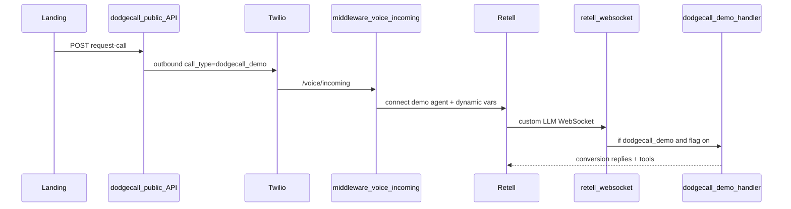
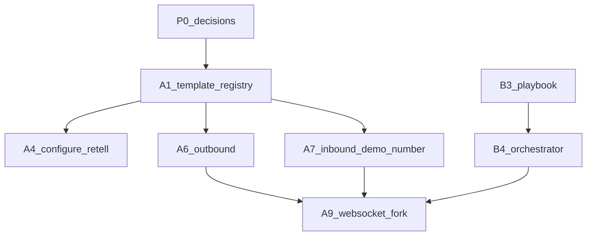

# DodgeCall demo agent architecture

**Last updated:** 2026-05-28

## Goal

Outbound demo calls from the DodgeCall landing page should **convert prospects to signup**, not run Kelly medical intake or LangGraph coding.

## Data flow

## Phases

| Phase | Scope | Exit criteria |
|-------|--------|----------------|
| **A** | Template registry, dedicated Twilio/Retell, WS fork (no Kelly/LangGraph) | Demo call greets as DodgeCall, not Kelly |
| **B** | Conversion orchestrator, playbook, SMS signup link | Persuasive script + `record_interest` / `send_signup_link` |
| **C** | More templates, attribution | Registry supports multiple `template_id` values |
| **D** | Hardening, tests, runbook | E2E + unit tests; rollback documented |

## Critical path

`P0 (voice + ADRs)` → `A1 registry` → `A4 configure Retell` → `A6/A7 telephony` → `A9 WS fork` → `B3 playbook` → `B4 orchestrator`

## Dependency graph

## Do not change (isolation)

See [ISOLATION_CONTRACT.md](./ISOLATION_CONTRACT.md).

| Component | Reason |
|-----------|--------|
| `kelly-agent-service.js` | Production medical brain |
| `coding-graph.js` / LangGraph on voice | Medical coding, not sales |
| `configure-retell.js` (Kelly agent) | Paying-tenant agent |
| Clinic billing gate on `/voice/incoming` | Skip only for `dodgecall_demo` |

## Code map

| Piece | Path |
|-------|------|
| Landing | `unified-dashboard/dodgecall/` |
| Public API | `middleware-platform/routes/dodgecall-public.js` |
| Demo service | `middleware-platform/services/dodgecall-demo-service.js` |
| Template registry | `middleware-platform/config/dodgecall-templates.json` |
| Registry resolver | `middleware-platform/services/dodgecall-template-registry.js` |
| Demo WS handler | `middleware-platform/webhooks/dodgecall-demo-handler.js` |
| Orchestrator | `middleware-platform/services/dodgecall-demo-orchestrator.js` |
| Configure script | `middleware-platform/scripts/configure-dodgecall-demo-retell.cjs` |
