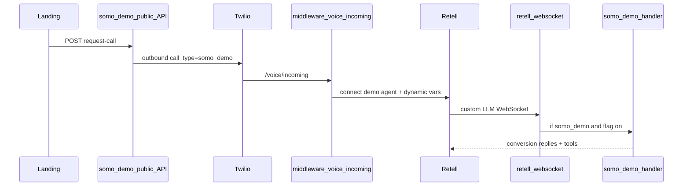
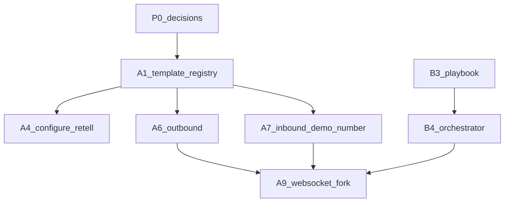

# agent/somo-demo

**Last updated:** 2026-06-02


---

<a id="architecture"></a>

## ARCHITECTURE

*Merged from `docs/agent/somo-demo/ARCHITECTURE.md` on 2026-06-02.*

# Somo demo demo agent architecture

**Last updated:** 2026-05-28

## Goal

Outbound demo calls from the Somo landing page run a **Kelly qualification** call (~2 min, signup CTA) — not Kelly Rails clinical intake or LangGraph coding. See [QUALIFICATION_CALL_SCRIPT_V1.md](./QUALIFICATION_CALL_SCRIPT_V1.md) and [RUNBOOK.md](./RUNBOOK.md#qualification-demo-landing).

## Data flow



**WS gate (R-4 / DOC-3):** `isSomoDemoDemoConnection()` returns true when `call_type=somo_demo` **or** inbound `to_number` matches `isDemoTwilioNumber()` — not metadata-only.

## Phases

| Phase | Scope | Exit criteria |
|-------|--------|----------------|
| **A** | Template registry, dedicated Twilio/Retell, WS fork (no Kelly/LangGraph) | Demo call greets as Somo demo, not Kelly |
| **B** | Conversion orchestrator, playbook, SMS signup link | Persuasive script + `record_interest` / `send_signup_link` |
| **C** | More templates, attribution | Registry supports multiple `template_id` values |
| **D** | Hardening, tests, runbook | E2E + unit tests; rollback documented |

## Critical path

`P0 (voice + ADRs)` → `A1 registry` → `A4 configure Retell` → `A6/A7 telephony` → `A9 WS fork` → `B3 playbook` → `B4 orchestrator`

## Dependency graph



## Do not change (isolation)

See [ISOLATION_CONTRACT.md](./ISOLATION_CONTRACT.md).

| Component | Reason |
|-----------|--------|
| `kelly-agent-service.js` | Production medical brain |
| `coding-graph.js` / LangGraph on voice | Medical coding, not sales |
| `configure-retell.js` (Kelly agent) | Paying-tenant agent |
| Clinic billing gate on `/voice/incoming` | Skip only for `somo_demo` |

## Code map

| Piece | Path |
|-------|------|
| Landing | `unified-dashboard/somo-landing/` |
| Public API | `middleware-platform/routes/somo-demo-public.js` |
| Demo service | `middleware-platform/services/somo-demo-service.js` |
| Template registry | `middleware-platform/config/somo-demo-templates.json` |
| Registry resolver | `middleware-platform/services/somo-demo-template-registry.js` |
| Demo WS handler | `middleware-platform/webhooks/somo-demo-handler.js` |
| Orchestrator | `middleware-platform/services/somo-demo-orchestrator.js` |
| Configure script | `middleware-platform/scripts/configure-somo-demo-retell.cjs` |


---

<a id="decisions"></a>

## DECISIONS

*Merged from `docs/agent/somo-demo/DECISIONS.md` on 2026-06-02.*

# Somo demo demo agent — decisions (ADR)

**Last updated:** 2026-05-28

## ADR-1: Custom LLM WebSocket (locked)

**Decision:** Use Retell `response_engine.type = custom-llm` with `llm_websocket_url` pointing at middleware (`/webhook/retell/llm`), same transport as Kelly.

**Rejected:** Retell-native LLM only (`general_prompt` without our WebSocket). That would require re-wiring for Phase B orchestrator, tools, and stage state.

**Implication:** Phase A implements a thin demo branch in `somo-demo-handler.js`; Phase B plugs in `somo-demo-orchestrator.js` without changing Retell agent type.

---

## ADR-2: `use_case` vs `template_id`

| Field | Meaning | Example |
|-------|---------|---------|
| `use_case` | Prospect-facing choice from landing form | `receptionist` |
| `template_id` | Internal registry key (agent + voice + playbook bundle) | `medical` |

**v1:** All six landing personas map to `template_id: medical` with different openers (persona flavor only).

**Later:** `use_case=debt_collection` could map to `template_id=debt_v1` with a separate Retell agent.

---

## ADR-3: Female demo voice (`DODGECALL_DEMO_VOICE_ID`)

**Pre-sprint (human):**

1. Open Retell dashboard → Agents → demo agent (or create one).
2. Audition female voices (Retell preset or ElevenLabs via `voice_id`).
3. Set `DODGECALL_DEMO_VOICE_ID=<chosen>` in `middleware-platform/.env`.
4. Run `npm run configure:somo-demo --prefix middleware-platform`.

Default in code/docs until set: document only — do not fall back to Kelly `RETELL_VOICE_ID` for demo agent config.

---

## ADR-4: Rollback

Set `DODGECALL_DEMO_ENABLED=0` to disable:

- `POST /api/public/somo-demo/request-call`
- WebSocket demo branch (production Kelly path unchanged)

No deploy required if env is reloadable.

---

## ADR-5: Public webhooks

Twilio and Retell must reach middleware. `API_BASE_URL=http://localhost:4000` is insufficient for real handset tests; use ngrok or deployed host (see [RUNBOOK.md](./RUNBOOK.md)).


---

<a id="isolation-contract"></a>

## ISOLATION CONTRACT

*Merged from `docs/agent/somo-demo/ISOLATION_CONTRACT.md` on 2026-06-02.*

# Somo demo demo — isolation contract

**Last updated:** 2026-05-28

Demo calls (`call_type=somo_demo`) must **never** execute the following on the WebSocket path:

| Must NOT run | Module / behavior |
|--------------|-------------------|
| Kelly LLM + tools | `kelly-agent-service.js`, `kelly-tool-executor.js` |
| LangGraph / coding state | `coding-graph.js`, `coding-state-service.js` |
| Medical triage RAG | `triage-service.js` on demo path |
| Clinic tenant resolution for billing | Billing gate skipped at Twilio ingress only |
| Full Kelly `retell-functions.json` on demo Retell agent | Demo agent: `end_call`, `record_interest`, `send_signup_link` only |

## Allowed on demo path

- `somo-demo-handler.js`
- `somo-demo-orchestrator.js`
- `somo-demo-prompt-builder.js` (playbook + signup CTA)
- `somo-demo-sms.js` (signup link; dedicated FROM env)
- `somo-demo-template-registry.js`
- DB: `somo_demo_requests` only (no `rcm_journeys` / Kelly session coupling required)

## Ingress exceptions

On `/voice/incoming` when `call_type=somo_demo`:

- Skip subscription/billing gate (already implemented).
- Use `DODGECALL_RETELL_AGENT_ID` + `DODGECALL_TWILIO_FROM_NUMBER` from template registry.
- Inbound calls to the demo Twilio number are treated as demo (no `getCustomerByTwilioNumber` match).

## Enforcement

`isSomoDemoDemoConnection(connection)` in `somo-demo-handler.js` requires:

1. `DODGECALL_DEMO_ENABLED` not `0` / `false`
2. `call_type === 'somo_demo'` in metadata or dynamic variables

`retell-websocket.js` returns early to demo handler **before** LangGraph (~578) and Kelly (~627).


---

<a id="template-registry"></a>

## TEMPLATE REGISTRY

*Merged from `docs/agent/somo-demo/TEMPLATE_REGISTRY.md` on 2026-06-02.*

# Somo demo template registry

**Last updated:** 2026-05-28

Config file: [`middleware-platform/config/somo-demo-templates.json`](../../../middleware-platform/config/somo-demo-templates.json)

## Schema

```json
{
  "templates": {
    "<template_id>": {
      "persona_name": "Sam",
      "retell_agent_id_env": "DODGECALL_RETELL_AGENT_ID",
      "twilio_from_env": "DODGECALL_TWILIO_FROM_NUMBER",
      "voice_id_env": "DODGECALL_DEMO_VOICE_ID",
      "max_duration_sec": 240
    }
  },
  "use_case_map": {
    "<use_case>": "<template_id>"
  }
}
```

## v1 mapping (all personas → medical)

| Landing `use_case` | `template_id` | Notes |
|--------------------|---------------|--------|
| `receptionist` | `medical` | Default |
| `appointment_setter` | `medical` | Opener differs |
| `lead_qualification` | `medical` | Opener differs |
| `customer_service` | `medical` | Opener differs |
| `debt_collection` | `medical` | Fictional balance demo |
| `survey` | `medical` | Opener differs |

Openers live in `somo-demo-service.js` (`USE_CASE_OPENERS`); registry only resolves telephony + agent + duration.

## API

`resolveTemplate({ use_case })` → `{ template_id, agentId, fromNumber, voiceId, personaName, maxDurationSec, opener }`

Resolves agent/from via `DODGECALL_*` first, then `RETELL_AGENT_ID` / `TWILIO_PHONE_NUMBER`. Throws only if none of the keys in the chain are set.


---

<a id="playbook-medical"></a>

## PLAYBOOK MEDICAL

*Merged from `docs/agent/somo-demo/PLAYBOOK_MEDICAL.md` on 2026-06-02.*

# Somo demo medical demo — conversion playbook

**Last updated:** 2026-05-28  
**Persona:** Sam (friendly medical-office AI receptionist — Somo demo demo)  
**Goal:** Sign up at Somo demo — AI call center for clinics and service businesses.

## Stages

### OPEN (0:00–0:30)

- Greet by first name: "Hi {name}, this is Sam from Somo demo."
- Permission: "You asked for a quick live demo — is now still a good time?"
- Frame: "I'll show you how an AI receptionist answers like your front desk, then you can decide if you want your own line."

### QUALIFY (0:30–1:00)

- One question: "What kind of business are you running — clinic, med spa, or something else?"
- Listen; mirror back in one sentence.

### VALUE (1:00–2:00)

- **Point 1:** Answers 24/7, never puts callers on hold.
- **Point 2:** Books appointments and routes urgent calls (demo flavor matches selected use case).
- **Point 3:** One dashboard — you control scripts and handoff to your team.

### OBJECTION (as needed)

| Objection | Rebuttal |
|-----------|----------|
| "Is this a real person?" | "I'm AI built for phone conversations — that's what you'd deploy for your patients or customers." |
| "We already have staff." | "This handles overflow and after-hours so staff focus on in-room care." |
| "Too expensive / not sure." | "You can start with a demo account — I'll text you a signup link if you'd like." |

### CTA (2:00–3:00)

- "Want me to text you a link to create your Somo demo account? Takes about two minutes."
- If yes → call tool `send_signup_link`.
- If hesitant → `record_interest` with level `warm` or `cold`.

### CLOSE (3:00–4:00 max)

- Thank them; remind link is valid; `end_call`.
- Hard ceiling: **4 minutes** — wrap with CTA or polite goodbye.

## Tone

- Warm, concise, no medical diagnosis or real PHI collection.
- Never claim to be Somo/Kelly on demo calls.

## Tool triggers

| Situation | Tool |
|-----------|------|
| Prospect wants signup link | `send_signup_link` |
| Interested but no link | `record_interest` (`warm`) |
| Not interested | `record_interest` (`cold`) + `end_call` |
| Time exceeded | `end_call` |


---

<a id="google-sheets-sync-design"></a>

## GOOGLE SHEETS SYNC DESIGN

*Merged from `docs/agent/somo-demo/GOOGLE_SHEETS_SYNC_DESIGN.md` on 2026-06-02.*

# Google Sheets Sync Design (Service Account)

Last updated: 2026-06-02

## Goal

Export outbound sales call telemetry to Google Sheets with low operational overhead and deterministic replay behavior.

## Auth and Configuration

- Auth mode: service account JSON credentials.
- Required env:
  - `SOMO_SHEETS_ENABLED=1`
  - `SOMO_SHEETS_SPREADSHEET_ID=<id>`
  - `SOMO_SHEETS_SERVICE_ACCOUNT_JSON` or `SOMO_SHEETS_SERVICE_ACCOUNT_JSON_PATH`
  - optional: `SOMO_SHEETS_EVENT_TAB=EventLog`, `SOMO_SHEETS_STATUS_TAB=LeadStatus`

## Data Model

### EventLog (append-only)

Columns:

- `event_id` (idempotency key)
- `event_time`
- `lead_id`
- `call_id`
- `event_type`
- `language`
- `country`
- `city`
- `practice_specialty`
- `practice_size`
- `interest_level`
- `outcome`
- `next_step`
- `payload_json`

### LeadStatus (upsert)

Columns:

- `lead_id` (primary lookup key)
- `name`
- `phone_e164`
- `language`
- `country`
- `city`
- `practice_specialty`
- `practice_size`
- `call_start_at`
- `call_end_at`
- `call_duration_sec`
- `questions_asked_json`
- `pain_points_json`
- `interest_level`
- `outcome`
- `next_step`
- `signup_link_sent`
- `booked_demo`
- `notes_summary`
- `updated_at`

## Write Semantics

- Event writes: append, never mutate historical rows.
- Status writes: upsert by `lead_id`.
- Idempotency:
  - `event_id = <lead_id>:<event_type>:<call_id>:<stage>`
- Retry:
  - exponential backoff, max attempts 5.
- Dead-letter:
  - persist failed writes to local DB table `somo_demo_sheets_dlq`.

## Integration Points

- API ingress (`requestDemoCall`) creates initial lead status row.
- Call events from `somo-demo-handler` emit incremental events and status updates.
- Call completion finalizes status row (`call_end_at`, `outcome`, summary).

## Validation Checklist

1. Service account can access target spreadsheet.
2. Event append writes row for `request_received`.
3. `call_started`, `qualified`, `cta_sent`, `call_ended` rows emitted with unique `event_id`.
4. `LeadStatus` row updates in place for same `lead_id`.
5. Duplicate event replay does not produce duplicate event rows.
6. Forced Sheets failure lands in DLQ and retries successfully.
