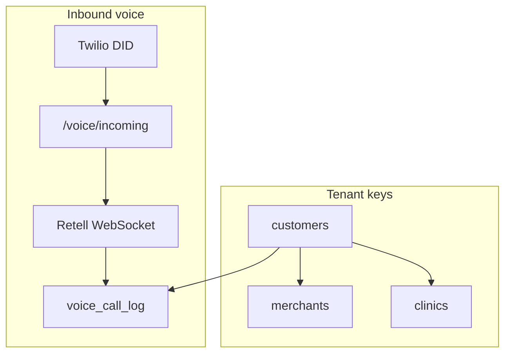
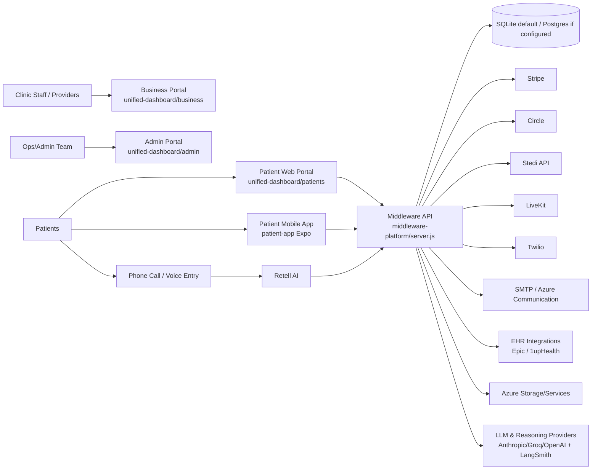
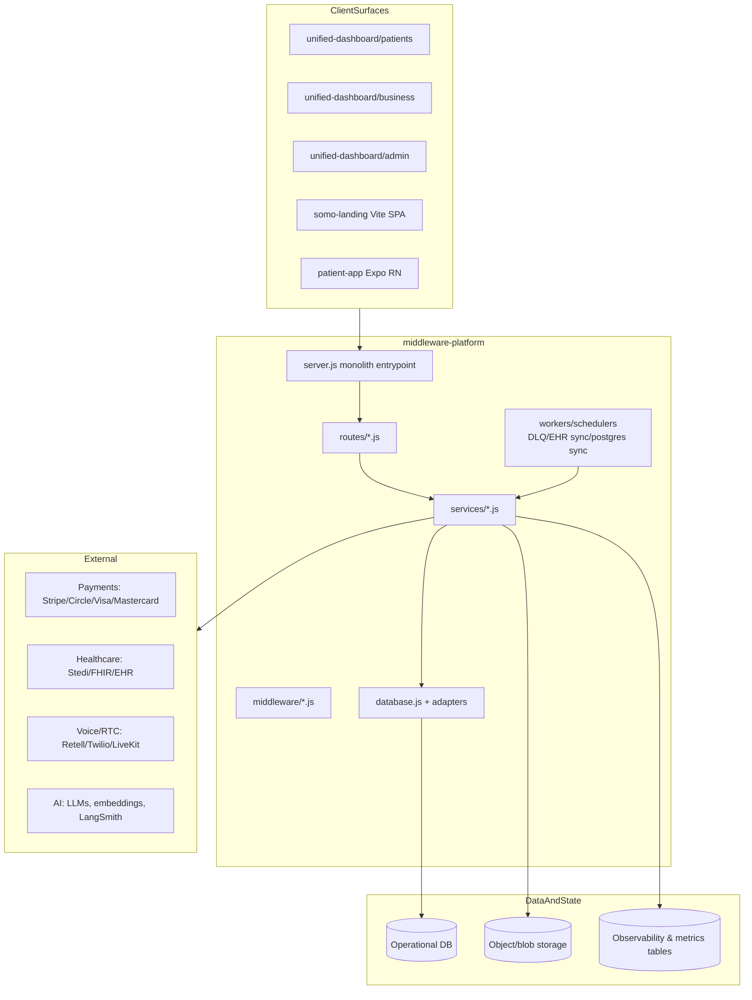
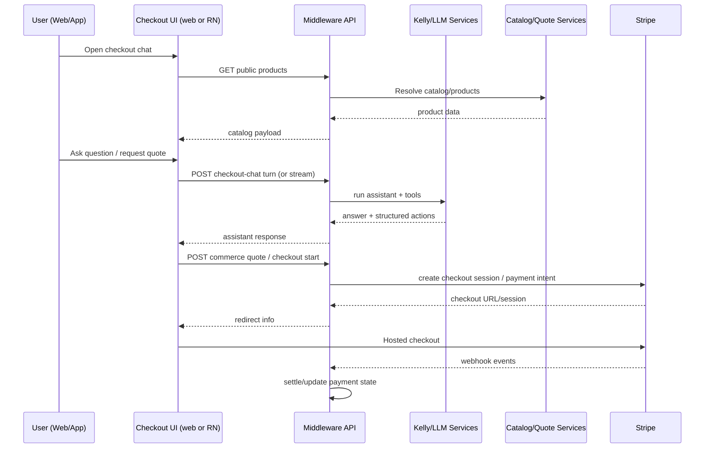
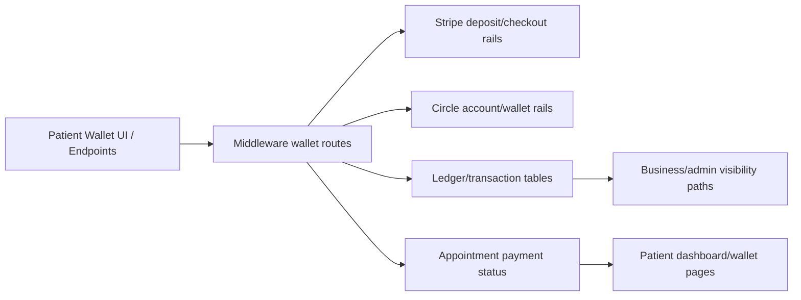

# Current State Architecture (Codebase-Derived)

**Last Updated:** 2026-05-30  
**Scope:** Monorepo-wide snapshot of how the platform is currently built, based on code and docs in this repository.  
**Audience:** Engineering, product, operations, security/compliance, onboarding developers.

---

## 1) Executive Summary

Somo (callsomo.com) and legacy Somo surfaces share a Node/Express middleware (`middleware-platform`) that orchestrates:

- Voice workflows (Retell + Twilio + booking/payment/insurance tools)
- Patient web portal and native mobile app experiences
- Agentic checkout and commerce (catalog -> quote -> chat -> Stripe checkout)
- Insurance/RCM and FHIR-adjacent healthcare data flows
- Video consult and tokenized realtime/session flows
- Admin/business/ops dashboards and automation pipelines

The system is intentionally **integration-heavy**, with many optional providers behind environment flags (Stripe, Circle, Stedi, Epic, 1upHealth, LiveKit, Azure services, LangSmith/LangChain tooling).  

---

## 1b) Somo SaaS tenant and voice (2026 foundation)

Canonical database and ops docs: [`docs/Database/README.md`](../Database/README.md).

| Concern | Source of truth |
|---------|-----------------|
| Provider login | `customers` + `customer_sessions` — [`auth-entrypoints.md`](../auth/auth-entrypoints.md) |
| Inbound phone | `customers.twilio_phone_number` — [VOICE_PHONE_SEMANTICS.md](./VOICE_PHONE_SEMANTICS.md) |
| Agent greeting/hours | `voice_agent_settings` by `merchant_id` (migrate off `cust:{id}`) |
| Live prompt runtime | Retell API (Week 3 SSOT) — [VOICE_PROMPT_SSOT.md](./VOICE_PROMPT_SSOT.md) |
| Per-call tenant FK | `voice_call_log.customer_id` today; state tables gain `customer_id` in migration `053` |
| RCM / coding tables | Separate merchant context — [VOICE_VS_RCM_TABLES.md](../RCM/VOICE_VS_RCM_TABLES.md) |

Week 1 operational gate: [SOMO_FOUNDATION_RUNBOOK.md](../Database/SOMO_FOUNDATION_RUNBOOK.md).

---

## 2) Repository Topology

Primary runtime surfaces:

- `middleware-platform/` - Core backend API + orchestration + workers + integrations
- `unified-dashboard/` - Static/web portals (patient, business, admin, insurer) and shared JS/CSS
- `unified-dashboard/somo-landing/` - Somo marketing SPA at `/` (`:5180` dev, proxies `/api` → `:4000`)
- `unified-dashboard/_archive/littlelab-landing/` - Archived CRA landing + Kelly/LiveKit assistant (retired 2026-05-29)
- `patient-app/` - Expo/React Native app (auth + appointments + checkout chat integration)
- `docs/` - Consolidated canonical documentation
- `scripts/`, `infra/`, `Knowledge/`, `todos/` - operations, infra, data assets, roadmap state

---

## 3) System Context Diagram

---

## 4) Container / Module Architecture

---

## 5) Backend Core (`middleware-platform`)

### 5.1 Runtime Characteristics

- Express-based API server with high route density (`server.js` + `routes/`)
- Security/boot guards:
  - Env validation on startup
  - Production JWT/FHIR guard requirements
  - Security middleware and webhook protections
- Feature flag style toggles via env for progressive rollout/shadowing
- Multi-domain support for patient/business/admin routing and static serve integration

### 5.2 Persistence Model

- Primary local default: SQLite (`better-sqlite3`) with migration-heavy `database.js`
- Optional Postgres mode when `POSTGRES_URL` is set
- Hybrid support patterns appear throughout data access for compatibility/sync
- State transition guards implemented for appointment/payment/checkout lifecycles
- WAL and timeout pragmas for SQLite concurrency

### 5.3 API Layering

- `server.js`: central composition + many directly-declared endpoints
- `routes/*.js`: domain-focused route modules (payments, FHIR, products, consult, orders, wallet, etc.)
- `services/*.js`: business logic, orchestration, integration clients, queue/workers, RAG/LLM layers
- `middleware/*.js`: auth/security/rate-limit/scope enforcement

---

## 6) Frontend Surfaces

## 6.1 Unified Dashboard (web)

Directories:

- `unified-dashboard/patients` - login/dashboard/appointments/book/schedule/triage/wallet/checkout-chat/profile
- `unified-dashboard/business` - provider/clinic operations, products/orders/invoices, feature flags, records
- `unified-dashboard/admin` - platform administration, workflows, clients, CRM-like pages
- Shared runtime scripts:
  - `assets/js/patient-api.js`
  - `assets/js/patient-shell.js`
  - auth/session/composer utility scripts

Characteristics:

- Mostly static HTML + vanilla JS + shared CSS token system
- Calls middleware APIs directly
- Implements multiple patient/payment experiences including Stripe checkout redirects

## 6.2 Landing Experience (`somo-landing`)

- Vite + React marketing SPA at `/` (hero, capabilities, demo, ROI, pricing, languages, FAQ)
- Image 1 palette via `somo-tokens.css` + `somo-landing/src/styles/somo.css`
- Public demo: `POST /api/public/dodgecall/request-call`
- Legacy CRA + Kelly/LiveKit assistant funnel: `_archive/littlelab-landing/` (archived 2026-05-29)

## 6.3 Patient Mobile App (`patient-app`)

- Expo Router + React Native
- Current implemented focus:
  - Session/auth verification flow
  - Appointment visibility
  - Checkout chat modal experience (`checkout-chat.tsx`) aligned with web APIs
- Supporting modules:
  - checkout helpers and analytics
  - design token parity (`skinCareTokens.ts`)
  - optional ledger/safe-harbor primitives (`useUnifiedLedger.ts`, `SafeHarborRing.tsx`)
- Dedicated doc (current): `docs/patient-app/PATIENT_APP_ARCHITECTURE_AND_AGENT_ORCHESTRATION.md`

---

## 7) Domain Architecture by Capability

## 7.1 Voice Agent and Telephony

Core components:

- Retell integration (`retell-service.js`, `routes/retell-functions.js`, webhook handlers)
- Voice-specific routes (`routes/voice.js`, `routes/voice-web-call.js`)
- Twilio services and webhook protections
- Voice triage guardrails and session-parity enforcement

Pattern:

1. Voice turn arrives from Retell/webhook
2. Middleware maps session/context and tool request
3. Domain services execute booking/payment/insurance/actions
4. Response returned to voice orchestration
5. Events/logs/audit stored and optionally traced

## 7.2 Booking and Patient Journey

Key services:

- `booking-service.js`
- `patient-portal-service.js`
- `patient-intake-service.js`
- `patient-orchestrator-service.js`
- scheduling/reminder services

Capabilities:

- Appointment lifecycle management (create/search/confirm/reschedule/cancel)
- Patient session verification and portal access
- Emerging matching/triage orchestration flows represented in docs + service layer

## 7.3 Checkout, Payments, Wallets, Settlement

Key route/service stack:

- Routes: `public-checkout.js`, `public-commerce-quote.js`, `payment.js`, `payment-ops.js`, wallet endpoints
- Services:
  - `payment-orchestrator.js`, `payment-flow-service.js`, `payment-service.js`
  - `checkout-workflow-service.js`, `checkout-payment-status-service.js`
  - `commerce-payment-settlement.js`, `settlement-service.js`, `instant-settlement-service.js`
  - `circle-service.js`, `hsa-wallet-service.js`

Current shape:

- Stripe is the primary card checkout/payment rail in active patient flows
- Circle/wallet capabilities remain present in code and APIs
- Fraud and anti-sybil controls sit around sensitive payment edges

## 7.4 Insurance, Claims, RCM, EOB

Relevant services:

- `insurance-service.js`, `rcm-service.js`, `eob-calculation-service.js`, `adjudication-service.js`
- payer/payor pipeline services (normalization, fuzzy matching, canonicalization, scoring)
- claims and payer cache support

Capabilities:

- Insurance eligibility and claims workflows
- Payer resolution/canonical registry pipelines
- Billing/financial data transformations

## 7.5 FHIR/EHR and Clinical Data

Key components:

- `routes/fhir.js`, `routes/diagnostic-report.js`
- `fhir-service.js`, adapters, middleware scope guards
- `ehr-sync-service.js`, `ehr-aggregator-service.js`, Epic-related adapters

Pattern:

- Middleware acts as normalized gateway between internal data model and FHIR/EHR interactions
- Additional production protections enforce secure access paths to PHI-sensitive resources

## 7.6 AI / Reasoning / RAG / Knowledge

Key components:

- LLM routing + orchestration: `llm-router.js`, `kelly-agent-service.js`, `kelly-tool-executor.js`
- Reasoning/quality layers: `reasoning-map-service.js`, `routine-reasoning-orchestrator.js`, summary/retrieval guardrails
- RAG services under `layer2-rag/*` and vector retrieval modules
- Derm and scan/ingredient pipelines
- LangSmith and LangChain instrumentation hooks

Characteristics:

- Multi-model architecture with provider abstraction tendencies
- Strong script-driven validation harnesses for reasoning quality and release gates
- Feature-flag and staged rollout patterns for AI route evolution

## 7.7 Video Consult / Realtime

- Routes/services for consult lifecycle and LiveKit token/session support
- Separate but connected to broader consult/patient flow
- Includes SSE and session orchestration constructs

## 7.8 Admin, Operations, Automation

Evidence in routes/services/scripts:

- Tenant, workflows, usage, internal ops, fraud review, automation routes
- Large operational script inventory for audits, migrations, backfills, reports, rollout checks
- Supports production-readiness gates, DLQ triage/replay, and observability reporting

---

## 8) Agentic Checkout End-to-End Flow (Current)

## 8.1 Patient App Agent Orchestration (Current)

The patient app orchestrates agent behavior through middleware, not on-device.

Current mobile pattern:

1. Mobile sends turn to `POST /api/patient/checkout-chat/turn/stream`.
2. Middleware invokes Kelly agent services and tool execution.
3. Tool executor calls commerce/quote/payment services as needed.
4. Middleware streams deltas back to RN client (SSE), with non-stream fallback route.
5. Mobile uses `quote_id` and starts hosted checkout via middleware route.

This is documented in:

- `docs/patient-app/PATIENT_APP_ARCHITECTURE_AND_AGENT_ORCHESTRATION.md`

---

## 9) Patient Wallet and Billing Flow (Current Code Presence)

Notes:

- Wallet-related backend and UI flows exist.
- Platform docs/roadmap indicate a launch simplification trend toward Stripe card-first paths.

---

## 10) Data and Storage Architecture

Data domains visible in code/docs:

- Patient + appointment + scheduling state
- Checkout/payment/transaction/claims records
- Payer/provider directory and normalization artifacts
- Clinical/FHIR/EHR synchronized resources
- Session/tool call/audit/ops telemetry
- Knowledge/embedding/vector-related metadata

Storage patterns:

- Relational operational store (SQLite default, optional Postgres)
- Blob/object storage for uploads and some pipeline assets
- In-memory + DB-backed caches/queues + DLQ-style recovery utilities

---

## 11) Security, Compliance, and Reliability Controls

Implemented control patterns:

- Startup env validation and production hard gates
- JWT and route-scoped access protections for sensitive healthcare routes
- Rate limiting and anti-abuse controls
- Webhook validation/replay guard logic for external callbacks
- Redaction and secure logging modules
- Fraud/anti-sybil review queues for payment-sensitive operations
- Extensive operational scripts for verification and readiness

---

## 12) Observability and Quality Gates

The codebase includes a broad quality harness:

- Jest and integration tests
- Playwright and E2E scripts (landing, journey, checkout, scan routes)
- Domain-specific verification scripts for:
  - reasoning quality
  - performance budgets
  - release readiness
  - routing consistency
  - security scans/redaction
  - data pipeline correctness

This indicates a platform designed around **scripted ops evidence** in addition to unit/integration tests.

---

## 13) Feature Inventory (What Exists in Code)

The following capabilities are represented by concrete modules/routes/scripts:

- Multi-tenant clinic/provider/patient surface architecture
- Voice receptionist flows with Retell tool execution
- Patient portal auth and appointment self-service
- Agentic checkout (web + RN parity) with Kelly chat and Stripe integration
- Product catalog, quote, and commerce order primitives
- Wallet and deposit/payment claim pathways (including Circle integration)
- Insurance eligibility/claims and RCM/EOB service layers
- FHIR/EHR integrations and sync workers
- Video consult token/session lifecycle support
- AI reasoning + RAG + scan/ingredient intelligence pipelines
- Provider/payor normalization, search, and network checks
- Fraud/anti-sybil and payment reliability mechanisms
- Admin/business operational dashboards and automation
- Extensive migration/backfill and rollout observability scripts

---

## 14) Architectural Strengths (Current State)

- Broad feature coverage across voice, clinical ops, payments, and commerce
- Strong integration abstraction in service layer
- Robust operational script ecosystem for validation and rollback confidence
- Multi-surface parity effort (web + native) in checkout
- Security-conscious startup/runtime guardrails for sensitive healthcare data

---

## 15) Architectural Tradeoffs / Risks (Current State)

- `server.js` is very large and central; ownership boundaries can blur
- High capability density can increase coupling and test matrix complexity
- Legacy and new pathways coexist (wallet/circle vs stripe-first trends), requiring clear deprecation strategy
- Mixed SQLite/Postgres patterns require disciplined migration and adapter consistency
- Feature-flag growth increases configuration complexity and operational burden

---

## 16) Recommended Next Documentation Steps

To keep this document accurate over time:

1. Add a monthly "delta log" section (new routes/services, removed features, migration status).
2. Track source-of-truth status for each major domain (active, legacy, deprecated, experimental).
3. Map each high-value flow to a test evidence pointer (script/test file references).
4. Add ownership tags per domain (`payments`, `voice`, `rcm`, `patient app`, etc.).
5. Add deployment topology by environment (local/staging/prod) with exact infra boundaries.

---

## 17) Diagram Index

- System Context Diagram (Section 3)
- Container/Module Diagram (Section 4)
- Agentic Checkout Sequence (Section 8)
- Wallet/Billing Flow Diagram (Section 9)

These are intentionally implementation-aligned and can be expanded into C4 Level 1/2/3 documents later.

