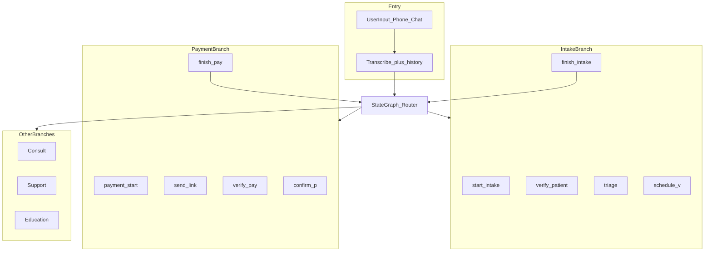
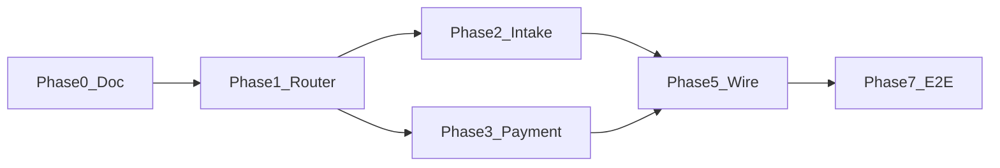

# Kelly Agentic Rails — Target Architecture and Build Plan

**Status:** Active build plan (LangGraph-first)  
**Last updated:** 2026-06-02  
**North star:** Cold-start patient ride — symptom → triage → book → copay link — without `seedBookingReady` or skip-triage fixtures.

**V2 rebuild (authoritative when `KELLY_RAILS_V2=1`):** [`middleware-platform/services/kelly-rails/`](../middleware-platform/services/kelly-rails/) — LangGraph host + lane steps + tool allow-lists. Phases 2–7 bridge/`processTurn` patches are **deprecated** on the v2 path (see [`kelly_rails_v2_as_built.md`](./kelly_rails_v2_as_built.md)).

**Related todos (execution checklists):**

- Open backlog pointer: [`todos/pending/KELLY_CONVERSATION_RAILS_TODOS.md`](../../todos/pending/KELLY_CONVERSATION_RAILS_TODOS.md)
- Completed golden-path work: [`todos/archive/KELLY_CONVERSATION_RAILS_GOLDEN_PATH_COMPLETED_2026-05-31.md`](../../todos/archive/KELLY_CONVERSATION_RAILS_GOLDEN_PATH_COMPLETED_2026-05-31.md)
- RCM identity / ledger (do not duplicate here): [`todos/pending/KELLY_RCM_PIPELINE_TODOS.md`](../../todos/pending/KELLY_RCM_PIPELINE_TODOS.md)
- Hybrid orchestration context: [`todos/pending/Orchestration-todos.md`](../../todos/pending/Orchestration-todos.md)
- Step 10 reasoning graph (separate product): [`todos/pending/Step10-LangChain-LangGraph-LangSmith-todos.md`](../../todos/pending/Step10-LangChain-LangGraph-LangSmith-todos.md)

**Target diagram:** [`assets/kelly_target_architecture.png`](./assets/kelly_target_architecture.png) (place PNG alongside this doc if missing from repo).

---

## 1. Problem statement

### Non-technical

Kelly is one assistant meant to handle several jobs: clinical visit booking, copay payment, skincare education, records questions, and more. The **capabilities exist** (calendar, triage, pay link APIs). The **problem is routing**: Kelly often puts clinic patients on the **skincare line** at the first turn (“Is your skin oily or dry?”) instead of clinical intake, and sometimes answers **generic billing** instead of **sending a pay link** when the patient asks to pay.

Booking and payment **work** when the session is already prepared (E2E fixtures, skip-triage). They **fail** on a natural cold-start conversation (F2 `test:e2e:rcm:conversation`).

### Technical

| Failure | Mechanism | Symptom |
|---------|-----------|---------|
| **Intake switch** | Step1 skin-type early return in `kelly-agent-service.js` runs **before** orchestrator + LLM | F2 T1–T2 stuck in skincare loop; phase stays `TRIAGE_DISCOVERY` |
| **Payment switch** | `_handleFastIntentPrecheck` returns generic billing with **no tools**; LLM may skip `request_patient_payment` | F2 T6 soft-pass via stale DB token |
| **Provider handoff** | `case_summaries` often written on **Stripe webhook**, not at schedule | Calendar clinical-prep empty until payment |

This is an **agentic control** problem (phases, shortcuts, tool enforcement), not missing backends.

---

## 2. Target architecture

One agent (Kelly), multiple **lines** (branches). A **router** picks the line each turn; each line has **sequential steps** and **isolated tool/prompt context**.



### State buckets (prompt + tool visibility)

| Bucket | Active branch | Tools visible (summary) | Hidden |
|--------|---------------|-------------------------|--------|
| **IntakeState** | `clinical_intake` | OPQRST, `run_triage_rag`, slots, schedule | Commerce cart, routine skincare-only |
| **BillingPaymentState** | `payment_line` | `request_patient_payment`, claims, eligibility | Scheduling, triage RAG |
| **HealthState** | Consult / triage detail | Records, literature, upload | Payment, commerce |
| **EducationState** | `skincare_education` | Routine, ingredients, products | Scheduling unless escalated |

**Finish nodes** (`finish_intake`, `finish_pay`) return control to the router for the next patient intent.

---

## 3. Current implementation map

| Diagram piece | Today in repo | Gap |
|---------------|---------------|-----|
| Router | [`kelly-orchestrator-phase.js`](../../middleware-platform/services/kelly-orchestrator-phase.js), `_classifyIntent` in [`kelly-agent-service.js`](../../middleware-platform/services/kelly-agent-service.js) | Not a graph; Step1 / billing fast-path **preempt** router |
| Intake branch | [`kelly-tool-executor.js`](../../middleware-platform/services/kelly-tool-executor.js); phases `TRIAGE_*` / `BOOKING` | No sequential nodes; Step1 hijacks cold start |
| Payment branch | `request_patient_payment`, `BILLING` phase | No mandatory `send_link` node |
| Education | `ROUTINE_INTAKE`, Step1 | Correct for skincare; must not own clinic visit |
| Kelly LangGraph host | **Phase 1:** [`kelly-conversation-graph.js`](../../middleware-platform/services/kelly-conversation-graph.js) (router skeleton) | Subgraphs + entrypoint wiring pending |
| Other LangGraph | [`coding-graph.js`](../../middleware-platform/services/coding-graph.js), [`video-consult-graph.js`](../../middleware-platform/services/video-consult-graph.js) | Parallel on voice in [`retell-websocket.js`](../../middleware-platform/webhooks/retell-websocket.js) — **coding** = claims pipeline, not patient conversation rails |
| Commerce checkout | [`checkout-graph.js`](../../middleware-platform/services/checkout-graph.js) shim | Shop line separate from RCM copay |

### Graph boundaries (do not merge)

| Graph | Owns |
|-------|------|
| **Kelly conversation graph** | Patient-facing rails: intake, pay, education, support |
| **Coding graph** | Voice call coding stages: INTAKE → CODING → BILLING (claims) |
| **Video consult graph** | End-of-visit summary + artifacts |
| **Step 10 graph** | `process_patient` L1–L6 reasoning (see Step10 todos) |

---

## 4. Design decision: LangGraph-first (locked)

**New module:** [`middleware-platform/services/kelly-conversation-graph.js`](../../middleware-platform/services/kelly-conversation-graph.js)

**Host pattern** (mirror [`coding-graph.js`](../../middleware-platform/services/coding-graph.js)):

- `StateGraph` + `Annotation` for `active_branch`, `branch_step`, `last_message`, `session_id`, `flags`
- Checkpointer: `MemorySaver` (dev) / `PostgresSaver` (prod when `POSTGRES_URL` + `LANGGRAPH_USE_POSTGRES`)
- Env: `LANGGRAPH_KELLY_ROLLOUT_PCT` (0 | 1 in production), `LANGGRAPH_KELLY_SHADOW` (shadow compare)
- Fallback: graph unavailable or rollout off → `KellyAgentService.processTurn`

**Kelly sub-node:** Each branch step invokes existing `KellyToolExecutor.execute` / bounded LLM turn — **no duplicate HTTP**.

**State migration:** Checkpointer owns branch/step; read legacy `kelly_session_meta_kv` during migration only. Avoid dual-writers for the same transition (see Step10 orchestration note).

---

## 5. Graph state schema (D0-2)

```json
{
  "session_id": "string",
  "clinic_id": "string|null",
  "patient_id": "string|null",
  "channel": "voice|chat",
  "active_branch": "router|clinical_intake|payment_line|skincare_education|consult|support|unknown",
  "branch_step": "string",
  "last_user_message": "string",
  "flags": {
    "routine_intake_active": false,
    "triage_complete": false,
    "has_rag": false,
    "booking_intent_seen": false
  },
  "branch_payload": {}
}
```

### Branch / step enums

| `active_branch` | `branch_step` values (ordered) |
|-----------------|--------------------------------|
| `clinical_intake` | `start_intake` → `verify_patient` → `triage` → `schedule_v` → `finish_intake` |
| `payment_line` | `payment_start` → `send_link` → `verify_pay` → `confirm_p` → `finish_pay` |
| `skincare_education` | `routine_intake` → `routine_followup` |
| `consult` | `records_qa` |
| `support` | `faq` → `handoff` |

---

## 6. Router rules (G1-2)

Implemented in `routeIntakeSwitch(state)` — keyword + session flags:

| Signal | Route |
|--------|--------|
| Pay / copay / balance / “send link” | `payment_line` |
| `routine_intake_active=1` and no clinical escape | `skincare_education` |
| Rash, pain, symptoms, book, appointment, gynecology, etc. | `clinical_intake` |
| Records / “last visit” | `consult` |
| Receipt / claim (not pay-now) | `support` or legacy billing fast-path until graph owns it |
| Else | `unknown` → router LLM or legacy `processTurn` |

Clinical signals **must not** default to skincare when `routine_intake_active=0`.

---

## 7. E2E north star (D0-3)

| Script | Command | Pass criteria |
|--------|---------|---------------|
| **F2 full ride** | `RCM_E2E_USE_EXISTING_SERVER=1 npm run test:e2e:rcm:conversation` | T1–T4 cold triage→book; T6 `request_patient_payment` + **fresh** token |
| F1b isolate booking | `npm run test:e2e:kelly:booking-fixture` | Seeded BOOKING (regression) |
| F1c pay fixture | `npm run test:e2e:kelly:pay-fixture` | Pay tool + token |
| Playwright golden | `npm run test:e2e:kelly:golden` | Browser; optional `RCM_E2E_STRIPE_LIVE=1` |
| Playwright skip-triage | `npm run test:e2e:kelly:golden:skip-triage` | Booking line regression |

**F2 turn contract (derm rash):**

| Turn | Patient intent | Phase (end) | Tool assert |
|------|----------------|-------------|-------------|
| T1 | Itchy rash, want derm | `TRIAGE_DISCOVERY` or `TRIAGE_ACTIVE` | No skin-type-only loop |
| T2 | OPQRST details | `TRIAGE_ACTIVE` | `run_triage_rag` optional T2b |
| T3 | Soonest appointment | `BOOKING` | `get_available_slots` |
| T4 | Confirm slot + email | `BOOKING` | `schedule_appointment` |
| T5 | Copay question | `BILLING` | Insurance/copay language |
| T6 | Pay now, send link | `BILLING` | `request_patient_payment` |

Add **F2-obgyn** variant: pelvic pain + gynecology — no Step1 skin quiz; `target_specialty` ObstetricsGynecology.

**Env (server):** `FEATURE_PATIENT_CHAT_ENABLED=1` for browser path; LLM key required for conversation scripts.

---

## 8. What is already done (reuse, do not rebuild)

From golden-path archive (2026-05-31):

- Authoritative RAG via `triage_sessions.rag_result_id`; no overwrite after `triage_complete`
- Groq fallback skips re-triage when locked
- `_resolveAppointmentTypeForSession` / specialty from RAG (not hardcoded Primary Care)
- `seedE2eBookableProvider` + 24h heartbeat for long LLM turns
- Booking server-side guardrails (slots/schedule when triage complete + booking intent)
- F1b/F1c fixtures; Playwright skip-triage green
- Partial Step1 skip: `_skipStep1SkinClarifierForClinicVisit` (insufficient alone for F2 T2)

**Wire into graph nodes** via `KellyToolExecutor`, not new routes.

---

## 9. Full build checklist

Check off in PRs; archive completed phases under `todos/archive/KELLY_AGENTIC_RAILS_PHASE_*_COMPLETED_*.md`.

### Phase 0 — Documentation (this file)

- [x] **D0-1** Publish this document + diagram asset path
- [x] **D0-2** State schema + branch enums (§5–6)
- [x] **D0-3** E2E north star (§7)
- [x] **D0-4** Cross-link RCM pipeline todos (header links)

### Phase 1 — Graph skeleton + router

- [x] **G1-1** `kelly-conversation-graph.js` START → `router` node
- [x] **G1-2** `routeIntakeSwitch` conditional edges
- [x] **G1-3** Router inputs: message + flags (+ legacy meta read during migration)
- [x] **G1-4** Unit tests: router edges (rash, OBGYN, pay, skincare-only) — [`kelly-conversation-graph-router.test.js`](../../middleware-platform/__tests__/kelly-conversation-graph-router.test.js)
- [x] **G1-5** `LANGGRAPH_KELLY_ROLLOUT_PCT` + production 0|1 guard

### Phase 2 — Intake branch subgraph

- [x] **I2-1** `start_intake`: IntakeState prompt; hide skincare tools (hybrid `graphHost` + `TRIAGE_DISCOVERY`)
- [x] **I2-2** `verify_patient`: FHIR + contact meta (graph step + phase forcing)
- [x] **I2-3** `triage`: OPQRST + `run_triage_rag` (existing tools; Step1 gated for clinical visit)
- [x] **I2-4** `schedule_v`: slots + schedule (reuse guardrails)
- [x] **I2-5** `finish_intake`: `case_summaries` at book time — [`case-summary-service.js`](../../middleware-platform/services/case-summary-service.js)
- [x] **I2-6** Graph router before Step1; `_shouldSkipStep1ForTurn` when `clinical_intake` / graph active
- [x] **I2-7** `clinicClinicalMinimumIntakeMet` vs derm-specific skin gate
- [x] **I2-8** E2E F2 T1–T4 assertions + optional `KELLY_E2E_OBGYN=1`

### Phase 3 — Payment branch subgraph

- [x] **P3-1** `payment_start`: resolve copay amount (guardrail + eligibility)
- [x] **P3-2** `send_link`: mandatory `request_patient_payment` (server guardrail)
- [x] **P3-3** `verify_pay` / `confirm_p` (meta step advance after link sent)
- [x] **P3-4** `finish_pay` → router (bridge `advanceGraphStepAfterTurn`)
- [x] **P3-5** Disable billing fast-path for pay-now / `payment_line`
- [x] **P3-6** Clear stale pay meta via `wipeChatSessionClinicalState` on F2 bootstrap
- [x] **P3-7** E2E F2 T6 strict (`request_patient_payment` + fresh `rcm_pay_token`)

### Phase 4 — Other branches (later)

- [x] **O4-1** Education subgraph — `skincare_education_entry` + `routine_intake_active` meta
- [x] **O4-2** Consult subgraph — `consult_entry` + `kelly_consult_intent` meta
- [x] **O4-3** Support subgraph — `support_entry` (billing FAQ allowed)
- [x] **O4-4** Reschedule/cancel → visit entry (`isRescheduleCancelIntent`)

### Phase 5 — Wire entrypoints

- [x] **W5-1** `retell-websocket.js` invoke Kelly graph (alongside coding graph)
- [x] **W5-2** Patient chat / `kelly-triage-turn-service.js`
- [x] **W5-3** Fallback to `processTurn` when graph off
- [x] **W5-4** LangSmith `runName` per branch/node

### Phase 6 — Provider portal

- [x] **V6-1** Clinical-prep: triage by appointment ↔ session without waiting for Stripe
- [x] **V6-2** Video case-report from `case_summaries` + triage session
- [ ] **V6-3** Sprint 4 staging verify (provider-shell, rcm.html) — manual

### Phase V2 — Rails rebuild (2026-06-02)

- [x] **V2-1** `kelly-rails/` orchestrator + main graph + lane steps + tool allow-lists
- [x] **V2-2** `kelly-turn-resolver` + wired chat/voice/funnel/checkout/E2E
- [x] **V2-3** Docs [`kelly_rails_v2_as_built.md`](./kelly_rails_v2_as_built.md) + archive
- [ ] **V2-4** Remove legacy `processTurn` default (after production validation)

### Phase 7 — Proof and rollout

- [ ] **E7-1** F2 full green (validate locally; long LLM runtime; use `LANGGRAPH_KELLY_ROLLOUT_PCT=1`, `KELLY_RAILS_V2=0`)
- [ ] **E7-2** Playwright full golden (+ optional live Stripe)
- [x] **E7-3** CI `run-rcm-e2e-suite.cjs` includes F2 with `LANGGRAPH_KELLY_ROLLOUT_PCT=1`
- [x] **E7-4** Dev/E2E rollout `LANGGRAPH_KELLY_ROLLOUT_PCT=1`; `kelly_graph_active` meta; `LANGGRAPH_KELLY_ENABLED=0` escape
- [x] **E7-5** Archive — [`KELLY_AGENTIC_RAILS_PHASE_2_7_COMPLETED_2026-06-01.md`](../../todos/archive/KELLY_AGENTIC_RAILS_PHASE_2_7_COMPLETED_2026-06-01.md)

---

## 10. Dependency graph



---

## 11. File ownership map

| Concern | Primary file |
|---------|----------------|
| Kelly conversation graph | `services/kelly-conversation-graph.js` |
| Legacy turn loop | `services/kelly-agent-service.js` |
| Phase + tool allow-list | `services/kelly-orchestrator-phase.js` |
| Tool execution | `services/kelly-tool-executor.js` |
| Triage RAG | `services/triage-rag-service.js` |
| HTTP booking guards | `services/voice-triage-guards.js` |
| Voice WS entry | `webhooks/retell-websocket.js` |
| Patient chat turn | `services/kelly-triage-turn-service.js` |
| E2E fixtures | `e2e/helpers/kelly-conversation-fixtures.cjs` |
| F2 script | `scripts/e2e-kelly-rcm-pay-conversation.cjs` |
| Provider clinical prep | `routes/admin-platform.js` |
| Case summary persist (today) | `routes/stripe-webhook-handler.js` |

---

## 12. Risks

1. **Dual state** — graph checkpointer vs `kelly_session_meta_kv` until migration completes.
2. **Parallel graphs on voice** — coding graph + Kelly graph; document ownership per call.
3. **LLM latency** — ~6–7 min/turn; keep 900s+ client timeouts (golden-path).
4. **Step1 patch insufficient** — graph must own intake routing, not keyword patch alone.
5. **False-green pay tests** — require fresh token + tool in `toolsUsed` for T6.

---

## 13. Success criteria (product)

Patient can call or chat Kelly, describe a clinical need, complete triage, book a specialty-correct visit, and receive a copay pay link — **without** test fixtures — and provider sees triage summary linked to the appointment **before** payment completes.
