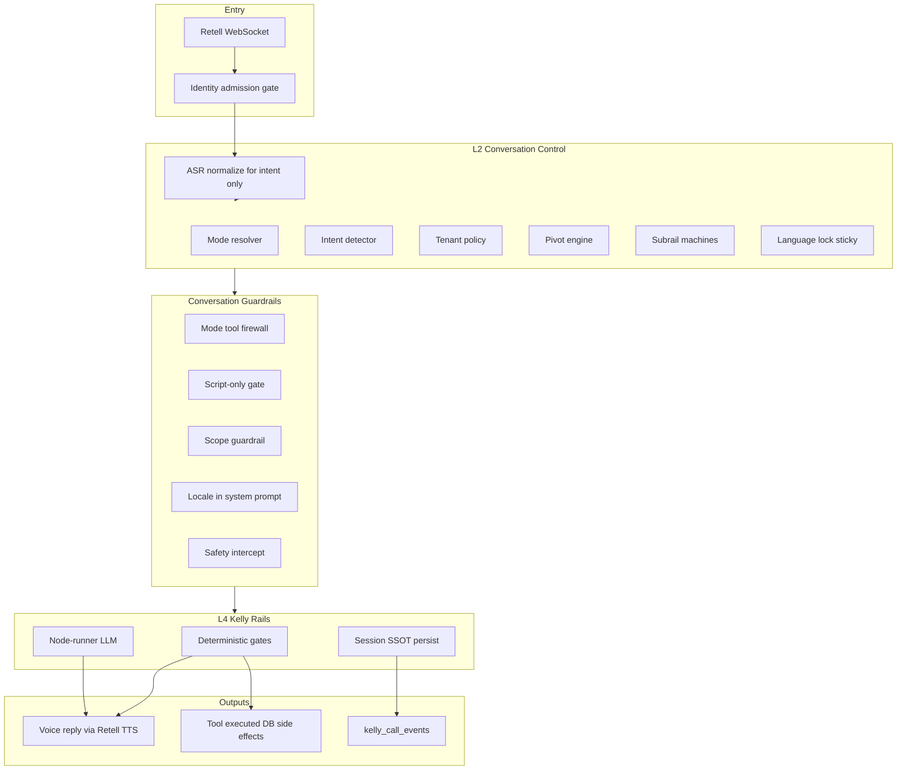
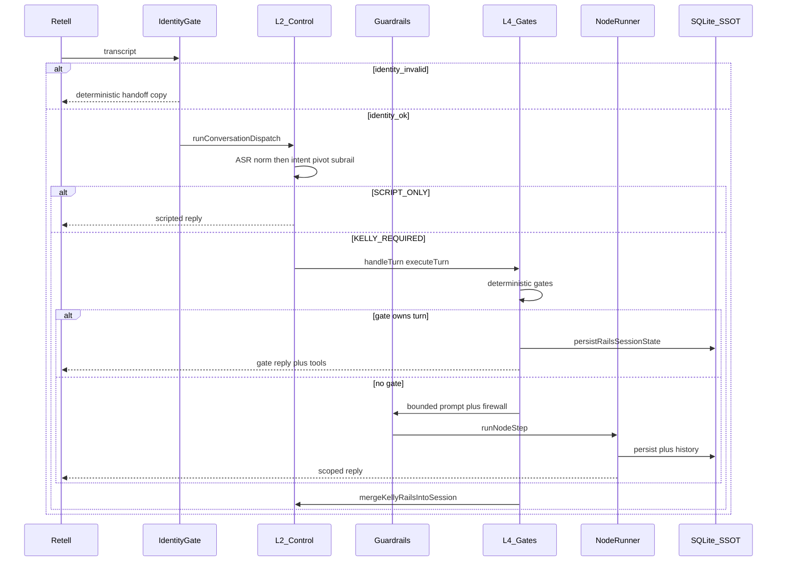

# Kelly Agentic Orchestration Architecture

**Last updated:** 2026-06-18  
**Status:** As-built — P0 gates shipped; enforce-routing on production (`api.callsomo.com`)  
**Code:** [`middleware-platform/services/conversation-mode/`](../../middleware-platform/services/conversation-mode/), [`middleware-platform/services/kelly-rails/`](../../middleware-platform/services/kelly-rails/)

**Deep-dive docs (narrative):**

- [`KELLY_SOLUTION_ARCHITECTURE_AS_BUILT.md`](./KELLY_SOLUTION_ARCHITECTURE_AS_BUILT.md) — system context, planes, modes, completeness
- [`KELLY_CONVERSATION_LOOP.md`](./KELLY_CONVERSATION_LOOP.md) — one-turn loop, code review friction
- [`KELLY_PRODUCTION_VS_FRAMEWORK.md`](./KELLY_PRODUCTION_VS_FRAMEWORK.md) — vs generic framework diagram

---

## Executive summary

Kelly voice orchestration is a **two-plane stack** with **guardrails between L2 and the LLM**:

1. **L2 Conversation Control** — owns mode, subrail, step, tenant policy, intent queue (LLM does not override when enforced).
2. **Conversation Guardrails** — mode firewall, script-only gate, topic scope, language lock, safety intercept.
3. **L4 Kelly Rails** — deterministic gates first; bounded LLM (`node-runner`) only when no gate owns the turn.
4. **Session SSOT** — `kelly_rails_session_projection` is authoritative; meta_kv mirrors for legacy readers.

LangGraph (`main-graph.js`) is a **thin single-node wrapper** around `executeTurn()` for tracing/checkpointing — not the orchestration brain.

---

## Layer diagram



---

## Turn flow (one utterance)



---

## Memory and state (not LangChain Memory)

| Store | Purpose | Authority |
|-------|---------|-----------|
| `kelly_rails_session_projection` | mode, subrail, lane, step, flags_json | **Primary SSOT** |
| `kelly_session_meta_kv` | legacy keys, slot ids, checkout | Mirror (transaction with projection) |
| `triage_sessions` | OPQRST, RAG, clinical rows | Clinical facts |
| `kelly_conversation_history` | LLM chat turns only | Dialog memory |
| LangGraph checkpointer | Trace/thread (optional) | **Not authoritative** — hydrate prefers projection |

**Read order:** projection → meta_kv → triage_sessions  
**Write path:** `persistRailsSessionState()` (+ meta sync in same transaction)

**Checkpoint policy:** Kelly invokes one graph node per turn; thread continuity is optional. Production disables in-process `MemorySaver`. `PostgresSaver` only when LangSmith multi-node tracing is active.

---

## L2 components

| Component | File | Role |
|-----------|------|------|
| Mode resolver | `conversation-mode-resolver.js` | call_type × direction × policy → mode |
| Intent detector | `intent-detector.js` | Per-turn intents (no LLM); ASR-normalized input |
| Tenant policy | `tenant-policy.js` | triage_policy, billing, records |
| Pivot engine | `pivot-engine.js` | Mode/subrail transitions; blocks demo_qual pivot in enforce |
| Subrails | `subrails/*.js` | Step machines: booking, cancellation, OPQRST, copay |
| Session | `conversation-mode-session.js` | Load/save, dispatch, intent drain |
| ASR normalize | `asr-normalize.js` | Filler strip before intent only (history unchanged) |

### Identity admission gate

Before L2 runs, validate Retell dynamic variables (`clinic_id`, `customer_id`, `call_type`, `direction`). Unresolved tenant → fail-closed SCRIPT_ONLY with en/es/zh handoff copy. Event: `identity_invalid`.

### Tenant policy note (dermatology)

Default `use_case: dermatology` sets `triage_policy: required`. Admin-first clinics must set explicit `policy_json` with `triage_policy: conditional` or booking routes to OPQRST.

---

## L4 components

| Component | File | Role |
|-----------|------|------|
| Entry | `kelly-turn-resolver.js` | L2 dispatch → handleTurn → merge |
| Graph shell | `kelly-rails/main-graph.js` | LangGraph START → execute_turn → END |
| Execute | `kelly-rails/execute-turn.js` | Hydrate, map subrail→lane, persist |
| Gates | `kelly-rails/lanes.js` + `gate-registry.js` | Cancel, reschedule, schedule, conflict, records |
| Turn planner | `kelly-rails/turn-planner.js` | Booking intents from L2; gate ownership decision |
| Slot parse | `kelly-rails/slot-time-parse.js` | HH:MM extraction; corrupt meta recovery |
| LLM | `kelly-rails/node-runner.js` | Bounded tools + scope guardrail |
| Confirm detection | `kelly-rails/confirm-utterance.js` | Confirmatory utterance for schedule gate |
| Prompts | `kelly-rails/prompts/` | Lane hints, deterministic copy, failure taxonomy |

### Deterministic schedule gate (booking)

Paths into `runDeterministicSchedule`:

1. **Stated time** — patient names time (`12:00 works`); `resolveBookingSlot` parses date/time; `get_available_slots` optional.
2. **Confirm with slot** — `current_booking_slot` + confirmatory utterance → `schedule_appointment`.
3. **Post-conflict** — alt slot picked in `runDeterministicBookingConflict` → confirm → schedule.

Schedule retries up to 21 business days on slot conflict. Idempotent re-confirms when `last_appointment_id` exists.

### Gate ordering (`gate-registry.js`)

Registry runs gates in priority order; first non-null reply owns the turn:

Safety (100) → payment → records → lookup → reschedule → cancel → clinical → opqrst → **schedule (90)** → **conflict (80)** → LLM fallback

**Critical:** schedule runs **before** conflict when patient is confirmatory with a resolved slot — prevents `no_slots_available` loops after `booking_conflict` is set.

---

## Guardrails

| Guardrail | Implementation |
|-----------|----------------|
| Mode firewall | `mode-tool-firewall.js` |
| Script-only | `Handoff.SCRIPT_ONLY` in dispatcher |
| Topic scope | `enforceScopeGuardrail()` in node-runner |
| Language lock | First detection sticky; mid-call switch → log+ignore |
| Safety | emergency-rail, OPQRST emergency, `runDeterministicSafety` |

---

## Multi-intent queue

`pending_intent_queue` drains on closed loops: `cancel_complete`, `schedule_appointment_success`, `reschedule_complete`, `records_complete`.

---

## Telemetry and TCC

Turn Completion Contract: [`TURN_COMPLETION_CONTRACT.md`](./TURN_COMPLETION_CONTRACT.md)

Minimum P0 events: `identity_invalid`, `mode_resolved`, `turn_resolved`, `scope_guardrail_triggered`, `tool_invoked`, `tool_completed`, `notification_failed`, `booking_outcome`.

Verify: `npm run verify:p0-telemetry`

---

## Environment (production target)

```bash
CONVERSATION_MODE_ROUTING=enforce
KELLY_RAILS_V2=1
KELLY_RAILS_ROLLOUT_PCT=1
KELLY_ALLOW_HYBRID_GRAPH=0
```

Verify: `npm run verify:kelly-rails-env` (includes conversation mode check in staging/prod profile).

---

## Known gaps and tickets

See [`todos/pending/KELLY_CONVERSATION_RAILS_TODOS.md`](../../todos/pending/KELLY_CONVERSATION_RAILS_TODOS.md) and orchestration remediation backlog.

| Risk | Mitigation ticket |
|------|-------------------|
| Bad Retell identity | Identity admission gate |
| Booking flake (no schedule_appointment) | Deterministic schedule gate |
| Post-conflict confirm | booking-conflict-confirm-gate |
| OPQRST dual owner | opqrst-unification |
| Empty provider slots | provider-availability-admission |
| Notification side effects | notification-side-effect-validation |
| demo_qual silent fallback | Block pivot in enforce mode |

---

## Related docs

- [`CONVERSATION_MODE_MATRIX.md`](../conversation/CONVERSATION_MODE_MATRIX.md)
- [`CONVERSATION_MODE_ROLLOUT.md`](../runbooks/CONVERSATION_MODE_ROLLOUT.md)
- [`LIVE.md`](./LIVE.md) — kelly rails v2 as built
- [`middleware-platform/ARCHITECTURE.md`](../../middleware-platform/ARCHITECTURE.md)
