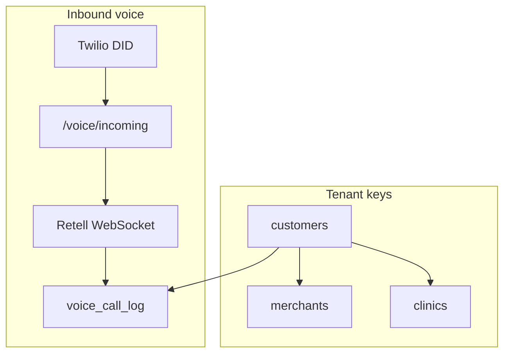
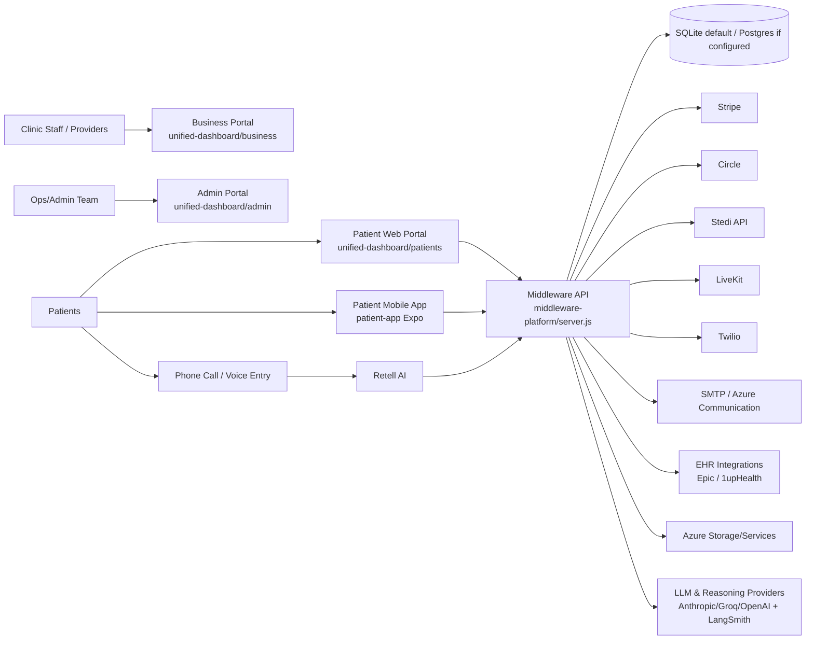
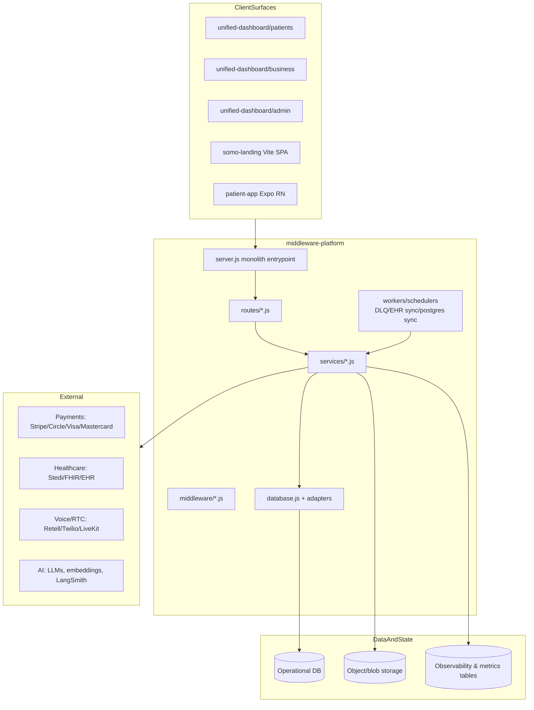
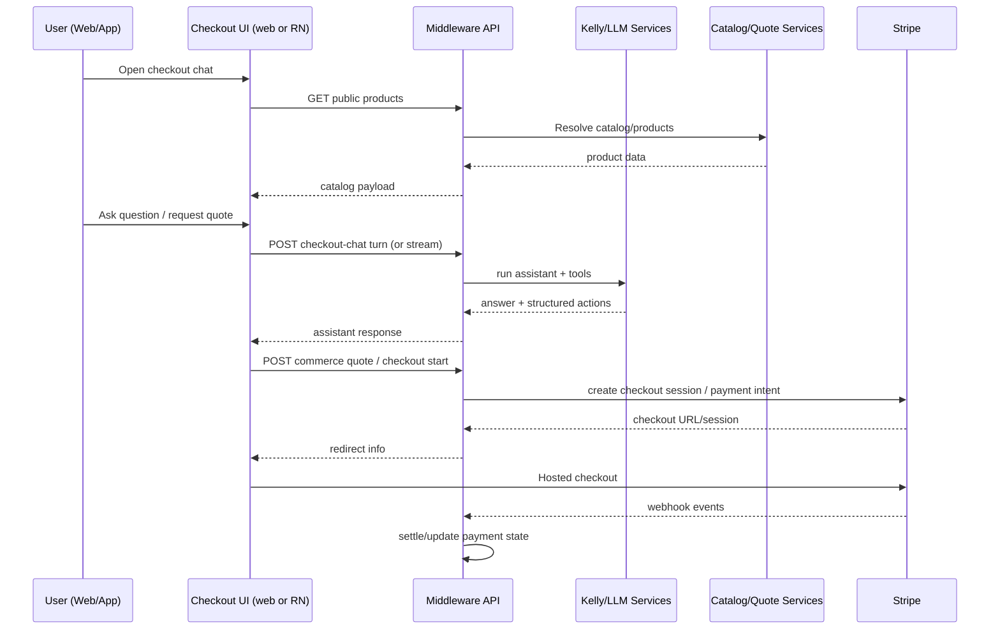
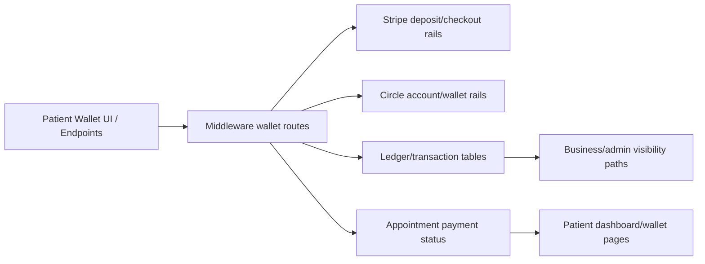
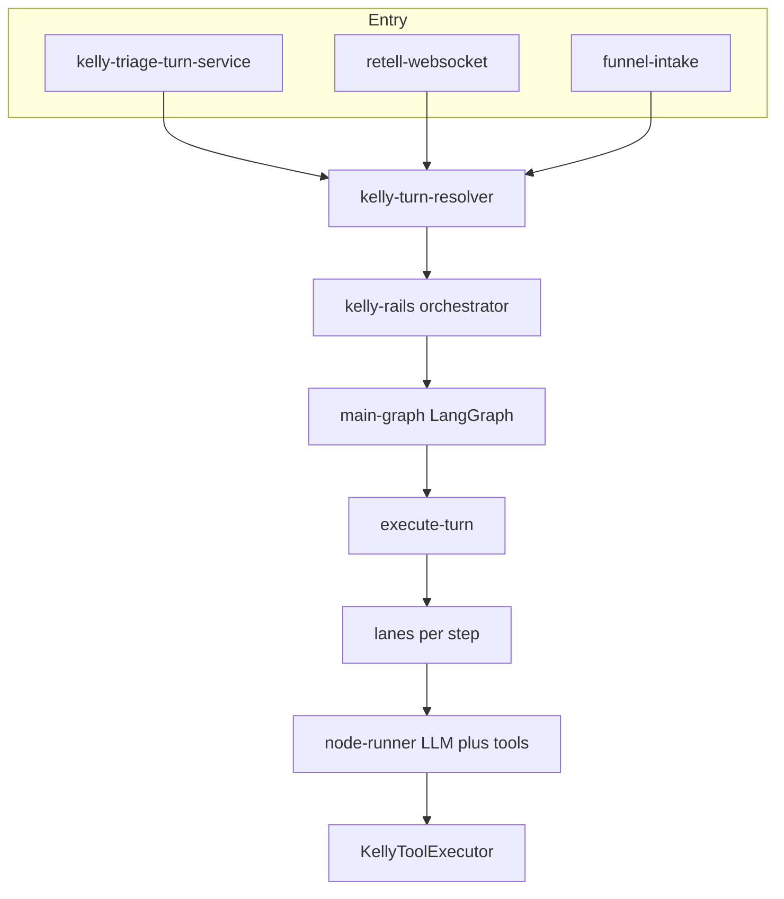
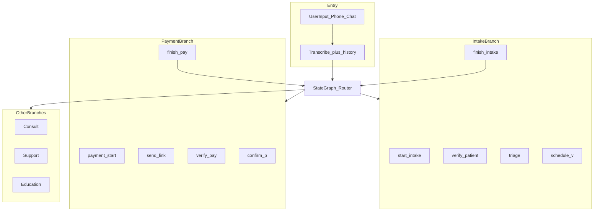
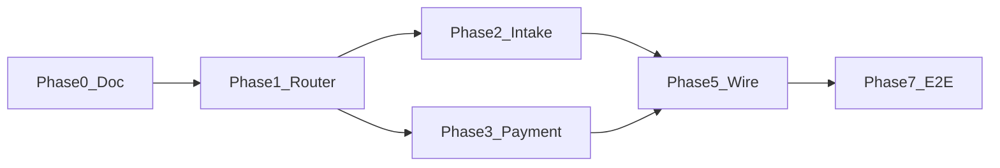

# LIVE

**Last updated:** 2026-06-02


---

<a id="current-state-architecture"></a>

## CURRENT STATE ARCHITECTURE

*Merged from `docs/architecture/CURRENT_STATE_ARCHITECTURE.md` on 2026-06-02.*

# Current State Architecture (Codebase-Derived)

**Last Updated:** 2026-05-30  
**Scope:** Monorepo-wide snapshot of how the platform is currently built, based on code and docs in this repository.  
**Audience:** Engineering, product, operations, security/compliance, onboarding developers.

---

## 1) Executive Summary

Somo (callsomo.com) and legacy Somo surfaces share a Node/Express middleware (`middleware-platform`) that orchestrates:

- Voice workflows (Retell + Twilio + booking/payment/insurance tools)
- Patient web portal and native mobile app experiences
- Agentic checkout and commerce (catalog -> quote -> chat -> Stripe checkout)
- Insurance/RCM and FHIR-adjacent healthcare data flows
- Video consult and tokenized realtime/session flows
- Admin/business/ops dashboards and automation pipelines

The system is intentionally **integration-heavy**, with many optional providers behind environment flags (Stripe, Circle, Stedi, Epic, 1upHealth, LiveKit, Azure services, LangSmith/LangChain tooling).  

---

## 1b) Somo SaaS tenant and voice (2026 foundation)

Canonical database and ops docs: [`docs/Database/README.md`](../Database/README.md).



| Concern | Source of truth |
|---------|-----------------|
| Provider login | `customers` + `customer_sessions` — [`auth-entrypoints.md`](../auth/auth-entrypoints.md) |
| Inbound phone | `customers.twilio_phone_number` — [VOICE_PHONE_SEMANTICS.md](./VOICE_PHONE_SEMANTICS.md) |
| Agent greeting/hours | `voice_agent_settings` by `merchant_id` (migrate off `cust:{id}`) |
| Live prompt runtime | Retell API (Week 3 SSOT) — [VOICE_PROMPT_SSOT.md](./VOICE_PROMPT_SSOT.md) |
| Per-call tenant FK | `voice_call_log.customer_id` today; state tables gain `customer_id` in migration `053` |
| RCM / coding tables | Separate merchant context — [VOICE_VS_RCM_TABLES.md](../RCM/VOICE_VS_RCM_TABLES.md) |

Week 1 operational gate: [SOMO_FOUNDATION_RUNBOOK.md](../Database/SOMO_FOUNDATION_RUNBOOK.md).

---

## 2) Repository Topology

Primary runtime surfaces:

- `middleware-platform/` - Core backend API + orchestration + workers + integrations
- `unified-dashboard/` - Static/web portals (patient, business, admin, insurer) and shared JS/CSS
- `unified-dashboard/somo-landing/` - Somo marketing SPA at `/` (`:5180` dev, proxies `/api` → `:4000`)
- `unified-dashboard/_archive/littlelab-landing/` - Archived CRA landing + Kelly/LiveKit assistant (retired 2026-05-29)
- `patient-app/` - Expo/React Native app (auth + appointments + checkout chat integration)
- `docs/` - Consolidated canonical documentation
- `scripts/`, `infra/`, `Knowledge/`, `todos/` - operations, infra, data assets, roadmap state

---

## 3) System Context Diagram



---

## 4) Container / Module Architecture



---

## 5) Backend Core (`middleware-platform`)

### 5.1 Runtime Characteristics

- Express-based API server with high route density (`server.js` + `routes/`)
- Security/boot guards:
  - Env validation on startup
  - Production JWT/FHIR guard requirements
  - Security middleware and webhook protections
- Feature flag style toggles via env for progressive rollout/shadowing
- Multi-domain support for patient/business/admin routing and static serve integration

### 5.2 Persistence Model

- Primary local default: SQLite (`better-sqlite3`) with migration-heavy `database.js`
- Optional Postgres mode when `POSTGRES_URL` is set
- Hybrid support patterns appear throughout data access for compatibility/sync
- State transition guards implemented for appointment/payment/checkout lifecycles
- WAL and timeout pragmas for SQLite concurrency

### 5.3 API Layering

- `server.js`: central composition + many directly-declared endpoints
- `routes/*.js`: domain-focused route modules (payments, FHIR, products, consult, orders, wallet, etc.)
- `services/*.js`: business logic, orchestration, integration clients, queue/workers, RAG/LLM layers
- `middleware/*.js`: auth/security/rate-limit/scope enforcement

---

## 6) Frontend Surfaces

## 6.1 Unified Dashboard (web)

Directories:

- `unified-dashboard/patients` - login/dashboard/appointments/book/schedule/triage/wallet/checkout-chat/profile
- `unified-dashboard/business` - provider/clinic operations, products/orders/invoices, feature flags, records
- `unified-dashboard/admin` - platform administration, workflows, clients, CRM-like pages
- Shared runtime scripts:
  - `assets/js/patient-api.js`
  - `assets/js/patient-shell.js`
  - auth/session/composer utility scripts

Characteristics:

- Mostly static HTML + vanilla JS + shared CSS token system
- Calls middleware APIs directly
- Implements multiple patient/payment experiences including Stripe checkout redirects

## 6.2 Landing Experience (`somo-landing`)

- Vite + React marketing SPA at `/` (hero, capabilities, demo, ROI, pricing, languages, FAQ)
- Image 1 palette via `somo-tokens.css` + `somo-landing/src/styles/somo.css`
- Public demo: `POST /api/public/somo-demo/request-call`
- Legacy CRA + Kelly/LiveKit assistant funnel: `_archive/littlelab-landing/` (archived 2026-05-29)

## 6.3 Patient Mobile App (`patient-app`)

- Expo Router + React Native
- Current implemented focus:
  - Session/auth verification flow
  - Appointment visibility
  - Checkout chat modal experience (`checkout-chat.tsx`) aligned with web APIs
- Supporting modules:
  - checkout helpers and analytics
  - design token parity (`skinCareTokens.ts`)
  - optional ledger/safe-harbor primitives (`useUnifiedLedger.ts`, `SafeHarborRing.tsx`)
- Dedicated doc (current): `docs/patient-app/PATIENT_APP_ARCHITECTURE_AND_AGENT_ORCHESTRATION.md`

---

## 7) Domain Architecture by Capability

## 7.1 Voice Agent and Telephony

Core components:

- Retell integration (`retell-service.js`, `routes/retell-functions.js`, webhook handlers)
- Voice-specific routes (`routes/voice.js`, `routes/voice-web-call.js`)
- Twilio services and webhook protections
- Voice triage guardrails and session-parity enforcement

Pattern:

1. Voice turn arrives from Retell/webhook
2. Middleware maps session/context and tool request
3. Domain services execute booking/payment/insurance/actions
4. Response returned to voice orchestration
5. Events/logs/audit stored and optionally traced

## 7.2 Booking and Patient Journey

Key services:

- `booking-service.js`
- `patient-portal-service.js`
- `patient-intake-service.js`
- `patient-orchestrator-service.js`
- scheduling/reminder services

Capabilities:

- Appointment lifecycle management (create/search/confirm/reschedule/cancel)
- Patient session verification and portal access
- Emerging matching/triage orchestration flows represented in docs + service layer

## 7.3 Checkout, Payments, Wallets, Settlement

Key route/service stack:

- Routes: `public-checkout.js`, `public-commerce-quote.js`, `payment.js`, `payment-ops.js`, wallet endpoints
- Services:
  - `payment-orchestrator.js`, `payment-flow-service.js`, `payment-service.js`
  - `checkout-workflow-service.js`, `checkout-payment-status-service.js`
  - `commerce-payment-settlement.js`, `settlement-service.js`, `instant-settlement-service.js`
  - `circle-service.js`, `hsa-wallet-service.js`

Current shape:

- Stripe is the primary card checkout/payment rail in active patient flows
- Circle/wallet capabilities remain present in code and APIs
- Fraud and anti-sybil controls sit around sensitive payment edges

## 7.4 Insurance, Claims, RCM, EOB

Relevant services:

- `insurance-service.js`, `rcm-service.js`, `eob-calculation-service.js`, `adjudication-service.js`
- payer/payor pipeline services (normalization, fuzzy matching, canonicalization, scoring)
- claims and payer cache support

Capabilities:

- Insurance eligibility and claims workflows
- Payer resolution/canonical registry pipelines
- Billing/financial data transformations

## 7.5 FHIR/EHR and Clinical Data

Key components:

- `routes/fhir.js`, `routes/diagnostic-report.js`
- `fhir-service.js`, adapters, middleware scope guards
- `ehr-sync-service.js`, `ehr-aggregator-service.js`, Epic-related adapters

Pattern:

- Middleware acts as normalized gateway between internal data model and FHIR/EHR interactions
- Additional production protections enforce secure access paths to PHI-sensitive resources

## 7.6 AI / Reasoning / RAG / Knowledge

Key components:

- LLM routing + orchestration: `llm-router.js`, `kelly-agent-service.js`, `kelly-tool-executor.js`
- Reasoning/quality layers: `reasoning-map-service.js`, `routine-reasoning-orchestrator.js`, summary/retrieval guardrails
- RAG services under `layer2-rag/*` and vector retrieval modules
- Derm and scan/ingredient pipelines
- LangSmith and LangChain instrumentation hooks

Characteristics:

- Multi-model architecture with provider abstraction tendencies
- Strong script-driven validation harnesses for reasoning quality and release gates
- Feature-flag and staged rollout patterns for AI route evolution

## 7.7 Video Consult / Realtime

- Routes/services for consult lifecycle and LiveKit token/session support
- Separate but connected to broader consult/patient flow
- Includes SSE and session orchestration constructs

## 7.8 Admin, Operations, Automation

Evidence in routes/services/scripts:

- Tenant, workflows, usage, internal ops, fraud review, automation routes
- Large operational script inventory for audits, migrations, backfills, reports, rollout checks
- Supports production-readiness gates, DLQ triage/replay, and observability reporting

---

## 8) Agentic Checkout End-to-End Flow (Current)



## 8.1 Patient App Agent Orchestration (Current)

The patient app orchestrates agent behavior through middleware, not on-device.

Current mobile pattern:

1. Mobile sends turn to `POST /api/patient/checkout-chat/turn/stream`.
2. Middleware invokes Kelly agent services and tool execution.
3. Tool executor calls commerce/quote/payment services as needed.
4. Middleware streams deltas back to RN client (SSE), with non-stream fallback route.
5. Mobile uses `quote_id` and starts hosted checkout via middleware route.

This is documented in:

- `docs/patient-app/PATIENT_APP_ARCHITECTURE_AND_AGENT_ORCHESTRATION.md`

---

## 9) Patient Wallet and Billing Flow (Current Code Presence)



Notes:

- Wallet-related backend and UI flows exist.
- Platform docs/roadmap indicate a launch simplification trend toward Stripe card-first paths.

---

## 10) Data and Storage Architecture

Data domains visible in code/docs:

- Patient + appointment + scheduling state
- Checkout/payment/transaction/claims records
- Payer/provider directory and normalization artifacts
- Clinical/FHIR/EHR synchronized resources
- Session/tool call/audit/ops telemetry
- Knowledge/embedding/vector-related metadata

Storage patterns:

- Relational operational store (SQLite default, optional Postgres)
- Blob/object storage for uploads and some pipeline assets
- In-memory + DB-backed caches/queues + DLQ-style recovery utilities

---

## 11) Security, Compliance, and Reliability Controls

Implemented control patterns:

- Startup env validation and production hard gates
- JWT and route-scoped access protections for sensitive healthcare routes
- Rate limiting and anti-abuse controls
- Webhook validation/replay guard logic for external callbacks
- Redaction and secure logging modules
- Fraud/anti-sybil review queues for payment-sensitive operations
- Extensive operational scripts for verification and readiness

---

## 12) Observability and Quality Gates

The codebase includes a broad quality harness:

- Jest and integration tests
- Playwright and E2E scripts (landing, journey, checkout, scan routes)
- Domain-specific verification scripts for:
  - reasoning quality
  - performance budgets
  - release readiness
  - routing consistency
  - security scans/redaction
  - data pipeline correctness

This indicates a platform designed around **scripted ops evidence** in addition to unit/integration tests.

---

## 13) Feature Inventory (What Exists in Code)

The following capabilities are represented by concrete modules/routes/scripts:

- Multi-tenant clinic/provider/patient surface architecture
- Voice receptionist flows with Retell tool execution
- Patient portal auth and appointment self-service
- Agentic checkout (web + RN parity) with Kelly chat and Stripe integration
- Product catalog, quote, and commerce order primitives
- Wallet and deposit/payment claim pathways (including Circle integration)
- Insurance eligibility/claims and RCM/EOB service layers
- FHIR/EHR integrations and sync workers
- Video consult token/session lifecycle support
- AI reasoning + RAG + scan/ingredient intelligence pipelines
- Provider/payor normalization, search, and network checks
- Fraud/anti-sybil and payment reliability mechanisms
- Admin/business operational dashboards and automation
- Extensive migration/backfill and rollout observability scripts

---

## 14) Architectural Strengths (Current State)

- Broad feature coverage across voice, clinical ops, payments, and commerce
- Strong integration abstraction in service layer
- Robust operational script ecosystem for validation and rollback confidence
- Multi-surface parity effort (web + native) in checkout
- Security-conscious startup/runtime guardrails for sensitive healthcare data

---

## 15) Architectural Tradeoffs / Risks (Current State)

- `server.js` is very large and central; ownership boundaries can blur
- High capability density can increase coupling and test matrix complexity
- Legacy and new pathways coexist (wallet/circle vs stripe-first trends), requiring clear deprecation strategy
- Mixed SQLite/Postgres patterns require disciplined migration and adapter consistency
- Feature-flag growth increases configuration complexity and operational burden

---

## 16) Recommended Next Documentation Steps

To keep this document accurate over time:

1. Add a monthly "delta log" section (new routes/services, removed features, migration status).
2. Track source-of-truth status for each major domain (active, legacy, deprecated, experimental).
3. Map each high-value flow to a test evidence pointer (script/test file references).
4. Add ownership tags per domain (`payments`, `voice`, `rcm`, `patient app`, etc.).
5. Add deployment topology by environment (local/staging/prod) with exact infra boundaries.

---

## 17) Diagram Index

- System Context Diagram (Section 3)
- Container/Module Diagram (Section 4)
- Agentic Checkout Sequence (Section 8)
- Wallet/Billing Flow Diagram (Section 9)

These are intentionally implementation-aligned and can be expanded into C4 Level 1/2/3 documents later.


---

<a id="kelly-rails-v2-as-built"></a>

## kelly rails v2 as built

*Merged from `docs/architecture/kelly_rails_v2_as_built.md` on 2026-06-02.*

# Kelly Agentic Rails V2 — As Built

**Date:** 2026-06-02  
**Code:** [`middleware-platform/services/kelly-rails/`](../../middleware-platform/services/kelly-rails/)

## Entry

All patient conversation channels should use [`kelly-turn-resolver.js`](../../middleware-platform/services/kelly-turn-resolver.js):

- `KELLY_RAILS_V2=1` → [`orchestrator.handleTurn`](../../middleware-platform/services/kelly-rails/orchestrator.js) (LangGraph + lane steps)
- `KELLY_RAILS_V2=0` → legacy `KellyAgentService.processTurn`
- Hybrid bridge fallback is **off by default**; enable only with `KELLY_ALLOW_HYBRID_GRAPH=1` during controlled migration tests.

## Architecture



## Lanes and steps

| Lane | Steps |
|------|--------|
| basic_intake | identity → contact → policy → done |
| clinical | clinical_intake → medical_history → medications → symptoms → triage_assessment → done |
| booking | schedule_visit → confirm_visit → done |
| payment | pay_invoice → insurance → receipt_logic → done |
| post_payment | finish → scheduled → confirmation → done |
| reschedule | find_booking → move_or_cancel → done |
| account | billing → insurance → done |
| education | education → clinical_advice → done |
| support | faq → handoff → done |

Tool allow-lists: [`tool-allowlists.js`](../../middleware-platform/services/kelly-rails/tool-allowlists.js).

## Deprecated (v2 path)

- [`kelly-conversation-bridge.js`](../../middleware-platform/services/kelly-conversation-bridge.js) — forwards to v2 when `KELLY_RAILS_V2=1`
- [`kelly-conversation-graph.js`](../../middleware-platform/services/kelly-conversation-graph.js) stub router
- `kelly_orchestrator_phase` as authority on v2 path

## Env

```bash
KELLY_RAILS_V2=1
KELLY_RAILS_ROLLOUT_PCT=1
KELLY_RAILS_MAX_TOOL_ITERATIONS=2
KELLY_ALLOW_HYBRID_GRAPH=0
```

## E2E

```bash
export KELLY_RAILS_V2=1
RCM_E2E_USE_EXISTING_SERVER=1 npm run test:e2e:rcm:conversation
```

## Not yet

- Nested subgraphs (`intake-graph-v2`, `scheduler-graph-v1`, `search-graph-v1`)
- SMS-specific adapter (use resolver when SMS handler gains Kelly turns)
- F2 full green proof (E7-1)


---

<a id="kelly-agentic-rails-target-and-build-plan"></a>

## KELLY AGENTIC RAILS TARGET AND BUILD PLAN

*Merged from `docs/architecture/KELLY_AGENTIC_RAILS_TARGET_AND_BUILD_PLAN.md` on 2026-06-02.*

# Kelly Agentic Rails — Target Architecture and Build Plan

**Status:** Active build plan (LangGraph-first)  
**Last updated:** 2026-06-02  
## 0. Phase status snapshot (closure checkpoint)

- Phase A foundation (Somo demo / API infra — **GO** 2026-06-02):
  - Canonical `/api/public/somo-demo/*` live on `api.callsomo.com` → Cloud Run `somo-middleware`.
  - Legacy demo alias routes and pre-cutover Cloud Run service **decommissioned** ([`GCP_SOMO_SERVICE_CUTOVER.md`](../deployment/GCP_SOMO_SERVICE_CUTOVER.md)).
  - Rolling 24h duplicate lock semantics are implemented in repo.
  - Deterministic API error codes (`DUPLICATE_PHONE_WINDOW`, `IP_RATE_LIMIT`, etc.) are implemented.
  - V2 resolver fallback is explicit (`KELLY_ALLOW_HYBRID_GRAPH=1` only).
  - Recovery playbook: `docs/agent/somo-demo/PHASE_A_GO_RECOVERY_RUNBOOK.md`
  - Deploy / cutover: `docs/deployment/SOMO_CLOUD_RUN_DEPLOY.md`, `docs/deployment/GCP_SOMO_SERVICE_CUTOVER.md`
  - Routing smoke: `npm run verify:prod:routing-smoke --prefix middleware-platform`
- Phase B+ (Kelly rails / outbound analytics):
  - V2 implementation in repo; Kelly E7-1 F2 and Sheets telemetry remain open per `todos/pending/KELLY_CONVERSATION_RAILS_TODOS.md` and Somo demo backlog.

**North star:** Cold-start patient ride — symptom → triage → book → copay link — without `seedBookingReady` or skip-triage fixtures.

**V2 rebuild (authoritative when `KELLY_RAILS_V2=1`):** [`middleware-platform/services/kelly-rails/`](../middleware-platform/services/kelly-rails/) — LangGraph host + lane steps + tool allow-lists. Phases 2–7 bridge/`processTurn` patches are **deprecated** on the v2 path (see [`kelly_rails_v2_as_built.md`](./kelly_rails_v2_as_built.md)).

**Related todos (execution checklists):**

- Open backlog pointer: [`todos/pending/KELLY_CONVERSATION_RAILS_TODOS.md`](../../todos/pending/KELLY_CONVERSATION_RAILS_TODOS.md)
- Completed golden-path work: [`todos/archive/KELLY_CONVERSATION_RAILS_GOLDEN_PATH_COMPLETED_2026-05-31.md`](../../todos/archive/KELLY_CONVERSATION_RAILS_GOLDEN_PATH_COMPLETED_2026-05-31.md)
- RCM identity / ledger (do not duplicate here): [`todos/pending/KELLY_RCM_PIPELINE_TODOS.md`](../../todos/pending/KELLY_RCM_PIPELINE_TODOS.md)
- Hybrid orchestration context: [`todos/pending/Orchestration-todos.md`](../../todos/pending/Orchestration-todos.md)
- Step 10 reasoning graph (separate product): [`todos/pending/Step10-LangChain-LangGraph-LangSmith-todos.md`](../../todos/pending/Step10-LangChain-LangGraph-LangSmith-todos.md)

**Target diagram:** [`assets/kelly_target_architecture.png`](./assets/kelly_target_architecture.png) (place PNG alongside this doc if missing from repo).

---

## 1. Problem statement

### Non-technical

Kelly is one assistant meant to handle several jobs: clinical visit booking, copay payment, skincare education, records questions, and more. The **capabilities exist** (calendar, triage, pay link APIs). The **problem is routing**: Kelly often puts clinic patients on the **skincare line** at the first turn (“Is your skin oily or dry?”) instead of clinical intake, and sometimes answers **generic billing** instead of **sending a pay link** when the patient asks to pay.

Booking and payment **work** when the session is already prepared (E2E fixtures, skip-triage). They **fail** on a natural cold-start conversation (F2 `test:e2e:rcm:conversation`).

### Technical

| Failure | Mechanism | Symptom |
|---------|-----------|---------|
| **Intake switch** | Step1 skin-type early return in `kelly-agent-service.js` runs **before** orchestrator + LLM | F2 T1–T2 stuck in skincare loop; phase stays `TRIAGE_DISCOVERY` |
| **Payment switch** | `_handleFastIntentPrecheck` returns generic billing with **no tools**; LLM may skip `request_patient_payment` | F2 T6 soft-pass via stale DB token |
| **Provider handoff** | `case_summaries` often written on **Stripe webhook**, not at schedule | Calendar clinical-prep empty until payment |

This is an **agentic control** problem (phases, shortcuts, tool enforcement), not missing backends.

---

## 2. Target architecture

One agent (Kelly), multiple **lines** (branches). A **router** picks the line each turn; each line has **sequential steps** and **isolated tool/prompt context**.



### State buckets (prompt + tool visibility)

| Bucket | Active branch | Tools visible (summary) | Hidden |
|--------|---------------|-------------------------|--------|
| **IntakeState** | `clinical_intake` | OPQRST, `run_triage_rag`, slots, schedule | Commerce cart, routine skincare-only |
| **BillingPaymentState** | `payment_line` | `request_patient_payment`, claims, eligibility | Scheduling, triage RAG |
| **HealthState** | Consult / triage detail | Records, literature, upload | Payment, commerce |
| **EducationState** | `skincare_education` | Routine, ingredients, products | Scheduling unless escalated |

**Finish nodes** (`finish_intake`, `finish_pay`) return control to the router for the next patient intent.

---

## 3. Current implementation map

| Diagram piece | Today in repo | Gap |
|---------------|---------------|-----|
| Router | [`kelly-orchestrator-phase.js`](../../middleware-platform/services/kelly-orchestrator-phase.js), `_classifyIntent` in [`kelly-agent-service.js`](../../middleware-platform/services/kelly-agent-service.js) | Not a graph; Step1 / billing fast-path **preempt** router |
| Intake branch | [`kelly-tool-executor.js`](../../middleware-platform/services/kelly-tool-executor.js); phases `TRIAGE_*` / `BOOKING` | No sequential nodes; Step1 hijacks cold start |
| Payment branch | `request_patient_payment`, `BILLING` phase | No mandatory `send_link` node |
| Education | `ROUTINE_INTAKE`, Step1 | Correct for skincare; must not own clinic visit |
| Kelly LangGraph host | **Phase 1:** [`kelly-conversation-graph.js`](../../middleware-platform/services/kelly-conversation-graph.js) (router skeleton) | Subgraphs + entrypoint wiring pending |
| Other LangGraph | [`coding-graph.js`](../../middleware-platform/services/coding-graph.js), [`video-consult-graph.js`](../../middleware-platform/services/video-consult-graph.js) | Parallel on voice in [`retell-websocket.js`](../../middleware-platform/webhooks/retell-websocket.js) — **coding** = claims pipeline, not patient conversation rails |
| Commerce checkout | [`checkout-graph.js`](../../middleware-platform/services/checkout-graph.js) shim | Shop line separate from RCM copay |

### Graph boundaries (do not merge)

| Graph | Owns |
|-------|------|
| **Kelly conversation graph** | Patient-facing rails: intake, pay, education, support |
| **Coding graph** | Voice call coding stages: INTAKE → CODING → BILLING (claims) |
| **Video consult graph** | End-of-visit summary + artifacts |
| **Step 10 graph** | `process_patient` L1–L6 reasoning (see Step10 todos) |

---

## 4. Design decision: LangGraph-first (locked)

**New module:** [`middleware-platform/services/kelly-conversation-graph.js`](../../middleware-platform/services/kelly-conversation-graph.js)

**Host pattern** (mirror [`coding-graph.js`](../../middleware-platform/services/coding-graph.js)):

- `StateGraph` + `Annotation` for `active_branch`, `branch_step`, `last_message`, `session_id`, `flags`
- Checkpointer: `MemorySaver` (dev) / `PostgresSaver` (prod when `POSTGRES_URL` + `LANGGRAPH_USE_POSTGRES`)
- Env: `LANGGRAPH_KELLY_ROLLOUT_PCT` (0 | 1 in production), `LANGGRAPH_KELLY_SHADOW` (shadow compare)
- Fallback: graph unavailable or rollout off → `KellyAgentService.processTurn`

**Kelly sub-node:** Each branch step invokes existing `KellyToolExecutor.execute` / bounded LLM turn — **no duplicate HTTP**.

**State migration:** Checkpointer owns branch/step; read legacy `kelly_session_meta_kv` during migration only. Avoid dual-writers for the same transition (see Step10 orchestration note).

---

## 5. Graph state schema (D0-2)

```json
{
  "session_id": "string",
  "clinic_id": "string|null",
  "patient_id": "string|null",
  "channel": "voice|chat",
  "active_branch": "router|clinical_intake|payment_line|skincare_education|consult|support|unknown",
  "branch_step": "string",
  "last_user_message": "string",
  "flags": {
    "routine_intake_active": false,
    "triage_complete": false,
    "has_rag": false,
    "booking_intent_seen": false
  },
  "branch_payload": {}
}
```

### Branch / step enums

| `active_branch` | `branch_step` values (ordered) |
|-----------------|--------------------------------|
| `clinical_intake` | `start_intake` → `verify_patient` → `triage` → `schedule_v` → `finish_intake` |
| `payment_line` | `payment_start` → `send_link` → `verify_pay` → `confirm_p` → `finish_pay` |
| `skincare_education` | `routine_intake` → `routine_followup` |
| `consult` | `records_qa` |
| `support` | `faq` → `handoff` |

---

## 6. Router rules (G1-2)

Implemented in `routeIntakeSwitch(state)` — keyword + session flags:

| Signal | Route |
|--------|--------|
| Pay / copay / balance / “send link” | `payment_line` |
| `routine_intake_active=1` and no clinical escape | `skincare_education` |
| Rash, pain, symptoms, book, appointment, gynecology, etc. | `clinical_intake` |
| Records / “last visit” | `consult` |
| Receipt / claim (not pay-now) | `support` or legacy billing fast-path until graph owns it |
| Else | `unknown` → router LLM or legacy `processTurn` |

Clinical signals **must not** default to skincare when `routine_intake_active=0`.

---

## 7. E2E north star (D0-3)

| Script | Command | Pass criteria |
|--------|---------|---------------|
| **F2 full ride** | `RCM_E2E_USE_EXISTING_SERVER=1 npm run test:e2e:rcm:conversation` | T1–T4 cold triage→book; T6 `request_patient_payment` + **fresh** token |
| F1b isolate booking | `npm run test:e2e:kelly:booking-fixture` | Seeded BOOKING (regression) |
| F1c pay fixture | `npm run test:e2e:kelly:pay-fixture` | Pay tool + token |
| Playwright golden | `npm run test:e2e:kelly:golden` | Browser; optional `RCM_E2E_STRIPE_LIVE=1` |
| Playwright skip-triage | `npm run test:e2e:kelly:golden:skip-triage` | Booking line regression |

**F2 turn contract (derm rash):**

| Turn | Patient intent | Phase (end) | Tool assert |
|------|----------------|-------------|-------------|
| T1 | Itchy rash, want derm | `TRIAGE_DISCOVERY` or `TRIAGE_ACTIVE` | No skin-type-only loop |
| T2 | OPQRST details | `TRIAGE_ACTIVE` | `run_triage_rag` optional T2b |
| T3 | Soonest appointment | `BOOKING` | `get_available_slots` |
| T4 | Confirm slot + email | `BOOKING` | `schedule_appointment` |
| T5 | Copay question | `BILLING` | Insurance/copay language |
| T6 | Pay now, send link | `BILLING` | `request_patient_payment` |

Add **F2-obgyn** variant: pelvic pain + gynecology — no Step1 skin quiz; `target_specialty` ObstetricsGynecology.

**Env (server):** `FEATURE_PATIENT_CHAT_ENABLED=1` for browser path; LLM key required for conversation scripts.

---

## 8. What is already done (reuse, do not rebuild)

From golden-path archive (2026-05-31):

- Authoritative RAG via `triage_sessions.rag_result_id`; no overwrite after `triage_complete`
- Groq fallback skips re-triage when locked
- `_resolveAppointmentTypeForSession` / specialty from RAG (not hardcoded Primary Care)
- `seedE2eBookableProvider` + 24h heartbeat for long LLM turns
- Booking server-side guardrails (slots/schedule when triage complete + booking intent)
- F1b/F1c fixtures; Playwright skip-triage green
- Partial Step1 skip: `_skipStep1SkinClarifierForClinicVisit` (insufficient alone for F2 T2)

**Wire into graph nodes** via `KellyToolExecutor`, not new routes.

---

## 9. Full build checklist

Check off in PRs; archive completed phases under `todos/archive/KELLY_AGENTIC_RAILS_PHASE_*_COMPLETED_*.md`.

### Phase 0 — Documentation (this file)

- [x] **D0-1** Publish this document + diagram asset path
- [x] **D0-2** State schema + branch enums (§5–6)
- [x] **D0-3** E2E north star (§7)
- [x] **D0-4** Cross-link RCM pipeline todos (header links)

### Phase 1 — Graph skeleton + router

- [x] **G1-1** `kelly-conversation-graph.js` START → `router` node
- [x] **G1-2** `routeIntakeSwitch` conditional edges
- [x] **G1-3** Router inputs: message + flags (+ legacy meta read during migration)
- [x] **G1-4** Unit tests: router edges (rash, OBGYN, pay, skincare-only) — [`kelly-conversation-graph-router.test.js`](../../middleware-platform/__tests__/kelly-conversation-graph-router.test.js)
- [x] **G1-5** `LANGGRAPH_KELLY_ROLLOUT_PCT` + production 0|1 guard

### Phase 2 — Intake branch subgraph

- [x] **I2-1** `start_intake`: IntakeState prompt; hide skincare tools (hybrid `graphHost` + `TRIAGE_DISCOVERY`)
- [x] **I2-2** `verify_patient`: FHIR + contact meta (graph step + phase forcing)
- [x] **I2-3** `triage`: OPQRST + `run_triage_rag` (existing tools; Step1 gated for clinical visit)
- [x] **I2-4** `schedule_v`: slots + schedule (reuse guardrails)
- [x] **I2-5** `finish_intake`: `case_summaries` at book time — [`case-summary-service.js`](../../middleware-platform/services/case-summary-service.js)
- [x] **I2-6** Graph router before Step1; `_shouldSkipStep1ForTurn` when `clinical_intake` / graph active
- [x] **I2-7** `clinicClinicalMinimumIntakeMet` vs derm-specific skin gate
- [x] **I2-8** E2E F2 T1–T4 assertions + optional `KELLY_E2E_OBGYN=1`

### Phase 3 — Payment branch subgraph

- [x] **P3-1** `payment_start`: resolve copay amount (guardrail + eligibility)
- [x] **P3-2** `send_link`: mandatory `request_patient_payment` (server guardrail)
- [x] **P3-3** `verify_pay` / `confirm_p` (meta step advance after link sent)
- [x] **P3-4** `finish_pay` → router (bridge `advanceGraphStepAfterTurn`)
- [x] **P3-5** Disable billing fast-path for pay-now / `payment_line`
- [x] **P3-6** Clear stale pay meta via `wipeChatSessionClinicalState` on F2 bootstrap
- [x] **P3-7** E2E F2 T6 strict (`request_patient_payment` + fresh `rcm_pay_token`)

### Phase 4 — Other branches (later)

- [x] **O4-1** Education subgraph — `skincare_education_entry` + `routine_intake_active` meta
- [x] **O4-2** Consult subgraph — `consult_entry` + `kelly_consult_intent` meta
- [x] **O4-3** Support subgraph — `support_entry` (billing FAQ allowed)
- [x] **O4-4** Reschedule/cancel → visit entry (`isRescheduleCancelIntent`)

### Phase 5 — Wire entrypoints

- [x] **W5-1** `retell-websocket.js` invoke Kelly graph (alongside coding graph)
- [x] **W5-2** Patient chat / `kelly-triage-turn-service.js`
- [x] **W5-3** Fallback to `processTurn` when graph off
- [x] **W5-4** LangSmith `runName` per branch/node

### Phase 6 — Provider portal

- [x] **V6-1** Clinical-prep: triage by appointment ↔ session without waiting for Stripe
- [x] **V6-2** Video case-report from `case_summaries` + triage session
- [ ] **V6-3** Sprint 4 staging verify (provider-shell, rcm.html) — manual

### Phase V2 — Rails rebuild (2026-06-02)

- [x] **V2-1** `kelly-rails/` orchestrator + main graph + lane steps + tool allow-lists
- [x] **V2-2** `kelly-turn-resolver` + wired chat/voice/funnel/checkout/E2E
- [x] **V2-3** Docs [`kelly_rails_v2_as_built.md`](./kelly_rails_v2_as_built.md) + archive
- [ ] **V2-4** Remove legacy `processTurn` default (after production validation)

### Phase 7 — Proof and rollout

- [ ] **E7-1** F2 full green (validate locally; long LLM runtime; use `LANGGRAPH_KELLY_ROLLOUT_PCT=1`, `KELLY_RAILS_V2=0`)
- [ ] **E7-2** Playwright full golden (+ optional live Stripe)
- [x] **E7-3** CI `run-rcm-e2e-suite.cjs` includes F2 with `LANGGRAPH_KELLY_ROLLOUT_PCT=1`
- [x] **E7-4** Dev/E2E rollout `LANGGRAPH_KELLY_ROLLOUT_PCT=1`; `kelly_graph_active` meta; `LANGGRAPH_KELLY_ENABLED=0` escape
- [x] **E7-5** Archive — [`KELLY_AGENTIC_RAILS_PHASE_2_7_COMPLETED_2026-06-01.md`](../../todos/archive/KELLY_AGENTIC_RAILS_PHASE_2_7_COMPLETED_2026-06-01.md)

---

## 10. Dependency graph



---

## 11. File ownership map

| Concern | Primary file |
|---------|----------------|
| Kelly conversation graph | `services/kelly-conversation-graph.js` |
| Legacy turn loop | `services/kelly-agent-service.js` |
| Phase + tool allow-list | `services/kelly-orchestrator-phase.js` |
| Tool execution | `services/kelly-tool-executor.js` |
| Triage RAG | `services/triage-rag-service.js` |
| HTTP booking guards | `services/voice-triage-guards.js` |
| Voice WS entry | `webhooks/retell-websocket.js` |
| Patient chat turn | `services/kelly-triage-turn-service.js` |
| E2E fixtures | `e2e/helpers/kelly-conversation-fixtures.cjs` |
| F2 script | `scripts/e2e-kelly-rcm-pay-conversation.cjs` |
| Provider clinical prep | `routes/admin-platform.js` |
| Case summary persist (today) | `routes/stripe-webhook-handler.js` |

---

## 12. Risks

1. **Dual state** — graph checkpointer vs `kelly_session_meta_kv` until migration completes.
2. **Parallel graphs on voice** — coding graph + Kelly graph; document ownership per call.
3. **LLM latency** — ~6–7 min/turn; keep 900s+ client timeouts (golden-path).
4. **Step1 patch insufficient** — graph must own intake routing, not keyword patch alone.
5. **False-green pay tests** — require fresh token + tool in `toolsUsed` for T6.

---

## 13. Success criteria (product)

Patient can call or chat Kelly, describe a clinical need, complete triage, book a specialty-correct visit, and receive a copay pay link — **without** test fixtures — and provider sees triage summary linked to the appointment **before** payment completes.


---

<a id="server-decomposition"></a>

## SERVER DECOMPOSITION

*Merged from `docs/architecture/SERVER_DECOMPOSITION.md` on 2026-06-02.*

# Server.js decomposition

**Last updated:** 2026-05-21

## Problem statement

[`middleware-platform/server.js`](../../middleware-platform/server.js) is the Express entry point. Patient-portal HTTP, Kelly triage, landing assistant, checkout-chat, and most admin routes are now registered from `routes/` + `services/` (~**11k** lines remain in `server.js` for boot, host-based HTML, and legacy API blocks). That still creates:

- Painful PR reviews and merge conflicts
- Hard onboarding (“where is this endpoint?”)
- Violation of the repo’s own [incremental refactor policy](../development/README.md#server-js-refactor-policy)

Runtime behavior is fine; the issue is **maintainability**, not correctness.

## Principles

1. **New HTTP handlers** go in [`middleware-platform/routes/`](../../middleware-platform/routes/), mounted from `server.js`.
2. **Business logic** stays in [`services/`](../../middleware-platform/services/) and [`lib/`](../../middleware-platform/lib/).
3. **One route group per PR** when possible; identical URLs and JSON contracts.
4. **Dependency injection** — route modules receive `db`, middleware, and helpers via a `deps` object (see [`routes/patient-care-program-billing.js`](../../middleware-platform/routes/patient-care-program-billing.js)).

## Layering

```text
server.js          → boot, CORS, static mounts, register*Routes(app, deps)
routes/*.js        → paths, middleware chain, res.json shape
services/ + lib/   → domain rules, SQL helpers, enrichment
database.js        → persistence primitives
```

## Target layout

| Module | Owns |
|--------|------|
| [`routes/patient-routine.js`](../../middleware-platform/routes/patient-routine.js) | Routine, journal calendar-range, progress-summary, auth handoff |
| [`routes/patient-shelf.js`](../../middleware-platform/routes/patient-shelf.js) | Shelf products + link-routine-item |
| [`routes/patient-products.js`](../../middleware-platform/routes/patient-products.js) | Product catalog, lists, scans |
| [`routes/patient-billing-portal.js`](../../middleware-platform/routes/patient-billing-portal.js) | Inline billing portal APIs (documents, events, money-summary, …) |
| [`routes/patient-care-program-billing.js`](../../middleware-platform/routes/patient-care-program-billing.js) | Stripe care-program subscription (already extracted) |
| [`middleware/patient-session.js`](../../middleware-platform/middleware/patient-session.js) | `requirePatientSession`, `resolvePatientIdFromSession`, portal events |
| [`lib/patient-portal-shared.js`](../../middleware-platform/lib/patient-portal-shared.js) | ISO date helpers, `safeParseJsonArray`, signed doc URLs |
| [`lib/patient-routine-db.js`](../../middleware-platform/lib/patient-routine-db.js) | `ensureRoutineTables` |
| [`services/kelly-triage-turn-service.js`](../../middleware-platform/services/kelly-triage-turn-service.js) | Shared Kelly triage turn (patient portal + landing) |
| [`routes/public-landing-assistant.js`](../../middleware-platform/routes/public-landing-assistant.js) | `/api/public/landing-assistant/*` |
| [`routes/public-product-scan.js`](../../middleware-platform/routes/public-product-scan.js) | `/api/public/beautyfacts`, `/api/public/foodfacts` |
| [`routes/patient-checkout-chat.js`](../../middleware-platform/routes/patient-checkout-chat.js) | Patient + public checkout-chat Kelly turns |
| [`services/patient-checkout-chat-service.js`](../../middleware-platform/services/patient-checkout-chat-service.js) | Commerce checkout-chat orchestration |
| [`routes/patient-profile.js`](../../middleware-platform/routes/patient-profile.js) | Profile, intake, me, features, records, receipts |
| [`routes/patient-auth.js`](../../middleware-platform/routes/patient-auth.js) | OTP verify, logout |
| [`routes/patient-documents.js`](../../middleware-platform/routes/patient-documents.js) | Documents CRUD, upload link, visit feedback |
| [`routes/patient-wallet.js`](../../middleware-platform/routes/patient-wallet.js) | Wallet, HSA, cards |
| [`routes/patient-insurance.js`](../../middleware-platform/routes/patient-insurance.js) | Insurance GET/PUT |
| [`routes/voice-appointments.js`](../../middleware-platform/routes/voice-appointments.js) | Inline `/voice/appointments/*` and related |
| [`routes/admin-platform.js`](../../middleware-platform/routes/admin-platform.js) | Legacy `/api/admin/*` handlers |
| [`lib/resolve-clinic-id.js`](../../middleware-platform/lib/resolve-clinic-id.js) | `resolveClinicIdFromRequest`, `FALLBACK_CLINIC_ID` |
| [`bootstrap/static-hosting.js`](../../middleware-platform/bootstrap/static-hosting.js) | SPA prefixes, dashboard static, CRA assets |

## `patientRouteDeps` contract

Route registrars receive a subset of:

| Key | Role |
|-----|------|
| `apiLimiter` | Rate limit middleware |
| `express` | JSON / urlencoded |
| `db` | Database module |
| `requirePatientSession` | Patient auth |
| `resolvePatientIdFromSession` | FHIR patient id resolution |
| `recordPatientPortalEvent` | Analytics / audit events |
| `ensureRoutineTables` | DDL for routine tables |
| `ensureBillingTables` | DDL for billing tables |
| `parseBillingDocumentUpload` | Multer for photo/billing uploads |
| `fetchBillingAggregatesByDay`, `fieldsFromSqlAggRow` | Journal + billing calendar merge |
| `PatientPortalService` | Handoff exchange validation |
| Shelf helpers | `loadPatientShelfProductRows`, `formatShelfProductApiRow`, … |

## Phase status

| Phase | Scope | Status |
|-------|--------|--------|
| 0 | This doc + ownership map updates | Done |
| 1 | `routes/patient-routine.js` | Done |
| 2 | `routes/patient-shelf.js`, `patient-products.js` | Done |
| 3 | `routes/patient-billing-portal.js` | Done |
| 4 | `middleware/patient-session.js` + shared libs | Done |
| 5 | Kelly booking / triage / appointments (~19k lines) | Done (`routes/patient-booking.js`) |
| 6 | Kelly triage service + landing routes | Done (`services/kelly-triage-turn-service.js`, `routes/public-landing-assistant.js`) |
| 6b | Product scan + checkout-chat | Done (`routes/public-product-scan.js`, `routes/patient-checkout-chat.js`) |
| 6c | Remaining patient portal inline routes | Done (`patient-profile`, `patient-auth`, `patient-documents`, `patient-wallet`, `patient-insurance`) |
| 6d | Voice appointment inline routes | Done (`routes/voice-appointments.js`) |
| 6e | Admin platform inline routes | Done (`routes/admin-platform.js`) |
| 6f | Static hosting bootstrap | Done (`bootstrap/static-hosting.js`; host-based HTML still in `server.js`) |

Triage HTTP handlers in **`routes/patient-booking.js`** call **`services/kelly-triage-turn-service.js`** directly (no `handlePatientTriageMessage` in `server.js`).

## Routine / timeline API index

Owned by **`routes/patient-routine.js`** (was inline in `server.js`):

| Method | Path |
|--------|------|
| POST | `/api/patient/auth/handoff/create` |
| POST | `/api/patient/auth/handoff/exchange` |
| GET/POST | `/api/patient/routine/template` |
| GET | `/api/patient/routine/phase` |
| GET | `/api/patient/routine/compare` |
| GET | `/api/patient/routine/layering-check` |
| GET/POST | `/api/patient/routine/daily` |
| POST | `/api/patient/routine/daily/:id/media-link` |
| POST | `/api/patient/routine/daily/:id/photo` |
| GET | `/api/patient/journal/calendar-range` |
| GET | `/api/patient/home/progress-summary` |

Product contracts: [`docs/architecture/patients/PATIENT_TIMELINE_ROUTINE_AND_BILLING.md`](./patients/PATIENT_TIMELINE_ROUTINE_AND_BILLING.md), parity: [`docs/user-journey/06-mobile-and-web-parity.md`](../user-journey/06-mobile-and-web-parity.md).

## How to add a new patient endpoint

1. Pick the owning `routes/patient-*.js` file (or create one).
2. Add handler inside `register*Routes(app, deps)` — **not** inline in `server.js` unless hotfix.
3. Put non-trivial logic in `lib/` or `services/`.
4. Add/update Jest coverage for contracts.
5. Update this file’s ownership table and [`RUNTIME_ENTRYPOINTS_AND_ROUTE_OWNERSHIP.md`](./RUNTIME_ENTRYPOINTS_AND_ROUTE_OWNERSHIP.md).

## Verification

```bash
cd middleware-platform
npm test -- --testPathPattern="routine|compare|layering|calendar"
node scripts/sandbox-routine-photo-loop.cjs
node -e "require('./server.js')"  # or start server and smoke Today/Journal
```

`wc -l server.js` should decrease after each extraction phase.


---

<a id="runtime-entrypoints-and-route-ownership"></a>

## RUNTIME ENTRYPOINTS AND ROUTE OWNERSHIP

*Merged from `docs/architecture/RUNTIME_ENTRYPOINTS_AND_ROUTE_OWNERSHIP.md` on 2026-06-02.*

# Runtime entrypoints and route ownership (middleware)

**Last Updated:** 2026-06-02

> **Companion:** End-to-end flows (landing → API → DB) in [RUNTIME_ENTRYPOINTS_AND_CALL_PATHS.md](./RUNTIME_ENTRYPOINTS_AND_CALL_PATHS.md).

Single map for “what listens where” on the main Node process. **Compose entry:** [`middleware-platform/server.js`](../../middleware-platform/server.js). **Decomposition map:** [`SERVER_DECOMPOSITION.md`](./SERVER_DECOMPOSITION.md).

## Patient portal routes (extracted from server.js)

| Module | Paths |
|--------|--------|
| [`routes/patient-routine.js`](../../middleware-platform/routes/patient-routine.js) | `/api/patient/routine/*`, `/api/patient/journal/calendar-range`, `/api/patient/home/progress-summary`, auth handoff |
| [`routes/patient-shelf.js`](../../middleware-platform/routes/patient-shelf.js) | `/api/patient/shelf/products` |
| [`routes/patient-products.js`](../../middleware-platform/routes/patient-products.js) | `/api/patient/products/*` |
| [`routes/patient-billing-portal.js`](../../middleware-platform/routes/patient-billing-portal.js) | `/api/patient/billing/*` (portal; not care-program Stripe) |
| [`routes/patient-care-program-billing.js`](../../middleware-platform/routes/patient-care-program-billing.js) | `/api/patient/billing/care-program/*` |
| [`routes/patient-booking.js`](../../middleware-platform/routes/patient-booking.js) | Appointments, booking, triage/message, async-review |
| [`services/kelly-triage-turn-service.js`](../../middleware-platform/services/kelly-triage-turn-service.js) | Kelly triage turn logic (portal + landing) |
| [`routes/public-landing-assistant.js`](../../middleware-platform/routes/public-landing-assistant.js) | Landing assistant turn, TTS, results, thread-event, voice metrics |
| [`routes/public-product-scan.js`](../../middleware-platform/routes/public-product-scan.js) | `beautyfacts` / `foodfacts` barcode lookup |
| [`routes/patient-checkout-chat.js`](../../middleware-platform/routes/patient-checkout-chat.js) | Checkout-chat turns (patient + public) |
| [`routes/patient-profile.js`](../../middleware-platform/routes/patient-profile.js) | Profile, intake, identity, records |
| [`routes/patient-auth.js`](../../middleware-platform/routes/patient-auth.js) | Verify OTP, logout |
| [`routes/patient-documents.js`](../../middleware-platform/routes/patient-documents.js) | Documents, upload link |
| [`routes/patient-wallet.js`](../../middleware-platform/routes/patient-wallet.js) | Wallet, cards |
| [`routes/patient-insurance.js`](../../middleware-platform/routes/patient-insurance.js) | Insurance |
| [`routes/voice-appointments.js`](../../middleware-platform/routes/voice-appointments.js) | Voice scheduling/checkout/insurance HTTP |
| [`routes/admin-platform.js`](../../middleware-platform/routes/admin-platform.js) | Inline admin dashboard API |
| [`middleware/patient-session.js`](../../middleware-platform/middleware/patient-session.js) | Shared `requirePatientSession`, CSRF, portal events |

## Process

- **Entry:** `node server.js` from [`middleware-platform/package.json`](../../middleware-platform/package.json).
- **Default port:** `4000` (or `PORT`).

## Somo marketing landing (`somo-landing`)

The Somo marketing Vite bundle (`unified-dashboard/somo-landing/build`) is served at:

| Pattern | Notes |
|---------|--------|
| `GET /` | Somo landing SPA (hero, capabilities, demo, pricing). See [SOMO_LANDING.md](../deployment/SOMO_LANDING.md). |

Legacy Skin & Care CRA + Kelly assistant (`_archive/littlelab-landing/build`) is **not** mounted at `/` (archived 2026-05-29). Historical routes (`/shop`, `/find-provider`, landing-assistant APIs) referred to that bundle — see archive README.

## Patient Navigator (legacy CRA, archived)

When the archived CRA is mounted for dev only:

| Pattern | Notes |
|---------|--------|
| `GET /find-provider`, `GET /find-provider/*` | Patient Navigator Medicaid provider page (legacy). |
| `GET /shop`, `GET /shop/*` | Archived Skin & Care marketing shell. |

Client-side routing for the archived app: [`unified-dashboard/_archive/littlelab-landing/src/index.js`](../../unified-dashboard/_archive/littlelab-landing/src/index.js). Landing-assistant APIs: `POST /api/public/landing-assistant/turn`, etc.

## Static dashboards

SPA static mounts (`/unified-dashboard`, `/patients`, `/business`, `/insurer`, somo-landing build) are registered via [`bootstrap/static-hosting.js`](../../middleware-platform/bootstrap/static-hosting.js) from `server.js`.

## Public catalog / consumer APIs (representative)

| Prefix | Router / area |
|--------|----------------|
| `/api/public/plans` | `routes/public-plan-search.js` |
| `/api/public/geo` | `routes/public-geo.js` |
| `/api/public/providers` | `routes/public-provider-search.js` |
| `/api/public/products`, `/public/products` | `routes/public-products.js` |
| `/api/public/commerce`, `/public/commerce` | commerce quote + cart routes |
| `/api/public/checkout`, `/api/public/checkout-chat` | public checkout surfaces |

## Landing assistant (Kelly HTTP)

| Method | Path |
|--------|------|
| `POST` | `/api/public/landing-assistant/turn` |
| `GET` | `/api/public/landing-assistant/results/:sessionId` |
| `POST` | `/api/public/landing-assistant/thread-event` |
| `POST` | `/api/public/landing-assistant/tts-stream` |

## Deeper reference

- Middleware narratives and checklists: [`docs/middleware-platform/README.md`](../middleware-platform/README.md).
- Canonical topic index: [`docs/meta/CANONICAL_DOC_MAP.md`](../meta/CANONICAL_DOC_MAP.md).


---

<a id="runtime-entrypoints-and-call-paths"></a>

## RUNTIME ENTRYPOINTS AND CALL PATHS

*Merged from `docs/architecture/RUNTIME_ENTRYPOINTS_AND_CALL_PATHS.md` on 2026-06-02.*

# Runtime Entrypoints And Call Paths

**Last Updated:** 2026-06-02

> **Companion:** HTTP route tables live in [RUNTIME_ENTRYPOINTS_AND_ROUTE_OWNERSHIP.md](./RUNTIME_ENTRYPOINTS_AND_ROUTE_OWNERSHIP.md). Platform snapshot: [CURRENT_STATE_ARCHITECTURE.md](./CURRENT_STATE_ARCHITECTURE.md).

## Primary Entrypoints

- **API runtime:** `middleware-platform/server.js`
- **Marketing landing:** `unified-dashboard/somo-landing/src/main.jsx`
- **Archived landing assistant:** `unified-dashboard/_archive/littlelab-landing/src/index.js`
- **Patient app (Expo Router):** `patient-app/app/_layout.tsx`
- **Ops/verification scripts:** `scripts/` (repo root), `middleware-platform/scripts/`

## End-To-End Call Paths

### 1) Public landing assistant

1. Archived browser UI in `_archive/littlelab-landing` calls `/api/public/landing-assistant/turn`
2. `server.js` routes to public assistant turn handler
3. Kelly/reasoning orchestration runs in `middleware-platform/services/*`
4. Snapshot/metrics persistence updates DB tables
5. UI fetches result snapshots and renders results page

### 2) Public plans + geo + checkout

1. Landing UI calls `/api/public/plans/*` and `/api/public/geo/*`
2. Route modules in `middleware-platform/routes/public-plan-search.js` and `public-geo.js`
3. Service layer resolves geo, plan matching, and response contracts
4. Checkout flows through `/api/public/commerce/*` and `/api/public/checkout*`

### 3) Payment confirmation path

1. Client starts checkout and receives token/payment intent metadata
2. `/api/payment/*` routes process intent/confirm/capture/refund
3. Stripe webhooks reconcile final status and order linkage
4. Reliability and anti-fraud services enforce idempotency and guardrails

### 4) Patient and provider authenticated paths

1. Session/JWT auth middleware gates `/api/patient/*` and `/api/provider/*`
2. Routes call service modules for records, appointments, uploads, summaries
3. Audit/compliance services log sensitive access events

### 5) Payor canonical resolver path

1. Insurance/payer input reaches runtime insurance routes
2. `payor-registry-resolver-service` maps to canonical payor entity
3. Optional provider-payor precheck validates network status
4. Downstream claim/eligibility routing uses canonicalized identity

## Debug Entry Checklist

- Verify process/env: `PORT`, `DB_PATH`, feature flags
- Confirm route owner file in `middleware-platform/routes/`
- Confirm service owner in `middleware-platform/services/`
- Check docs parity tracker in `docs/meta/CODEBASE_BATCH_REVIEW_AND_DOC_GAPS.md`


---

<a id="codebase-review-roadmap"></a>

## CODEBASE REVIEW ROADMAP

*Merged from `docs/architecture/CODEBASE_REVIEW_ROADMAP.md` on 2026-06-02.*

# Codebase review roadmap (P0–P2)

**Last updated:** 2026-05-31  
**Purpose:** Phased, foundation-safe refactors from the 2026 codebase review. One route group per PR; identical URLs and JSON contracts.

**Related:** [SERVER_DECOMPOSITION.md](./SERVER_DECOMPOSITION.md) · [STAGING_DIAGNOSTIC_RUNBOOK.md](../testing/STAGING_DIAGNOSTIC_RUNBOOK.md) · [SOMO_FOUNDATION_RUNBOOK.md](../Database/SOMO_FOUNDATION_RUNBOOK.md) · [PO surface scorecard](../meta/PO_SURFACE_SCORECARD.md) · [Staging profile](../STAGING_PROFILE.md)

---

## File-size inventory (human review hotspots)

### Backend (`middleware-platform`)

| Lines | File | Risk |
|------:|------|------|
| 20,588 | `database.js` | God module — P2 only |
| ~10,400 | `server.js` | Boot + routes — P1 voice-incoming extracted |
| 6,450 | `services/kelly-agent-service.js` | Kelly monolith — P2 |
| 3,624 | `routes/admin-platform.js` | Admin — out of scope |
| 3,487 | `services/kelly-tool-executor.js` | Tools — P2 |
| 3,417 | `webhooks/retell-websocket.js` | Voice WS — P2 |
| ~17 | `routes/signup.js` | Composite router — **P1 done** |
| 2,738 | `routes/voice-appointments.js` | Voice booking |

### Frontend

| Lines | File | Risk |
|------:|------|------|
| ~3,565 | `unified-dashboard/patients/checkout-chat.js` | Modules extracted — **P1 done** |
| 2,246 | `unified-dashboard/business/settings.html` | Inline JS — P2 |
| ~169 | `unified-dashboard/assets/js/voice-agent-page.js` | Good pattern |

---

## Phase P0 — Multitenancy correctness (**shipped** — commit `139f424`)

| PR | Change | Verify |
|----|--------|--------|
| P0-1 | `services/voice-inbound-tenant.js` — SaaS fail-closed when no `retell_agent_id` | `jest voice-inbound-tenant`, `billing:test-gate` |
| P0-2 | `voice-agent-settings.js` — no `akin-dunbar` fallback for authenticated SaaS | `test:e2e:staging-voice` |
| P0-2 | Staging DB truth in runbooks (`POSTGRES_URL`, GCS snapshot lag) | `staging:preflight`, `audit:trial-provision-drift` |

**Env:** `SAAS_VOICE_FAIL_CLOSED=1` (default on). Optional: `SAAS_VOICE_LAZY_RETELL_ON_INBOUND=1`.

---

## Phase P1 — Reviewability extractions (**shipped** — commit `139f424`)

| PR | Change | Verify |
|----|--------|--------|
| P1-1 | `routes/voice-incoming.js` + `services/voice-incoming-handler.js` | `billing:test-gate` |
| P1-2 | Split `signup.js` → `signup-trial`, `customer-auth`, `customer-account`, `lib/signup-shared.js` | `test:e2e:staging-signup`, staging-voice |
| P1-3 | Split `checkout-chat.js` → `assets/js/checkout-chat/{journey-state,catalog,sse-turns,payment-poll}.js` | Manual checkout-chat smoke |

---

## Phase P2 — Deferred

- `database.js` repository split (re-export first)
- Kelly / `kelly-tool-executor` domain modules
- `retell-websocket.js` state machine extract
- `business/settings.html`, `calendar.html`, `billing.html` script extraction
- `patient-app/_journal.tsx` split

---

## Do not touch (without explicit sign-off)

- Somo demo / outbound sales default Retell agents
- Kelly tool names and Retell WS message shapes
- Trial webhook URL format (`/voice/incoming?customer_id=`)
- RCM ledger write paths

---

## Staging DB notes

- GCS `middleware-staging.db` is an **export snapshot**; may lag live Cloud Run / Postgres.
- Corrupted download → re-download to a fresh path (`PRAGMA integrity_check`).
- Email OTP: prefer `POSTGRES_URL` or manual `STAGING_EMAIL_CODE` over stale GCS for S2–S7.

---

## Verification matrix

```bash
cd middleware-platform
npm run billing:test-gate
npm run audit:trial-provision-drift
npm run staging:preflight
npm run test:e2e:staging-voice
SKIP_STARTUP_MIGRATIONS=1 npx jest __tests__/voice-inbound-tenant.test.js
```

Manual P0: inbound PSTN call → `npm run staging:call-verify -- --customer-id=…`


---

<a id="langgraph-checkpointer-dev"></a>

## LANGGRAPH CHECKPOINTER DEV

*Merged from `docs/architecture/LANGGRAPH_CHECKPOINTER_DEV.md` on 2026-06-02.*

# ADR: LangGraph checkpointer in development (W3-00)

**Status:** Accepted  
**Date:** 2026-05-29

## Decision

**Development:** Use in-memory `MemorySaver` checkpointer (current default) — conversation graph state is **lost on middleware restart**.

**Production:** Postgres-backed checkpointer when `POSTGRES_URL` and LangGraph paths are enabled.

## Rationale

Local dev prioritizes fast boot and zero extra infra. Restart-loss is acceptable if documented; engineers re-test voice flows after `npm start`.

## Consequences

- Do not expect multi-turn Kelly graph continuity across dev restarts without Postgres.
- W3-07 (Retell WS reconnect) must restore `customer_id` from `voice_call_states`, not only from memory.

## Related

- [VOICE_AGENT_STATE.md](../Database/VOICE_AGENT_STATE.md)


---

<a id="voice-phone-semantics"></a>

## VOICE PHONE SEMANTICS

*Merged from `docs/architecture/VOICE_PHONE_SEMANTICS.md` on 2026-06-02.*

# ADR: Voice phone field semantics

**Status:** Accepted  
**Date:** 2026-05-29  
**Context:** Somo SaaS tenants have multiple phone-related columns; conflating them breaks trial gating, Twilio routing, and support debugging.

## Decision

| Field | Semantics |
|-------|-----------|
| `customers.phone_number` | **Contact phone** — OTP, account recovery, `phone_verified` trial gate |
| `customers.twilio_phone_number` | **Inbound voice DID** — what callers dial; drives `/voice/incoming` |
| `customers.twilio_phone_sid` | Twilio resource id for webhook/API updates |
| `clinic_phone_numbers` | Optional many-to-one routing table per `clinic_id` |

Contact and inbound **may differ** on the same customer. Document both in ops handoffs.

## Consequences

- Attach/provision scripts must set `twilio_phone_number` + SID, not only `phone_number`.
- `trial_status=active` requires `phone_verified=1` on the **contact** number (W2-09).
- Twilio webhooks should include `customer_id` when multiple tenants share infrastructure patterns.

## Related

- [PHONE_NUMBERS.md](../Database/PHONE_NUMBERS.md)
- [SOMO_FOUNDATION_RUNBOOK.md](../Database/SOMO_FOUNDATION_RUNBOOK.md)


---

<a id="voice-prompt-ssot"></a>

## VOICE PROMPT SSOT

*Merged from `docs/architecture/VOICE_PROMPT_SSOT.md` on 2026-06-02.*

# ADR: Voice agent prompt single source of truth

**Status:** Accepted (implementation Week 3)  
**Date:** 2026-05-29

## Context

Agent greeting and system prompt exist in Retell, `customers.custom_prompt`, `voice_agent_settings`, and `prompt_profiles`. Edits in the UI did not always change live call behavior.

## Decision

1. **Runtime SSOT:** Retell agent API (create/update agent).
2. **DB cache:** `customers.custom_prompt`, `voice_agent_settings`, with `prompt_synced_at` timestamp.
3. **Write path:** `customer-agent` GET/PUT — Retell first, then sync DB; log failures.
4. **UI:** Show last sync time; toast on Retell failure.

## Consequences

- Greeting changes must call Retell before marking success (W3-03).
- V-04 (greeting UI = live call) is gated on W3-02–03.

## Related

- [VOICE_AGENT_STATE](../Database/OPERATIONS.md#voice-agent-state)

---

<a id="patient-timeline-routine-and-billing"></a>

## Patient timeline, routine & billing

*Merged from `docs/architecture/patients/PATIENT_TIMELINE_ROUTINE_AND_BILLING.md` on 2026-06-02.*

> Last reviewed: 2026-05-21

Covers **routine Today** (photo loop), **Timeline / journal**, **middleware calendar-range**, and **billing** APIs. Routine tracker product flow: [`docs/user-journey/JOURNEY.md`](../user-journey/JOURNEY.md).

### Patient app routes

| Tab | File | Role |
|-----|------|------|
| Today | `patient-app/app/(tabs)/today.tsx` | Default tab — phase card, photo CTA, `/phase` steps. |
| Timeline | `patient-app/app/(tabs)/timeline.tsx` | Re-exports **Journal** (`journal.tsx`). |
| Journal | `patient-app/app/(tabs)/journal.tsx` | Calendar \| List \| Documents; calendar range + billing + documents. |
| Money | `patient-app/app/(tabs)/money.tsx` | `GET /api/patient/billing/money-summary`. |
| Profile | `patient-app/app/(tabs)/profile.tsx` | Re-exports **Insights** (`insights.tsx`). |

### Routine APIs (SQLite)

**Routes:** `middleware-platform/routes/patient-routine.js`. **Libs:** `routine-day-mode`, `routine-photo-day`, `routine-calendar-enrich`, etc.

- `GET /api/patient/routine/phase`, `compare`, `layering-check`
- `POST /api/patient/routine/daily/:id/photo`
- `GET /api/patient/home/progress-summary`

### Journal & billing APIs

- `GET /api/patient/journal/calendar-range` — routine days + billing overlays
- `GET /api/patient/billing/events` — `patient-billing-portal.js`

Shared: `lib/patient-calendar-billing-query.js`, `lib/billing-calendar-agg.js`.

### Postgres vs SQLite

Patient portal journal/calendar-range/billing list use **`db.db`** unless routes explicitly use Postgres. Confirm deployment topology before assuming `POSTGRES_URL` parity.

### Server decomposition

See [SERVER_DECOMPOSITION](#server-decomposition) in this file.

### Web dashboard

`unified-dashboard/patients/schedule.html` uses the same `calendar-range` endpoint.
