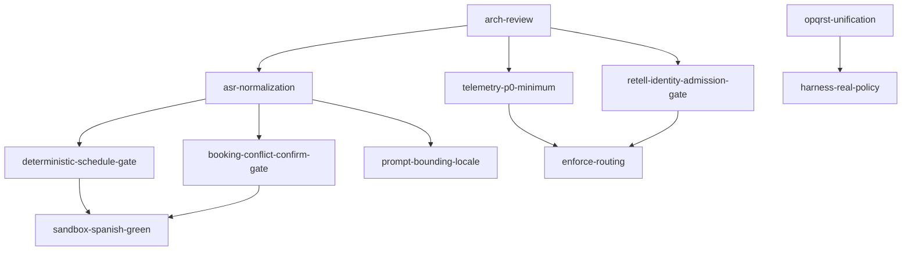

# Kelly Orchestration Gap Matrix

**Last updated:** 2026-06-17  
**SSOT architecture:** [`KELLY_ORCHESTRATION_ARCHITECTURE.md`](./KELLY_ORCHESTRATION_ARCHITECTURE.md)

**Customer-ready exit (2026-06-17):** P0–P2 implementation complete — live verify scripts, portal E2E, gate-owned transactional steps, `hydrateSessionForTurn`, activity feed on `tool_completed`, CI `verify:env-gates`, nightly prod workflow. Prod live-call proofs remain operator-run per [`CUSTOMER_READY_BACKLOG.md`](../CUSTOMER_READY_BACKLOG.md).

---

## Target vs as-built summary

| Layer | Target | As-built status | Status | Gap severity |
|-------|--------|-----------------|--------|--------------|
| Identity admission | Reject/escalate bad Retell vars before L2 | `voice-identity-admission.js` fail-closed + `identity_invalid` | **done** | — |
| L2 authority | Mode/subrail enforced | Code supports enforce; prod `enforce` on Cloud Run | **done** | — |
| ASR → intent | Normalize before intent detector | `asr-normalize.js` wired to intent + pivot | **done** | — |
| Schedule gate | Tool on confirm with slot set | `runDeterministicSchedule` + stated-time path + retry | **done** | — |
| Stated-time booking | Book without API slots when patient names time | `resolveBookingSlot` + `slot-time-parse.js` | **done** | — |
| Conflict confirm | Gate owns post-mismatch confirm | `runDeterministicBookingConflict`; schedule runs first on confirm | **done** | — |
| Tenant policy | Admin booking for derm clinics | Harness + sandbox use `policy_json` conditional | **partial** | **P1** |
| Clinical proof | Harness symptom→OPQRST→book | Tenant harness scenario B | **done** | — |
| Provider slots | Admission check before slot_lookup | Asks for time vs dead-end; not full admission gate | **partial** | **P1** |
| Notifications | Graceful fail on SMS/email | `notification_failed` events | **done** | — |
| demo_qual | Block or build | Pivot blocked under enforce | **done** | — |
| Outbound reminder | Full subrail machine | Operator outbound rail + sandbox scenario | **partial** | **P1** |
| LLM bounding | Subrail objectives + scope guard | Scope guard in node-runner; objectives partial | **partial** | **P2** |
| Language lock | Sticky locale end-to-end | Partial; some English gate strings | **partial** | **P2** |
| handoff_failed | Recovery with ceiling | 2-retry ceiling + `handoff_exhausted` | **done** | — |
| SSOT | Transaction + projection wins | `persistRailsSessionState` transactional merge | **partial** | **P3** |
| Telemetry | All paths emit events | P0 verify script; `booking_outcome` added | **partial** | **P1** |
| CI/deploy gate | verify scripts block shadow | `verify-kelly-rails-env` enforces enforce in prod profile | **partial** | **P3** |
| Turn planner | Single turn authority | `turn-planner.js` + booking intents; gate plan filter | **partial** | **P1** |
| Gate registry | Ordered testable gates | `gate-registry.js` + priority + turn-plan filter | **done** | — |
| CI orchestration TCR | Sandbox in GitHub CI | `test:rails:orchestration` in ci.yml | **done** | — |
| Cancel/reschedule/records gates | Deterministic L4 gates | `lanes.js` + unit tests | **done** | — |
| Orchestration trace | gate_matched on every turn | `voice-orchestration-trace.js` enriched | **partial** | **P1** |
| Failure taxonomy | Distinct booking failure copy | `schedule_conflict`, `schedule_failed` keys | **done** | — |

---

## Remediation backlog (ticket IDs)

### P0

| ID | Ticket | Status | Done when |
|----|--------|--------|-----------|
| `arch-review` | This matrix + architecture doc published | **done** | All risks ticketed with Done-when |
| `asr-normalization` | Intent-only ASR normalize | **done** | Confirmatory fixtures work; history unchanged |
| `retell-identity-admission-gate` | Fail-closed + en/es/zh copy + `identity_invalid` | **done** | Bad vars never reach L2 |
| `deterministic-schedule-gate` | Slot + confirm → `schedule_appointment` | **done** | booking/spanish_booking call tool; stated-time path |
| `booking-conflict-confirm-gate` | Post-conflict alt confirm → schedule | **done** | Schedule gate runs before conflict on confirm |
| `sandbox-spanish-green` | Blocked by both schedule gates | **partial** | 3× 12/12 TCR (dev DB contention) |
| `telemetry-p0-minimum` | P0 path self-test events | **done** | `npm run verify:p0-telemetry` |
| `enforce-routing` | Staging enforce + rollback doc | **done** | prod `enforce` + verify script |

### P1

| ID | Ticket | Status | Done when |
|----|--------|--------|-----------|
| `opqrst-unification` | Single OPQRST owner | **done** | `opqrst-accumulator.js` |
| `harness-real-policy` | Real policy + clinical scenario B | **done** | `rails-tenant-appointment-harness.cjs` |
| `tenant-policy-json` | Per-clinic policy_json | **partial** | drlittlekids conditional in harness |
| `provider-availability-admission` | Empty slots dead-end | **partial** | Asks for time; full admission gate open |
| `provider-parse-and-deadend` | Provider parse tests + single-provider | **done** | Unit tests + practitioner resolve |
| `outbound-orchestration` | Operator outbound subrail | **partial** | Rail exists; full TCR varies |
| `demo-qual-rail-decision` | Block pivot to demo_qual | **done** | Enforce blocks pivot |
| `notification-side-effect-validation` | SMS/email fail graceful | **done** | `notification_failed` |
| `telemetry-completeness-audit` | Full audit + SLO queries | **partial** | trace enriched; 100% path checklist open |
| `ci-orchestration-gate` | `test:rails:orchestration` in CI | **done** | ci.yml Node 20 job |
| `subrail-step-gate-owned` | L2 holds step until L4 outcome | **done** | `booking-subrail.js` + test |
| `turn-plan-authoritative` | Gate registry honors `_turn_plan` | **done** | `gateAllowedByTurnPlan` |
| `turn-planner-spike` | Subrails emit intents only | **partial** | `turn-planner.js` + booking intents |
| `booking-user-dialog-ci` | User Dr. Santos dialog in sandbox | **done** | `scenarioBookingUserDialog` |

### P2

| ID | Ticket | Status | Done when |
|----|--------|--------|-----------|
| `prompt-bounding-locale` | Merged subrail objectives + locale lock | **open** | After asr-normalization |
| `topic-scope-guardrail` | Post-LLM scope strip | **partial** | node-runner scope guard |
| `handoff-failure-recovery` | Max 2 retries → `handoff_exhausted` | **done** | No infinite loop |
| `intent-drain-unify` | All closed-loop drains | **done** | cancel+rebook without second BOOK |
| `failure-taxonomy` | Distinct booking failure replies | **done** | `schedule_conflict`, `schedule_failed` |

### P3

| ID | Ticket | Status | Done when |
|----|--------|--------|-----------|
| `ssot-transaction` | Transaction write; projection wins | **partial** | `persistRailsSessionState` transactional |
| `verify-env-gates` | CI + deploy preflight | **partial** | CI fails on shadow in prod profile |
| `docs-prod-defaults` | Runbooks updated | **done** | Matches implementation |
| `gate-registry` | Ordered gate registry | **done** | `gate-registry.js` + tests |

---

## Dependency chain

---

## Rollback (enforce-routing)

1. Set `CONVERSATION_MODE_ROUTING=shadow` OR disable per-mode `CONVERSATION_MODE_ENFORCE_*`.
2. Legacy `routeOrchestratorLane` resumes when `skipLegacyReroute` is false.
3. Regression signals (require `telemetry-p0-minimum` first):
   - Spike in `identity_invalid`
   - Spike in `scope_guardrail_triggered`
   - Spike in `mode_violation`
   - Spike in `booking_outcome` with `error_code`
   - `turn_resolved` without expected tools on booking/cancel paths

---

## Implementation note (2026-06-17)

Shipped modules:

- `services/conversation-mode/asr-normalize.js`
- `services/voice-identity-admission.js`
- `services/kelly-rails/confirm-utterance.js`
- `services/kelly-rails/slot-time-parse.js`
- `services/kelly-rails/turn-planner.js`
- `services/kelly-rails/gate-registry.js`
- `services/conversation-mode/opqrst-accumulator.js`
- `scripts/debug-booking-deadend.cjs`
- `scripts/verify-p0-telemetry.cjs`
