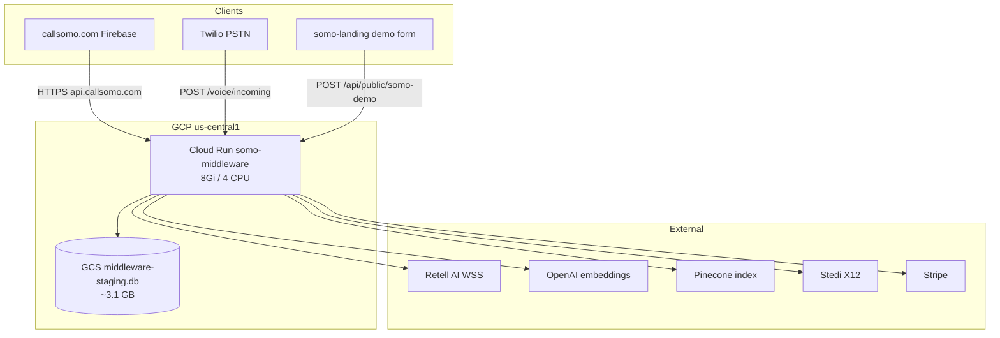

# Somo platform snapshot

**Last updated:** 2026-07-10  
**Revision:** `somo-middleware-00164-f6k` (8 Gi / 4 CPU)  
**Audience:** Engineering, ops, clinical sign-off

This is the **current full-architecture summary**. Deep route tables remain in [LIVE.md](./LIVE.md); voice routing truth in [VOICE_ROUTING_SSOT.md](../voice/VOICE_ROUTING_SSOT.md); coding in [Medical Coding/](../Medical%20Coding/README.md).

---

## 1. Product lines (what ships today)

| Line | User | Entry | Runtime |
|------|------|-------|---------|
| **Somo front desk** (primary) | Dental / medical practice | `callsomo.com` → tenant DID | Kelly receptionist — schedule, copay, insurance |
| **Platform sales** | Inbound to company DID | `+13639990205` | `platform_support` sales rail (Kelly L4 blocked) |
| **Landing demo** | Prospect | `somo-landing` → `/api/public/somo-demo/*` | Outbound Twilio demo call |
| **Somo pay / RCM** | Provider portal | `business/*.html` | Stedi eligibility, claims, Stripe |
| **Somo Health** (deferred) | Consumer | `/health-video/` | Kelly PA education — Phase 9 |
| **Legacy commerce** | — | Gated off | `COMMERCE_LEGACY_ENABLED` default false |

---

## 2. Runtime topology



| Surface | Host / service |
|---------|----------------|
| UI | `callsomo.com` — Firebase `somo-4ddf6` |
| API | `api.callsomo.com` → Cloud Run `somo-middleware` |
| Entry | `middleware-platform/server.js` + `routes/*` |
| DB | SQLite on `/var/data/middleware-staging.db`, synced from GCS |

---

## 3. Voice ingress

### 3.1 Twilio webhook

`POST /voice/incoming` → `services/voice-incoming-handler.js`

**Admission (before Retell):** credits/subscription (`billing-access.js`) → concurrent capacity → rate limit. Overflow uses `runtime.overflowNumber` only when `overflow_enabled`.

### 3.2 Routing worlds

| Inbound `To` | `routing_world` | Handler |
|--------------|-----------------|---------|
| `+13639990205` (platform DID) | `platform_support` | `somo-sales-inbound-rail` — CRM pipeline, Kelly L4 blocked |
| Tenant clinic DID | `tenant` | Kelly Rails v2 + conversation-mode L2/L4 |
| Navigation (disabled) | — | `NAVIGATION_ENABLED=0` — fail-closed / support path |

**SSOT:** [VOICE_ROUTING_SSOT.md](../voice/VOICE_ROUTING_SSOT.md) · [PLATFORM_SALES_363_DEPLOY.md](../deployment/PLATFORM_SALES_363_DEPLOY.md)

### 3.3 Retell + Kelly stack

```
Twilio SIP dial → Retell agent WSS
  → retell-websocket.js
  → L2 conversation-mode (mode / subrail / step)
  → guardrails + tool firewall
  → L4 kelly-rails executeTurn
  → KellyToolExecutor (schedule, collect_insurance, …)
  → SQLite session + kelly_call_events
```

**Key services:** `voice-call-context.js`, `kelly-turn-resolver.js`, `call-opener-resolver.js`, `kelly-tool-executor.js`

---

## 4. Coding and copay spine

### 4.1 Path router

`resolveVisitCodingPath()` in `resolve-visit-codes.js`:

| Tenant profile | Path | Retrieval |
|----------------|------|-----------|
| Dental | admin | Phrase map + CDT SQL — **no Pinecone** |
| `healthcare_clinic` | admin | `CLINIC_TRIGGER_MAP` (51 entries) |
| Dermatology / conditional | RAG | OPQRST → `run_triage_rag` → dual-source |

**SSOT:** [CODING_PATH_MATRIX.md](../Medical%20Coding/CODING_PATH_MATRIX.md) · [VOICE_CODING_SPINE.md](../Medical%20Coding/VOICE_CODING_SPINE.md)

### 4.2 Quote chain

```
collect_insurance tool
  → POST /voice/insurance/collect
  → resolve-insurance-codes.js
  → resolve-amount-due.js (eligibility_checks → plan_rules → simulate)
  → computeVisitQuote
  → schedule_appointment / payment link
```

**Dual-source retrieval:** `getCodeCandidatesDualSource` — SQLite `code_embeddings` + Pinecone (`layer2-rag`).

### 4.3 Post-epic copay (2026-07)

| ID | Deliverable | Status |
|----|-------------|--------|
| C-DF | Honest deferral copy (`coding-deferral-copy.json`) | Done |
| C-BR | `plan_rules` ingest (`import-plan-rules-benefits.cjs`) | Done (manual, 3-payer sample) |
| C-PR | Payer-class routing (`payer-class-routing.js`) | Done |
| C-PL | Provider/location copay defer | Phase 1 deferred |

---

## 5. Data layer

| Layer | Implementation |
|-------|----------------|
| **Primary SSOT** | SQLite (`better-sqlite3`) — tenants, voice sessions, codebooks, embeddings |
| **Prod snapshot** | GCS `somo-staging-db-somo-callsomo/middleware-staging.db` (~3.1 GB) |
| **Codebook counts** | ICD 74k, CPT 17k, HCPCS 9k, embeddings 110k — [PROD_DB_PARITY.md](../deployment/PROD_DB_PARITY.md) |
| **Semantic index** | Pinecone (medical only; dental uses phrase map) |
| **Postgres** | Optional mirror — not primary |
| **Migrations** | `middleware-platform/migrations/` (001–079+), startup runner |

**Architectural debt:** Embedding JSON in SQLite forces 8 Gi Cloud Run and slow cold starts. Target state: slim SQLite + Pinecone-only prod semantic search.

---

## 6. Key production env gates

| Variable | Prod value | Purpose |
|----------|------------|---------|
| `KELLY_RAILS_V2` | `1` | Agentic turn execution |
| `KELLY_RAILS_ROLLOUT_PCT` | `1` | Full rollout |
| `CONVERSATION_MODE_ROUTING` | `enforce` | L2 mode dispatch |
| `NAVIGATION_ENABLED` | `0` | Navigation path off |
| `PLATFORM_INBOUND_MODE` | `support` | +363 → platform_support |
| `KELLY_RAILS_FAST_RAG` | `0` | Full RAG on voice path |
| `RAG_API_URL` | `disabled` | No localhost RAG in prod |
| `PINECONE_*` | set | Remote semantic (D-01 operator verify) |
| `CALLSOMO_OPERATOR_TWILIO_NUMBER` | `+13639990205` | Platform DID |
| `CALLSOMO_OPERATOR_FALLBACK_PSTN` | `+18622307479` | Escalation target |

Generator: `middleware-platform/scripts/generate-cloudrun-env-yaml.cjs`

---

## 7. Verification matrix

| Area | Command |
|------|---------|
| Voice structural | `npm run verify:unblocked-phases` |
| Kelly Cloud Run env | `npm run verify:kelly-rails-cloudrun` |
| Prod codebook | `PINECONE_DEPLOY_GATE=1 npm run verify:prod-codebook` |
| Coding eval (CI) | `npm run eval:coding:fast` |
| Coding eval (nightly) | `npm run eval:coding:prod` |
| Live spine | `npm run verify-live-spine` / `verify-triage-spine` |
| Platform +363 | `platform-routing-post-deploy-verify` |
| Demo health | `curl https://api.callsomo.com/api/public/somo-demo/health` |

---

## 8. Open operator gates

See [todos/PENDING.md](../../todos/PENDING.md) and [KELLY_CODING_MASTER_EXECUTION_PLAN.md](../Medical%20Coding/KELLY_CODING_MASTER_EXECUTION_PLAN.md):

- **MT-03** — Pinecone tenant filter + dual-source caller audit (**done** 2026-07-10; CI gate in `scripts/ci-local.sh`)
- **CP-05** — Ranking SSOT unified (**done** 2026-07-11)
- **§6 MT–PY** — Eng backlog complete 2026-07-11
- **F-09** — Clinical sign-off (Appendix C) — **operator pending**
- **D-01** — Cloud Run env verified 2026-07-11 (`--cloudrun`); prod snapshot sign-off pending
- **K-02** — Nightly `eval:coding:prod` green ×7 nights (Appendix B) — **not started**
- **10.1** — +363 live bind + CRM tiering
- **ACC-01–17** — PSTN acceptance matrix

Eng backlog for CODING-FOUNDATION is **complete**; operator closeout pending — [CODING-FOUNDATION.md](../../todos/CODING-FOUNDATION.md).

---

## 9. SSOT doc index

| Area | Read first |
|------|------------|
| **This snapshot** | `docs/architecture/PLATFORM_SNAPSHOT.md` |
| **Routes / legacy depth** | `docs/architecture/LIVE.md` |
| **Voice routing** | `docs/voice/VOICE_ROUTING_SSOT.md` |
| **Kelly orchestration** | `docs/architecture/KELLY_ORCHESTRATION_ARCHITECTURE.md` |
| **Medical coding** | `docs/Medical Coding/README.md` |
| **Deploy / live verify** | `docs/deployment/OPERATIONS.md` |
| **Prod DB counts** | `docs/deployment/PROD_DB_PARITY.md` |
| **Incidents** | `docs/runbooks/OPERATIONS.md` |
| **Open work** | `todos/PENDING.md` |
| **Doc map** | `docs/meta/CANONICAL_DOC_MAP.md` |
