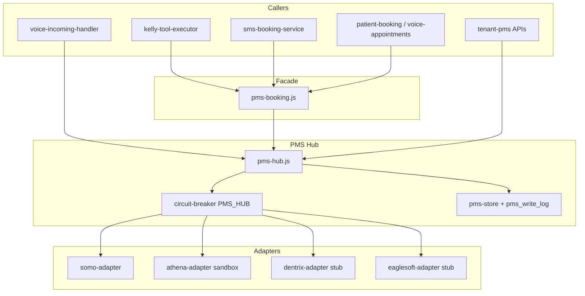

# PMS Connect Architecture (Phase 3A)

**Last updated:** 2026-07-02

Phase 3A ships a hub-and-spoke PMS integration layer. **Somo** adapter is production-ready for pilot. **Athena** adapter code is complete for sandbox (`verify:phase3-athena`); prod blocked on TRF/BAA. **Dentrix** and **Eaglesoft** remain stubs until vendor API credentials arrive.

## Overview

## Adapter table

| `pms_type` | Status | System of record |
|------------|--------|------------------|
| `somo` | **Shipped** | Somo SQLite appointments + FHIR patients |
| `none` | Disabled | Hub returns null; booking falls back to `BookingService` |
| `athena` | **Phase 3B shipped** | athenaOne REST via `athena-adapter.js`; TRF/BAA for prod |
| `dentrix` | Phase 3B dental stub | Throws `NOT_CONFIGURED` until Henry Schein creds |
| `eaglesoft` | Phase 3B dental stub | Throws `NOT_CONFIGURED` until partner API |

## Auth boundaries

| Route | Middleware | Notes |
|-------|------------|-------|
| `GET/POST/DELETE /api/tenant/pms/*` | `requireCustomerPmsAuth` | Resolves clinic via `customer_clinics`; rejects `clinic_id` mismatch |
| `GET /api/agent/patient-context` | `requireAgentPmsAuth` | `x-internal-job-token` **or** authenticated tenant |
| Voice call start | Direct `PmsHub` | No HTTP hop; sets Retell dynamic vars |

Voice path does not require the patient-context HTTP API on inbound calls.

## Write-back paths

| Event | Hook | Idempotency |
|-------|------|-------------|
| Book appointment | `pms-hub.bookAppointment` → `pms_write_log` | `idempotency_key` on book |
| Eligibility verified | `collect-insurance.js` → `writeEligibilityNote` | `elig:{appointment_id}` |
| Payment link sent | `request_patient_payment` → `writeCopayNote` (pending) | `copay:pending:{pay_token}` |
| Stripe settlement | `stripe-webhook-handler` → `writeCopayNote` | `copay:{paymentIntentId}` |

Failed writes are retried by `startPmsWriteRetryWorker()` when `PMS_WRITE_RETRY_ENABLED` is not `0`. v1 retry scope is `write_note` actions only; `book_appointment` failures are logged but not auto-retried.

## Kelly context

Inbound calls pre-populate Retell dynamic variables (`patient_name`, `next_appointment`, `balance_flag`, etc.). `retell-websocket.js` copies these into `connection.pmsContext`, which flows through `runKellyTurn` → `pmsContextBlock` in Kelly Rails prompts (`en.js` / `es.js`).

## Google Calendar mirror

When `pms_config.mirror_google` is `true` (default), Somo bookings also create Google Calendar events. Set `mirror_google: false` to use Somo DB only. See `docs/voice-agent/phase3-google-calendar-policy.md`.

## Ops

- Sandbox gates: `npm run verify:phase3-sandbox` (Somo); `npm run verify:phase3-athena` when `ATHENA_CLIENT_ID` is set
- CI: `npm run ci:phase3` (also in `scripts/ci-local.sh` gate tier)
- Backfill: `node scripts/backfill-clinic-pms-defaults.cjs`
- Admin health: `GET /api/admin/tenants/pms-health`, `GET /api/admin/tenants/:id/pms`

## Related docs

- [`docs/voice-agent/phase3-pilot-checklist.md`](../voice-agent/phase3-pilot-checklist.md)
- [`docs/architecture/LIVE.md`](./LIVE.md)
