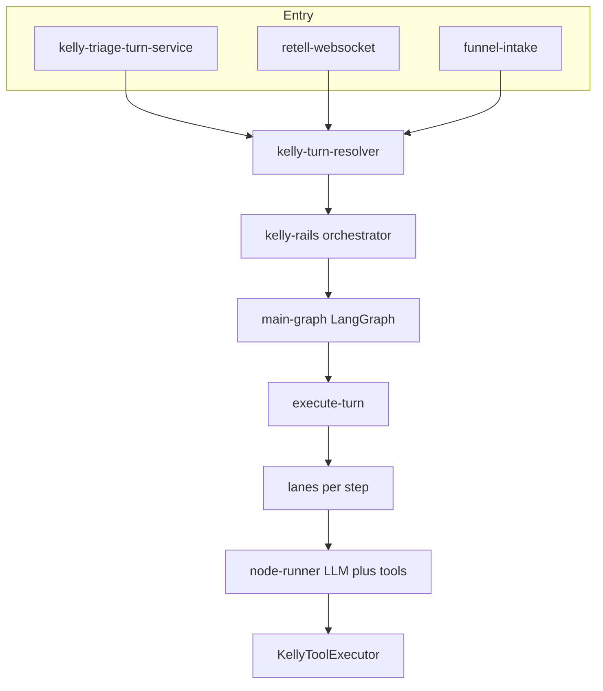

# Kelly Agentic Rails V2 — As Built

**Date:** 2026-06-02  
**Code:** [`middleware-platform/services/kelly-rails/`](../../middleware-platform/services/kelly-rails/)

## Entry

All patient conversation channels should use [`kelly-turn-resolver.js`](../../middleware-platform/services/kelly-turn-resolver.js):

- `KELLY_RAILS_V2=1` → [`orchestrator.handleTurn`](../../middleware-platform/services/kelly-rails/orchestrator.js) (LangGraph + lane steps)
- `KELLY_RAILS_V2=0` → legacy `KellyAgentService.processTurn`

## Architecture



## Lanes and steps

| Lane | Steps |
|------|--------|
| basic_intake | identity → contact → policy → done |
| clinical | clinical_intake → medical_history → medications → symptoms → triage_assessment → done |
| booking | schedule_visit → confirm_visit → done |
| payment | pay_invoice → insurance → receipt_logic → done |
| post_payment | finish → scheduled → confirmation → done |
| reschedule | find_booking → move_or_cancel → done |
| account | billing → insurance → done |
| education | education → clinical_advice → done |
| support | faq → handoff → done |

Tool allow-lists: [`tool-allowlists.js`](../../middleware-platform/services/kelly-rails/tool-allowlists.js).

## Deprecated (v2 path)

- [`kelly-conversation-bridge.js`](../../middleware-platform/services/kelly-conversation-bridge.js) — forwards to v2 when `KELLY_RAILS_V2=1`
- [`kelly-conversation-graph.js`](../../middleware-platform/services/kelly-conversation-graph.js) stub router
- `kelly_orchestrator_phase` as authority on v2 path

## Env

```bash
KELLY_RAILS_V2=1
KELLY_RAILS_ROLLOUT_PCT=1
KELLY_RAILS_MAX_TOOL_ITERATIONS=2
```

## E2E

```bash
export KELLY_RAILS_V2=1
RCM_E2E_USE_EXISTING_SERVER=1 npm run test:e2e:rcm:conversation
```

## Not yet

- Nested subgraphs (`intake-graph-v2`, `scheduler-graph-v1`, `search-graph-v1`)
- SMS-specific adapter (use resolver when SMS handler gains Kelly turns)
- F2 full green proof (E7-1)
