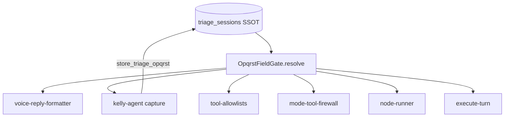

# OPQRST Field Gate Architecture

## Problem

Four uncoordinated systems caused provocation question loops on inbound voice:

1. `voice-reply-formatter.js` — scripted line by L4 step
2. `tool-allowlists.js` — blocked `store_triage_opqrst` at `medical_history`
3. `mode-tool-firewall.js` — L2 mode/subrail rules
4. `kelly-agent-service.js` capture guard — required symptom keywords
5. `execute-turn.js` `shouldReroute` — reset to `clinical_intake`

## Solution



## Layers

| Layer | Role | OPQRST role |
|-------|------|-------------|
| L2 Conversation Mode | Intent/subrail (`opqrst`, `booking`, `copay_link`) | Subrail accumulator mirrors DB |
| L4 Kelly Rails | Lane/step, gates, LLM loop | Step = phase hint only when gate off |
| DB `triage_sessions` | SSOT for field values | Written via gate + store tool |

## Gate API

```javascript
OpqrstFieldGate.resolve({
  triageRow,           // from get_triage_session — required
  userMessage,
  lastAssistantText,
  activeLane,
  conversationMode,
  activeSubrail,
  opqrstFrozen,
  triagePolicy,
  specialty,           // target_specialty — not derm-specific
  opqrstResumeField,
  locale
})
```

## Six call sites (when `OPQRST_FIELD_GATE_ENABLED=1`)

| Site | Behavior |
|------|----------|
| C-1 voice-reply-formatter | Script only if `shouldScriptVoice` |
| C-2 kelly-agent capture | `storePayload` → store tool |
| C-3 tool-allowlists L4 | Allow store when `allowStoreOpqrst` |
| C-4 mode-tool-firewall L2 | Align with gate |
| C-5 node-runner | Read `state.flags._opqrst_gate` |
| C-6 execute-turn | Resolve pre-lane; idempotent store; reroute fix |

## History SSOT (voice wiring)

G-1 requires `lastAssistantText` so G-3b can classify answers. Chat writes via [node-runner.js](../../middleware-platform/services/kelly-rails/node-runner.js) (`appendHistory`). Voice must do the same:

| Component | Role |
|-----------|------|
| [history.js](../../middleware-platform/services/kelly-rails/history.js) | `getLastAssistantText`, `appendHistory`, `seedKellyHistoryFromOrchestrate` |
| [retell-websocket.js](../../middleware-platform/webhooks/retell-websocket.js) | Writes user + assistant turns to `kelly_conversation_history`; passes `last_assistant_text` to formatter |
| [execute-turn.js](../../middleware-platform/services/kelly-rails/execute-turn.js) | Reads `getLastAssistantText(sessionId, { db })` before `OpqrstFieldGate.resolve` |

Read order: Kelly history table → `orchestrate_sessions.conversation_history` fallback → empty string.

Without voice writes, the gate cannot detect that the assistant asked provocation, so answers are never stored and C-1 re-scripts every turn.

Tests: `npm run test:opqrst-voice-history` (T-7); `node scripts/opqrst-voice-dod-smoke.cjs --with-history`.

## Pivot survival

`opqrst_resume_field` persisted in `kelly_rails_session_projection.flags_json` on clinical → billing pivot; restored on return to clinical.

## Locale (L-1 deferred)

Tangent detection (G-3) is English-pattern matched. Before `KELLY_OPQRST_ES_PACK=v1` prod: add ES patterns and T-1c test set.

## Kill switch (F-1 dual-path)

| Value | Behavior |
|-------|----------|
| unset / `0` | **Legacy** — L4 step formatter, `hasSymptomNow` capture, step allowlists |
| `1` | **Gate** — `OpqrstFieldGate` coordinates C-1 through C-6 |

Default is **on** (`1` or unset). Rollback: `OPQRST_FIELD_GATE_ENABLED=0`.

## Related rollout items

Cross-ref [todos/PENDING.md](../../todos/PENDING.md) **C-P0** (OPQRST review + staging voice cohorts) and **C-C-01** (ES pack staging). Field Gate code ships independently; ES prod still requires L-1 sign-off.
