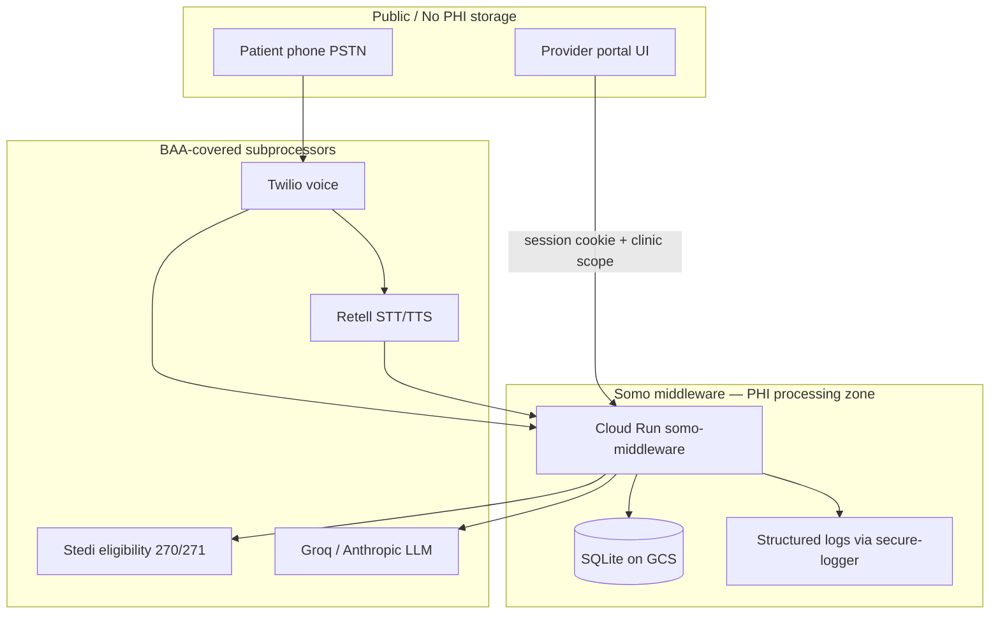

# PHI Boundary Diagram — Front Desk Pilot

**Scope:** Kelly voice + eligibility + provider portal for dental/medical front desk (NYC pilot).

## Trust zones

## PHI flows

| Data | Enters | Stored | Logged |
|------|--------|--------|--------|
| Voice audio / transcript | Retell WSS | Session meta, triage rows (tenant-scoped) | Redacted — no transcript text in default logs |
| Member ID / DOB (eligibility) | Kelly tool → Stedi | `eligibility_checks` row | **secure-logger only** — no raw member ID in console |
| Patient name / phone | Intake tools | Appointments, roster (clinic_id scoped) | Field keys redacted; values omitted from eligibility logs |
| Payment tokens | Stripe.js / pay link | Stripe (not in SQLite) | Never log client_secret or card data |

## Isolation rules

- Every API read/write is scoped by `customer_id` + `clinic_id` from session.
- Cross-tenant hydration is blocked (`phase3-phi-isolation` test).
- Dental tenants do not route clinical charts through 1upHealth (`dental-ehr-routing-guard`).

## Operator controls

- Eligibility daily cap + usage metering (`eligibility-usage-service`).
- Roster import + invite accept rate limits (`rosterImportLimiter`, `inviteAcceptLimiter`).
- Tenant offboarding: [TENANT_OFFBOARDING.md](../runbooks/TENANT_OFFBOARDING.md).

## Related

- [FRONT_DESK_PHASE0_BAA_CHECKLIST.md](./FRONT_DESK_PHASE0_BAA_CHECKLIST.md)
- [verify-log-redaction.cjs](../../middleware-platform/scripts/verify-log-redaction.cjs)
