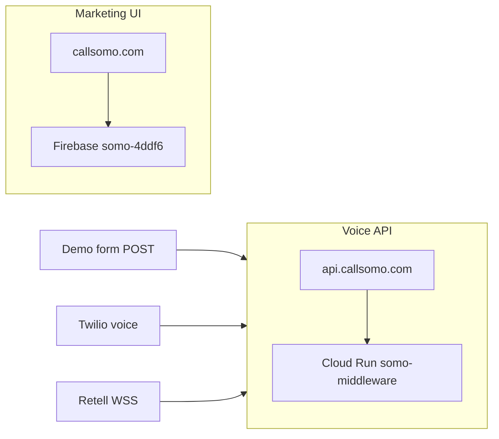

# Front-desk production — callsomo.com

**Last updated:** 2026-06-16

Single operator entry point for the Somo **front-desk voice agent** (Kelly rails) on production.

## Architecture



| Layer | Host | Backend |
|-------|------|---------|
| Landing SPA, signup, login | `https://callsomo.com` | Firebase Hosting `somo-4ddf6` → `hosting-dist` |
| Middleware API + voice | `https://api.callsomo.com` | Cloud Run `somo-middleware` in GCP `somo-callsomo` |

### Voice path

```
callsomo.com DemoSection
  → POST /api/public/somo-demo/request-call
  → Twilio outbound → POST /voice/incoming
  → Retell SIP → wss://api.callsomo.com/webhook/retell/llm
  → Kelly rails (KELLY_RAILS_V2=1)
```

## Deploy (local — Firebase + gcloud)

Production deploy runs from your machine (no GitHub Actions billing). Uses the same Firebase project you already had: **`somo-4ddf6`**.

### One-time setup

```bash
firebase login
gcloud auth login
gcloud config set project somo-callsomo
```

### Full production deploy

```bash
npm run deploy:callsomo
```

Script: [`scripts/deploy-callsomo-local.sh`](../../scripts/deploy-callsomo-local.sh)

Steps:

1. Build and verify `hosting-dist`
2. Deploy Cloud Run with **`CLOUDRUN_PROFILE=production`** (`KELLY_RAILS_V2`, production Retell WSS)
3. Create Cloud Run domain mapping for `api.callsomo.com`
4. Ensure public Cloud Run invoker (Twilio/Retell webhooks)
5. Run `configure-retell.js` when `RETELL_API_KEY` is in your shell env
6. `firebase deploy --only hosting` to `somo-4ddf6`
7. `npm run smoke:callsomo`

Partial deploy flags: `--skip-api`, `--skip-ui`, `--skip-smoke`, `--skip-ci`

### UI only (Firebase)

```bash
npm run callsomo:deploy-ui
# same as: npm run deploy:landing-hosting
```

### API only (Cloud Run)

```bash
npm run callsomo:deploy-api
```

**First deploy after env drift:** set `CLOUDRUN_PRESERVE_ENV=0` for a full non-secret env refresh (secrets stay as Secret Manager refs). Default is `1` (image-only + minimal env touch).

## Troubleshooting

### `callsomo.com` still shows old branding

Firebase is serving a **stale hosting release**. The repo builds Somo correctly; push the new bundle:

```bash
npm run callsomo:deploy-ui
curl -sS https://callsomo.com/ | grep '<title>'
# expect: Somo — AI Front Desk...
```

Hard-refresh the browser or use a private window after deploy.

### Cloud Run: `TWILIO_ACCOUNT_SID` type mismatch

```
Cannot update environment variable [TWILIO_ACCOUNT_SID] to string literal because it has already been set with a different type.
```

The live service binds Twilio/Retell keys via **Secret Manager** (`--set-secrets`), not plain env strings. Deploy scripts now use `--set-secrets` when `USE_GCP_SECRETS=1`.

**Workaround** (image-only deploy):

```bash
CLOUDRUN_PRESERVE_ENV=1 npm run callsomo:deploy-api
gcloud run services update somo-middleware --region=us-central1 --project=somo-callsomo \
  --update-env-vars="KELLY_RAILS_V2=1,KELLY_RAILS_ROLLOUT_PCT=1,KELLY_ALLOW_HYBRID_GRAPH=0,RETELL_LLM_WEBSOCKET_URL=wss://api.callsomo.com/webhook/retell/llm,BASE_URL=https://api.callsomo.com,API_BASE_URL=https://api.callsomo.com"
```

### Full deploy stops before Firebase

`deploy:callsomo` deploys **UI first**, then API, so the landing updates even if Cloud Run is slow or fails.

### `api.callsomo.com` returns 404 but billing is enabled

Check Cloud Run **ingress** — must be `all` for public webhooks (not `internal`):

```bash
gcloud run services describe somo-middleware --region=us-central1 --project=somo-callsomo \
  --format='value(metadata.annotations.run.googleapis.com/ingress)'
gcloud run services update somo-middleware --region=us-central1 --project=somo-callsomo --ingress=all
```

Or run: `npm run gcp:somo:audit` and `./scripts/gcp-somo-billing-audit.sh cleanup`

## DNS and domain mapping (order matters)

Do **not** point `api.callsomo.com` at `ghs.googlehosted.com` until Cloud Run has a domain mapping.

1. Deploy API: `npm run callsomo:deploy-api` or `npm run deploy:callsomo -- --skip-ui`
2. Create mapping:
   ```bash
   gcloud beta run domain-mappings create --service=somo-middleware \
     --domain=api.callsomo.com --region=us-central1 --project=somo-callsomo
   ```
3. Registrar: CNAME `api` → `ghs.googlehosted.com`
4. Public invoker if 403: `./scripts/ensure-cloudrun-public-invoker.sh`
5. UI: Firebase custom domain `callsomo.com` (A records per Firebase console)

**Cutover helper:** `./scripts/callsomo-terminal-cutover.sh check`

## Retell and Twilio

| Integration | Production URL |
|-------------|----------------|
| Retell LLM WebSocket | `wss://api.callsomo.com/webhook/retell/llm` |
| Twilio voice webhook | `https://api.callsomo.com/voice/incoming` |
| Demo health | `https://api.callsomo.com/api/public/somo-demo/health` |

Configure Retell after deploy:

```bash
cd middleware-platform
API_BASE_URL=https://api.callsomo.com node configure-retell.js
npm run verify:agent-config   # requires RETELL_API_KEY in .env
```

## Local development

```bash
cd middleware-platform && npm start
# → http://localhost:4000/ (landing + API)
```

Rebuild hosting bundle locally:

```bash
npm run build:staging-hosting
```

## What to deploy (2026-06-16 branch)

Uncommitted work on `feat/signup-assign-line-and-portal-hardening` spans **two surfaces**. Push to GitHub first, then deploy from a clean checkout of that branch.

| Surface | Paths | Deploy command | Production host |
|---------|-------|----------------|-----------------|
| **Provider portal UI** | `unified-dashboard/business/*`, `unified-dashboard/assets/*` | `npm run callsomo:deploy-ui` | `https://callsomo.com/business/*` (Firebase `hosting-dist`) |
| **Middleware API + voice** | `middleware-platform/services/*`, `webhooks/retell-websocket.js`, `routes/case-report.js`, etc. | `npm run callsomo:deploy-api` | `https://api.callsomo.com` (Cloud Run `somo-middleware`) |

**API-only changes** (Kelly rails, conversation-mode, Retell WSS, case-report ID normalization): Cloud Run redeploy is required; Firebase UI deploy is optional unless portal HTML/JS/CSS also changed.

**UI-only changes** (calendar Escape/backdrop, patient-case deep links, revenue Send UX, voice-setup/agent): Firebase UI deploy is required; API redeploy is optional unless matching API routes changed.

**Recommended staged voice rollout** after API deploy (see [`CONVERSATION_MODE_ROLLOUT.md`](../runbooks/CONVERSATION_MODE_ROLLOUT.md)):

```bash
# Phase 0 staging — then global enforce when green
CONVERSATION_MODE_ROUTING=enforce
KELLY_RAILS_V2=1
KELLY_RAILS_ROLLOUT_PCT=1
KELLY_ALLOW_HYBRID_GRAPH=0
```

Rollback: set `CONVERSATION_MODE_ROUTING=shadow` and redeploy. See rollout runbook regression signals.

**Architecture:** [`KELLY_ORCHESTRATION_ARCHITECTURE.md`](../architecture/KELLY_ORCHESTRATION_ARCHITECTURE.md)

Post-deploy DB scripts (production, one-time):

```bash
cd middleware-platform
node scripts/fix-operator-voice-openers.cjs
node scripts/rollout-voice-outbound-opener.cjs --apply-db
```

**Pre-deploy verification** (local):

```bash
cd middleware-platform
npm run test:kelly:rails:golden
npx jest --testPathPattern='conversation-mode'
npm run test:rails:conversation-sandbox
npm run test:e2e:tenant-audit:safe
```

## Smoke and acceptance

```bash
npm run smoke:callsomo
```

| Check | Expected |
|-------|----------|
| `https://callsomo.com/` | 200, Somo landing SPA |
| `https://callsomo.com/signup` | Signup wizard |
| `https://api.callsomo.com/health/live` | 200 |
| `https://api.callsomo.com/api/public/somo-demo/health` | JSON `ok: true` |
| `npm run verify:agent-config` | PASS, WSS = production URL |

Optional outbound call:

```bash
cd middleware-platform && node scripts/make-outbound-call.js <E.164>
```

## Legacy domains

Legacy domains are retired; keep all production traffic on `callsomo.com` and `api.callsomo.com`. Remove stale non-production domain mappings if still present. Details: [`docs/runbooks/OPERATIONS.md`](../runbooks/OPERATIONS.md#legacy-domain-retirement).

## Related docs

- [`docs/runbooks/GCP_DEPLOY_ROLLBACK_RUNBOOK.md`](../runbooks/GCP_DEPLOY_ROLLBACK_RUNBOOK.md) — rollback
- [`docs/deployment/VOICE_CURRENT_ARCHITECTURE.md`](./VOICE_CURRENT_ARCHITECTURE.md) — voice detail
- Trading agent: [richiejeremiah/trading-agent](https://github.com/richiejeremiah/trading-agent) (separate repo)
