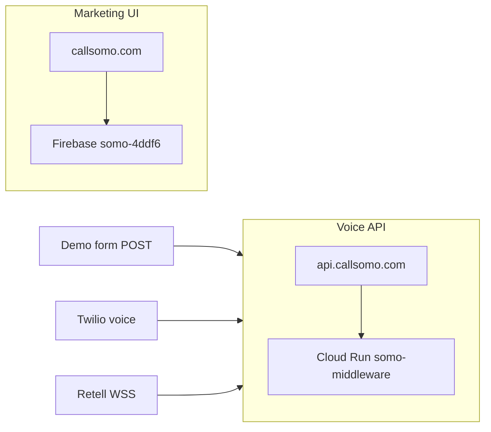

# Front-desk production — callsomo.com

**Last updated:** 2026-06-14

Single operator entry point for the Somo **front-desk voice agent** (Kelly rails) on production.

## Architecture



| Layer | Host | Backend |
|-------|------|---------|
| Landing SPA, signup, login | `https://callsomo.com` | Firebase Hosting `somo-4ddf6` → `hosting-dist` |
| Middleware API + voice | `https://api.callsomo.com` | Cloud Run `somo-middleware` in GCP `somo-callsomo` |

### Voice path

```
callsomo.com DemoSection
  → POST /api/public/somo-demo/request-call
  → Twilio outbound → POST /voice/incoming
  → Retell SIP → wss://api.callsomo.com/webhook/retell/llm
  → Kelly rails (KELLY_RAILS_V2=1)
```

## Deploy (GitHub Actions)

**Workflow:** [`.github/workflows/deploy-callsomo.yml`](../../.github/workflows/deploy-callsomo.yml)

Triggers on push to `main` when `middleware-platform/`, `unified-dashboard/`, `scripts/`, or the workflow file change.

```bash
# Manual run
gh workflow run deploy-callsomo.yml -R richiejeremiah/somo
```

The workflow:

1. Builds and verifies `hosting-dist`
2. Deploys Cloud Run with **`CLOUDRUN_PROFILE=production`** (`KELLY_RAILS_V2`, production Retell WSS)
3. Creates Cloud Run domain mapping for `api.callsomo.com`
4. Ensures public Cloud Run invoker (Twilio/Retell webhooks)
5. Runs `configure-retell.js` when `RETELL_API_KEY` secret is set
6. Deploys Firebase Hosting to `somo-4ddf6`
7. Runs `npm run smoke:callsomo` (required on push; optional skip on manual dispatch only)

**First deploy after env drift:** workflow uses `CLOUDRUN_PRESERVE_ENV=0` on push so stale vars are refreshed. For image-only rollouts, use workflow_dispatch with **Preserve existing Cloud Run env vars**.

**Secrets:** see [`docs/runbooks/GITHUB_SECRETS_SOMO_PLATFORM.md`](../runbooks/GITHUB_SECRETS_SOMO_PLATFORM.md).

## DNS and domain mapping (order matters)

Do **not** point `api.callsomo.com` at `ghs.googlehosted.com` until Cloud Run has a domain mapping.

1. Deploy API (workflow or `./scripts/callsomo-terminal-cutover.sh deploy-api`)
2. Create mapping:
   ```bash
   gcloud beta run domain-mappings create --service=somo-middleware \
     --domain=api.callsomo.com --region=us-central1 --project=somo-callsomo
   ```
3. Registrar: CNAME `api` → `ghs.googlehosted.com`
4. Public invoker if 403: `./scripts/ensure-cloudrun-public-invoker.sh`
5. UI: Firebase custom domain `callsomo.com` (A records per Firebase console)

**Cutover helper:** `./scripts/callsomo-terminal-cutover.sh check`

## Retell and Twilio

| Integration | Production URL |
|-------------|----------------|
| Retell LLM WebSocket | `wss://api.callsomo.com/webhook/retell/llm` |
| Twilio voice webhook | `https://api.callsomo.com/voice/incoming` |
| Demo health | `https://api.callsomo.com/api/public/somo-demo/health` |

Configure Retell after deploy:

```bash
cd middleware-platform
API_BASE_URL=https://api.callsomo.com node configure-retell.js
npm run verify:agent-config   # requires RETELL_API_KEY in .env
```

## Local development

```bash
cd middleware-platform && npm start
# → http://localhost:4000/ (landing + API)
```

Rebuild hosting bundle locally:

```bash
npm run build:staging-hosting
```

## Smoke and acceptance

```bash
npm run smoke:callsomo
```

| Check | Expected |
|-------|----------|
| `https://callsomo.com/` | 200, Somo landing SPA |
| `https://callsomo.com/signup` | Signup wizard |
| `https://api.callsomo.com/health/live` | 200 |
| `https://api.callsomo.com/api/public/somo-demo/health` | JSON `ok: true` |
| `npm run verify:agent-config` | PASS, WSS = production URL |

Optional outbound call:

```bash
cd middleware-platform && node scripts/make-outbound-call.js <E.164>
```

## Legacy domains

Retire **myskinandcare.com** → **callsomo.com** (301 at registrar). Remove stale `api.callsomo.com` mapping from GCP project `doctor-little-c688d` if present. Details: [`docs/runbooks/OPERATIONS.md`](../runbooks/OPERATIONS.md#legacy-domain-retirement).

## Related docs

- [`docs/runbooks/GCP_DEPLOY_ROLLBACK_RUNBOOK.md`](../runbooks/GCP_DEPLOY_ROLLBACK_RUNBOOK.md) — rollback
- [`docs/deployment/VOICE_CURRENT_ARCHITECTURE.md`](./VOICE_CURRENT_ARCHITECTURE.md) — voice detail
- [`docs/meta/TRADING_AGENT_REPO.md`](../meta/TRADING_AGENT_REPO.md) — trading agent (separate repo)
