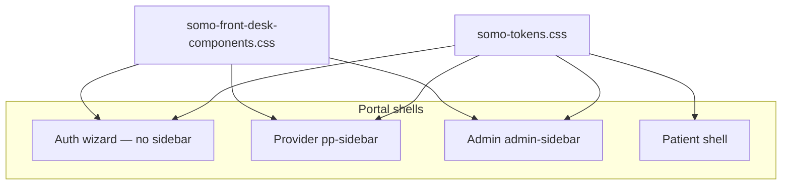

# Front desk UI — screen update specification

> **Last reviewed:** 2026-06-30  
> **Status:** Phases 0–3 complete; Phase 4 inventory (provider + auth scope) complete; Phase 5 QA **Complete (scoped)** — see [PHASE5_VISUAL_QA_MATRIX.md](./PHASE5_VISUAL_QA_MATRIX.md)  
> **Source mock:** `somo-screen-designs.html` (26 frames)  
> **Brand:** Somo tokens only — see [`SOMO_MOCK_TO_TOKEN_MAP.md`](./SOMO_MOCK_TO_TOKEN_MAP.md)  
> **Guidelines:** [`docs/Brand/SOMO_GUIDELINES.md`](../Brand/SOMO_GUIDELINES.md)

## Purpose

Single source of truth for updating all unified-dashboard HTML screens to match the front-desk mock structure, components, and flows — **without** copying mock moss/brass/clay colors.

**Deliverables in this doc:**

| ID | Section | Status |
|----|---------|--------|
| doc-01 | FD-001–418 task registry | § Task registry |
| doc-02 | Token map appendix | [`SOMO_MOCK_TO_TOKEN_MAP.md`](./SOMO_MOCK_TO_TOKEN_MAP.md) |
| doc-03 | Per-screen states (26 frames) | § Per-screen states |
| doc-04 | Settings IA deprecation map | § Settings IA |
| doc-05 | Nameplate enum + API mapping | § Nameplates |
| doc-06 | Component inheritance matrix (72 pages) | § Page inventory |
| doc-07 | Phase 0–5 acceptance criteria | § Acceptance criteria |
| doc-08 | Linked from `SOMO_GUIDELINES.md` | Done |

**Task format:** `FD-###` | **Priority:** P0 mock / P1 inventory / P2 token / P3 defer | **Total:** 418 tasks

---

## Implementation status (2026-06-30)

| Phase | Task range | Shipped |
|-------|------------|---------|
| **0 Foundation** | FD-001–042 | **Complete** — see [Phase 0 completion matrix](./PHASE_0_COMPLETION_MATRIX.md) |
| **1 Onboarding** | FD-043–165 | **Complete** — see [Onboarding completion matrix](./ONBOARDING_COMPLETION_MATRIX.md) |
| **2 Doctor portal** | FD-166–237 | **Complete** — see [Doctor portal completion matrix](./DOCTOR_PORTAL_COMPLETION_MATRIX.md) |
| **3 Admin + API** | FD-238–305 | **Complete** — see [Admin completion matrix](./ADMIN_COMPLETION_MATRIX.md) |
| **4 Inventory** | FD-306–365 | **Complete (scoped)** — see [Inventory completion matrix](./INVENTORY_COMPLETION_MATRIX.md); FD-332–347 + FD-352–359 deferred |
| **5 QA** | FD-366–418 | **Complete (scoped)** — [PHASE5_VISUAL_QA_MATRIX.md](./PHASE5_VISUAL_QA_MATRIX.md); tenant audit + auth pages + mobile viewport; admin 7/7; `verify:prod-gates` |

**Onboarding docs:** [`onboarding-stepper-delta.md`](../voice-agent/onboarding-stepper-delta.md), [`onboarding-meta-contract.md`](../voice-agent/onboarding-meta-contract.md), [`google-oauth-onboarding.md`](../voice-agent/google-oauth-onboarding.md), [`onboarding-preview-parity-qa.md`](../voice-agent/onboarding-preview-parity-qa.md)

**Completion audit:** [`PHASE_0_COMPLETION_MATRIX.md`](./PHASE_0_COMPLETION_MATRIX.md) (FD-001–FD-042, 42/42), [`ONBOARDING_COMPLETION_MATRIX.md`](./ONBOARDING_COMPLETION_MATRIX.md) (FD-043–FD-165, 123/123), [`DOCTOR_PORTAL_COMPLETION_MATRIX.md`](./DOCTOR_PORTAL_COMPLETION_MATRIX.md) (FD-166–FD-237, 72/72), [`ADMIN_COMPLETION_MATRIX.md`](./ADMIN_COMPLETION_MATRIX.md) (FD-238–FD-285, 48/48), [`INVENTORY_COMPLETION_MATRIX.md`](./INVENTORY_COMPLETION_MATRIX.md) (FD-306–365 scoped + auth FD-348–351)

---

## Architecture

**Canonical onboarding stepper:** Invite → Profile → Connect → Voice → Hours → Outbound → Live (Billing in Settings only).

---

## Per-screen states (doc-03)

States from mock annotations. Engineers implement each row as a testable UI state.

### 00a — Login (`login.html`)

| State | Trigger | UI |
|-------|---------|-----|
| Default | Page load | Logo, email, password, full-width CTA |
| Invalid credentials | POST fail | Error toast (`signup-somo` pattern) |
| Forgot password | Link click | Inline panel (FD-048) |
| Post-login incomplete onboarding | `/api/voice-agent/onboarding` | Redirect → `voice-setup.html?step=N` |
| Post-login blockers | `destination.blockers` | Redirect → `today.html#go-live-checklist` |
| Post-login complete | terminal state | Redirect → `today.html` |

### 01 — Invite (`business/invite.html`)

| State | Trigger | UI |
|-------|---------|-----|
| Default | Valid code | Practice name disabled, name, email readonly, password + confirm, BAA |
| CTA disabled | BAA unchecked / invalid fields | Submit disabled |
| Expired | `invite_expired` | Error copy + hide form |
| Already accepted | `invite_already_used` | Sign-in CTA |
| Success | Accept OK | Redirect voice-setup step 1 |

### A4 — Invite office modal (`admin/tenants.html`)

| State | Trigger | UI |
|-------|---------|-----|
| Default | + Invite office | Email, practice, specialty (Dental locked), PMS, language |
| Send success | API OK | Toast + pending row |
| Duplicate email | API error | Inline field error |
| Validation | Missing fields | Per-field errors |

### A5 — Convert lead (`admin/pipeline.html`, `admin/lead.html`)

| State | Trigger | UI |
|-------|---------|-----|
| Default | Won lead | Convert CTA + summary table |
| Confirm | Click convert | Modal: can't be undone |
| Provisioning | API in flight | Spinner + copy |
| Success | Tenant + invite | Success + link to tenant |
| Failure | API error | Error + retry |
| Already converted | `converted` flag | View tenant button |

### 04 — Practice profile (voice-setup step 1)

| State | Trigger | UI |
|-------|---------|-----|
| Default | Step 1 | Practice, tone, languages, transfer #, address, NPI, PMS info, email |
| Validation | Missing transfer # | Inline error |
| Saved | Continue | → Connect step |

### 04a — Connect systems (voice-setup step 2)

| State | Trigger | UI |
|-------|---------|-----|
| Default | Step 2 | Google + Somo cards, Dentrix pending |
| Google connected | OAuth return / status API | Connected badge + Continue |
| Somo selected | Use Somo calendar | Callout + Continue |
| Skip modal | Skip for now | Tradeoff modal |
| Skip confirmed | Skip anyway | Somo scheduling ack → Voice step |
| OAuth error | `calendarError` query | Error callout on step |

### 04b–04d — Voice / Hours / Outbound (steps 3–5)

| State | Trigger | UI |
|-------|---------|-----|
| Greeting preview | Typing | Live preview cards (parity with disclosure) |
| Hours CLOSED | Day off | OFF nameplate on row |
| Outbound off | Toggle off | Empty state / hidden opener |
| Outbound on | Toggle on | Opener field + preview |

### 05 — Test call + forward (voice-setup step 6)

| State | Trigger | UI |
|-------|---------|-----|
| Default | Step 6 | Somo number (mono), call CTA, forwarding runbook |
| Test success | Call completed | Transcript snippet (FD-123) |
| Test failure | No audio / error | Failure message (FD-124) |
| Finish | Done | → `today.html#go-live-checklist` |

### 06 — Kelly (`business/agent.html`)

| State | Trigger | UI |
|-------|---------|-----|
| LIVE | `enabled` + in hours | LIVE nameplate |
| PAUSED | Manual pause | PAUSED + transfer # visible |
| COVERAGE-OFF | Outside hours | Distinct from PAUSED |
| SHADOW | `shadow_week_active` | SHADOW card + end date |
| Config editors | — | Relocate to Settings → Kelly |

### 07 — Today (`business/today.html`)

| State | Trigger | UI |
|-------|---------|-----|
| Default | Has calls | KPI row, appointments, recent calls |
| Empty | No calls today | Empty state copy |
| MANUAL SYNC | PMS not connected | Sync card + nameplate |
| Checklist pending | Blockers | `#go-live-checklist` visible |
| Celebration | All items done | Success callout |

### 08 — Calls (`business/calls.html`)

| State | Trigger | UI |
|-------|---------|-----|
| List loading | Fetch | Skeleton |
| Detail loading | Select call | Skeleton in panel |
| Timeline | Call selected | Patient-friendly event rows |
| Eligibility pending | Partial data | Pending chip |
| Transfer-only | No insurance | Minimal detail |
| SYNC PENDING | Manual Dentrix | Pending chip + copy |

### 09 — Settings (`business/settings.html`)

| State | Trigger | UI |
|-------|---------|-----|
| Profile tab | Default pill | Practice fields |
| Google connected | Status API | CONNECTED nameplate |
| Google disconnected | Not connected | Connect CTA |
| Google reauth | `needsReconnect` | NEEDS REAUTH |
| Dentrix manual | Interim | MANUAL SYNC + callout |
| Dentrix error | Sync fail | ERROR + failed list |
| Stripe action needed | Billing API | ACTION NEEDED |

### 10 — Patient pay (`patients/pay.html`)

| State | Trigger | UI |
|-------|---------|-----|
| Default | Valid link | Practice header, copay, visit context, SMS consent |
| Expired | Token expired | Expired copy |
| Already paid | Paid flag | Receipt confirmation |
| Payment failed | Stripe error | Retry without clearing card |

### 11 — Go-live checklist (`today.html#go-live-checklist`)

| State | Trigger | UI |
|-------|---------|-----|
| Pending items | Blockers API + heuristics | `sfd-checklist` rows |
| Post-checkout | `?onboarding=checkout` | Alert + checklist |
| All complete | No pending | Celebration callout |
| Hidden | Complete + no force | Panel hidden |

### A1 — Admin tenants (`admin/tenants.html`)

| State | Trigger | UI |
|-------|---------|-----|
| Default | Has offices | Table + status nameplates |
| Empty | No tenants | Empty state |
| Pending invite | Row status | PENDING INVITE + Resend |
| Onboarding stuck | Filter | Stuck filter (FD-242) |
| Tenant detail | Row click | A6 checklist view |

### A2 — Pipeline (`admin/pipeline.html`)

| State | Trigger | UI |
|-------|---------|-----|
| Kanban | Default | New / Contacted / Won columns |
| Won card | Won stage | Convert button on card |

### A3 — Lead detail (`admin/lead.html`)

| State | Trigger | UI |
|-------|---------|-----|
| Default | Lead load | KV table: contact, source, notes |
| Won | Stage won | WON pill + Convert CTA |

---

## Settings IA (doc-04)

**Target (mock screen 09):** Profile | Connected Accounts | Kelly | Billing

**Current (`settings.html`):** Profile | Integrations | Voice Agent | Billing | Credentials | Advanced

### Tab migration map

| New pill tab | Absorbs | JS modules | Hash |
|--------------|---------|------------|------|
| **Profile** | Practice name, transfer #, NPI, languages, address | `tab-practice.js`, `tab-general.js` | `#profile` |
| **Connected Accounts** | Google Calendar, Dentrix/PMS, Stripe status cards | `tab-calendar.js`, `tab-pms.js`, Stripe section from billing | `#connected` |
| **Kelly** | Greeting, hours, coverage, outbound, tone | `tab-voice.js` + content from `agent.html` editors | `#kelly` |
| **Billing** | Subscription, credits, invoices, usage | `tab-billing.js` | `#billing` |

### Deprecation

| Old tab / section | Fate |
|-------------------|------|
| Integrations | **Remove** — split into Connected Accounts |
| Voice Agent | **Rename → Kelly** — merge voice config |
| Credentials | **Collapse** — link from Connected Accounts → Advanced, or operator-only |
| Advanced | **Defer** — feature flags, debug; link from footer |
| Practice (fragment) | **Merge** into Profile |
| PMS inline hints | **Move** to Connected Accounts Dentrix card |

### URL compatibility

| Old hash | Redirect to |
|----------|-------------|
| `#practice` | `#profile` |
| `#integrations` | `#connected` |
| `#calendar` | `#connected` |
| `#voice` | `#kelly` |

---

## Nameplates (doc-05)

CSS: `.sfd-nameplate` + variant in [`somo-front-desk-components.css`](../../unified-dashboard/assets/css/somo-front-desk-components.css).

### Enum → CSS class

| Label | CSS modifier | Meaning |
|-------|--------------|---------|
| LIVE | `--live` | Kelly answering live |
| PAUSED | `--paused` | Manual pause; transfer active |
| OFF / CLOSED | `--off` / `--closed` | Outside coverage hours |
| COVERAGE-OFF | `--coverage-off` | Schedule off (not manual pause) |
| SHADOW | `--shadow` | Shadow week — copay logged not spoken |
| MANUAL SYNC | `--manual-sync` | Dentrix interim / daily digest |
| CONNECTED | `--connected` | Integration healthy |
| NOT YET AVAILABLE | `--unavailable` | Dentrix API pending |
| PENDING INVITE | `--pending-invite` | Invite not accepted |
| NEEDS REAUTH | `--reauth` | Google token expired |
| ACTION NEEDED | `--action-needed` | Stripe card / billing |
| ERROR | `--error` | Sync or integration failure |
| VERIFIED | `--connected` (sm) | Call detail chip |
| LINK SENT | `--pending` (sm) | Call detail chip |
| SYNC PENDING | `--manual-sync` (sm) | Call detail chip |

Compact size: add `.sfd-nameplate--sm` for call timeline chips.

### API → nameplate mapping

| Surface | API / field | Condition | Nameplate |
|---------|-------------|-----------|-----------|
| Kelly header | `GET /api/voice-agent/status` | `enabled && in_business_hours` | LIVE |
| Kelly header | same | `!enabled` (manual) | PAUSED |
| Kelly header | same | `!in_business_hours` | COVERAGE-OFF |
| Kelly / Today | `GET /api/tenant/clinic` | `shadow_week_active` | SHADOW |
| Today sync card | `GET /api/tenant/pms/sync-status` | `!pms_enabled && dental` | MANUAL SYNC |
| Settings Google | `GET /api/calendar/status` | `connected` | CONNECTED |
| Settings Google | same | `!connected` | (none — show Connect CTA) |
| Settings Google | same | `needsReconnect` | NEEDS REAUTH |
| Settings Dentrix | sync-status | `pms_enabled && sync_error` | ERROR |
| Settings Dentrix | sync-status | interim manual | MANUAL SYNC |
| Settings Stripe | billing status | `action_required` | ACTION NEEDED |
| Admin tenant row | invite status | `pending` | PENDING INVITE |
| Admin tenant row | `pilot_live_at` | set | LIVE |
| Admin tenant row | `shadow_week_active` | set | SHADOW |
| Connect step | Dentrix card | always interim | PENDING INVITE / NOT YET AVAILABLE |

**Implementation task:** FD-304 — centralize mapping in `voice-agent-page.js` or `sfd-nameplate.js` helper.

---

## Page inventory & component inheritance (doc-06)

72 HTML files under `unified-dashboard/`. **Shell** = layout system; **sfd** = components from `somo-front-desk-components.css`.

### Summary

| Shell | Pages |
|-------|------:|
| provider-portal | 19 |
| redirect-stub | 16 |
| auth-wizard | 9 |
| patient-portal | 10 |
| admin-portal | 6 |
| misc | 7 |
| health-consumer | 4 |

### `business/` (35)

| Path | Shell | Mock | sfd components | P | Action |
|------|-------|------|----------------|---|--------|
| `today.html` | provider | 07, 11 | card, checklist, callout, nameplate | P1 | extend |
| `agent.html` | provider | 06 | card, nameplate, callout | P1 | extend |
| `calls.html` | provider | 08 | skeleton, empty-state | P1 | extend |
| `settings.html` | provider | 09 | pill-tabs, card, callout | P1 | extend |
| `calendar.html` | provider | — | — | P1 | restyle |
| `patients.html` | provider | — | empty-state, card | P1 | extend |
| `voice-setup.html` | auth | 04–05 | stepper, card, nameplate, modal | P0 | extend ✓ |
| `invite.html` | auth | 01 | device-card | P0 | extend ✓ |
| `trial-activation.html` | auth | post-01 | device-card, callout | P0 | extend |
| `revenue.html` | provider | — | pill-tabs, card | P2 | extend |
| `patient-case.html` | provider | — | card | P2 | restyle |
| `invoice-detail.html` | provider | — | card | P2 | restyle |
| `payor-review.html` | provider | — | card | P2 | restyle |
| `tenants.html` | provider | — | skeleton | P3 | token-only |
| `rcm-journey.html` | provider | — | — | P3 | token-only |
| `merge-review.html` | provider | — | — | P3 | token-only |
| `leads.html` | provider | — | — | P3 | out-of-scope |
| `feature-flags.html` | provider | — | — | P3 | out-of-scope |
| `video-call.html` | provider | — | — | P3 | out-of-scope |
| 13 redirect stubs | redirect | — | — | P3 | redirect-doc |

Redirect stubs: `billing`, `claims`, `rcm`, `patient-payments`, `invoices`, `pdf-coding`, `commerce-billing`, `medical-billing`, `products`, `orders`, `business-dashboard`, `merchant-orders`, `records`, `wallets`, `treatments`, `provider/today.html` → document target in Revenue/Today; no UI change.

### `patients/` (17)

| Path | Shell | Mock | sfd | P | Action |
|------|-------|------|-----|---|--------|
| `pay.html` | patient | 10 | device-card, card | P2 | extend |
| `patient-dashboard.html` | patient | — | card, empty-state | P2 | restyle |
| `appointments.html` | patient | — | card | P2 | restyle |
| `schedule.html` | patient | — | card | P2 | restyle |
| `book.html` | patient | — | card | P2 | restyle |
| `profile.html` | patient | — | card | P2 | restyle |
| `my-records.html` | patient | — | card | P2 | restyle |
| `wallet.html` | patient | — | card | P2 | restyle |
| `triage.html` | patient | — | card | P2 | restyle |
| `patient-login.html` | auth | — | device-card | P2 | rebuild |
| `onboarding.html` | auth | — | device-card, stepper | P2 | rebuild |
| `connect-records.html` | auth | — | device-card | P3 | restyle |
| `feedback.html` | misc | — | device-card | P3 | restyle |
| `tech-check.html` | misc | — | — | P3 | token-only |
| `payment-success.html` | misc | — | device-card | P3 | restyle |
| `checkout-chat.html` | misc | — | modal | P3 | out-of-scope |
| `video-call.html` | patient | — | — | P3 | out-of-scope |

### `admin/` (6)

| Path | Shell | Mock | sfd | P | Action |
|------|-------|------|-----|---|--------|
| `tenants.html` | admin | A1,A4,A6 | modal, card | P2 | extend |
| `pipeline.html` | admin | A2,A5 | modal | P2 | extend |
| `lead.html` | admin | A3,A5 | modal, callout | P2 | extend |
| `index.html` | admin | — | skeleton | P2 | token-only |
| `sales-agent.html` | admin | — | — | P3 | token-only |
| `coding-reviews.html` | admin | — | skeleton | P3 | token-only |

### Root & other (14)

| Path | Shell | Mock | sfd | P | Action |
|------|-------|------|-----|---|--------|
| `login.html` | auth | 00a | device-card | P0 | extend ✓ |
| `signup.html` | auth | pre-01 | device-card, stepper | P0 | rebuild |
| `dev/sfd-component-gallery.html` | misc | all | all | P0 | extend ✓ |
| `reset-password.html` | auth | — | device-card | P2 | rebuild |
| `signup-complete.html` | auth | — | device-card | P2 | rebuild |
| `health-privacy.html` | health | — | — | P2 | token-only |
| `health-terms.html` | health | — | — | P2 | token-only |
| `health-video.html` | redirect | — | — | P3 | redirect-doc |
| `health-video-landing/` | health | — | — | P3 | out-of-scope |
| `portal.html` | misc | — | device-card | P3 | rebuild |
| `waitlist.html` | misc | — | device-card | P3 | rebuild |
| `about.html` | misc | — | — | P3 | restyle |
| `orders/tracking.html` | misc | — | — | P3 | out-of-scope |
| `insurer/insurer-dashboard.html` | misc | — | — | P3 | out-of-scope |

### Cross-page inheritance

| Pattern | Source | Used by |
|---------|--------|---------|
| KPI row | Today FD-177 | `revenue.html` |
| Appointment table | Today schedule panel | `calendar.html` |
| Call timeline | Calls FD-187 | `patient-case.html` |
| `pp-sidebar` + MSU | `provider-shell.js` | All `business/*.html` non-redirect |
| Auth device card | `invite.html` | `login`, `signup`, `reset-password` |
| Checklist | `today.html#go-live-checklist` | Post voice-setup finish |

---

## Acceptance criteria (doc-07)

### Phase 0 — Foundation (FD-001–042)

- [ ] `somo-front-desk-components.css` ships all `sfd-*` primitives (FD-004–032)
- [ ] Token map published — no mock colors in product CSS (FD-001)
- [ ] Typography + logo rules documented (FD-002–003)
- [ ] 7-step stepper canon documented + `sfd-stepper.js` (FD-033–034)
- [ ] Provider nav: Today, Calls, Schedule, Patients, Kelly, Settings (FD-037–038)
- [ ] MSU sidebar on `provider-portal--front-desk` (FD-036)
- [ ] Login post-auth calls onboarding API (FD-044–047)
- [ ] Component gallery page for visual QA (FD-411)

### Phase 1 — Onboarding (FD-043–165)

- [ ] Login → correct wizard step or go-live checklist
- [ ] Invite: practice name, confirm password, BAA gate, expired/used states (FD-050–055)
- [ ] Voice-setup 6 steps with Connect (FD-085–104)
- [ ] Google OAuth return + skip modal (FD-096–104)
- [ ] Go-live checklist on Today with blockers + celebration (FD-127–137)
- [ ] E2E: invite → voice-setup → checklist (FD-412)

### Phase 2 — Doctor portal (FD-166–237)

- [ ] Kelly control center: nameplates, pause transfer promise (FD-166–175)
- [ ] Today: KPIs, sync card, dental copy (FD-176–184)
- [ ] Calls: patient-friendly timeline (FD-185–192)
- [ ] Settings: 4 pill tabs + Connected Accounts (FD-193–206)
- [ ] Patient pay states (FD-207–214)
- [ ] E2E: pause Kelly shows transfer (FD-416)

### Phase 3 — Admin + API (FD-238–305)

- [ ] Convert lead end-to-end (FD-067–073, FD-291)
- [ ] Tenant table nameplates + resend invite (FD-238–244)
- [ ] Onboarding blocker API drives checklist (FD-286)
- [ ] Daily digest email for manual Dentrix (FD-298–299)
- [ ] E2E: convert lead → invite → accept (FD-414)

### Phase 4 — Inventory (FD-306–365)

- [ ] All active `business/*.html` use `pp-sidebar` (no legacy sidebar)
- [ ] `sfd-card` on provider panels (FD-364)
- [ ] Redirect stubs documented only (FD-319–331)

### Phase 5 — QA (FD-366–418)

- [x] Per-page visual smoke (FD-366–408 in-scope) — [PHASE5_VISUAL_QA_MATRIX.md](./PHASE5_VISUAL_QA_MATRIX.md)
- [x] Tenant audit extended (tenants, leads, invite, auth, voice-setup complete, mobile 390px)
- [x] Admin E2E 7/7 (sales-agent + coding-reviews)
- [x] Prod vendor gates — [PROD_VENDOR_GATES.md](../voice-agent/PROD_VENDOR_GATES.md)
- [x] Copy review DESIGN-3 on Today/Calls (FD-417)
- [ ] `SOMO_GUIDELINES.md` links this spec (FD-418)

---

## Copy rules

| Rule | Detail |
|------|--------|
| DESIGN-3 | No triage/specialist/claims jargon on Today/Calls/Kelly |
| BUG-3 | Pause Kelly must show transfer #, not silent hangup |
| Preview parity | Greeting preview = live opener + disclosure + address |
| PMS honesty | Dentrix always MANUAL SYNC until API Exchange |
| Patient pay header | `{Practice} · via Somo` |
| Today sync title | "Practice system sync" not "PMS/EHR" |

---

## Out of scope

- Google OAuth consent screen UI (engineering scope only)
- `health-video-landing/` SPA redesign (Somo Health line)
- Revenue hub / RCM journey functional changes (Tier 2 restyle only)
- Redirect-only pages (document targets only)
- Mock `.annot` design notes in product UI

---

## Task registry (doc-01) — FD-001–418

**Total:** 418 tasks | **Format:** `FD-###` | **Priority:** P0 mock / P1 inventory / P2 token / P3 defer

### Summary

| Bucket | Task IDs | Count |
|--------|----------|------:|
| Design system & foundation | FD-001 – FD-032 | 32 |
| Flow canon & shared patterns | FD-033 – FD-042 | 10 |
| Onboarding screens 00a–11 | FD-043 – FD-165 | 123 |
| Doctor portal 06–10 | FD-166 – FD-237 | 72 |
| Admin A1–A6 + nav gaps | FD-238 – FD-285 | 48 |
| Backend / API / email | FD-286 – FD-305 | 20 |
| Full HTML inventory (72 pages) | FD-306 – FD-408 | 103 |
| Documentation & QA | FD-409 – FD-418 | 10 |

---

## FD-001 – FD-032: Design system & foundation (32)

| ID | Task | P |
|----|------|---|
| FD-001 | Write mock-to-Somo token mapping table in spec | P0 |
| FD-002 | Document typography rules: League Spartan (auth/onboarding), Plus Jakarta Sans (provider), Martian Mono (mono) | P0 |
| FD-003 | Document logo SSOT: ban CSS dot mark; use `somo-logo.png` / `somo-icon.png` | P0 |
| FD-004 | Create `somo-front-desk-components.css` importing `somo-tokens.css` | P0 |
| FD-005 | Implement `.sfd-card` (mock card → Somo surface + border + shadow) | P0 |
| FD-006 | Implement `.sfd-btn-primary` (`--somo-green`) | P0 |
| FD-007 | Implement `.sfd-btn-secondary` (`--somo-lizard`) | P0 |
| FD-008 | Implement `.sfd-btn-ghost` | P0 |
| FD-009 | Implement `.sfd-btn-danger-outline` (`--red-soft`) | P0 |
| FD-010 | Implement `.sfd-field` / label / hint / input styles | P0 |
| FD-011 | Implement `.sfd-stepper` + `.sfd-step` done/current/pending | P0 |
| FD-012 | Implement `.sfd-nameplate` base + LED dot | P0 |
| FD-013 | Nameplate variant: LIVE | P0 |
| FD-014 | Nameplate variant: PAUSED | P0 |
| FD-015 | Nameplate variant: OFF / CLOSED | P0 |
| FD-016 | Nameplate variant: COVERAGE-OFF | P0 |
| FD-017 | Nameplate variant: SHADOW | P0 |
| FD-018 | Nameplate variant: MANUAL SYNC | P0 |
| FD-019 | Nameplate variant: CONNECTED | P0 |
| FD-020 | Nameplate variant: NOT YET AVAILABLE | P0 |
| FD-021 | Nameplate variant: PENDING INVITE | P0 |
| FD-022 | Nameplate variant: NEEDS REAUTH | P0 |
| FD-023 | Nameplate variant: ACTION NEEDED | P0 |
| FD-024 | Nameplate variant: ERROR | P0 |
| FD-025 | Nameplate chip sizes: full + compact (calls detail) | P0 |
| FD-026 | Implement `.sfd-checklist` + done/empty check rows | P0 |
| FD-027 | Implement `.sfd-toggle-switch` | P0 |
| FD-028 | Implement `.sfd-pill-tabs` (Settings sub-nav) | P0 |
| FD-029 | Implement `.sfd-callout` (Dentrix interim annotation panel) | P0 |
| FD-030 | Implement `.sfd-empty-state` (dashed border) | P0 |
| FD-031 | Implement `.sfd-skeleton` (calls loading) | P0 |
| FD-032 | Implement `.sfd-modal` + header/footer pattern | P0 |

---

## FD-033 – FD-042: Flow canon & shells (10)

| ID | Task | P |
|----|------|---|
| FD-033 | Resolve canonical onboarding stepper: Invite → Profile → Connect → Voice → Hours → Outbound → Live (Billing merged into Settings, not a wizard step) | P0 |
| FD-034 | Document stepper vs mock inconsistencies (Screen 04 PMS/Billing labels) | P0 |
| FD-035 | Implement persisted onboarding progress API field + UI sync (invite → go-live) | P0 |
| FD-036 | Restyle `pp-sidebar` with `--somo-msu` background + white nav text | P0 |
| FD-037 | Rename provider nav label Voice Agent → Kelly in `provider-shell.js` | P0 |
| FD-038 | Align provider nav order: Today, Calls, Schedule, Patients, Kelly, Settings | P0 |
| FD-039 | Settings IA migration map: Integrations/Voice/Billing/Credentials → new pill tabs | P0 |
| FD-040 | Admin shell: apply nameplate + card components to `admin-portal.css` | P1 |
| FD-041 | Auth/onboarding shell: centered device card pattern (login, invite, voice-setup) | P0 |
| FD-042 | Component inheritance matrix doc: which mock components each of 72 pages uses | P1 |

---

## FD-043 – FD-165: Onboarding (123 tasks)

### Screen 00a — Login (`login.html`)

| ID | Task | P |
|----|------|---|
| FD-043 | Restyle login card to mock layout (logo, fields, full-width CTA) | P0 |
| FD-044 | Post-login: call `/api/voice-agent/onboarding` in `login-somo.js` | P0 |
| FD-045 | Redirect incomplete onboarding → `voice-setup.html` at correct step | P0 |
| FD-046 | Redirect blocked go-live items → `today.html` checklist banner anchor | P0 |
| FD-047 | Redirect complete → `today.html` | P0 |
| FD-048 | Style forgot-password panel to auth shell | P1 |
| FD-049 | Error toast styling to signup-somo pattern | P1 |

### Screen 01 — Invite (`business/invite.html`)

| ID | Task | P |
|----|------|---|
| FD-050 | Restyle invite page to mock | P0 |
| FD-051 | Add disabled practice name pre-fill from invite API | P0 |
| FD-052 | Add confirm password field | P0 |
| FD-053 | BAA + ToS checkbox; disable CTA until checked | P0 |
| FD-054 | State: expired token error copy | P0 |
| FD-055 | State: already-accepted → redirect login | P0 |
| FD-056 | State: success → redirect practice profile (voice-setup step 1) | P0 |
| FD-057 | Remove/replace "Your name" if mock uses practice context only | P1 |
| FD-058 | Inline validation errors per field | P1 |

### Screen A4 / 02 — Invite office modal (`admin/tenants.html`)

| ID | Task | P |
|----|------|---|
| FD-059 | Build invite modal UI (email, practice, specialty, PMS, language) | P0 |
| FD-060 | Lock specialty to Dental (v1) | P0 |
| FD-061 | PMS type optional; pre-fills profile step | P0 |
| FD-062 | State: send success toast + pending row on tenant table | P0 |
| FD-063 | State: duplicate email inline error | P0 |
| FD-064 | State: field validation errors | P0 |
| FD-065 | Wire to invite API endpoint | P0 |
| FD-066 | Pending invites list on tenant page with Resend/Revoke | P0 |

### Screen A5 / 03 — Convert lead (`admin/lead.html` + `admin/pipeline.html`)

| ID | Task | P |
|----|------|---|
| FD-067 | Convert CTA on pipeline Won card | P0 |
| FD-068 | Convert CTA on lead detail page | P0 |
| FD-069 | Confirmation modal ("can't be undone automatically") | P0 |
| FD-070 | State: provisioning spinner + copy | P0 |
| FD-071 | State: success → tenant created + invite sent | P0 |
| FD-072 | State: failure error + retry | P0 |
| FD-073 | State: already converted → "View tenant" button | P0 |
| FD-074 | Lead summary table (contact, source, notes) in modal/card | P1 |

### Screen 04 — Practice profile (`voice-setup.html` step 1)

| ID | Task | P |
|----|------|---|
| FD-075 | Replace 5-step progress with 7-step canonical stepper | P0 |
| FD-076 | Practice name field | P0 |
| FD-077 | Address grid: street, city, state/ZIP | P0 |
| FD-078 | Informational PMS dropdown + hint (not connection) | P0 |
| FD-079 | Languages Kelly supports dropdown | P0 |
| FD-080 | Transfer number field | P0 |
| FD-081 | NPI field + insurance hint | P0 |
| FD-082 | Coverage mode selector (full-time vs scheduled hours) + example copy | P0 |
| FD-083 | Save step 1 to onboarding API | P0 |
| FD-084 | Continue → Connect step | P0 |

### Screen 04a — Connect systems (voice-setup step 2)

| ID | Task | P |
|----|------|---|
| FD-085 | New step 2 UI shell in voice-setup | P0 |
| FD-086 | Google Calendar recommended card + RECOMMENDED badge | P0 |
| FD-087 | Somo calendar only card + "Skip for now" | P0 |
| FD-088 | Dentrix Ascend pending card + NOT YET AVAILABLE nameplate | P0 |
| FD-089 | Dentrix interim callout (daily digest until API ready) | P0 |
| FD-090 | Connect Google Calendar CTA → OAuth redirect | P0 |
| FD-091 | Continue enabled after calendar choice or acknowledged skip | P0 |
| FD-092 | Persist calendar_connection + pms_selection to API | P0 |

### Screen 04a-google — Google OAuth (engineering)

| ID | Task | P |
|----|------|---|
| FD-093 | Audit Google OAuth scopes: calendar only (no broad account access) | P0 |
| FD-094 | Verify OAuth redirect URLs prod/staging | P0 |
| FD-095 | Document expected Google consent screen copy for ops | P1 |
| FD-096 | OAuth error handling → return to Connect step | P0 |

### Screen 04a-return — Connected confirmation

| ID | Task | P |
|----|------|---|
| FD-097 | Post-OAuth success card (account + calendar name) | P0 |
| FD-098 | Multi-calendar picker before confirm | P0 |
| FD-099 | Disconnect hint → Settings path | P1 |
| FD-100 | Auto-advance to Voice step after confirm | P0 |

### Screen 04a-skip — Skip warning modal

| ID | Task | P |
|----|------|---|
| FD-101 | Modal triggered by Skip for now | P0 |
| FD-102 | Tradeoff checklist (3 items: degraded + still works) | P0 |
| FD-103 | Go back and connect vs Skip anyway actions | P0 |
| FD-104 | Persist `skip_calendar_warning_ack` on skip | P0 |

### Screen 04b — Greeting (step 3)

| ID | Task | P |
|----|------|---|
| FD-105 | Greeting textarea + hint (disclosure appended automatically) | P0 |
| FD-106 | Live preview panel = exact live opener (address + AI disclosure) | P0 |
| FD-107 | Play preview button wired to voice-preview | P0 |
| FD-108 | Preview/live parity test in QA checklist | P0 |
| FD-109 | Remove tone field or relocate (not in mock) | P1 |

### Screen 04c — Hours (step 4)

| ID | Task | P |
|----|------|---|
| FD-110 | Hours UI with per-day rows | P0 |
| FD-111 | CLOSED days use OFF nameplate (not alternate styling) | P0 |
| FD-112 | Pre-fill from coverage mode on step 1 | P0 |
| FD-113 | After-hours message textarea | P0 |
| FD-114 | Wire to voice-hours-picker component | P0 |

### Screen 04d — Outbound (step 5)

| ID | Task | P |
|----|------|---|
| FD-115 | Outbound toggle switch (default off) | P0 |
| FD-116 | Empty state when off ("enable later") | P0 |
| FD-117 | Outbound opener field hidden when toggle off | P1 |
| FD-118 | VO-P1-1 note in spec (later-phase capability) | P1 |

**VO-P1-1 (outbound):** Outbound Kelly calling is deferred post-pilot. The wizard collects an optional opener and toggle for future enablement; default is off with empty state. No live outbound until VO-P1-1 ships.

### Screen 05 — Test call + forward (step 6)

| ID | Task | P |
|----|------|---|
| FD-119 | Kelly number display (Martian Mono, large) | P0 |
| FD-120 | Secondary CTA: Call to test Kelly (lizard button) | P0 |
| FD-121 | Forwarding instructions table (3 steps) | P0 |
| FD-122 | "I've forwarded my main line" toggle | P0 |
| FD-123 | State: test call success + transcript snippet | P0 |
| FD-124 | State: test call failure message | P0 |
| FD-125 | Finish setup → go-live / today | P0 |
| FD-126 | Forwarding non-blocking but flagged on checklist | P0 |

### Screen 11 — Go-live checklist (`today.html`)

| ID | Task | P |
|----|------|---|
| FD-127 | Checklist banner component on Today | P0 |
| FD-128 | Dynamic items from onboarding-blocker API | P0 |
| FD-129 | Item: practice profile complete | P0 |
| FD-130 | Item: voice greeting recorded | P0 |
| FD-131 | Item: test call completed | P0 |
| FD-132 | Item: main line forwarded (confirm CTA) | P0 |
| FD-133 | Item: shadow week started | P0 |
| FD-134 | Item: PMS manual sync FYI (non-blocker) | P0 |
| FD-135 | Celebration state: You're live | P0 |
| FD-136 | Admin onboarding column deep-links to this checklist | P0 |
| FD-137 | Dismiss/hide rules when all blockers cleared | P1 |

### voice-setup.js migration

| ID | Task | P |
|----|------|---|
| FD-138 | Migrate `voice-setup.js` step indices 1–7 | P0 |
| FD-139 | Update setup progress eyebrow ("Step X of 7") | P0 |
| FD-140 | Backend onboarding_state machine for new Connect step | P0 |

### Gap registry — implied onboarding work (FD-141–165)

| ID | Task | P |
|----|------|---|
| FD-141 | Trial activation → voice-setup handoff (activation reveal then wizard) | P0 |
| FD-142 | Persist `wizard_step` in `onboarding_meta_json` on each step advance | P0 |
| FD-143 | Mobile responsive QA for invite + voice-setup wizard | P1 |
| FD-144 | Remove sessionStorage for calendar connect choice; use connect API | P0 |
| FD-145 | Practice address grid persists to clinic / voice settings | P0 |
| FD-146 | Coverage mode on step 1 pre-fills hours on step 4 | P0 |
| FD-147 | Invite BAA checkbox gates submit | P0 |
| FD-148 | Admin invite modal duplicate-email inline error | P0 |
| FD-149 | Convert-lead temp password ops-only (never console in prod) | P0 |
| FD-150 | Shared `onboarding-api.js` client module | P0 |
| FD-151 | Today checklist renders `destination.checklist` from API | P0 |
| FD-152 | Forward-line ack via `POST /onboarding/connect` | P0 |
| FD-153 | Test-call latest polling on live step | P1 |
| FD-154 | Calendar picker after OAuth return | P0 |
| FD-155 | Skip calendar modal 3-item tradeoff checklist | P0 |
| FD-156 | Stepper marks invite done entering from invite accept | P0 |
| FD-157 | Login `sfd-device-card` auth shell | P0 |
| FD-158 | Invite already-used → login redirect | P0 |
| FD-159 | Invite per-field password inline validation | P1 |
| FD-160 | Admin onboarding-stuck filter (`/voice-onboarding/stuck`) | P1 |
| FD-161 | Admin tenant detail operator checklist (A6) | P0 |
| FD-162 | Pipeline / lead one-step `convert-lead` modal | P0 |
| FD-163 | Lead detail WON pill + convert CTA | P1 |
| FD-164 | Playwright E2E suite FD-412–415 | P0 |
| FD-165 | Onboarding engineering docs FD-034/035/093–095 | P1 |

---

## FD-166 – FD-237: Doctor portal (72 tasks)

### Screen 06 — Kelly (`business/agent.html`)

| ID | Task | P |
|----|------|---|
| FD-166 | Page title: Kelly control center | P0 |
| FD-167 | Two-column: current status + if paused transfer promise | P0 |
| FD-168 | LIVE nameplate on active | P0 |
| FD-169 | Pause Kelly → PAUSED nameplate + transfer number visible | P0 |
| FD-170 | BUG-3: pause must not silent hangup (copy + behavior) | P0 |
| FD-171 | Coverage schedule card (hours + OFF nameplates) | P0 |
| FD-172 | COVERAGE-OFF distinct from manual PAUSED | P0 |
| FD-173 | Shadow week card + end date | P0 |
| FD-174 | SHADOW nameplate on shadow card | P0 |
| FD-175 | Remove/replace legacy va-badge with nameplates | P0 |

### Screen 07 — Today (`business/today.html`)

| ID | Task | P |
|----|------|---|
| FD-176 | Header date + LIVE nameplate | P0 |
| FD-177 | KPI row: calls today, insurance checks, copays collected | P0 |
| FD-178 | Practice system sync card + MANUAL SYNC nameplate | P0 |
| FD-179 | Daily digest copy on sync card | P0 |
| FD-180 | Recent calls table (time, caller, outcome) | P0 |
| FD-181 | DESIGN-3: replace triage/specialist/claims jargon | P0 |
| FD-182 | Empty state: no calls yet today | P0 |
| FD-183 | Celebration variant when go-live complete | P1 |
| FD-184 | Integrate go-live checklist banner (FD-127+) | P0 |

### Screen 08 — Calls (`business/calls.html`)

| ID | Task | P |
|----|------|---|
| FD-185 | Master-detail layout: list + detail panel | P0 |
| FD-186 | Call list cards with selected state | P0 |
| FD-187 | Timeline table (time, event) | P0 |
| FD-188 | Chips: VERIFIED, LINK SENT, SYNC PENDING | P0 |
| FD-189 | Loading skeleton while record loads | P0 |
| FD-190 | State: eligibility pending | P0 |
| FD-191 | State: transfer-only call (minimal detail) | P0 |
| FD-192 | Sync pending copy for manual Dentrix | P0 |

### Screen 09 — Settings (`business/settings.html`)

| ID | Task | P |
|----|------|---|
| FD-193 | Pill sub-nav: Profile, Connected Accounts, Kelly, Billing | P0 |
| FD-194 | Connected Accounts tab (new default for integrations) | P0 |
| FD-195 | Google Calendar row: CONNECTED / DISCONNECTED / NEEDS REAUTH | P0 |
| FD-196 | Change calendar button + flow | P0 |
| FD-197 | Disconnect Google button + confirm modal | P0 |
| FD-198 | Dentrix row: MANUAL SYNC / CONNECTED / ERROR | P0 |
| FD-199 | Dentrix error: failed sync list UI | P0 |
| FD-200 | Dentrix interim callout (same as onboarding) | P0 |
| FD-201 | Stripe row: CONNECTED / ACTION NEEDED | P0 |
| FD-202 | Practice profile card (name, transfer, NPI, languages) | P0 |
| FD-203 | Deprecate old Integrations tab content → Connected Accounts | P0 |
| FD-204 | Migrate Voice Agent tab content → Kelly pill | P0 |
| FD-205 | Migrate Billing tab to Billing pill | P0 |
| FD-206 | Migrate Credentials → Connected Accounts or Advanced | P1 |

### Screen 10 — Patient pay (`patients/pay.html`)

| ID | Task | P |
|----|------|---|
| FD-207 | Practice-branded header ("Signature Smiles via Somo") | P0 |
| FD-208 | Copay amount display (large) | P0 |
| FD-209 | Visit context line (service + date/time) | P0 |
| FD-210 | SMS consent checkbox | P0 |
| FD-211 | Stripe secure footer | P0 |
| FD-212 | State: expired link | P0 |
| FD-213 | State: already paid confirmation + receipt | P0 |
| FD-214 | State: payment failed retry without clearing card | P0 |

### Provider shell shared

| ID | Task | P |
|----|------|---|
| FD-215 | Apply sfd components to pp-topbar | P1 |
| FD-216 | Kelly sidebar widget uses nameplate status | P1 |
| FD-217 | Table header styling (mono uppercase) across portal | P1 |
| FD-218 | Mobile hamburger + sidebar MSU styling | P1 |

---

## FD-238 – FD-285: Admin (48 tasks)

### Screen A1 — Admin tenants (`admin/tenants.html`)

| ID | Task | P |
|----|------|---|
| FD-238 | Offices table: practice, PMS, status, onboarding, actions | P0 |
| FD-239 | Status nameplates: LIVE, SHADOW, PENDING INVITE | P0 |
| FD-240 | + Invite office button → modal (FD-059+) | P0 |
| FD-241 | Empty state: no offices yet | P0 |
| FD-242 | Filter: onboarding-stuck offices | P0 |
| FD-243 | Onboarding column → deep-link tenant checklist | P0 |
| FD-244 | Resend action on pending invite rows | P0 |
| FD-245 | Open tenant → detail view (A6) | P0 |

### Screen A2 — Pipeline (`admin/pipeline.html`)

| ID | Task | P |
|----|------|---|
| FD-246 | Kanban column layout (New, Contacted, Won) | P1 |
| FD-247 | Kanban card component | P1 |
| FD-248 | Won column card: Convert to customer button | P0 |
| FD-249 | Card metadata: location, PMS, language | P1 |
| FD-250 | Column counts in headers | P1 |

### Screen A3 — Lead detail (`admin/lead.html`)

| ID | Task | P |
|----|------|---|
| FD-251 | Header: source + practice name | P1 |
| FD-252 | KV table: contact, posting, notes, stage | P1 |
| FD-253 | WON pill on won leads | P1 |
| FD-254 | Convert to customer CTA (FD-067+) | P0 |

### Screen A6 — Tenant detail (`admin/tenants.html` detail view)

| ID | Task | P |
|----|------|---|
| FD-255 | Onboarding progress checklist (operator view) | P0 |
| FD-256 | Quick action: Reset onboarding | P0 |
| FD-257 | Quick action: Compare opener vs live | P0 |
| FD-258 | Quick action: View credits and usage | P0 |
| FD-259 | Credits and billing table (plan, minutes, invoice date) | P0 |
| FD-260 | Link to provider portal as office | P1 |

### Admin nav gaps

| ID | Task | P |
|----|------|---|
| FD-261 | Admin Leads list: apply shell + table (or redirect to pipeline) | P1 |
| FD-262 | Admin Feature flags: apply shell + table pattern | P1 |
| FD-263 | Somo Ops nav: Tenants, Pipeline, Leads, Feature flags | P1 |
| FD-264 | `admin/index.html` control board → card grid like A1 | P1 |
| FD-265 | `admin/sales-agent.html` status nameplates | P2 |
| FD-266 | `admin/coding-reviews.html` table styling | P2 |

---

## FD-286 – FD-305: Backend / API / email (20)

| ID | Task | P |
|----|------|---|
| FD-286 | Onboarding blocker API: dynamic go-live checklist items | P0 |
| FD-287 | Onboarding API: connect step fields | P0 |
| FD-288 | Onboarding API: skip_calendar_warning_ack | P0 |
| FD-289 | Login destination resolver shares agent.html logic | P0 |
| FD-290 | Invite API: resend + revoke endpoints (if missing) | P0 |
| FD-291 | Convert lead → provision tenant + send invite | P0 |
| FD-292 | Admin: onboarding-stuck filter query | P1 |
| FD-293 | Admin: opener vs live compare endpoint | P1 |
| FD-294 | Admin: reset onboarding endpoint | P1 |
| FD-295 | Google OAuth: calendar list endpoint for picker | P0 |
| FD-296 | Settings: integration status aggregation API | P0 |
| FD-297 | Dentrix sync error list API for Settings | P1 |
| FD-298 | Daily digest email template (manual Dentrix bookings) | P0 |
| FD-299 | Daily digest email trigger on booking (interim) | P0 |
| FD-300 | Call detail timeline API fields for UI | P0 |
| FD-301 | Test call transcript snippet API | P1 |
| FD-302 | Pay page: expired / paid state API | P0 |
| FD-303 | Stripe Elements: preserve card on retry | P0 |
| FD-304 | Nameplate status mapping from voice-agent status API | P0 |
| FD-305 | Shadow week end date on tenant API | P0 |

---

## FD-306 – FD-408: Full HTML inventory (103 tasks)

### business/ (35 files)

| ID | Page | Tasks |
|----|------|-------|
| FD-306 | `calendar.html` | Restyle schedule board; nameplate status pills; pp-shell |
| FD-307 | `patients.html` | Patient card grid; search; table headers |
| FD-308 | `patient-case.html` | Timeline + notes panels |
| FD-309 | `revenue.html` | Pill tabs; KPI cards like Today |
| FD-310 | `rcm-journey.html` | Stage list + event log |
| FD-311 | `trial-activation.html` | Align with test-call reveal (FD-119+) |
| FD-312 | `invoice-detail.html` | Card + table components |
| FD-313 | `video-call.html` | Token pass only; functional unchanged |
| FD-314 | `tenants.html` (platform) | Match admin tenant table patterns |
| FD-315 | `leads.html` | iframe wrapper styling |
| FD-316 | `payor-review.html` | Migrate legacy sidebar → pp-sidebar |
| FD-317 | `merge-review.html` | Migrate legacy sidebar → pp-sidebar |
| FD-318 | `feature-flags.html` | Migrate legacy sidebar → pp-sidebar |
| FD-319–331 | Redirect stubs (13 pages) | Document redirect target; no UI change |

### patients/ (17 files)

| ID | Page | Tasks |
|----|------|-------|
| FD-332 | `payment-success.html` | Match pay confirmation (FD-213) |
| FD-333 | `patient-login.html` | Auth shell pattern |
| FD-334 | `onboarding.html` | Auth card pattern |
| FD-335 | `patient-dashboard.html` | Token pass; fix missing `patient-consumer.css` ref |
| FD-336–347 | 12 patient pages | Token pass (consumer health; no dental copy) |

### Root, admin, misc (19 files)

| ID | Page | Tasks |
|----|------|-------|
| FD-348 | `signup.html` | Auth shell like login |
| FD-349 | `signup-complete.html` | Auth shell |
| FD-350 | `reset-password.html` | Auth shell |
| FD-351 | `portal.html` | Minimal router styling |
| FD-352 | `about.html` | Token pass |
| FD-353 | `waitlist.html` | Token pass |
| FD-354 | `health-video.html` | Somo Health token audit only |
| FD-355 | `health-video-landing/index.html` | Somo Health SPA token audit |
| FD-356 | `health-terms.html` | Legal token pass |
| FD-357 | `health-privacy.html` | Legal token pass |
| FD-358 | `insurer/insurer-dashboard.html` | P3 defer |
| FD-359 | `orders/tracking.html` | P3 defer |

### Per-page inheritance (FD-360–408)

| ID | Task | P |
|----|------|---|
| FD-360 | Document inheritance: Revenue KPIs ← Today FD-177 | P1 |
| FD-361 | Document inheritance: calendar appointments ← Calls table | P1 |
| FD-362 | Document inheritance: patient-case timeline ← Calls timeline | P1 |
| FD-363 | Apply sfd-table to all provider data tables | P1 |
| FD-364 | Apply sfd-card to all provider panels | P1 |
| FD-365 | Unify pp-sidebar across all business pages (no legacy sidebar) | P1 |
| FD-366–408 | Per-page QA smoke: visual + link check (43 tasks) | P2 |

---

## FD-409 – FD-418: Documentation & QA (10)

| ID | Task | P |
|----|------|---|
| FD-409 | Publish `FRONT_DESK_SCREEN_UPDATE_SPEC.md` with full FD-001–408 registry | P0 |
| FD-410 | Publish `SOMO_MOCK_TO_TOKEN_MAP.md` appendix | P0 |
| FD-411 | Component gallery HTML page for visual QA | P1 |
| FD-412 | E2E: invite → voice-setup → go-live | P0 |
| FD-413 | E2E: login redirect when onboarding incomplete | P0 |
| FD-414 | E2E: convert lead → invite → accept | P0 |
| FD-415 | E2E: Google connect + calendar picker | P1 |
| FD-416 | E2E: pause Kelly shows transfer | P0 |
| FD-417 | Copy review: DESIGN-3 jargon purge on Today/Calls | P0 |
| FD-418 | Update `SOMO_GUIDELINES.md` with front-desk component reference | P1 |

---

## Implementation phases

| Phase | Task range | Exit |
|-------|------------|------|
| 0 Foundation | FD-001 – FD-042 | Component CSS + stepper canon |
| 1 Onboarding | FD-043 – FD-165 | Invite → go-live E2E |
| 2 Doctor portal | FD-166 – FD-237 | Kelly/Today/Calls/Settings/Pay |
| 3 Admin + API | FD-238 – FD-305 | Convert lead; digest email |
| 4 Inventory | FD-306 – FD-365 | All business pages on pp-shell |
| 5 QA | FD-366 – FD-418 | Visual + E2E gates **Complete (scoped)** |

---

## Key files

| Area | Files |
|------|-------|
| Components CSS | `unified-dashboard/assets/css/somo-front-desk-components.css` |
| Stepper | `unified-dashboard/assets/js/sfd-stepper.js` |
| Onboarding redirect | `unified-dashboard/assets/js/onboarding-redirect.js` |
| Provider shell | `unified-dashboard/assets/js/provider-shell.js` |
| Voice setup | `unified-dashboard/business/voice-setup.html`, `voice-setup.js` |
| Onboarding API | `middleware-platform/routes/voice-agent-settings.js`, `services/voice-onboarding-state.js` |
| Google Calendar | `middleware-platform/server.js` `/auth/google/calendar/*`, `/api/calendar/status` |

---

## Related

- [`SOMO_MOCK_TO_TOKEN_MAP.md`](./SOMO_MOCK_TO_TOKEN_MAP.md)
- [`SOMO_GUIDELINES.md`](../Brand/SOMO_GUIDELINES.md)
- [`KELLY_FRONT_DESK_UX.md`](../product/KELLY_FRONT_DESK_UX.md)
- Component gallery: `unified-dashboard/dev/sfd-component-gallery.html`
