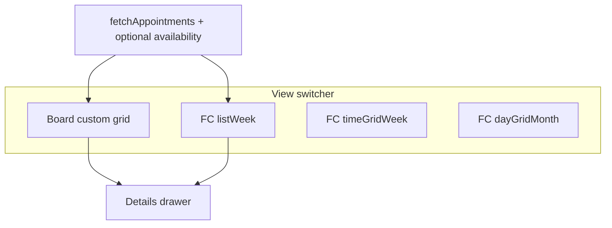

# Provider calendar

> **Last reviewed:** 2026-06-18

Scheduling UI for providers at [`unified-dashboard/business/calendar.html`](../../unified-dashboard/business/calendar.html). Patient self-scheduling uses separate surfaces (e.g. [`schedule.html`](../../unified-dashboard/patients/schedule.html)).

## View matrix

| Actor | Surface | Default view |
|-------|---------|--------------|
| Provider | `business/calendar.html` | **Board** (desktop ≥1025px), **List** (mobile) |
| Patient | `patients/schedule.html` | Routine journal (not this module) |

## Architecture

| Component | File |
|-----------|------|
| Page + wiring | `calendar.html` |
| FullCalendar styles + board grid | `provider-calendar.css` |
| Shared time/filter helpers | `provider-calendar-core.js` |
| Board renderer | `provider-schedule-board.js` |
| Shell / topbar | `provider-layout.js`, `provider-portal.css` |

## Layers

| Layer | Shows | Default |
|-------|--------|---------|
| **Appointments** | Booked visits only | Yes |
| **Capacity** | Availability + out-of-office blocks | Off |

Availability is **never** shown in Month view (even in Capacity layer) to avoid green flood.

## Board view (Filllo-inspired)

- **Y-axis:** provider name (`appointment.provider`, plus `Unassigned`)
- **X-axis:** 7-day window (Sun–Sat), prev/next/today nav
- **Bars:** local wall-clock time (8am–8pm window), status color, click → existing details drawer
- **Filters:** status/date/provider (API), patient search + provider row filter (client-side)

## FullCalendar views (secondary)

- List, Week, Month — same APIs and drawer as before
- Month: `dayMaxEvents: 3`, short titles (`9a · Tom`)
- Somo green toolbar buttons via `provider-calendar.css`

## Phase C backlog (not in v1)

| Item | Dependency |
|------|------------|
| Drag bar → reschedule | `POST /voice/appointments/reschedule` + optimistic UI |
| Year/month scrubber | Board range state + API `start_date`/`end_date` |
| Room/resource rows | `TENANT_CONFIG.providers[]` or schema |
| Board occupancy % | Aggregates on loaded appointments |
| Export | CSV/iCal from cached appts |

## Related

- [`PROVIDER_PORTAL_SHELL.md`](./PROVIDER_PORTAL_SHELL.md)
- [`PROVIDER_TODAY_PAGE.md`](./PROVIDER_TODAY_PAGE.md)
