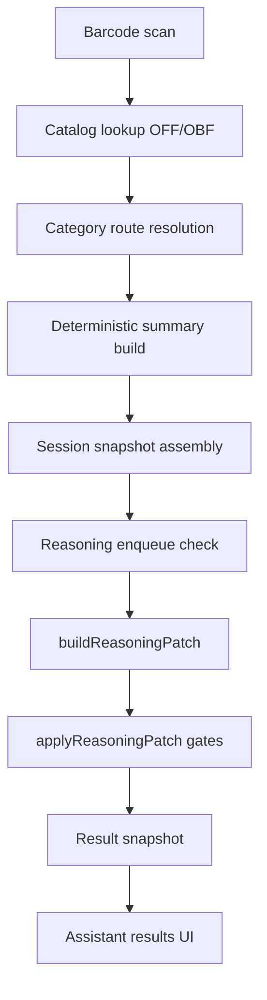
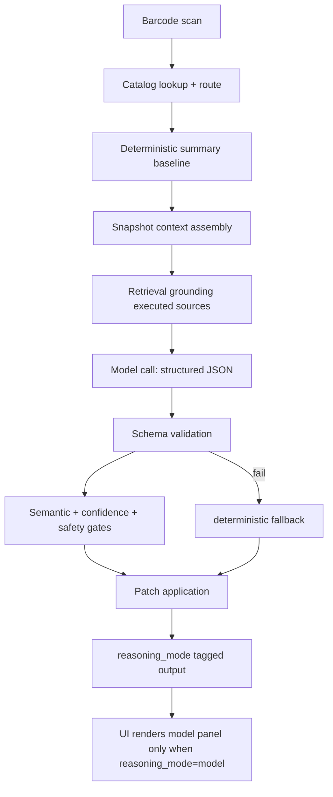
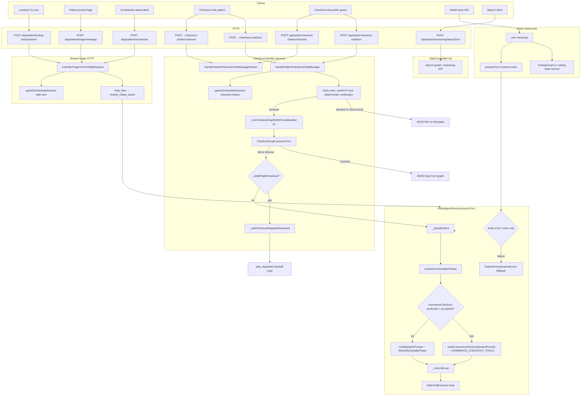
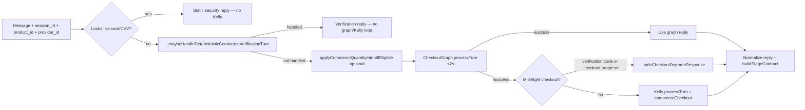
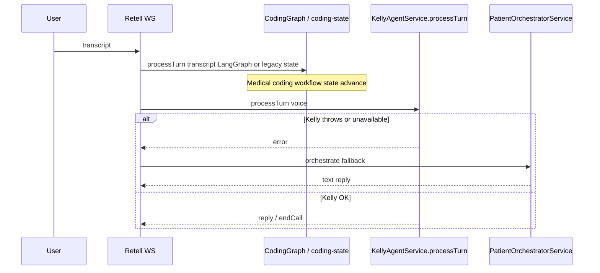
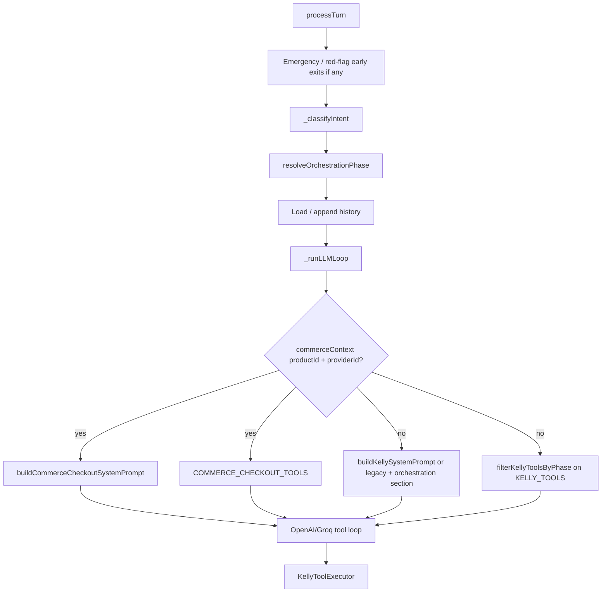

# Middleware platform documentation (consolidated)

**Single file:** This document replaces the previous `docs/middleware-platform/*.md` tree. **Landing-assistant reasoning** (result summary, gates, rollout) remains canonical in [`docs/reasoning/README.md`](../reasoning/README.md).

**Last updated:** 2026-04-29

## Table of contents

- [Agentic Reasoning Solution Design (`AGENTIC_REASONING_SOLUTION_DESIGN.md`)](#agentic-reasoning-solution-design)
- [Kelly + Payment Architecture (`architecture-kelly-payment.md`)](#architecture-kelly-payment)
- [DocLittle platform architecture (concise) (`ARCHITECTURE.md`)](#architecture)
- [Catalog coverage (X2) and routine evidence (Kelly) (`CATALOG_COVERAGE_AND_ROUTINE_EVIDENCE_RUNBOOK.md`)](#catalog-coverage-and-routine-evidence-runbook)
- [Checkout chat UI (patient `checkout-chat.html`) (`CHECKOUT_CHAT_UI_NOTES.md`)](#checkout-chat-ui-notes)
- [Checkout State Contamination Runbook (`CHECKOUT_STATE_CONTAMINATION_RUNBOOK.md`)](#checkout-state-contamination-runbook)
- [Checkout UX QA Checklist (`CHECKOUT_UX_QA_CHECKLIST.md`)](#checkout-ux-qa-checklist)
- [Community Charter (`COMMUNITY_CHARTER.md`)](#community-charter)
- [Contribution Rulebook and Anti-Abuse Penalties (`CONTRIBUTION_RULEBOOK_AND_ANTI_ABUSE.md`)](#contribution-rulebook-and-anti-abuse)
- [Debugging the Kelly LLM + tools path (`debug-llm-kelly-path.md`)](#debug-llm-kelly-path)
- [Deployment data checklist (gates + LLM-4) (`DEPLOYMENT_DATA_CHECKLIST.md`)](#deployment-data-checklist)
- [Endpoint Sensitivity Inventory (`ENDPOINT_SENSITIVITY_INVENTORY.md`)](#endpoint-sensitivity-inventory)
- [Face apparent-age pipeline — implementation plan (skin analysis + NVIDIA) (`FACE_APPARENT_AGE_SKIN_ANALYSIS_PIPELINE.md`)](#face-apparent-age-skin-analysis-pipeline)
- [Fraud Response Playbook (Phase 0) (`FRAUD_RESPONSE_PLAYBOOK.md`)](#fraud-response-playbook)
- [Impact Governance Charter (`IMPACT_GOVERNANCE_CHARTER.md`)](#impact-governance-charter)
- [Impact Methodology and Limitations (`IMPACT_METHODOLOGY.md`)](#impact-methodology)
- [Verified Impact Standard (v1) (`IMPACT_VERIFIED_STANDARD.md`)](#impact-verified-standard)
- [Incident response (payments / security) (`INCIDENT_RESPONSE.md`)](#incident-response)
- [Kelly fix bundle — apply guide (`KELLY_FIX_APPLY_GUIDE.md`)](#kelly-fix-apply-guide)
- [Kelly god-object fix — implementation todos (`kelly-god-object-fix-todos.md`)](#kelly-god-object-fix-todos)
- [Kelly phase-scoped prompts & Skin & Care god-object fix (`kelly-phase-prompt-architecture.md`)](#kelly-phase-prompt-architecture)
- [Key Rotation Schedule and Emergency Rotation Runbook (`KEY_ROTATION_AND_EMERGENCY_RUNBOOK.md`)](#key-rotation-and-emergency-runbook)
- [LangGraph & LangSmith — Developer Guide (`LANGGRAPH_LANGSMITH.md`)](#langgraph-langsmith)
- [Log and Export Redaction Standards (`LOG_REDACTION_STANDARDS.md`)](#log-redaction-standards)
- [OBF Ingestion Runbook (Baseline + Delta + Master Catalog Serving) (`OBF_INGESTION_RUNBOOK.md`)](#obf-ingestion-runbook)
- [On-call & escalation (payments / security) (`ONCALL_AND_ESCALATION.md`)](#oncall-and-escalation)
- [Payment Data Handling Standard (`PAYMENT_DATA_HANDLING_STANDARD.md`)](#payment-data-handling-standard)
- [Payment Data Incident Playbook (`PAYMENT_DATA_INCIDENT_PLAYBOOK.md`)](#payment-data-incident-playbook)
- [Payment errors — customer-facing taxonomy and support runbook (`PAYMENT_ERRORS_AND_SUPPORT_RUNBOOK.md`)](#payment-errors-and-support-runbook)
- [Payments reliability — SLOs & SLIs (Phase 0) (`PAYMENT_SLOS_SLIS.md`)](#payment-slos-slis)
- [PHI/PII Data Inventory and Classification (Payments + Impact) (`PHI_PII_DATA_INVENTORY_AND_CLASSIFICATION.md`)](#phi-pii-data-inventory-and-classification)
- [Postmortem template (Sev1 / Sev2) (`POSTMORTEM_TEMPLATE.md`)](#postmortem-template)
- [Predeploy Security Checklist (Payment/Checkout) (`PREDEPLOY_SECURITY_CHECKLIST.md`)](#predeploy-security-checklist)
- [Privacy Hardening Checklist (`PRIVACY_HARDENING_CHECKLIST.md`)](#privacy-hardening-checklist)
- [Reasoning Map v1 Rollout (`reasoning-map-v1-rollout.md`)](#reasoning-map-v1-rollout)
- [Retell Configuration - Quick Reference (`RETELL_CONFIG_QUICK_REFERENCE.md`)](#retell-config-quick-reference)
- [Retell SIP Trunk Configuration - FINAL VALUES (`RETELL_SIP_CONFIG_FINAL.md`)](#retell-sip-config-final)
- [Retell `kelly_flow` and routine intake (A3) (`retell-kelly-flow.md`)](#retell-kelly-flow)
- [Review Committee Process for Disputed Impact Claims (`REVIEW_COMMITTEE_PROCESS.md`)](#review-committee-process)
- [Reasoning pipeline — roadmap todos (`roadmaps/reasoning-pipeline-roadmap-todos.md`)](#roadmaps-reasoning-pipeline-roadmap-todos)
- [Runbook: Kelly Loop Debugging (`runbook-kelly-loops.md`)](#runbook-kelly-loops)
- [Runbook: Payment and Settlement Debugging (`runbook-payment-settlement.md`)](#runbook-payment-settlement)
- [Scan Release Sprints (Pack C) (`SCAN_RELEASE_SPRINTS.md`)](#scan-release-sprints)
- [Service-to-service least privilege and scoped tokens (`SERVICE_TO_SERVICE_CREDENTIAL_SCOPES.md`)](#service-to-service-credential-scopes)
- [SIP Authentication Troubleshooting Guide (`SIP_AUTH_TROUBLESHOOTING.md`)](#sip-auth-troubleshooting)
- [Skin Taxonomy Gold Dataset Plan (`skin-taxonomy-gold-dataset.md`)](#skin-taxonomy-gold-dataset)
- [Skin Taxonomy Quality Gates (`skin-taxonomy-quality-gates.md`)](#skin-taxonomy-quality-gates)
- [Skin & Care — Step 2 paths, report shape, and Step 1 inputs (`skincare-assessment-product-spec.md`)](#skincare-assessment-product-spec)
- [Middleware Coding Standards (`standards.md`)](#standards)
- [Step 10 + LangSmith (`STEP10_LANGSMITH_RUNBOOK.md`)](#step10-langsmith-runbook)
- [Provider phone surfacing — rollout checklist (`STEP10_PROVIDER_PHONE_ROLLOUT.md`)](#step10-provider-phone-rollout)
- [Stripe Webhook Paths (`STRIPE_WEBHOOK_PATHS.md`)](#stripe-webhook-paths)
- [Kelly + Payment Test Matrix (Handoff) (`test-matrix-handoff.md`)](#test-matrix-handoff)
- [Transparency Cadence (`TRANSPARENCY_CADENCE.md`)](#transparency-cadence)
- [Treasury / Routing Decision Rights (Pre-token) (`TREASURY_DECISION_RIGHTS.md`)](#treasury-decision-rights)
- [Voice Agent: Functions & Dynamic Variables (`VOICE_AGENT_FUNCTIONS_AND_DYNAMIC_VARIABLES.md`)](#voice-agent-functions-and-dynamic-variables)
- [Voice Agent Checkout Configuration Verification (`VOICE_CHECKOUT_VERIFICATION.md`)](#voice-checkout-verification)
- [Voice triage parity (Kelly vs Retell direct) (`VOICE_TRIAGE_PARITY.md`)](#voice-triage-parity)
- [Wallet key custody model and recovery procedures (`WALLET_KEY_CUSTODY_AND_RECOVERY.md`)](#wallet-key-custody-and-recovery)
- [DocLittle Payment Architecture — Wiring Guide (`WIRING_GUIDE.md`)](#wiring-guide)

---

## Introduction

Middleware-specific docs for Kelly, Skin & Care intake, voice/Retell, Step10/LangGraph, checkout and payments, security, catalog/OBF, and operations.

### Documentation parity tracker

- Active gap tracker: [`docs/meta/CODEBASE_BATCH_REVIEW_AND_DOC_GAPS.md`](../meta/CODEBASE_BATCH_REVIEW_AND_DOC_GAPS.md)
- Current batch scope: whole codebase, `routes/`, `services/`
- Use this to keep docs aligned when new route/service files are added

### Runtime ownership quick map (2026-04-29)

Route ownership anchors for developer navigation (expand in future updates):

- **Public experience + commerce**
  - `routes/public-plan-search.js`
  - `routes/public-geo.js`
  - `routes/public-checkout.js`
  - `routes/public-checkout-chat.js`
  - `routes/public-face-read.js`
- **Customer and business surfaces**
  - `routes/customer-dashboard.js`
  - `routes/customer-billing.js`
  - `routes/customer-wallet.js`
  - `routes/providers.js`
  - `routes/pricing.js`
- **Admin and operations**
  - `routes/admin-tenants.js`
  - `routes/admin-ai-assistant.js`
  - `routes/internal-service-ops.js`
  - `routes/usage.js`
  - `routes/usage-monitor.js`
- **Clinical + payer/payor + RCM**
  - `routes/rcm.js`
  - `routes/case-report.js`
  - `routes/prescriptions.js`
  - `routes/invoices.js`

Route group expectations:

- **Public routes** (`/api/public/*`, `/public/*`)
  - guardrails: request validation, public rate limit buckets, no privileged session assumptions
- **Admin routes** (`/api/admin/*`)
  - guardrails: `requireAdminAuth`, stronger auth/session checks, audit-oriented logging
- **Internal routes** (`/api/internal/*`)
  - guardrails: service-to-service auth/token checks; never expose on public clients
- **Patient/provider/customer routes**
  - guardrails: domain auth middleware + endpoint-specific limiters and validation

Service-domain map anchors for developer navigation:

- **Assistant/reasoning orchestration**: `services/reasoning-*`, `services/checkout-graph.js`, `services/session-state-*`
- **Security/compliance**: `services/anti-sybil-service.js`, `services/redaction-service.js`, `services/privacy-governance-service.js`
- **Geo/plan/coverage**: `services/geo-resolver-service.js`, `services/scan-route-response.js`, `services/landing-*`
- **Payor/provider network**: `services/payor-*`, `services/provider-network-*`
- **Payments/reliability**: `services/payment-*`, `services/settlement-*`, `services/refund-workflow-service.js`

Service dependency boundaries and data authority:

- **Routing layer (`routes/*`)** owns HTTP contracts and middleware composition; should not hold deep business state logic.
- **Service layer (`services/*`)** owns domain decisions and state transitions.
- **Database access (`database.js`)** is authority for persistence primitives and migrations.
- **Cross-domain orchestration** should happen in explicit orchestrator services, not ad-hoc route coupling.

Per-domain entry services:

- Assistant/reasoning: `reasoning-fsm-service.js`, `reasoning-job-queue-service.js`
- Payments: `payment-orchestrator.js`, `refund-workflow-service.js`, settlement services
- Geo/coverage: `geo-resolver-service.js`, `scan-route-response.js`
- Payor/provider network: `payor-registry-resolver-service.js`, `provider-network-precheck-service.js`

Failure-mode notes:

- **Reasoning**: default to deterministic/fallback path when model/gate paths fail.
- **Payments**: enforce idempotency and reconcile webhook/process route divergence.
- **Payor**: use feature-flagged canonical resolver rollout and explicit review queue handling.

Per-domain debug quick links:

- Runtime/call paths: `docs/architecture/RUNTIME_ENTRYPOINTS_AND_CALL_PATHS.md`
- Ownership map: `docs/development/CODE_OWNERSHIP_BY_SURFACE.md`
- Scripts map: `docs/development/SCRIPTS_OPERATIONS_MAP.md`
- Gap tracker: `docs/meta/CODEBASE_BATCH_REVIEW_AND_DOC_GAPS.md`

New route checklist:

1. Add route mount and validation/auth/rate-limit middleware.
2. Add/update tests (unit or integration for contract behavior).
3. Add observability hooks (logs/metrics/audit where relevant).
4. Update this middleware docs ownership map.
5. Update `docs/meta/CODEBASE_BATCH_REVIEW_AND_DOC_GAPS.md` if introducing new route/service coverage.

**Configure Retell** (from repo): `cd middleware-platform && node configure-retell.js` — requires `RETELL_API_KEY`, `RETELL_AGENT_ID`, and usually a running API.

**Change policy:** Prefer one runbook location—avoid duplicating the same procedure in `docs/runbooks/` and here. Link from code comments as `docs/middleware-platform/README.md#anchor`.

**Rollout flags (adapter):** `UNIFIED_CHANNEL_ADAPTER_ENABLED`, `UNIFIED_CHANNEL_ADAPTER_SHADOW_ENABLED`, `CASE_DEIDENT_ENABLED` — see rollout section in reasoning docs for reasoning-specific flags.


---

<a id="agentic-reasoning-solution-design"></a>

## Agentic Reasoning Solution Design

*Former path: `docs/middleware-platform/AGENTIC_REASONING_SOLUTION_DESIGN.md`*

Date: 2026-04-17  
**Status:** Supplemental / historical — **canonical reasoning architecture, contracts, rollout, and ops** are in **[`docs/reasoning/README.md`](../reasoning/README.md)**. Update that file first; keep this doc only for mermaid diagrams or narrative not yet ported.

Scope: Landing assistant scan → result summary reasoning pipeline (middleware + landing).

## 1) Purpose

Original as-is / to-be design and shipping plan. Implementation status and enums live in **`docs/reasoning/README.md`**.

Cross-checks:

- `todos/pending/AGENTIC_REASONING_TODOS.md`
- Reasoning map / roadmap files under this folder (see §2)
- Current middleware/frontend code paths

## 2) Sources reviewed

Primary references reviewed before drafting this design:

- [Reasoning map v1 rollout](#reasoning-map-v1-rollout) · [Roadmap todos](#roadmaps-reasoning-pipeline-roadmap-todos) (same file)
- `docs/architecture/README.md#intelligence-layer-readme`
- [Debug LLM Kelly path](#debug-llm-kelly-path) · [Kelly phase prompts](#kelly-phase-prompt-architecture) (same file)
- `todos/pending/AGENTIC_REASONING_TODOS.md`
- Pipeline diagram: `/Users/ojrichard/Downloads/agentic_reasoning_pipeline.svg`

Current implementation references:

- `middleware-platform/services/result-summary-reasoning-service.js`
- `middleware-platform/services/result-summary-retrieval-grounding-service.js`
- `middleware-platform/services/product-summary-service.js`
- `middleware-platform/services/session-result-snapshot-service.js`
- `unified-dashboard/littlelab-landing/src/AssistantResultsPage.jsx`

## 3) Non-technical system description

When a user scans a product barcode:

1. The system looks up product data from beauty/food catalogs.
2. It classifies route (`cosmetic`, `food`, `supplement`, etc.).
3. It computes deterministic, route-safe summary outputs immediately.
4. It assembles snapshot context (product + conflicts + profile/session).
5. The reasoning layer attempts structured augmentation.
6. Confidence and semantic gates arbitrate what can be upgraded.
7. The UI renders only safe, contract-valid outputs; if reasoning fails, deterministic output remains.

Key product principle: deterministic output is always available; reasoning is additive, never a single point of failure.

## 4) Current architecture (as-is)

## 4.1 Current flow



## 4.2 What is working

- Deterministic route-safe foundation is in place.
- Semantic contract and confidence gates exist in `applyReasoningPatch`.
- Async enqueue/apply scaffold is in place.
- Route-aware rendering and major food-vs-cosmetic guardrails are implemented in UI.
- Fallback behavior is resilient: deterministic remains authoritative if reasoning is unavailable.

## 4.3 Implementation note (do not trust this section without reading canonical doc)

**As of consolidation in 2026-04:** `buildReasoningPatch` in `result-summary-reasoning-service.js` supports **model**, **stub**, and **deterministic_fallback** paths behind feature flags, with gate metrics and async `reasoning_jobs`. The paragraph below described an **older** stub-only era.

**Source of truth:** [`docs/reasoning/README.md`](../reasoning/README.md) (runtime modes, gate stack, rollout, observability).

## 5) Problem statement (historical)

Original framing: reasoning execution integrity vs orchestration plumbing. **Current** known gaps (scan-chat precedence, gate UX, rollout) are summarized under **Known risks** and related sections in [`docs/reasoning/README.md`](../reasoning/README.md). Treat §5–§8 below as design background unless reconciled with that file.

## 6) Target architecture (to-be)

## 6.1 Target flow



## 6.2 Required runtime modes

Every reasoning output must carry:

- `reasoning_mode: 'stub' | 'model' | 'deterministic_fallback'`

Rules:

- `stub`: no AI-facing panel, no model-style provenance claims.
- `model`: AI-assisted panel allowed; evidence only from executed sources.
- `deterministic_fallback`: deterministic output only; no AI-facing explainability panel.

## 7) Solution design by implementation phase

## 7.1 Phase A - Immediate safety stop (today)

Objectives:

- Prevent trust violations while stub path exists.
- Make current production behavior explicit and observable.

Changes:

- Verify and control `RESULT_SUMMARY_REASONING_V1` in production.
- Introduce/enforce `reasoning_mode` now.
- Strip fabricated provenance from stub path:
  - no fake `reasoning_evidence_refs`
  - no fabricated `doc_id_ref`
  - no hardcoded alternatives candidates
- Complete outstanding UI truthfulness fixes:
  - no internal fallback noise strings
  - route-gated cosmetic classifiers
  - single alternatives CTA path
  - no model/version leakage to users
- Ensure ingredient sanitization is applied before thread-event publishing to LLM context.

## 7.2 Phase B - Real model integration

Objectives:

- Replace stub generation with real structured reasoning.
- Keep deterministic as fail-safe baseline.

Changes:

- Replace regex/copy logic in `buildReasoningPatch` with Claude call.
- Prompt constraints:
  - route-aware framing
  - no medical diagnosis/cure claims
  - JSON-only structured output
- Add strict response schema validation.
- On parse/validation/provider failure:
  - return null patch
  - set `reasoning_mode='deterministic_fallback'`
- Confidence values must come from model output, not hardcoded constants.

## 7.3 Phase C - Pre-scale hardening

Objectives:

- Make system operable at canary and 100% rollout.

Changes:

- Provider reliability controls:
  - timeout, bounded retry, circuit breaker, kill switch
- Observability:
  - mode distribution, latency, cost, fallback rates
- Concurrency/idempotency:
  - dedupe per `(session_id, snapshot_id, input_hash)`
- Eval harness and regression suites:
  - route safety
  - confidence-gate behavior
  - schema compatibility
- Rollout controls and rollback runbook.

## 7.4 Phase D - Post-launch retrieval maturity

Objectives:

- Improve quality and grounding depth after stable model baseline.

Changes:

- Truthful retrieval grounding expansion (hazard dictionary first, then Pinecone when ready).
- Provenance emitted only for executed sources.
- Advanced graph/thought strategies only after real-model baseline is stable.

## 8) Data contracts

## 8.1 Reasoning patch contract (required)

Minimum required metadata:

- `reasoning_model`
- `reasoning_version`
- `reasoning_input_hash`
- `reasoning_mode`
- `reasoning_evidence_refs` (truthful executed refs only)

Verdict payload remains field-scoped so `applyReasoningPatch` can gate per field.

## 8.2 UI contract

- AI explainability panel renders only when:
  - field source is `reasoning`
  - and top-level mode is `model`
- Route safety is authoritative:
  - food/supplement views must not surface cosmetic-only framing blocks

## 9) Risk controls

- Deterministic baseline always available.
- Fail closed on model parse/validation/provider issues.
- Semantic contract can reject route-incompatible model output.
- Production safety stop and kill switch documented.

## 10) Acceptance criteria (release gate)

Must pass before launch:

- Feature flag state verified and documented.
- Stub honesty guardrails applied if model path not yet live.
- No fabricated provenance in user-visible output.
- DLQ within threshold and stable.
- `voice-metrics/inc` 400 resolved.
- Welch sample route-safe checklist passes end-to-end.
- Frontend and backend regression suites pass.

## 11) Mapping to todo execution

This design is implemented via `todos/pending/AGENTIC_REASONING_TODOS.md`:

- "Immediate safety stop (today)" -> Phase A
- "Must before canary" -> Phase B/C readiness
- "Must before 100%" -> Phase C rollout hardening
- "Reasoning Completeness" -> Phase B + D foundations
- "Post-launch Enhancements" -> Phase D

## 12) Open decisions

- Safety score UX behavior before pipeline exists (hide vs static coming-soon).
- Deterministic alternatives visibility policy while model alternatives mature.
- Pinecone readiness criteria and rollout flag policy.


---

<a id="architecture-kelly-payment"></a>

## Kelly + Payment Architecture

*Former path: `docs/middleware-platform/architecture-kelly-payment.md`*


This document summarizes the current end-to-end architecture.

## Kelly flow (current)

1. `KellyAgentService.processTurn()` performs:
   - emergency pre-check
   - fast intent check (billing/routine)
   - LLM loop with tool calls
2. `KellyToolExecutor` executes tool calls:
   - triage (`store_triage_opqrst`, `store_triage_rich_intake`, `run_triage_rag`)
   - booking (`get_available_slots`, `schedule_appointment`)
   - checkout (`create_appointment_checkout`, `verify_checkout_code`)
3. Triage state is persisted in `triage_sessions` and `triage_rag_results`.

## Payment flow (current)

1. `/voice/appointments/checkout`:
   - creates `voice_checkouts` row
   - creates `payment_tokens` row
   - sends verification code/email
2. `/voice/checkout/verify`:
   - validates token + code
   - returns wallet availability hints
   - does not settle funds
3. `/process-payment` (or `/api/payment/process`) performs settlement:
   - wallet path: Circle transfer
   - card path: Stripe PaymentIntent
   - then marks checkout paid and records audit/ledger via `payment-processor-service`

## Key distinction

- Checkout created and verified means "ready to pay".
- Money movement happens only in payment processing route.

## Data ownership

- Conversation and triage:
  - `kelly_conversation_history`
  - `triage_sessions`
  - `triage_rag_results`
- Booking:
  - `appointments`
- Checkout/payment:
  - `voice_checkouts`
  - `payment_tokens`
  - `circle_transfers`
  - financial/ledger records

## Known architectural risks

1. Flow drift: verify step can be treated as completion by callers.
2. Provider wallet dependency: wallet settlement requires provider wallet config.
3. Mixed route responsibilities: some payment logic is still heavy in `server.js`.


---

<a id="architecture"></a>

## DocLittle platform architecture (concise)

*Former path: `docs/middleware-platform/ARCHITECTURE.md`*

This document orients new contributors. Deep dives live in `docs/` and `docs/architecture/`.

## Repository layout

| Area | Path | Role |
|------|------|------|
| **Middleware API** | `middleware-platform/` | Express app (`server.js`), SQLite/Postgres, Kelly agent, commerce, voice, webhooks. |
| **Unified dashboard (static)** | `unified-dashboard/` | Patient HTML (e.g. `patients/checkout-chat.html`), landing, assets. Served by middleware static routes or your CDN. |
| **Patient app** | `patient-app/` | Expo/React Native; shares checkout concepts with web. |
| **Root scripts** | `scripts/` | Repo-wide checks (`verify-agentic-checkout.cjs`, performance budgets, etc.). |

## Checkout chat (web)

- **Page shell:** `unified-dashboard/patients/checkout-chat.html` links `checkout-chat.css`, `checkout-phone-e164.js` (browser mirror of `utils/phone-e164.js`), and `checkout-chat.js`.
- **Behavior map:** `docs/architecture/README.md#commerce-agentic-checkout-file-map`.
- **UX notes:** `docs/CHECKOUT_CHAT_UI_NOTES.md`.
- **Static verify (no server):** `node scripts/verify-agentic-checkout.cjs` from repo root.

### Request flow (simplified)

1. Browser loads checkout-chat; `window.API_BASE` defaults to `http://localhost:4000` — must match how you open the page (`localhost` vs `127.0.0.1`) or set `API_BASE` in an init script.
2. **Kelly session** (chat): `kelly_session_id` in localStorage / query; streams to `/api/public/checkout-chat/turn/stream` (or patient variant when signed in).
3. **Cart session** (`session_id`): public commerce cart under merchant; checkout preparation via `POST /api/public/commerce/cart/checkout` with normalized **E.164** phone (`utils/phone-e164.js`).

## `server.js` scale

- Policy for splitting routes: `docs/development/README.md#server-js-refactor-policy`.
- Do not grow `server.js` for new features without following that policy.

## Security & payments

- **Predeploy:** `docs/PREDEPLOY_SECURITY_CHECKLIST.md`.
- **Incident:** `docs/PAYMENT_DATA_INCIDENT_PLAYBOOK.md`.
- **Gate:** `npm run release:security-gate` in `middleware-platform` (redaction tests + forbidden-data scan).

## Periodic hygiene

- Re-read security checklists when routes/logging change; follow `docs/development/README.md#periodic-maintenance` where applicable.

## CI

- GitHub Actions: `.github/workflows/ci.yml` — middleware `npm test`; optional Playwright/Cypress as documented in `CONTRIBUTING.md`.
- **Playwright:** install browsers in CI or locally: `cd middleware-platform && npx playwright install chromium`.


---

<a id="catalog-coverage-and-routine-evidence-runbook"></a>

## Catalog coverage (X2) and routine evidence (Kelly)

*Former path: `docs/middleware-platform/CATALOG_COVERAGE_AND_ROUTINE_EVIDENCE_RUNBOOK.md`*

## X2 — Automated catalog coverage metrics

The canonical implementation is `services/catalog-coverage-metrics.js` (`getCatalogCoverageMetrics`). It tolerates missing tables (older DBs) and returns counts plus **reasoning pair coverage**: share of unique `ingredient_interactions` pair keys that have a matching `knowledge_chunks.pair_key` row.

### CLI (read-only SQLite)

```bash
node middleware-platform/scripts/reasoning-catalog-coverage.cjs /path/to/data.sqlite
```

Output is JSON suitable for logs, dashboards, or CI artifacts.

### Kelly tool

`get_catalog_coverage_metrics` returns the same shape (against the process database). Intended for internal gap analysis, not patient-facing copy.

## X3 — Routine evidence contract (`evaluate_skincare_routine`)

### Canonical field: `evidence_bundle`

Successful routine evaluation returns:

- `verdict` — graph outcome (safe / caution / avoid, conflicts, reason codes, etc.).
- **`evidence_bundle`** — `{ schema_version: '1', chunks, chunk_ids, coverage }` where `chunks` always use the **unified retriever chunk shape** (same schema whether evidence came from the full orchestrator path or from legacy `ingredient_rag_chunks` fallback).

Clients should treat **`evidence_bundle`** as the single RAG/evidence surface for routine turns.

### Legacy dual shapes (opt-in)

If a client still expects **`rag_chunks`** (legacy DB row shape) and/or **`knowledge_chunk_bundle`** (`{ chunks, chunk_ids, coverage }` without `schema_version`), set:

```bash
export KELLY_ROUTINE_DUAL_RAG_SHAPES=1
```

When enabled, those fields are populated alongside `evidence_bundle`. Default is **off** (clean single bundle).

### Related environment flags

- **`KELLY_SKIP_UNIFIED_ROUTINE_BUNDLE=1`** — Skip `buildRoutineReasoningPayload` / unified chunk bundle; `evidence_bundle.chunks` are then derived from `getChunksForRoutineVerdict` and normalized to the unified chunk shape.

## Related docs

- Open Beauty Facts ingestion: `docs/OBF_INGESTION_RUNBOOK.md`


---

<a id="checkout-chat-ui-notes"></a>

## Checkout chat UI (patient `checkout-chat.html`)

*Former path: `docs/middleware-platform/CHECKOUT_CHAT_UI_NOTES.md`*

Reference for engineers and QA. Source: `unified-dashboard/patients/checkout-chat.html`.

## Layout

- **Cart + checkout chrome** (`#ccCheckoutCartBlock`) lives **inside** `#chatLog` as the first block so it **scrolls with the chat thread** (not fixed above a tiny message area).
- The main column `#cc-main` scrolls; the chat log no longer uses a short `max-height` trap—more vertical space goes to the conversation.
- **Bottom dock** (`#cc-bottom-dock`) stays fixed for composer + stepper (safe-area aware).

## Stepper

Steps shown in the dock: **Cart → Shipping → Payment → Confirm**.  
There is **no** “Delivery tracking” step in the UI; delivery/invoice details may be communicated on the receipt or later.

## Post-payment security

- On successful Stripe confirmation, **`lockPaymentBubbleAfterSuccess()`** runs: Stripe Elements are destroyed, `#ccInlinePayConfirm` is hidden, and the in-thread billing/card bubble is **replaced** with a short “Payment complete” message so fields are **not left editable** in the DOM.
- The legacy **Exit checkout** button and **post-purchase patient app** promo block were removed as not production-ready for this surface.

## API base URL

- The page defaults `API_BASE` to `http://localhost:4000`. For Playwright or when opening the page via `http://127.0.0.1`, set `window.API_BASE` in an init script to match the page origin so catalog and chat calls do not fail with “Failed to fetch.”

## Related

- Phone normalization for commerce: `utils/phone-e164.js` and `PAYMENT_DATA_HANDLING_STANDARD.md`.
- Landing entry parity: `npm run test:e2e-landing-cta` (`e2e/landing-cta-entry-flows.spec.cjs`).


---

<a id="checkout-state-contamination-runbook"></a>

## Checkout State Contamination Runbook

*Former path: `docs/middleware-platform/CHECKOUT_STATE_CONTAMINATION_RUNBOOK.md`*

## Purpose
Operational runbook for checkout rail incidents where users are incorrectly resumed, payment controls appear early, or rail stages rewind.

## Scope
- Public checkout-chat flow (`/api/public/checkout-chat/*`)
- Kelly tool rail (`send_commerce_verification_code`, `verify_commerce_code`, `prepare_commerce_checkout`)
- Stage sync contract (`checkout_stage`, `policy_flags`, `allowed_next_actions`)

## Fast Triage
1. Check `/api/admin/metrics` `checkout_policy` block:
   - `resume_required_count`
   - `product_switch_reset_count`
   - `prepared_transition_count`
   - `confirmed_transition_count`
   - `conversion_confirmed_over_prepared`
2. Confirm active rail guards:
   - `CHECKOUT_RAIL_GUARDS_ENABLED`
   - `CHECKOUT_STAGE_SYNC_INTENT_AWARE`
3. Inspect session meta keys in `kelly_session_meta_kv`:
   - `checkout_stage`
   - `checkout_context_version`
   - `commerce_email_verified_context_version`
   - `commerce_shipping_context_version`
   - `checkout_resume_decision`
   - `checkout_product_id`

## Incident Signatures
- **Prepared shown on learn entry**
  - `resume_required` should be `true` and `can_show_payment_form` should be `false`.
- **Stage rewind**
  - attempts to move from `checkout_prepared`/`payment_confirmed` to `code_sent`/`collecting_details` should be blocked.
- **Product switch contamination**
  - switching `product_id` with same session should force context reset.

## Recovery Actions
1. Force reset for affected session:
   - `POST /api/public/checkout-chat/reset` with `session_id`.
2. Ask user to choose:
   - Continue previous checkout OR Start over.
3. Re-check stage sync contract with:
   - `ui_mode`, `checkout_intent`, `product_id`.

## Rollout Safety
- Keep `CHECKOUT_RAIL_GUARDS_ENABLED=true` in production.
- If emergency rollback is required:
  - set `CHECKOUT_STAGE_SYNC_INTENT_AWARE=false` first (least risky),
  - avoid disabling all rail guards unless checkout is hard-down.

## Regression Checklist
- `npm run test:checkout:backend-rails`
- `npm run test:e2e-landing-kelly-stripe-parity`
- `npm run test:e2e-landing-kelly-stripe-charge-path` (strict Stripe interactive path)


---

<a id="checkout-ux-qa-checklist"></a>

## Checkout UX QA Checklist

*Former path: `docs/middleware-platform/CHECKOUT_UX_QA_CHECKLIST.md`*

Use this checklist for quick manual verification of chat checkout UX across desktop and mobile widths.  
See also: `CHECKOUT_CHAT_UI_NOTES.md`.

## Required States

- [ ] `Cart` step renders with correct item count and subtotal.
- [ ] `Shipping` step appears after email capture / code send.
- [ ] `Payment` step appears after `checkout_prepared`.
- [ ] `Confirm` step appears after successful payment (server stage `payment_confirmed` maps to **Confirm** in the dock; there is no separate “delivery” step in the UI).

## Layout

- [ ] Cart/checkout block scrolls **with** the chat thread (user can scroll it up to read earlier messages).
- [ ] Main column scroll feels natural on mobile (no tiny fixed chat viewport).

## Verification UX

- [ ] No duplicate OTP prompts after chat verification succeeds.
- [ ] Payment panel does not show secondary `Send code / Verify` controls.
- [ ] Verified users are prompted with a button CTA to continue (no phrase loop dependency).
- [ ] If shipping was already captured, user is not asked for shipping again.

## Payment Panel UX

- [ ] Billing labels are clear (`Billing street address`, card section includes CVC wording).
- [ ] Stripe payment element is visible and clickable.
- [ ] Card/CVC fields accept focus and input.
- [ ] Pay button is disabled during in-flight payment to block duplicate submit.
- [ ] Cancel control does not overlap payment controls.

## Post-payment (security + clarity)

- [ ] After success, **billing/card inputs are gone** (replaced by a short “Payment complete” notice—not editable fields).
- [ ] Receipt bubble appears with total, email, and order reference where applicable.
- [ ] Composer placeholder after payment is helpful (e.g. questions about the order), not a fake “status” string.

## Totals and Consistency

- [ ] CTA amount matches cart subtotal.
- [ ] Receipt amount matches charged subtotal.
- [ ] Cart/chat/panel totals are consistent across the flow.

## Failure/Recovery UX

- [ ] Payment failure shows retry-safe guidance.
- [ ] Retry uses checkout continuation (no verification rewind).
- [ ] Confirmed state shows receipt/order reference.

## Screenshots to Capture

- [ ] Cart step (subtotal visible)
- [ ] Shipping step (verification guidance)
- [ ] Payment step (Stripe field visible)
- [ ] Confirm step (post-payment state + receipt)
- [ ] Failure state (retry guidance)


---

<a id="community-charter"></a>

## Community Charter

*Former path: `docs/middleware-platform/COMMUNITY_CHARTER.md`*


## Values

- Evidence over hype
- Respectful collaboration
- Privacy-first transparency

## Participation rules

- No fabricated impact claims
- No harassment, doxxing, or abuse
- Follow contribution and moderation policies

## Moderation policy

- Warning → temporary restriction → suspension for repeated violations
- Appeals allowed through documented review process


---

<a id="contribution-rulebook-and-anti-abuse"></a>

## Contribution Rulebook and Anti-Abuse Penalties

*Former path: `docs/middleware-platform/CONTRIBUTION_RULEBOOK_AND_ANTI_ABUSE.md`*


## Contribution rules

- Submit impact events with required evidence.
- Use accurate provenance metadata.
- Respect privacy classifications.

## Anti-abuse controls

- Duplicate claim detection
- Verification sampling and audits
- Anti-sybil/fraud review integration

## Penalties

- Level 1: warning and correction request
- Level 2: temporary contribution freeze
- Level 3: suspension + manual review required for reinstatement

## Appeals

- Appeal includes event ids, evidence, and rationale
- Reviewed by committee within published SLA


---

<a id="debug-llm-kelly-path"></a>

## Debugging the Kelly LLM + tools path

*Former path: `docs/middleware-platform/debug-llm-kelly-path.md`*

Non-deterministic failures usually come from **(A) provider limits**, **(B) stale DB state**, or **(C) harness vs server mismatch** — not from “the model reasoning wrong” in isolation.

## 1. Confirm what actually ran

| Signal | Where |
|--------|--------|
| Provider | Server log line `[KellyAgent] Config: KELLY_PRIMARY_PROVIDER=...` at startup |
| Per turn | Set `KELLY_DEBUG_TURN=1` → logs `[KellyDebug] turn_start`, `turn_success`, `rate_limit_fallback_*`, `degraded_rate_limit_*`, `catch_fallback_return` |
| `toolsUsed` | API JSON `toolsUsed` on `POST /api/patient/triage/message` (harness logs it per turn) |
| DB file | `GET /health?show_db_path=1` → `database_path`; must match harness `DB_FILE` |

## 2. Failure modes (deep)

### A. “High demand / try again in 30 minutes”

- **Source:** `kelly-agent-service.js` catch path when `isRateLimit` is true **after** the rate-limit recovery `try { ... }` fails or does not apply (e.g. triage never completes, slot fetch fails, inner `catch (_) {}` swallows errors).
- **Recovery already in code:** On 429, Kelly tries server-side `store_triage_*` + `run_triage_rag`, then may call `get_available_slots` without the LLM. If that succeeds, **`toolsUsed` now includes `run_triage_rag` when a RAG row exists** (see `_toolsUsedEnsureRagBeforeSlots`).
- **Fix ops:** Ensure `ANTHROPIC_API_KEY` so primary is Claude; raise `KELLY_GROQ_MAX_RETRIES` / spacing in tests; reduce parallel load.

### B. Slots without triage (harness `tool_order_violation`)

- **Real bug:** `get_available_slots` succeeds while **no** `run_triage_rag` appears in `toolsUsed` even though RAG exists (e.g. rate-limit fallback returned only `get_available_slots`). Addressed by **`_toolsUsedEnsureRagBeforeSlots`** on those returns and on the main success path.
- **Stale state:** If the server DB still has `triage_rag_results` for the same `session_id` after a failed wipe, slots can succeed legitimately while the harness expects a fresh triage — use **new UUID** sessions (`run-kelly-tests.sh`) and **same SQLite file** as the server.

### C. Routine turn 1 fast but empty `toolsUsed`

- **Expected:** `toolsUsed: ['run_triage_rag']` after fast path runs `run_triage_rag` server-side.
- If empty, the running process is likely **old code** or a **different service** — redeploy/restart from this repo.

### D. Loops in the harness

- **Same assistant text 3×** → `loop_detected`. Often follows **(A)** because the harness sends “Please continue.”
- Not fixable by “more reasoning”; fix **provider availability** or **test pacing** (`SLEEP_BETWEEN_CALLS`).

## 3. Suggested debug sequence

1. Restart middleware from the repo you’re testing.
2. `curl -s 'http://localhost:4000/health?show_db_path=1' | jq .`
3. Export `KELLY_DEBUG_TURN=1`, reproduce one failing case, grep logs for `[KellyDebug]`.
4. Run a **single** case: `bash scripts/run-kelly-tests.sh back_pain_en` and read `test-results/.../logs/back_pain_en.log`.

## 4. Related code

- `processTurn` try/catch + rate-limit recovery: `services/kelly-agent-service.js`
- Slot gating: `services/kelly-tool-executor.js` (`_getAvailableSlots`)
- Session wipe: `server.js` `handlePatientTriageMessage` + `database.wipeChatSessionClinicalState`
- LLM routing / Groq retries: `services/llm-router.js`


---

<a id="deployment-data-checklist"></a>

## Deployment data checklist (gates + LLM-4)

*Former path: `docs/middleware-platform/DEPLOYMENT_DATA_CHECKLIST.md`*

**impl-6 / impl-13:** Verify in each production/staging environment **before** relying on booking/triage gates or language persistence.

## Triage gate columns (impl-6)

- [ ] Migrations that add **`intake_complete_at`** (and related triage columns) have been **applied** — see `docs/architecture/README.md#care-delivery-booking-checkout-pending-today` (BUG-011/015).
- [ ] Smoke test: complete triage → **`intake_complete_at`** non-null in `triage_sessions` → schedule succeeds past **`RICH_INTAKE_REQUIRED`** / **`TRIAGE_INCOMPLETE`**.
- [ ] Optional: alert or dashboard on high rate of **403** responses with `TRIAGE_INCOMPLETE`, `TRIAGE_NOT_STARTED`, or `RICH_INTAKE_REQUIRED` (unexpected volume may indicate migration drift or client bugs).

## Language persistence (impl-13 / gap18)

- [ ] **`kelly_session_meta`** exists and includes **`preferred_language`** (migration `010_triage_soap_practitioner_unique.js` or equivalent).
- [ ] Smoke: first Kelly turn sets language → subsequent turns read from meta (no per-turn drift) — see `kelly-agent-service.js` gap18 path.

## Voice triage parity (ops)

- [ ] **`REQUIRE_TRIAGE_FOR_VOICE=1`** in production unless explicitly documented otherwise (`VOICE_TRIAGE_PARITY.md`).
- [ ] **`LEGACY_APPOINTMENTS_API_DISABLED`** policy decided (410 vs migration window).

## Patient Orchestrator (impl-5 / C1)

- [ ] Understand: orchestrator applies **`evaluateTriageGuardrailsForSession`** only when a **`triage_sessions`** row exists for **`session.session_id`** — see `docs/architecture/README.md#patients-patient-orchestrator-triage-provenance`.
- [ ] Voice E2E: orchestrator session id aligned with Kelly triage → booking blocked until triage complete (if testing that path).

## Postgres `voice_checkouts` (impl-9)

- [ ] **`POSTGRES_URL`** deployments: **`triage_session_id`** column exists (auto **`ALTER TABLE ... ADD COLUMN IF NOT EXISTS`** on first `createVoiceCheckout`).
- [ ] Verify checkout insert includes audit id when using voice checkout with session context.


---

<a id="endpoint-sensitivity-inventory"></a>

## Endpoint Sensitivity Inventory

*Former path: `docs/middleware-platform/ENDPOINT_SENSITIVITY_INVENTORY.md`*

| Endpoint | Sensitivity | Required Controls |
|---|---|---|
| `POST /api/public/checkout-chat/turn` | High | PAN/CVC chat block, stage guardrails, redaction |
| `POST /api/public/checkout-chat/turn/stream` | High | PAN/CVC chat block, stage guardrails, redaction |
| `POST /api/public/commerce/cart/checkout` | High | Tokenized-only input, stage gate, idempotency |
| `POST /api/public/commerce/stripe/confirm-payment` | Critical | Tokenized-only input, PI/session binding, stage gate |
| `GET /api/public/commerce/stripe-config` | Medium | Minimal exposure, no secrets beyond publishable key |
| `GET /api/patient/cards/:cardId` | Critical | Admin auth, strict audit access, business-justified use only |
| `GET /api/admin/metrics` | Medium | No secret leakage in response payloads |

## Authorization Baseline

- Public endpoints: minimal allowed operations + strict request validation.
- Admin-sensitive endpoints: `requireAdminAuth`, role checks, tenant scoping.
- No implicit auth fallback; deny-by-default on mismatch.


---

<a id="face-apparent-age-skin-analysis-pipeline"></a>

## Face apparent-age pipeline — implementation plan (skin analysis + NVIDIA)

*Former path: `docs/middleware-platform/FACE_APPARENT_AGE_SKIN_ANALYSIS_PIPELINE.md`*

**Status:** Planning / hackathon-first  
**Audience:** Builders aligning Little Lab skin analysis with an on-prem NVIDIA box (e.g. DGX Spark over SSH).  
**Constraint:** This document describes *how* we implement; it does not contain application source code.

---

## 1. Purpose and scope

### 1.1 What we are adding

A **voluntary** “photo read” capability: from a **face image** (still frame or upload), produce a **single apparent-age estimate** (a number with an explicit non-clinical label), optionally compare it to the user’s **stated chronological age**, and feed that **bounded fact** into the existing **skin analysis / Kelly** conversation and results story.

### 1.2 What we are not claiming

- Not a diagnosis, not a clinical “biological age” claim in the regulated sense.  
- Not a replacement for professional care.  
- Hackathon phase: **demo credibility** over production hardening.

### 1.3 Can “we” (this repo + Cursor) build it and use the NVIDIA box?

- **Application and API design:** yes, in this repository (middleware + landing).  
- **Heavy inference:** runs on **your** NVIDIA machine (e.g. SSH into DGX Spark). This environment cannot SSH into your LAN; **you** (or CI you own) execute install and runtime there.  
- **Strategy:** treat the DGX as a **dedicated inference endpoint** (or batch worker) that the middleware calls over the network once networking and trust are defined.

---

## 2. Definition of done (phased)

### Phase A — Hackathon demo (“black box works”)

- On the NVIDIA host: a documented procedure turns **one face image file** into **one numeric estimate** plus **model version id**, printed or returned as JSON.  
- No Little Lab integration required for judges if time is short: screen share or pre-recorded output is acceptable.

### Phase B — Product slice (“in the skin analysis feature”)

- From Little Lab: user **opts in**, provides or confirms **chronological age** (or reads from profile if you add it), submits a **still** face image.  
- Middleware receives the request, forwards image to inference, stores **minimal** structured result, exposes it to the UI and to **Kelly** as **context only** (not autonomous medical decisions).

### Phase C — Production hardening (post-hackathon)

- Legal review, retention policy, encryption in transit and at rest, abuse controls, fairness evaluation, model versioning, fallbacks, observability, and explicit **commercial licensing** if any third-party weights are used.

---

## 3. High-level architecture

Think of **three layers** that must agree on contracts only:

1. **Client (Little Lab landing)** — capture, consent UI, display, send one image per intentional action.  
2. **Middleware (Node, existing server)** — auth/session, rate limits, orchestration, persistence, Kelly prompt injection.  
3. **Inference service (Python on NVIDIA host)** — accept image bytes or multipart upload, run face detect + age regressor, return JSON.

**Network shape (conceptual):**

- Hackathon on same LAN: middleware running on a dev machine can call `http://192.168.x.x:PORT/infer` on the DGX if firewall allows.  
- Stricter future: TLS reverse proxy, API key or mTLS, private VPC.

**NVIDIA usage:** the inference service uses the GPU (CUDA) inside the process the framework supports (e.g. PyTorch or TensorFlow on a stack that actually installs on **aarch64** and your **CUDA 13** driver — see risks in section 9).

---

## 4. How we implement it (component by component)

### 4.1 Inference on the NVIDIA host (DGX Spark)

**Role:** Stateless “image in → JSON out.” No direct access to your production database.

**Responsibilities**

- Validate input size and MIME type; reject absurdly large payloads.  
- **Face detection / crop** (must match training preprocessing philosophy — same rough crop as model expects).  
- **Regression head** output: one float; optionally a simple confidence band if the model provides one (many do not — then use copy, not math).  
- Return: `apparent_age_estimate`, `model_id`, `model_version`, `inference_ms`, `gpu_name` (optional telemetry), `quality_flags` (e.g. too_small, no_face_detected).

**Lifecycle on the box**

- Install via **container** (recommended) or a dedicated Conda env **pinned** to what works on aarch64.  
- Run as a **systemd user service** or Docker Compose for “always on during hackathon.”  
- **Health endpoint** for middleware: lightweight route that does not run inference (or runs a tiny warmup).

**Why not “just clone FaceAge inside Node”?**

- The Harvard FaceAge reference repo targets an older stack; on **aarch64 + new CUDA/Python**, wheels and binaries may not exist. The implementation plan assumes: **same scientific idea**, **runnable stack on GB10** — which may mean a different runtime or re-exported weights, documented as `model_id` so Kelly and UI never confuse versions.

### 4.2 Middleware (existing `middleware-platform`)

**Role:** The only public entry from the internet (or from your dev UI); it owns sessions and policy.

**New responsibilities**

- **Route** (name to be chosen), e.g. a public or session-scoped “photo read” endpoint under the same patterns as other landing assistant routes.  
- **Idempotency** optional: same session + same image hash could return cached result for demo stability.  
- **Forward** image to inference URL from env var (e.g. `FACE_READ_INFERENCE_BASE_URL`), with timeouts (e.g. 15–60s depending on cold start).  
- **Persist** a small blob of metadata (see section 5) and attach to **landing session** / thread.  
- **Never** store raw images longer than policy allows; hackathon may use “no persistent image, only ephemeral processing” for simplicity.

**Kelly integration**

- Extend the **thread context** or **session snapshot** with a short structured block, e.g. “Photo read (model vX): apparent estimate ~52; user stated age 30; wellness-only.”  
- Prompt guardrails: Kelly must treat this as **one soft signal** among many, not a directive to diagnose.

### 4.3 Client (`unified-dashboard/littlelab-landing`)

**Role:** Honest UX and a clean handoff to middleware.

**New UI flow**

1. **Opt-in screen** — separate from generic camera permission; explicit toggle “Show apparent-age estimate from my photo.”  
2. **Chronological age** — one-time field or profile field; required for your “30 vs reads 50” hook.  
3. **Capture** — still frame from existing LiveKit / file upload path; **no** continuous inference on every video frame (cost, privacy, noise).  
4. **Submit** — POST multipart or base64 per middleware contract.  
5. **Result** — headline + uncertainty copy + link to routine suggestions; optional “Read aloud” if you keep chat TTS.

**Existing code touchpoints (conceptual, not code)**

- Vision and session patterns already exist (`landingLiveKitApi`, vision session polling, thread events). The plan is to **add a parallel “photo read” event type** rather than overloading barcode tracking.

---

## 5. Data model and persistence

### 5.1 What to store (minimum viable)

- `session_id`  
- `model_id` / `model_version`  
- `apparent_age_estimate` (float)  
- `user_stated_age` (int, optional)  
- `delta` (computed in middleware for convenience, or computed in UI only)  
- `consent_photo_read_at` (ISO timestamp)  
- `quality` enum (ok, no_face, low_resolution, etc.)  
- **Do not** store full-resolution face images in hackathon unless you must — prefer ephemeral processing.

### 5.2 Where it lives

**Option aligned with current product:** mirror how **scanned product** and **thread events** attach to the landing assistant session:

- **Thread event** — append-only audit trail for Kelly (“what did the user submit”).  
- **Session result snapshot extension** — optional field block `face_photo_read` so Results page can render a card without re-parsing chat.

Exact JSON shape to be agreed when implementing; version field is mandatory.

---

## 6. End-to-end flow (sequence)

1. User opens skin / assistant experience and enables **Photo read**.  
2. User confirms **stated age** (or loads from profile).  
3. User captures **one still** (or picks a file).  
4. Client POSTs to middleware with session id + image + consent flag.  
5. Middleware validates, optionally rate-limits, forwards to **NVIDIA inference**.  
6. Inference returns JSON; middleware normalizes errors (no face, timeout).  
7. Middleware writes thread event + optional snapshot field.  
8. Client shows card; next Kelly turn includes the new context automatically or after user taps “Ask Kelly about this.”

---

## 7. Using NVIDIA specifically (operational playbook)

### 7.1 Day-to-day during build

- Developers SSH to the DGX, run the inference container or venv, tail logs.  
- Middleware on a dev laptop points to `http://<DGX-LAN-IP>:<port>` **only on trusted network**.

### 7.2 Hackathon day

- DGX on same network as demo laptop; confirm IP static or reserved.  
- Start inference service before judges arrive; hit health check from laptop.  
- Have **two** face photos pre-tested offline so live demo is not the first inference.

### 7.3 Future production

- Inference moves to **same region** as app, behind private networking, with secrets rotation — out of scope for this doc’s hackathon slice.

---

## 8. Security, privacy, abuse

- **Transport:** HTTPS or VPN between middleware and inference in any shared or non-LAN environment.  
- **Secrets:** API key from middleware → inference; rotate after hackathon.  
- **Rate limit** per session and per IP on middleware.  
- **Content:** max image dimensions and megabytes; strip EXIF if policy requires.  
- **Logging:** never log raw image bytes; log hashes and timings.

---

## 9. Risks and mitigations

| Risk | Mitigation |
|------|------------|
| Reference FaceAge env won’t install on **aarch64** / CUDA 13 | Timebox attempt; ship hackathon with **runnable** PyTorch-style age demo or Colab backup; same UX copy. |
| Model bias / wrong number for some users | Soft language, show band or “estimate,” allow dismiss; do not gate features on the number. |
| Kelly over-interprets the number | System prompt + structured “context tier” rules; human-in-the-loop copy review. |
| Latency / cold start | Warmup endpoint; async job + polling if >10s. |
| Legal | Wellness disclaimer; separate consent; no clinical outcome claims. |

---

## 10. Testing strategy (no code — what to verify)

- **Inference host:** single known image → stable numeric output across two consecutive calls (or document nondeterminism if any).  
- **Middleware:** timeout path, no-face path, oversize image path.  
- **Client:** opt-in gating, error banners, accessibility labels for new controls.  
- **E2E (optional):** Playwright happy path: opt-in → upload fixture image → see numeric card (may mock inference in CI).

---

## 11. Rollout order (recommended build order)

1. Inference JSON API on DGX + health check + one manual `curl` from laptop.  
2. Middleware proxy route + thread event write + env-configured base URL.  
3. Landing UI: opt-in + upload + results card.  
4. Kelly: prompt + snapshot consumption.  
5. Polish: copy, limits, telemetry, demo script for judges.

---

## 12. Open decisions (to resolve before coding)

- **Commercial use:** If weights are from AIM-Harvard FaceAge, confirm license vs hackathon-only demo.  
- **Where middleware runs** during hackathon (same LAN as DGX vs cloud-only demo).  
- **Whether chronological age** lives in profile, session-only, or both.  
- **Retention:** zero retention vs 24h vs encrypted blob — pick one for demo.

---

## 13. Summary

**Yes:** we can design the full pipeline so **skin analysis + Kelly** consume a **photo-derived apparent-age signal**, while **NVIDIA** does the compute on the DGX.  

**Build order:** stand up **inference on the GPU host first**, then **middleware contract**, then **landing UI**, then **Kelly context** — each phase independently demoable.

This document is the single implementation blueprint; detailed tickets can be split per section when you start coding.


---

<a id="fraud-response-playbook"></a>

## Fraud Response Playbook (Phase 0)

*Former path: `docs/middleware-platform/FRAUD_RESPONSE_PLAYBOOK.md`*


## Purpose

Operational playbook for suspicious payment and sybil-pattern activity in middleware.

## Trigger Conditions

- Anti-sybil guard returns `block` on payment actions.
- Duplicate payment attempts spike above baseline.
- Webhook replay attempts are detected.
- Unusual burst in high-value retries from shared IP/device fingerprints.

## Severity

- **Sev2:** Single customer/payment path blocked; no confirmed funds loss.
- **Sev1:** Suspected active fraud campaign, replay exploit, or confirmed unauthorized charge risk.

## Immediate Actions (First 15 Minutes)

1. Acknowledge alert and assign incident commander.
2. Enable strict payment safety flags if needed:
   - enforce Twilio signature validation
   - tighten anti-sybil thresholds (temporary)
3. Freeze affected checkout/payment intents if fraud risk is high.
4. Preserve evidence:
   - idempotency key records
   - webhook headers/event ids
   - request metadata (IP, UA hash, customer identifiers)

## Investigation Checklist

- Confirm if attempts are replayed payloads or new attempts.
- Check `idempotency_keys` for collisions/in-progress storms.
- Check Stripe/Circle dashboard for matching transaction ids.
- Verify whether any duplicate charge actually settled.
- Scope impact (customers, amount at risk, timeframe).

## Containment

- Block high-risk identity and IP clusters temporarily.
- Increase challenge/friction on affected route family.
- Route flagged requests to manual review queue.
- Disable non-essential high-risk flows until mitigated.

## Customer and Internal Communication

- **Internal:** post status every 30 minutes until contained.
- **Customer support:** use payment error taxonomy and scripted responses.
- **If impact confirmed:** notify affected customers with clear remediation and ETA.

## Recovery and Postmortem

- Reconcile all impacted payment intents/checkouts.
- Refund or reverse unauthorized outcomes.
- Record remediation in incident timeline.
- Publish postmortem (Sev1/Sev2) with:
  - root cause
  - blast radius
  - customer impact
  - prevention tasks with owners/dates

## Ownership

- Engineering on-call: technical mitigation
- Security/compliance lead: risk/legal review
- Payments ops lead: reconciliation and customer remediation


---

<a id="impact-governance-charter"></a>

## Impact Governance Charter

*Former path: `docs/middleware-platform/IMPACT_GOVERNANCE_CHARTER.md`*


## Goals

- Preserve trustworthiness of impact claims.
- Prevent manipulation and gaming.
- Keep public reporting privacy-safe and auditable.

## Rules

- Evidence-backed claims only.
- Mandatory verification state on all impact events.
- Anti-gaming controls and dispute process required for contested claims.

## Enforcement

- Invalid or unverifiable claims are rejected.
- Repeat abuse leads to contribution suspension.
- Appeals route to review committee process.


---

<a id="impact-methodology"></a>

## Impact Methodology and Limitations

*Former path: `docs/middleware-platform/IMPACT_METHODOLOGY.md`*


## What the public dashboard shows

- Delayed aggregate totals of **verified** impact events.
- Endpoint: `GET /api/public/impact/dashboard`

## Privacy safeguards

- Delay window (default 24h): `IMPACT_DASHBOARD_DELAY_HOURS`
- Minimum aggregate threshold (default 5): `IMPACT_DASHBOARD_MIN_AGGREGATE`
- Only events with `privacy_classification=public_aggregate` are included.

## Limitations

- Pending events are excluded.
- False-positive rate depends on sampling volume and reviewer quality.
- Some partner feeds may arrive late and be reflected after delay windows.

## Update cadence

- Dashboard refreshes with API calls.
- Verification sampling monitored over 30-day windows.


---

<a id="impact-verified-standard"></a>

## Verified Impact Standard (v1)

*Former path: `docs/middleware-platform/IMPACT_VERIFIED_STANDARD.md`*


## Evidence requirements

Each impact event should include:

- `source` (who/what produced evidence)
- `reference_id` (external or internal traceable id)
- `attestation` (signed/asserted statement)
- `verification_method`

## Accepted verification methods

- `provider_attestation`
- `partner_receipt`
- `system_reconciliation`
- `manual_audit`

## Rejection criteria

- Missing required evidence fields
- Provenance inconsistency
- Duplicate claim
- Privacy policy violation

Implemented in code:
- `services/impact-ledger-service.js` (`VERIFIED_IMPACT_STANDARD`, `evaluateEvidence`)


---

<a id="incident-response"></a>

## Incident response (payments / security)

*Former path: `docs/middleware-platform/INCIDENT_RESPONSE.md`*

## Severity model

- **Sev1**: Payments unavailable, large-scale double-charge risk, active security compromise, critical webhook ingestion failure, or financial integrity breach.
- **Sev2**: Partial outage, significant degradation, dispute evidence at risk, reconciliation SLA breaches growing.
- **Sev3**: Localized errors, minor degradation, low-risk drift.

## Required timeline capture

Record:
- Start time, detection channel, impacted surface (payment API / webhooks / settlement / reconciliation)
- Current hypothesis and top logs/metrics
- Mitigations attempted + results
- Final root cause + follow-ups

## Standard process

1. **Declare** incident severity and assign roles (commander, scribe, ops).
2. **Stabilize**: stop the bleeding; prefer reversible mitigations.
3. **Validate**: confirm success via SLI snapshot + alerts endpoint:
   - `GET /api/admin/payment-ops/alerts`
4. **Recover**: backfill/reconcile if needed.
5. **Close**: capture final impact + next steps.

## Comms templates

### Internal update

> Severity: SevX\n
> Impact: <what’s broken>\n
> Start: <time>\n
> Current status: <mitigated/unmitigated>\n
> Next update: <time>\n

### Customer-facing snippet (if needed)

> We’re investigating an issue affecting payment processing. If you see a payment error, please retry in a few minutes. We’re working to restore normal service.


---

<a id="kelly-fix-apply-guide"></a>

## Kelly fix bundle — apply guide

*Former path: `docs/middleware-platform/KELLY_FIX_APPLY_GUIDE.md`*

This doc summarizes changes aligned with the **Kelly fix bundle** (LLM routing, triage RAG, migrations, harness hygiene).

## Environment variables

| Variable | Purpose |
|----------|---------|
| `KELLY_PROVIDER_TIMEOUT_MS` | Per-provider HTTP timeout in `llm-router.js` (default `20000`). |
| `KELLY_GROQ_FALLBACK_TO_ANTHROPIC` | Set to `0` to disable **Groq → Anthropic** cross-fallback when both API keys exist. Default: enabled (non-`0`). |
| `KELLY_RATE_LIMIT_REPLY_CHAT` / `KELLY_RATE_LIMIT_REPLY_VOICE` | Optional user-facing copy when Kelly degrades on 429 / rate limits. |
| `KELLY_PRIMARY_PROVIDER` | `anthropic` or `groq` (see `llm-router.js`). |

See `middleware-platform/.env.example`.

## Code touchpoints

1. **`services/llm-router.js`** — `withTimeout`, ordered primary/secondary calls, optional `forceProvider` (no cross-fallback), transient-error cross-fallback (excludes 401/403).
2. **`services/kelly-agent-service.js`** — Main LLM loop and closing message use **`LLMRouter.call`** (not direct `groq.chat.completions.create`) so Groq-primary turns get timeouts + Claude fallback when configured.
3. **`services/kelly-tool-executor.js`** — `run_triage_rag` completion uses **`_confidenceFromTriageRow`** for `rag_confidence` (not a static threshold fallback).
4. **`services/triage-rag-service-v2.js`** — Tracks **`knowledgeFetchSucceeded`**: if every knowledge call throws, V2 **does not** pass an empty `_ragResultOverride`; V1 runs `getCodeCandidates` once. On success (including empty codes), passes override to avoid duplicate fetches.
5. **`migrations/017_triage_rag_confidence_backfill.js`** — Idempotent columns + `rag_confidence` NULL → `0.0` backfill.
6. **`middleware/health-check.js`** — With `?show_db_path=1`, response includes **`database_path`** and alias **`db_path`** for harness/tools.

## Verify

```bash
cd middleware-platform
npm run migrate   # applies 017 if needed
npm run test:kelly
```

Harness DB file must match the running server (`GET /health?show_db_path=1` → `database_path` / `db_path`).


---

<a id="kelly-god-object-fix-todos"></a>

## Kelly god-object fix — implementation todos

*Former path: `docs/middleware-platform/kelly-god-object-fix-todos.md`*

Action checklist for the **phase-aligned prompts** work (Skin & Care landing + full Kelly cleanup).  
**Full context, diagrams, and file map:** [kelly-phase-prompt-architecture.md](./kelly-phase-prompt-architecture.md).

---

## Problem (why we’re doing this)

- **Symptom:** Skin & Care / routine intake conversations pick up **clinical triage** tone (OPQRST loops, “annual visit,” “any symptoms?” when acne was already stated) and **re-ask** fields we already stored.
- **Cause:** `filterKellyToolsByPhase` already **restricts tools** per phase, but **`buildSystemPrompt`** is a **single large** instruction block for almost all non-commerce turns — the model **reads** every job (scheduling, billing, triage, intake) even when it **cannot** call those tools.
- **Landing gap:** `littlelab-landing` often **does not send** `kelly_flow`, so `routine_intake_active` may never flip and users stay in default triage behavior.

---

## What “done” looks like (guiding principle)

Match the **commerce** pattern for non-commerce phases:

**narrow phase-specific instructions + shared safety block + tools already pruned for that phase**

(Commerce already uses `buildCommerceCheckoutSystemPrompt` + `COMMERCE_CHECKOUT_TOOLS`; triage/intake should get the same *shape*, not the commerce tool list.)

---

## Rollback / flags

| Variable | Purpose |
|----------|---------|
| `KELLY_ORCHESTRATOR_PHASE=0` | Disables tool pruning + orchestrator prompt injection (existing). |
| `KELLY_PHASE_PROMPTS` | `1` or `true` → `ROUTINE_INTAKE` and `ROUTINE_FOLLOWUP` use `kelly-prompt-builder.js` (narrow slice + shared safety + orchestrator). Unset / `0` / `false` → full `_buildSystemPromptLegacy` for all phases. Documented in `.env.example`. |

---

## Skin & Care session meta contract (Option A) — **Task 1**

Single writer rule: **`intake_complete` and `skincare_post_intake` are set only together** (same code path) so they cannot drift. Canonical behaviour is in `services/kelly-orchestrator-phase.js` (file header) and `KellyToolExecutor._syncRoutineSkincareIntakeMeta` in `services/kelly-tool-executor.js`.

| Meta key | Set where / by whom | Cleared / overridden when | Read where |
|----------|---------------------|----------------------------|------------|
| `routine_intake_active` | Landing (`kelly_flow` / equivalent) and voice path when Skin & Care flow starts; see [retell-kelly-flow.md](./retell-kelly-flow.md). | **`resolveOrchestrationPhase`**: medical-escape fragments during intake or after follow-up → also sets `kelly_triage_reopen` and clears consumer path. **`return_to_triage` tool**: does not clear this key today; triage reopen drives phase. | **`resolveOrchestrationPhase`** (`routineIntakeHold`, `routineSkincareConsumerHold`, escalation blocks). |
| `intake_complete` | **Server only:** `KellyToolExecutor._syncRoutineSkincareIntakeMeta` when Skin & Care **hard gates** pass (same block as `skincare_post_intake`). | Not routinely cleared mid-session; new assessment flows may reset via future product logic. | **`resolveOrchestrationPhase`** (`routineIntakeHold` false when true); prompts reference orchestrator state. |
| `skincare_post_intake` | **Same function, immediately after** `intake_complete` in `_syncRoutineSkincareIntakeMeta`. | **`resolveOrchestrationPhase`**: post–intake medical escape → `'0'` with `routine_intake_active` cleared. **`return_to_triage`** in `kelly-tool-executor.js` → `'0'`. | **`resolveOrchestrationPhase`**: with `routine_intake_active` + `intake_complete`, selects **`ROUTINE_FOLLOWUP`** instead of falling through to **`TRIAGE_ACTIVE`** (session row + no RAG). |

**Phase outcome:** When all three metas are true (and billing / triage-reopen do not apply), orchestrator phase is **`ROUTINE_FOLLOWUP`** — consumer report/education, not clinical triage, until explicit escalation.

---

## Success criteria

- [x] Landing Skin & Care with `kelly_flow` set: **no** unsolicited “annual checkup with no symptoms” when the user already stated a **skin complaint** (guards + tests; spot-check landing in prod).
- [x] **No** repetitive OPQRST-style loops when stored fields already hold answers — **summary + gap hints injected** each turn when phase prompts are on (`formatRoutineIntakeSummaryFromTriageRow` + session meta gaps).
- [x] **ROUTINE_INTAKE** turns use **intake-sized** system text when `KELLY_PHASE_PROMPTS=1` — Jest ceiling in `kelly-prompt-builder.test.js`.
- [x] **One env flip** (`KELLY_PHASE_PROMPTS` off / `KELLY_ORCHESTRATOR_PHASE=0`) restores legacy monolith + unpruned tools behavior.

---

## Implementation checklist

Use as GitHub issues or project tasks. Check boxes as you merge.

**Coupling:** **A1** and **D2** land together in practice — once `kelly_flow` activates `ROUTINE_INTAKE`, missing **persistence + summary injection** shows up immediately as **re-asks**. Prefer shipping **A1** and **D2** in the same release train, or document accepted interim degradation.

### Phase A — Entry & activation

- [x] **A1.** Add `kelly_flow` (or `routine_intake_active`) to `sendLandingAssistantTurn` in `unified-dashboard/littlelab-landing/src/landingAssistantApi.js` for Skin & Care. (Default `kelly_flow: 'skincare'`; pass `kellyFlow: null` to omit.)
- [x] **A2.** Smoke-test **two-turn minimum**: (1) confirm `routine_intake_active` / meta after first turn; (2) second turn with a fact stated on turn 1 — verify the model still “knows” it once **D2** exists (or file a known gap if D2 is not shipped yet). **Automation:** `npm run smoke:landing-assistant` in `middleware-platform` (optional `DB_PATH` for SQLite meta assert).
- [x] **A3.** Document required values for Retell `dynamic_variables` (server already reads flow in `webhooks/retell-websocket.js`). **Doc:** [retell-kelly-flow.md](./retell-kelly-flow.md).
- [x] **A4 / Task 1.** **Option A meta contract:** who sets/clears/reads `routine_intake_active`, `intake_complete`, and `skincare_post_intake` (single-writer rule). Documented in **Skin & Care session meta contract** earlier in this file; code header in `services/kelly-orchestrator-phase.js` stays the implementation anchor.

### Phase S2 — Skin assessment product spec (before schema wiring)

- [x] **S2.1 (tasks 6–8).** Step 2 **four paths**, **minimum report contents**, **path → Step 1 field map**, and **hard/soft completion gates** (spec only): [skincare-assessment-product-spec.md](./skincare-assessment-product-spec.md).

### Phase S2.5 — Task 22 design lock + migration header

- [x] **S2.5.1 (tasks 9–10).** Locked **enums / JSON shapes / column list** in migration header + `up()` adding columns: [migrations/021_skincare_assessment_columns.js](../migrations/021_skincare_assessment_columns.js).

### Phase S3 — Skincare columns + persistence (tasks 11–13)

- [x] **S3.1.** `upsertTriageSession` patches all 11 assessment columns when present on the session object; `getTriageSession` parses `skin_concerns_json`, `triggers_json`, `prior_dermatologist_json`.
- [x] **S3.2.** `store_triage_opqrst` merges skincare fields when `routine_intake_active`; `store_triage_rich_intake` accepts the same keys when passed.

### Phase S4 + S4b — Completion + client signal (tasks 14–16)

- [x] **S4.1.** **`_syncRoutineSkincareIntakeMeta`**: five **hard gates** (`skin_type`, concerns array or **quality** text, `pregnancy_status`, `prior_dermatologist_json.seen` boolean, `functional_impact` 1–5) before `intake_complete` / `skincare_post_intake`; **soft gaps** in meta `skincare_intake_gaps_json`; **hard missing** list in `skincare_intake_hard_missing_json`.
- [x] **S4b.1.** `processTurn` success return and Groq fallback attach **`intake_complete`**, **`skincare_assessment_complete`**, **`report_ready`**, **`next_ui_step`**, **`orchestrator_phase`**, **`skincare_intake_gaps`**, **`skincare_intake_hard_missing`** when routine/assessment session.

### Phase B — Prompt dispatch

- [x] **B1.** Add `services/kelly-prompt-builder.js` with `buildSharedSafetyBlock`, `buildPhasePrompt`, `buildKellySystemPrompt`, `phasePromptsEnabled`.
- [x] **B2.** **Incremental:** `ROUTINE_INTAKE` slice lives in the builder; all other phases use `_buildSystemPromptLegacy` until F1–F4.
- [x] **B3.** `_runLLMLoop` calls `KellyPromptBuilder.buildKellySystemPrompt` when not `useCommerceTools` (commerce path unchanged).
- [x] **B4.** Orchestrator section is appended **after** the intake slice in `buildKellySystemPrompt`; intake copy defers red-flag tool routing to orchestrator to reduce overlap.
- [x] **B5.** Code references: `_buildSystemPromptLegacy` + builder only (docs still mention `buildSystemPrompt` historically).
- [x] **B6.** Shared safety = 911/988/channel/`return_to_triage` not in safety block; booking-phase `return_to_triage` rules stay in `buildOrchestrationPromptSection` only. Jest asserts safety text excludes `return_to_triage`.

### Phase C — `ROUTINE_INTAKE` slice (Skin & Care priority)

- [x] **C0.** **`mapToolDescriptionsForRoutineIntake`** in `kelly-orchestrator-phase.js` replaces descriptions for tools exposed in `ROUTINE_INTAKE` (incl. `get_triage_session`, `store_triage_opqrst`, `return_to_triage`, `request_document_upload`, `run_derm_patient_qa`). Broader **F1–F4** tool pass still TODO.
- [x] **C1.** Intake slice + persistence section in `kelly-prompt-builder.js` (annual-visit forbidden when concern on file; systemic “other symptoms”; specialist routing).
- [x] **C2.** Jest guard: routine slice length &lt; 6000 chars (`kelly-prompt-builder.test.js`).

### Phase D — Persistence & summary injection

- [x] **D1.** Field mapping documented in [retell-kelly-flow.md](./retell-kelly-flow.md) (`quality`, `onset`, `associated_sx`, optional `medications`).
- [x] **D2.** **`get_triage_session`** + **`store_triage_opqrst`** on `ROUTINE_INTAKE` / **`ROUTINE_FOLLOWUP`** allow list; **`formatRoutineIntakeSummaryFromTriageRow`** injected in `_runLLMLoop` for both phases when `KELLY_PHASE_PROMPTS` applies. Summary includes structured assessment columns, consumer labels for severity/timing/radiation, **photos/uploads** (`media_requested`, `media_received`, `media_ids`), and optional **`Still needed (server)`** / **`Nice to clarify`** lines from **`skincare_intake_hard_missing_json`** / **`skincare_intake_gaps_json`** (parsed in `kelly-agent-service.js` when building context).
- [x] **D3.** **`KellyToolExecutor._syncRoutineSkincareIntakeMeta`** sets **`intake_complete`** / **`skincare_post_intake`** meta + **`intake_complete_at`** when hard gates pass; gap metas `skincare_intake_gaps_json` / `skincare_intake_hard_missing_json`. Next-phase note in [retell-kelly-flow.md](./retell-kelly-flow.md).

### Phase D2b — Intake question order & tool copy (consumer)

- [x] **D2b.1.** `buildRoutineIntakePhasePrompt`: numbered **hard vs soft** collection order; plain-language severity/timing/radiation; persistence ties to summary “Still needed” / “Nice to clarify.”
- [x] **D2b.2.** `buildRoutineFollowupPhasePrompt`: optional soft-gap follow-up without rigid questionnaire framing.
- [x] **D2b.3.** **`ROUTINE_INTAKE_TOOL_DESCRIPTION_OVERRIDES`** in `kelly-orchestrator-phase.js`: expanded **`get_triage_session`** / **`store_triage_opqrst`** copy (field mapping, forbid “OPQRST” patient-facing wording, no triage-steering).

### Phase E — Code guards

- [x] **E1.** If triage/intake row has non-empty concern/onset, **block** `routine_no_symptoms` / routine-booking framing for that turn (`kelly-agent-service.js` / `kelly-tool-executor.js` — grep `routine_no_symptoms`).
- [x] **E2.** Regression test or script: acne + “no symptoms” → **no** annual-checkup script (`__tests__/routine-no-symptoms-guard.test.js`).

### Phase F — Other phases (full god-object removal)

- [x] **F1.** Triage slice(s): `TRIAGE_DISCOVERY` / `TRIAGE_ACTIVE`.
- [x] **F2.** `BOOKING` slice.
- [x] **F3.** `APPOINTMENT_CHECKOUT` slice (align with existing payment copy).
- [x] **F4.** `BILLING` slice.

### Phase G — Tests & CI

- [x] **G0.** Phase-validation + builder tests green in CI (`kelly-phase-validation.test.js` assertion updated for routine-intake tool text that **mentions** `run_triage_rag` only to **forbid** it).
- [x] **G1.** **`kelly-prompt-builder.test.js`**, **`kelly-phase-validation.test.js`**, **`clinical-recommendation-policy.test.js`**, **`skincare-intake-gates.test.js`**, **`routine-no-symptoms-guard.test.js`**, and **`kelly-skincare-assessment.test.js`** cover allowlists, resolver, orchestration slice, hard/soft gates, summary lines, negation/escalation, and policy fallbacks where deterministic.
- [x] **G2.** Routine slice char ceiling (`kelly-prompt-builder.test.js` C2); optional broader per-phase ceilings still incremental.
- [x] **G3.** **Opt-in** live LLM golden: `RUN_KELLY_GOLDEN=1` → `__tests__/kelly-skincare-assessment.test.js` Block 10 (Amara-style Skin & Care transcript); not run in default `npm test`.

### Phase H — Docs & handoff

- [x] **H1.** [kelly-phase-prompt-architecture.md](./kelly-phase-prompt-architecture.md) and this file updated for env vars, test map, `ROUTINE_FOLLOWUP`, summary/gaps, clinical fallback, and prompt-vs-server nuance (**§ Known nuance** below).
- [x] **H2.** `KELLY_PHASE_PROMPTS` + `KELLY_ORCHESTRATOR_PHASE` notes in `middleware-platform/.env.example`.

---

## Known nuance — prompt “hard gates” vs server completion

- **Server (`_skincareHardGateMissingList`):** exactly **five** fields before `intake_complete` / `skincare_post_intake`: `skin_type`, concerns (`skin_concerns_json` or `quality`), `pregnancy_status`, `prior_dermatologist_json.seen` true/false, `functional_impact` 1–5.
- **Kelly intake prompt** also teaches collecting **onset** (and OPQRST-flavored consumer fields) in conversation order; **onset is not** in `_skincareHardGateMissingList`. Product may later align prompt wording or add onset to the server list — until then, treat “question order” as UX and the five fields as **completion**.

---

## Post-ship hardening (not checklist blockers)

- [x] **Clinical reply guard:** `services/clinical-recommendation-policy.js` — when regex guardrails replace the assistant reply, **`ROUTINE_INTAKE` / `ROUTINE_FOLLOWUP`** use **`FALLBACK_REPLY_ROUTINE_SKINCARE`** (no “what symptom or concern should we focus on next”). Wired in `KellyAgentService._runLLMLoop`.

---

## Totals (checklist items)

| Bucket | Count | IDs |
|--------|------:|-----|
| Implementation (A–H + S2–S4 + D2b) | **39** (core tracks **done** incl. G0–G3, H1, D2b) | A1–A4, S2–S4, B1–B6, C0–C2, D1–D3, D2b, E1–E2, F1–F4, G0–G3, H1–H2 |
| Success criteria (above) | **4** | tracked above |
| Optional follow-ups (below) | **2** | I2, I4 |

---

## Optional follow-ups (not required to close the core issue)

- [ ] **I2.** Logging: legacy vs dispatcher, phase, optional prompt size estimate for regressions.
- [ ] **I4.** Portal or other clients: same `kelly_flow` / intake entry if product requires parity beyond landing.

---

## Quick file map

| Area | Files |
|------|--------|
| Phases + tool filter + intake tool descriptions | `services/kelly-orchestrator-phase.js` |
| LLM loop + phase prompts + summary context | `services/kelly-agent-service.js` |
| Session meta, tools, hard/soft gate sync | `services/kelly-tool-executor.js` |
| Consumer clinical text fallback (skincare vs triage) | `services/clinical-recommendation-policy.js` |
| Phase-dispatched prompts + `formatRoutineIntakeSummaryFromTriageRow` | `services/kelly-prompt-builder.js` |
| Landing HTTP + triage wrapper | `server.js` |
| Voice | `webhooks/retell-websocket.js` |
| Landing client | `unified-dashboard/littlelab-landing/src/landingAssistantApi.js` |
| Skin assessment spec + Task 22 lock | [skincare-assessment-product-spec.md](./skincare-assessment-product-spec.md), `migrations/021_skincare_assessment_columns.js` |
| Deterministic Skin & Care regression suite | `__tests__/kelly-skincare-assessment.test.js` |

---

| Date | Note |
|------|------|
| 2026-04-03 | Extracted checklist + condensed problem/success for execution tracking. |
| 2026-04-03 | A2 two-turn smoke; A/D coupling note; B4/B6 orchestrator + safety de-dupe; C0 tool descriptions; G0 CI prerequisite; totals; I1 folded into C0. |
| 2026-04-03 | **Phase A shipped:** landing `kelly_flow`, `smoke:landing-assistant`, [retell-kelly-flow.md](./retell-kelly-flow.md). |
| 2026-04-03 | **Phase B shipped:** `kelly-prompt-builder.js`, `KELLY_PHASE_PROMPTS`, `__tests__/kelly-prompt-builder.test.js`. |
| 2026-04-03 | **Phases C–D:** routine intake tool overrides, `get_triage_session`/`store_triage_opqrst` in intake, summary injection, `intake_complete` auto. |
| 2026-04-03 | **Option A (orchestration):** `ROUTINE_FOLLOWUP` phase; `skincare_post_intake` co-set with `intake_complete` in **`_syncRoutineSkincareIntakeMeta`**; consumer hold avoids post-intake `TRIAGE_ACTIVE` drop. Meta contract in `kelly-orchestrator-phase.js` header. |
| 2026-04-03 | **Task 1 complete:** meta contract table + A4 in this doc; `KELLY_PHASE_PROMPTS` row notes `ROUTINE_FOLLOWUP`. |
| 2026-04-03 | **Phase S2 + S2.5:** [skincare-assessment-product-spec.md](./skincare-assessment-product-spec.md); `021_skincare_assessment_columns.js` (design header + columns). |
| 2026-04-03 | **S3–S4b:** DB patch + tool merge; hard gates + gap metas; `processTurn` assessment UI fields; summary + tool schema updates. |
| 2026-04-03 | **D2b + gaps in summary:** `formatRoutineIntakeSummaryFromTriageRow` extras; intake/follow-up question order; routine tool overrides; `kelly-skincare-assessment.test.js`; phase-validation test fix for RAG mention-in-override. |
| 2026-04-03 | **`FALLBACK_REPLY_ROUTINE_SKINCARE`** in clinical-recommendation-policy + `_runLLMLoop` phase branch (avoids triage fallback copy on Skin & Care). Docs: success criteria, G/H, nuance §, file map, totals. |


---

<a id="kelly-phase-prompt-architecture"></a>

## Kelly phase-scoped prompts & Skin & Care god-object fix

*Former path: `docs/middleware-platform/kelly-phase-prompt-architecture.md`*

This document explains the **problem**, the **current architecture**, the **target architecture**, and a **checklist** for implementers. It is the working spec for fixing mixed clinical vs consumer behavior on the Little Lab landing assistant and tightening Kelly across phases.

---

## 1. Problem statement

### 1.1 User-visible failure (example transcript)

On the **Skin & Care** landing assistant, users report:

- The assistant **starts** as skincare help but **slides into** clinic triage language: OPQRST-style loops, “route to the right specialist,” **routine / annual visit** framing.
- **“No symptoms”** after the user already described **acne / pimples** is interpreted as **“no medical symptoms for a checkup”** instead of **“no extra systemic symptoms beyond the skin issue.”**
- The model **re-asks** the same questions (onset, “what symptoms”) because answers are **not reliably persisted and injected** back into context.
- **Consumer** expectations collide with **clinical scheduling** copy.

### 1.2 Root cause (technical)

| Layer | What happens today | Why it hurts |
|--------|-------------------|--------------|
| **Tools** | `filterKellyToolsByPhase()` in `kelly-orchestrator-phase.js` **prunes** tools per phase (e.g. no scheduling in triage, narrow set in `ROUTINE_INTAKE`). | The model **cannot** call forbidden tools — good hard boundary. |
| **System prompt** | For the **non-commerce** path, `buildSystemPrompt(context)` in `kelly-agent-service.js` is a **single large instruction block** (~1400+ lines of concerns) sent **regardless of phase**. | The model still **reads** booking / triage / routine-visit objectives and **talks** like that phase even when tools are trimmed → **“god object” agent**. |
| **Commerce path** | When `commerceContext` has `productId` + `providerId`, Kelly uses `buildCommerceCheckoutSystemPrompt` + `COMMERCE_CHECKOUT_TOOLS` — **separate prompt + tools**. | This **already proves** the pattern: **narrow prompt + matching tools** works. |
| **Landing entry** | `POST /api/public/landing-assistant/turn` does **not** send `kelly_flow` from `littlelab-landing` by default. | `routine_intake_active` may never be set → user stays on **default triage** behavior even when the UI says “Skin & Care.” |

**Bottom line:** Phase fixes **tools** but not **instructions**. Fixing only one paragraph (`buildOrchestrationPromptSection`) is insufficient because the **main system prompt** still contains competing jobs.

---

## 2. Terms for the team

| Term | Meaning |
|------|---------|
| **Phase** | Server-computed label: `ROUTINE_INTAKE`, **`ROUTINE_FOLLOWUP`** (post–Skin & Care assessment, consumer mode), `TRIAGE_DISCOVERY`, `TRIAGE_ACTIVE`, `BOOKING`, `APPOINTMENT_CHECKOUT`, `BILLING`. Not a tool call. See `KELLY_ORCHESTRATOR_PHASE` in `services/kelly-orchestrator-phase.js`. |
| **Specialty / department** | Clinical routing output (e.g. dermatology) — often from `run_triage_rag`. **Not** the same as phase. |
| **Lane / job** | Informal: “checkout” vs “triage” vs “skin intake.” May map 1:1 to phase or to `commerceContext`. |
| **Tool** | Callable function the LLM may invoke (`run_triage_rag`, `get_available_slots`, …). Allowed set depends on **phase** (and commerce override). |

---

## 3. Current architecture (as built)

### 3.1 HTTP / WebSocket entry points

| Client | Route | Next step |
|--------|--------|-----------|
| Little Lab landing assistant | `POST /api/public/landing-assistant/turn` | `handlePublicLandingAssistantMessage` → `runKellyTriageTurnForHttpRequest` → `KellyAgentService.processTurn` (`channel: 'chat'`) |
| Patient portal triage | `POST /api/patient/triage/message` | Same `runKellyTriageTurnForHttpRequest` |
| Checkout chat (public / patient) | `POST /api/public|patient/checkout-chat/turn` (+ stream) | `handlePatientCheckoutChatMessage` → often `CheckoutGraph` first, else Kelly with `commerceCheckout` |
| Retell voice | WebSocket `webhooks/retell-websocket.js` | `KellyAgentService.processTurn` (`channel: 'voice'`) |

### 3.2 Intake activation (existing)

- **Chat:** `runKellyTriageTurnForHttpRequest` in `server.js` — if `kelly_flow` / `routine_intake_active` in body or `meta` matches `kellyFlowActivatesRoutineIntake()`, sets `routine_intake_active` on session meta via `KellyToolExecutor._setSessionMeta`.
- **Voice:** `retell-websocket.js` — reads `extractKellyFlowFromRetellCall(callMeta)` and sets the same meta.

Values that activate (see `ROUTINE_INTAKE_KELLY_FLOW_VALUES`): `routine_intake`, `skincare`, `skincare_intake`.

### 3.3 Inside `KellyAgentService.processTurn` (simplified)

1. `_classifyIntent(message)` → `billing` | `routine_booking` | `symptom` | `unknown`.
2. `resolveOrchestrationPhase({ sessionId, message, intentBucket, db, KellyToolExecutor, getLatestRag, routineLocked })` → **phase** + flags.
3. `_runLLMLoop`:
   - If **`commerceContext`** (product + provider): **commerce prompt** + **commerce tools** (phase prune **skipped** for the main tool list).
   - Else: **`KellyPromptBuilder.buildKellySystemPrompt(context, …)`** when `KELLY_PHASE_PROMPTS=1` and orchestration is on (per-phase slice + shared safety + orchestrator block); otherwise **`_buildSystemPromptLegacy`** — plus **`filterKellyToolsByPhase(KELLY_TOOLS, phase, …)`** when `KELLY_ORCHESTRATOR_PHASE` is not disabled.
   - For **`ROUTINE_INTAKE` / `ROUTINE_FOLLOWUP`**: append **`routineIntakeSummaryMarkdown`** (from `formatRoutineIntakeSummaryFromTriageRow` + gap meta) when phase prompts are on; routine tools may use **`mapToolDescriptionsForRoutineIntake`**. Final assistant text passes **`clinical-recommendation-policy`** validation; blocked replies use **`FALLBACK_REPLY_ROUTINE_SKINCARE`** in those two phases (see §4.7).

### 3.4 Tests

- `__tests__/kelly-phase-validation.test.js` — tool allowlists, resolver behavior with mocks, `buildOrchestrationPromptSection` (orchestrator **slice** only, not full system prompt); routine-intake tool override must not use **“call before run_triage_rag”** steering (may mention RAG only to forbid it).
- `__tests__/kelly-prompt-builder.test.js` — phase dispatcher wiring, shared safety, `formatRoutineIntakeSummaryFromTriageRow`, routine slice size ceiling.
- `__tests__/kelly-skincare-assessment.test.js` — deterministic Skin & Care contract (phase resolution, hard/soft gates, tool pruning, negation/escalation, summary fields, orchestration copy, `_storeTriageOpqrst` + meta when DB available); **Block 10** golden transcript with `RUN_KELLY_GOLDEN=1`.
- `__tests__/clinical-recommendation-policy.test.js` — includes skincare fallback branch.
- `__tests__/skincare-intake-gates.test.js`, `__tests__/routine-no-symptoms-guard.test.js` — focused gates / E1-style behavior.

### 3.5 Complete as-built architecture (diagrams + gaps)

This section is the **exhaustive** map of how requests reach Kelly and adjacent systems. Use it when onboarding or debugging cross-cutting behavior (checkout degrade, voice coding spine, deprecated routes).

#### 3.5.1 What is in scope vs out of scope

| In scope here | Out of scope (separate systems) |
|---------------|----------------------------------|
| HTTP routes that call `KellyAgentService.processTurn` or share its triage wrapper | FHIR sync, billing rails, unrelated CRUD APIs |
| `CheckoutGraph` as the pre-Kelly checkout rail | Full payment provider webhooks (see `architecture-kelly-payment.md`) |
| Retell transcript path: coding state + Kelly | Retell agent config in Retell dashboard |
| `Step10` as a **labeled parallel** patient API | LangGraph internals inside Step10 |

#### 3.5.2 HTTP route surface (production Kelly-adjacent)

| Method | Path | Handler chain |
|--------|------|----------------|
| `POST` | `/api/public/landing-assistant/turn` | `handlePublicLandingAssistantMessage` → `runKellyTriageTurnForHttpRequest` → `processTurn` (`chat`) |
| `POST` | `/api/patient/triage/message` | `handlePatientTriageMessage` → same |
| `POST` | `/api/patient/orchestrate` | **Deprecated alias** — same as triage/message |
| `POST` | `/api/patient/checkout-chat/turn` | `handlePatientCheckoutChatMessage` (see §3.5.4) |
| `POST` | `/api/patient/checkout-chat/turn/stream` | `handlePatientCheckoutChatMessageStream` — same logic, SSE |
| `POST` | `/api/public/checkout-chat/turn` | LangSmith trace wrapper → `handlePatientCheckoutChatMessage` (guest: `x-session-id` may be set) |
| `POST` | `/api/public/checkout-chat/turn/stream` | Trace + SSE variant of above |
| `GET` | `/api/public/checkout-chat/stage`, `/invariants`, etc. | **No Kelly** — stage/UI sync |
| WebSocket | `webhooks/retell-websocket.js` | Coding graph + `processTurn` (`voice`) — see §3.5.5 |
| `POST` | `/api/patient/reasoning/step10/run` | **Step10** LangGraph stub — **not** landing / triage Kelly |

Scripts (e.g. `scripts/test-commerce-checkout-agent.js`) also call `processTurn`; omitted from the diagram.

#### 3.5.3 End-to-end flow (all clients)



#### 3.5.4 Checkout path detail (gaps called out)



**Gap labels (behavioral):**

- **G1 — Two brains on checkout:** Graph and Kelly can both own “conversation shape”; only one runs per failed-graph turn, but **success** turns never touch Kelly.
- **G2 — Safe degrade vs Kelly:** Mid-flight users never get a raw Kelly fallback when the graph fails; they get a **handoff** message instead.
- **G3 — Public guest session:** `handlePatientCheckoutChatMessage` always calls `validateSession(sid)`; public routes may set `req.patientSessionId` from `x-session-id`, but **verified portal session** is optional for guest commerce — `mappedPatientId` / `email` are often null while `clinic_id` + `product_id` drive the lane.

#### 3.5.5 Voice path detail (Kelly is not the only spine)



#### 3.5.6 Inside `processTurn` (commerce vs orchestrator)



**Gap labels:**

- **G4 — Prompt/tool mismatch (non-commerce):** Phase prunes **tools** but not the monolithic **system** prompt — documented in §1.2.
- **G5 — Orchestrator off switch:** `KELLY_ORCHESTRATOR_PHASE=0` disables pruning + extra orchestration prompt block (rollback).

#### 3.5.7 Explicit gaps inventory (checklist for reviewers)

| ID | Gap | Where to look |
|----|-----|----------------|
| G1 | Checkout **success** never invokes Kelly | `server.js` `handlePatientCheckoutChatMessage` after `CheckoutGraph.processTurn` |
| G2 | Graph failure + **mid-flight** → **safe degrade**, not Kelly | `_isMidFlightCheckout`, `_safeCheckoutDegradeResponse` |
| G3 | Guest vs portal **identity** on shared checkout handler | `validateSession`, public route `x-session-id` |
| G4 | **God-object prompt** vs phase-pruned tools | `kelly-agent-service.js` `_runLLMLoop` |
| G5 | Orchestrator **feature flag** changes tool + prompt surface | `KELLY_ORCHESTRATOR_PHASE`, `kelly-orchestrator-phase.js` |
| G6 | Voice runs **coding graph** and **Kelly** on same transcript | `retell-websocket.js` |
| G7 | Landing **`kelly_flow`** was historically missing; **now defaulted** for Skin & Care (`landingAssistantApi.js`) — stale clients or bypassed HTTP paths may still omit it |
| G8 | **Step10** is a separate patient reasoning rail | `step10-graph.js`, not `processTurn` |
| G9 | **`/orchestrate`** duplicates triage — easy to forget in docs | `server.js` route alias |

---

## 4. Target architecture (what we are building)

### 4.1 Principle

**Match commerce’s pattern for every non-commerce phase:**  
`shared safety (short) + phase-specific prompt slice + tools already pruned by phase`.

The LLM should **not** receive the full legacy `buildSystemPrompt` when a phase-specific slice exists.

### 4.2 Prompt dispatcher (**shipped:** `services/kelly-prompt-builder.js`)

The module exports:

- **`buildKellySystemPrompt(context)`** — main entry used by `_runLLMLoop` instead of calling `buildSystemPrompt` directly when a feature flag is on.
- **Per-phase builders** (`buildPhasePrompt`):
  - `ROUTINE_INTAKE`, **`ROUTINE_FOLLOWUP`**
  - `TRIAGE_DISCOVERY` / `TRIAGE_ACTIVE`
  - `BOOKING`, `APPOINTMENT_CHECKOUT`, `BILLING`
- **`buildSharedSafetyBlock(context)`** — emergency / crisis / channel rules; kept small; booking-only `return_to_triage` copy stays in the orchestrator section only.

**Rollback:** `KELLY_PHASE_PROMPTS` unset / `0` → dispatcher uses **`_buildSystemPromptLegacy`** for all phases. `KELLY_ORCHESTRATOR_PHASE=0` disables tool pruning + orchestrator injection.

### 4.3 Landing client

- **`littlelab-landing/src/landingAssistantApi.js`**: include **`kelly_flow: 'skincare'`** (or another value in `kellyFlowActivatesRoutineIntake`) on **every** `POST .../landing-assistant/turn` so `ROUTINE_INTAKE` can apply.

### 4.4 Durable intake / triage state

- Persist fields via **`store_triage_opqrst` / `get_triage_session`** and inject **`## INTAKE / TRIAGE SO FAR`** (`formatRoutineIntakeSummaryFromTriageRow`) for **`ROUTINE_INTAKE`** and **`ROUTINE_FOLLOWUP`**, including **Still needed** / **Nice to clarify** when gap metas are set.
- When **five** hard gates pass, **`_syncRoutineSkincareIntakeMeta`** sets **`intake_complete`** and **`skincare_post_intake`** together (resolver then can hold **`ROUTINE_FOLLOWUP`**).

### 4.5 Code guard (not prompt-only)

When **chief complaint / concern / onset** is already stored, **do not** set or honor **`routine_no_symptoms`** / routine-booking framing from that user turn. Prevents the exact **“no symptoms → annual visit”** derail when acne was already stated.

Implement near existing `routine_no_symptoms` handling in `kelly-agent-service.js` / `kelly-tool-executor.js` (grep `routine_no_symptoms`).

### 4.6 Copy rules for `ROUTINE_INTAKE` slice

Explicitly document in the slice:

- Lesions **are** the problem; “any other symptoms” means **systemic / alarm** (fever, rapid spread, severe pain), not “describe pimples again.”
- **Forbidden** while in intake: switching to **annual / routine visit with no symptoms** if a **skin concern** is on file.
- **Forbidden** consumer-unfriendly: “route to specialist” **unless** escalating to clinical triage phase.
- **Question order** in the prompt: **hard** vs **soft** fields aligned with server meta (`skincare_intake_hard_missing_json` / `skincare_intake_gaps_json`) when injected into the summary; see [kelly-god-object-fix-todos.md](./kelly-god-object-fix-todos.md) **Known nuance** — server **`intake_complete`** uses **five** hard gates; **onset** is taught in copy but is **not** in `_skincareHardGateMissingList` until product aligns.

### 4.7 `ROUTINE_FOLLOWUP` and reply guardrails

- **Phase:** After `intake_complete` + `skincare_post_intake` + `routine_intake_active`, resolver holds **`ROUTINE_FOLLOWUP`** so a triage session row without RAG does not drop into **`TRIAGE_ACTIVE`**.
- **Tools:** Same allowlist as **`ROUTINE_INTAKE`** (plus optional `run_derm_patient_qa`); no `run_triage_rag` or scheduling unless patient escalates / asks to book.
- **Orchestrator text:** `buildOrchestrationPromptSection` uses follow-up-specific bullets; it does **not** include the booking-only “new symptoms during booking” line (see tests).
- **Clinical policy:** If `validateAssistantText` fails on the final assistant string, **`fallbackReply(..., { routineSkincare: true })`** replaces the reply for **`ROUTINE_INTAKE`** and **`ROUTINE_FOLLOWUP`** so users do not see the generic triage prompt (“what symptom or concern…”). Implementation: `services/clinical-recommendation-policy.js`, `KellyAgentService._runLLMLoop`.

---

## 5. Relationship to future work (out of scope for v1 doc implementation)

- **SessionRouter** / explicit workflow FSM for SOCRATES steps — optional hardening **after** prompt dispatch works.
- **Unifying CheckoutGraph vs Kelly commerce** — separate initiative; do not block prompt work.
- **Step10 LangGraph** — patient API; not on landing path today.

---

## 6. Environment / rollback

| Variable | Purpose |
|----------|---------|
| `KELLY_ORCHESTRATOR_PHASE=0` | Disables tool pruning + orchestrator prompt injection (existing rollback). |
| `KELLY_PHASE_PROMPTS` | `1` or `true` = all orchestrator phases use narrow slices from `kelly-prompt-builder.js` (shared safety + phase slice + orchestrator block); unset / `0` / `false` = `_buildSystemPromptLegacy` for all phases. See `.env.example`. |

---

## 7. Implementation checklist (todos)

Use this as GitHub issues or project tasks. **Authoritative short copy with totals:** [kelly-god-object-fix-todos.md](./kelly-god-object-fix-todos.md).

**Coupling:** **A1** and **D2** should ship together when possible — activating `ROUTINE_INTAKE` without persistence surfaces re-asks immediately.

### Phase A — Entry & activation

- [x] **A1.** Add `kelly_flow` to `sendLandingAssistantTurn` (default `skincare`; `kellyFlow: null` omits). See `littlelab-landing/src/landingAssistantApi.js`.
- [x] **A2.** Two-turn smoke: `npm run smoke:landing-assistant` in `middleware-platform` (+ optional `DB_PATH` meta assert). See `scripts/smoke-landing-assistant-two-turn.cjs`.
- [x] **A3.** Retell / HTTP values: [retell-kelly-flow.md](./retell-kelly-flow.md).

### Phase B — Prompt dispatch

- [x] **B1.** `services/kelly-prompt-builder.js`: `buildSharedSafetyBlock`, `buildPhasePrompt`, `buildKellySystemPrompt`, `phasePromptsEnabled`.
- [x] **B2.** **Incremental:** `ROUTINE_INTAKE` slice first; **F1–F4** add triage / booking / checkout / billing slices (same `buildPhasePrompt` dispatcher).
- [x] **B3.** `_runLLMLoop` → `KellyPromptBuilder.buildKellySystemPrompt` when not commerce.
- [x] **B4.** Orchestrator block appended after intake slice; overlap reduced (intake defers tool routing to orchestrator).
- [x] **B5.** Runtime uses `_buildSystemPromptLegacy` + builder only.
- [x] **B6.** Safety block excludes `return_to_triage`; booking/triage reopen stays in orchestrator section (see `__tests__/kelly-prompt-builder.test.js`).

### Phase C — ROUTINE_INTAKE slice (Skin & Care priority)

- [x] **C0.** `mapToolDescriptionsForRoutineIntake`; F1–F4 broader tool-description audit still open.
- [x] **C1.** Intake slice + persistence rules in `kelly-prompt-builder.js`.
- [x] **C2.** Jest slice size guard in `kelly-prompt-builder.test.js`.

### Phase D — Persistence & summary injection

- [x] **D1.** [retell-kelly-flow.md](./retell-kelly-flow.md) — `quality`, `onset`, `associated_sx`, optional `medications`.
- [x] **D2.** `get_triage_session` / `store_triage_opqrst` on **`ROUTINE_INTAKE`** and **`ROUTINE_FOLLOWUP`**; summary + gap lines in `_runLLMLoop` (`formatRoutineIntakeSummaryFromTriageRow`, meta `skincare_intake_*_json`).
- [x] **D3.** **`KellyToolExecutor._syncRoutineSkincareIntakeMeta`**; next-phase note in [retell-kelly-flow.md](./retell-kelly-flow.md).

### Phase E — Code guards

- [x] **E1.** If triage/intake row has non-empty concern/onset, block `routine_no_symptoms` meta from this turn’s classification path (`kelly-tool-executor.js`, `kelly-agent-service.js`, `voice-triage-guards.js`).
- [x] **E2.** Regression tests: `__tests__/routine-no-symptoms-guard.test.js` (acne on file + meta `routine_no_symptoms` → `_routineNoSymptomsEffective` false).

### Phase F — Other phases (full god-object removal)

- [x] **F1.** Triage slice(s): `TRIAGE_DISCOVERY` / `TRIAGE_ACTIVE` (`buildTriagePhasePrompt`).
- [x] **F2.** `BOOKING` slice (`buildBookingPhasePrompt`).
- [x] **F3.** `APPOINTMENT_CHECKOUT` slice (`buildAppointmentCheckoutPhasePrompt`).
- [x] **F4.** `BILLING` slice (`buildBillingPhasePrompt`).

### Phase G — Tests & CI

- [x] **G0.** CI green: phase-validation, prompt-builder, and related suites (see §3.4).
- [x] **G1.** Deterministic coverage across validation, builder, skincare-assessment, clinical-policy, gates, routine-no-symptoms tests.
- [x] **G2.** Routine slice size guard (`kelly-prompt-builder.test.js`); further per-phase ceilings optional.
- [x] **G3.** Opt-in LLM golden: `RUN_KELLY_GOLDEN=1` + `kelly-skincare-assessment.test.js` Block 10.

### Phase H — Docs & handoff

- [x] **H1.** This doc + [kelly-god-object-fix-todos.md](./kelly-god-object-fix-todos.md) updated (env vars, paths, `ROUTINE_FOLLOWUP`, summary/gaps, clinical fallback, prompt-vs-server nuance).
- [x] **H2.** `.env.example` updated for `KELLY_PHASE_PROMPTS` / `KELLY_ORCHESTRATOR_PHASE`.

**Count:** Full checklist and totals live in [kelly-god-object-fix-todos.md](./kelly-god-object-fix-todos.md) (includes **D2b**, **G0–G3**, **H1** complete).

---

## 8. File map (quick reference)

| Area | Files |
|------|--------|
| Phases + tool filter + resolver + orchestration text | `services/kelly-orchestrator-phase.js` |
| LLM loop, legacy monolith | `services/kelly-agent-service.js` (`_buildSystemPromptLegacy`) |
| Phase-dispatched prompts | `services/kelly-prompt-builder.js` |
| Tool execution, session meta | `services/kelly-tool-executor.js` |
| Landing HTTP | `server.js` (`runKellyTriageTurnForHttpRequest`, `handlePublicLandingAssistantMessage`) |
| Voice | `webhooks/retell-websocket.js` |
| Landing client API | `unified-dashboard/littlelab-landing/src/landingAssistantApi.js` |
| Baseline + Skin & Care suite | `__tests__/kelly-phase-validation.test.js`, `__tests__/kelly-skincare-assessment.test.js`, `__tests__/kelly-prompt-builder.test.js` |
| Clinical text guardrails | `services/clinical-recommendation-policy.js` |

---

## 9. Success criteria

- Landing Skin & Care with `kelly_flow` set: **no** unsolicited “annual checkup with no symptoms” when user already stated a **skin complaint**.
- **No** repetitive OPQRST-style loops when **stored fields** already contain onset + concern (summary visible to model).
- **ROUTINE_INTAKE** turns use **intake-sized** system text, not full legacy wall (measure token/word count in logs or tests).
- **Rollback:** one env flip restores legacy `buildSystemPrompt` behavior.

---

## Document history

| Date | Note |
|------|------|
| 2026-04-03 | Initial spec: problem, current vs target architecture, implementation checklist for devs. |
| 2026-04-03 | §3.5: complete as-built diagrams (HTTP, checkout, voice, `processTurn`), route table, gaps G1–G9. |
| 2026-04-03 | §7: checklist aligned with kelly-god-object-fix-todos (A2 two-turn, B4/B6, C0, G0, A/D coupling); 27 implementation todos. |
| 2026-04-03 | Phase A done: landing `kelly_flow`, smoke script, [retell-kelly-flow.md](./retell-kelly-flow.md). |
| 2026-04-03 | Phase B: `kelly-prompt-builder.js`, `KELLY_PHASE_PROMPTS`, tests, `.env.example`. |
| 2026-04-03 | Phases C–D: intake tool overrides, persistence tools, prompt summary, `intake_complete` auto. |
| 2026-04-03 | **Doc refresh:** `ROUTINE_FOLLOWUP` in terms table; accurate `processTurn` / `_runLLMLoop` path (`buildKellySystemPrompt`, summary, routine tool maps, clinical skincare fallback); §3.4 test list; §4.6–4.7; G7 landing note; G/H checklist aligned with todos; file map; D3 anchor `_syncRoutineSkincareIntakeMeta`. |


---

<a id="key-rotation-and-emergency-runbook"></a>

## Key Rotation Schedule and Emergency Rotation Runbook

*Former path: `docs/middleware-platform/KEY_ROTATION_AND_EMERGENCY_RUNBOOK.md`*


## Rotation schedule

Default cadence:

- Stripe secrets: every 90 days
- Circle API key + entity secret: every 90 days
- Internal service tokens: every 30 days

Track schedules in `secret_rotation_registry` and monitor due items from:

- `GET /api/admin/payment-ops/secrets/rotation?due_only=1`

## Standard rotation procedure

1. Create new credential in secret manager/provider.
2. Deploy app with new secret available (do not remove old yet).
3. Verify health checks and payment flows.
4. Revoke old credential.
5. Mark rotated:
   - `POST /api/admin/payment-ops/secrets/rotation/:secret_name/mark-rotated`

## Emergency rotation (suspected leak)

1. Contain:
   - Immediately revoke the suspected key/token at provider.
   - Disable affected integration route if needed.
2. Replace:
   - Provision replacement secret with new identifier.
   - Deploy quickly and verify minimal payment path.
3. Validate:
   - Check `GET /api/admin/payment-ops/alerts`
   - Check `GET /api/admin/payment-ops/secrets/abnormal-access`
4. Incident handling:
   - Follow `INCIDENT_RESPONSE.md`
   - Create postmortem from `POSTMORTEM_TEMPLATE.md`


---

<a id="langgraph-langsmith"></a>

## LangGraph & LangSmith — Developer Guide

*Former path: `docs/middleware-platform/LANGGRAPH_LANGSMITH.md`*

**Last Updated:** April 6, 2026

Single reference: config, what’s traced, how to see progress, scripts, and troubleshooting.

---

## 1. Configuration (what sends data)

Tracing is enabled when **`LANGSMITH_API_KEY`** (or **`AP_Langchain`**) is set and **`LANGCHAIN_TRACING_V2`** ≠ `'false'`. **Project:** `LANGCHAIN_PROJECT` / `LANGSMITH_PROJECT` (default `middleware-{env}`). `server.js` loads `utils/langsmith-config.js` first so all LangChain/LangGraph usage is traced.

---

## 2. What is traced

Only **LangChain/LangGraph** calls are sent. Raw HTTP/DB is not traced unless wrapped.

| Component | File | Traced | When |
|-----------|------|--------|------|
| Voice coding (LangGraph) | `coding-graph.js` | Full graph (INTAKE → … → BILLING), checkpointer | Retell when LangGraph enabled |
| Voice coding (LLM) | `medical-coding-service.js` | ChatGroq; tags `medical-coding`, `clinic:{id}`, `call:{id}` | ICD-10/CPT suggestion |
| **Video consult (LangGraph)** | `video-consult-graph.js` | Full graph (accumulate → retrieve_context → human_review → store_fhir); run name `video_consult_{eventType}`; tags `video-consult`, roomId. **Node output:** `processing_metadata` with `remote_count`, `local_count`, `merged_count` | Each agent event; pipeline on end_session |
| Perception | `perception-layer/perception-graph.js` | Graph + GPT-4o text node | Layer1 diagnostic scripts |
| Chat / Admin AI | `chat-llm-service.js`, `admin-ai-assistant-service.js` | ChatGroq | Chat / admin AI |
| Semantic search | `semantic-search-service.js` | OpenAIEmbeddings | Semantic code search |

**Not traced:** RAG HTTP (`remote-rag-client.js`), knowledge-service DB, FHIR writes, REST routes, LiveKit Python agents (unless they trace separately).

---

## 3. How to see progress in LangSmith

1. Open https://smith.langchain.com → select project (e.g. **Doctor Little**).
2. **Runs:** Filter by tags (`video-consult`, `medical-coding`), run name (`video_consult_end_session`), time.
3. Open a run: top-level = `invoke()`; child spans = graph nodes. For video consult: node order + output state (`current_stage`, `rag_context`, `processing_metadata.merged_count`) show progress.
4. No live streaming; use your APIs for real-time UI; LangSmith for post-hoc inspection.

**Quick check:** `cd middleware-platform && npm run test:langsmith`

---

## 4. Environment variables

```bash
# LangSmith (production: required or degraded health)
LANGSMITH_API_KEY=lsv2_pt_...   # or AP_Langchain
LANGCHAIN_TRACING_V2=true
LANGSMITH_MANDATORY=true        # optional: fail startup if missing

# LangGraph (voice)
LANGGRAPH_ROLLOUT_PCT=1
LANGGRAPH_SHADOW=true
LANGGRAPH_ENABLED=true
POSTGRES_URL=postgresql://...
LANGGRAPH_USE_POSTGRES=true
LANGGRAPH_CHECKPOINT_SCHEMA=public
```

---

## 5. Scripts

| Command | Purpose |
|---------|---------|
| `npm run test:langsmith` | Send test trace to LangSmith (requires network) |
| `npm run test:langgraph` | Transcript + function_call through coding graph (shadow) |
| `npm run reconcile:langgraph` | Detect divergence Postgres checkpoints vs voice_call_states; `--repair` to seed |
| `npm run migrate:langgraph` | Seed Postgres checkpointer from voice_call_states; `--dry-run`, `--limit=N` |

---

## 6. LangGraph state (voice)

**States:** INTAKE → EXTRACTION → TRIAGE → CODING → VALIDATION → BILLING. `processTurn(db, callId, triggerType, triggerPayload)`. Checkpointer: MemorySaver (dev) or PostgresSaver (prod).

---

## 7. Tags, metadata, human review

**Medical coding:** Tags `medical-coding`, `doctor-little`, `suggest_codes`, `clinic:{id}`, `call:{id}`; metadata `clinic_id`, `call_id`, `operation`. **LangSmith UI:** Evaluators, Feedback on runs, Datasets. **Code-level HITL:** `LANGGRAPH_HUMAN_REVIEW=true` (interrupt before BILLING).

---

## 8. Feature flags

`langgraph_enabled`: `config/feature-flags.js`, DB `feature_flags`, `utils/feature-flags.js` → `isEnabled('langgraph_enabled', clinicId, callId)`.

---

## 9. Troubleshooting

| Issue | Action |
|-------|--------|
| No traces | `LANGSMITH_API_KEY`, `LANGCHAIN_TRACING_V2=true` |
| LangGraph null | `LANGGRAPH_ROLLOUT_PCT>0` or `LANGGRAPH_SHADOW=true` |
| PostgresSaver fails | Verify `POSTGRES_URL`; run `migrate:langgraph` after deploy |
| Health degraded | Set LangSmith key or accept degraded |

---

## Related

- [LANGCHAIN_LANGGRAPH_RAG_ARCHITECTURE.md](../architecture/README.md#ai-langchain-langgraph-rag-architecture)
- [VIDEO_CONSULT.md](../architecture/README.md#care-delivery-video-consult)


---

<a id="log-redaction-standards"></a>

## Log and Export Redaction Standards

*Former path: `docs/middleware-platform/LOG_REDACTION_STANDARDS.md`*


## Never log

- Full card numbers, CVV, full API keys, raw bearer tokens
- Full SSN or full date-of-birth
- Full clinical notes in public/ops logs

## Allowed with masking

- Email: keep first 2 + domain, mask rest
- Phone: keep last 4 only
- Token/key: first 4 + last 2 only

## Analytics/export controls

- Public exports must use aggregate-only metrics.
- Any row-level export containing PII requires admin-security approval.
- PHI fields must be removed or irreversibly anonymized.


---

<a id="obf-ingestion-runbook"></a>

## OBF Ingestion Runbook (Baseline + Delta + Master Catalog Serving)

*Former path: `docs/middleware-platform/OBF_INGESTION_RUNBOOK.md`*

## Scope

This runbook ingests Open Beauty Facts data into DocLittle's local serving index:

- `products_obf_index` (barcode lookup + taxonomy fields)
- `obf_ingestion_runs` (pipeline observability)
- `obf_delta_applied` (idempotent delta tracking)
- `obf_ingestion_dlq` (malformed/failed rows)

Raw files are stored in GCS under `OBF_GCS_PREFIX`.

## Storage layout

Default prefix: `gs://skinandcare-media-staging/obf`

- `raw/full/` baseline snapshot(s)
- `raw/delta/` delta files from `index.txt`
- `meta/` copied index snapshots
- `checkpoints/last_applied_delta.txt` operational marker

## Baseline job

CSV fallback baseline (current reliable URL):

```bash
cd middleware-platform
OBF_GCS_PREFIX="gs://skinandcare-media-staging/obf" npm run obf:baseline:csv
```

This performs:

1. copy baseline CSV gz to GCS
2. parse + upsert rows into `products_obf_index`
3. initialize checkpoint marker

## Delta job (daily)

```bash
cd middleware-platform
OBF_GCS_PREFIX="gs://skinandcare-media-staging/obf" npm run obf:delta:sync
```

This performs:

1. read OBF delta index
2. copy unseen deltas to GCS
3. apply each unseen delta idempotently
4. write per-run metrics and status

## Runtime serving behavior (master-first)

`GET /api/public/beautyfacts/:barcode` uses:

1. `products_obf_index` master index first (`OBF_INDEX_CACHE_READ != 0`)
2. if miss, calls live OBF API as fallback
3. upserts fallback result back into `products_obf_index`

Response includes `data_source`: `obf_index_cache` or `live_api`.

`GET /api/public/foodfacts/:barcode` follows the same pattern against
`products_off_index` (`off_index_cache` or `live_api`).

## Canonical catalog observability

Use these admin APIs to avoid split reporting:

- `GET /api/admin/catalog/master-stats` — canonical catalog size + latest ingestion/delta state
- `GET /api/admin/metrics` — includes `catalog_master` KPI:
  - `served_from_master_rate`
  - `catalog_size`
  - `fallback_rate`

### KPI policy

- Track one primary KPI: `% scans served from master catalog` (`served_from_master_rate`).
- Alert when it drops below `CATALOG_MASTER_MIN_RATE` (default `0.85`).
- Keep one canonical “total catalog size” from `catalog_master.catalog_size`.

## Observability

Metrics keys:

- `obf.baseline.rows_seen.count`
- `obf.baseline.rows_upserted.count`
- `obf.baseline.rows_failed.count`
- `obf.delta.pending.count`
- `obf.delta.applied.count`
- `obf.delta.failed.count`
- `obf.index_cache.hit.count`
- `obf.index_cache.miss.count`
- `off.index_cache.hit.count`
- `off.index_cache.miss.count`
- `catalog.master.sync.success.count`
- `catalog.master.sync.failed.count`

## In-process sync worker (server startup)

The middleware server can keep the master catalog fresh without an external cron
by running delta sync on an interval.

Environment flags:

- `CATALOG_MASTER_SYNC_ENABLED` (default: enabled in production)
- `CATALOG_MASTER_SYNC_INTERVAL_MS` (default: 24h)
- `CATALOG_MASTER_BOOTSTRAP_BASELINE_ON_EMPTY` (default: `false`)
- `CATALOG_MASTER_MIN_RATE` (default: `0.85`)

## Scheduler

Daily delta schedule (example):

```bash
gcloud scheduler jobs create http obf-delta-daily \
  --location=us-east4 \
  --schedule="15 3 * * *" \
  --uri="https://REGION-run.googleapis.com/apis/run.googleapis.com/v1/namespaces/PROJECT/jobs/obf-delta-sync:run" \
  --http-method=POST \
  --oauth-service-account-email="SERVICE_ACCOUNT" \
  --oauth-token-scope="https://www.googleapis.com/auth/cloud-platform"
```

Monthly rebaseline:

```bash
gcloud scheduler jobs create http obf-baseline-monthly \
  --location=us-east4 \
  --schedule="0 4 1 * *" \
  --uri="https://REGION-run.googleapis.com/apis/run.googleapis.com/v1/namespaces/PROJECT/jobs/obf-baseline:run" \
  --http-method=POST \
  --oauth-service-account-email="SERVICE_ACCOUNT" \
  --oauth-token-scope="https://www.googleapis.com/auth/cloud-platform"
```

## Security follow-up

After moving Cloud Run env to Secret Manager refs, rotate all previously exposed external API keys and revoke leaked service-account private keys.


---

<a id="oncall-and-escalation"></a>

## On-call & escalation (payments / security)

*Former path: `docs/middleware-platform/ONCALL_AND_ESCALATION.md`*

This is the operational policy for incidents involving payment processing, webhooks, reconciliation, and security events.

## Roles

- **Primary on-call (Payments)**: `PAYMENT_EXCEPTION_DRI_PRIMARY` (or weekly rotation from `PAYMENT_EXCEPTION_OWNER_POOL`)
- **Backup on-call**: `PAYMENT_EXCEPTION_DRI_BACKUP`

View effective owners:
- `GET /api/admin/payment-ops/exception-owners`

## Escalation policy

- **Sev1 (critical)**: payments down, repeated webhook failures, suspected compromise, reconciliation drift with large deltas
  - Page primary + backup immediately.
  - Notify leadership + compliance if PHI/PII or fraud is suspected.
- **Sev2 (major)**: partial outage, high error rate, dispute evidence deadline risk
  - Page primary; notify backup if not mitigated in 30 minutes.
- **Sev3 (minor)**: isolated failures, small drift, routine support issues
  - Triage during business hours or next rotation.

## Communication

- Open an incident record using `INCIDENT_RESPONSE.md`.
- Status updates cadence:
  - Sev1: every 15–30 minutes
  - Sev2: hourly


---

<a id="payment-data-handling-standard"></a>

## Payment Data Handling Standard

*Former path: `docs/middleware-platform/PAYMENT_DATA_HANDLING_STANDARD.md`*

## 1) Prohibited Data

The platform must never persist or emit:
- Full PAN
- CVC/CVV/security code
- Raw magnetic stripe / track data

Allowed: Stripe `payment_intent_id`, `payment_method` references, tokenized identifiers.

## 2) Allowed Entry Paths

- Customer card data entry is allowed only through Stripe Elements/Payment Element.
- Chat and API payloads containing raw card-like data must be rejected.

## 3) Storage Contract

- Database may store checkout status, order ids, payment intent ids, totals, and minimal shipping/contact.
- No columns or JSON fields may store full card data.

### Phone numbers

- Persist customer phone as **E.164** (leading `+`, digits only after `+`, 8–15 digits). Use `utils/phone-e164.js` (`normalizeToE164`) or `SMSService.formatPhoneNumber` so inputs like `1…`, `+1…`, and `(555) …` normalize consistently before storage.

## 4) Logging Contract

- All payment/checkout logs must pass through redaction utilities.
- Logs must redact: email, phone, OTP/verification code, client_secret, payment tokens, PAN/CVC patterns.

## 5) Endpoint Controls

- Payment-mutating endpoints require strict input schema and session/intent binding checks.
- Sensitive retrieval endpoints require explicit admin/role authorization and auditability.

## 6) Release Gate

- `npm run release:security-gate` must pass before deployment.


---

<a id="payment-data-incident-playbook"></a>

## Payment Data Incident Playbook

*Former path: `docs/middleware-platform/PAYMENT_DATA_INCIDENT_PLAYBOOK.md`*

## Trigger Conditions

- PAN/CVC pattern detected in logs/artifacts.
- Token/client secret exposed in public logs or traces.
- Unauthorized access to sensitive payment endpoints.

## Immediate Containment (0-30 min)

1. Freeze deploys to affected service.
2. Rotate impacted secrets (Stripe/LangSmith/email providers if exposed).
3. Disable affected endpoint/feature flag where possible.
4. Snapshot and preserve forensic logs.

## Investigation (30-180 min)

1. Identify data classes exposed (PAN/CVC/token/email/OTP).
2. Scope impacted systems and time window.
3. Identify root cause path (endpoint, logger, queue, test artifact).
4. Validate whether external access occurred.

## Remediation

1. Patch code path and add regression tests.
2. Run `release:security-gate`.
3. Backfill redaction/purge for leaked artifacts where possible.
4. Document incident timeline and preventive controls.

## Communication

- Security lead approves stakeholder updates.
- Compliance/legal notified if regulated data exposure is confirmed.


---

<a id="payment-errors-and-support-runbook"></a>

## Payment errors — customer-facing taxonomy and support runbook

*Former path: `docs/middleware-platform/PAYMENT_ERRORS_AND_SUPPORT_RUNBOOK.md`*

This document is the **customer-facing** framing for payment failures and disputes. Engineering details live in code (`refund-workflow-service`, `payment-dispute-service`, `settlement-retry-service`) and admin APIs under `/api/admin/payment-ops/*`.

## Customer-facing error families

| Code / symptom | What the customer sees (plain language) | What support does |
|----------------|----------------------------------------|-------------------|
| **Card declined** | “Your bank declined the charge. Try another card or contact your bank.” | Confirm amount, billing address, and that the card allows online/health purchases. Do not retry more than twice without a different payment method. |
| **Insufficient funds** | Same as decline; optionally mention insufficient funds if the processor message indicates it. | Suggest another card or payment method. |
| **Authentication required (3DS)** | “Complete verification with your bank to finish payment.” | Ask the customer to retry and complete the bank prompt; clear browser cache or try another device if the step never appears. |
| **Expired or invalid card** | “This card number or expiry is not valid.” | Re-enter card details; replace expired cards. |
| **Processing timeout** | “We could not confirm payment in time. You may not have been charged.” | Check **Stripe Dashboard → Payments** for the PaymentIntent before taking a second payment. If uncertain, escalate to engineering with `payment_intent_id`. |
| **Duplicate payment concern** | “A charge may already exist for this visit.” | Search by `checkout_id`, appointment id, or customer email; use idempotent refund policy — **never** refund without confirming capture. |
| **Refund pending** | “Your refund was submitted; it may take 5–10 business days to appear.” | Quote processor timelines; point to receipt email if available. |
| **Refund not allowed (window / status)** | “This payment is not eligible for a refund in the app.” | Check eligibility: checkout must be **completed**, Stripe path, within **REFUND_MAX_AGE_DAYS** (default 120), and amount ≤ captured minus prior refunds. Escalate if edge case (partial shipment, clinical exception). |
| **Chargeback / dispute opened** | “Your bank opened a payment dispute. We will respond through the card network.” | Do **not** promise outcomes. Log Stripe dispute id, assign owner from `/api/admin/payment-ops/exception-owners`, follow internal dispute SOP. |
| **Wallet / USDC (Circle)** | “Wallet refunds are not available in-app.” | Escalate to engineering; do not manually promise Stripe-equivalent behavior. |

## Operational references

- **Refund audit**: `GET /api/admin/payment-ops/refunds/audit` (admin auth required).
- **Disputes**: `GET/PATCH /api/admin/payment-ops/disputes` — intake via Stripe webhooks `charge.dispute.*`.
- **Settlement dead-letter** (Circle triple-jump failures after max retries): `GET /api/admin/payment-ops/settlement/dead-letter`.
- **Retry policy (env)**:
  - `SETTLEMENT_RETRY_MAX_ATTEMPTS` — default `8`; `0` = no dead-letter on retry count alone.
  - `SETTLEMENT_RETRY_BASE_MS` — default `60000` (1 minute base backoff).
  - `SETTLEMENT_RETRY_MAX_BACKOFF_MS` — cap for backoff (default 1 hour).
  - `SETTLEMENT_RETRY_JOB_INTERVAL_MS` — worker tick (default 5 minutes).
- **Exception queue ownership**:
  - `PAYMENT_EXCEPTION_DRI_PRIMARY`, `PAYMENT_EXCEPTION_DRI_BACKUP`, optional `PAYMENT_EXCEPTION_OWNER_POOL` (comma-separated, weekly rotation).
  - Persisted overrides: `PUT /api/admin/payment-ops/exception-owners` (`dri`, `backup`, `owner_pool`).

## Support principles

1. **Never** collect full card numbers in tickets; use last-four references from Stripe only.
2. **Confirm** whether money actually moved (Stripe PI status, Circle transfer status) before refunds or duplicate charges.
3. **Document** `workflow_id` from refund responses when troubleshooting audit rows.


---

<a id="payment-slos-slis"></a>

## Payments reliability — SLOs & SLIs (Phase 0)

*Former path: `docs/middleware-platform/PAYMENT_SLOS_SLIS.md`*

This defines the **service level indicators** (SLIs) and **service level objectives** (SLOs) for payment + webhook + reconciliation reliability.

## Scope

- **Payment API**: `/api/payment/*` (checkout, process, refund, cancel, capture)
- **Stripe webhook ingestion**: `/webhooks/stripe`
- **Reconciliation completion**: deterministic reconciliation job + exception queue

## SLOs (targets)

Configured via env and exposed at `GET /api/admin/payment-ops/slo`.

- **Payment API success rate (30d)**: default **99.5%**
  - Env: `PAYMENTS_API_SLO_SUCCESS_RATE_30D` (default `0.995`)
- **Stripe webhook processing success (30d)**: default **99.9%**
  - Env: `STRIPE_WEBHOOK_SLO_SUCCESS_30D` (default `0.999`)
- **Reconciliation completion**: default **≤ 6 hours**
  - Env: `RECONCILIATION_SLO_COMPLETION_HOURS` (default `6`)

## SLIs (what we measure)

### Payment API

**Signals**
- `ops_counters`: `payment_checkout_failed`, `payment_checkout_error`, `payment_process_failed`
- in-memory metrics (best-effort in current process): `payments_success_total`, `payments_record_error_total`, `payments_ledger_error_total`

**Notes**
- `ops_counters` are persisted and suitable for alerting.
- in-memory metrics are for debugging and will reset on restart.

### Stripe webhook processing

**Signal**
- `stripe_webhook_events` table rows with `status='failed'` in the last hour.

### Reconciliation completion / drift

**Signal**
- `reconciliation_exceptions` where `status='open'` and `sla_due_at < now`.

## Alerting thresholds (Phase 0 defaults)

These thresholds are evaluated by the reliability monitor and exposed at `GET /api/admin/payment-ops/alerts`.

- `ALERT_STRIPE_WEBHOOK_FAILURES_PER_HOUR` (default `5`)
- `ALERT_PAYMENT_PROCESS_FAILED_PER_HOUR` (default `10`)
- `ALERT_RECON_SLA_BREACHES` (default `1`)

## How to use

- **SLO/SLI snapshot**: `GET /api/admin/payment-ops/slo`
- **Alerts report**: `GET /api/admin/payment-ops/alerts`
- **Runbooks**: see `docs/runbooks/middleware-platform/`


---

<a id="phi-pii-data-inventory-and-classification"></a>

## PHI/PII Data Inventory and Classification (Payments + Impact)

*Former path: `docs/middleware-platform/PHI_PII_DATA_INVENTORY_AND_CLASSIFICATION.md`*


## Inventory authority

- Backed by table: `data_inventory_registry`
- Admin APIs:
  - `POST /api/admin/impact/privacy/seed-inventory`
  - `GET /api/admin/impact/privacy/inventory`

## Classification tiers

- `public_aggregate`: safe delayed aggregates only
- `internal`: operational non-sensitive
- `internal_sensitive`: contains PII, restricted role-based access
- `restricted_phi`: contains PHI, strict access and audit

## Required fields per dataset

- `contains_phi` / `contains_pii`
- `privacy_tier`
- `retention_days`
- `owner`
- `access_roles`
- `redaction_policy`

## Payment + impact baseline datasets

- `financial_events` (PII, internal_sensitive)
- `reconciliation_exceptions` (internal)
- `impact_ledger_events` (PII possible, internal_sensitive)
- `fhir_patients` (PHI/PII, restricted_phi)


---

<a id="postmortem-template"></a>

## Postmortem template (Sev1 / Sev2)

*Former path: `docs/middleware-platform/POSTMORTEM_TEMPLATE.md`*

## Summary

- **Incident ID**:
- **Severity**:
- **Start**:
- **End**:
- **Customer impact**:

## What happened (narrative)

## Detection

- How did we detect it?
- How long until detection?

## Root cause

## Contributing factors

## Mitigation & recovery

## What went well

## What didn’t go well

## Action items

| Item | Owner | Priority | Due | Status |
|------|-------|----------|-----|--------|

## Evidence

- Links to logs, dashboards, relevant alert outputs (`/api/admin/payment-ops/alerts`)
- Reconciliation window / exception ids if applicable


---

<a id="predeploy-security-checklist"></a>

## Predeploy Security Checklist (Payment/Checkout)

*Former path: `docs/middleware-platform/PREDEPLOY_SECURITY_CHECKLIST.md`*

- [ ] `npm run release:security-gate` passes.
- [ ] No raw PAN/CVC fields accepted by payment endpoints.
- [ ] Stripe confirm path enforces PI/session binding.
- [ ] Stage transition guard prevents checkout rewind from prepared/confirmed.
- [ ] Sensitive endpoints have explicit auth middleware.
- [ ] Redaction tests pass and no plaintext OTP/client_secret leakage in logs.
- [ ] Critical env vars set for target environment.
- [ ] Incident runbook reviewed and on-call owner assigned.

## Checkout UI (patient chat)

- [ ] Smoke `checkout-chat.html`: cart scrolls in-thread; after payment, billing/card bubble is replaced (not left editable). See `docs/CHECKOUT_CHAT_UI_NOTES.md` and `docs/CHECKOUT_UX_QA_CHECKLIST.md`.
- [ ] Optional: `npm run test:e2e-landing-cta` with `CHECKOUT_E2E_BASE_URL` matching how static assets reach the API (set `window.API_BASE` in tests if using `127.0.0.1` vs `localhost`).


---

<a id="privacy-hardening-checklist"></a>

## Privacy Hardening Checklist

*Former path: `docs/middleware-platform/PRIVACY_HARDENING_CHECKLIST.md`*

Owner: Security + Platform Engineering  
Scope: Checkout, payment, and sensitive data handling

## Batch 1 (Runtime Enforcement)

| Control | Owner | Status | Evidence |
|---|---|---|---|
| PAN/CVC prohibited in checkout APIs | Platform | Implemented | `utils/payment-input-policy.js`, `routes/public-commerce-cart.js` |
| Chat blocks card/CVV entry with deterministic guidance | Platform | Implemented | `server.js` `_looksLikeCardOrCvv` gate |
| Prevent stage rewind during in-flight/confirmed payment | Platform | Implemented | `services/kelly-tool-executor.js` `_setCheckoutStage` rewind guard |
| Virtual card details endpoint admin-gated | Security | Implemented | `server.js` `/api/patient/cards/:cardId` + `requireAdminAuth` |
| Session/intent mismatch guard on confirm-payment | Platform | Implemented | `routes/public-commerce-cart.js` `payment_intent_session_mismatch` |
| Startup strict security for critical secrets in production | Platform | Implemented | `utils/env-validator.js` (`STRICT_SECURITY_STARTUP`) |

## Batch 2 (Governance, Testing, Release Gate)

| Control | Owner | Status | Evidence |
|---|---|---|---|
| Tokenize-only payment contract | Platform | Implemented | `utils/payment-input-policy.js` |
| Redaction guarantees test suite | Security | Implemented | `__tests__/security.redaction.test.cjs` |
| CI forbidden data scan | Security | Implemented | `scripts/security-scan-forbidden-data.cjs` |
| Release security gate script | Platform | Implemented | `package.json` `release:security-gate` |
| Payment data handling standard | Security | Implemented | `docs/PAYMENT_DATA_HANDLING_STANDARD.md` |
| Endpoint auth/sensitivity inventory | Security | Implemented | `docs/ENDPOINT_SENSITIVITY_INVENTORY.md` |
| Incident response playbook | Security | Implemented | `docs/PAYMENT_DATA_INCIDENT_PLAYBOOK.md` |
| Pre-deploy security checklist | Platform | Implemented | `docs/PREDEPLOY_SECURITY_CHECKLIST.md` |

## Mandatory Policy Statements

- Never store PAN/CVC in DB/logs/traces/events/queues.
- Stripe Elements is the only customer card entry mechanism.
- Backend accepts tokenized payment identifiers only.
- Sensitive logs must be redacted at source.
- Payment-sensitive endpoints must be authenticated/authorized and tenant-scoped.


---

<a id="reasoning-map-v1-rollout"></a>

## Reasoning Map v1 Rollout

*Former path: `docs/middleware-platform/reasoning-map-v1-rollout.md`*

## Purpose

`reasoning_map` is the Step-5 controller that arbitrates retrieval outputs before report synthesis.

## Feature Flag

- Env: `AGENT_REASONING_MAP_V1=true`
- Default: disabled (`false`)
- Kill switch: set to `false` and restart service.

## Batch Plan (8 + 8)

### Batch 1 (core map engine)

1. Contract + validator
2. Retrieval evidence normalization
3. Evidence scoring/ranking
4. Rails arbitration (`safety > contraindication > efficacy > preference`)
5. Negative rule set (hard blocks)
6. Positive rule set (safe recommendations)
7. Confidence policy bands (`high|medium|low`)
8. Snapshot integration (`snapshot.reasoning_map`)

### Batch 2 (production hardening)

1. LLM boundary guard (citation-only explanation)
2. Public/internal API exposure policy
3. Explainability UX payload fields
4. Observability metrics and counters
5. Unit/integration/e2e coverage
6. Replay/backfill harness
7. Shadow mode validation
8. Progressive rollout with rollback thresholds

## Shadow Mode

Use `AGENT_REASONING_MAP_V1=true` only in staging first, then:

1. Compute map for all sessions.
2. Do not gate user-facing recommendations on map output yet.
3. Track metrics:
   - `reasoning_map.generated.count`
   - `reasoning_map.safety_block.count`
   - `reasoning_map.escalated.count`
   - confidence-band distribution
4. Compare with legacy outcomes and edits.

## Minimal Acceptance Checks

- `reasoning_map` present in `session_result_snapshot` when flag enabled.
- Safety hard-block rules trigger for known unsafe combos.
- Low-confidence sessions request clarification instead of strong recommendations.
- No runtime regression when feature flag disabled.


---

<a id="retell-config-quick-reference"></a>

## Retell Configuration - Quick Reference

*Former path: `docs/middleware-platform/RETELL_CONFIG_QUICK_REFERENCE.md`*

## ✅ CORRECT VALUES FOR RETELL DASHBOARD

Fill in the Retell SIP trunking modal with these **EXACT** values:

### Phone Number
```
+15856202445
```

### Termination URI
```
aimedicalvoiceagent.pstn.twilio.com
```

### SIP Trunk User Name
```
doclittles
```
(Note: with "s" at the end, not "doclittle")

### SIP Trunk Password
Get from: Twilio Console → SIP → Credential Lists → `Retell-Auth` → credential `doclittles`

### Outbound Transport
```
TCP
```

### Nickname (Optional)
```
Twilio SIP Trunk
```

---

## ✅ VERIFIED TWILIO CONFIGURATION

- **Trunk SID**: `TKef81908ba0a83bb52eff902076f5abfc`
- **Trunk Name**: `Retell-AI-Trunk`
- **Domain Name**: `aimedicalvoiceagent.pstn.twilio.com`
- **Phone Number**: `+15856202445` ✅ Attached
- **Credential List**: `retell-outbound` ✅ Attached
- **IP ACLs**: `Retell-IPs` ✅ Attached

---

## 🌐 Using ngrok with Retell (local dev)

When your middleware runs locally and is exposed via ngrok (e.g. `ngrok http 4000`), use your **public ngrok URL** in the Retell dashboard so Retell can reach your server.

**Example base URL:** `https://3fc2-65-88-88-201.ngrok-free.app`  
*(Replace with the Forwarding URL shown in your ngrok terminal; use the full URL including `.ngrok-free.app`.)*

### In Retell Dashboard → Your phone number → Call Agent settings

| Setting | Value |
|--------|--------|
| **Custom LLM URL** | `wss://3fc2-65-88-88-201.ngrok-free.app/webhook/retell/llm` |
| **Agent Level Webhook URL** | `https://3fc2-65-88-88-201.ngrok-free.app/webhook/retell/events` |

- **Custom LLM URL** must be **WebSocket** (`wss://`). Retell uses this to connect to your middleware for the AI conversation.
- **Agent Level Webhook URL** is **HTTPS**. Retell sends call lifecycle events (call_started, call_ended, etc.) here.

If you use a different ngrok URL, replace the host in both URLs (e.g. `https://YOUR-SUBDOMAIN.ngrok-free.app` and `wss://YOUR-SUBDOMAIN.ngrok-free.app`).

### Optional: middleware .env

So the server knows its public URL (e.g. for links in `/health`), set in `middleware-platform/.env`:

```bash
NGROK_URL=https://3fc2-65-88-88-201.ngrok-free.app
# or BASE_URL when using ngrok for testing
BASE_URL=https://3fc2-65-88-88-201.ngrok-free.app
```

---

## 🧪 TEST AFTER CONFIGURING

```bash
node scripts/call-number.js +18622307479
```

Then check:
1. Retell Dashboard → Call History
2. Twilio Console → Call Logs
3. Server logs for webhook activity


---

<a id="retell-sip-config-final"></a>

## Retell SIP Trunk Configuration - FINAL VALUES

*Former path: `docs/middleware-platform/RETELL_SIP_CONFIG_FINAL.md`*

## ❌ Current Issue
Calls are failing with **"User declined"** status. This indicates a **SIP authentication mismatch** between Retell and Twilio.

## ✅ Verified Twilio Configuration

### Trunk Details
- **Trunk SID**: `TKef81908ba0a83bb52eff902076f5abfc`
- **Trunk Name**: `Retell-AI-Trunk`
- **Domain Name**: `aimedicalvoiceagent.pstn.twilio.com`
- **Credential List**: `Retell-Auth` (SID: `CL7c71a9a98d726ae918b3d9d4f0763f75`)
- **IP ACLs**: `Retell-IPs`, `Retell-New` (attached)

## 🔧 Retell Dashboard Configuration

Go to **Retell Dashboard → Settings → Telephony → SIP Trunk Configuration**

Fill in these **EXACT** values:

### Phone Number
```
+15856202445
```

### Termination URI
```
aimedicalvoiceagent.pstn.twilio.com
```
⚠️ **CRITICAL**: Must match Twilio trunk domain exactly (no trailing slash, no protocol)

### SIP Trunk User Name
```
doclittles
```
⚠️ **CRITICAL**: Must match the username in Twilio's `Retell-Auth` credential list exactly

### SIP Trunk Password
**Get from Twilio Console:**
1. Go to **Twilio Console → SIP Trunking → Credential Lists → Retell-Auth**
2. Click on the credential (username: `doclittles`)
3. Copy the password
4. Paste it into Retell Dashboard

### Outbound Transport
```
TCP
```

### Nickname (Optional)
```
Twilio SIP Trunk
```

---

## 🔍 Verification Steps

### 1. Verify Username in Twilio
1. Go to **Twilio Console → SIP Trunking → Credential Lists**
2. Open **Retell-Auth**
3. Check the username - it should be `doclittles` (with "s")
4. If it's different, either:
   - Update Twilio to use `doclittles`, OR
   - Update Retell to match Twilio's username

### 2. Verify Password Match
- The password in Retell must **exactly match** the password in Twilio's credential list
- No extra spaces, no typos
- Copy-paste directly from Twilio console

### 3. Verify Termination URI
- Must be exactly: `aimedicalvoiceagent.pstn.twilio.com`
- No `sip:`, no `https://`, no trailing `/`
- Just the domain name

### 4. Test After Configuration
```bash
cd middleware-platform
node scripts/test-retell-outbound.js +18622307479
```

Then check:
- Retell Dashboard → Call History
- Twilio Console → Call Logs
- Look for status: should be "connected" or "speaking", not "failed"

---

## 🐛 Troubleshooting

### If calls still fail with "User declined":

1. **Double-check username/password match**
   - Go to Twilio → Credential Lists → Retell-Auth
   - Verify username is exactly `doclittles`
   - Copy password directly from Twilio
   - Paste into Retell (no extra spaces)

2. **Check IP ACLs**
   - Retell's IPs must be in Twilio's `Retell-IPs` ACL
   - Contact Retell support to get their current IP addresses
   - Add them to Twilio → SIP Trunking → IP Access Control Lists → Retell-IPs

3. **Verify Termination URI**
   - In Retell: `aimedicalvoiceagent.pstn.twilio.com`
   - In Twilio: Check trunk domain matches

4. **Check Twilio Call Logs**
   - Look at the failed call details
   - Check "SIP PCAP Log" for SIP authentication errors
   - Look for "401 Unauthorized" or "403 Forbidden" responses

---

## 📞 Next Steps

1. ✅ Update Retell Dashboard with exact values above
2. ✅ Verify username/password match between Twilio and Retell
3. ✅ Test call: `node scripts/test-retell-outbound.js +18622307479`
4. ✅ Check Retell Dashboard → Call History for status
5. ✅ If still failing, check Twilio Call Logs → SIP PCAP Log for SIP errors


---

<a id="retell-kelly-flow"></a>

## Retell `kelly_flow` and routine intake (A3)

*Former path: `docs/middleware-platform/retell-kelly-flow.md`*

Retell voice and HTTP chat share the same **session meta** key `routine_intake_active` when the flow should use **`ROUTINE_INTAKE`** (narrow tools + orchestrator copy): skincare / routine intake, not default triage.

## Canonical values (single source of truth)

Allowed `kelly_flow` strings (case-insensitive after trim) are defined in code:

- `routine_intake`
- `skincare`
- `skincare_intake`

See `ROUTINE_INTAKE_KELLY_FLOW_VALUES` in `services/kelly-orchestrator-phase.js` (`kellyFlowActivatesRoutineIntake`).

## Retell: where to set them

Configure **dynamic variables** on the agent / call so the websocket can read:

| Source (checked in order) | Field |
|----------------------------|--------|
| `call.dynamic_variables` | `kelly_flow` or `KellyFlow` |
| `call.metadata` | `kelly_flow` |
| `call.dynamic_variables` or `call.metadata` | `routine_intake_active` = `1` or `true` → treated as `routine_intake` |

Implementation: `extractKellyFlowFromRetellCall` in `kelly-orchestrator-phase.js`; applied in `webhooks/retell-websocket.js` when the call connects (sets `routine_intake_active` on the voice `sessionId` / `callId`).

## HTTP landing assistant (Little Lab)

`POST /api/public/landing-assistant/turn` accepts:

- Body: `kelly_flow` (string), or `routine_intake_active` (`1` / `true`)
- Or `meta.kelly_flow` / `meta.routine_intake_active` inside the JSON body

The littlelab client sends **`kelly_flow: 'skincare'`** by default from `sendLandingAssistantTurn` (`unified-dashboard/littlelab-landing/src/landingAssistantApi.js`).

## Narrow system prompt (ROUTINE_INTAKE)

When **`KELLY_PHASE_PROMPTS=1`** and the orchestrator phase is **`ROUTINE_INTAKE`**, Kelly uses `services/kelly-prompt-builder.js` (shared safety + intake slice + orchestrator section) instead of the full legacy monolith. Unset or `0` keeps legacy prompts for all phases.

## Intake fields, summary injection, `intake_complete` (D1–D3)

**Minimum fields (D1)** — stored via **`store_triage_opqrst`** with consumer semantics:

| Column | Meaning in Skin & Care intake |
|--------|-------------------------------|
| `quality` | Main skin concern (e.g. acne, dryness) |
| `onset` | Duration or when it started |
| `associated_sx` | Current routine, product names, or **systemic** symptoms |
| `medications` | Optional: topicals / OTC if you use this field instead of `associated_sx` |

**Prompt injection (D2)** — When phase is `ROUTINE_INTAKE`, the server adds **`## INTAKE / TRIAGE SO FAR`** to the system prompt from `triage_sessions` (see `formatRoutineIntakeSummaryFromTriageRow` in `kelly-prompt-builder.js`).

**`intake_complete` (D3)** — After `store_triage_opqrst`, if `routine_intake_active` is on and the row has **concern + onset + (associated_sx or medications)**, the executor sets session meta **`intake_complete=1`** and **`intake_complete_at`** on the triage row. Then **`routineIntakeHold`** releases: phase is no longer `ROUTINE_INTAKE` unless `routine_intake_active` is still set and other rules apply — typically the next turn moves into normal triage discovery if there is no completed clinical triage yet. Product can refine that transition later.

**Tool descriptions** in this phase are overridden by **`mapToolDescriptionsForRoutineIntake`** (`kelly-orchestrator-phase.js`) so schema text does not steer toward `run_triage_rag` / booking.

## Smoke test (two-turn + optional DB assert)

With middleware running and `DEFAULT_CLINIC_ID` set if required:

```bash
cd middleware-platform
export DB_PATH=./middleware-dev.db   # optional: assert meta in SQLite
node scripts/smoke-landing-assistant-two-turn.cjs
```

See also: [kelly-god-object-fix-todos.md](./kelly-god-object-fix-todos.md) (Phase A).


---

<a id="review-committee-process"></a>

## Review Committee Process for Disputed Impact Claims

*Former path: `docs/middleware-platform/REVIEW_COMMITTEE_PROCESS.md`*


## Intake

- Collect disputed event ids and evidence packet.
- Assign reviewer not involved in original decision.

## Review steps

1. Validate evidence completeness.
2. Re-check provenance consistency.
3. Compare to verified impact standard.
4. Record outcome and rationale.

## Outcomes

- uphold_rejection
- overturn_to_verified
- request_additional_evidence

## SLA

- Initial acknowledgment: 1 business day
- Decision target: 5 business days


---

<a id="roadmaps-reasoning-pipeline-roadmap-todos"></a>

## Reasoning pipeline — roadmap todos

*Former path: `docs/middleware-platform/roadmaps/reasoning-pipeline-roadmap-todos.md`*

Last-mile work from **ingredient-first (biochemical)** to **product-first (commercial/consumer)**, aligned with layered reasoning (structure → graph → NL + evidence).

Legend: `[ ]` not started · `[~]` in progress · `[x]` done (update as you ship)

---

## Epic A — Unified basket object & routine typing

- [ ] **A1 — Basket schema (v1)**  
  Define a versioned JSON schema: `Basket` = ordered steps (AM/PM or step index), each step = `{ product_ref?, ingredient_ids[], step_type, exposure }` where `step_type` ∈ `wash_off | leave_on | unknown` and `exposure` is optional (e.g. `rinse_immediate | overnight`).

- [ ] **A2 — Map `user_sessions.current_routine` → Basket**  
  Extend `session-state` / adapters so CRM-style `ProductRef[]` normalizes to canonical ingredient lists **and** step metadata when available (role from `product_ingredients.ingredient_role` or product-level tags).

- [ ] **A3 — Impact / priority weights**  
  Implement a small policy module: e.g. wash-off cleanser pairs down-weighted vs leave-on serum conflicts; document rules in code + unit tests.

- [ ] **A4 — `evaluateRoutine` / graph input from Basket**  
  Either flatten weighted pairs for v1 or add `evaluateBasket(basket)` that expands pairs with weights and merges duplicate edges (highest severity wins, or weighted score — pick one and document).

- [ ] **A5 — Kelly / tools**  
  Expose basket upsert + `evaluate_skincare_routine` (or successor) accepting basket shape; persist verdict + basket snapshot in session meta for snapshots.

- [ ] **A6 — Evals**  
  Add fixtures: same ingredients as cleanser vs serum step → different effective verdict or ordering notes; regression tests in `routine-reasoning-eval` or new file.

---

## Epic B — SKU-level evidence (RAG tier)

- [ ] **B1 — SKU metadata model**  
  Tables or JSON columns: per `product_id` — brand claims (short), `ph_min`/`ph_max` if known, usage warnings, “stabilized form” notes, links to monograph overrides.

- [ ] **B2 — Ingestion pipeline**  
  Job or admin path: OBF / manual / partner feed → populate SKU fields; validate against existing product graph.

- [ ] **B3 — `knowledge_chunks` (or sibling table) for SKU**  
  Stable chunk IDs keyed by `product_id` or `sku:` slug; `reason_codes` + optional `overrides_pair` for “this SKU + X is OK” exceptions (use sparingly, audited).

- [ ] **B4 — Retriever tier order**  
  Extend `retriever.js`: after pair-exact, optionally **SKU override chunk** → then ingredient monograph → reason-code → FTS. Cap total chunks unchanged or configurable.

- [ ] **B5 — Composer contract**  
  Ensure `RoutineReply` / prompts can cite SKU chunk IDs; `validateReply` unchanged or extended if SKU citations are required when product context exists.

- [ ] **B6 — Evals**  
  Golden cases: “Product X + niacinamide” where SKU text overrides generic vitC+niacin narrative.

---

## Epic C — Semantic retrieval (Pinecone or equivalent)

- [ ] **C1 — Decision record**  
  Choose: Pinecone vs pgvector vs hosted embedding API + existing DB; latency, cost, PII, and EU residency if relevant.

- [ ] **C2 — Chunk embedding spec**  
  For each `knowledge_chunks` row (and optional SKU chunks): embedding text = title + text + reason_codes string; stable `id` = chunk primary key.

- [ ] **C3 — Sync job**  
  Script: SQLite → export → upsert vectors; on migration or cron; handle deletes.

- [ ] **C4 — Hybrid query path**  
  `retriever.js`: semantic top-k ∪ existing deterministic tiers; dedupe by id; keep pair-exact **before** semantic broaden for safety.

- [ ] **C5 — Kelly / env**  
  `PINECONE_*` or provider keys; feature flag `SKINCARE_SEMANTIC_RAG=1`; fallback to FTS-only when off or unhealthy.

- [ ] **C6 — Evals**  
  Queries like “red angry skin” return chunks tagged soothing / barrier / centella without exact keyword in query string.

---

## Epic D — JSON-first agent / composer on every turn

- [ ] **D1 — Response envelope schema**  
  Define minimal `AgentTurnReply` v1: `{ version, mode: 'triage'|'routine'|'general', user_facing_text, structured?: RoutineReply|..., evidence_cited_ids[], safety_flags? }`.

- [ ] **D2 — Kelly post-process hook**  
  After `KellyAgentService.processTurn`, optional path: if skincare flow, map last tool verdict + chunks → composer LLM or `composeLocal` → `validateReply` / schema validate envelope → strip to `user_facing_text` for channel.

- [ ] **D3 — “Hello” and general chit-chat**  
  Sub-schema or fast path: short acknowledgement JSON still validated (no fake medical claims); no evidence ids required when `mode: 'general'` and no clinical assertion.

- [ ] **D4 — Logging & analytics**  
  Persist rejected LLM payloads + validation errors (sampled) for tuning.

- [ ] **D5 — Feature flag rollout**  
  `KELLY_JSON_FIRST_SKINCARE=1` per clinic or %; shadow mode: validate in parallel without swapping user-visible text until green.

- [ ] **D6 — Evals / Playwright**  
  Extend landing e2e or Kelly harness: assert response JSON shape on selected turns; adversarial “soften avoid” still rejected.

---

## Cross-cutting (do early)

- [ ] **X1 — Unify or deprecate dual corpora**  
  Document when to use `ingredient_rag_chunks` vs `knowledge_chunks`; migration or single `getChunksForVerdict` implementation.

- [ ] **X2 — Product resolution coverage**  
  Automate `% catalog with full INCI→ID resolution`; block or warn in basket evaluation when unresolved tokens remain.

- [ ] **X3 — Docs**  
  Update internal runbook: “Routine reasoning” = session → basket → graph → retrieve → compose → validate → UI snapshot.

---

## Suggested sequencing

1. **X1 + X2** (clarity + data quality)  
2. **A1–A4** (basket spine)  
3. **D1–D3 + D5** (safety envelope on high-risk flows first, not literally every greeting on day one)  
4. **B1–B4** (SKU tier)  
5. **C1–C4** (semantic layer)  
6. **A5–A6, B5–B6, C5–C6, D4, D6** (integration hardening)

---

## Quick answer: “Basket schema vs Pinecone first?”

- **Basket first** if your priority is **correct chemistry ordering and commercial routine realism** (cleanser vs serum).  
- **Pinecone first** if your priority is **discovery / fuzzy education queries** and you can keep graph+SQLite as source of truth for conflicts.

Recommended: **Basket (A1–A4)** before **Pinecone (C)** so semantic retrieval doesn’t outrun a typed routine model.


---

<a id="runbook-kelly-loops"></a>

## Runbook: Kelly Loop Debugging

*Former path: `docs/middleware-platform/runbook-kelly-loops.md`*

Use this when Kelly repeats OPQRST, specialist summary, or checkout prompts.

## Symptoms

- Repeated OPQRST questions after user already answered.
- Repeated "benefit from seeing specialist" instead of checkout progression.
- Max turns exhausted without reaching payment step.

## Checklist

1. Confirm triage flags in `triage_sessions`:
   - `opqrst_complete`
   - `triage_complete`
   - `intake_complete_at`
2. Confirm `run_triage_rag` output:
   - `target_specialty` exists
   - confidence threshold logic not blocking progression
3. Inspect `toolsUsed` order:
   - expected booking path:
     - `get_available_slots`
     - `schedule_appointment`
     - `create_appointment_checkout`
4. Check weekend date normalization:
   - ensure schedule date is weekday-normalized before booking.
5. Check LLM history conversion:
   - ensure no empty user messages reaching Anthropic payload conversion.

## Session wipe + harness IDs (Fix 2)

- **Server** (`handlePatientTriageMessage`): clinical state is cleared via `wipeChatSessionClinicalState` only when there is **no** `patient_orchestrate_sessions` row for `session_id` **or** `turn_count === 0`. We do **not** wipe when `turn_count >= 1` and RAG is still missing (would nuke in-progress OPQRST).
- **Harness** (`run-kelly-tests.sh`): each run sets `KELLY_SESSION_ID="k-${case_id}-$(uuidgen)"` so a shared dev SQLite file does not reuse stale `triage_rag_results` for the same string id.

## LLM + SQLite alignment (harness vs server)

- **Claude default, Groq fallback:** `KELLY_PRIMARY_PROVIDER` defaults to `anthropic` when `ANTHROPIC_API_KEY` is set (`services/llm-router.js`). Set `KELLY_PRIMARY_PROVIDER=groq` for Groq-only.
- **Env template:** see repository `middleware-platform/.env.example`.
- **Same DB file:** the Kelly script uses `DB_FILE` (default `middleware-dev.db`). The running server must use the same SQLite file (`DB_PATH` or default from `database.js`). On health check, the harness calls `GET /health?show_db_path=1` and warns if the **basename** of the server DB differs from `DB_FILE`.
- **`toolsUsed` / tool order:** blocked `get_available_slots` (triage not ready) is **not** appended to `toolsUsed` — only successful slot lookups count for E2E ordering metrics.

## Harness behavior (billing + language)

- **`billing_en`:** exits after one billing-relevant assistant reply (no forced checkout). If the last reply never addresses billing, the case fails with `billing_intent_not_addressed`.
- **Degraded LLM replies** (rate limits, “high demand”, timeouts): non-English cases do not fail `language_correct` purely on English boilerplate (`is_degraded_llm_reply` in `run-kelly-tests.sh`).

## Fast triage/booking sanity test

- Run: `bash scripts/run-single.sh back_pain_en`
- Expected:
  - slots offered
  - scheduling succeeds
  - checkout tool invoked

## Routine intent sanity test

- Run: `bash scripts/run-single.sh routine_en`
- Expected:
  - routine prompt path at turn 1
  - no deadlock in OPQRST gates

## Typical root causes

- state gates requiring fields that are not yet persisted
- date/business-day validation retries
- message conversion payload issues
- missing session metadata for checkout verification

## LLM + tools deep debug

See **`docs/debug-llm-kelly-path.md`** (failure modes, `KELLY_DEBUG_TURN`, DB alignment, rate-limit vs tool-order).

## Team handoff checklist

Before handing a fix to another developer, include:

1. failing case id and log excerpt,
2. exact tool sequence observed,
3. triage session flags at failure point,
4. whether failure occurs on chat, voice, or both,
5. command used to verify the fix.


---

<a id="runbook-payment-settlement"></a>

## Runbook: Payment and Settlement Debugging

*Former path: `docs/middleware-platform/runbook-payment-settlement.md`*


Use this when checkout appears successful but funds did not move.

## Important model

1. `checkout created` -> `verification` -> `payment processed` -> `settled`
2. The first two steps do not move money.

## API checkpoints

1. `/voice/appointments/checkout`
   - expect: `checkout_id`, `payment_token`, `requires_verification`
2. `/voice/checkout/verify`
   - expect: successful code validation
   - may include wallet balance hints
3. `/process-payment` (or `/api/payment/process`)
   - this is where settlement happens

## Wallet payment checklist

1. Circle service available.
2. Patient wallet exists and has sufficient USDC balance.
3. Provider wallet configured:
   - `CIRCLE_PROVIDER_WALLET_ID` or fallback `CIRCLE_SYSTEM_WALLET_ID`
4. `circle_transfers` row recorded.
5. Checkout status updated to `completed`.

## Card payment checklist

1. Stripe keys configured.
2. PaymentIntent succeeds.
3. Checkout marked `completed`.
4. `payment-processor-service` post-payment hooks run:
   - financial event
   - ledger transfer
   - appointment payment status update

## Common false positive

- "Verification code emailed" is not a payment success indicator.
- Treat only payment processing success as settlement.

## Quick diagnostics

1. Inspect checkout row (`voice_checkouts`) for `status`, `payment_method`, `payment_intent_id`.
2. Inspect `payment_tokens` for verification status.
3. Inspect `circle_transfers` for wallet rails.
4. Inspect logs from `[Payments]` and route-level `/process-payment`.

## Team handoff checklist

Before escalating a payment issue, include:

1. checkout id + payment token status,
2. rail used (wallet/stripe),
3. provider wallet resolution source (clinic/merchant/provider/system),
4. final lifecycle stage observed,
5. whether audit/ledger hooks executed.


---

<a id="scan-release-sprints"></a>

## Scan Release Sprints (Pack C)

*Former path: `docs/middleware-platform/SCAN_RELEASE_SPRINTS.md`*

## Sprint 1 (P0): Identity Hit
- Flow: scan -> `obf_index_cache` or `live_api` -> hero card.
- Exit checks:
  - malformed barcode returns `400` + recovery guidance.
  - cache/live provenance is visible in API + UI.
  - timeout/unreachable returns retry guidance.

## Sprint 2 (P1): Safety Bridge
- Flow: tags + ingredient flags + confidence -> Analyze CTA state.
- Exit checks:
  - category route from tags (`cosmetic` / `hygiene` / `non_food`).
  - sparse data lowers CTA and prompts ingredient recovery.
  - ingredient flags surfaced in UI for quick risk cues.

## Sprint 3 (P1): Brain Handoff
- Flow: scan -> chat with pinned context -> second scan decision.
- Exit checks:
  - pinned product context is passed before chat follow-up.
  - second scan supports `compare` / `refine` / `reset`.
  - compare mode produces A vs B overlap/diff summary.
  - manual ingredient mode always uses hallucination guard copy.

## Resilience / Pipeline Gates
- Delta apply idempotency verified via `obf_delta_applied`.
- DLQ capture and retry loop verified via `obf:dlq:retry`.
- Ingestion metrics tracked: seen/upserted/failed.
- Runtime metrics tracked: cache hit/miss and fallback outcomes.

## Release Gate (Required)
- Unknown-product OCR/manual fallback must function before launch.
- Production smoke matrix:
  - 20 known
  - 20 unknown
  - 10 malformed
  - 5 no-barcode OCR/manual
- Run: `npm run smoke:release-pack-c` (set `API_BASE` and `SMOKE_KNOWN_CODES`).


---

<a id="service-to-service-credential-scopes"></a>

## Service-to-service least privilege and scoped tokens

*Former path: `docs/middleware-platform/SERVICE_TO_SERVICE_CREDENTIAL_SCOPES.md`*


Service tokens are stored hashed in `service_credentials` and validated by scope.

## Supported pattern

- Issue token:
  - `POST /api/admin/payment-ops/service-credentials`
  - Body: `{ "service_name": "...", "scopes": ["payment:alerts:read"], "expires_at": "..." }`
- Use token:
  - `Authorization: Bearer <token>`
- Revoke token:
  - `POST /api/admin/payment-ops/service-credentials/:id/revoke`

## Enforced internal endpoints

- `GET /api/internal/service-ops/payment-alerts` requires `payment:alerts:read`
- `GET /api/internal/service-ops/secret-alerts` requires `secrets:audit:read`

## Scope design guidance

- Grant only needed scopes (`payment:alerts:read` instead of `*`).
- Use short expirations for automation jobs.
- Separate credentials per calling service.


---

<a id="sip-auth-troubleshooting"></a>

## SIP Authentication Troubleshooting Guide

*Former path: `docs/middleware-platform/SIP_AUTH_TROUBLESHOOTING.md`*

## ❌ Current Issue
**Call Status**: `failed`  
**Direction**: `trunking-terminating`  
**Error**: SIP authentication failure (call reaches Twilio but is rejected)

## 🔍 Step-by-Step Fix

### Step 1: Check Twilio SIP PCAP Log
1. Go to **Twilio Console → Call Logs**
2. Find the failed call (Call SID: `CAe7716aa010ecbb09fd9d3cd532003313`)
3. Click on the call → **SIP PCAP Log** → **Download**
4. Look for:
   - `401 Unauthorized` = Wrong username/password
   - `403 Forbidden` = IP ACL blocking or credential mismatch
   - `407 Proxy Authentication Required` = Missing authentication

### Step 2: Verify Twilio Credentials
1. Go to **Twilio Console → SIP Trunking → Credential Lists**
2. Open **Retell-Auth**
3. Click on the credential (should be `doclittles`)
4. **Copy the username exactly** (including any case sensitivity)
5. **Copy the password exactly** (no extra spaces, no typos)

### Step 3: Update Retell Dashboard
1. Go to **Retell Dashboard → Settings → Telephony → SIP Trunk Configuration**
2. Fill in these **EXACT** values:

```
Phone Number: +15856202445
Termination URI: aimedicalvoiceagent.pstn.twilio.com
SIP Username: [paste from Twilio - should be "doclittles"]
SIP Password: [paste from Twilio - exact copy]
Outbound Transport: TCP
```

3. **Critical checks:**
   - ✅ Username matches Twilio **exactly** (case-sensitive)
   - ✅ Password matches Twilio **exactly** (copy-paste, no typing)
   - ✅ Termination URI has no `sip:`, no `https://`, no trailing `/`
   - ✅ No extra spaces before/after any field

### Step 4: Verify IP ACLs
1. Go to **Twilio Console → SIP Trunking → IP Access Control Lists**
2. Check **Retell-IPs** list
3. Verify Retell's IP addresses are in the list
4. If unsure, contact Retell support for their current IP addresses

### Step 5: Test Again
```bash
cd middleware-platform
node scripts/test-retell-outbound.js +18622307479
```

## 🐛 Common Issues

### Issue 1: Username Mismatch
**Symptom**: `401 Unauthorized` in SIP PCAP log  
**Fix**: 
- Check if username in Twilio is `doclittles` or `doclittle`
- Update Retell to match **exactly** (case-sensitive)

### Issue 2: Password Mismatch
**Symptom**: `401 Unauthorized` in SIP PCAP log  
**Fix**:
- Copy password directly from Twilio console
- Paste into Retell (don't type it)
- Check for hidden characters or spaces

### Issue 3: Termination URI Mismatch
**Symptom**: `404 Not Found` or connection timeout  
**Fix**:
- Must be exactly: `aimedicalvoiceagent.pstn.twilio.com`
- No protocol prefix (`sip:`, `https://`)
- No trailing slash (`/`)

### Issue 4: IP ACL Blocking
**Symptom**: `403 Forbidden` in SIP PCAP log  
**Fix**:
- Get Retell's current IP addresses from Retell support
- Add them to Twilio → IP Access Control Lists → Retell-IPs

## 📞 Next Steps

1. ✅ Check SIP PCAP log in Twilio for exact error
2. ✅ Verify credentials match exactly (username + password)
3. ✅ Update Retell dashboard with exact values
4. ✅ Test call again
5. ✅ If still failing, share SIP PCAP log error code

## 🔗 Quick Reference

- **Twilio Trunk SID**: `TKef81908ba0a83bb52eff902076f5abfc`
- **Twilio Domain**: `aimedicalvoiceagent.pstn.twilio.com`
- **Credential List**: `Retell-Auth`
- **Expected Username**: `doclittles` (verify in Twilio console)


---

<a id="skin-taxonomy-gold-dataset"></a>

## Skin Taxonomy Gold Dataset Plan

*Former path: `docs/middleware-platform/skin-taxonomy-gold-dataset.md`*

## Source
- Pro-verified dermatology Q/A corpus.
- Internal curated conversation transcripts.

## Label set
- `skin_type` (single label)
- `skin_condition[]` (multi-label)
- `pigment_risk` (low/medium/high)
- `conflict_labels[]`
- `next_action_class`

## Annotation protocol
- 2 independent annotators per sample.
- Adjudication pass for disagreements.
- Keep evidence spans for auditability.

## Deliverables
- `gold_skinmap_v1.jsonl`
- `gold_skinmap_v1_eval.json`
- changelog with taxonomy version mapping.


---

<a id="skin-taxonomy-quality-gates"></a>

## Skin Taxonomy Quality Gates

*Former path: `docs/middleware-platform/skin-taxonomy-quality-gates.md`*

## Offline gates
- Agreement (core skin type): >= 0.90 on adjudicated set.
- Condition multi-label F1: >= 0.85.
- Pigment risk precision (high): >= 0.85.
- False emergency escalation from skin-only inputs: <= 1%.

## Online gates
- `step1.skin_type.unknown` rate <= 25% after week 2.
- `step1.skin_type.conflict_blocked.count` stable (no sudden spikes).
- No increase in unsafe recommendation incidents.

## Rollout plan
1. Shadow mode: compute only, no behavior change.
2. 10% traffic with rollback switch.
3. 50% traffic when online gates green for 72h.
4. 100% traffic after one full weekly cycle.

## Rollback switches
- `SKIN_MAP_TAXONOMY_V1=0` disables full module.
- `SKIN_TYPE_CONFIRMATION_REQUIRED=0` disables confirm prompts.
- `SKIN_CONDITION_ROUTING_ENABLED=0` disables condition steering.


---

<a id="skincare-assessment-product-spec"></a>

## Skin & Care — Step 2 paths, report shape, and Step 1 inputs

*Former path: `docs/middleware-platform/skincare-assessment-product-spec.md`*

**Status:** Phase 2 product spec + Phase 2.5 schema design lock (before tool/prompt wiring).  
**Companion:** Column definitions and enums are duplicated in the header of `migrations/021_skincare_assessment_columns.js` (single source for DB shape).

---

## 1. Four paths out of Step 2 (entry criteria)

Paths are **not mutually exclusive** in data: Step 2 output may include a **primary path** plus **secondary flags** (e.g. education + routine builder). Entry criteria below define when each path is **in play**.

| ID | Path | Entry criteria (all weighted; use strongest match for primary UX) |
|----|------|---------------------------------------------------------------------|
| **A** | **Routine builder** | User wants a **structured routine** (AM/PM steps, order, frequency) or already has products and wants optimisation. **Not** the dominant path when the user only asked “what should I buy?” with no routine intent. |
| **B** | **Product recommendation** | User is **shopping-oriented** or has **no meaningful routine** and wants specific product types or ingredients (not full step sequencing). Concerns are captured; routine depth is optional. |
| **C** | **Clinical referral flag** | Any of: **functional_impact** ≥ 4; **prior_dermatologist.seen** is false and presentation warrants professional evaluation; **safety red flags** (orchestrator / safety layer); user **asks** to see a clinician. Produces a **flag** for copy and routing — not automatic booking unless product says so. |
| **D** | **Education only** | User **explicitly** wants to understand (ingredients, conditions in lay terms, “why”) **without** asking for a purchasable routine or products as the main outcome. Default **secondary** when other paths also apply unless user narrows to “just explain.” |

**Primary path resolution (recommended):**  
1. If **C** triggers → surface referral/education-first framing; still allow A/B content if user continues.  
2. Else if **D** is explicit → **D** primary.  
3. Else if user has **routine or product list** and wants steps → **A** primary.  
4. Else → **B** primary.

---

## 2. Minimum report contents (Step 2 deliverable)

The **report** (or first “assessment complete” response) should include, in **lay language**:

1. **Captured summary** — What we understood: concerns, skin type, safety context (pregnancy/breastfeeding), environment/lifestyle **if collected**, triggers **if collected**, prior derm **if collected**.  
2. **What the presentation might suggest** — **Non-diagnostic** framing (“often seen with…”, “could be consistent with…”) — no definitive disease labels as fact.  
3. **Category of help** — Which path(s) apply: routine vs products vs consider seeing a clinician vs education — in one short paragraph.  
4. **Next step (soft CTA)** — Aligned with primary path (e.g. routine outline, product directions, gentle escalation copy, or “here’s what to watch for”).

**Must not:** present **formal diagnosis**, replace **emergency** instructions, or promise **clinical outcomes**.

---

## 3. Map paths → required Step 1 inputs

### 3.1 Eleven first-class columns (`triage_sessions`)

| Column | Role in paths |
|--------|----------------|
| `skin_type` | **A, B** — essential for product/routine fit. |
| `skin_concerns_json` | **A, B, C, D** — at least one concern for any path. |
| `pregnancy_status` | **A, B, C, D** — **safety**; gates certain actives in copy. |
| `prior_dermatologist_json` | **C** heavily; **D** for tone (“your derm said…”). |
| `functional_impact` | **C** primary driver; **A/B** for intensity of language. |
| `ingredient_reactions` | **A, B** — avoid bad recommendations. |
| `what_has_worked` | **A, B, D** — retrieval and “don’t restart from zero.” |
| `hormonal_context` | **A, B, D** — life-stage framing without cycle tracking. |
| `lifestyle_notes` | **A, D** (optional **B**) — context for behaviour-related copy. |
| `environment_notes` | **A, B, D** — climate, water, sun, pollution. |
| `triggers_json` | **A, D** (and **C** when pattern suggests escalation) — pattern education. |

### 3.2 Completion gates (spec — implementation follows in Phase 4)

| Tier | Requirement |
|------|-------------|
| **Hard (must have before `intake_complete` / `skincare_post_intake`)** | `skin_type` answered · ≥1 concern in `skin_concerns_json` · `pregnancy_status` · `prior_dermatologist_json.seen` (boolean or tri-state) answered · `functional_impact` (1–5). |
| **Soft (should have)** | Explicit routine or “no routine yet” · `triggers_json` when concern type warrants (e.g. episodic flares). |
| **Nice to have** | `lifestyle_notes`, `environment_notes`, `ingredient_reactions`, `what_has_worked`, `hormonal_context` — completion may fire with **tracked gaps** for Kelly/report (Phase 4). |

### 3.3 Path × hard fields (validation matrix)

| Field | A | B | C | D |
|-------|---|---|---|---|
| skin_type | ✓ | ✓ | ✓ | ○ |
| skin_concerns_json | ✓ | ✓ | ✓ | ✓ |
| pregnancy_status | ✓ | ✓ | ✓ | ✓ |
| prior_dermatologist_json | ○ | ○ | ✓ | ○ |
| functional_impact | ○ | ○ | ✓ | ○ |

✓ = required for **meaningful** path output; ○ = optional but improves copy. **Global hard gates** still require all five hard fields before completion.

---

## 4. Storage formats (Task 22 summary)

Detailed allowed values and JSON shapes are in **`021_skincare_assessment_columns.js`** (migration header).  
**Application layer:** validate on write; store only allowed enums or `unknown` / `prefer_not_say` where defined.

---

## 5. Related code (later phases)

| Phase | Work |
|-------|------|
| 3 | `upsertTriageSession` / tools persist these columns. |
| 4 | `_syncRoutineSkincareIntakeMeta` enforces hard gates + gap metas. |
| 4b | API payload exposes `skincare_assessment_complete` / `next_ui_step`. |
| 5 | `formatRoutineIntakeSummaryFromTriageRow` includes new fields + media state. |


---

<a id="standards"></a>

## Middleware Coding Standards

*Former path: `docs/middleware-platform/standards.md`*


This document defines quality rules for Kelly and payment stack work.

## 1) API response shape

Use a stable shape on all route responses:

- success path: `{ success: true, ...data }`
- failure path: `{ success: false, error: string, error_code?: string }`

Rules:

- `error` must be user-safe and concise.
- `error_code` should be machine-stable when available.
- Never leak raw provider payloads in API responses.

## 2) Service boundaries

- Route handlers should orchestrate request/response only.
- Domain logic belongs in `services/*`.
- Database writes should be centralized in service/database helpers, not scattered in route branches.

## 3) State machine invariants

### Kelly triage

- `opqrst_complete` indicates minimum OPQRST data captured.
- `triage_complete` indicates clinical routing readiness.
- `intake_complete_at` is enforced before booking where required, but should not cause triage deadlocks.

### Checkout and payment

- `checkout_created` != `payment_settled`.
- Verification (`/voice/checkout/verify`) is identity/authorization gate, not settlement.
- Settlement occurs only in payment processing path.

## 4) Logging conventions

Required context keys where available:

- `sessionId`
- `checkout_id`
- `appointment_id`
- `clinic_id`
- `merchant_id`

Rules:

- Use consistent component prefixes: `[KellyAgent]`, `[KellyToolExecutor]`, `[Payments]`, `[LLMRouter]`.
- Log decisions and state transitions, not just errors.
- Avoid logging PHI unless already masked.

## 5) Non-regression rules

Before merge for Kelly/payment changes:

- Run focused path tests (`back_pain_en`, `routine_en`, `billing_en` where applicable).
- Verify no API contract regressions for:
  - `/voice/appointments/checkout`
  - `/voice/checkout/verify`
  - `/process-payment`

## 6) Refactor discipline

- Prefer extraction to small helper methods over large rewrites.
- Keep behavior unchanged in cleanup-only commits.
- Separate docs/standards commits from behavior commits.


---

<a id="step10-langsmith-runbook"></a>

## Step 10 + LangSmith

*Former path: `docs/middleware-platform/STEP10_LANGSMITH_RUNBOOK.md`*


## When traces appear

`invokeStep10` (with `STEP10_GRAPH_ENABLED=true`) creates a LangSmith run named `step10_invoke` when `LANGCHAIN_TRACING_V2` or `LANGSMITH_TRACING` is true and `LANGSMITH_API_KEY` is set.

## Tags and inputs

- Tags: `step10`, `langgraph`.
- Inputs/outputs are passed through `redaction-service.redactObject` (emails, phones, and common secret keys masked).

## Local smoke

```bash
cd middleware-platform
STEP10_GRAPH_ENABLED=false node -e "require('./services/step10-graph').invokeStep10({ patient_id: 'p1' }).then(console.log)"
npm run smoke:step10
```

## CI

`package.json` includes `smoke:step10` (stub-mode invoke). Pair with `jest` tests for routing and stub behavior.


---

<a id="step10-provider-phone-rollout"></a>

## Provider phone surfacing — rollout checklist

*Former path: `docs/middleware-platform/STEP10_PROVIDER_PHONE_ROLLOUT.md`*


Before enabling directory phones in chat or voice:

1. **Source of truth**: Confirm numbers come only from `provider_profiles` (or equivalent verified directory), not from model text.
2. **Trust field**: UI and TTS must respect `phone_trust === 'verified_directory'` before `tel:` links or reading digits aloud.
3. **Privacy**: Log and trace payloads must redact phone values outside approved flows (see `redaction-service`).
4. **Clinical / legal**: Obtain clinic policy sign-off for displaying or speaking clinic directory numbers to patients; document consent and opt-out if required in your jurisdiction.

The checkout chat client shows a **Call** button only when `phone_trust` is `verified_directory` and a phone is present; otherwise it prompts users to use the clinic’s main number or booking flow.


---

<a id="stripe-webhook-paths"></a>

## Stripe Webhook Paths

*Former path: `docs/middleware-platform/STRIPE_WEBHOOK_PATHS.md`*

Canonical webhook path:
- `POST /webhooks/stripe` (mounted from `routes/stripe-webhook-handler`)

Legacy path:
- `POST /webhook/stripe`
- Disabled by default and returns `410` unless `ALLOW_LEGACY_STRIPE_WEBHOOK=1`.
- Kept only for controlled backward compatibility.

Related webhook:
- `POST /webhooks/stripe/issuing` for card issuing events.

Operational policy:
- Configure Stripe Dashboard to send payment events to `/webhooks/stripe`.
- Do not configure `/webhook/stripe` for new environments.
- Keep `STRIPE_WEBHOOK_SECRET` aligned with the endpoint secret used by `/webhooks/stripe`.


---

<a id="test-matrix-handoff"></a>

## Kelly + Payment Test Matrix (Handoff)

*Former path: `docs/middleware-platform/test-matrix-handoff.md`*


Use this matrix for PR validation and cross-team handoff.

## Kelly conversation matrix

| Channel | Intent Type | Expected Core Path | Must Not Happen |
|---|---|---|---|
| chat | symptom triage | OPQRST -> triage_complete -> slots -> schedule -> checkout | infinite OPQRST repeats |
| chat | routine booking | routine fast path -> slots -> schedule -> checkout | symptom triage deadlock |
| chat | billing | billing response path | forced symptom triage |
| voice | symptom triage | OPQRST -> triage_complete -> slots -> schedule -> checkout | weekend scheduling loops |
| voice | routine booking | routine fast path -> slots -> schedule -> checkout | repeated "when did it start?" |
| voice | billing | billing response path | max-turns symptom detour |

## Payment lifecycle matrix

| Stage | API | Expected Output | Required Follow-up |
|---|---|---|---|
| checkout created | `/voice/appointments/checkout` | `stage=checkout_created` and `payment_token` | verify code |
| identity verified | `/voice/checkout/verify` | `stage=identity_verified` and `next_action=process_payment` | process payment |
| action required | `/process-payment` (stripe) | `stage=payment_action_required` and `client_secret` | 3DS confirmation |
| settled wallet | `/process-payment` (wallet) | `stage=payment_settled` and `transfer_id` | finalize |
| settled stripe | `/process-payment` (stripe) | `stage=payment_settled` or `payment_authorized` | finalize/capture |

## Payment rail checks

### Wallet (Circle)
- Patient wallet exists and has sufficient balance.
- Provider wallet resolution works (clinic/merchant/env/system fallback).
- `circle_transfers` row exists.
- Checkout marked completed.

### Card (Stripe)
- PaymentIntent status handled (`requires_action`, `succeeded`, `requires_capture`).
- Checkout marked completed.
- Post-payment audit/ledger path executed.

## Minimal regression commands

- `bash scripts/run-single.sh back_pain_en`
- `bash scripts/run-single.sh routine_en`
- `bash scripts/run-single.sh billing_en`

For payment endpoint smoke tests, exercise:

- `/voice/appointments/checkout`
- `/voice/checkout/verify`
- `/process-payment`


---

<a id="transparency-cadence"></a>

## Transparency Cadence

*Former path: `docs/middleware-platform/TRANSPARENCY_CADENCE.md`*


## Weekly

- Operations summary (reliability, incidents, major changes)

## Monthly

- Trust report:
  - impact verification stats
  - false-positive rate trend
  - unresolved risk items

## Quarterly

- Audit summary:
  - reconciliation health
  - security/privacy controls updates
  - governance/process updates


---

<a id="treasury-decision-rights"></a>

## Treasury / Routing Decision Rights (Pre-token)

*Former path: `docs/middleware-platform/TREASURY_DECISION_RIGHTS.md`*


## Decision owners

- Engineering: technical routing feasibility and controls
- Finance Ops: settlement/reconciliation impact
- Security/Compliance: risk, privacy, policy adherence
- Program/Governance: mission alignment and trust implications

## Approval model

- Any treasury/routing change requires at least:
  - 1 engineering approver
  - 1 finance approver
  - 1 security/compliance approver

## Required artifacts

- Impact assessment
- Rollback plan
- Monitoring and alert updates


---

<a id="voice-agent-functions-and-dynamic-variables"></a>

## Voice Agent: Functions & Dynamic Variables

*Former path: `docs/middleware-platform/VOICE_AGENT_FUNCTIONS_AND_DYNAMIC_VARIABLES.md`*

Single reference for the Retell voice agent: all tool functions and dynamic variables (for dashboard audio/LLM tests). Source: `server.js` (where variables are set), `webhooks/retell-websocket.js` (where they are read and where functions are handled).

---

## 1. Voice agent functions

These are the tool names the LLM can call. Handled in `webhooks/retell-websocket.js`:

| Function name | Purpose |
|---------------|--------|
| `collect_insurance` | Collect insurance info (member id, payer, etc.) |
| `schedule_appointment` | Book an appointment (patient, date, time, type) |
| `get_available_slots` | Get available time slots |
| `search_appointments` | Search existing appointments |
| `confirm_appointment` | Confirm an appointment |
| `cancel_appointment` | Cancel an appointment |
| `reschedule_appointment` | Reschedule an appointment |
| `create_appointment_checkout` | Create checkout for appointment (e.g. copay) |
| `verify_checkout_code` | Verify checkout verification code |
| `verify_email_code` / `verify_email_verification_code` | Verify email code (e.g. for checkout) |
| `schedule_demo` | Schedule a sales demo (outbound) |
| `collect_contact_info` | Collect contact info (outbound) |
| `end_call` | End the call (outbound) |
| `get_patient_claims` | Get patient claims/benefits (after insurance collected) |
| `get_order_tracking` | Get order tracking (uses `merchant_id`) |
| `send_followup_email` | Send follow-up email (outbound) |
| `send_followup_sms` | Send follow-up SMS (outbound) |
| `search_products` | Search products (uses `merchant_id`) |
| `create_checkout` | Create voice checkout / payment link (uses `merchant_id`) |
| `search_icd10_codes` | Search ICD-10 codes |
| `search_cpt_codes` | Search CPT codes |
| `search_hcpcs_codes` | Search HCPCS codes |
| `extract_medical_text` | Extract medical text from conversation |
| `assess_urgency` | Assess urgency/triage |
| `suggest_codes_from_symptoms` | Suggest codes from symptoms |
| `validate_code_pair` | Validate ICD/CPT pair |
| `check_payer_guidelines` | Check payer guidelines |
| `get_code_pricing` | Get code pricing |

---

## 2. Dynamic variables

Set when the call is registered (`server.js`: `retell_llm_dynamic_variables`). Read from `message.call.dynamic_variables` or `message.call.retell_llm_dynamic_variables` in the WebSocket handler. Use these in Retell dashboard **Default Dynamic Variables** for audio/LLM tests.

### Variable name → test value (and where used)

| Variable name   | Test value example | Used by |
|-----------------|--------------------|--------|
| `merchant_id`   | `1`                | `search_products`, `create_checkout`, `get_order_tracking`. Must exist in `merchants` table. |
| `clinic_id`     | `1`                | Tenant/credits, scheduling, state; fallback for resolving `merchant_id`. |
| `customer_id`   | `1`                | Legacy; treated as `clinic_id` when `clinic_id` is missing. |
| `patient_id`    | `patient-853a9c6d-d7b2-4901-88cb-853a36d11ac0` | Patient context (inbound when caller is recognized). |
| `patient_name`  | `Bala Jones`       | Patient context. |
| `has_insurance` | `yes` or `no`      | Context only (copay/eligibility done via tools). |
| `customer_type` | `clinic`           | Optional context. |
| `clinic_name`   | `DocLittle Mental Health Team` | Outbound sales context. |
| `clinic_location`| `America/New_York` | Outbound sales context. |
| `job_title`     | `Medical Receptionist` | Outbound sales context. |
| `lead_id`       | `1`                | Outbound: `schedule_demo`, `collect_contact_info`, `end_call`, `send_followup_email`, `send_followup_sms`. |
| `lead_source`   | `job_search`       | Outbound sales context. |

### Minimum for dashboard tests

- **Variable name:** `merchant_id` → **Test value:** your real merchant id (e.g. `1`).
- **Variable name:** `clinic_id` → **Test value:** your real clinic id (e.g. `1`).

Add others as needed for patient or outbound tests. All values are sent as strings.

---

## 3. Testing telemedicine booking + financial (copay)

To test with a **test patient account** and run the full flow (book telemedicine appointment → calendar → copay/financial), the agent needs the right context. Use Retell **Default Dynamic Variables** (or pass the same keys when registering a call).

### What each piece does

| Need | How it's provided | Purpose |
|------|-------------------|--------|
| **Calendar** | `clinic_id` | Which clinic’s calendar and slots are used. `get_available_slots` and `schedule_appointment` both use `clinic_id`. |
| **Patient name** | `patient_name` | Who is “calling.” Lets the agent say the right name and pass it into `schedule_appointment` and `create_appointment_checkout` (e.g. `customer_name`). |
| **Copay / financial** | `merchant_id` + `clinic_id` | `create_appointment_checkout` needs `clinic_id` (and resolves `merchant_id` from clinic if not set). Amount can come from eligibility when the appointment is linked to a patient. |
| **Clinic** | `clinic_id` (required), `clinic_name` (optional) | `clinic_id` is required for slots/schedule/checkout. `clinic_name` is for the agent’s wording (e.g. “booking at {{clinic_name}}”). |

### Recommended dynamic variables for “test patient + telemedicine + copay”

Set these in Retell (Variable name → Test value). Use your real DB values for IDs.

| Variable name   | Test value (example) | Required? | Notes |
|-----------------|------------------------|-----------|--------|
| `clinic_id`     | `clinic-default`       | **Yes**   | Drives calendar and slots; required for schedule and checkout. |
| `merchant_id`   | `merchant_c3d547a10f43eeec` | **Yes**   | Required for creating checkout (copay). Server can resolve from `clinic_id` if clinic has `merchant_id`. |
| `patient_name`  | `Jane Test`            | **Recommended** | Test patient’s name so the agent knows the caller and can use it in booking/checkout. |
| `patient_id`    | FHIR `resource_id` of test patient | Optional | For context only; backend links appointment to patient via name+phone+email from the conversation. |
| `clinic_name`   | `DocLittle Mental Health` | Optional | So the agent can say the correct clinic name. |
| `has_insurance` | `yes` or `no`          | Optional | Informs whether to mention copay/eligibility. |

### Flow and test data

1. **Slots & schedule**  
   Agent calls `get_available_slots` and `schedule_appointment` using `clinic_id` from dynamic variables. When testing from the dashboard (no real phone), have the agent collect (or you provide in the test) the **test patient’s real name, phone, and email** so that:
   - `BookingService` can run `getOrCreatePatient` and link the appointment to the correct FHIR patient.
   - The appointment appears under that patient and that clinic’s calendar.

2. **Checkout / copay**  
   After scheduling, the agent calls `create_appointment_checkout` with `appointment_id` from the schedule result (or the backend finds the most recent appointment by customer phone/email). If the appointment has a `patient_id`, the server can compute amount from eligibility/copay when available.

3. **Inbound calls**  
   For real inbound calls, the server pre-fills `patient_id`, `patient_name`, and `has_insurance` from the caller’s phone (FHIR lookup). For **dashboard/LLM tests** there is no caller phone, so set `patient_name` (and optionally `patient_id`, `clinic_name`, `has_insurance`) in Retell so the agent has the right context.

---

## 4. Related docs

- [RETELL_CONFIG_QUICK_REFERENCE.md](./RETELL_CONFIG_QUICK_REFERENCE.md) — Retell URLs, ngrok, Twilio.
- [LANGGRAPH_LANGSMITH.md](./LANGGRAPH_LANGSMITH.md) — Tracing and voice coding graph.


---

<a id="voice-checkout-verification"></a>

## Voice Agent Checkout Configuration Verification

*Former path: `docs/middleware-platform/VOICE_CHECKOUT_VERIFICATION.md`*

## ✅ Verification Complete - Ready for Deployment

**Date:** 2025-12-06  
**Status:** All systems operational

---

## Configuration Checklist

### 1. Function Definitions ✅
- **File:** `middleware-platform/retell-functions/retell-functions.json`
- **Functions:** `search_products`, `create_checkout` (with `customer_email` required)

### 2. WebSocket Handler ✅
- **File:** `middleware-platform/webhooks/retell-websocket.js`
- `handleCreateCheckout` implemented with email extraction and validation

### 3. Route Handler ✅
- **Endpoint:** `POST /voice/checkout/create`
- **File:** `middleware-platform/routes/voice.js`
- Email verification before checkout creation

### 4. Voice Adapter ✅
- **File:** `middleware-platform/adapters/voice-adapter.js`
- Email preserved in `toStandardPaymentRequest`

### 5. Payment Orchestrator ✅
- **File:** `middleware-platform/services/payment-orchestrator.js`
- Payment link generation and email sending

### 6. Email Service ✅
- **File:** `middleware-platform/services/email-service.js`
- Azure Communication Services (production), SMTP fallback (local)

### 7. Agent Prompt ✅
- **File:** `docs/voice-agent/shop-voice-agent-prompt.md`
- Explicit instructions for `customer_email` in function call

---

## Flow Summary

1. Agent collects email → 2. Calls `create_checkout` with `customer_email` → 3. Email verified → 4. Checkout created → 5. Payment link sent via email

---

## Related Documentation

- [Voice Agent](../voice-agent/README.md)
- [Deployment Guide](../deployment/README.md#guides-deployment-guide)
- [Local Email Setup](../email/README.md#local-email-setup)

---

**Last Updated:** January 2026


---

<a id="voice-triage-parity"></a>

## Voice triage parity (Kelly vs Retell direct)

*Former path: `docs/middleware-platform/VOICE_TRIAGE_PARITY.md`*

Linked from **`docs/architecture/README.md#commerce-agentic-checkout-file-map`** (Gates legend and booking tools table).


## Intent

- **Kelly path** (`KellyToolExecutor`) always sends `session_id` / `metadata.session_id` on `/voice/appointments/schedule` and `/voice/appointments/available-slots`.
- **Retell direct** (`function_call` → `handleScheduleAppointment`, etc.) must send the same so `server.js` can apply **one** set of DB triage guardrails.

## Defense-in-depth

1. **`checkBeforeScheduling`** in `retell-websocket.js` — conversation-based emergency block (red flags in recent turns). Runs **before** the HTTP call.
2. **`enforceVoiceTriageGuardrailsForSession`** in `server.js` — `triage_sessions` + RAG confidence + OPQRST + `intake_complete_at` when `session_id` / `call_id` is present.

Both are **intentional**. Do not remove (1) without product sign-off; it catches emergencies before a triage row exists.

## Environment

| Variable | Effect |
|----------|--------|
| `REQUIRE_TRIAGE_FOR_VOICE=1` | `POST /voice/appointments/schedule`, `/voice/appointments/available-slots`, `/voice/appointments/reschedule`, and **`POST /voice/insurance/collect`** return **400** `SESSION_ID_REQUIRED` if neither `session_id` nor `call_id` is in the body. |
| `LEGACY_APPOINTMENTS_API_DISABLED=1` | Legacy **`/api/appointments/schedule`**, **`available-slots`**, **`reschedule`** return **410** — use patient portal + `/voice/...` instead. |

## Operations (C6)

- **Production voice:** set **`REQUIRE_TRIAGE_FOR_VOICE=1`** unless you have a documented reason to allow anonymous `/voice/...` calls without a triage session id.
- **Slot cache:** keys include an **`rtfv0` / `rtfv1`** segment so toggling `REQUIRE_TRIAGE_FOR_VOICE` does not reuse stale **`no_session`** cache rows (C10).
- **Tests:** `npm test` in `middleware-platform` runs **`checkBeforeScheduling`** defense-in-depth tests and **reschedule vs schedule gate** source checks (C11/C12).

## Field contracts (V1/V2/V3)

- **V1 checkout payload contract:** callers should send both families for compatibility:
  - `customer_name`, `customer_email`, `customer_phone`
  - `patient_name`, `patient_email`, `patient_phone`
  - Server normalizes with `customer_* || patient_*`.
- **V2 slot bundles:** slot responses should include `slot_bundles` with `practitioner_id` when available; fallback paths synthesize bundles so downstream scheduling can resolve deterministic slot selections.
- **V3 clinic_id resolution priority:** `resolveClinicIdFromRequest` uses:
  1. explicit request values (`args.clinic_id`, header `x-clinic-id`, query/body clinic_id),
  2. phone mapping (`From` / `patient_phone` -> `clinic_phone_numbers`),
  3. env fallback (`DEFAULT_CLINIC_ID` / `PRIMARY_CLINIC_ID`).

## Manual test matrix

| # | Case | Expected |
|---|------|----------|
| 1 | `POST /voice/appointments/schedule` with `session_id` set, triage incomplete | **403** `TRIAGE_INCOMPLETE` |
| 2 | Same, triage complete per DB | **200** (or business validation errors) |
| 3 | `session_id` set, **no** `triage_sessions` row yet (e.g. first `function_call`) | **403** `TRIAGE_INCOMPLETE` |
| 4 | Kelly `schedule_appointment` via tool (existing harness) | **200** after triage — regression |
| 5 | `POST /voice/appointments/available-slots` with `session_id` + incomplete triage | **403** (same gates as schedule) |
| 6 | `REQUIRE_TRIAGE_FOR_VOICE=1`, body without `session_id`/`call_id` | **400** `SESSION_ID_REQUIRED` |

Use `scripts/test-voice-triage-parity-smoke.sh` with the server running (optional).

## Files

- `services/voice-triage-guards.js` — **`resolveVoiceSessionIdForGuard`**, **`requireVoiceSessionIdForTriageParity`**, **`evaluateTriageGuardrailsForSession`** (pure — Patient Orchestrator when a triage row exists), **`enforceVoiceTriageGuardrailsForSession`** (Express; `server.js` imports via `require`)
- `webhooks/retell-websocket.js` — `handleScheduleAppointment`, `handleGetAvailableSlots`, `handleRescheduleAppointment`
- `server.js` — route wiring for `/voice/appointments/*`, `/voice/insurance/collect`


---

<a id="wallet-key-custody-and-recovery"></a>

## Wallet key custody model and recovery procedures

*Former path: `docs/middleware-platform/WALLET_KEY_CUSTODY_AND_RECOVERY.md`*


## Custody model

- Circle and payment credentials are treated as high-sensitivity secrets.
- Application code reads secrets through `secret-manager` abstraction.
- Secret values are never persisted in plaintext in app tables.
- Access attempts are audited in `secret_access_audit`.

## Recovery procedures

1. Identify affected secret(s) and blast radius.
2. Execute emergency rotation from `KEY_ROTATION_AND_EMERGENCY_RUNBOOK.md`.
3. Validate critical flows:
   - payment intent success
   - refund execution
   - webhook intake
   - settlement retry
4. Review abnormal access feed:
   - `GET /api/admin/payment-ops/secrets/abnormal-access`

## Required evidence

- Rotation record updated in `secret_rotation_registry`
- Incident timeline captured in `INCIDENT_RESPONSE.md`
- Postmortem for Sev1/Sev2 incidents


---

<a id="wiring-guide"></a>

## DocLittle Payment Architecture — Wiring Guide

*Former path: `docs/middleware-platform/WIRING_GUIDE.md`*

## What is wired

| File | Purpose |
|------|---------|
| `routes/stripe-webhook-handler.js` | Receives Stripe events, marks payments paid, triggers Circle payout, builds case summary |
| `routes/payment-page-route.js` | Creates Stripe PaymentIntents, serves client_secret to the payment page |
| `public/payment-page.html` | Patient-facing Stripe Elements UI (what the email link opens) |
| `routes/provider-case-summary-route.js` | Provider-facing API: list appointments, get SOAP note + triage, add notes |

---

## .env additions

```bash
# Stripe
STRIPE_SECRET_KEY=sk_test_...
STRIPE_PUBLISHABLE_KEY=pk_test_...
STRIPE_WEBHOOK_SECRET=whsec_...   # from Stripe Dashboard → Webhooks → signing secret

# Circle (USDC provider payouts)
CIRCLE_API_KEY=TEST_API_KEY:...
CIRCLE_MASTER_WALLET_ID=...       # your platform wallet ID
CIRCLE_SANDBOX=1                  # set to 0 for production

# Platform fee (20% default)
PLATFORM_FEE_PCT=0.20

# Provider wallet (fallback when appointment has no practitioner)
CIRCLE_PROVIDER_WALLET_ID=...
CIRCLE_PROVIDER_WALLET_ID_CLINIC_<CLINIC_ID>=...
CIRCLE_PROVIDER_WALLET_ID_MERCHANT_<MERCHANT_ID>=...

# App URL
APP_BASE_URL=https://your-domain.com
```

---

## Local testing

1. Run migrations: `npm run migrate`
2. Start Stripe webhook forwarding:
   ```bash
   stripe listen --forward-to localhost:4000/webhooks/stripe
   ```
3. Copy the `whsec_...` from the CLI output into `.env` as `STRIPE_WEBHOOK_SECRET`
4. Test payment with card `4242 4242 4242 4242`
5. Watch server logs for `[StripeWebhook]` output

---

## Stripe Dashboard webhook (production)

1. Developers → Webhooks → Add endpoint
2. URL: `https://your-domain.com/webhooks/stripe`
3. Events: `payment_intent.succeeded`, `payment_intent.payment_failed`
4. Copy signing secret → `.env` as `STRIPE_WEBHOOK_SECRET`

---

## Provider portal auth

- **X-Provider-Id** header: pass practitioner ID (or email) for API calls
- **customer_session** cookie: when logged in as a provider customer

---

## Email link format

The payment link in verification emails should be:

```
https://your-domain.com/payment/<payment_token>
```

The patient lands on `payment-page.html`, which fetches `/payment/<token>` (JSON) for `client_secret` and mounts Stripe Elements.

---

## Flow summary

```
Patient enters code → verify_checkout_code
    ↓
GET /payment/<token>          → payment-page.html loads
    ↓
GET /payment/<token> (JSON)   → backend creates PaymentIntent, returns client_secret
    ↓
Stripe Elements mounted       → patient enters card
    ↓
stripe.confirmPayment()       → card charged by Stripe
    ↓
POST /webhooks/stripe          → payment_intent.succeeded event
    ↓
  ├── Mark appointment paid in DB
  ├── Resolve provider wallet (env or clinic)
  ├── POST /v1/transfers (Circle USDC payout to provider)
  ├── Send patient receipt email
  └── Build case_summaries row (provider portal reads this)
```

**Money moves.** Patient pays → platform keeps 20% → provider gets 80% in USDC.

