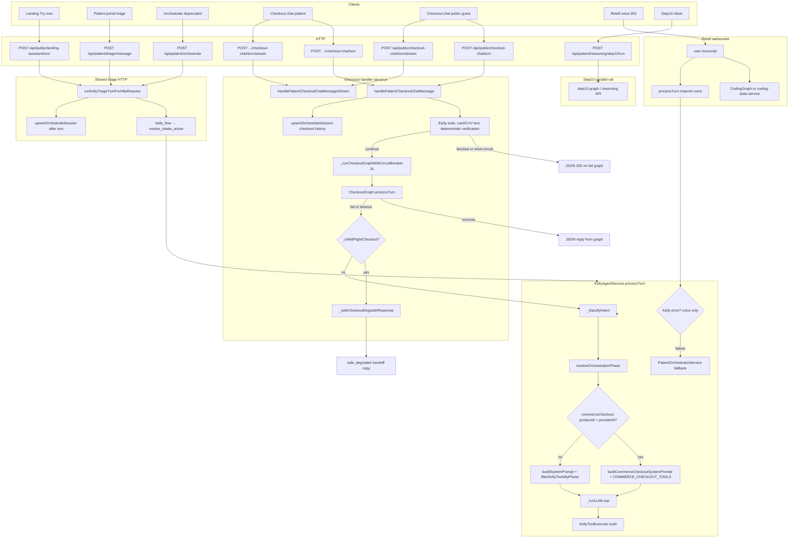
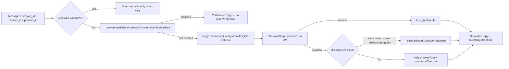
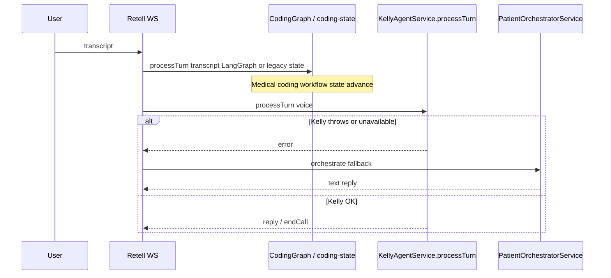
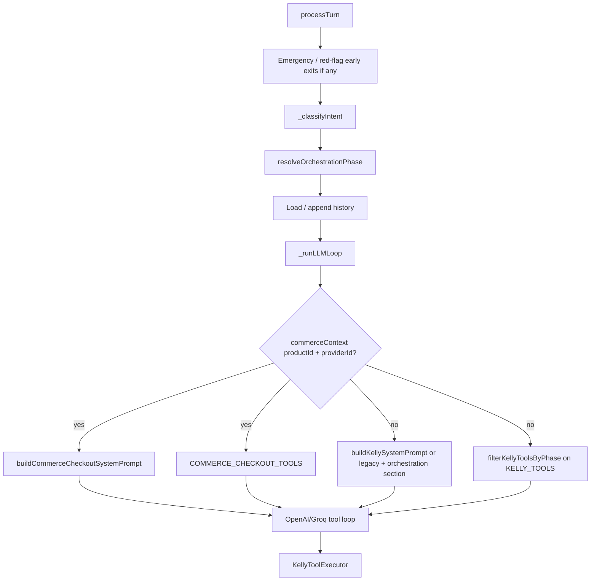

# Kelly phase-scoped prompts & Skin & Care god-object fix

This document explains the **problem**, the **current architecture**, the **target architecture**, and a **checklist** for implementers. It is the working spec for fixing mixed clinical vs consumer behavior on the Little Lab landing assistant and tightening Kelly across phases.

---

## 1. Problem statement

### 1.1 User-visible failure (example transcript)

On the **Skin & Care** landing assistant, users report:

- The assistant **starts** as skincare help but **slides into** clinic triage language: OPQRST-style loops, “route to the right specialist,” **routine / annual visit** framing.
- **“No symptoms”** after the user already described **acne / pimples** is interpreted as **“no medical symptoms for a checkup”** instead of **“no extra systemic symptoms beyond the skin issue.”**
- The model **re-asks** the same questions (onset, “what symptoms”) because answers are **not reliably persisted and injected** back into context.
- **Consumer** expectations collide with **clinical scheduling** copy.

### 1.2 Root cause (technical)

| Layer | What happens today | Why it hurts |
|--------|-------------------|--------------|
| **Tools** | `filterKellyToolsByPhase()` in `kelly-orchestrator-phase.js` **prunes** tools per phase (e.g. no scheduling in triage, narrow set in `ROUTINE_INTAKE`). | The model **cannot** call forbidden tools — good hard boundary. |
| **System prompt** | For the **non-commerce** path, `buildSystemPrompt(context)` in `kelly-agent-service.js` is a **single large instruction block** (~1400+ lines of concerns) sent **regardless of phase**. | The model still **reads** booking / triage / routine-visit objectives and **talks** like that phase even when tools are trimmed → **“god object” agent**. |
| **Commerce path** | When `commerceContext` has `productId` + `providerId`, Kelly uses `buildCommerceCheckoutSystemPrompt` + `COMMERCE_CHECKOUT_TOOLS` — **separate prompt + tools**. | This **already proves** the pattern: **narrow prompt + matching tools** works. |
| **Landing entry** | `POST /api/public/landing-assistant/turn` does **not** send `kelly_flow` from `littlelab-landing` by default. | `routine_intake_active` may never be set → user stays on **default triage** behavior even when the UI says “Skin & Care.” |

**Bottom line:** Phase fixes **tools** but not **instructions**. Fixing only one paragraph (`buildOrchestrationPromptSection`) is insufficient because the **main system prompt** still contains competing jobs.

---

## 2. Terms for the team

| Term | Meaning |
|------|---------|
| **Phase** | Server-computed label: `ROUTINE_INTAKE`, **`ROUTINE_FOLLOWUP`** (post–Skin & Care assessment, consumer mode), `TRIAGE_DISCOVERY`, `TRIAGE_ACTIVE`, `BOOKING`, `APPOINTMENT_CHECKOUT`, `BILLING`. Not a tool call. See `KELLY_ORCHESTRATOR_PHASE` in `services/kelly-orchestrator-phase.js`. |
| **Specialty / department** | Clinical routing output (e.g. dermatology) — often from `run_triage_rag`. **Not** the same as phase. |
| **Lane / job** | Informal: “checkout” vs “triage” vs “skin intake.” May map 1:1 to phase or to `commerceContext`. |
| **Tool** | Callable function the LLM may invoke (`run_triage_rag`, `get_available_slots`, …). Allowed set depends on **phase** (and commerce override). |

---

## 3. Current architecture (as built)

### 3.1 HTTP / WebSocket entry points

| Client | Route | Next step |
|--------|--------|-----------|
| Little Lab landing assistant | `POST /api/public/landing-assistant/turn` | `handlePublicLandingAssistantMessage` → `runKellyTriageTurnForHttpRequest` → `KellyAgentService.processTurn` (`channel: 'chat'`) |
| Patient portal triage | `POST /api/patient/triage/message` | Same `runKellyTriageTurnForHttpRequest` |
| Checkout chat (public / patient) | `POST /api/public|patient/checkout-chat/turn` (+ stream) | `handlePatientCheckoutChatMessage` → often `CheckoutGraph` first, else Kelly with `commerceCheckout` |
| Retell voice | WebSocket `webhooks/retell-websocket.js` | `KellyAgentService.processTurn` (`channel: 'voice'`) |

### 3.2 Intake activation (existing)

- **Chat:** `runKellyTriageTurnForHttpRequest` in `server.js` — if `kelly_flow` / `routine_intake_active` in body or `meta` matches `kellyFlowActivatesRoutineIntake()`, sets `routine_intake_active` on session meta via `KellyToolExecutor._setSessionMeta`.
- **Voice:** `retell-websocket.js` — reads `extractKellyFlowFromRetellCall(callMeta)` and sets the same meta.

Values that activate (see `ROUTINE_INTAKE_KELLY_FLOW_VALUES`): `routine_intake`, `skincare`, `skincare_intake`.

### 3.3 Inside `KellyAgentService.processTurn` (simplified)

1. `_classifyIntent(message)` → `billing` | `routine_booking` | `symptom` | `unknown`.
2. `resolveOrchestrationPhase({ sessionId, message, intentBucket, db, KellyToolExecutor, getLatestRag, routineLocked })` → **phase** + flags.
3. `_runLLMLoop`:
   - If **`commerceContext`** (product + provider): **commerce prompt** + **commerce tools** (phase prune **skipped** for the main tool list).
   - Else: **`KellyPromptBuilder.buildKellySystemPrompt(context, …)`** when `KELLY_PHASE_PROMPTS=1` and orchestration is on (per-phase slice + shared safety + orchestrator block); otherwise **`_buildSystemPromptLegacy`** — plus **`filterKellyToolsByPhase(KELLY_TOOLS, phase, …)`** when `KELLY_ORCHESTRATOR_PHASE` is not disabled.
   - For **`ROUTINE_INTAKE` / `ROUTINE_FOLLOWUP`**: append **`routineIntakeSummaryMarkdown`** (from `formatRoutineIntakeSummaryFromTriageRow` + gap meta) when phase prompts are on; routine tools may use **`mapToolDescriptionsForRoutineIntake`**. Final assistant text passes **`clinical-recommendation-policy`** validation; blocked replies use **`FALLBACK_REPLY_ROUTINE_SKINCARE`** in those two phases (see §4.7).

### 3.4 Tests

- `__tests__/kelly-phase-validation.test.js` — tool allowlists, resolver behavior with mocks, `buildOrchestrationPromptSection` (orchestrator **slice** only, not full system prompt); routine-intake tool override must not use **“call before run_triage_rag”** steering (may mention RAG only to forbid it).
- `__tests__/kelly-prompt-builder.test.js` — phase dispatcher wiring, shared safety, `formatRoutineIntakeSummaryFromTriageRow`, routine slice size ceiling.
- `__tests__/kelly-skincare-assessment.test.js` — deterministic Skin & Care contract (phase resolution, hard/soft gates, tool pruning, negation/escalation, summary fields, orchestration copy, `_storeTriageOpqrst` + meta when DB available); **Block 10** golden transcript with `RUN_KELLY_GOLDEN=1`.
- `__tests__/clinical-recommendation-policy.test.js` — includes skincare fallback branch.
- `__tests__/skincare-intake-gates.test.js`, `__tests__/routine-no-symptoms-guard.test.js` — focused gates / E1-style behavior.

### 3.5 Complete as-built architecture (diagrams + gaps)

This section is the **exhaustive** map of how requests reach Kelly and adjacent systems. Use it when onboarding or debugging cross-cutting behavior (checkout degrade, voice coding spine, deprecated routes).

#### 3.5.1 What is in scope vs out of scope

| In scope here | Out of scope (separate systems) |
|---------------|----------------------------------|
| HTTP routes that call `KellyAgentService.processTurn` or share its triage wrapper | FHIR sync, billing rails, unrelated CRUD APIs |
| `CheckoutGraph` as the pre-Kelly checkout rail | Full payment provider webhooks (see `architecture-kelly-payment.md`) |
| Retell transcript path: coding state + Kelly | Retell agent config in Retell dashboard |
| `Step10` as a **labeled parallel** patient API | LangGraph internals inside Step10 |

#### 3.5.2 HTTP route surface (production Kelly-adjacent)

| Method | Path | Handler chain |
|--------|------|----------------|
| `POST` | `/api/public/landing-assistant/turn` | `handlePublicLandingAssistantMessage` → `runKellyTriageTurnForHttpRequest` → `processTurn` (`chat`) |
| `POST` | `/api/patient/triage/message` | `handlePatientTriageMessage` → same |
| `POST` | `/api/patient/orchestrate` | **Deprecated alias** — same as triage/message |
| `POST` | `/api/patient/checkout-chat/turn` | `handlePatientCheckoutChatMessage` (see §3.5.4) |
| `POST` | `/api/patient/checkout-chat/turn/stream` | `handlePatientCheckoutChatMessageStream` — same logic, SSE |
| `POST` | `/api/public/checkout-chat/turn` | LangSmith trace wrapper → `handlePatientCheckoutChatMessage` (guest: `x-session-id` may be set) |
| `POST` | `/api/public/checkout-chat/turn/stream` | Trace + SSE variant of above |
| `GET` | `/api/public/checkout-chat/stage`, `/invariants`, etc. | **No Kelly** — stage/UI sync |
| WebSocket | `webhooks/retell-websocket.js` | Coding graph + `processTurn` (`voice`) — see §3.5.5 |
| `POST` | `/api/patient/reasoning/step10/run` | **Step10** LangGraph stub — **not** landing / triage Kelly |

Scripts (e.g. `scripts/test-commerce-checkout-agent.js`) also call `processTurn`; omitted from the diagram.

#### 3.5.3 End-to-end flow (all clients)

#### 3.5.4 Checkout path detail (gaps called out)

**Gap labels (behavioral):**

- **G1 — Two brains on checkout:** Graph and Kelly can both own “conversation shape”; only one runs per failed-graph turn, but **success** turns never touch Kelly.
- **G2 — Safe degrade vs Kelly:** Mid-flight users never get a raw Kelly fallback when the graph fails; they get a **handoff** message instead.
- **G3 — Public guest session:** `handlePatientCheckoutChatMessage` always calls `validateSession(sid)`; public routes may set `req.patientSessionId` from `x-session-id`, but **verified portal session** is optional for guest commerce — `mappedPatientId` / `email` are often null while `clinic_id` + `product_id` drive the lane.

#### 3.5.5 Voice path detail (Kelly is not the only spine)

#### 3.5.6 Inside `processTurn` (commerce vs orchestrator)

**Gap labels:**

- **G4 — Prompt/tool mismatch (non-commerce):** Phase prunes **tools** but not the monolithic **system** prompt — documented in §1.2.
- **G5 — Orchestrator off switch:** `KELLY_ORCHESTRATOR_PHASE=0` disables pruning + extra orchestration prompt block (rollback).

#### 3.5.7 Explicit gaps inventory (checklist for reviewers)

| ID | Gap | Where to look |
|----|-----|----------------|
| G1 | Checkout **success** never invokes Kelly | `server.js` `handlePatientCheckoutChatMessage` after `CheckoutGraph.processTurn` |
| G2 | Graph failure + **mid-flight** → **safe degrade**, not Kelly | `_isMidFlightCheckout`, `_safeCheckoutDegradeResponse` |
| G3 | Guest vs portal **identity** on shared checkout handler | `validateSession`, public route `x-session-id` |
| G4 | **God-object prompt** vs phase-pruned tools | `kelly-agent-service.js` `_runLLMLoop` |
| G5 | Orchestrator **feature flag** changes tool + prompt surface | `KELLY_ORCHESTRATOR_PHASE`, `kelly-orchestrator-phase.js` |
| G6 | Voice runs **coding graph** and **Kelly** on same transcript | `retell-websocket.js` |
| G7 | Landing **`kelly_flow`** was historically missing; **now defaulted** for Skin & Care (`landingAssistantApi.js`) — stale clients or bypassed HTTP paths may still omit it |
| G8 | **Step10** is a separate patient reasoning rail | `step10-graph.js`, not `processTurn` |
| G9 | **`/orchestrate`** duplicates triage — easy to forget in docs | `server.js` route alias |

---

## 4. Target architecture (what we are building)

### 4.1 Principle

**Match commerce’s pattern for every non-commerce phase:**  
`shared safety (short) + phase-specific prompt slice + tools already pruned by phase`.

The LLM should **not** receive the full legacy `buildSystemPrompt` when a phase-specific slice exists.

### 4.2 Prompt dispatcher (**shipped:** `services/kelly-prompt-builder.js`)

The module exports:

- **`buildKellySystemPrompt(context)`** — main entry used by `_runLLMLoop` instead of calling `buildSystemPrompt` directly when a feature flag is on.
- **Per-phase builders** (`buildPhasePrompt`):
  - `ROUTINE_INTAKE`, **`ROUTINE_FOLLOWUP`**
  - `TRIAGE_DISCOVERY` / `TRIAGE_ACTIVE`
  - `BOOKING`, `APPOINTMENT_CHECKOUT`, `BILLING`
- **`buildSharedSafetyBlock(context)`** — emergency / crisis / channel rules; kept small; booking-only `return_to_triage` copy stays in the orchestrator section only.

**Rollback:** `KELLY_PHASE_PROMPTS` unset / `0` → dispatcher uses **`_buildSystemPromptLegacy`** for all phases. `KELLY_ORCHESTRATOR_PHASE=0` disables tool pruning + orchestrator injection.

### 4.3 Landing client

- **`littlelab-landing/src/landingAssistantApi.js`**: include **`kelly_flow: 'skincare'`** (or another value in `kellyFlowActivatesRoutineIntake`) on **every** `POST .../landing-assistant/turn` so `ROUTINE_INTAKE` can apply.

### 4.4 Durable intake / triage state

- Persist fields via **`store_triage_opqrst` / `get_triage_session`** and inject **`## INTAKE / TRIAGE SO FAR`** (`formatRoutineIntakeSummaryFromTriageRow`) for **`ROUTINE_INTAKE`** and **`ROUTINE_FOLLOWUP`**, including **Still needed** / **Nice to clarify** when gap metas are set.
- When **five** hard gates pass, **`_syncRoutineSkincareIntakeMeta`** sets **`intake_complete`** and **`skincare_post_intake`** together (resolver then can hold **`ROUTINE_FOLLOWUP`**).

### 4.5 Code guard (not prompt-only)

When **chief complaint / concern / onset** is already stored, **do not** set or honor **`routine_no_symptoms`** / routine-booking framing from that user turn. Prevents the exact **“no symptoms → annual visit”** derail when acne was already stated.

Implement near existing `routine_no_symptoms` handling in `kelly-agent-service.js` / `kelly-tool-executor.js` (grep `routine_no_symptoms`).

### 4.6 Copy rules for `ROUTINE_INTAKE` slice

Explicitly document in the slice:

- Lesions **are** the problem; “any other symptoms” means **systemic / alarm** (fever, rapid spread, severe pain), not “describe pimples again.”
- **Forbidden** while in intake: switching to **annual / routine visit with no symptoms** if a **skin concern** is on file.
- **Forbidden** consumer-unfriendly: “route to specialist” **unless** escalating to clinical triage phase.
- **Question order** in the prompt: **hard** vs **soft** fields aligned with server meta (`skincare_intake_hard_missing_json` / `skincare_intake_gaps_json`) when injected into the summary; see [kelly-god-object-fix-todos.md](./kelly-god-object-fix-todos.md) **Known nuance** — server **`intake_complete`** uses **five** hard gates; **onset** is taught in copy but is **not** in `_skincareHardGateMissingList` until product aligns.

### 4.7 `ROUTINE_FOLLOWUP` and reply guardrails

- **Phase:** After `intake_complete` + `skincare_post_intake` + `routine_intake_active`, resolver holds **`ROUTINE_FOLLOWUP`** so a triage session row without RAG does not drop into **`TRIAGE_ACTIVE`**.
- **Tools:** Same allowlist as **`ROUTINE_INTAKE`** (plus optional `run_derm_patient_qa`); no `run_triage_rag` or scheduling unless patient escalates / asks to book.
- **Orchestrator text:** `buildOrchestrationPromptSection` uses follow-up-specific bullets; it does **not** include the booking-only “new symptoms during booking” line (see tests).
- **Clinical policy:** If `validateAssistantText` fails on the final assistant string, **`fallbackReply(..., { routineSkincare: true })`** replaces the reply for **`ROUTINE_INTAKE`** and **`ROUTINE_FOLLOWUP`** so users do not see the generic triage prompt (“what symptom or concern…”). Implementation: `services/clinical-recommendation-policy.js`, `KellyAgentService._runLLMLoop`.

---

## 5. Relationship to future work (out of scope for v1 doc implementation)

- **SessionRouter** / explicit workflow FSM for SOCRATES steps — optional hardening **after** prompt dispatch works.
- **Unifying CheckoutGraph vs Kelly commerce** — separate initiative; do not block prompt work.
- **Step10 LangGraph** — patient API; not on landing path today.

---

## 6. Environment / rollback

| Variable | Purpose |
|----------|---------|
| `KELLY_ORCHESTRATOR_PHASE=0` | Disables tool pruning + orchestrator prompt injection (existing rollback). |
| `KELLY_PHASE_PROMPTS` | `1` or `true` = all orchestrator phases use narrow slices from `kelly-prompt-builder.js` (shared safety + phase slice + orchestrator block); unset / `0` / `false` = `_buildSystemPromptLegacy` for all phases. See `.env.example`. |

---

## 7. Implementation checklist (todos)

Use this as GitHub issues or project tasks. **Authoritative short copy with totals:** [kelly-god-object-fix-todos.md](./kelly-god-object-fix-todos.md).

**Coupling:** **A1** and **D2** should ship together when possible — activating `ROUTINE_INTAKE` without persistence surfaces re-asks immediately.

### Phase A — Entry & activation

- [x] **A1.** Add `kelly_flow` to `sendLandingAssistantTurn` (default `skincare`; `kellyFlow: null` omits). See `littlelab-landing/src/landingAssistantApi.js`.
- [x] **A2.** Two-turn smoke: `npm run smoke:landing-assistant` in `middleware-platform` (+ optional `DB_PATH` meta assert). See `scripts/smoke-landing-assistant-two-turn.cjs`.
- [x] **A3.** Retell / HTTP values: [retell-kelly-flow.md](./retell-kelly-flow.md).

### Phase B — Prompt dispatch

- [x] **B1.** `services/kelly-prompt-builder.js`: `buildSharedSafetyBlock`, `buildPhasePrompt`, `buildKellySystemPrompt`, `phasePromptsEnabled`.
- [x] **B2.** **Incremental:** `ROUTINE_INTAKE` slice first; **F1–F4** add triage / booking / checkout / billing slices (same `buildPhasePrompt` dispatcher).
- [x] **B3.** `_runLLMLoop` → `KellyPromptBuilder.buildKellySystemPrompt` when not commerce.
- [x] **B4.** Orchestrator block appended after intake slice; overlap reduced (intake defers tool routing to orchestrator).
- [x] **B5.** Runtime uses `_buildSystemPromptLegacy` + builder only.
- [x] **B6.** Safety block excludes `return_to_triage`; booking/triage reopen stays in orchestrator section (see `__tests__/kelly-prompt-builder.test.js`).

### Phase C — ROUTINE_INTAKE slice (Skin & Care priority)

- [x] **C0.** `mapToolDescriptionsForRoutineIntake`; F1–F4 broader tool-description audit still open.
- [x] **C1.** Intake slice + persistence rules in `kelly-prompt-builder.js`.
- [x] **C2.** Jest slice size guard in `kelly-prompt-builder.test.js`.

### Phase D — Persistence & summary injection

- [x] **D1.** [retell-kelly-flow.md](./retell-kelly-flow.md) — `quality`, `onset`, `associated_sx`, optional `medications`.
- [x] **D2.** `get_triage_session` / `store_triage_opqrst` on **`ROUTINE_INTAKE`** and **`ROUTINE_FOLLOWUP`**; summary + gap lines in `_runLLMLoop` (`formatRoutineIntakeSummaryFromTriageRow`, meta `skincare_intake_*_json`).
- [x] **D3.** **`KellyToolExecutor._syncRoutineSkincareIntakeMeta`**; next-phase note in [retell-kelly-flow.md](./retell-kelly-flow.md).

### Phase E — Code guards

- [x] **E1.** If triage/intake row has non-empty concern/onset, block `routine_no_symptoms` meta from this turn’s classification path (`kelly-tool-executor.js`, `kelly-agent-service.js`, `voice-triage-guards.js`).
- [x] **E2.** Regression tests: `__tests__/routine-no-symptoms-guard.test.js` (acne on file + meta `routine_no_symptoms` → `_routineNoSymptomsEffective` false).

### Phase F — Other phases (full god-object removal)

- [x] **F1.** Triage slice(s): `TRIAGE_DISCOVERY` / `TRIAGE_ACTIVE` (`buildTriagePhasePrompt`).
- [x] **F2.** `BOOKING` slice (`buildBookingPhasePrompt`).
- [x] **F3.** `APPOINTMENT_CHECKOUT` slice (`buildAppointmentCheckoutPhasePrompt`).
- [x] **F4.** `BILLING` slice (`buildBillingPhasePrompt`).

### Phase G — Tests & CI

- [x] **G0.** CI green: phase-validation, prompt-builder, and related suites (see §3.4).
- [x] **G1.** Deterministic coverage across validation, builder, skincare-assessment, clinical-policy, gates, routine-no-symptoms tests.
- [x] **G2.** Routine slice size guard (`kelly-prompt-builder.test.js`); further per-phase ceilings optional.
- [x] **G3.** Opt-in LLM golden: `RUN_KELLY_GOLDEN=1` + `kelly-skincare-assessment.test.js` Block 10.

### Phase H — Docs & handoff

- [x] **H1.** This doc + [kelly-god-object-fix-todos.md](./kelly-god-object-fix-todos.md) updated (env vars, paths, `ROUTINE_FOLLOWUP`, summary/gaps, clinical fallback, prompt-vs-server nuance).
- [x] **H2.** `.env.example` updated for `KELLY_PHASE_PROMPTS` / `KELLY_ORCHESTRATOR_PHASE`.

**Count:** Full checklist and totals live in [kelly-god-object-fix-todos.md](./kelly-god-object-fix-todos.md) (includes **D2b**, **G0–G3**, **H1** complete).

---

## 8. File map (quick reference)

| Area | Files |
|------|--------|
| Phases + tool filter + resolver + orchestration text | `services/kelly-orchestrator-phase.js` |
| LLM loop, legacy monolith | `services/kelly-agent-service.js` (`_buildSystemPromptLegacy`) |
| Phase-dispatched prompts | `services/kelly-prompt-builder.js` |
| Tool execution, session meta | `services/kelly-tool-executor.js` |
| Landing HTTP | `server.js` (`runKellyTriageTurnForHttpRequest`, `handlePublicLandingAssistantMessage`) |
| Voice | `webhooks/retell-websocket.js` |
| Landing client API | `unified-dashboard/littlelab-landing/src/landingAssistantApi.js` |
| Baseline + Skin & Care suite | `__tests__/kelly-phase-validation.test.js`, `__tests__/kelly-skincare-assessment.test.js`, `__tests__/kelly-prompt-builder.test.js` |
| Clinical text guardrails | `services/clinical-recommendation-policy.js` |

---

## 9. Success criteria

- Landing Skin & Care with `kelly_flow` set: **no** unsolicited “annual checkup with no symptoms” when user already stated a **skin complaint**.
- **No** repetitive OPQRST-style loops when **stored fields** already contain onset + concern (summary visible to model).
- **ROUTINE_INTAKE** turns use **intake-sized** system text, not full legacy wall (measure token/word count in logs or tests).
- **Rollback:** one env flip restores legacy `buildSystemPrompt` behavior.

---

## Document history

| Date | Note |
|------|------|
| 2026-04-03 | Initial spec: problem, current vs target architecture, implementation checklist for devs. |
| 2026-04-03 | §3.5: complete as-built diagrams (HTTP, checkout, voice, `processTurn`), route table, gaps G1–G9. |
| 2026-04-03 | §7: checklist aligned with kelly-god-object-fix-todos (A2 two-turn, B4/B6, C0, G0, A/D coupling); 27 implementation todos. |
| 2026-04-03 | Phase A done: landing `kelly_flow`, smoke script, [retell-kelly-flow.md](./retell-kelly-flow.md). |
| 2026-04-03 | Phase B: `kelly-prompt-builder.js`, `KELLY_PHASE_PROMPTS`, tests, `.env.example`. |
| 2026-04-03 | Phases C–D: intake tool overrides, persistence tools, prompt summary, `intake_complete` auto. |
| 2026-04-03 | **Doc refresh:** `ROUTINE_FOLLOWUP` in terms table; accurate `processTurn` / `_runLLMLoop` path (`buildKellySystemPrompt`, summary, routine tool maps, clinical skincare fallback); §3.4 test list; §4.6–4.7; G7 landing note; G/H checklist aligned with todos; file map; D3 anchor `_syncRoutineSkincareIntakeMeta`. |
