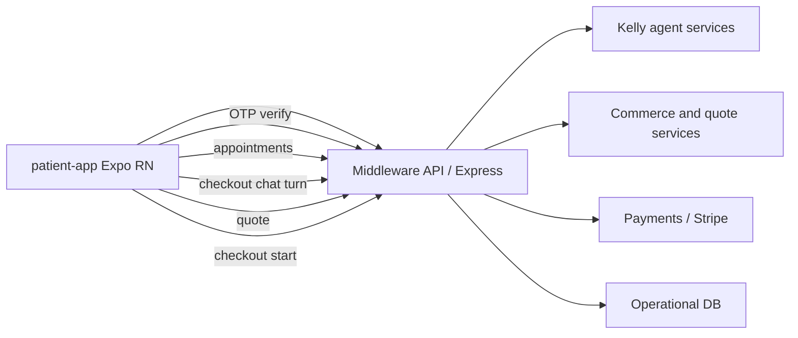
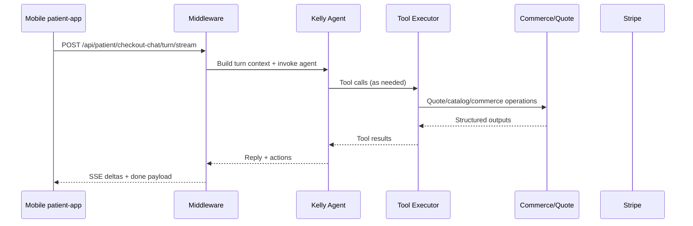

# Patient App Architecture and Agent Orchestration

**Last Updated:** 2026-04-22  
**Scope:** Current `patient-app` (Expo/React Native) architecture and how patient-facing agent flows are orchestrated through middleware.  
**Audience:** Product, mobile, backend, and ops.

---

## 1) Current Mobile Surface (What Exists Today)

The app currently ships three main user-facing flows:

- `app/(tabs)/index.tsx`
  - Email OTP verification
  - Session restore from secure storage
  - Appointment list fetch
  - Video join handoff
- `app/(tabs)/explore.tsx`
  - Entry point to checkout chat modal
- `app/checkout-chat.tsx`
  - Product selection
  - Kelly chat (streaming + non-stream fallback)
  - Quote fetch
  - Stripe checkout start

Current tab shell:

- `Home` (session and appointments)
- `Explore` (checkout chat entry)

---

## 2) Runtime Architecture (Mobile -> Middleware)

Key implementation characteristic:

- The app is thin-client orchestration.
- Business logic, agent tools, and payment workflows execute in middleware.

---

## 3) Session and Identity Model (Current)

Current mobile session model:

- Session ID is persisted in secure storage.
- Auth is OTP-based email verification.
- Session is API-host scoped; if API host changes, session is invalidated.

Current API calls in mobile:

- `POST /api/patient/verify/send`
- `POST /api/patient/verify/confirm`
- `GET /api/patient/appointments` with `x-session-id`

Landing → customer shelf (web / API customer session):

- Implemented: `POST /api/customer/landing/claim-session` (authenticated `customer_session` cookie) and `GET /api/customer/products` for the claimed shelf list. See `BACKEND_ROUTES_AND_TABLES_PATIENT_PORTAL.md` and `PATIENT_JOURNAL_REDESIGN_V1.md`.
- The Expo **patient-app** may not yet call these endpoints; unified-dashboard / landing flows do.

---

## 4) Agent Orchestration (Checkout Chat Path)

The patient app does not run the agent locally. It sends turns to middleware, which orchestrates Kelly and tool execution.

### 4.1 Turn Flow

### 4.2 Fallback Behavior

When streaming path fails:

- Mobile falls back to `POST /api/patient/checkout-chat/turn`.
- UI preserves continuity by inserting assistant fallback response and reusing session context.

### 4.3 Checkout Hand-off

After quote resolution:

- Mobile calls `POST /api/public/checkout/start`.
- Middleware creates checkout session (Stripe-backed path).
- Mobile opens hosted payment URL.

---

## 5) Data Contracts Used by Mobile Agent UX

Primary contract fields used in app:

- `session_id` (Kelly/checkout session continuity)
- `quote_id` (pricing/payment linkage)
- `reply`, `toolsUsed`, optional `redirect_to`
- Product identifiers (`product_id`, `provider_id`)

Client-side resilience patterns:

- retry-aware fetch for catalog
- secure persistence of key IDs (`session_id`, `quote_id`)
- explicit API reachability warnings

---

## 6) Planned Architecture Extension (Journal-First Patient App)

Target IA:

- Journal (List, Calendar, Media, Journey)
- Routine
- Shelf
- Insights
- Wallet
- Floating `+ Scan`

Agent orchestration additions required:

1. Claim bridge from landing anonymous session to customer identity.
2. Conflict-check orchestration on returning scans against shelf + routine.
3. Weekly insights generation endpoint with entitlement-aware depth.

New contracts required:

- `POST /api/customer/landing/claim-session`
- `GET /api/customer/products`
- `GET/POST/PATCH routine endpoints`
- `GET /api/customer/insights/weekly`

---

## 7) Operational Notes

- Keep wallet/claims/session utility cards in `Wallet` tab.
- Keep journal UI emotionally calm; avoid ops-heavy card language on journal surfaces.
- Preserve existing checkout chat behavior during migration to journal-first IA.

---

## 8) Related Docs

- `docs/architecture/CURRENT_STATE_ARCHITECTURE.md`
- `docs/middleware-platform/README.md`
- `docs/voice-agent/README.md`
- `todos/archive/PATIENT_APP_JOURNAL_REDESIGN_V1_COMPLETED_2026-05-31.md`
