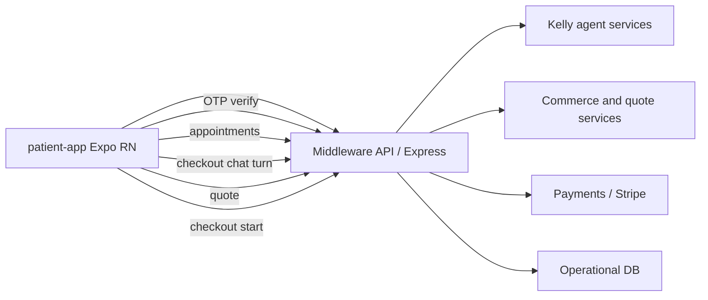
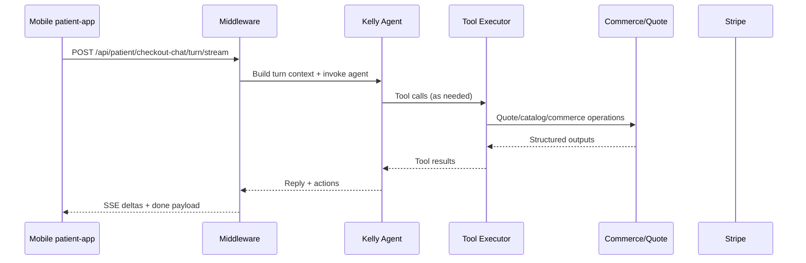
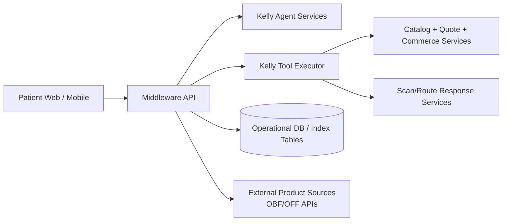
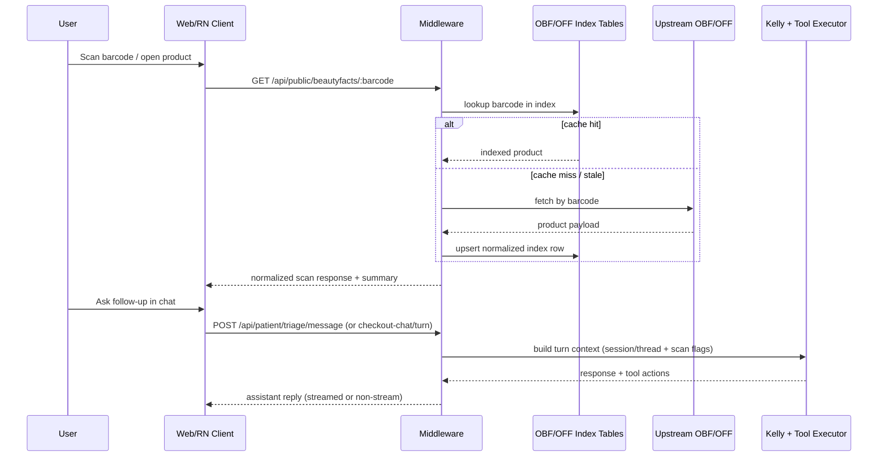

# patient-app - Unified Architecture and System Design
> Last reviewed: 2026-05-25

**Last Updated:** 2026-05-25


**Canonical map:** [CANONICAL_DOC_MAP.md](../meta/CANONICAL_DOC_MAP.md) — read here first to avoid duplicating documentation.

## Existing Documentation Body

This document is the single source of truth for this subfolder. It consolidates architecture, system design, operational behavior, and implementation notes previously split across multiple markdown files.

## Current product direction (routine tracker + billing)

For the active consumer MVP, start here:

- **[`../user-journey/README.md`](../user-journey/README.md)** — pick → **Today** (photo) → Timeline; web parity.
- **[`../architecture/patients/PATIENT_TIMELINE_ROUTINE_AND_BILLING.md`](../architecture/patients/PATIENT_TIMELINE_ROUTINE_AND_BILLING.md)** — **Today** + routine APIs, Timeline / Money / Profile, `calendar-range`, billing.
- [`PATIENT_APP_ARCHITECTURE_AND_AGENT_ORCHESTRATION.md`](./PATIENT_APP_ARCHITECTURE_AND_AGENT_ORCHESTRATION.md)
- [`PATIENT_HOME_SUMMARY_METRICS_V1.md`](./PATIENT_HOME_SUMMARY_METRICS_V1.md)

This architecture defines:

- Tab IA: **Today** (default), Timeline, Money, Profile (+ Account/login tab)
- Center scan/upload FAB
- Money tab as Wallet + Plan merged
- Monetization model: Free + Plus subscription, with unlimited scans on Plus


## Scope


- Folder: `patient-app`
- Consolidated on: 2026-04-29


## Consolidated: BACKEND_ROUTES_AND_TABLES_PATIENT_PORTAL.md


# Backend routes and tables — Patient portal & journal (V1)

**Implementation:** `middleware-platform/routes/signup.js`, `middleware-platform/services/landing-session-claim-service.js` (mounted from `server.js` compose entry)

---

## 1. Patient session

Most routes below use **`requirePatientSession`** and `x-session-id` (or equivalent session cookie, depending on client).

---

## 2. Routine & home

| Method | Path | Notes |
|--------|------|--------|
| GET | `/api/patient/routine/template` | Active template + template items + shelf products. |
| POST | `/api/patient/routine/template` | Creates new active template; deactivates previous. |
| GET | `/api/patient/routine/daily?date=` | Daily entry + item logs + media for date. |
| POST | `/api/patient/routine/daily` | Upsert daily entry and logs. |
| POST | `/api/patient/routine/daily/:id/media-link` | Link document or URL to daily entry. |
| GET | `/api/patient/home/progress-summary` | Home board metrics and cards. |
| GET | `/api/patient/shelf/products` | Shelf rows for routine wizard / Products UI. |
| PATCH | `/api/patient/shelf/products/:productId` | Update inventory fields. |
| POST | `/api/patient/analytics/event` | Whitelist: `home_summary_viewed` (client); other events server-emitted. |
| GET | `/api/patient/health/catalog` | Whether `products_catalog` / OBF / OFF tables exist. |

**Tables (SQLite):** `patient_routine_templates`, `patient_routine_template_items`, `patient_routine_daily_entries`, `patient_routine_daily_item_logs`, `patient_routine_daily_media`, `patient_onboarding_step3_products` (shelf), `patient_portal_events` (analytics).

`ensureRoutineTables()` and `ensurePatientPortalEventsTable()` create/alter routine + event tables as needed.

---

## 3. Customer landing claim & shelf

| Method | Path | Auth |
|--------|------|------|
| POST | `/api/customer/landing/claim-session` | **`requireCustomerAuth`** (`customer_session` cookie). Body: `{ "landing_session_id": "<sid>" }`. |
| GET | `/api/customer/products` | Same — lists claimed `customer_products`. |

**Tables:** `customer_products`, `claim_audit` (see `landing-session-claim-service.js` DDL).

---

## 4. Tests

- `middleware-platform/__tests__/landing-session-claim-service.test.js` — claim idempotency, foreign customer, **claim → listCustomerProducts**.  
- `middleware-platform/__tests__/claim-session-http.test.js` — **401** without `customer_session` on `POST /api/customer/landing/claim-session`.

---

## 5. Related docs

- `PATIENT_JOURNAL_REDESIGN_V1.md`  
- `PATIENT_APP_ARCHITECTURE_AND_AGENT_ORCHESTRATION.md`


## Consolidated: MONTH1_SAFE_LAUNCH_RUNBOOK.md


# Month-1 Safe Launch Runbook

This runbook enables the patient portal "monitoring month" mode where wallet/payment and patient chat are hard-disabled.

## Required Environment Flags

- `FEATURE_PATIENT_WALLET_ENABLED=0`
- `FEATURE_PATIENT_CHAT_ENABLED=0`

These default to disabled when unset, but set them explicitly in deploy config for clarity.

## Smoke Test Commands

Run after deploy against the target environment (`API_BASE` and `SESSION_ID` required):

```bash
API_BASE="https://api.example.com" SESSION_ID="patient-session-id" \
curl -sS -H "x-session-id: $SESSION_ID" "$API_BASE/api/patient/features"
```

Expected:
- `features.wallet_enabled === false`
- `features.chat_enabled === false`

Wallet endpoints (all should return `503` + `"Wallet is temporarily disabled"`):

```bash
curl -sS -X POST -H "Content-Type: application/json" -H "x-session-id: $SESSION_ID" \
  "$API_BASE/api/patient/wallet/deposit" -d '{"amount":10,"method":"test"}'
curl -sS -H "x-session-id: $SESSION_ID" "$API_BASE/api/patient/wallet/transactions"
curl -sS -X POST -H "Content-Type: application/json" -H "x-session-id: $SESSION_ID" \
  "$API_BASE/api/patient/wallet/pay-claim" -d '{"claimId":"demo-claim"}'
```

Chat endpoints (both should return `503` + `"Chat is temporarily disabled"`):

```bash
curl -sS -X POST -H "Content-Type: application/json" -H "x-session-id: $SESSION_ID" \
  "$API_BASE/api/patient/triage/message" -d '{"message":"hello"}'
curl -sS -H "x-session-id: $SESSION_ID" "$API_BASE/api/patient/triage/history?session_id=test"
```

UI checks:
- Patient bottom tabs do not show Wallet.
- `book.html` does not show "Book with guided chat".
- `triage.html` redirects to booking when chat is disabled.
- `appointments.html` shows "Billing is paused during monitoring month." instead of Pay now.

## Rollback Steps

If month-1 mode must be lifted:

1. Set:
   - `FEATURE_PATIENT_WALLET_ENABLED=1`
   - `FEATURE_PATIENT_CHAT_ENABLED=1`
2. Redeploy middleware.
3. Re-run the smoke test commands above and verify endpoints no longer return `503`.
4. Verify patient UI surfaces return:
   - wallet tab visible,
   - guided chat visible,
   - triage route reachable.


## Consolidated: PATIENT_APP_ARCHITECTURE_AND_AGENT_ORCHESTRATION.md


# Patient App Architecture and Agent Orchestration

**Scope:** Current `patient-app` (Expo/React Native) architecture and how patient-facing agent flows are orchestrated through middleware.  
**Audience:** Product, mobile, backend, and ops.

---

## 1) Current Mobile Surface (What Exists Today)

The app currently ships three main user-facing flows:

- `app/(tabs)/index.tsx`
  - Email OTP verification
  - Session restore from secure storage
  - Appointment list fetch
  - Video join handoff
- `app/(tabs)/explore.tsx`
  - Entry point to checkout chat modal
- `app/checkout-chat.tsx`
  - Product selection
  - Kelly chat (streaming + non-stream fallback)
  - Quote fetch
  - Stripe checkout start

Current tab shell:

- `Home` (session and appointments)
- `Explore` (checkout chat entry)

---

## 2) Runtime Architecture (Mobile -> Middleware)



Key implementation characteristic:

- The app is thin-client orchestration.
- Business logic, agent tools, and payment workflows execute in middleware.

---

## 3) Session and Identity Model (Current)

Current mobile session model:

- Session ID is persisted in secure storage.
- Auth is OTP-based email verification.
- Session is API-host scoped; if API host changes, session is invalidated.

Current API calls in mobile:

- `POST /api/patient/verify/send`
- `POST /api/patient/verify/confirm`
- `GET /api/patient/appointments` with `x-session-id`

Landing → customer shelf (web / API customer session):

- Implemented: `POST /api/customer/landing/claim-session` (authenticated `customer_session` cookie) and `GET /api/customer/products` for the claimed shelf list. See `BACKEND_ROUTES_AND_TABLES_PATIENT_PORTAL.md` and `PATIENT_JOURNAL_REDESIGN_V1.md`.
- The Expo **patient-app** may not yet call these endpoints; unified-dashboard / landing flows do.

---

## 4) Agent Orchestration (Checkout Chat Path)

The patient app does not run the agent locally. It sends turns to middleware, which orchestrates Kelly and tool execution.

### 4.1 Turn Flow



### 4.2 Fallback Behavior

When streaming path fails:

- Mobile falls back to `POST /api/patient/checkout-chat/turn`.
- UI preserves continuity by inserting assistant fallback response and reusing session context.

### 4.3 Checkout Hand-off

After quote resolution:

- Mobile calls `POST /api/public/checkout/start`.
- Middleware creates checkout session (Stripe-backed path).
- Mobile opens hosted payment URL.

---

## 5) Data Contracts Used by Mobile Agent UX

Primary contract fields used in app:

- `session_id` (Kelly/checkout session continuity)
- `quote_id` (pricing/payment linkage)
- `reply`, `toolsUsed`, optional `redirect_to`
- Product identifiers (`product_id`, `provider_id`)

Client-side resilience patterns:

- retry-aware fetch for catalog
- secure persistence of key IDs (`session_id`, `quote_id`)
- explicit API reachability warnings

---

## 6) Planned Architecture Extension (Journal-First Patient App)

Target IA:

- Journal (List, Calendar, Media, Journey)
- Routine
- Shelf
- Insights
- Wallet
- Floating `+ Scan`

Agent orchestration additions required:

1. Claim bridge from landing anonymous session to customer identity.
2. Conflict-check orchestration on returning scans against shelf + routine.
3. Weekly insights generation endpoint with entitlement-aware depth.

New contracts required:

- `POST /api/customer/landing/claim-session`
- `GET /api/customer/products`
- `GET/POST/PATCH routine endpoints`
- `GET /api/customer/insights/weekly`

---

## 7) Operational Notes

- Keep wallet/claims/session utility cards in `Wallet` tab.
- Keep journal UI emotionally calm; avoid ops-heavy card language on journal surfaces.
- Preserve existing checkout chat behavior during migration to journal-first IA.

---

## 8) Related Docs

- [`docs/architecture/patients/PATIENT_TIMELINE_ROUTINE_AND_BILLING.md`](../architecture/patients/PATIENT_TIMELINE_ROUTINE_AND_BILLING.md)
- `docs/middleware-platform/README.md`
- `docs/voice-agent/README.md`
- `todos/archive/PATIENT_APP_JOURNAL_REDESIGN_V1_COMPLETED_2026-05-31.md` (V1 complete; optional follow-ups in product backlog)


## Consolidated: PATIENT_DAILY_LOG_AND_MEDIA_MODEL_V1.md


# Daily Log and Media Model — V1


---

## 1. Entities

- **Daily entry** (`patient_routine_daily_entries`): one row per `(template_id, entry_date)` with `skin_report` (JSON), `notes`, `completion_score` (0–100 from item logs).  
- **Item logs** (`patient_routine_daily_item_logs`): per `daily_entry_id` + `template_item_id`, `completed`, optional `notes`.  
- **Media** (`patient_routine_daily_media`): `media_type`, `patient_document_id` and/or `media_url`, linked to `daily_entry_id`.

---

## 2. API

| Method | Path | Purpose |
|--------|------|---------|
| GET | `/api/patient/routine/daily?date=YYYY-MM-DD` | Resolve active template; return `daily_entry` + `item_logs` + `media` for that date. |
| POST | `/api/patient/routine/daily` | Upsert daily entry; replace item logs; recompute `completion_score`. |
| POST | `/api/patient/routine/daily/:id/media-link` | Attach uploaded document or URL to the entry. |

---

## 3. Skin report JSON

Structured object (version field + redness / oiliness / breakouts / detail). Legacy plain text is wrapped as `{ legacy_text }` for parsing.

---

## 4. UI behavior (Routine page)

- Checklists grouped by **Morning**, **Morning & evening** (single checkbox counts for the day), **Evening**, **Weekly / other** based on `usage_time`.  
- Save persists journal then refreshes GET.  
- Photo: ensure entry exists (save if needed) → `POST /api/patient/documents` → media-link per returned document id.

---

## 5. Analytics (server)

On successful POST daily: `daily_log_saved`; if `completion_score >= 100`, also `routine_completed_day`.  
On successful media-link: `picture_of_day_linked`.  
See `patient_portal_events` in `BACKEND_ROUTES_AND_TABLES_PATIENT_PORTAL.md`.


## Consolidated: PATIENT_HOME_SUMMARY_METRICS_V1.md


# Home Summary Metrics — V1

**UI:** `unified-dashboard/patients/patient-dashboard.html`  
**API:** `GET /api/patient/home/progress-summary`

---

## 1. Purpose

Drive the **routine-first** home board: top-line stats, weekly cards, and empty states — all derived from **routine template + daily entries** (not wallet or generic placeholders).

---

## 2. Response shape (conceptual)

- `has_template` — whether an active template exists.  
- `summary` — aggregates such as `adherence_pct` (rolling window), `upcoming`, `in_progress`, `total_tasks`, etc.  
- `cards` — array of card objects (`title`, `subtitle`, `progress_pct`, `date_label`, …) for list/grid rendering.

When `has_template` is false, the UI shows a **new-user** empty state and hides the compact scan FAB until a template exists.

---

## 3. Client analytics

After a **successful** progress summary load, the portal may call:

`POST /api/patient/analytics/event` with body `{ "event": "home_summary_viewed" }` (session header/cookie as for other patient APIs).

Server also records template/daily/media events on the corresponding POST routes (see backend routes doc).

---

## 4. Reliability

- Failed summary load: inline error / retry affordance on Home.  
- Catalog index health (optional banner): `GET /api/patient/health/catalog` for product search readiness.

---

## 5. Related

- `PATIENT_JOURNAL_REDESIGN_V1.md`  
- `BACKEND_ROUTES_AND_TABLES_PATIENT_PORTAL.md`


## Consolidated: PATIENT_JOURNAL_REDESIGN_V1.md


# Patient Journal Redesign — V1

**Scope:** Unified web patient portal (`unified-dashboard/patients/*`) journal: template → daily log → media → home summary.  
**Out of scope for V1:** Rebuilding telemedicine, OAuth/password auth, wallet-first home.

---

## 1. Product intent

V1 delivers a **skincare routine journal** that is separate from **telehealth booking**:

| Surface | Role |
|--------|------|
| **Routine** (`appointments.html`) | Create/edit routine template; daily AM/PM checklist; skin report + notes; picture-of-the-day. |
| **Home** (`patient-dashboard.html`) | Routine-first board: progress summary, cards, conditional scan FAB. |
| **Calendar** (`schedule.html`) | Book visits; see visit vs routine-day markers; conflict hints — not the daily journal. |
| **Products** (`my-records.html`) | Shelf inventory, visit summaries, documents. |

Information architecture: **Home / Calendar / Products / Routine / More** (tabs + side nav aligned).

---

## 2. User journeys

1. **Onboarding** completes Step 3 product baseline (catalog-first + custom fallback).  
2. **Routine:** Guided wizard (name → products → AM/PM → duration → review) saves `POST /api/patient/routine/template`.  
3. **Daily log:** Date picker, checklists by usage bucket, skin fields, notes, `POST /api/patient/routine/daily`.  
4. **Picture:** Upload document → `POST /api/patient/routine/daily/:id/media-link`.  
5. **Home:** `GET /api/patient/home/progress-summary` drives stats and cards; optional `POST /api/patient/analytics/event` with `home_summary_viewed`.  
6. **Landing → customer shelf:** After customer OTP/session, `POST /api/customer/landing/claim-session` with `landing_session_id`; shelf read via `GET /api/customer/products`.

---

## 3. Non-goals (V1)

- Replacing FHIR encounter reads for appointments.  
- Symptom/condition tracker categories (future).  
- Push reminders (future).

---

## 4. References

- `PATIENT_ROUTINE_TEMPLATE_FLOW_V1.md`  
- `PATIENT_DAILY_LOG_AND_MEDIA_MODEL_V1.md`  
- `PATIENT_HOME_SUMMARY_METRICS_V1.md`  
- `BACKEND_ROUTES_AND_TABLES_PATIENT_PORTAL.md`  
- `PATIENT_APP_ARCHITECTURE_AND_AGENT_ORCHESTRATION.md` (mobile + agents)


## Consolidated: PATIENT_ROUTINE_TEMPLATE_FLOW_V1.md


# Routine Template Flow — V1

**UI:** `unified-dashboard/patients/appointments.html` (Routine page)

---

## 1. Data model

- **Template** (`patient_routine_templates`): `name`, `start_date`, `duration_days`, `repeat_cadence` (`daily` | `selected_days`), `repeat_days_of_week_json`, `session_id`, `patient_id`, `is_active`.  
- **Items** (`patient_routine_template_items`): `product_name`, `product_brand`, `usage_time`, `frequency_rule`, `days_of_week_json`, `goal`, `step_order`, linkage to shelf/onboarding products via `source_type` / `source_ref_id`.

---

## 2. API

| Method | Path | Purpose |
|--------|------|---------|
| GET | `/api/patient/routine/template` | Active template + shelf products for picker. |
| POST | `/api/patient/routine/template` | Deactivates prior template; inserts new template + items. |

Validation highlights: at least one item; `start_date` ISO; if `selected_days`, at least one weekday in `repeat_days_of_week`.

---

## 3. UX flow (wizard)

1. **Name** — default “My routine”.  
2. **Products** — multi-select from shelf rows (initials/color badges).  
3. **AM / PM** — maps to `usage_time` on items.  
4. **Duration** — `duration_days` + `start_date`.  
5. **Repeat** — daily or selected weekdays (`repeat_cadence` + `repeat_days_of_week`).  
6. **Review** — POST payload; success toast; scroll to daily journal.

---

## 4. Cadence semantics

- **Daily:** every in-window calendar day is a routine day (used for Calendar purple dots).  
- **Selected days:** only matching weekday keys (`mon` … `sun`) inside `[start_date, start_date + duration_days - 1]`.

---

## 5. Related

- Daily persistence: `PATIENT_DAILY_LOG_AND_MEDIA_MODEL_V1.md`  
- Home metrics: `PATIENT_HOME_SUMMARY_METRICS_V1.md`


## Consolidated: SCAN_CHAT_ORCHESTRATION_CURRENT_STATE.md


# Scan + Chat Orchestration (Current State)

**Status:** Draft from codebase audit (current implementation, not target-state design)  
**Scope:** How scan lookup, patient chat, and agent/tool orchestration currently work across web/mobile surfaces.

---

## 1) What Exists Today

The platform already supports:

- Barcode/product scan lookup with cache-first + upstream fallback.
- Patient chat and checkout-chat endpoints backed by middleware orchestration.
- Session/thread context carryover that can preserve scan context in later turns.
- Agent execution in middleware (not on-device in RN/web clients).

Current orchestration is backend-centric: clients send events/turns; middleware resolves context, runs agent/tools, and returns/streams responses.

---

## 2) High-Level Runtime Architecture



---

## 3) Endpoint Surface (Observed)

### 3.1 Chat / Agent Turn Endpoints

- `POST /api/patient/checkout-chat/turn`
- `POST /api/patient/checkout-chat/turn/stream` (SSE token deltas)
- `POST /api/patient/triage/message`
- `POST /api/public/landing-assistant/turn` (anonymous landing assistant path)

### 3.2 Scan / Product Lookup Endpoints

- `GET /api/public/beautyfacts/:barcode`
- `GET /api/public/foodfacts/:barcode`

Behavior (current):

1. Try index cache (`products_obf_index` / `products_off_index`).
2. Fallback to upstream APIs when cache miss/stale/unavailable.
3. Return normalized payload + scan quality/summary metadata.

---

## 4) Sequence: Scan -> Context -> Chat



---

## 5) Session + State Orchestration (Current)

- Patient routes use `x-session-id` and patient-session middleware for auth continuity.
- Landing assistant and patient chat both run through middleware orchestration with per-session state.
- Server-side metadata/flags support scan-aware flows (for example, scan-chat mode context).
- Chat/scan context can be threaded so later turns reference prior scan payloads.

---

## 6) Data Layer Relevant to Scan + Chat

### 6.1 Product Index Tables

Observed schema patterns for OBF/OFF index:

- `ingredients_text` (raw/free-form string)
- `ingredients_tags_json` (JSON array string)
- `ingredients_analysis_tags_json` (JSON array string)

Important note:

- Current index is **partially structured**; it does not yet store a rich ingredient-object JSON array in index rows.

### 6.2 Normalization in Ingestion

Current normalizer (`obf-normalize-record.cjs`) primarily:

- maps and sanitizes top-level fields,
- converts tag fields to arrays,
- stores ingredient text + tag arrays,
- does not perform deep ingredient canonicalization/entity enrichment.

---

## 7) Mobile App Orchestration (Current)

Documented in `PATIENT_APP_ARCHITECTURE_AND_AGENT_ORCHESTRATION.md`:

- RN app is a thin orchestration client.
- Agent execution remains in middleware.
- Streaming and fallback non-stream turn endpoints are both used.
- Checkout handoff to payment remains backend-orchestrated.

---

## 8) What Is Documented vs Missing

## Documented

- Overall mobile + agent architecture.
- Broad platform architecture and checkout sequence.
- Core patient portal route inventory.

## Missing (single-source spec gap)

No single canonical document yet defines:

- exact scan-context event schema and lifecycle,
- guaranteed handoff contract from scan response -> chat context,
- grounding/evidence rules for scan-derived assistant answers,
- state ownership boundaries (landing anonymous thread vs authenticated patient thread),
- replay/idempotency expectations for scan+chat continuity.

---

## 9) Current Risks / Gaps for Product-Education UX

- Ingredient data is not fully canonicalized for education-grade explanations.
- Scan context grounding exists, but contract-level guarantees are not centralized.
- Similarity/recommendation logic is not yet formalized as a stable enrichment contract.
- Community-layer features (ratings, skin-type-tagged comments) are not part of current core pipeline contract.

---

## 10) Related Documents

- `docs/patient-app/PATIENT_APP_ARCHITECTURE_AND_AGENT_ORCHESTRATION.md`
- [`docs/architecture/patients/PATIENT_TIMELINE_ROUTINE_AND_BILLING.md`](../architecture/patients/PATIENT_TIMELINE_ROUTINE_AND_BILLING.md)
- `docs/patient-app/BACKEND_ROUTES_AND_TABLES_PATIENT_PORTAL.md`
