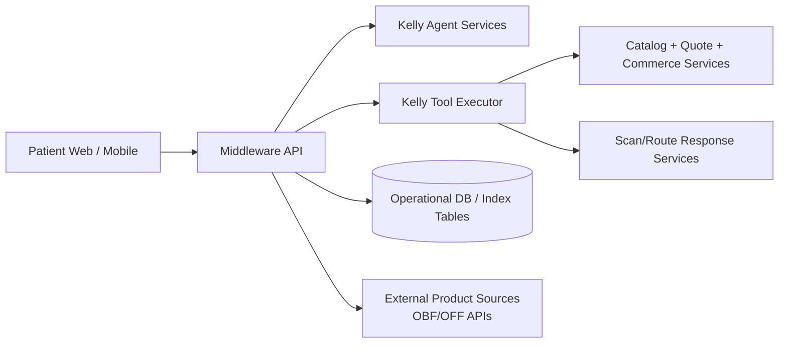
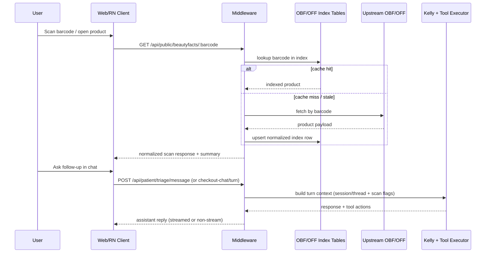

# Scan + Chat Orchestration (Current State)

**Last Updated:** 2026-04-23  
**Status:** Draft from codebase audit (current implementation, not target-state design)  
**Scope:** How scan lookup, patient chat, and agent/tool orchestration currently work across web/mobile surfaces.

---

## 1) What Exists Today

The platform already supports:

- Barcode/product scan lookup with cache-first + upstream fallback.
- Patient chat and checkout-chat endpoints backed by middleware orchestration.
- Session/thread context carryover that can preserve scan context in later turns.
- Agent execution in middleware (not on-device in RN/web clients).

Current orchestration is backend-centric: clients send events/turns; middleware resolves context, runs agent/tools, and returns/streams responses.

---

## 2) High-Level Runtime Architecture

---

## 3) Endpoint Surface (Observed)

### 3.1 Chat / Agent Turn Endpoints

- `POST /api/patient/checkout-chat/turn`
- `POST /api/patient/checkout-chat/turn/stream` (SSE token deltas)
- `POST /api/patient/triage/message`
- `POST /api/public/landing-assistant/turn` (anonymous landing assistant path)

### 3.2 Scan / Product Lookup Endpoints

- `GET /api/public/beautyfacts/:barcode`
- `GET /api/public/foodfacts/:barcode`

Behavior (current):

1. Try index cache (`products_obf_index` / `products_off_index`).
2. Fallback to upstream APIs when cache miss/stale/unavailable.
3. Return normalized payload + scan quality/summary metadata.

---

## 4) Sequence: Scan -> Context -> Chat

---

## 5) Session + State Orchestration (Current)

- Patient routes use `x-session-id` and patient-session middleware for auth continuity.
- Landing assistant and patient chat both run through middleware orchestration with per-session state.
- Server-side metadata/flags support scan-aware flows (for example, scan-chat mode context).
- Chat/scan context can be threaded so later turns reference prior scan payloads.

---

## 6) Data Layer Relevant to Scan + Chat

### 6.1 Product Index Tables

Observed schema patterns for OBF/OFF index:

- `ingredients_text` (raw/free-form string)
- `ingredients_tags_json` (JSON array string)
- `ingredients_analysis_tags_json` (JSON array string)

Important note:

- Current index is **partially structured**; it does not yet store a rich ingredient-object JSON array in index rows.

### 6.2 Normalization in Ingestion

Current normalizer (`obf-normalize-record.cjs`) primarily:

- maps and sanitizes top-level fields,
- converts tag fields to arrays,
- stores ingredient text + tag arrays,
- does not perform deep ingredient canonicalization/entity enrichment.

---

## 7) Mobile App Orchestration (Current)

Documented in `PATIENT_APP_ARCHITECTURE_AND_AGENT_ORCHESTRATION.md`:

- RN app is a thin orchestration client.
- Agent execution remains in middleware.
- Streaming and fallback non-stream turn endpoints are both used.
- Checkout handoff to payment remains backend-orchestrated.

---

## 8) What Is Documented vs Missing

## Documented

- Overall mobile + agent architecture.
- Broad platform architecture and checkout sequence.
- Core patient portal route inventory.

## Missing (single-source spec gap)

No single canonical document yet defines:

- exact scan-context event schema and lifecycle,
- guaranteed handoff contract from scan response -> chat context,
- grounding/evidence rules for scan-derived assistant answers,
- state ownership boundaries (landing anonymous thread vs authenticated patient thread),
- replay/idempotency expectations for scan+chat continuity.

---

## 9) Current Risks / Gaps for Product-Education UX

- Ingredient data is not fully canonicalized for education-grade explanations.
- Scan context grounding exists, but contract-level guarantees are not centralized.
- Similarity/recommendation logic is not yet formalized as a stable enrichment contract.
- Community-layer features (ratings, skin-type-tagged comments) are not part of current core pipeline contract.

---

## 10) Related Documents

- `docs/patient-app/PATIENT_APP_ARCHITECTURE_AND_AGENT_ORCHESTRATION.md`
- `docs/architecture/CURRENT_STATE_ARCHITECTURE.md`
- `docs/patient-app/BACKEND_ROUTES_AND_TABLES_PATIENT_PORTAL.md`

