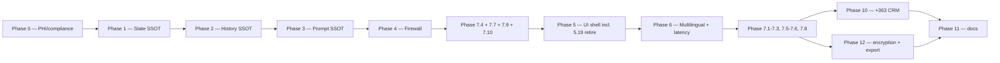

# CURSOR PRODUCTION PLAN — Somo / Kelly (Full Platform)

**Scope: FULL PLATFORM, provider-facing.** Every Kelly tenant vertical (dental, dermatology, healthcare_clinic, small_business), every supported language (EN/ES/RU/ZH), and the admin CRM / platform sales (+363) line. The legacy Skin & Care patient portal is retired (Gate G4) and the Somo Health consumer product is deferred (Phase 9) — both are direct-to-patient consumer surfaces, out of scope while the focus is the B2B provider product. HIPAA-safe handling throughout. Nothing here is demo-scoped.

Paste this whole file into Cursor's Plan feature as the plan source. It supersedes all prior drafts (`somo-monday-demo-remediation-plan.md`, `somo-backlog.csv`, and earlier versions of this file) — this is the single execution track. It is written so an agent can execute it unattended, phase by phase, without skipping verification.

**Repo paths:** [`docs/plans/somo-backlog.csv`](./somo-backlog.csv) (CSV crosswalk) · [`PRODUCTION_PLAN_LOG.md`](../../PRODUCTION_PLAN_LOG.md) (execution audit trail)

---

## Task manifest

| Scope | Phases | Task count |
|-------|--------|------------|
| **Active execution** | 0, 1, 2, 3, 4, 5, 6, 7, 10, 11, 12 | **105** (0.0–0.6, 1.1–1.13, 2.1–2.5, 3.1–3.15, 4.1–4.10, 5.1–5.20 except 5.17 deferred, 6.1–6.12, 7.1–7.10, 10.1–10.6, 11.1–11.5, 12.1–12.3) |
| **Deferred** | 9 | 5 (9.1–9.5 — Somo Health consumer product) |
| **Deferred with Phase 9** | 5.17 | health-video Firebase rewrite (consumer SPA) |
| **Acceptance** | Final test | 17 steps (step 14 N/A; step 16 = G4 retirement) |

---

## AGENT EXECUTION RULES (non-negotiable — read before every task)

1. **Strict phase order.** Do not start Phase N+1 until every task in Phase N has passed its verification step. The order is load-bearing: later phases assume earlier ones are actually fixed, not just attempted.
2. **Verification = proof, not belief.** A task is only "done" when you can show command output, a test result, a live-call log, or a direct DB/Stripe inspection. "Looks fixed" or "should work now" does not close a task. If verification requires a live call, a real DB query, or a manual step you cannot run yourself, STOP and report exactly what needs to be run and what output would count as pass/fail.
3. **Log every completed task** to `PRODUCTION_PLAN_LOG.md` at the repo root (create if missing): task ID, files touched, verification output, timestamp. This is the audit trail — do not skip it even for small tasks.
4. **Stop and ask only on unresolved decisions.** G1, G3, and G4 are resolved; G5 is moot (Phase 9 deferred). G2 uses an interim 90-day placeholder — do not treat it as counsel-approved policy. Any *new* fork not covered below is a STOP, not a guess.
5. **Minimal diffs.** Stay within the stated file scope for a task unless the fix genuinely requires touching something else — if it does, say so before proceeding and document why in the log.
6. **Phase 0 (PHI/compliance) is non-negotiable.** Do not defer, stub, or "TODO" anything in Phase 0 even if it looks lower-priority than feature work.

---

## DECISION GATES — status

| Gate | Status | Resolution |
|---|---|---|
| **G1 — State SSOT** | ✅ Resolved | `kelly_rails_session_projection` is authoritative; `kelly_session_meta_kv` is a deprecated write path being retired |
| **G2 — Retention values** | ⚠️ Interim placeholder | Check `retention-policy.js` for existing values. No counsel-signed number yet for `triage_sessions` / `kelly_conversation_history` raw logs. **Interim placeholder while awaiting counsel: 90 days**, explicitly flagged in code as `// TODO: confirm retention period with counsel — placeholder value` so it can't be mistaken for a signed-off policy. Do not remove the TODO marker until the user confirms a real number. **Phase 0.5 may proceed with this placeholder.**
| **G3 — Notifications panel fate** | ✅ Default applies | Grep for `toggleNotification` backend wiring; delete if unwired |
| **G4 — Skin & Care patient portal fate** | ✅ Resolved: **Path A — retire** | Provider-only focus for now. Retire the 16 legacy patient pages + `checkout-chat.html`: remove from hosting build, redirect to a neutral/marketing page (not a 404), update `KELLY_FRONT_DESK_UX.md` and the inventory matrix so docs stop claiming "deferred" while pages are live. This is a deferral of the consumer product, not a permanent decision — if a patient-facing product is built later, it will likely be a fresh build (OPQRST-agent+report or chat, per the discussion below) rather than a resurrection of Skin & Care. |
| **G5 — Somo Health i18n** | N/A — moot | Phase 9 (Somo Health) itself is deferred under the provider-only scope decision below; i18n inside it isn't a live question until Phase 9 is reactivated |

**Scope note (provider-only focus, decided in this session):** Kelly (the B2B voice agent that talks to a practice's patients on the phone) stays fully in scope — that's the actual product being sold to practices like Dentrix. What's being deferred is *consumer-facing, direct-to-patient* surfaces: the legacy Skin & Care patient portal (retired per G4) and the Somo Health consumer product (Phase 9, deferred below). If/when a standalone patient-facing product gets built later, the two live options are a structured OPQRST-agent-plus-report tool (good for producing a clinical artifact) or an open-ended video/audio chat companion (good for education, carries more liability surface) — Somo Health is already the second one; nothing forces a choice until that phase gets reactivated.

---

## GLOBAL DEFINITION OF PRODUCTION-READY

The whole plan is complete only when ALL of the following are true, proven live — not in theory:

1. A brand-new tenant can go **invite/signup → email verify → voice-setup (all 7 steps, including language) → live line**, with zero manual DB intervention.
2. Every setting a tenant changes in the portal (**greeting, prompt, language, transfer number, hours**) takes effect on the **very next call** — not the old default.
3. A real PSTN call is answered correctly, in the tenant's configured language, with the tenant's actual identity (not a generic default).
4. **Booking, cancellation, and copay quoting** work correctly in **English, Spanish, Russian, and Mandarin**, verified via the automated multilang harness at full pass, not 14/16.
5. **Payment** (SMS link → pay → webhook → success page → portal reflects it) works with **zero PHI in logs, zero PHI in Stripe metadata, and a working success page**.
6. Every tool call, from every entry point (node-runner, direct executor calls, Retell replay), is bound by the mode/subrail firewall — no bypass path exists.
7. There is exactly **one authoritative session-state store**, **one conversation-history store**, and **one prompt authority** — verified by code search, not by belief.
8. There is exactly **one UI shell pattern** used by every provider-facing page.
9. HIPAA logging, retention, and PHI handling pass the Phase 0 checklist — required for production, not optional polish.
10. A full live PSTN + portal + payment smoke test suite passes on a real (not simulated) tenant **of every vertical**, and is repeatable/automatable for every future release.
11. **Every tenant vertical works, not just dental** — dermatology's full OPQRST + RAG + HITL path, healthcare_clinic's admin path, and small_business's path are all production-verified.
12. **Mandarin is a real supported language**, not handoff-only.
13. **Somo Health (consumer product)** — deferred out of active scope per the provider-only focus decision (see Decision Gates); not required for this plan to be considered complete. Revisit as a separate initiative when patient-facing product work is prioritized.
14. **Admin CRM + platform sales (+363)** is deployed and live-verified, not just code-complete and Jest-tested locally.
15. **The legacy Skin & Care patient portal is retired** (Gate G4, Path A) — pages removed from the hosting build, redirects in place, docs corrected to match reality.

---

## CURRENT VS. TARGET ARCHITECTURE

```mermaid
flowchart TB
  subgraph today [Current — fragmented]
    P1[voice-prompt-templates.js]
    P2[prompt_profiles DB — wins, but not synced everywhere]
    P3[Retell general_prompt — Kelly Rails ignores it]
    S1[kelly_rails_session_projection]
    S2[kelly_session_meta_kv — warn-only, silent drops]
    S3[kelly_session_meta legacy]
    H1[kelly_conversation_history — double-appended]
    H2[patient_orchestrate_sessions legacy]
    T1[node-runner — firewalled]
    T2[KellyToolExecutor.execute — NOT firewalled]
    T3[replayFunctionCall — NOT firewalled]
    U1[today.html / agent.html — static shell]
    U2[revenue.html / patients.html — mountProviderPage]
    U3[patients/* Skin&Care — separate design system]
  end

  subgraph target [Target — production]
    PromptSSOT[prompt_profiles — single authority, synced to Retell on every save]
    StateSSOT[(kelly_rails_session_projection — single authoritative store)]
    HistSSOT[(kelly_conversation_history — single writer)]
    FW[mode-tool-firewall enforced on EVERY entry point]
    Shell[mountProviderPage — one shell pattern, everywhere]
    Flow[signup → voice-setup → live call → book → quote → pay → portal reflects it]
    Verticals[dental + dermatology + healthcare_clinic + small_business, all live-proven]
    Lang[EN / ES / RU / ZH, all live-proven]
    Sales[+363 CRM — deployed, live-verified]
    Retired[Skin and Care patient portal retired]
  end

  today -.active phases 0-8,10-12.-> target
```



---

## PHASE 0 — PHI / compliance blockers (do first; cheap; non-negotiable for any production PHI traffic)

### 0.0 Bootstrap audit log
**Instruction:** Ensure `PRODUCTION_PLAN_LOG.md` exists at repo root with plan version, gate resolutions (G1/G3/G4/G5), and log-entry format.
**Verification:** File exists; Gate G4 Path A and Phase 9 deferral recorded.

### 0.1 Redact raw utterance logging
**Files:** `middleware-platform/webhooks/retell-websocket.js` (~line 1037 `User said:`); also `middleware-platform/services/chat-llm-service.js` if it logs raw user text
**Instruction:** Remove/redact raw-transcript console logs. Route turn-level debug through `secure-logger` / `redaction-service`.
**Verification:** Place a real test call, grep Cloud Run / local logs for any verbatim transcript text. Zero matches.

### 0.2 Remove PHI from Stripe metadata
**File:** `middleware-platform/services/payment-orchestrator.js` (~lines 313–318, `customer_email`/`customer_phone` in PaymentIntent metadata); also check `middleware-platform/routes/patient-booking.js`
**Instruction:** Replace raw email/phone in PaymentIntent metadata with opaque internal IDs (`customer_id`, `session_id`) that resolve via your own DB.
**Verification:** Create a test PaymentIntent, inspect metadata in the Stripe dashboard/API response — no raw email or phone string present.

### 0.3 Wire the PHI-safe messaging validator
**Files:** `middleware-platform/services/phi-safe-messaging.js`, `middleware-platform/services/sms-service.js`, any email send path
**Instruction:** Call `validatePhiSafeMessage()` before every outbound SMS/email. Block or strip clinical content that fails validation.
**Verification:** Automated test sends an SMS containing a clinical/diagnosis-like term and asserts it is blocked or sanitized before the Twilio/SMTP call.

### 0.4 Complete HIPAA access logging on PHI reads
**Files:** admin transcript fetch route (`GET /api/admin/leads/calls/:callId/transcript`), eligibility view routes, any uncovered FHIR/records read path, `logHipaaAccess()` implementation
**Instruction:** Ensure `logHipaaAccess()` fires on every PHI read path, including admin transcript fetch and eligibility views. Also fix `logHipaaAccess` swallowing errors silently — a failed audit write should alert, not vanish.
**Verification:** Query the HIPAA access log table after exercising each route — one row per read. Simulate a logging failure and confirm it now surfaces (alert/log/metric) instead of disappearing.

### 0.5 Retention policy enforcement (Gate G2)
**Files:** `triage_sessions`, `kelly_conversation_history`, health transcript tables; policy source `middleware-platform/config/retention-policy.js`
**Instruction:** Add or update keys in `retention-policy.js` and scheduled cleanup jobs. **Interim placeholder (awaiting counsel):** `kelly_conversation_history` and raw call-log tables **90 days**; keep `triage_sessions` aligned with existing policy or same placeholder until counsel confirms. Every placeholder value MUST include `// TODO: confirm retention period with counsel — placeholder value` in code — do not remove until the user supplies a signed-off number.
**Verification:** Seed a row older than 90 days, run the job, confirm purged; seed a row within 90 days, confirm survives.

### 0.6 Fix payment success page 404
**Files:** every `success_url` / redirect builder for patient payments — `middleware-platform/routes/patient-booking.js`, any RCM pay scripts, `middleware-platform/routes/payment-page-route.js`; target page `unified-dashboard/patients/payment-success.html`
**Instruction:** These currently point at the API host (`api.callsomo.com`) for a page that's actually built and hosted on Firebase (`callsomo.com`). Audit every place a success/redirect URL is constructed for patient payments and point them at the correct Firebase-hosted path, or add a matching route on the API host that serves the same page — pick one and apply consistently.
**Verification:** Make a real (or Stripe test-mode) payment through the actual link and confirm the success page renders, not a 404.

---

## PHASE 1 — Single session-state SSOT (foundational — everything downstream assumes this is fixed)

### 1.1 Decide and document the single state owner (Gate G1)
**Instruction:** Confirm `kelly_rails_session_projection` (`middleware-platform/services/kelly-rails/`) as the single authoritative session-state table. Every other store (`kelly_session_meta_kv`, `kelly_session_meta`, Postgres mirror) becomes either a deprecated legacy read-path being actively retired, or a pure mirror with no independent write authority.
**Verification:** Write `docs/architecture/STATE_OWNERSHIP.md` documenting this decision — Phase 1.2–1.6 all depend on it. If the user disagrees with this specific choice, stop and get confirmation before proceeding.

### 1.2 Fix `execute-turn.js` missing persist on step remap
**File:** `middleware-platform/services/kelly-rails/execute-turn.js`
**Instruction:** After `step` is set to `'done'` and then remapped to `await_intent`/`confirm_visit`, add the missing second `persistRailsSessionState` call.
**Verification:** Multi-turn test hitting this remap path — reload the session mid-conversation and confirm the remapped step persisted, not stale `'done'`.

### 1.3 Fix `meta_kv` silent drop on blocked keys
**File:** the meta_kv write-gate code (Phase 2 migration path)
**Instruction:** Change blocked-key writes from warn-only/silent-drop to hard errors in non-prod, and to alerting (not silent) in prod, so orchestration data loss is visible instead of invisible.
**Verification:** Attempt a write to a blocked key in a test environment — it now throws/logs loudly, and a metric/alert fires; confirm nothing silently vanishes anymore.

### 1.4 Fix `hydrateFlagsFromDb` overriding fresher projection data
**Instruction:** Ensure `meta_kv` booleans cannot override more recent `projection.flags_json` values — hydrate should merge by recency/authority, not by store precedence.
**Verification:** Test where projection has a newer flag value than meta_kv and confirm hydrate returns the projection value.

### 1.5 Fix `loadConversationSession` (L2) skipping hydrate
**Instruction:** `loadConversationSession` currently reads projection only and skips the `hydrateSessionForTurn` meta/triage merge. Fix it to call the same hydrate path as the rest of the turn pipeline.
**Verification:** Test a turn where meta/triage data exists but projection alone wouldn't reflect it — confirm L2 now sees the merged state.

### 1.6 Fix `front-desk-intake.js` split-brain with hydrate
**File:** `middleware-platform/services/front-desk-intake.js`
**Instruction:** Point it at the same SSOT decided in 1.1 instead of reading `meta_kv` while hydrate reads projection.
**Verification:** Test the front-desk intake path end to end and confirm no `fd_*` field mismatch between what intake writes and what hydrate reads back.

### 1.7 Fix `payment-page-route.js` broken schema query
**File:** `middleware-platform/routes/payment-page-route.js`
**Instruction:** It queries `kelly_session_meta WHERE key = 'payment_token'` against a table with no `key` column. Fix the query to the correct table/column for `payment_token` lookup.
**Verification:** Send a real payment link, click it — patient payment page loads with the correct amount, not an error.

### 1.8 Fix `mirrorMetaFromPayload` only mirroring one field
**Instruction:** It currently only mirrors `last_appointment_id`; most gate flags stay kv-only until end of turn. Expand it to mirror every flag needed by consumers reading projection instead of kv, or eliminate the need for mirroring entirely once 1.1–1.6 land.
**Verification:** Test that any consumer reading only the "mirrored" side sees consistent data mid-turn, not just at end-of-turn.

### 1.9 Add concurrency protection for triage session duplicate rows
**Instruction:** Add a unique constraint or upsert-with-lock pattern to prevent race-condition duplicate `triage_sessions` rows on concurrent writes.
**Verification:** Concurrency test firing two near-simultaneous triage writes for the same session — confirm exactly one row results.

### 1.10 Verify NOT NULL migrations (074/076) are actually applied
**Instruction:** Confirm `clinic_id`/`customer_id` NOT NULL migrations are applied in every environment, not just documented as pending.
**Verification:** Query prod/staging schema directly for the NOT NULL constraint; query for existing NULL rows and backfill/reject as appropriate.

### 1.11 Fix pivot survival gaps (only billing→clinical preserved)
**Instruction:** Extend `opqrst_resume_field` pivot-survival preservation to records/cancel pivots, not just billing→clinical.
**Verification:** Test a pivot clinical → records → back to clinical mid-call and confirm OPQRST accumulator state survives, not just billing pivots.

### 1.12 Remove or gate shadow pivot mode's ability to mutate projection while L4 enforce is off
**Instruction:** Shadow/advisory mode should never write to production projection state.
**Verification:** Run a shadow-mode session and confirm zero projection writes occur (read-only tracing only).

### 1.13 Fix duplicated `laneToOrchestratorPhase` logic (session-ssot vs execute-turn)
**Instruction:** Consolidate into one shared function, imported by both, to remove drift risk.
**Verification:** Grep confirms only one definition of this mapping logic exists; both call sites import it.

**Phase 1 verification pattern:** targeted Jest unit tests plus reload-mid-turn integration tests per item, run against the actual `kelly_rails_session_projection` table.

---

## PHASE 2 — Single conversation-history SSOT

### 2.1 Fix voice history double-append
**Files:** `middleware-platform/webhooks/retell-websocket.js`, `middleware-platform/services/kelly-rails/node-runner.js`
**Instruction:** Both currently append user+assistant turns. Keep the write in whichever owns `kelly_conversation_history` (the canonical Kelly Rails history table) and remove the duplicate append in the other.
**Verification:** Place a test call, dump `kelly_conversation_history` for that session — each turn appears exactly once.

### 2.2 Reconcile history turn-limit defaults
**Instruction:** `history.js` defaults to 20 turns, `kelly-agent-service` defaults to 12. Confirm `kelly-agent-service` is fully dead under `KELLY_RAILS_V2=1` (not just discouraged), then pick one value (20) and apply everywhere.
**Verification:** Grep for both default values; only the chosen one remains in any active code path.

### 2.3 Fix `getLastAssistantText` correctness under duplicate history
**File:** `middleware-platform/services/opqrst-field-gate.js`
**Instruction:** Once 2.1 lands this may self-resolve — verify explicitly. If OPQRST field gate still reads incorrect "last assistant text" under any remaining edge case, fix the read path.
**Verification:** OPQRST field-gate test suite passes with no history-duplication-related false positives.

### 2.4 Fix one-way-only `seedKellyHistoryFromOrchestrate` backfill
**Instruction:** Confirm this one-directional backfill doesn't create a silent data-loss path when `patient_orchestrate_sessions` is the more complete record for some session type. Either make it bidirectional-safe or explicitly document it as intentionally deprecated.
**Verification:** Trace one session through both tables and confirm no data is lost or contradicted between them.

### 2.5 Consolidate language field triple-write
**Files:** `kelly_session_meta.preferred_language`, `kelly_session_meta_kv.preferred_language`, `kelly_session_meta_kv.kelly_session_locale` (read by hydrate but never written), `triage_sessions.detected_language`, `projection.flags_json.locale`
**Instruction:** Pick ONE authoritative location (recommend: `projection.flags_json.locale`, matching the SSOT from 1.1). Update every read site to use it. Remove the unused `kelly_session_locale` key or wire it — don't leave a key that's read but never written.
**Verification:** Grep every read site of session language; confirm all point to the single chosen field. Test first-turn language detection and confirm no mismatch between Retell-stamped value and resolver-read value.

---

## PHASE 3 — Single prompt authority

SSOT: `prompt_profiles` table, synced to Retell on every save.

### 3.1 Make `prompt_profiles` the single source of truth
**Files:** voice-setup save handler, `PUT /api/customer/agent/prompt`, `middleware-platform/services/voice-prompt-templates.js`
**Instruction:** Update the voice-setup save handler to write directly into `prompt_profiles` instead of a separate `custom_prompt` field node-runner ignores when a profile exists. Update `PUT /api/customer/agent/prompt` to write to both Retell **and** `prompt_profiles` in the same transaction (today it only syncs Retell). Deprecate/delete the dead `custom_prompt` path once nothing reads it.
**Verification:** For a test tenant, edit the prompt via (a) voice-setup UI, (b) the API endpoint, (c) directly in `prompt_profiles` — place a live call after each and confirm Kelly's actual speech reflects the latest edit every time.

### 3.2 Fix `voice-settings-sync.js` misleading `prompt_synced_at` timestamp
**File:** `middleware-platform/services/voice-settings-sync.js`
**Instruction:** It sets `prompt_synced_at` on any settings save even when prompts weren't actually synced. Only set it on a real prompt sync.
**Verification:** Save a non-prompt setting (e.g. hours) — `prompt_synced_at` does NOT update; save a prompt change — it does.

### 3.3 Fix `ensure-retell-agent.js` creating agents without use_case
**Instruction:** Require `use_case` at agent-creation time; fail loudly rather than silently defaulting to a generic markdown stack.
**Verification:** Attempt to create an agent without `use_case` in a test — it errors instead of silently defaulting.

### 3.4 Reconcile the three different default clinic wordings
**Files:** `middleware-platform/services/voice-prompt-templates.js`, prompt-profiles defaults, Retell agent defaults
**Instruction:** Pick one canonical default wording and reference it from all three call sites instead of maintaining three copies.
**Verification:** Grep confirms one literal default string, imported everywhere it's needed.

### 3.5 Reconcile tool allowlist sources
**Files:** `middleware-platform/config/retell-functions.json`, `prompt_profiles.allowed_tools`, `middleware-platform/services/kelly-rails/tool-allowlists.js`
**Instruction:** These three currently disagree. Make `tool-allowlists.js` the source of truth and generate/validate the other two against it, or remove redundancy entirely.
**Verification:** Automated test asserts all three lists are consistent (or that redundant ones are removed and only one remains).

### 3.6 Add a portal API to edit `prompt_profiles` directly
**Instruction:** Currently only backfill scripts touch `prompt_profiles`. Add a proper authenticated, tenant-scoped API endpoint.
**Verification:** New endpoint exists, is authenticated/scoped to the tenant, and a portal settings save round-trips through it successfully.

### 3.7 Fix `tenant-config.js` passing merchant id as customer_id
**Instruction:** Trace and fix the wrong-ID substitution causing wrong profile lookups.
**Verification:** Test with a tenant where merchant id ≠ customer id and confirm the correct profile loads.

### 3.8 Fix dermatology profile missing `run_triage_rag` in allowed_tools
**Instruction:** Add it — the clinical lane needs this tool and it's currently omitted.
**Verification:** Dermatology-tenant test call reaches the RAG path successfully; the tool isn't blocked by the allowlist.

### 3.9 Fix `healthcare_clinic` profile missing cancel/reschedule/search tools
**Instruction:** Add the missing tools present on the dental profile.
**Verification:** healthcare_clinic-tenant test call can cancel/reschedule/search successfully.

### 3.10 Fix `backfill-front-desk-prompt-profiles.cjs` skipping clinical use cases
**Instruction:** Extend the backfill script to cover clinical use cases, not just front-desk.
**Verification:** Re-run backfill against a test DB with clinical-use-case tenants and confirm profiles are created/updated for them.

### 3.11 Fix opener parity drift (CR-051) between settings greeting and live opener
**Instruction:** Make the settings-preview greeting generation call the exact same function the live call opener uses, instead of two separate implementations that can drift.
**Verification:** Change the greeting in settings, place a live call, confirm exact match — not just "close."

### 3.12 Reconcile copay speak policy split across `voice_agent_settings` and `prompt_profiles.policy_json`
**Instruction:** Pick one location; migrate the other's data into it.
**Verification:** Grep confirms one location read for copay speak policy at runtime.

### 3.13 Fix `retell-service` API inconsistency (`/v2/agents/` vs `/update-agent/`)
**Instruction:** Standardize on the current, non-deprecated Retell endpoint pattern throughout.
**Verification:** Grep confirms one consistent endpoint pattern used across all Retell service calls.

### 3.14 Fix `getEffectiveTenantPolicy()` always spreading `healthcare_clinic` first
**Instruction:** Fix the spread order/logic so partial profiles for other use_cases don't silently inherit unintended healthcare_clinic defaults.
**Verification:** Test a partial dental profile and confirm it does not inherit healthcare_clinic-specific values it shouldn't.

### 3.15 Fix contradictory dental prompt/tool-description text
**Instruction:** Dental prompt says "no clinical triage" while tool descriptions still say "REQUIRES run_triage_rag" — align both so the LLM isn't given contradictory instructions.
**Verification:** Read the assembled prompt+tool-description context for a dental tenant and confirm no contradiction remains.

**Phase 3 verification pattern:** edit the prompt via portal settings, voice-setup, and API — a live call after each reflects the latest edit every time.

---

## PHASE 4 — Tool-execution firewall completeness

### 4.1 Enforce firewall inside `KellyToolExecutor.execute()` itself
**File:** `middleware-platform/services/kelly-tool-executor.js`, `mode-tool-firewall.js`
**Instruction:** Add a firewall/mode check inside the executor, not just at calling layers, so no internal caller can bypass it.
**Verification:** New automated test calls the executor directly with a tool disallowed for the current mode and confirms it's blocked.

### 4.2 Add firewall to `replayFunctionCall`
**Instruction:** Same enforcement as 4.1, applied to the replay path, which currently has no firewall and is missing handlers for several Kelly tools.
**Verification:** Test replaying a disallowed tool call — blocked. Test replaying `run_triage_rag`, `store_triage_opqrst`, `compute_visit_quote`, `request_patient_payment` — no longer return "Unknown function."

### 4.3 Fix Retell `modeCtx` missing fields
**File:** `middleware-platform/webhooks/retell-websocket.js`
**Instruction:** Add `triage_policy`, `use_case`, `clinicId`, `customerId` to the `modeCtx` object, built from the already-resolved tenant record.
**Verification:** Dental tenant test call confirms `check_plan_benefits` (and other mode-gated tools) are correctly blocked, matching node-runner's behavior.

### 4.4 Fix `isToolAllowedForMode` default-allow tail
**Instruction:** Change unknown/unlisted tools to default-deny, not default-allow.
**Verification:** Test an unregistered tool name against a restrictive mode and confirm it's blocked, not passed through.

### 4.5 Remove dead `handleScheduleAppointment` legacy bypass
**Instruction:** `provider_override_emergency` bypass in dead legacy code causes audit confusion. If truly dead under `KELLY_RAILS_V2=1`, delete it; if not fully dead, gate it behind the same firewall and confirm it's unreachable in prod.
**Verification:** Grep confirms the legacy handler is either deleted or provably unreachable in prod config.

### 4.6 Fix `retell-functions.json` still advertising `service_code` on `collect_insurance`
**File:** `middleware-platform/config/retell-functions.json`
**Instruction:** Remove `service_code` from the exposed function schema — the resolver already rejects client-supplied codes, but exposing the parameter contradicts the spine contract.
**Verification:** Schema no longer lists `service_code`; resolver test confirms client-supplied codes are still rejected even if somehow sent.

### 4.7 Wire gate-bypass telemetry to ops dashboards (CR-042)
**Instruction:** `front_desk_slots_bypass` and similar bypass-flag events are logged but not surfaced to operators.
**Verification:** Trigger a bypass in a test session and confirm it appears on the relevant ops dashboard/alert channel.

### 4.8 Extend `coding-layer-leaks.test.js` to cover firewall, Retell path, and emergency override
**File:** `middleware-platform/__tests__/coding-layer-leaks.test.js`
**Instruction:** Current coverage misses these three paths.
**Verification:** New test cases exist and pass for all three; CI run shows them green.

### 4.9 Fix double-resolve confusion (Kelly pre-resolve + HTTP re-resolve)
**Instruction:** Intentional by design but confusing for debugging — add clear logging/tracing labeling which resolve is authoritative at each step.
**Verification:** Trace a real request through both resolves and confirm logs clearly distinguish them.

### 4.10 Fix `CALLSOMO_OPERATOR_FALLBACK_PSTN` missing from local/prod verify
**Instruction:** Add this env var to the standard verify script checklist so `transfer_call` doesn't silently fail from a missing config.
**Verification:** Run verify script without the var set — it now fails loudly instead of passing silently.

**Phase 4 verification pattern:** direct executor test blocks disallowed tools; dental call blocks `check_plan_benefits` on the Retell path, not just node-runner.

---

## PHASE 5 — UI shell and settings unification

### 5.1 Fix invalid nested `<button>` inside `<a>` on Kelly widget
**File:** `unified-dashboard/business/today.html` → match pattern in `unified-dashboard/assets/js/provider-shell-chrome.js`
**Instruction:** Restructure to sibling elements, not nested.
**Verification:** DevTools shows no nested-interactive-element warning; toggle and link behave independently.

### 5.2 Stop sidebar flashing wrong Kelly status before fetch resolves
**File:** `unified-dashboard/assets/js/provider-shell.js`, `renderProviderSidebar()`
**Instruction:** Show a neutral placeholder until `fetchKellyStatus()` resolves.
**Verification:** Throttled-network reload never shows "is live" before real status for a paused/provisioning tenant.

### 5.3 Migrate `today.html` and `agent.html` to `mountProviderPage()`
**Files:** `unified-dashboard/business/today.html`, `unified-dashboard/business/agent.html`, `unified-dashboard/assets/js/provider-layout.js`
**Instruction:** Remove static/inline shell markup; use the same shell-mount pattern as `revenue.html`/`patients.html`.
**Verification:** Grep confirms only one file owns sidebar/topbar/Kelly-widget markup; every business page calls the same mount function.

### 5.4 Split `settings.html` monolith into per-tab modules
**Files:** `unified-dashboard/business/settings.html`, `unified-dashboard/assets/js/settings/tab-general.js`
**Instruction:** Break into lazy-loaded modules per tab; replace all 37 inline `onclick=` handlers with `addEventListener`; add matching panel `id`s so `aria-controls` resolves.
**Verification:** Zero inline `onclick` attributes remain; screen-reader tab navigation via `aria-controls` works.

### 5.5 Fix settings FOUC
**Instruction:** Add `hidden` to every non-default settings panel directly in raw HTML.
**Verification:** JS-disabled load shows only the Profile panel.

### 5.6 Fix `#billing` hash routing on settings
**File:** `unified-dashboard/assets/js/settings/tab-general.js`
**Instruction:** Add `#billing` alias alongside existing `?tab=billing` query support.
**Verification:** Navigating to `settings.html#billing` renders the Billing panel directly.

### 5.7 Remove or properly wire orphaned Notifications settings panel (Gate G3)
**Instruction:** Grep for `toggleNotification` backend wiring. If none found (expected default), delete the dead `data-settings-panel="integrations"` notifications block and its handlers. If it turns out to be backend-wired, stop and confirm with the user before deleting.
**Verification:** Either a working Notifications tab exists end-to-end, or the dead block and handlers are fully removed with no residual references.

### 5.8 Fix legacy "3-step voice setup wizard" reference when wizard is actually 7 steps
**Instruction:** Update copy to match reality, or remove the hidden legacy voice panel if fully superseded by `voice-setup.html`.
**Verification:** No remaining text anywhere claims a 3-step wizard.

### 5.9 Fix `agent.html` unauthenticated redirect path prefix bug
**File:** `unified-dashboard/business/agent.html`
**Instruction:** Fix `/unified-dashboard/business/agent.html` → `/business/agent.html`. Grep the whole tree for the same bug pattern elsewhere and fix all instances.
**Verification:** Logout/login round-trip lands on the agent page, not a 404/catch-all. Grep returns zero remaining bad-prefix matches anywhere.

### 5.10 Fix `building-office` vs `building-office-2` icon key mismatch
**File:** admin tenants nav config, `unified-dashboard/assets/js/config.js` or equivalent icon map
**Instruction:** Fix the key reference.
**Verification:** Admin tenants nav icon renders correctly.

### 5.11 Fix mislabeled/non-functional Search and New Appointment topbar CTAs
**Files:** `unified-dashboard/business/today.html`, `patients.html`, `calendar.html`
**Instruction:** Wire query params so destination pages actually focus search / open create-appointment flow, matching the button labels.
**Verification:** Click behavior matches label exactly on both.

### 5.12 Unify Kelly widget subtitle copy
**Instruction:** Delete duplicate "RCM" vs "copay" strings; keep only the one set by `renderKellyStatus()`.
**Verification:** Grep confirms one literal subtitle definition remains.

### 5.13 Mount `ppAlertStrip`/escalation polling globally
**File:** `unified-dashboard/assets/js/provider-layout.js`
**Instruction:** Move into the shared layout instead of requiring the element per-page (currently missing on calendar, calls, agent, settings, patient-case, admin pages).
**Verification:** Trigger a test escalation while on `calendar.html` — it now appears, matching `today.html`.

### 5.14 Consolidate toast systems
**Instruction:** Unify global `ppToast()`, agent-only `vaToast`, and inline error banners into one shared component/API.
**Verification:** Grep confirms one toast implementation used everywhere; `agent.html` no longer has its own separate `vaToast`.

### 5.15 Fix dental tenants seeing Revenue CTAs despite hidden nav item
**Files:** `unified-dashboard/business/today.html`, provider-shell dental filter
**Instruction:** `getPortalNav()` hides Revenue for dental tenants, but Today's KPI/journey panels still link to `revenue.html?tab=pipeline`. Gate those CTAs the same way the nav is gated.
**Verification:** Dental-tenant test session shows zero Revenue links anywhere on Today.

### 5.16 Fix Firebase `billing.html` rewrite dropping query string
**File:** `unified-dashboard/firebase.json`
**Instruction:** Preserve the original query string instead of hardcoding `?tab=payments`.
**Verification:** A bookmarked `/business/billing.html?section=claims` link lands on the Claims tab in production, not Patient Pay.

### 5.17 Add missing `health-video` Firebase rewrite — **DEFERRED with Phase 9**
**File:** `unified-dashboard/firebase.json`
**Status:** Deferred — consumer Somo Health is out of active scope. Do not execute until Phase 9 is reactivated (task 9.3 then verifies this).
**Instruction (when reactivated):** Add a rewrite so deep links into the `health-video` SPA resolve correctly instead of hitting the generic catch-all.
**Verification (when reactivated):** Direct deep link to a health-video session URL loads correctly on refresh, not the marketing catch-all.

### 5.18 Audit and resolve all 13+ legacy redirect stub pages
**Files:** `unified-dashboard/business/{billing,rcm,claims,medical-billing,invoices,records,orders,products,treatments,wallets,commerce-billing,patient-payments,merchant-orders,business-dashboard,pdf-coding}.html`, `unified-dashboard/assets/js/legacy-provider-redirect.js`
**Instruction:** For each stub, confirm the redirect target is correct and intentional, or remove it if it's dead weight.
**Verification:** Each stub either redirects correctly and is documented as intentional, or is removed with confirmation nothing links to it anymore.

### 5.19 Retire the legacy Skin & Care patient portal (Gate G4 resolved: Path A)
**Files:** `unified-dashboard/patients/*` (16 pages), `checkout-chat.html`
**Instruction:** Resolved — provider-only focus, retire this surface. Remove these pages from the hosting build. Add redirects from the old URLs to a neutral landing/marketing page (not a 404 — these may be indexed or bookmarked). Update `KELLY_FRONT_DESK_UX.md` and the inventory matrix so they stop claiming "deferred" while the pages were live, and instead reflect that this consumer surface is retired pending a future, separately-scoped patient product decision.
**Verification:** Attempting to reach any of the 16 old patient-portal URLs redirects cleanly (not a 404); grep confirms the pages are out of the hosting build; docs no longer contradict this.

### 5.20 Resolve legacy commerce (non-patient-portal) HTML
**Instruction:** `checkout-chat.html` and other `COMMERCE_LEGACY_ENABLED`-gated surfaces are marked "delete in progress" in your own docs — finish that deletion unless a real product need reactivates commerce (confirm with user if unclear).
**Verification:** `COMMERCE_LEGACY_ENABLED` code paths and associated dead routes are removed; grep confirms no remaining references outside version control history.

**Phase 5 verification pattern:** `tenant-front-desk-audit.spec.cjs` runs green; grep confirms zero inline `onclick` in settings; JS-disabled settings load shows Profile panel only.

---

## PHASE 6 — Latency and multilingual completeness

### 6.1 Add hard turn-level timeout to `runKellyTurn`
**Instruction:** Port the ~25s timeout pattern from legacy Kelly into the current Kelly Rails voice path — there is currently none.
**Verification:** Force an artificially slow tool/LLM call in a test and confirm the turn times out and degrades gracefully instead of hanging indefinitely.

### 6.2 Disable HyDE and cap RAG timeout on the voice path specifically
**Instruction:** Set `TRIAGE_HYDE_ENABLED=0` for voice-originated RAG calls (keep it for non-voice/back-office coding), and cap `REMOTE_RAG_TIMEOUT_MS` at 2000 for voice instead of 8000.
**Verification:** Re-run `kelly-voice-latency-probe.cjs` against real (not `FAST_RAG=1`) config and measure actual p95 latency on a clinical/RAG turn; document the real number even if not yet 3s.

### 6.3 Fix `latency_ms: null` in `agent_turns`
**Instruction:** Ensure every turn insert actually records measured latency.
**Verification:** Query `agent_turns` after a test call — `latency_ms` populated on every row, not null.

### 6.4 Reconcile `REMOTE_RAG_TIMEOUT_MS` env conflict (2000 vs 8000 across docs/code)
**Instruction:** Pick one value per path (voice vs non-voice per 6.2) and update all docs/env files to match.
**Verification:** Grep confirms consistent values; docs updated to match.

### 6.5 Make filler adaptive to turn complexity instead of fixed 1200ms
**Instruction:** Vary filler timing based on whether the turn is a simple gate response vs a RAG/tool-heavy turn.
**Verification:** Measure filler-to-response gap across a fast gate turn and a slow RAG turn — confirm adaptation.

### 6.6 Move coding state machine off the hot path for every voice turn
**Instruction:** It currently runs on every transcript before Kelly processes the turn. Gate it to only run for coding-adjacent intents.
**Verification:** Measure per-turn latency before/after for a simple booking turn unrelated to coding — confirm measurable improvement.

### 6.7 Fix ES/RU cancellation misrouting to reschedule
**File:** `middleware-platform/services/conversation-mode/intent-detector.js`
**Instruction:** Debug multilingual stems for "cancel" vs "reschedule" in `es`/`ru` — likely overlapping or missing stems. Fix and re-run the harness below.
**Verification:** `MULTILANG_EVAL_RUNS=3 CONVERSATION_EVAL_STRICT=1 npm run test:eval:multilang` → 16/16, specifically ES-3/RU-3 cancel passing 3/3 strict.

### 6.8 Build full Mandarin support (required under full-platform scope)
**Files:** `middleware-platform/config/tenant-language-config.js`, `intent-detector.js`, OPQRST question packs, `formatCopayPaymentSms`
**Instruction:** Extend booking, copay quote, copay payment (incl. SMS templates — currently EN/ES/RU only), and cancellation to `zh`. Add `zh` to tenant language presets so it's selectable, not detection-only. Add `zh` intent stems, a `zh` OPQRST question pack, and `zh` to the copay SMS formatter.
**Verification:** Multilang eval harness runs `zh` scenarios for booking, copay_eligibility, copay_payment, and cancel — all passing 3/3 strict, matching `es`/`ru`. No remaining "handoff only" carve-out for Mandarin in code or docs.

### 6.9 Add EHR/records Q&A to the multilingual eval matrix, and cover every clinical vertical
**Instruction:** Currently untested in any language. Add scenarios for `query_patient_records` across EN/ES/RU/ZH, for both the dermatology clinical-RAG path and the healthcare_clinic admin path (confirm dental correctly has no records-RAG dependency by design).
**Verification:** New test cases exist for records Q&A in all four languages and pass for both dermatology and healthcare_clinic tenant types.

### 6.10 Run live (non-simulated) Stedi 271 multilingual sign-off (M6)
**Instruction:** Requires a real Stedi call, not `VOICE_ELIGIBILITY_SIMULATE=1`. Coordinate with the user to run against a real payer sandbox/production credential.
**Verification:** A real ES and RU eligibility check both succeed and are logged as evidence, not simulated.

### 6.11 Production-harden the dermatology full clinical path (OPQRST + RAG + HITL)
**Instruction:** Bring dermatology's complete pipeline — OPQRST intake, `run_triage_rag` with Pinecone `doctorlittle` + HyDE, confidence gating at 0.65, HITL queue — to the same live-proof standard as dental. Fix differentials-via-Groq flakiness causing extra clarifying loops, and promote the ES OPQRST pack (`KELLY_OPQRST_ES_PACK`) from staging-only to live.
**Verification:** A real dermatology tenant, live PSTN call, completes OPQRST intake, gets a RAG-backed differential + CPT/ICD suggestion, correctly routes low-confidence cases to HITL, in both EN and ES without staging-only flags.

### 6.12 Production-harden the healthcare_clinic and small_business admin paths
**Instruction:** These use the same non-RAG admin-code pattern as dental but haven't been scrutinized as closely (see 3.9 for missing tools). Confirm each has correct admin visit-code mapping — not silently inheriting dental's CDT-specific codes — with full tool coverage.
**Verification:** Live test call for both tenant types completes booking, cancel, reschedule, and an admin-code copay quote correctly.

**Phase 6 primary files:** `intent-detector.js`, `tenant-language-config.js`, OPQRST packs, multilang eval harness.

---

## PHASE 7 — State-source reconciliation and ops proof

### 7.1 Reconcile Postgres vs GCS SQLite as read primary (CR-066)
**Instruction:** Pick one primary source for reads per the `POSTGRES_PRIMARY` flag's intent, and fix verify scripts to read from wherever prod actually reads, so they stop reporting "0 Kelly events" against the wrong store.
**Verification:** Run the verify script and confirm its event count matches an independent count of real calls placed during the test window.

### 7.2 Make the Postgres mirror transactional, or clearly label it eventual-consistency-only
**Instruction:** If true transactional consistency isn't achievable this cycle, at minimum add a documented staleness bound and alerting if mirror lag exceeds it.
**Verification:** Test a write, measure mirror lag, confirm it's within the documented bound or triggers an alert.

### 7.3 Run the full live PSTN verification matrix per vertical
**Instruction:** Coordinate with the user to execute the documented DENTAL-001–011 scenario matrix, plus equivalent scenario sets for dermatology, healthcare_clinic, and small_business, against real bound tenants/DIDs.
**Verification:** Each scenario in each matrix passes with a real phone call, results logged.

### 7.4 Verify site context for every tenant type
**Instruction:** Run `verify-tenant-site-context` (or equivalent) against a representative tenant of each `use_case` — dental, dermatology, healthcare_clinic, small_business — not just one demo tenant.
**Verification:** Script passes for all tested tenant types; Today/Calendar show real data for each.

### 7.5 Confirm Kelly Rails env correctly deployed on Cloud Run
**Instruction:** Run `verify:kelly-rails-env` against the actual prod Cloud Run service and confirm `KELLY_RAILS_V2=1`, `CONVERSATION_MODE_ROUTING=enforce`, and related flags are set live — not just present in a template.
**Verification:** Script output confirms all required flags in the live prod environment.

### 7.6 Test rollback runbook end-to-end under 15 minutes (CR-065)
**Instruction:** Actually execute a rollback drill, don't just read the runbook.
**Verification:** Timed rollback drill completes successfully in under 15 minutes; document actual time and any steps that needed correction.

### 7.7 Import the full ADA CDT codebook (required under full-platform scope)
**Files:** mirror `import-icd10-codes.js` / `import-cpt-codes.js` pattern; source material in `Knowledge/CDT/`; extend `middleware-platform/services/resolve-admin-visit-codes.js` and `resolveDentalCdtFromReason`
**Instruction:** Build a CDT import pipeline into a new `cdt_codes` SQLite table from the ADA CDT source material (currently PDF-only guides). Extend the resolver to consult the full table with a confidence/fallback path, keeping the phrase map as a fast-path for common cases. Add pair-validation and dental pricing seed coverage (`SPECIALTY_PRICING_TYPES`) for newly-supported codes.
**Verification:** Query `cdt_codes` for full ADA CDT coverage. Run a test set of procedures outside the old starter set (root canal, crown, extraction, periodontal scaling) through `resolveDentalCdtFromReason` and confirm correct resolution instead of `CODE_NOT_IN_STARTER_SET` handoff.

### 7.8 Build automatable PSTN + portal + payment smoke suite
**Instruction:** Script or Playwright + PSTN runner covering global-definition steps 1–8 per vertical; runnable before releases.
**Verification:** Suite passes on staging; documented command in `middleware-platform/__tests__/README.md` or `docs/qa/`.

### 7.9 Production deploy gate (middleware + hosting)
**Instruction:** Deploy `somo-middleware` to Cloud Run and Firebase `hosting-dist` via `scripts/build-staging-hosting.cjs` + `scripts/deploy-firebase-hosting.cjs`; confirm env and rewrites (5.16; 5.17 when Phase 9 reactivated).
**Verification:** `callsomo.com/business/today.html` and `api.callsomo.com/health` live; Kelly Rails flags per 7.5.

### 7.10 Tenant provisioning verification per vertical
**Instruction:** Per `use_case` tenant: Twilio DID bound, Retell agent live, `KELLY_RAILS_V2=1`, voice_agent_settings saved, `prompt_profiles` authoritative (backlog 0.11–0.13).
**Verification:** Outside PSTN call hears correct tenant greeting; Today/Calendar populated.

---

## PHASE 9 — Somo Health (consumer product) — DEFERRED, not in current execution scope

**Status: deferred.** Per the provider-only focus decision, Somo Health is a direct-to-patient consumer product, not part of the B2B Kelly line being sold to practices. Do not execute this phase's tasks (9.1–9.5) as part of the current plan. Left here for reference so the work isn't lost when this gets reactivated as its own initiative later — at which point revisit Gate G5 (i18n) and the OPQRST-agent-vs-chat product framing noted in the Decision Gates section above.

<details>
<summary>Original Phase 9 tasks (deferred — expand only when reactivated)</summary>

Isolated from Kelly Rails per `middleware-platform/__tests__/health-video-isolation.test.js` — bring it to the same production bar independently, when this phase is reactivated.

### 9.1 Verify Kelly/Health isolation holds under concurrent load, not just in a unit test
**Instruction:** `health-video-isolation.test.js` checks import boundaries. Add an integration test running a real Kelly PSTN call and a real Somo Health video session concurrently, confirming zero cross-contamination in session state, room naming, or Stripe metadata.
**Verification:** Concurrent test run shows no shared session IDs, no room-prefix collisions, no data bleed between the two products' logs/DB rows.

### 9.2 Production-verify the Somo Health onboarding → session → video flow end-to-end
**Files:** `unified-dashboard/health-video-landing/`, `middleware-platform/services/health/agent/orchestrator.js` (Groq tool loop), `middleware-platform/services/health/education-retriever.js` (`derm-education-v1` corpus)
**Instruction:** Trace and smoke-test the full consumer path: landing → session creation → orchestrator → LiveKit room → education RAG → session end.
**Verification:** A real (or realistic sandbox) consumer session completes end-to-end with no manual intervention; education RAG returns relevant content for at least 3 representative symptom queries.

### 9.3 Confirm the Firebase `health-video` SPA deep-link rewrite (5.17) is fixed for this product specifically
**Instruction:** A broken deep link here is consumer-facing, not just internal — verify explicitly rather than assuming 5.17 covers it.
**Verification:** Direct link to an active health-video session, refreshed mid-session, still resolves correctly in production hosting.

### 9.4 Apply the Stripe PHI-metadata fix (0.2) to the Somo Health payment path specifically
**Instruction:** Confirm the opaque-ID pattern is applied here too rather than assumed.
**Verification:** Inspect a real Health-product PaymentIntent's metadata — no raw PII present, consistent with 0.2's standard.

### 9.5 Confirm Somo Health i18n scope (Gate G5)
**Files:** `middleware-platform/services/health/opqrst.js`, education retriever
**Instruction:** Confirm with the user whether Somo Health needs non-English support at launch. If yes, extend OPQRST and the education retriever with ES/RU/ZH the way Kelly's OPQRST was extended.
**Verification:** If in scope, a non-English education session returns correctly localized content; if explicitly out of scope, that's documented rather than silently English-only.

</details>

---

## PHASE 10 — Admin CRM and platform sales (+363) production hardening

Code-ready locally (51/51 Jest per prior work); not prod-verified.

### 10.1 Deploy the +363 platform sales line to production
**Instruction:** Deploy it, bind the operator DID, and run `fix-operator-voice-openers.cjs` against prod.
**Verification:** A real inbound call to the +363 number is answered by the `platform_support` sales rail in production, not just in local tests.

### 10.2 Verify the CRM → lead → signup pipeline end-to-end in production
**Files:** `middleware-platform/services/conversation-mode/rails/somo-sales-inbound-rail.js`, `upsertLeadFromDemoRequest()`, `unified-dashboard/admin/pipeline.html`, `lead.html`
**Instruction:** Trace a real call through the sales rail → CRM tools → admin pipeline, confirming hot/warm/cold tiering fires correctly and the lead appears in the admin portal.
**Verification:** Place a real test call to +363, confirm the resulting lead appears correctly tiered in the admin pipeline within an acceptable delay.

### 10.3 Add confirmation modals to destructive/high-impact admin CRM actions
**Instruction:** "Scrape leads" / "Enrich contacts" and similar operator actions currently fire with no confirmation step.
**Verification:** Each action now requires an explicit confirm step before executing.

### 10.4 Resolve duplicate admin leads entry points
**Files:** `unified-dashboard/admin/leads.html`, `unified-dashboard/business/leads.html` (iframe-embedded)
**Instruction:** Pick one canonical entry point and make the other redirect or be removed.
**Verification:** Single canonical leads UI confirmed; the other path redirects cleanly if kept for bookmarking reasons.

### 10.5 Add TCPA/consent tracking for admin-scraped outbound numbers
**Instruction:** No documented consent basis exists for outbound calls to scraped numbers (F-M6). Add a consent/source field to the lead record and gate outbound calling on it.
**Verification:** Attempt an outbound call to a lead with no recorded consent basis — it's blocked or flagged for manual review, not auto-dialed.

### 10.6 Add mobile-usable admin layout or an explicit desktop-only notice
**Instruction:** Admin CRM is desktop-only with no mobile layout and no warning. Build a minimal responsive layout or add a clear "desktop only" banner on mobile viewports.
**Verification:** Load admin pages at a mobile viewport width — either usable layout or a clear, styled notice, not broken CSS.

---

## PHASE 11 — Documentation and process consolidation (needed for this to stay production-ready, not just become it once)

### 11.1 Make `todos/PENDING.md` the sole status SSOT
**Instruction:** Treat `PENDING.md` as the sole engineering-status source; reconcile or archive `CUSTOMER_READY_BACKLOG.md` so it stops contradicting it.
**Verification:** Diff the two docs for any remaining status contradiction — resolve until zero remain, and document which file is authoritative going forward.

### 11.2 Fix stale/incorrect doc references
**Instruction:** Fix `provider-portal-feature-inventory.md` referencing a non-existent `/business/schedule.html` (should be `calendar.html`); fix `KELLY_FRONT_DESK_UX.md` claiming self-serve signup is deferred when `signup.html` is live; reconcile the two `OPERATIONS.md` files; reconcile the two voice/Retell contract docs.
**Verification:** Each specific stale reference found and corrected; grep confirms no remaining instance of the wrong path/claim.

### 11.3 Split oversized archive docs per the 2-file-per-folder policy
**Instruction:** `architecture/README.md` (~9,517 lines), `middleware-platform/README.md` (~3,040 lines), `deployment/README.md` (~2,703 lines), `development/README.md` (~2,002 lines), `runbooks/README.md` (~879 lines) all violate the stated policy. Apply the `docs/meta/CANONICAL_DOC_MAP.md` pattern: current SSOT + true archive, archives clearly labeled historical/non-authoritative.
**Verification:** Each folder passes a 2-file audit, with historical content moved to an `archive/` path and labeled.

### 11.4 Delete or archive commerce PSTN QA docs already marked "DELETE LATER"
**Instruction:** Already flagged in `CANONICAL_DOC_MAP.md` — action the deletion/archival.
**Verification:** Grep confirms the flagged docs are removed or archived per the map's own instruction.

### 11.5 Check master plans into the repo
**Instruction:** If `~/.cursor/plans/...` is being treated as SSOT for anything engineering-relevant, move that content into the repo's docs structure (e.g. `docs/plans/`) so it's version-controlled and visible to the whole team.
**Verification:** Confirm with the user which plans matter, and check them into the repo under an appropriate docs path — including this plan file itself.

---

## PHASE 12 — Compliance hardening (beyond Phase 0 code fixes)

### 12.1 Encrypt PHI at rest (H-H1)
**Instruction:** Evaluate SQLCipher vs full Postgres migration for PHI tables; implement chosen path.
**Verification:** PHI database encrypted at rest; documented verification step.

### 12.2 Complete PHI export for tenant offboarding (H-H5)
**Instruction:** Include triage, conversation history, health transcripts in tenant export bundle.
**Verification:** Export bundle complete for test tenant; categories match policy.

### 12.3 Vendor BAAs (H-C1) — legal/ops tracker
**Instruction:** Not a code task. Track signed BAAs for Twilio, Retell, Stedi, GCP, Stripe, LLM providers in ops runbook.
**Verification:** BAAs on file or explicit risk acceptance documented by leadership.

---

## BACKLOG CROSSWALK — prior tiers/CSV → this phase structure

If you also have `somo-backlog.csv` from an earlier pass, here's how its tiers map onto the phases above (for traceability — this document is now the single source of truth going forward):

| Prior CSV tier | Maps to phase(s) |
|---|---|
| Tier 0 (0.1–0.14: payment URL, UI quick fixes, tenant bind, site context) | Phase 0.6, Phase 5 (UI items), Phase 7.4, Phase 1.1 (tenant/ops proof) |
| Tier 1 (1.1–1.8: history double-append, execute-turn persist, payment query, PHI logging/Stripe/SMS, alert strip, redirect grep) | Phase 2.1, Phase 1.2, Phase 1.7, Phase 0.1–0.3, Phase 5.13, Phase 5.9 |
| Tier 2A–2F (prompt SSOT, firewall, shell unification, settings split, ES/RU cancel, modeCtx) | Phase 3, Phase 4, Phase 5.3–5.4, Phase 6.7, Phase 4.3 |
| Tier 3 (latency, meta_kv, Postgres/GCS) | Phase 6 (latency items), Phase 1 (meta_kv items), Phase 7.1–7.2 |
| Tier 4 (BAAs — legal, not code — plus retention/logging/encryption/docs) | Phase 0, Phase 11 (BAAs themselves remain a legal/ops action, not a code task, and are not included as a numbered task here — track separately) |

---

## SUGGESTED FIRST EXECUTION SLICE (Week 1 critical path)

Even under full-platform scope, nothing in Phases 5–10 is safe to build on an unfixed state/prompt/firewall layer. Run this critical path first regardless of how the remaining phases get scheduled:



**Parallel tracks once Phase 4 is verified:** Phase 5 UI quick fixes (5.1–5.12) may start after Phase 0.1–0.3. Phase 10 (+363 CRM) can run in parallel with Phases 5–6. **Phase 9 (Somo Health) is deferred — do not schedule.**

**You are clear to start Phase 0.** G2 interim placeholder unblocks 0.5; G4 and G5 require no further product decisions.

---

## KEY TEST COMMANDS (run these repeatedly, not just once)

```bash
# Multilang baseline (currently 14/16 — target full pass incl. zh)
cd middleware-platform && MULTILANG_EVAL_RUNS=3 CONVERSATION_EVAL_STRICT=1 npm run test:eval:multilang

# Front desk UI audit
cd middleware-platform && npx playwright test tenant-front-desk-audit.spec.cjs

# Platform sales routing (local)
cd middleware-platform && npm test -- --testPathPattern="platform-sales|somo-sales|sales-crm"
node scripts/voice-routing-matrix-smoke.cjs

# Kelly Rails env verification (run against live Cloud Run, not just local)
npm run verify:kelly-rails-env

# Voice latency probe (Phase 6.2 — run WITHOUT FAST_RAG=1 for a real number)
node scripts/kelly-voice-latency-probe.cjs

# Tenant site context (Phase 7.4 — run per use_case)
node scripts/verify-tenant-site-context.cjs --tenant=<dental_test_tenant_id>
node scripts/verify-tenant-site-context.cjs --tenant=<dermatology_test_tenant_id>
node scripts/verify-tenant-site-context.cjs --tenant=<healthcare_clinic_test_tenant_id>
node scripts/verify-tenant-site-context.cjs --tenant=<small_business_test_tenant_id>
```

---

## FINAL PRODUCTION-READINESS ACCEPTANCE TEST (full-platform scope, 17 steps)

Run only after every phase above is verified. On real phones, real tenants, every vertical.

**Core dental flow:**
1. Provision a brand-new dental tenant via the real signup/invite flow, no manual DB steps.
2. Complete voice-setup fully, choosing a non-English-only language pair.
3. Edit the greeting/prompt in settings. Place a live call. Confirm the edited greeting is what's spoken.
4. Book an appointment in English. Confirm it appears on `calendar.html`.
5. Cancel that appointment in Spanish. Confirm it's actually cancelled, not rescheduled.
6. Book again in Russian. Get a copay quote in Russian. Confirm the quoted amount matches expected payer rules.
7. Book a procedure outside the old starter CDT set (e.g. root canal) and confirm correct resolution via the full codebook import (Phase 7.7).
8. Trigger a payment link. Pay it. Confirm: (a) success page loads, (b) `revenue.html` reflects it, (c) Stripe metadata has no raw PHI, (d) no raw transcript text appears in any accessible log.

**Cross-vertical:**
9. Live booking + copay call for a **dermatology** tenant — full OPQRST → RAG → confidence-gated CPT/ICD, including a case that correctly routes to HITL.
10. Live booking + cancel + reschedule call for **healthcare_clinic** and **small_business** tenants on their own admin-code paths.
11. A live call in **Mandarin** — booking, copay, and cancellation all work, not handoff-only.

**Platform-wide:**
12. Attempt to invoke a tool outside the current mode's allowlist via direct API/replay (not through the LLM) — firewall blocks it.
13. Re-run the full automated multilang eval harness across EN/ES/RU/ZH — full pass, not 14/16.
14. ~~Somo Health consumer session~~ — **removed from acceptance criteria**; Phase 9 is deferred (provider-only scope). Not required for this plan to be complete.
15. A real call to the **+363 platform sales line** in production — resulting lead appears correctly tiered in the admin CRM.
16. The legacy Skin & Care patient portal is confirmed retired (Phase 5.19 / Gate G4, Path A) — old URLs redirect cleanly, docs updated, nothing reachable that contradicts the retirement.
17. A second person independently repeats steps 1–8 without engineer help, using only the product UI and documented flows — any place they get stuck is a real gap, logged and fixed before this plan is called complete.

Only when all applicable steps pass (step 14 N/A while Phase 9 is deferred), on real phones, across every **provider** vertical, is this plan actually done.
