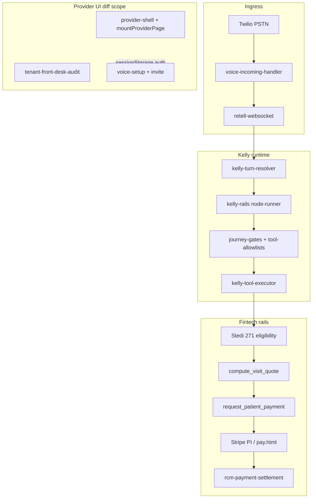

# Comprehensive codebase review — 2026-07-03

> **Scope:** Full git diff (~90 modified + ~40 untracked files) + Tier B agentic/fintech pipeline  
> **Method:** 4 parallel readonly agent passes (Frontend, Backend, E2E/DevOps, Voice/AI) + manual security pass + test matrix execution  
> **Review lenses:** AI engineer, Frontend, Backend, DevOps, Solution Architect, Security, UX  
> **Verdict:** Pilot-stage **agentic voice front desk** with **sandbox fintech rails** — not yet production agentic fintech

---

## Executive summary

Somo is building a dental front-desk voice agent (Kelly) with eligibility (Stedi), pay links (Stripe), PMS (Dentrix), and provider/admin portals. The **Kelly Rails V2** path (lane gates, tool allowlists, journey gates) is architecturally sound for an agentic product. However, the current diff optimizes for **pilot UI polish and skip-safe ops scripts**, not for **money-grade production**.

**Critical blockers before treating this as fintech:**

1. **Unauthenticated admin feature-flag API** (`admin-platform.js` registered before global `requireAdminAuth`)
2. **XSS** on provider tenants page and several settings/agent surfaces
3. **Onboarding meta bypass** — clients can clear blockers without verified Google/PMS/forwarding
4. **Voice pay path** — bearer pay tokens, no caller step-up auth, no AI-caller detection
5. **E2E false confidence** — Playwright green while audit reports 42 failures; heavy API mocking

**Overall rating: 6.4 / 10** (see §11)

---

## 1. Is this an agentic fintech tool today?

| Dimension | Present? | Evidence |
|-----------|----------|----------|
| **Agentic** | Partially | Kelly Rails lanes, gated tools, golden conversations; dual Retell function-call path bypasses allowlists |
| **Fintech** | Sandbox only | Stedi test, Stripe test, RCM ledger; prod vendor gates explicitly open |
| **Autonomous money** | No | Kelly sends pay links; patient completes checkout off-call |
| **Caller identity** | Clinic only | `voice-identity-admission.js` validates tenant/DID, not patient or human caller |
| **AI caller detection** | **No** | No STIR/SHAKEN, liveness, or bot challenge before copay/pay |

**Answer:** This is an **agentic voice front desk moving toward fintech**, not a production agentic fintech platform.

---

## 2. Architecture map

**Gap:** UI layer uses client-side auth hints; money path uses server gates — but onboarding blockers and pay links are weakly bound to verified identity.

---

## 3. Test execution matrix (2026-07-03)

| Command | Playwright/Jest exit | Notes | False confidence? |
|---------|---------------------|-------|-------------------|
| `npm run test:e2e:onboarding` | **9/9 pass** | FD-415 calendar picker included | Partial — heavy API stubs |
| `npm run test:e2e:admin` | **7/7 pass** | All APIs mocked | **Yes** — auth not tested |
| `npm run test:e2e:doctor-portal` | **7/7 pass** | FD-416 toggle partially stubbed | Partial |
| `npm run test:e2e:tenant-audit:safe` | **32/32 pass** | Audit report: **114 pass / 42 fail / 26 skip** | **Yes** — failures only warn |
| `npm run test:e2e:voice-agent` | **4/8 pass** | 4 fail: stale wizard steps, `#vaStatusBadge`, URL paths, outbound visibility | **Yes** — spec drift |
| `npm run verify:prod-gates` | **0 exit** | 4/4 informational; Dentrix/Henry Schein unset | **Yes** in dev |
| `npm run verify:voice-identity-vars` | **0 exit** | Contract OK | No |
| `npm test` (3 unit files) | **10/10 pass** | onboarding-state, invite, payment-settlement | No |
| `npm run test:e2e:kelly:golden-conversations` | Not run | Timeboxed; stubs `request_patient_payment` | Would be lane-only |

---

## 4. Security threat model

| Threat | Likelihood | Impact | Current control | Gap |
|--------|------------|--------|-----------------|-----|
| Unauthenticated flag toggle | High if exposed | Critical — kill switches | None on `GET/POST /api/admin/feature-flags` | Register after `requireAdminAuth` |
| XSS via tenant/API HTML | Medium | Session hijack, admin actions | Partial `esc()` on admin | `tenants.html`, `agent.html`, `tab-connected.js` unescaped |
| Onboarding blocker bypass | High | Go-live without PMS/calendar | Client-writable `onboarding_meta` | Server-side verification only |
| Tenant self-set `pilot_live_at` | Medium | Skip shadow week | PATCH on `tenant-clinic.js` | Admin-only go-live |
| Kelly session IDOR | Medium | PHI leak across tenants | `requireCustomerAuth` only | No session→tenant ownership check |
| Pay link bearer token theft | Medium | Unauthorized payment | Token in URL | No TTL, single-use, or step-up |
| Voice caller impersonation | Medium | Pay link to wrong party | SMS to `callerPhone` | No DOB/OTP before `request_patient_payment` |
| AI/bot caller | Low–Med | Automated eligibility abuse | ASR confidence optional | No synthetic voice detection |
| Prompt injection → tool args | Medium | Wrong patient_id, amounts | Journey gates, server quote | LLM args trusted for phone/patient |
| Invite code enumeration | Low | Account creation | Rate limits partial | Fixed audit code on isolated DB only |
| sessionStorage auth bypass | Low | UI-only gates | Server cookies real | `invoice-detail.html` client gate |
| Stripe PI duplicate | Low | Double charge confusion | PI reuse (diff improvement) | Fall-through creates new PI on retrieve fail |
| Dentrix filter injection | Low | Wrong patient lookup | String concat filters | Sanitize filter values |

---

## 5. Agent-call detection — can we know the caller is an AI?

**Today: No.**

| Layer | What it checks | What it does NOT check |
|-------|----------------|------------------------|
| `voice-identity-admission.js` | Clinic/customer/DID, site context | Patient identity, human vs bot |
| `kelly-asr-gate.js` | Optional ASR confidence | Synthetic voice, replay |
| Insurance name mismatch | First-name heuristic on collect_insurance | Payment path |
| Retell metadata | Call direction, call_type | Bot declaration, STIR/SHAKEN |
| Outbound sales agent | Separate Retell agent | No cross-detection on inbound patient calls |

**Needed for fintech-grade voice:**

1. Step-up auth (DOB + member ID or OTP) before copay quote speak and pay link
2. Pay token bound to verified patient + session + TTL
3. Rate limits on eligibility/pay-link per caller + clinic
4. Optional: carrier attestation, liveness for high-value actions
5. Audit log: `caller_risk_score`, `identity_verification_method`

---

## 6. Why not agentic fintech yet — top 15 structural gaps

1. Dual tool execution paths (Kelly Rails vs Retell `handleFunctionCall`) — firewall bypass
2. Production money rails vendor-gated; simulate/fallback paths still active
3. SQLite as financial SSOT under concurrent voice + payments
4. No unified money audit ledger (session → 271 → quote → PI → settlement)
5. Fraud/anti-sybil on HTTP pay only, not Kelly voice pay
6. Client-writable onboarding meta clears go-live blockers
7. E2E suites mock admin session and APIs — green ≠ secure
8. Tenant audit exits 0 with 42 control failures
9. Page-centric UI — no shared view layer; XSS opt-in per page
10. Voice-setup UI fields (NPI, coverage) not wired to API
11. No real-time operator wallboard for live calls/money actions
12. Legacy derm/commerce/health surfaces dilute ICP and tool allowlists
13. CI disabled/minimal — no Playwright or vendor gates in pipeline
14. Documentation broken links (`docs/design/*` missing from repo)
15. No AI-caller or synthetic voice detection

---

## 7. Per-file review — Tier A (git diff)

Format: **Lines | Lens | Sev | Issue | Fix**

### 7.1 Docs (9 files)

#### `docs/Brand/SOMO_GUIDELINES.md`
| Lines | Lens | Sev | Issue | Fix |
|-------|------|-----|-------|-----|
| 32, 50, 66, 82 | DevOps | Med | Broken links to missing `docs/design/*`, `./LOGO_AND_ICON_SSOT.md` | Restore docs or fix links |
| 50 | UX | Low | Wrong path `business/trial-activation portal/` | Fix to `unified-dashboard/business/trial-activation.html` |

#### `docs/deployment/PHASE0_DEPLOY_STATE.md`
| Lines | Lens | Sev | Issue | Fix |
|-------|------|-----|-------|-----|
| 7–11 | DevOps | Med | SHAs stale vs large uncommitted diff | Update on deploy |
| 40 | DevOps | Med | Describes `ci:phase0`; CI workflow minimal | Align CI with doc |

#### `docs/voice-agent/README.md`
| Lines | Lens | Sev | Issue | Fix |
|-------|------|-----|-------|-----|
| 24–27 | DevOps | Low | Omits `verify:prod-gates`, `verify:front-desk-pilot` | Add vendor gate section |

#### `docs/voice-agent/PROD_VENDOR_GATES.md`
| Lines | Lens | Sev | Issue | Fix |
|-------|------|-----|-------|-----|
| 112–113 | DevOps | Med | Links to missing `docs/design/PHASE5_*`, `INVENTORY_*` | Create or remove links |
| 52–59 | DevOps | Low | `--check-only` always exit 0 | Document as informational |

#### `docs/voice-agent/phase2-pilot-checklist.md`
| Lines | Lens | Sev | Issue | Fix |
|-------|------|-----|-------|-----|
| 18 | DevOps | Low | Absolute path to `.cursor/plans/...` | Use repo-relative link |

#### `docs/voice-agent/phase3-dentrix-setup.md`
| Lines | Lens | Sev | Issue | Fix |
|-------|------|-----|-------|-----|
| — | BE | Low | Aligns with new dentrix services | No issues (Low) |

#### `docs/voice-agent/google-oauth-onboarding.md`
| Lines | Lens | Sev | Issue | Fix |
|-------|------|-----|-------|-----|
| 5–14 | Security | Low | Documents OAuth scopes | Validate against `server.js` on each change |

#### `docs/voice-agent/onboarding-meta-contract.md`
| Lines | Lens | Sev | Issue | Fix |
|-------|------|-----|-------|-----|
| 44–45 | Security | Med | "Do not store tokens in meta" — E2E stubs bypass | Enforce server-side |

#### `docs/voice-agent/onboarding-preview-parity-qa.md`, `onboarding-stepper-delta.md`
| Lines | Lens | Sev | Issue | Fix |
|-------|------|-----|-------|-----|
| — | UX | Low | Manual QA only; 7-step canon matches `voice-setup.js` | Wire to CI smoke |

---

### 7.2 Middleware — routes (11 files)

#### `middleware-platform/routes/admin-platform.js`
| Lines | Lens | Sev | Issue | Fix |
|-------|------|-----|-------|-----|
| 2158–2197 | **Security** | **Critical** | `/api/admin/feature-flags` GET/POST **without auth** (registered before global middleware) | Add `requireAdminAuth` or move registration |
| 2184–2192 | Security | Med | No flag name allowlist | Validate against registry |
| 2170, 2195 | BE | Low | `e.message` in 500 responses | Generic errors |

#### `middleware-platform/routes/admin-tenants.js`
| Lines | Lens | Sev | Issue | Fix |
|-------|------|-----|-------|-----|
| 102–130 | Security | Low | Billing fields behind `requireTenantsAccess` | OK if capability restricted |

#### `middleware-platform/routes/admin-voice-onboarding.js`
| Lines | Lens | Sev | Issue | Fix |
|-------|------|-----|-------|-----|
| 117–151 | Security | Med | Bulk PII in stuck list (200 emails) | Pagination + audit log |

#### `middleware-platform/routes/customer-dashboard.js`
| Lines | Lens | Sev | Issue | Fix |
|-------|------|-----|-------|-----|
| 411–417 | BE | Low | New KPI fields tenant-scoped | OK |

#### `middleware-platform/routes/kelly.js`
| Lines | Lens | Sev | Issue | Fix |
|-------|------|-----|-------|-----|
| 188–196 | **Security** | **High** | `GET /calls/:sessionId` — no tenant ownership on sessionId | Verify session belongs to customer |

#### `middleware-platform/routes/provider-invites.js`
| Lines | Lens | Sev | Issue | Fix |
|-------|------|-----|-------|-----|
| 188–199 | **Security** | **High** | `return_password: true` returns temp password in JSON | Email only; never in response |
| 71–79 | Security | Med | Invite `code` in list response | Mask in list |

#### `middleware-platform/routes/tenant-clinic.js`
| Lines | Lens | Sev | Issue | Fix |
|-------|------|-----|-------|-----|
| 63–77 | **Security** | **High** | Tenant can PATCH `pilot_live_at`, `shadow_week_active` | Admin-only go-live |

#### `middleware-platform/routes/tenant-pms.js`, `tenant-integrations.js`
| Lines | Lens | Sev | Issue | Fix |
|-------|------|-----|-------|-----|
| — | Security | Low | Scoped via `requireCustomerPmsAuth` | OK |

#### `middleware-platform/routes/voice-agent-settings.js`
| Lines | Lens | Sev | Issue | Fix |
|-------|------|-----|-------|-----|
| 182–238 | **Security** | **High** | Client-writable onboarding ack flags without verification | Set flags server-side only after OAuth/PMS/test |

---

### 7.3 Middleware — services (18 files)

#### `middleware-platform/services/rcm-payment-settlement.js`
| Lines | Lens | Sev | Issue | Fix |
|-------|------|-----|-------|-----|
| 485–507 | **Security** | **High** | PI retrieve failure → new PI (orphan intents) | Fail closed; idempotency key |
| 491–505 | Security | Med | Non-reusable PI status fall-through | Explicit status matrix |

#### `middleware-platform/services/rcm-payment-request-service.js`
| Lines | Lens | Sev | Issue | Fix |
|-------|------|-----|-------|-----|
| — | Security | Med | Bearer pay_token, no TTL at creation | TTL + single-use + patient bind |

#### `middleware-platform/services/onboarding-blockers-service.js`
| Lines | Lens | Sev | Issue | Fix |
|-------|------|-----|-------|-----|
| 59–60, 67 | **Security** | **High** | `calendar_connection: 'google'` meta alone clears blocker | Require `isGoogleCalendarConnected` |
| 67 | Security | High | `forward_line_ack` without test call | Require `hasCalls` or carrier verify |

#### `middleware-platform/services/lead-convert-service.js`
| Lines | Lens | Sev | Issue | Fix |
|-------|------|-----|-------|-----|
| 32–56 | **Security** | **High** | Skips `assertInviteEmailAvailable` | Call before provision |
| 41, 133 | Security | High | Password in API response | Remove `return_password` |

#### `middleware-platform/services/provider-invite-service.js`
| Lines | Lens | Sev | Issue | Fix |
|-------|------|-----|-------|-----|
| 193–220 | Security | Med | Accept-time email race | Re-check availability at accept |

#### `middleware-platform/services/e10-interim-service.js`
| Lines | Lens | Sev | Issue | Fix |
|-------|------|-----|-------|-----|
| 84–99 | Security | Med | Unescaped HTML in digest email | HTML-escape all fields |

#### `middleware-platform/services/pms/dentrix-adapter.js`
| Lines | Lens | Sev | Issue | Fix |
|-------|------|-----|-------|-----|
| 1082–1090 | Security | Med | Filter string concat injection | Sanitize values |
| 1116–1128 | SA | Med | Silent empty schedule on read fail | Fail closed or degraded flag |

#### `middleware-platform/services/pms/dentrix-config.js`, `dentrix-client.js`
| Lines | Lens | Sev | Issue | Fix |
|-------|------|-----|-------|-----|
| 15–16 | **Security** | **High** | Global env secret for all clinics | Per-clinic encrypted config |
| 7, 43–67 | Security | Med | Token cache not keyed by org | Include org in cache key |

#### `middleware-platform/services/voice-onboarding-state.js`, `nameplate-status-service.js`, `call-timeline-service.js`, `integrations-status-service.js`, `admin-lead-facade.js`, `booking-service.js`, `tenant-health.js`
| Lines | Lens | Sev | Issue | Fix |
|-------|------|-----|-------|-----|
| — | BE | Low | Supporting services; no critical issues in diff | Continue test coverage |

---

### 7.4 Middleware — infrastructure (4 files)

#### `middleware-platform/server.js`
| Lines | Lens | Sev | Issue | Fix |
|-------|------|-----|-------|-----|
| 4868–4876 | **Security** | **Critical** | `registerAdminPlatformRoutes` before `app.use('/api/admin', requireAdminAuth)` | Reorder or per-route auth |

#### `middleware-platform/database.js`
| Lines | Lens | Sev | Issue | Fix |
|-------|------|-----|-------|-----|
| 4862–4869 | BE | Med | Shadow week migration warns-only on failure | Fail startup in prod |

#### `middleware-platform/migrations/105_shadow_week_ends.js`
| Lines | Lens | Sev | Issue | Fix |
|-------|------|-----|-------|-----|
| — | BE | Low | Safe DDL; empty down() | Document rollback |

#### `middleware-platform/package.json`
| Lines | Lens | Sev | Issue | Fix |
|-------|------|-----|-------|-----|
| 365–366 | DevOps | Med | `test:e2e:tenant-audit` defaults live actions | Prefer `:safe` in CI |
| 128–149 | DevOps | Low | New verify/setup scripts | Wire into CI with STRICT flags |

---

### 7.5 Middleware — E2E & scripts (20 files)

#### `middleware-platform/e2e/tenant-front-desk-audit.spec.cjs`
| Lines | Lens | Sev | Issue | Fix |
|-------|------|-----|-------|-----|
| 56–59 | **DevOps** | **Critical** | 42 audit failures → warn only; Playwright exits 0 | `TENANT_AUDIT_STRICT=1` fails test |
| 131–209 | DevOps | High | Stubs admin tenants, voice-agent, settings APIs | Separate integration tier |
| 123–129 | Security | High | Injects `platformCaps` into sessionStorage only | Integration test with real caps |

#### `middleware-platform/e2e/helpers/tenant-ui-audit.cjs`
| Lines | Lens | Sev | Issue | Fix |
|-------|------|-----|-------|-----|
| 64–104 | Security | High | sessionStorage auth injection | Document as UI-only |
| 339–345 | DevOps | High | 4xx ignored on probes | Fail on 401/403 for money routes |

#### `middleware-platform/e2e/admin/admin-portal-journey.spec.cjs`
| Lines | Lens | Sev | Issue | Fix |
|-------|------|-----|-------|-----|
| 39–57 | **DevOps** | **Critical** | Mocked admin session — auth never tested | One integration spec without mocks |

#### `middleware-platform/e2e/voice-agent-page.spec.cjs`
| Lines | Lens | Sev | Issue | Fix |
|-------|------|-----|-------|-----|
| 170–268 | DevOps | **High** | Stale 5-step wizard; expects greeting after step 1 | Align to 6 DOM / 7 canonical steps |
| 271–357 | DevOps | **High** | `#vaStatusBadge` removed; use `#vaStatusNameplate` | Update selectors |

#### `middleware-platform/e2e/provider/onboarding-journey.spec.cjs`
| Lines | Lens | Sev | Issue | Fix |
|-------|------|-----|-------|-----|
| 27–92 | DevOps | Med | Heavy stubs — FD-412/415 pass without backend | Add one live-path test |

#### `middleware-platform/scripts/verify-prod-gates.cjs`, `verify-front-desk-pilot.cjs`, `verify-pilot-prod-readiness.cjs`
| Lines | Lens | Sev | Issue | Fix |
|-------|------|-----|-------|-----|
| — | DevOps | Med | Non-strict always exit 0 | Require `PILOT_PROD_STRICT=1` on deploy |

#### `middleware-platform/scripts/setup-phase2-prod-stedi.cjs`, `setup-henry-schein-application.cjs`, `verify-phase3-dentrix-sandbox.cjs`
| Lines | Lens | Sev | Issue | Fix |
|-------|------|-----|-------|-----|
| — | DevOps | Low | Skip-safe by design; documented | OK for dev |

#### `middleware-platform/scripts/e2e-phase3-combined-journey.cjs`
| Lines | Lens | Sev | Issue | Fix |
|-------|------|-----|-------|-----|
| — | DevOps | Low | Phase 3 journey script | Run only with Dentrix creds |

#### `middleware-platform/playwright.config.cjs`
| Lines | Lens | Sev | Issue | Fix |
|-------|------|-----|-------|-----|
| 139–226 | DevOps | **High** | DB path split: root vs `var/db/` vs audit | Canonicalize to `var/db/middleware-dev.db` |
| 217–243 | DevOps | Med | voice-agent webServer timeout without manual server | Add webServer or document prerequisite |

#### `scripts/callsomo-terminal-cutover.sh`
| Lines | Lens | Sev | Issue | Fix |
|-------|------|-----|-------|-----|
| 18–19 | DevOps | Low | Hard-coded gcloud account | Parameterize |
| 85–94 | DevOps | Low | Post-deploy verify good | Keep |

---

### 7.6 Middleware — tests (10 files)

All new/updated unit tests improve coverage. **Gaps:**

| File | Lens | Sev | Issue | Fix |
|------|------|-----|-------|-----|
| `onboarding-blockers.test.js` | Security | Med | No meta-bypass regression test | Add test |
| `payment-settlement.test.js` | Security | Med | No PI retrieve-failure test | Add test |
| `lead-convert.test.js` | Security | Med | No duplicate-email rejection test | Add test |
| `dentrix-adapter.test.js` | Security | Low | No filter injection tests | Add test |
| Others | BE | Low | Adequate for helpers | — |

---

### 7.7 Unified dashboard — critical frontend files

#### `unified-dashboard/business/tenants.html`
| Lines | Lens | Sev | Issue | Fix |
|-------|------|-----|-------|-----|
| 67–83 | **Security** | **Critical** | `t.name`, `t.clinic_id` in `innerHTML` unescaped | Use `esc()` or DOM APIs |
| 88 | Security | Med | `e.message` in innerHTML | Escape |
| 22, 84 | FE | High | `.hidden` class undefined in provider CSS | Add `.hidden` rule |
| 44 | UX | High | `activeId: 'feature-flags'` wrong nav | Use `'tenants'` |

#### `unified-dashboard/business/leads.html`
| Lines | Lens | Sev | Issue | Fix |
|-------|------|-----|-------|-----|
| 24, 29 | FE | High | `.hidden` broken | Add CSS rule |
| 40 | UX | High | Wrong `activeId` | Use `'leads'` |
| 54 | Security | Med | Admin iframe without sandbox | Document trust boundary |

#### `unified-dashboard/business/agent.html`
| Lines | Lens | Sev | Issue | Fix |
|-------|------|-----|-------|-----|
| 259, 388–407 | **Security** | **High** | API fields in innerHTML unescaped | `escapeHtml` all fields |

#### `unified-dashboard/assets/js/settings/tab-connected.js`
| Lines | Lens | Sev | Issue | Fix |
|-------|------|-----|-------|-----|
| 70, 96, 117 | **Security** | **High** | `calendar_email`, `e.message` in innerHTML | Escape |

#### `unified-dashboard/assets/js/config.js`
| Lines | Lens | Sev | Issue | Fix |
|-------|------|-----|-------|-----|
| 296 | **Security** | **High** | `showPatientAlert` unescaped innerHTML | textContent |

#### `unified-dashboard/business/voice-setup.html` + `voice-setup.js`
| Lines | Lens | Sev | Issue | Fix |
|-------|------|-----|-------|-----|
| 48–55 | **SA** | **High** | NPI/coverage fields not in `draftSettings()` | Wire to API |
| 52–54 | BE | High | Enum `scheduled/full_time` ≠ API `full_replacement/coverage` | Align enums |

#### `unified-dashboard/assets/js/provider-layout.js`
| Lines | Lens | Sev | Issue | Fix |
|-------|------|-----|-------|-----|
| 177–179 | Security | Med | `topbarActions` via insertAdjacentHTML | Trusted static only |
| 66–70 | UX | Med | Nameplate defaults to LIVE | Map from explicit state enum |

#### `unified-dashboard/assets/js/provider-shell-chrome.js`
| Lines | Lens | Sev | Issue | Fix |
|-------|------|-----|-------|-----|
| 16–25 | a11y | High | `<a>` wraps `<button>` for Kelly toggle | Split layout |

#### `unified-dashboard/assets/css/provider-portal.css`
| Lines | Lens | Sev | Issue | Fix |
|-------|------|-----|-------|-----|
| — | FE | **High** | Missing `.hidden` utility | Add one rule |
| 3070–3090 | SA | Med | Duplicate `.sfd-table` vs SFD CSS | Consolidate to SSOT |

#### `unified-dashboard/business/invite.html`
| Lines | Lens | Sev | Issue | Fix |
|-------|------|-----|-------|-----|
| 8 vs 7 | FE | Med | Mixed `/unified-dashboard/assets` vs `/assets` | Normalize paths |
| 39–41 | UX | High | BAA checkbox no document links | Add legal links + required |

#### `unified-dashboard/business/invoice-detail.html`
| Lines | Lens | Sev | Issue | Fix |
|-------|------|-----|-------|-----|
| 443–451 | Security | High | Gates on sessionStorage only | Server 401 only |

#### `unified-dashboard/assets/js/login-somo.js`
| Lines | Lens | Sev | Issue | Fix |
|-------|------|-----|-------|-----|
| 61–71 | Security | Med | sessionStorage auth flag | Cache only; server validates |

#### Admin pages (`sales-agent.html`, `coding-reviews.html`, `admin-shell.js`, etc.)
| Lines | Lens | Sev | Issue | Fix |
|-------|------|-----|-------|-----|
| — | SFD | Low | sfd-card/sfd-table adoption good | Add data-testid |
| coding-reviews 64 | Security | Med | `data-id` unescaped | esc(r.id) |

---

### 7.8 Unified dashboard — shell-migrated pages (summary)

| File | Sev | Summary |
|------|-----|---------|
| `today.html`, `calls.html`, `calendar.html`, `patients.html`, `patient-case.html` | Low–Med | Good escapeHtml/data-testid; calendar needs full API string audit |
| `revenue.html`, `rcm-journey.html`, `payor-review.html`, `merge-review.html` | Low | mountProviderPage + escaped renders OK |
| `settings.html` | Low | Tab a11y good; add data-testid |
| `video-call.html` | Med | Partial escape on transcript/chart HTML |
| `trial-activation.html`, `voice-setup.html` | Med | Standalone wizards OK; path normalization needed |
| `feature-flags.html`, `billing.html`, `rcm.html`, `claims.html` | Low | Redirect stubs — no UI issues |
| `login.html`, `signup.html`, `portal.html`, `reset-password.html` | Low–Med | Auth shell OK; reset-password config path may 404 |
| `patients/pay.html` | Low | textContent updates; good mobile layout |
| `dev/sfd-component-gallery.html` | Low | Dev reference only |

---

### 7.9 Tier B — Voice/AI pipeline (not all in diff)

| File | Sev | Key issue |
|------|-----|-----------|
| `kelly-turn-resolver.js` | High | `scriptOnly` bypasses tool firewall |
| `kelly-tool-executor.js` | **High** | `request_patient_payment` no step-up auth |
| `retell-websocket.js` | High | Dual FC path; no lane allowlist; raw user text to LLM |
| `voice-identity-admission.js` | Med | Tenant only — no patient/bot |
| `eligibility-orchestrator.js` | Low | Thin wrapper; no session binding |
| `voice-incoming-handler.js` | Med | Query param overrides; site context gating |

---

## 8. Files to delete, consolidate, or quarantine

### Delete (artifacts — not product code)

| Path | Reason |
|------|--------|
| `middleware-platform/.env.bak.2026-06-30` | Secret leak risk; backup file |
| `middleware-platform/test-results/**` | Generated; gitignore |
| `middleware-platform/playwright-report/**` | Generated |
| `middleware-platform/tmp/commerce-pstn-run-*.json` | 21k-line replay dumps |

### Consolidate

| From | To |
|------|-----|
| `provider-portal.css` `.sfd-table` duplicate | `somo-front-desk-components.css` |
| `kelly-function-executor` shim callers | `KellyToolExecutor` only |
| Retell FC switch + KellyToolExecutor | Single dispatch table |
| Inline scripts in `tenants.html`, `leads.html` | `tenants-page.js`, `leads-page.js` |
| Playwright DB paths (3 locations) | `var/db/middleware-dev.db` only |

### Quarantine (non-ICP / legacy)

| Area | Action |
|------|--------|
| `health-video-landing/`, acne-journey E2E | Move to `legacy/` or separate package |
| Derm/skincare tools in Kelly allowlists | Gate behind feature flags for dental pilot |
| `kelly-agent-service.js` (~6.8k lines) | Shrink after prod soak |

### Restore (missing docs referenced in code)

| Path | Referenced by |
|------|---------------|
| `docs/design/PHASE5_VISUAL_QA_MATRIX.md` | PROD_VENDOR_GATES.md |
| `docs/design/INVENTORY_COMPLETION_MATRIX.md` | PROD_VENDOR_GATES.md |
| `docs/design/FRONT_DESK_SCREEN_UPDATE_SPEC.md` | SOMO_GUIDELINES.md |

---

## 9. Preventable future issues

1. **CI gate:** Fail Playwright when `tenant-audit` report has failures (`TENANT_AUDIT_STRICT=1`)
2. **CI gate:** Run onboarding + doctor-portal E2E on PR; admin with real session (no mocks) on nightly
3. **Deploy gate:** `PILOT_PROD_STRICT=1 CLOUDRUN_VERIFY=1 npm run verify:front-desk-pilot`
4. **Security:** CSP header; ban raw `innerHTML` with API data — lint rule
5. **Shared `esc()`** exported from one module; forbid page-local escape helpers
6. **Admin route registration:** Lint rule — all `/api/admin/*` after auth middleware
7. **Onboarding:** Server-only meta flags; integration test that client cannot clear blockers
8. **Pay path:** Token TTL + fraud hook on Kelly pay same as HTTP `/api/payment/process`
9. **Docs:** Link checker in CI for `docs/**/*.md`
10. **Re-enable** `.github/workflows/ci.yml` with Playwright subset

---

## 10. Remediation backlog

### P0 — fix before any prod money or external admin exposure

| # | Item | Owner | Files |
|---|------|-------|-------|
| 1 | Auth on `/api/admin/feature-flags` | Backend | `admin-platform.js`, `server.js` |
| 2 | Fix tenants.html XSS | Frontend | `tenants.html` |
| 3 | Fix agent.html + tab-connected.js XSS | Frontend | `agent.html`, `tab-connected.js`, `config.js` |
| 4 | Block onboarding meta bypass | Backend | `voice-agent-settings.js`, `onboarding-blockers-service.js` |
| 5 | Restrict `pilot_live_at` to admin | Backend | `tenant-clinic.js` |
| 6 | Kelly call session IDOR fix | Backend | `kelly.js` |
| 7 | Fail tenant audit on report failures (strict mode) | DevOps | `tenant-front-desk-audit.spec.cjs` |
| 8 | Voice pay step-up before link send | AI/Backend | `kelly-tool-executor.js` |

### P1 — before pilot scale

| # | Item |
|---|------|
| 9 | Add `.hidden` to provider-portal.css |
| 10 | Wire voice-setup NPI/coverage to API |
| 11 | Update voice-agent-page.spec.cjs (6-step, nameplate selector) |
| 12 | Stripe PI idempotency fail-closed |
| 13 | lead-convert duplicate email check |
| 14 | Unify tool execution firewall (Retell FC + scriptOnly) |
| 15 | Pay token TTL + rate limits |
| 16 | Canonicalize Playwright DB_PATH |
| 17 | Restore missing docs/design files |
| 18 | One admin E2E without API mocks |

### P2 — quality / ops

| # | Item |
|---|------|
| 19 | Consolidate SFD CSS duplicates |
| 20 | data-testid on admin + auth pages |
| 21 | HTML-escape E10 digest emails |
| 22 | Dentrix filter sanitization |
| 23 | CI: onboarding + doctor-portal + strict prod gates |
| 24 | Quarantine legacy derm/commerce surfaces |
| 25 | Real-time call/money monitoring dashboard |

---

## 11. Ratings (1–10)

| Dimension | Score | Rationale |
|-----------|-------|-----------|
| **Agentic** | **7.5** | Strong Kelly Rails architecture; dual paths and legacy surface hold it back |
| **Fintech** | **5.5** | Full sandbox spine; prod rails, caller auth, SQLite SSOT gaps |
| **Frontend / UX** | **6.8** | Good shell migration; XSS clusters, unwired setup fields, false-green audits |
| **Backend / API** | **6.0** | Critical admin auth gap; onboarding bypass; IDOR on Kelly forensics |
| **DevOps / CI** | **5.0** | Rich local scripts; CI disabled; false-green gates; DB path split |
| **Security** | **5.5** | Good invite hardening; critical XSS + admin flags + pay path weak |
| **Documentation** | **5.0** | Good voice-agent runbooks; broken design links; stale E2E specs |
| **Test honesty** | **4.0** | Playwright green masks 42 audit failures and mocked admin auth |
| **Overall** | **6.4 / 10** | Credible pilot; not production agentic fintech until P0 closed |

### Path to 8+

Close all P0 items, run `PILOT_PROD_STRICT=1` in deploy pipeline, wire voice-setup to API, add pay-path step-up auth, enable CI with strict audit mode, restore design docs, and complete Stedi/Stripe/Dentrix prod vendor gates with live 271 + settlement E2E (unstubbed).

---

## 12. Review metadata

| Field | Value |
|-------|-------|
| Files in scope (Tier A) | ~130 modified + untracked |
| Agent passes | Frontend, Backend, E2E/DevOps, Voice/AI (4 parallel) |
| Manual security pass | Voice identity, pay path, webhooks, sessionStorage |
| Test run date | 2026-07-03 UTC |
| Reviewers (lenses) | AI engineer, Frontend, Backend, DevOps, Solution Architect, Security, UX |

---

*This document is read-only assessment. Implement P0 via separate PRs; do not treat green E2E as production safety without strict gates.*

---

## Appendix A — Complete file inventory (137 files)

Every file in git diff + untracked scope. **§** = section in this doc. **Max sev** = highest finding severity.

| # | File | § | Max sev | Review status |
|---|------|---|---------|---------------|
| 1 | `docs/Brand/SOMO_GUIDELINES.md` | 7.1 | Med | Broken doc links |
| 2 | `docs/deployment/PHASE0_DEPLOY_STATE.md` | 7.1 | Med | Stale deploy SHAs |
| 3 | `docs/qa/CODEBASE_COMPREHENSIVE_REVIEW_2026-07-03.md` | — | — | This deliverable |
| 4 | `docs/voice-agent/PROD_VENDOR_GATES.md` | 7.1 | Med | Broken design links |
| 5 | `docs/voice-agent/README.md` | 7.1 | Low | Missing prod-gates ref |
| 6 | `docs/voice-agent/google-oauth-onboarding.md` | 7.1 | Low | OAuth scope doc |
| 7 | `docs/voice-agent/onboarding-meta-contract.md` | 7.1 | Med | Meta contract vs E2E bypass |
| 8 | `docs/voice-agent/onboarding-preview-parity-qa.md` | 7.1 | Low | Manual QA only |
| 9 | `docs/voice-agent/onboarding-stepper-delta.md` | 7.1 | Low | 7-step canon OK |
| 10 | `docs/voice-agent/phase2-pilot-checklist.md` | 7.1 | Low | Non-portable plan link |
| 11 | `docs/voice-agent/phase3-dentrix-setup.md` | 7.1 | Low | OK |
| 12 | `middleware-platform/.env.bak.2026-06-30` | 8 | **High** | **Delete** — secret risk |
| 13–23 | `middleware-platform/__tests__/*.js` (11 files) | 7.6 | Med | Unit coverage gaps noted |
| 24 | `middleware-platform/database.js` | 7.4 | Med | Migration warn-only |
| 25 | `middleware-platform/e2e/admin/admin-portal-journey.spec.cjs` | 7.5 | **Critical** | Mocked admin auth |
| 26 | `middleware-platform/e2e/admin/helpers/admin-fixtures.cjs` | 7.5 | Med | Missing secret continues |
| 27 | `middleware-platform/e2e/helpers/tenant-ui-audit.cjs` | 7.5 | High | sessionStorage auth |
| 28 | `middleware-platform/e2e/provider/doctor-portal-journey.spec.cjs` | 7.5 | Med | Partial stubs |
| 29 | `middleware-platform/e2e/provider/helpers/onboarding-fixtures.cjs` | 7.5 | Med | DB path / stubs |
| 30 | `middleware-platform/e2e/provider/onboarding-journey.spec.cjs` | 7.5 | Med | Stub-heavy |
| 31 | `middleware-platform/e2e/provider/onboarding-mobile.spec.cjs` | 7.5 | Low | FD-143 partial |
| 32 | `middleware-platform/e2e/tenant-front-desk-audit.spec.cjs` | 7.5 | **Critical** | 42 fails, exit 0 |
| 33 | `middleware-platform/e2e/voice-agent-page.spec.cjs` | 7.5 | **High** | 4/8 fail — stale |
| 34 | `middleware-platform/migrations/105_shadow_week_ends.js` | 7.4 | Low | OK |
| 35 | `middleware-platform/package.json` | 7.4 | Med | Script wiring |
| 36 | `middleware-platform/playwright.config.cjs` | 7.5 | **High** | DB path split |
| 37 | `middleware-platform/routes/admin-platform.js` | 7.2 | **Critical** | Unauth feature flags |
| 38 | `middleware-platform/routes/admin-tenants.js` | 7.2 | Low | OK |
| 39 | `middleware-platform/routes/admin-voice-onboarding.js` | 7.2 | Med | PII bulk export |
| 40 | `middleware-platform/routes/customer-dashboard.js` | 7.2 | Low | OK |
| 41 | `middleware-platform/routes/kelly.js` | 7.2 | **High** | Session IDOR |
| 42 | `middleware-platform/routes/provider-invites.js` | 7.2 | **High** | Password in JSON |
| 43 | `middleware-platform/routes/tenant-clinic.js` | 7.2 | **High** | Self go-live |
| 44 | `middleware-platform/routes/tenant-integrations.js` | 7.2 | Low | OK |
| 45 | `middleware-platform/routes/tenant-pms.js` | 7.2 | Low | OK |
| 46 | `middleware-platform/routes/voice-agent-settings.js` | 7.2 | **High** | Meta bypass |
| 47–59 | `middleware-platform/scripts/*.cjs` (13 files) | 7.5 | Med | Skip-safe gates |
| 60 | `middleware-platform/server.js` | 7.4 | **Critical** | Admin route order |
| 61–75 | `middleware-platform/services/*.js` (15 files) | 7.3 | **High** | See §7.3 table |
| 76 | `scripts/callsomo-terminal-cutover.sh` | 7.5 | Low | Deploy script |
| 77–87 | `unified-dashboard/admin/**` (11 files) | 7.7 | Med | Admin XSS onclick |
| 88–90 | `unified-dashboard/assets/css/*.css` (3 files) | 7.7 | **High** | Missing .hidden |
| 91–111 | `unified-dashboard/assets/js/**` (21 files) | 7.7 | **High** | XSS in tab-connected, config |
| 112–130 | `unified-dashboard/business/*.html` (19 files) | 7.7–7.8 | **Critical** | tenants XSS; setup unwired |
| 131 | `unified-dashboard/dev/sfd-component-gallery.html` | 7.8 | Low | Dev reference |
| 132–137 | Auth pages (`login`, `signup*`, `portal`, `reset-password`, `pay.html`) | 7.8 | Med | sessionStorage / paths |

**Tier B pipeline files** (reviewed separately, not in diff list): `kelly-turn-resolver.js`, `kelly-tool-executor.js`, `eligibility-orchestrator.js`, `rcm-payment-request-service.js`, `voice-identity-admission.js`, `retell-websocket.js`, `voice-incoming-handler.js` — see §7.9.

