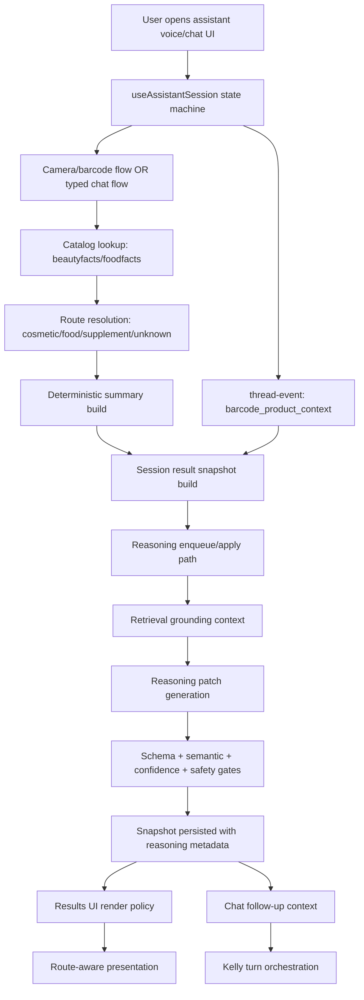
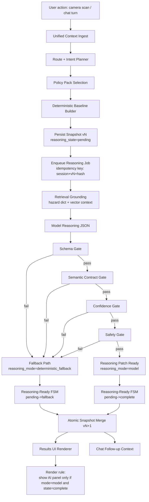

# Landing assistant reasoning — consolidated reference

Last updated: 2026-04-19  
Status: Active — **single source of truth** for this folder (`docs/reasoning/`).

## Table of contents

1. [Architecture overview](#architecture-overview)
2. [Unified reasoning contract](#unified-reasoning-contract)
3. [Schema version policy](#schema-version-policy)
4. [ADR-001: Single-writer, async reasoning, atomic merge](#adr-001-single-writer-async-reasoning-atomic-merge)
5. [Context, worker, and retrieval extensions](#context-worker-and-retrieval-extensions)
6. [Rollout gate (shadow, canary, CI, rollback)](#rollout-gate-shadow-canary-ci-rollback)
7. [Test plan and rollout checklist](#test-plan-and-rollout-checklist)
8. [Observability dashboards](#observability-dashboards)
9. [Eval rubric](#eval-rubric)
10. [Advanced retrieval and graph upgrades](#advanced-retrieval-and-graph-upgrades)
11. [Related runbooks and design docs](#related-runbooks-and-design-docs)

---

## Architecture overview

Scope: Landing assistant scan → snapshot → reasoning → results/chat surfaces.

### Purpose

Architecture reference for reasoning-related behavior in the landing assistant stack. It unifies the flow, contracts, runtime modes, rollout controls, and known current gaps. Normative contracts, ADR, rollout gates, test plan, observability, and eval rubric are **sections below** in this file.

### System boundaries

- **Frontend app (archived)**: `unified-dashboard/_archive/littlelab-landing`
- **Backend API/orchestration**: `middleware-platform/server.js` + Kelly services
- **Snapshot/reasoning services**: `session-result-snapshot-service`, `product-summary-service`, `result-summary-reasoning-service`, `result-summary-retrieval-grounding-service`
- **Catalog providers**: Open Beauty Facts / Open Food Facts

### End-to-end architecture



### Turn processing and context ingestion

**Primary API paths**

- `POST /api/public/landing-assistant/turn`
- `POST /api/public/landing-assistant/thread-event`
- `GET /api/public/landing-assistant/results/:sessionId`
- `POST /api/public/landing-assistant/tts-stream`

**Context path split**

1. **Turn path** (`/turn`): Kelly orchestration and response generation.
2. **Thread-event path** (`/thread-event`): structured scan context (`barcode_product_context`) and snapshot refresh trigger.
3. **Snapshot path** (`/results/:sessionId`): merged deterministic + reasoning output rendered on results page.

### Runtime reasoning modes

Reasoning payloads use:

- `reasoning_mode: 'stub' | 'model' | 'deterministic_fallback'`

Render contract:

- `model`: AI-assisted paneling allowed.
- `stub` and `deterministic_fallback`: deterministic-safe rendering only.
- Missing/unknown mode: treat as non-model.

### Contract and gate stack

The apply pipeline is gated in this order:

1. **Shape/schema validation** (patch format sanity)
2. **Semantic contract checks** (route-valid fields only)
3. **Confidence arbitration** (low-confidence values defer)
4. **Safety/output policy checks** (medical claim and route-safety constraints)
5. **Merge** only allowed fields into snapshot

### Route-aware behavior

- **Food/supplement** must not emit cosmetic framing fields/copy.
- **Cosmetic/hygiene** may render cosmetic-specific surfaces when valid.
- Route-specific UI pruning/collapse is required for unsupported tile families.
- Child-safety and harmful summaries must remain route-appropriate.

### Current architecture reality

The full technical flow (camera → barcode lookup → context ingestion → multi-turn chat) is operational, but chat reasoning quality is still constrained by orchestration precedence:

- Scan context can be ingested and pinned.
- Multi-turn chat can proceed.
- Deterministic/clinical fallback language can still dominate in scan chat turns instead of strongly route-grounded food/supplement reasoning.

This is an orchestration/prompt-policy precedence issue, not a transport outage.

### Feature flags and operational controls

**Flags**

- `REACT_APP_RESULTS_SUMMARY_V1`
- `RESULT_SUMMARY_REASONING_V1`
- `RESULT_SUMMARY_REASONING_MODEL_V1`
- `RESULT_SUMMARY_REASONING_PROVIDER_KILL_SWITCH`

**Rollout pattern**

1. Local verification
2. Staging 100%
3. Production canary (5% → 20% → 50% → 100%)
4. Rollback by flags (no deploy)

Runbook: `docs/runbooks/README.md#reasoning-rollout-runbook`

### Observability model (summary)

Core metrics for reasoning readiness:

- `reasoning.api_error.count`
- `reasoning.provider.call.count`
- `reasoning.mode.fallback.count`
- `result_summary.reasoning.generated.count`
- `reasoning.provider.latency_ms.total`
- `reasoning.provider.latency_ms.count`
- `reasoning.cost.estimated_microusd.total`
- Route regression guards:
  - `result_summary.regression.non_cosmetic.cosmetic_harmful_copy.count`
  - `result_summary.regression.non_cosmetic.key_actives_available.count`
  - `session_result_snapshot.regression.non_cosmetic.nyc_context_present.count`

Alert definitions: `docs/runbooks/README.md#alert-rules`. Per-gate dashboard panel map: [Observability dashboards](#observability-dashboards) in this file.

### Validation and test gates (summary)

- `npm run test:reasoning-regression`
- `npm run eval:reasoning:harness --prefix middleware-platform`
- `node ./middleware-platform/scripts/check-reasoning-flag-state.cjs`

Full matrix: [Test plan and rollout checklist](#test-plan-and-rollout-checklist).

### Known risks and open work

1. **Scan-chat reasoning quality**: scan context is present but can be overridden by generic fallback behavior.
2. **Doc consistency**: legacy stubs elsewhere may describe stub-only behavior while rollout marks model-path work complete.
3. **Alert-to-runbook mapping**: some alert mappings may still point to generic runbooks rather than reasoning-specific procedures.

### Proposed reasoning pipeline (target)

Target architecture to resolve context split, route-precedence drift, and gate-level observability gaps.

**Control-point summary**

1. **Unified context ingest (single writer)** — scan/chat inputs through one context service; idempotent writes; `context_version`.
2. **Route-first planner** — every turn begins with route + intent arbitration; non-cosmetic routes disable skincare-only clarifier branches.
3. **Deterministic baseline first** — persist baseline with `reasoning_state='pending'`.
4. **Async reasoning job** — enqueue by `session_id + snapshot_version + context_hash`.
5. **Strict model output validation** — JSON-only; invalid outputs fail closed to deterministic fallback.
6. **Gate stack with per-gate counters** — schema → semantic → confidence → safety.
7. **Reasoning-ready state machine** — `pending → complete` or `pending → fallback`.
8. **Atomic merge and render contract** — merge only when snapshot/input hash still current; AI panel only when `reasoning_mode='model'` and `reasoning_state='complete'`.
9. **Operational controls** — kill switch, canary ramp, rollback, re-enable checklist.

**Target diagram**



**Recommended gate metrics**

- `reasoning.gate.schema.fail.count`
- `reasoning.gate.semantic_contract.fail.count`
- `reasoning.gate.confidence.defer.count`
- `reasoning.gate.safety.fail.count`
- `reasoning.gate.provider_error.count`

---

## Unified reasoning contract

Status: normative for landing assistant result-summary reasoning.

### Canonical entities

#### `session_context` (orchestration row + derived text)

**Storage:** `patient_orchestrate_sessions` (and related triage rows).  
**Meaning:** durable chat/voice session: `conversation_history`, `flow_state.short_term_thread`, language, turn metadata.  
**Not** the same as a result snapshot: it is the **input** to snapshot assembly.

#### `snapshot` (`session_result_snapshots.snapshot_json`)

**Storage:** `session_result_snapshots` with `is_latest` pointer per `session_id`.  
**Meaning:** versioned JSON document: deterministic scan summary (`result_summary`), optional `scanned_product`, `reasoning_*` fields, `unified_context` (planner output), FSM timestamps, optional `reasoning_fsm_audit` trail.  
**Invariant:** one logical writer assembles baseline; reasoning merges are **atomic** via `applySessionResultReasoningPatch` with lineage checks.

#### `reasoning_job` (`reasoning_jobs` table)

**Columns (core):** `id`, `session_id`, `snapshot_id`, `snapshot_version`, `context_hash`, `input_hash`, `job_key`, `status`, `attempts`, `max_attempts`, `run_at`, `locked_by`, `locked_at`, `started_at`, `finished_at`, `last_error`, `payload_json`, timestamps.  
**Optional:** `heartbeat_at` (migration `049`) — last worker touch while `started`.  
**`status` lifecycle:** `queued` → `started` → `success` | `retry` → `dlq` | `obsolete` | `cancelled`.  
**`payload_json`:** enqueue metadata plus optional `execution_summary` (retrieval + mode) written on successful completion.

#### `reasoning_fsm_audit` (on `snapshot` JSON, capped)

Append-only ring buffer (latest 48 entries) on the snapshot: `{ at, from_state, to_state, actor, reason, snapshot_version }`.  
Excluded from `baseline_hash` so deterministic hashing stays stable; used for merge/FSM forensics.

#### `reasoning_patch` (in-memory object merged into snapshot)

**Transport:** not a separate table row; produced by `buildReasoningPatch` and passed to `applySessionResultReasoningPatch`.  
**Contains:** `reasoning_mode`, `reasoning_model`, `verdict` partials, `reasoning_claim_provenance`, `executed_sources`, `reasoning_retrieval`, `reasoning_model_telemetry`, cost estimates.  
**Gates:** schema → semantic contract → confidence → safety before merge.

### Frozen enum: `reasoning_state` (snapshot top-level + FSM)

| Value | Meaning |
|-------|---------|
| `pending` | Async reasoning may still merge; baseline is authoritative for strict UX gates. |
| `complete` | Lineage-valid merge applied (may still be stub/fallback inside `result_summary.reasoning`). |
| `fallback` | Reasoning path chose deterministic fallback semantics for user-visible reasoning row. |
| `disabled` | `RESULT_SUMMARY_REASONING_V1` off or permanently not enqueued for this snapshot generation. |

**Rules:** Add new values only with a schema / FE contract bump. Do not repurpose strings across releases.

### Frozen enum: `reasoning_mode` (patch + snapshot mirror)

| Value | Meaning |
|-------|---------|
| `model` | Provider JSON successfully applied after gates. |
| `deterministic_fallback` | Provider failed or output unusable; deterministic repair path. |
| `stub` | **Supported.** No provider call (or model off); deterministic stub patch for load/tests/offline. UI must not show model-only panels. |

**Stub policy:** Remains **first-class** for offline CI, cost-zero environments, and kill-switch operation. Deprecation requires ADR + FE contract + migration away from `deterministic-stub` model label parity.

### Backward compatibility — legacy snapshots without `reasoning_state`

1. **Readers** treat missing `reasoning_state` as **`complete`** when `result_summary` exists and no `result_summary.reasoning` block exists (pure deterministic era).
2. When `result_summary.reasoning` exists but no top-level `reasoning_state`, infer:
   - `pending` if `reasoning.status === 'pending'`
   - else `complete` for merged rows.
3. **Writers** always set top-level `reasoning_state` on new snapshots (middleware `buildSessionResultSnapshot`).
4. **FE** must follow [Schema version policy](#schema-version-policy): tolerate absence; never assume model path without `reasoning_mode === 'model'`.

---

## Schema version policy

### Purpose

Define how reasoning payload versions evolve without breaking frontend consumers.

### Version fields

- Snapshot envelope: `schema_version`
- Semantic contract: `result_summary.semantic_contract_version`
- Reasoning model contract: `result_summary.reasoning.reasoning_version`
- Reasoning path indicator: `result_summary.reasoning.reasoning_mode`

### Frozen enums (normative)

Authoritative definitions: [Unified reasoning contract](#unified-reasoning-contract) above.

- **`reasoning_state` (snapshot):** `pending` | `complete` | `fallback` | `disabled`
- **`reasoning_mode` (patch / mirror):** `model` | `deterministic_fallback` | `stub` (**stub remains supported** for offline, CI, and kill-switch operation)

### Compatibility rules

1. **Additive-first changes** — add new fields as optional; do not remove or rename existing fields in-place.
2. **Enum expansion** — add new enum values only when frontend has safe fallback handling; keep existing values stable for one full release cycle.
3. **Breaking changes** — introduce a new version value (`reasoning_version` and/or `semantic_contract_version`); keep old path behind compatibility logic until rollout completion.
4. **Fallback behavior** — missing `reasoning_mode` defaults to deterministic-safe rendering; unknown `reasoning_mode` values are treated as non-model.

### Backend requirements

- `applyReasoningPatch` must ignore stale `semantic_contract_version` patches.
- Contract-invalid fields must not overwrite deterministic baseline.
- Low-confidence reasoning values must defer rather than overwrite.

### Frontend requirements

- Render must tolerate absent reasoning metadata.
- Unsupported/missing fields must degrade to deterministic copy.
- AI-facing panels must render only when `reasoning_mode === 'model'`.

### Test requirements

- Backend test: stale semantic contract version is ignored.
- Backend test: route-invalid fields are rejected.
- Frontend test: legacy payloads without reasoning metadata still render.
- Frontend test: unknown or absent mode never shows AI-specific paneling.

---

## ADR-001: Single-writer, async reasoning, atomic merge

- **Status:** Accepted  
- **Date:** 2026-04-20  
- **Scope:** Landing assistant — session threads → snapshots → reasoning jobs → results UI / chat

### Context

Scan results must stay route-safe, deterministic-first, and consistent under concurrent edits and async model latency. Multiple writers updating the same JSON document caused race and stale-merge risks.

### Decision

1. **Session context** (`patient_orchestrate_sessions` + ingest APIs) is the **append-only narrative** of user/tool events (including `barcode_product_context` transport).
2. **Snapshot assembly** (`buildSessionResultSnapshot`) is the **single deterministic writer** for baseline `result_summary` / `scanned_product` from latest thread + catalog payloads.
3. **Reasoning** runs **asynchronously** via `reasoning_jobs`; workers call `buildReasoningPatch` then **`applySessionResultReasoningPatch`** with `expectedSnapshotId`, `inputHash`, and **merge lineage** (`snapshot_version`, `context_hash`).
4. **Conflicts** resolve by marking jobs `obsolete` or throwing `ReasoningMergeStaleError` — never silent overwrite of newer baselines.

### Consequences

- **Positive:** Clear ownership, testable gates, DLQ/retry semantics, UI can show `pending` then `complete`.
- **Negative:** Extra table and worker deployment concern; requires heartbeat/watchdog discipline (see [Context, worker, and retrieval extensions](#context-worker-and-retrieval-extensions)).
- **Mitigation:** Feature flags, shadow mode, kill switch, and staged rollout runbooks.

### Non-goals

- Replacing Kelly turn orchestration with snapshot writes.
- Merging non-result-summary clinical artifacts into the same JSON blob without separate ADR.

---

## Context, worker, and retrieval extensions

Status: engineering reference (sections M–O follow-on).  
Code: [`landing-route-intent-planner.js`](../../middleware-platform/services/landing-route-intent-planner.js), [`landing-context-ingest-service.js`](../../middleware-platform/services/landing-context-ingest-service.js).

### N1) `barcode_product_context` and unified context writing

**Today**

- Clients send structured scan payloads as thread events with `type: 'barcode_product_context'` (`POST .../thread-event` or unified ingest).
- `appendLandingContextEvent` appends to `flow_state.short_term_thread` with idempotency + `context_version` (single-writer semantics for the **thread**).
- `buildSessionResultSnapshot` reads the **latest** `barcode_product_context.product_data` into canonical fields: `scanned_product`, `product`, `scan_summary`.

**Normative rule**

- Thread rows are an **audit/transport** log; **canonical scan fields** live on the snapshot. Downstream features must prefer `snapshot.scanned_product` / `result_summary`, not re-parse thread text.

**Snapshot marker**

- `snapshot.unified_context.scan_ingest` records the bridge (`thread_event_type`, `canonical_product_fields`).

### N2) Normalized planner outputs on the snapshot

`buildSessionResultSnapshot` attaches:

- `unified_context.schema_version` — contract version for this object (`1`).
- `unified_context.route_context` — `{ route, source, confidence }` from thread + explicit route.
- `unified_context.intent_context` — classifier output (`intent`, booleans).
- `unified_context.policy_pack` — string id from policy resolver.
- `unified_context.arbitration`, `unified_context.flags` — planner arbitration for mixed intents.

Source: `buildLandingRouteIntentPlan` in `landing-route-intent-planner.js`.

### N3) Policy-pack resolver (`food`, `supplement`, `cosmetic`, `unknown`)

**Implementation:** `selectPolicyPack(route, intent)` maps route buckets:

- **Food-like:** `food`, `supplement` → food-biased packs for scan intents.
- **Cosmetic-like:** `cosmetic`, `hygiene` → cosmetic scan packs.
- **Unknown route:** `unknown_scan_policy` / `default_policy` as appropriate.

**Fallback:** unknown route lowers `route_context.confidence` to `low`; packs avoid cosmetic-only UX assumptions.

Exported symbols (for tests / tooling): `selectPolicyPack`, `classifyIntent`, `extractRouteFromThread` alongside `buildLandingRouteIntentPlan`.

### O1) Queue schema and lifecycle

**Table:** `reasoning_jobs` (migration `048`). Entity definition: [Unified reasoning contract](#unified-reasoning-contract).

**Statuses:** `queued`, `started`, `retry`, `success`, `dlq`, `obsolete`, `cancelled`.

**Migration `049`:** adds `heartbeat_at` — updated when a worker **claims** a job (liveness signal for watchdog queries).

### O2) Worker heartbeat and stuck-job watchdog (operational)

**Implemented:** `heartbeat_at` set on claim; `touchReasoningJobHeartbeat` before long model work in the worker.

**Watchdog automation (repo):** `npm run scheduled:reasoning-jobs-reclaim --prefix middleware-platform` (cron every 10–15 minutes). Env: `REASONING_JOB_STUCK_AFTER_MINUTES` (default 30), `DB_PATH`.

**Recommended alert (operational):** still query `started` jobs older than threshold and page if reclaim volume spikes.

- Query `started` jobs where `datetime('now','-15 minutes') > heartbeat_at` (or `locked_at` if `heartbeat_at` null) and alert.
- Env knob: `REASONING_JOB_STUCK_ALERT_SECONDS` (document-only default `900`).
- Remediation: cancel or DLQ after manual triage; replay from scripts if patch idempotent.

### O3) Retrieval graceful degradation

**Patch fields:** `reasoning_retrieval.status` ∈ `none` | `partial` | `ok` | `failed`; `failed_sources` array; `executed_sources[]` with `used` / `failed` / `latency_ms`.

| Condition | Behavior |
|-----------|----------|
| No optional sources used | `none` — model still allowed if other gates pass |
| Optional source failure | `partial` — degrade copy; do not invent retrieval claims |
| Required source failure | `failed` — block merge paths that depend on it (per product-summary gates) |
| Stale / empty vector index | treat as optional failure; metric + runbook triage |

### O4) Execution provenance on jobs

On successful job completion, `payload_json.execution_summary` is merged to include:

- `reasoning_mode`, `reasoning_model`, `reasoning_input_hash`
- `reasoning_retrieval` (compact status + failed_sources)
- `executed_sources` (bounded list for audit)

Inspect via `reasoning-jobs-inspect.cjs` / SQL on `reasoning_jobs`.

### O5) Model prompt allowlist (sanitized fields)

The provider **user** prompt is built only from:

- `category_route`, semantic framing, **sanitized** `ingredients_text` (bounded char budget)
- `routeScopedPromptContext` (built from allowlisted scan hints, not raw PII dumps)
- `hazard_dictionary_matches` (structured keys/labels/severity)
- `scan_tiles` — tile **status** map from `result_summary.tiles` or `scan_summary.tiles`
- `routine_conflicts` — capped array from snapshot
- `profile_context` — `{ primary_concern, secondary_concerns, has_profile_context }` only
- `required_schema` — JSON shape spec, not user free text

**Rules:** `stripMarkupAndUrls`, `truncateToBudget`, optional PII redaction flag; never attach full `conversation_history` or raw thread text to the model payload.

---

## Rollout gate (shadow, canary, CI, rollback)

Operational narrative: `docs/runbooks/README.md#reasoning-rollout-runbook`. This section is the **engineering gates** and **metric thresholds**.

### 1) Shadow mode (compute, no UI merge)

**Flag:** `RESULT_SUMMARY_REASONING_SHADOW_V1=true` (requires `RESULT_SUMMARY_REASONING_V1=true` for jobs to enqueue).

**Behavior:** The async worker still **builds** `reasoningPatch` (model/stub/fallback path per other flags) and marks jobs **success**, but **does not** call `applySessionResultReasoningPatch`. Clients keep the deterministic baseline snapshot; metrics **`reasoning.shadow.patch_built.count`** and **`reasoning.shadow.mode.<mode>.count`** record load.

**Use:** Validate provider cost, latency, and parse rates before merging patches to user-visible snapshots.

**Exit shadow:** Set `RESULT_SUMMARY_REASONING_SHADOW_V1=false`; drain or obsolete queued shadow-era jobs if needed.

### 2) Canary acceptance thresholds (gate failure metrics)

Tune per environment; defaults below are **starting points** for a 30-minute canary window (alert if sustained).

| Metric | Canary hold (investigate if exceeded) |
|--------|----------------------------------------|
| `reasoning.gate.schema.fail.count` rate | > 2% of `reasoning.shadow.patch_built.count` + successful merges, or > 10/min absolute |
| `reasoning.gate.semantic_contract.fail.count` | > 3× trailing 7d median for same route mix |
| `reasoning.gate.confidence.defer.count` | > 40% of patches (investigate route config before product change) |
| `reasoning.gate.safety.fail.count` | any sustained > 0 requires review before continue |
| `reasoning.gate.provider_error.count` | > 1% of provider attempts in window |
| `reasoning.merge.stale_reject.count` | spike only if **merge_success** drops; else may be benign churn |

Correlate with **`result_summary.reasoning.status.*`** and **`reasoning.fsm.transition.*`**.

### 3) Required checks before ramp (CI + manual)

**CI (main branch)** runs:

- `npm run test:reasoning-regression` (reasoning pipeline Jest + food-route landing Jest)
- Middleware Jest suite
- On **Node 20.x**, the **Playwright scan-chat two-turn gate** (`playwright-chat-scan-two-turn-gate.cjs`) against a static `_archive/littlelab-landing` build and the test API (see `.github/workflows/ci.yml`)

**Before production ramp**, from repo root:

```bash
npm run test:reasoning-pre-ramp
```

That runs **`test:reasoning-regression`** plus **`eval:reasoning:harness`** (offline harness in `middleware-platform`).

**Release-gate one-liner** (local: includes scan-chat E2E unless you opt out with `REASONING_RELEASE_SKIP_E2E=1`; CI already runs the scan-chat gate on Node 20):

```bash
npm run test:reasoning-release-gates
REASONING_RELEASE_SKIP_E2E=1 npm run test:reasoning-release-gates   # regression + eval only
```

**Reasoning release gates** (no legacy scan-chat browser E2E; retired with archived littlelab landing):

```bash
npm run test:reasoning-release-gates
```

Record pass/fail in the change ticket.

### 4) Staged rollout and hold windows

| Stage | Traffic / cohort | Hold (min) | Exit criteria |
|-------|------------------|------------|----------------|
| 1 | 5% | 30 | No P0; gate + provider metrics within section 2; no route regression counters |
| 2 | 20% | 30 | Same |
| 3 | 50% | 60 | Same + eval harness green on staging tag |
| 4 | 100% | — | 24h post-ramp watch |

Percentages refer to your **feature-flag rollout** mechanism (sticky cohort or regional), not HTTP load.

### 5) Rollback decision matrix (gate-keyed)

| Primary signal | First action | Second action |
|----------------|--------------|----------------|
| `reasoning.gate.schema.fail` spike | Disable **`RESULT_SUMMARY_REASONING_MODEL_V1`** | Fix schema / prompt; re-run eval harness |
| `reasoning.gate.semantic_contract.fail` spike | Review semantic guard + route map | Temporary shadow-only semantic measurement; adjust contract |
| `reasoning.gate.confidence.defer` spike | Review min confidence / evidence by route | Adjust config, not model temperature, unless rubric change |
| `reasoning.gate.safety.fail` | **Stop ramp** | Incident + template; no silent loosening |
| `reasoning.gate.provider_error` + latency | [REASONING_KILL_SWITCH_RECOVERY.md](../runbooks/README.md#reasoning-kill-switch-recovery) | Kill switch → stabilize → readiness script |
| `reasoning.merge.conflict_reject` + user edits | Document; tune concurrency | Rarely disable reasoning entirely |
| Route regression metrics (non-cosmetic) | Roll back **merge** + model | See `ALERT_RULES.md` regression rows |

### Related runbooks (rollout and incidents)

- [REASONING_GATE_FAILURE_TRIAGE.md](../runbooks/README.md#reasoning-gate-failure-triage)
- [REASONING_KILL_SWITCH_RECOVERY.md](../runbooks/README.md#reasoning-kill-switch-recovery)
- [REASONING_POST_INCIDENT_TEMPLATE.md](../runbooks/README.md#reasoning-post-incident-template)
- [REASONING_ROLLOUT_RUNBOOK.md](../runbooks/README.md#reasoning-rollout-runbook)

Further detail: [Test plan and rollout checklist](#test-plan-and-rollout-checklist), [Observability dashboards](#observability-dashboards).

---

## Test plan and rollout checklist

Status: engineering checklist.

### 1) Unit tests (fast, CI)

| Area | Representative tests / paths |
|------|-------------------------------|
| Gate stack (schema, semantic, confidence, safety) | `middleware-platform/__tests__/reasoning-gates-fsm.test.js`, `middleware-platform/__tests__/reasoning-pipeline.test.js` |
| FSM helpers | `reasoning-gates-fsm.test.js` (`canTransition`, `computePostPatchSnapshotState`) |
| Contract guards | `middleware-platform/__tests__/result-summary-contract-guards.test.js` |

**CI:** `.github/workflows/ci.yml` runs middleware Jest, `test:reasoning-regression`, and `eval:reasoning:harness` (see [Rollout gate](#rollout-gate-shadow-canary-ci-rollback)).

### 2) Integration tests (ingest → pending → job → merge)

| Flow | How it is covered |
|------|-------------------|
| Offline eval harness | `npm run eval:reasoning:harness --prefix middleware-platform` |
| Regression slice | `npm run test:reasoning-regression` (reasoning-pipeline Jest) |

**Gap to watch:** full multi-tenant DB + provider live calls are **not** in default CI; use staging + manual E2E for provider path.

### 3) Load / concurrency (queue + merge races)

| Risk | Tests / mitigations |
|------|---------------------|
| Double enqueue / parallel merge | Covered by `eval:reasoning:harness` and production metrics; restore focused Jest if regressions appear |
| Burst jobs | Local SQLite smoke: `npm run load:reasoning-queue-smoke --prefix middleware-platform`. Staging soak: k6/Artillery when needed; watch `reasoning.worker.*` and merge metrics in [Observability dashboards](#observability-dashboards) |

### 4) Rollout guard — deploy behind flags only

- **Never** enable `RESULT_SUMMARY_REASONING_MODEL_V1` or widen cohort without **`RESULT_SUMMARY_REASONING_V1`** and product owner signoff.
- Frontend **`REACT_APP_RESULTS_SUMMARY_V1`** and backend flags must be **independently** reversible.
- Prefer **`RESULT_SUMMARY_REASONING_SHADOW_V1`** before first user-visible merge ramp (see [Rollout gate](#rollout-gate-shadow-canary-ci-rollback) section 1).

### 5) Stage sequencing (explicit order)

1. **`shadow`** — `RESULT_SUMMARY_REASONING_SHADOW_V1=true`; validate gates, cost, latency; no snapshot merge.
2. **`5%`** cohort — shadow off; merge on; hold 30m; exit per canary table.
3. **`20%`** — hold 30m.
4. **`50%`** — hold 60m; eval harness green on staging tag.
5. **`100%`** — 24h watch; dashboards in observability section.

### 6) Rollback triggers (gate-level + route regression)

Use the **rollback matrix** in [Rollout gate](#rollout-gate-shadow-canary-ci-rollback) section 5, plus:

- **Route regression** — any non-zero row in [ALERT_RULES.md](../runbooks/README.md#alert-rules) category regression section → **stop ramp**, roll back model + merge flags, triage with [LOW_CONFIDENCE_SPIKE.md](../runbooks/README.md#low-confidence-spike) patterns.
- **Stale merge / stale patch** — elevated `reasoning.merge.stale_reject.count` or `reasoning.fsm.transition.rejected_stale_patch.count` with **falling** `reasoning.merge.merge_success.count` → hold ramp; investigate edit concurrency and job lineage (see [REASONING_GATE_FAILURE_TRIAGE.md](../runbooks/README.md#reasoning-gate-failure-triage)).

### Signoff block (paste in change ticket)

- [ ] Unit + regression CI green  
- [ ] Eval harness green  
- [ ] E2E scan-chat gate green (or `REASONING_RELEASE_SKIP_E2E=1` documented + follow-up)  
- [ ] Dashboards updated / linked for this release  
- [ ] Rollback owner identified  

---

## Observability dashboards

Status: implementation guide for Azure Monitor / Application Insights.  
Related: [ALERT_RULES.md](../runbooks/README.md#alert-rules), [REASONING_GATE_FAILURE_TRIAGE.md](../runbooks/README.md#reasoning-gate-failure-triage).

### Goals

- One dashboard row **per gate** (not only aggregate `reasoning.mode.fallback.count`).
- One row for **FSM transitions** and **pending → terminal latency**.
- One row for **merge health** (success, stale, conflict, stale-patch rejects).
- One row for **route regression** counters (already in `ALERT_RULES.md` section 5).

### Panel set A — Gate failure rates (15m rolling)

| Panel title | Metric(s) | Notes |
|-------------|------------|--------|
| Schema gate | `reasoning.gate.schema.fail.count` | Split by `*.route.*` if dimensions exist |
| Semantic gate | `reasoning.gate.semantic_contract.fail.count` | Correlate with `reasoning.unsupported_for_route.count` |
| Confidence defer | `reasoning.gate.confidence.defer.count` | Ratio vs `result_summary.reasoning.generated.count` |
| Safety gate | `reasoning.gate.safety.fail.count` | Any sustained > 0 → page per rollout gate |
| Provider error gate | `reasoning.gate.provider_error.count` | Over `reasoning.provider.call.count` |

**KQL (customMetrics) template** — adjust `cloud_RoleName` / `app` filters:

```kusto
customMetrics
| where name startswith_cs "reasoning.gate."
| where timestamp > ago(24h)
| summarize sum(valueSum) by name, bin(timestamp, 5m)
| render timechart
```

### Panel set B — FSM transitions

`recordTransition` emits **`reasoning.fsm.transition.<from>_to_<to>.count`** (e.g. `pending_to_complete`, `pending_to_fallback`, `complete_to_fallback`).

| Panel title | Metric pattern | Notes |
|-------------|----------------|-------|
| FSM transition volume | `reasoning.fsm.transition.*.count` | Multi-series by metric name |
| FSM invalid / stale patch | `reasoning.fsm.transition.rejected.count`, `reasoning.fsm.transition.rejected_stale_patch.count` | Should stay low vs merges |
| Pending → terminal latency | `reasoning.fsm.transition.latency_ms.pending_to_terminal.total` / `...count` | Derived p50/p95 in workbook |

```kusto
customMetrics
| where name startswith_cs "reasoning.fsm.transition."
| where timestamp > ago(24h)
| summarize sum(valueSum) by name, bin(timestamp, 5m)
| render timechart
```

### Panel set C — Merge and async worker

| Panel title | Metric(s) |
|-------------|-----------|
| Merge success | `reasoning.merge.merge_success.count` |
| Stale / conflict rejects | `reasoning.merge.stale_reject.count`, `reasoning.merge.conflict_reject.count` |
| Stale reject rate | `stale_reject / max(merge_success,1)` over 15m (see ALERT_RULES section 11) |
| Worker lifecycle | `reasoning.worker.enqueued.count`, `reasoning.worker.success.count`, `reasoning.worker.dlq.count`, `reasoning.worker.retry.count` |

### Panel set D — Outcomes (not only fallback)

| Panel title | Metric(s) |
|-------------|-----------|
| Reasoning status by route | `result_summary.reasoning.status.*.count` |
| Mode mix | `reasoning.mode.model.count`, `reasoning.mode.stub.count`, `reasoning.mode.fallback.count` |
| Shadow load | `reasoning.shadow.patch_built.count` |

### Panel set E — Route regression (non-cosmetic)

Wire existing alert metrics into the same workbook for correlation during reasoning ramps:

- `result_summary.regression.non_cosmetic.cosmetic_harmful_copy.count`
- `result_summary.regression.non_cosmetic.key_actives_available.count`
- `session_result_snapshot.regression.non_cosmetic.nyc_context_present.count`

### Workbook layout (suggested)

1. **Summary strip** — incident links: kill-switch runbook, gate triage, rollout gate.
2. **Rows A–E** above as horizontal sections with 4h default range.
3. **Annotations** — deploy markers and flag-change timestamps (manual).

### Implementation notes

- If metrics are emitted only as **StatsD / custom telemetry**, map the same names in Azure **custom metrics** or **Log Analytics** ingestion.
- For **multi-region**, duplicate panels with `region` filter or separate workbook tabs.

---

## Eval rubric

### Scope

Offline scoring rubric for reasoning quality before canary and before 100% rollout.

### Core dimensions

- **Route safety**
  - Food/supplement outputs must avoid cosmetic framing.
  - Non-cosmetic routes must not emit alternatives candidates.
  - Cosmetic/hygiene routes may emit alternatives when confidence/evidence gates pass.
- **Harm precision**
  - Harmful flags should align with route-valid evidence.
  - Cosmetic: fragrance/preservative signals are valid.
  - Food: avoid skincare-active interpretation of food acids.
- **Child safety**
  - Food dye scenarios should produce caution when route-valid signals exist.
  - Cosmetic scenarios should not use food additive logic.

### Scoring

Each case scores integer points across:

- `route_safety`
- `harm_precision`
- `child_safety`

Aggregate scores compare deterministic baseline vs model-backed path.

### Harness

Run:

`npm run eval:reasoning:harness --prefix middleware-platform`

Output:

- `middleware-platform/test-results/reasoning-eval-baseline-<timestamp>.json`

### Release use

Use score diffs to validate that model-backed path does not regress route safety while improving reasoning completeness.

---

## Advanced retrieval and graph upgrades

### Pinecone-backed grounding expansion

**Current status**

- Readiness checks implemented (`verify:reasoning:pinecone-readiness`)
- Provenance claims are guarded when Pinecone is unavailable

**Next expansion**

- Enable semantic retrieval as an executed source only when:
  - Pinecone is configured
  - index has non-zero vectors
  - retrieval returns non-empty matches
- Add top-hit citations to reasoning evidence refs.

### Graph traversal upgrades

**Current status**

- Route-aware deterministic and reasoning guardrails are in place.

**Planned strategy**

- Add deeper conflict-graph traversal for cross-product interactions.
- Gate graph traversal by route and confidence thresholds.
- Emit graph execution provenance only when traversal actually runs.

### Thought strategy (GoT/ToT)

**Policy**

- Keep single-pass reasoning as default.
- Enable GoT/ToT only after:
  - stable model baseline
  - enough production call volume
  - quality baseline proves incremental value

**Safety constraints remain mandatory**

- no diagnosis/cure language
- confidence and evidence gates
- route-safe contract enforcement

---

## Related runbooks and design docs

- `docs/runbooks/README.md#reasoning-rollout-runbook`
- `docs/runbooks/README.md#reasoning-canary-rehearsal-note`
- `docs/runbooks/README.md#alert-rules`
- `docs/runbooks/README.md#dlq-tool-calls-incident-note`
- [`docs/middleware-platform/README.md#agentic-reasoning-solution-design`](../middleware-platform/README.md#agentic-reasoning-solution-design) — supplemental diagrams/history; canonical reasoning text is this README
