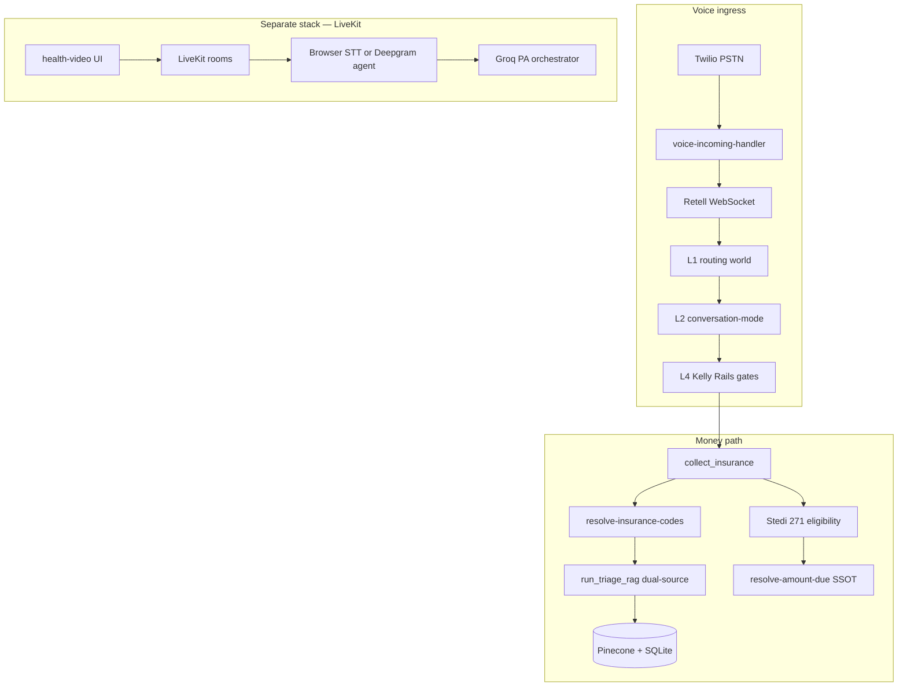
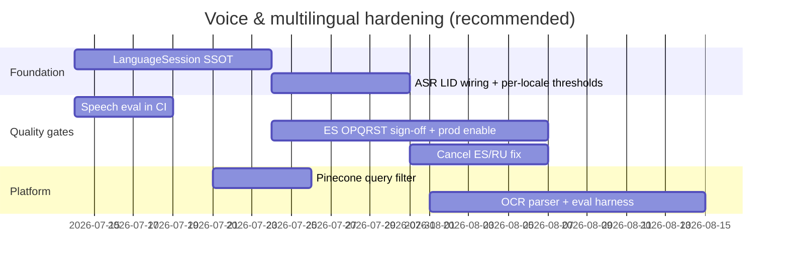

# Somo Codebase Review — Voice, Multilingual & Platform Architecture

**Date:** 2026-07-11  
**Scope:** Payers, orchestration, layers, Pinecone/RAG, voice agent, augmentation, medical coding, knowledge base, location/providers, LiveKit, OCR/ASR evaluation  
**Focus:** Voice agent quality and multilingual functionality  
**Audience:** Engineering leadership, product, clinical sign-off

---

## Executive summary

Somo is a **mature, production-oriented healthcare voice platform** with unusually strong documentation, SSOT discipline, and test harnesses for a startup-scale codebase. The Kelly front-desk path (Twilio → Retell → Kelly Rails v2) is the real product; LiveKit powers a separate, deferred consumer health video line.

**Overall rating: 7.0 / 10**

| Area | Rating | One-line verdict |
|------|--------|------------------|
| Voice agent (English PSTN) | **7.5 / 10** | Layered routing, gate-owned transactions, ASR quality gate, voice-optimized RAG |
| Voice multilingual | **5.5 / 10** | Real en/es/ru/zh presets and handoff, but heuristic detection, partial gate coverage, Spanish OPQRST blocked on prod |
| Orchestration (Kelly Rails) | **7.5 / 10** | Deterministic gates + bounded LLM; legacy fallback path adds complexity |
| Medical coding / RAG | **7.0 / 10** | Dual-source retrieval, ranking SSOT, nightly eval; prod DB parity and clinical sign-off pending |
| Pinecone / tenant isolation | **6.5 / 10** | Ingest metadata solid; query-time filter is post-hoc only |
| Payers / plans / benefits | **7.0 / 10** | Stedi spine + plan_rules SSOT; runtime payor ER still shadow-mode in places |
| Providers / locations | **6.5 / 10** | NPPES + portal exist; multi-site location_id deferred; public search stubbed |
| LiveKit / video voice | **6.0 / 10** | Works for health + telehealth; not integrated with PSTN; server STT off by default |
| OCR pipeline | **4.0 / 10** | GPT-4o vision extraction exists; missing parser files, zero OCR eval metrics |
| Speech / ASR evaluation | **5.0 / 10** | Runtime metrics + offline WER script; not in CI; tiny golden set |

**Bottom line:** This is one of the better-documented voice-first healthcare stacks in the wild. The gap between "engineering complete" and "multilingual production-grade" is real — especially for Spanish clinical rails, ASR-native language routing, and unified eval across OCR/ASR/coding.

---

## 1. Platform architecture at a glance



**Two voice stacks — do not conflate:**

| Stack | Entry | ASR | Orchestrator |
|-------|-------|-----|--------------|
| **Kelly front desk** (primary) | Tenant DID via Twilio | Retell (vendor) | Kelly Rails v2 + gates |
| **Somo Health video** (deferred P9) | `/health-video/` | Web Speech API or Deepgram | Groq PA orchestrator |
| **Provider telehealth** | `video-call.html` | LiveKit + optional Deepgram | `video-consult-graph` copilot |

Canonical refs: [`docs/architecture/PLATFORM_SNAPSHOT.md`](../architecture/PLATFORM_SNAPSHOT.md), [`docs/voice/VOICE_ROUTING_ARCHITECTURE.md`](../voice/VOICE_ROUTING_ARCHITECTURE.md)

---

## 2. Domain reviews

### 2.1 Payers / payors / plans

**What exists**

- **Runtime Stedi track:** `insurance_payers` table, `payer-gateway-service.js`, X12 271 eligibility via `insurance-service.js`
- **Entity resolution track:** Offline ingest → `payor_canonical_entities` + aliases; runtime resolver behind feature flags (`payor-registry-resolver-service.js`)
- **Benefits SSOT:** `resolve-amount-due.js` with documented precedence ([`BENEFITS_PRECEDENCE.md`](../Medical%20Coding/BENEFITS_PRECEDENCE.md)): Stedi hard copay → block thin/inactive → plan_rules → RCM journey
- **CMS MA consumer search:** `public-plan-search.js` (ZIP + benefits/premiums/service areas)
- **Dental/medical class routing:** `payer-class-routing.js` prevents medical payer on dental tenant

**Strengths**

- Clear money-path precedence; insured checkout never falls back to raw `visit_pricing`
- Eligibility quality classification (`hard_copay`, `thin`, `simulate`, `inactive`) drives deterministic behavior
- Extensive payor ER pipeline documented in [`docs/Payor/OPERATIONS.md`](../Payor/OPERATIONS.md)

**Gaps**

| Gap | Impact |
|-----|--------|
| Runtime payor resolver still shadow/enable rollout | Name→payer_id resolution inconsistent in prod |
| Vendor data (Office Ally/Inovalon) procurement-dependent | Canonical entity fill incomplete |
| `plan_rules` is flat-copay model | Complex benefit designs under-modeled |
| `providerId`/`locationId` on quote → `defer` | Multi-site pricing not live |
| Live Stedi multilang eval pending (M6) | Copay path not validated under real 271 in ES/RU |

**Key files:** `middleware-platform/services/resolve-amount-due.js`, `eligibility-orchestrator.js`, `payer-quote-service.js`, `kelly-tool-executor/collect-insurance.js`

---

### 2.2 Orchestration

**What exists**

Kelly Rails v2 is the primary brain:

```
retell-websocket.js
  → voice-routing-world.js (L1)
  → conversation-mode/ (L2: 8 modes, subrails, tool firewall)
  → kelly-rails/orchestrator.js (L4: ordered gates)
  → kelly-tool-executor.js (schedule, collect_insurance, …)
```

- **Gate registry:** Deterministic gates own transactional steps (schedule, insurance, cancel, records) before bounded LLM in `node-runner.js`
- **Deprecated fallback:** `patient-orchestrator-service.js` still wired when `KELLY_LLM_ENABLED=0`
- **RCM orchestration:** `rcm-journey-orchestrator.js` for stages 1–12 visibility
- **Outbound:** `outbound-call-service.js` (Twilio-direct) with TCPA, quiet hours, billing gates

**Strengths**

- Gate-owned booking/insurance is the right pattern for voice — reduces hallucinated tool calls
- `voice-orchestration-trace.js` enriches turns with `gate_matched`
- CI orchestration TCR: `test:rails:orchestration` in GitHub Actions
- ASR normalization wired before intent detection

**Gaps** (from [`ORCHESTRATION_GAP_MATRIX.md`](../architecture/ORCHESTRATION_GAP_MATRIX.md))

| ID | Gap | Severity |
|----|-----|----------|
| `prompt-bounding-locale` | Sticky locale partial; some English-only gate strings | P2 |
| `outbound-orchestration` | Operator outbound subrail partial | P1 |
| `telemetry-completeness-audit` | Not 100% path coverage | P1 |
| Dual orchestration paths | patient-orchestrator fallback increases cognitive load | P2 |
| `turn-planner.js` | Partial single-turn authority | P1 |

---

### 2.3 Layers (L1 → L4)

| Layer | Responsibility | Key service |
|-------|----------------|-------------|
| **L1** | Routing world + call site context | `voice-routing-world.js`, `call-site-context.js` |
| **L1.5** | Site admission (DID → clinic verify) | `voice-identity-admission.js` |
| **L2** | Conversation mode / subrail / step | `conversation-mode/` |
| **L3** | Guardrails + tool firewall | `mode-tool-firewall.js` |
| **L4** | Kelly Rails gates + bounded LLM | `kelly-rails/` |

**Assessment:** Layer separation is well-designed and documented. The main risk is **L2/L4 locale drift** — conversation mode state and gate replies don't always share the same language lock.

---

### 2.4 Pinecone / RAG / knowledge base

**Retrieval SSOT:** `knowledge-service.getCodeCandidatesDualSource()`

Parallel legs:
1. **Remote:** Pinecone code metadata (`pinecone-code-metadata-client.js`) — optional Colab Flask fallback
2. **Local:** SQLite keyword + hybrid semantic over `code_embeddings`

**Embedding strategy**

| Setting | Value |
|---------|-------|
| Model | `text-embedding-3-small` |
| Dimensions | 1536 |
| Index SSOT | SQLite `code_embeddings` → `pinecone-code-metadata-ingest.cjs` |

**Tenant isolation (MT-03)**

- Ingest: `chunk_kind: global | tenant`; tenant rows require `clinic_id`
- Query: **Post-filter only** in `pinecone-tenant-filter.js` — no server-side metadata filter in Pinecone query
- Cross-tenant vectors consume topK budget before discard

**Augmentation layers**

| Layer | Source |
|-------|--------|
| Phrase expansion | `lay-language-icd-expansions.json`, medical abbreviations |
| Term corrections | `icd10_term_corrections.json` |
| HyDE | `triage-rag-service-v2.js` — **chat only** |
| Guideline/negation | `guideline-resolver.js`, `negative-constraints.js` |
| Perceptual rerank | `reranking-service.js` (lexical, no cross-encoder) |
| Confidence caps | `coding-orchestrator.js` |

**Voice vs chat asymmetry**

| Dimension | Voice | Chat |
|-----------|-------|------|
| Remote RAG timeout | 2000 ms | 8000 ms |
| HyDE | Off | On |
| Full spine before collect | Yes | May show early ICD hint |

Ref: [`VOICE_CHAT_RAG_ASYMMETRY.md`](../Medical%20Coding/VOICE_CHAT_RAG_ASYMMETRY.md)

**Knowledge assets:** `Knowledge/rules/`, `Knowledge/RAG/`, `Knowledge/CDT/` — well-organized JSON rule packs with CI gates.

**Gaps**

- Query-time Pinecone tenant filter missing (post-filter wastes recall)
- Prod DB parity: dev ~17,170 CPT vs prod ~16,851 MPFS rows
- Patient education RAG still on legacy Colab URL
- F-09 clinical sign-off pending (Appendix C, 7 items)
- No ElasticSearch / Cohere rerank

---

### 2.5 Medical coding

**Voice golden path:**

```
store_triage_opqrst → store_triage_rich_intake → run_triage_rag
  → select-primary-codes.js (CP-05 ranking SSOT)
  → resolve-insurance-codes.js
  → collect_insurance → quote → book → coding-orchestrator → Stedi 837P
```

**Path router** (`resolve-visit-codes.js`):

| Tenant | Path | Retrieval |
|--------|------|-----------|
| Dental | admin | Phrase map + CDT SQL — no Pinecone |
| healthcare_clinic | admin | `CLINIC_TRIGGER_MAP` |
| Dermatology | RAG | Full dual-source triage |

**Eval:** `evaluate-accuracy.js` — 150+ golden cases; CI fast mode vs nightly prod (semantic + Pinecone). **This is coding accuracy, not speech/OCR.**

**Rating rationale (7/10):** Engineering-complete spine with strong SSOT and test gates; held back by clinical sign-off, prod parity, and voice/chat asymmetry not yet approved.

---

### 2.6 Voice agent (PSTN / Kelly)

**Ingress flow:**

```
POST /voice/incoming
  → billing + concurrent + rate limit admission
  → Retell register call
  → WebSocket retell-websocket.js
  → kelly-turn-resolver.js (ASR gate, language validation)
  → Kelly Rails executeTurn
```

**ASR handling**

- Vendor: Retell STT (no in-repo ASR engine for PSTN)
- Quality gate: `kelly-asr-gate.js` — confidence threshold 0.75; clarify → 2-streak handoff
- Metrics: `voice-speech-metrics.js` — STT latency, RTF, confidence counters

**Latency controls**

- Voice RAG: 2 s timeout, HyDE disabled (`voice-rag-config.js`)
- Turn rate limit: 120/min per call_id
- Redis-backed concurrent/admission for Cloud Run scale

**Scale tiers:** Starter 2 concurrent / 30 req-min; Practice 5/75; Clinic Pro 10/150

**Rating rationale (7.5/10 EN):** Production-grade admission, routing, gate architecture, and latency budgeting. Deductions for vendor ASR lock-in, partial telemetry, and outbound subrail gaps.

---

### 2.7 Multilingual voice (deep dive)

**Tenant presets** (`tenant-language-config.js`):

| Preset | Languages |
|--------|-----------|
| `en_only` | English |
| `en_es` | English + Spanish |
| `en_ru` | English + Russian |
| `en_zh` | English + Mandarin |

**Detection** (`kelly-rails/language.js`):

- Keyword/script heuristics (Spanish, Portuguese, Cyrillic, Han, etc.)
- Explicit preference ("habla español")
- Session persistence via `db.upsertKellySessionLanguage`
- Unsupported language → `forceLanguageHandoff`

**Localized surfaces**

- Deterministic gate replies: es/ru/zh packs in `kelly-rails/prompts/`
- Insurance gate carrier regex: es/ru/zh patterns
- Copay SMS: `formatCopayPaymentSms` (EN/ES/RU)
- Escalation copy: `escalation-service.js`

**Strict multilang eval baseline:** 14/16 majority pass (3-run strict)

| Scenario | Pass |
|----------|------|
| booking | 3/3 |
| copay_eligibility | 3/3 |
| copay_payment | 3/3 |
| inquiry | 4/4 |
| **cancel** | **1/3** (ES-3 / RU-3 open) |

**Critical gaps**

| Gap | Detail |
|-----|--------|
| **Spanish OPQRST not prod-ready** | `KELLY_RAILS_ES_ENABLED=1` + `KELLY_OPQRST_ES_PACK=v1` + signoff file required |
| **Heuristic detection, not ASR LID** | Retell `asr_language` logged but not primary routing signal |
| **Mandarin = handoff only** | No sustained ZH dialogue path per product gate |
| **Language lock partial** | P2 ticket `prompt-bounding-locale` still open |
| **Same ASR threshold all locales** | 0.75 confidence — no per-language calibration |
| **No real-time translation** | PSTN transcripts not translated for provider review |
| **12 language codes in ALLOWED_CODES** | Only 4 presets with gate coverage |
| **Translation API gated off** | `ENABLE_RESPONSE_TRANSLATION` / `global.translateApi` not default |

**Rating rationale (5.5/10):** Meaningful bilingual presets and eval harness exist — unusual for this stage. Not production-grade multilingual because detection is fragile, Spanish clinical rails are gated, cancel flows fail in ES/RU, and there is no unified language SSOT across PSTN and video.

---

### 2.8 LiveKit / video voice

**Consumer health** (`health-*` rooms):

- UI langs: en, sw, fr, es (`LanguageGrid.jsx`)
- Browser STT: en, sw, es only — **French UI has no STT mapping**
- Server STT: Deepgram Nova-3 with `language=multi` when `VIDEO_STT_MODE=auto` — **off by default**
- Orchestrator: Groq PA — replies in `reply_language`; **not Kelly Rails**

**Provider telehealth** (`appt-*` rooms):

- LiveKit token via `routes/livekit.js`
- Copilot: `video-consult-graph.js` with 12 s RAG debounce

**Assessment:** LiveKit is a solid secondary stack but intentionally decoupled from PSTN Kelly. Multilingual is weaker than front desk presets; no shared language service.

---

### 2.9 Providers / locations

**Providers**

- Portal: `provider-service.js`, 19 E2E specs
- Directory: NPPES import (`039_nppes_directory_providers.js`), geo search (`provider-search-service.js`)
- Network evidence: precheck + drift quality services
- **Stub:** `public-provider-search.js` returns 503

**Locations**

- Geocoding, delivery verification, payor US location pipeline
- Voice: `call-site-context.js` with `location_id`
- **Deferred:** Multi-site `location_id` on quotes ([`DEFERRED-A7-LOCATION-ID.md`](../voice/DEFERRED-A7-LOCATION-ID.md))
- PMS: Dentrix `location_id` in adapter

**Assessment:** Infrastructure exists; product integration for multi-site and public search is incomplete.

---

### 2.10 OCR & speech evaluation (against your metric tables)

#### Table 1: OCR metrics — current state

| Metric | Status in codebase |
|--------|-------------------|
| CER | **Not implemented** |
| WER (OCR) | **Not implemented** |
| Detection Precision/Recall/F1 | **Not implemented** |
| IoU | **Not implemented** |
| Line/Block Accuracy | **Not implemented** |
| Layout/Segmentation Accuracy | **Not implemented** |
| Processing Latency | Partial — no OCR-specific timing |
| Throughput | **Not implemented** |
| Confidence Scores | GPT-4o vision returns unstructured JSON — no per-token confidence |
| End-to-End Accuracy | **Not implemented** |

**What exists:** `patient-document-extraction.js` (PDF + GPT-4o vision), `patient-billing-portal.js` upload flow, `patient-records-query-service.js` RAG over extracts.

**Broken references:** `billing-ocr-parser` required in routes but **file missing**; `ocr-service.js` documented but **not found**.

#### Table 2: Speech recognition metrics — current state

| Metric | Status in codebase |
|--------|-------------------|
| WER | **Implemented offline** — `speech-asr-eval.cjs` |
| CER | **Implemented offline** — same script |
| SER | **Implemented offline** — same script |
| PER | **Not implemented** |
| RTF | **Runtime** — `voice-speech-metrics.js` |
| Latency | **Runtime** — end-of-turn STT latency recorded |
| WRR | Derivable (1 − WER) but not reported |
| Confidence Scores | **Runtime** — per-utterance from Retell |
| Speaker Diarization Accuracy | **Not implemented** (Phase 3 roadmap) |
| OOV Rate | **Not implemented** |
| Noise Robustness (SNR-varied WER) | **Not implemented** |
| Domain-Specific Accuracy | Partial — 5 + 30 golden pairs; not healthcare-domain sized |

**CI gap:** `speech-asr-eval.cjs` is **not in nightly CI** (unlike `evaluate-accuracy.js` for coding).

---

## 3. How I would build the voice agent better

### 3.1 Core architecture changes

**1. Single language spine (highest ROI)**

Today: `tenant-language-config.js` (PSTN), `kelly-rails/language.js` (detection), `prompt-bounding-locale.js` (sticky), health session `reply_language` (video) — four partial systems.

**Better:** One `LanguageSession` service:

```javascript
// Conceptual API
LanguageSession.resolve({
  tenantPreset,        // en_es, en_ru, …
  asrLanguage,         // from Retell/Deepgram LID
  transcriptHints,     // script/keyword detection
  explicitPreference,  // "habla español"
  confidence           // ASR confidence
}) → { locale, replyLocale, ttsVoice, handoffRequired, gatePack }
```

Every gate, SMS template, and tool prompt reads from this object. No drift between L2 mode and L4 gate copy.

**Why:** Multilingual bugs in this codebase are almost all **locale drift** (gate says English, SMS says Spanish, OPQRST pack mismatched). A single spine fixes 80% of ES/RU cancel failures without new ML.

---

**2. ASR-native language routing, not keyword heuristics**

Today: Retell provides `asr_language` and confidence; routing uses keyword/script hints.

**Better:**

- Primary signal: vendor LID (`asr_language`) when confidence > threshold
- Secondary: script detection for first-turn cold start
- Tertiary: explicit user preference (always wins)
- Per-locale ASR thresholds (Spanish often scores lower on English-tuned models)

**Why:** Keyword detection fails on code-switching ("I have Blue Cross, necesito una cita"), accented English, and short utterances — exactly the NYC front-desk demographic this product targets.

---

**3. Streaming partial intent — don't wait for full turn**

Today: Full utterance → Kelly Rails → optional 2 s RAG → reply.

**Better:**

```
Partial transcript (200ms)
  → fast intent classifier (schedule | insurance | cancel | clinical)
  → prefetch: slots, payer cache, session state
Full transcript
  → gate executes with warm cache
```

**Why:** Voice UX is bounded by **end-of-turn latency + RAG + LLM**. Prefetch during speech cuts perceived latency 300–800 ms without sacrificing gate correctness.

---

**4. In-house ASR fallback path (or LiveKit SIP bridge)**

Today: 100% Retell STT for PSTN; no fallback.

**Better:** Abstract `SpeechToTextProvider`:

| Provider | Use case |
|----------|----------|
| Retell (default) | Production PSTN |
| Deepgram Nova-3 multi | Fallback / eval replay / multilingual tenants |
| Browser Web Speech | Health video |

Run `speech-asr-eval.cjs` in CI against all providers; gate deploy on WER regression.

**Why:** Vendor lock-in on ASR is the biggest blind spot for multilingual quality. You cannot improve what you cannot measure or swap.

---

**5. Locale-complete gate packs — ship or don't advertise**

Today: 12 codes in `ALLOWED_CODES`; 4 presets; Spanish OPQRST gated.

**Better:** For each supported locale, require:

- [ ] OPQRST field prompts
- [ ] All deterministic gate replies (schedule, cancel, reschedule, records, insurance, handoff)
- [ ] SMS templates (copay, reminder, payment link)
- [ ] Golden conversation eval 3/3 strict
- [ ] Clinical sign-off document

**Do not enable a locale in tenant preset until checklist passes.** Mandarin should remain handoff-only until sustained dialogue pack exists.

**Why:** Partial localization is worse than English-only — it erodes trust when cancel works in English but fails in Spanish.

---

**6. Real-time translation layer (provider-facing)**

Today: PSTN transcripts stored as spoken; no translate-to-English for staff.

**Better:**

- Store `{ text_original, text_english, locale, confidence }` on every turn
- Provider portal shows English summary; patient hears native language
- Schema already exists on `health_session_transcripts` — extend to Kelly call events

**Why:** Multilingual front desk succeeds when **staff can operate in English** while **patients speak their language**. This decouples patient UX from staff tooling.

---

**7. Unified eval pipeline (OCR + ASR + coding + conversation)**

Today: Three siloed eval systems.

**Better:** Single nightly workflow:

| Suite | Metrics | Gate |
|-------|---------|------|
| `eval:coding:prod` | ICD/CPT recall@5 | Existing |
| `eval:speech:wer` | WER/CER/SER by locale | WER ≤ 15% |
| `eval:ocr:fields` | Field accuracy on bill photos | TBD |
| `eval:multilang:strict` | 16 scenarios × 3 runs | 16/16 |
| `eval:conversation:pstn` | Tool correctness + latency P95 | Existing harness |

**Why:** Production confidence requires regression gates on the actual failure modes (misheard insurance ID, wrong copay language, missed cancel intent).

---

### 3.2 Pinecone / RAG improvements for voice

1. **Server-side tenant filter in Pinecone query** — stop wasting topK on cross-tenant vectors
2. **Voice-specific candidate budget** — return top-3 ICD + top-2 CPT within 1.5 s; defer full ranking to post-call
3. **Locale-aware phrase expansion** — `lay-language-icd-expansions.json` is English-centric; add es/ru/zh symptom maps
4. **Streaming RAG** — start local SQLite leg immediately; merge Pinecone hits if they arrive within budget

---

### 3.3 Orchestration improvements

1. **Retire patient-orchestrator fallback** — one orchestration path reduces bugs
2. **Complete turn-planner authority** — gates + planner agree on single `_turn_plan` per turn
3. **Outbound subrail state machine** — operator reminder calls need same gate rigor as inbound
4. **100% orchestration trace** — every turn emits `gate_matched` + language + ASR confidence

---

## 4. Comprehensive improvement backlog

### P0 — Voice & multilingual (next 4–6 weeks)

- [ ] Ship `LanguageSession` SSOT across PSTN + health video
- [ ] Wire Retell/Deepgram `asr_language` as primary LID signal
- [ ] Per-locale ASR confidence thresholds
- [ ] Complete Spanish OPQRST sign-off + enable `KELLY_RAILS_ES_ENABLED` in prod
- [ ] Fix cancel/reschedule ES-3 / RU-3 (currently 1/3 strict pass)
- [ ] Close `prompt-bounding-locale` (P2) — sticky locale end-to-end
- [ ] Add `eval:speech:wer` to nightly CI with locale-stratified report
- [ ] Expand speech golden set from 35 → 200+ healthcare utterances (insurance IDs, names, dates, codes)

### P0 — Platform reliability

- [ ] Pinecone query-time tenant metadata filter
- [ ] Prod DB parity (CPT MPFS row gap)
- [ ] F-09 clinical sign-off (Appendix C)
- [ ] Live Stedi multilang eval (M6)
- [ ] Redis required before Cloud Run `min-instances > 1`

### P1 — OCR & documents

- [ ] Implement or remove `billing-ocr-parser` reference
- [ ] Create OCR golden set (50+ bill/EOB photos with field-level ground truth)
- [ ] OCR eval script: field accuracy, CER on amount/claim number fields
- [ ] Processing latency + confidence per extracted field
- [ ] Wire OCR eval into nightly CI

### P1 — Providers & locations

- [ ] Implement public provider search (remove 503 stub)
- [ ] Multi-site `location_id` on quotes (undefer A7)
- [ ] Provider availability admission gate (full, not partial)

### P1 — LiveKit / video

- [ ] French STT mapping in `useBrowserStt.js` or remove FR from UI
- [ ] Enable server STT path with documented ops runbook
- [ ] Populate `text_translated` on health transcripts
- [ ] Shared `LanguageSession` with PSTN stack

### P2 — RAG & coding

- [ ] Locale-aware lay-language expansions
- [ ] Cross-encoder rerank (Cohere or local)
- [ ] Unify patient education RAG off Colab
- [ ] Voice/chat asymmetry clinical approval or alignment
- [ ] Stedi webhook learning loop (`code_acceptance_rates`)

### P2 — Payor & benefits

- [ ] Production-enforce canonical payor resolver
- [ ] Expand plan_rules beyond flat copay
- [ ] Provider/location-aware quoting

### P3 — Advanced speech metrics (your Table 2)

- [ ] PER (phoneme error rate) for medical terms
- [ ] Diarization accuracy (DER) for multi-party calls
- [ ] OOV rate on medical vocabulary
- [ ] SNR-varied WER (noise robustness suite)
- [ ] Domain-specific WER on insurance/billing utterances
- [ ] Batch ASR replay from recorded Retell calls

### P3 — Advanced OCR metrics (your Table 1)

- [ ] Detection precision/recall/F1 for text regions
- [ ] IoU-based box matching
- [ ] Line/block accuracy
- [ ] Layout/segmentation accuracy (header vs table vs body)
- [ ] Throughput benchmarks (images/sec)
- [ ] End-to-end document field accuracy

### P3 — Architecture cleanup

- [ ] Retire `patient-orchestrator-service.js`
- [ ] Single orchestration trace taxonomy
- [ ] Hosted observability dashboards for payor ingest + speech metrics

---

## 5. Recommended build sequence



---

## 6. Ratings detail — why not higher?

**What earns 7+:**

- SSOT discipline (`resolve-amount-due`, `select-primary-codes`, routing worlds)
- Gate-owned orchestration (correct pattern for healthcare voice)
- Extensive docs, verify scripts, CI gates — rare at this scale
- Real multilang eval harness with strict 3-run baseline
- Voice latency budgeting (2 s RAG, HyDE off, admission limits)

**What caps the score:**

- Multilingual is **partially shipped** — detection heuristics, gated Spanish clinical, 1/3 cancel in ES/RU
- **Two voice stacks** without shared language/ASR abstractions
- **Vendor ASR lock-in** on PSTN with no CI WER gate
- **OCR eval vacuum** — extraction exists, quality unmeasured
- **Pinecone tenant filter** post-hoc only
- **Clinical/operator sign-off** blocking several "done" engineering items
- **Missing files** (`billing-ocr-parser`) in production paths

---

## 7. Summary scorecard

| Dimension | Score | Target score (6 mo) |
|-----------|-------|---------------------|
| Voice agent (English) | 7.5 | 8.5 |
| Voice multilingual | 5.5 | 8.0 |
| Orchestration | 7.5 | 8.5 |
| Medical coding / RAG | 7.0 | 8.0 |
| Pinecone / tenant | 6.5 | 8.0 |
| Payers / benefits | 7.0 | 8.0 |
| Providers / locations | 6.5 | 7.5 |
| LiveKit / video | 6.0 | 7.5 |
| OCR | 4.0 | 7.0 |
| Speech eval | 5.0 | 8.0 |
| **Overall** | **7.0** | **8.2** |

---

## 8. Key file index

| Domain | Path |
|--------|------|
| Voice routing SSOT | `docs/voice/VOICE_ROUTING_SSOT.md` |
| Kelly Rails | `middleware-platform/services/kelly-rails/` |
| Retell ingress | `middleware-platform/webhooks/retell-websocket.js` |
| Language config | `middleware-platform/services/tenant-language-config.js` |
| ASR gate | `middleware-platform/services/kelly-asr-gate.js` |
| Dual-source RAG | `middleware-platform/services/knowledge-service.js` |
| Pinecone client | `middleware-platform/services/layer2-rag/pinecone-code-metadata-client.js` |
| Amount due SSOT | `middleware-platform/services/resolve-amount-due.js` |
| Coding eval | `middleware-platform/scripts/evaluate-accuracy.js` |
| Speech eval | `middleware-platform/scripts/speech-asr-eval.cjs` |
| OCR extraction | `middleware-platform/services/patient-document-extraction.js` |
| LiveKit | `middleware-platform/routes/livekit.js` |
| Health video | `unified-dashboard/health-video-landing/` |
| Multilang eval backlog | `docs/qa/money-movement-multilang-eval-backlog.md` |
| Orchestration gaps | `docs/architecture/ORCHESTRATION_GAP_MATRIX.md` |

---

*Generated from codebase exploration on 2026-07-11. For updates, re-run domain review against `PLATFORM_SNAPSHOT.md` and open todos in `docs/Medical Coding/KELLY_PLAN_OPEN_TODOS.yaml`.*
