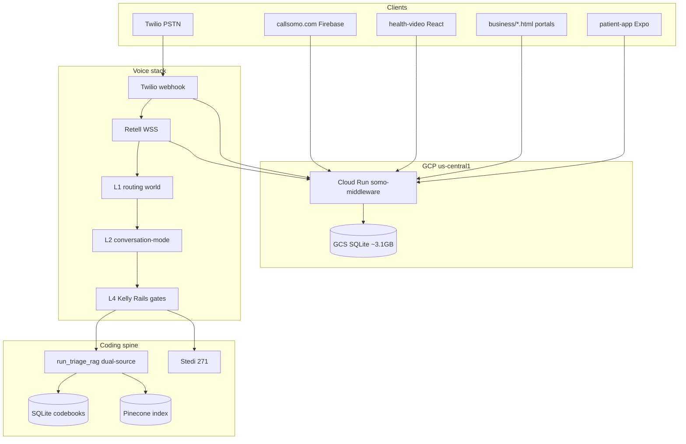
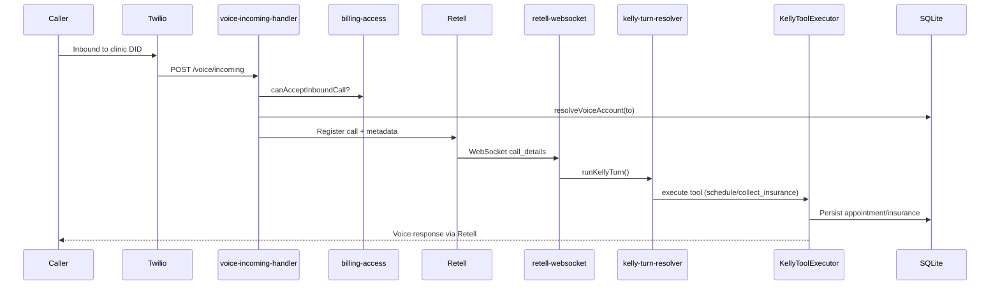
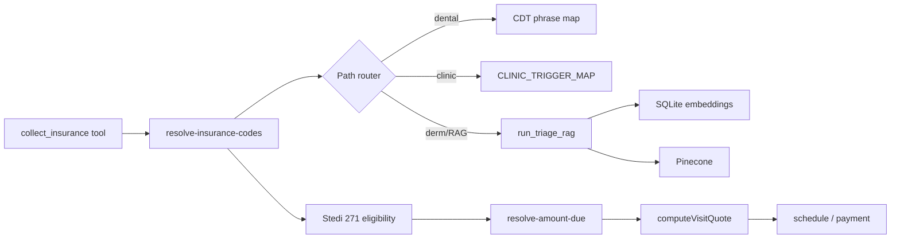
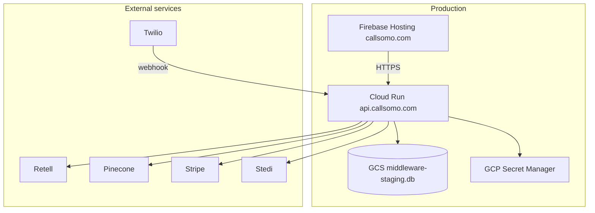

# Solution Architecture Report - Somo Voice Agent Platform

**Generated:** 2026-07-11  
**Repository:** `/Users/ojrichard/Voice Agent/somo`  
**Version:** 3.2.0 (per root README)  
**Production:** `callsomo.com` (UI) · `api.callsomo.com` (API) · Cloud Run `somo-middleware`

---

## Executive Summary

Somo is a **healthcare voice-first B2B platform** centered on **Kelly**, an AI front-desk receptionist for dental and medical practices. The primary production path is **Twilio PSTN → Cloud Run middleware → Retell AI WebSocket → Kelly Rails v2**, with appointment booking, insurance collection, medical coding, copay quoting, and billing integrations.

The codebase is a **large Node.js monorepo** (~1,908 source files excluding `node_modules`; ~2,204 including JSON/MD) organized around:

| Package | Role |
|---------|------|
| `middleware-platform/` | Core Express API, voice orchestration, RAG, RCM, payments (~1,395 JS files) |
| `unified-dashboard/` | Static HTML portals (business, admin, patients) + React health-video SPA |
| `patient-app/` | Expo/React Native mobile app (legacy commerce path) |
| `livekit-agents/` | Python Deepgram transcription workers for video consult |
| `Knowledge/` | ICD/CPT/HCPCS/CDT codebooks, rules, eval datasets |
| `docs/` | Canonical architecture/ops documentation (246 MD files) |
| `scripts/` | CI gates, deploy, brand, retention automation |

**Scale highlights:**
- `server.js`: **10,083 lines** (monolith entry — policy says migrate to `routes/`)
- `database.js`: **21,725 lines** (SQLite facade + legacy CREATE TABLE)
- **109** numbered migrations (`001`–`109`)
- **117** route modules, **611** service modules
- **299** Jest unit test files in `__tests__/`
- Production SQLite snapshot: **~3.1 GB** on GCS (110k embeddings)

**Maturity:** Unusually strong SSOT documentation, verification scripts, and CI gates for a startup-scale codebase. Primary risks: monolith growth, SQLite+embedding bloat forcing 8 Gi Cloud Run, multilingual voice gaps (heuristic locale detection, partial gate coverage), and pending clinical sign-off (F-09) for coding.

---

## System Overview & Business Context

### Product lines (what ships today)

| Line | User | Entry | Runtime |
|------|------|-------|---------|
| **Somo front desk** (primary pilot) | Dental/medical practice | `callsomo.com` → tenant DID | Kelly receptionist — schedule, copay, insurance |
| **Platform sales** | Inbound to company DID | `+13639990205` | `platform_support` sales rail (Kelly L4 blocked) |
| **Landing demo** | Prospect | `somo-landing` → `/api/public/somo-demo/*` | Outbound Twilio demo call |
| **Somo pay / RCM** | Provider portal | `business/*.html` | Stedi eligibility, claims, Stripe |
| **Somo Health** (deferred P9) | Consumer | `/health-video/` | Kelly PA education — Groq orchestrator |
| **Legacy commerce** | — | Gated off | `COMMERCE_LEGACY_ENABLED=false` default |

### Business flows

1. **Provider onboarding:** Admin invite → `invite.html` → `voice-setup.html` → `today.html` go-live checklist
2. **Inbound call:** Patient calls clinic DID → admission (credits/concurrency/rate limit) → Retell → Kelly turn → tools (schedule, collect_insurance, cancel, records)
3. **Money path:** `collect_insurance` → code resolution → Stedi 271 eligibility → `resolve-amount-due` → quote → booking/payment
4. **RCM loop:** Coding suggestions → claim envelope → Stedi 837P → webhook acceptance rates

---

## Technology Stack

### Backend
| Technology | Usage |
|------------|-------|
| **Node.js 20+** | Primary runtime (CI uses 20.x; dev supports 18.x) |
| **Express.js** | HTTP API, static hosting, webhooks |
| **better-sqlite3** | Primary database SSOT |
| **Jest** | Unit/integration tests |
| **Playwright** | E2E (onboarding, doctor-portal, tenant-audit, health-video) |
| **LangGraph / LangChain** | Video consult copilot, legacy paths |
| **Groq** | Health PA orchestrator, medical coding LLM |

### Voice & realtime
| Technology | Usage |
|------------|-------|
| **Twilio** | PSTN ingress/egress, SMS |
| **Retell AI** | Voice agent, custom LLM WebSocket |
| **LiveKit** | Health video + provider telehealth rooms |
| **Deepgram** | Video consult STT (Nova-3, multilingual) |

### AI / retrieval
| Technology | Usage |
|------------|-------|
| **OpenAI** | `text-embedding-3-small` (1536-dim) for code embeddings |
| **Pinecone** | Remote semantic index for medical coding RAG |
| **Custom dual-source** | SQLite `code_embeddings` + Pinecone merge |

### Payments & insurance
| Technology | Usage |
|------------|-------|
| **Stripe** | Subscriptions, checkout, cardholders |
| **Circle** | USDC payouts (claims) |
| **Stedi** | X12 EDI (271 eligibility, 837P claims) |

### Healthcare standards
| Standard | Usage |
|----------|-------|
| **FHIR R4** | Patient, encounter, observation resources |
| **X12 EDI** | Insurance transactions via Stedi |
| **ICD-10-CM/CPT/HCPCS/CDT** | Medical/dental coding codebooks |

### Frontend
| Technology | Usage |
|------------|-------|
| **Static HTML/JS** | Provider portal (`unified-dashboard/business/`) |
| **React (Vite)** | `health-video-landing`, `somo-landing` |
| **Expo/React Native** | `patient-app/` |
| **Tailwind CSS** | Shared styling tokens |
| **Firebase Hosting** | `callsomo.com` UI deploy |

### Infrastructure
| Technology | Usage |
|------------|-------|
| **GCP Cloud Run** | `somo-middleware` API (us-central1, 8 Gi / 4 CPU prod) |
| **GCS** | SQLite DB snapshot sync (`middleware-staging.db`) |
| **GCP Secret Manager** | Production secrets |
| **GitHub Actions** | CI gate, nightly coding eval, portal E2E |
| **Firebase** | Static UI hosting |
| **Azure Bicep** | Legacy infra (`infra/bicep/`) — guardrailed off deploy |

---

## Repository Structure

### Directory tree (top-level)

```
somo/
├── middleware-platform/     # Core backend (~1,395 JS files)
│   ├── server.js            # Monolith entry (10,083 lines)
│   ├── database.js          # SQLite facade (21,725 lines)
│   ├── routes/              # 117 route modules
│   ├── services/            # 611 service modules
│   ├── migrations/          # 109 numbered migrations
│   ├── __tests__/           # 299 Jest test files
│   ├── scripts/             # Verify gates, imports, eval harnesses
│   ├── webhooks/            # Retell WebSocket, Stripe, Stedi
│   ├── bootstrap/           # Health UI, static hosting registration
│   ├── database/            # Repos, postgres-sync, connection
│   └── e2e/                 # Playwright specs + scenario registry
├── unified-dashboard/       # Static portals + React SPAs (~321 tracked files)
│   ├── business/            # Provider portal (agent, calendar, billing, RCM)
│   ├── admin/               # Ops CRM, leads, wallboard
│   ├── patients/            # Patient web portal
│   ├── health-video-landing/# Consumer health React app
│   ├── somo-landing/        # Marketing/demo SPA
│   └── assets/              # Shared JS/CSS/brand
├── patient-app/             # Expo React Native
├── livekit-agents/          # Python transcription workers
├── case-report-service/     # Case report microservice (adjacent)
├── Knowledge/               # 108 data/rule/eval files
├── docs/                    # 246 canonical markdown docs
├── scripts/                 # 92+ repo-level automation scripts
├── .github/workflows/       # ci.yml, coding-eval-nightly, portal-e2e-gate
├── config/                  # Shared config
├── contracts/               # API contracts
├── infra/                   # Azure Bicep (legacy)
├── todos/                   # Open work SSOT (PENDING.md)
├── backups/                 # DB backups
└── package.json             # Root orchestration scripts
```

### Package manifests

| Path | Name | Purpose |
|------|------|---------|
| `/package.json` | `somo` | Root scripts: CI, deploy, brand, health UI build |
| `/middleware-platform/package.json` | `somo-middleware` | Backend: 200+ npm scripts for verify/eval/deploy |
| `/patient-app/package.json` | `patient-app` | Expo mobile |
| `/unified-dashboard/health-video-landing/package.json` | — | Consumer health React |
| `/unified-dashboard/somo-landing/package.json` | — | Marketing SPA |

---

## High-Level Architecture



### Architectural layers (Kelly voice)

| Layer | Module(s) | Responsibility |
|-------|-----------|----------------|
| **L0 Ingress** | `voice-incoming-handler.js`, `retell-websocket.js` | Twilio→Retell bridge, metadata, admission |
| **L1 Routing world** | `voice-routing-world.js` | Classify: tenant, platform_support, demo, navigation, outbound |
| **L2 Conversation mode** | `conversation-mode/*` | 8 modes, subrails, pivot engine, tool firewall |
| **L4 Kelly Rails** | `kelly-rails/*` | Deterministic gates (schedule, insurance, cancel, records) |
| **Tools** | `kelly-tool-executor.js` | Execute schedule, collect_insurance, payment, etc. |
| **State** | SQLite session tables, `kelly_call_events` | Per-call persistence, telemetry |

---

## Core Subsystems

### Middleware Platform

**Purpose:** Central orchestration hub for all product lines.

**Entry point:** `middleware-platform/server.js`
- Loads env via dotenv (override in non-prod)
- Validates env on startup (`utils/env-validator.js`)
- Enforces production JWT for FHIR (`REQUIRE_JWT_FOR_FHIR=1`)
- Mounts 100+ route prefixes
- Serves static dashboards from `unified-dashboard/`
- Policy: **no new inline routes** — add `routes/*.js` and mount via registry

**Domain packages** (per `docs/architecture/MIDDLEWARE_PLATFORM.md`):

| Domain | Location | Status |
|--------|----------|--------|
| Somo health | `services/health/` | KEEP — first-class |
| Kelly rails | `services/kelly-rails/`, `conversation-mode/` | FREEZE (production path) |
| Voice PSTN | `services/voice/` barrel | FREEZE |
| RCM | `services/rcm/` barrel | KEEP |
| Payments | `services/payments/` barrel | KEEP |
| Provider video | `services/video-consult/` | KEEP |
| Commerce | gated `COMMERCE_LEGACY_ENABLED` | DELETE path |

**Key services (representative):**

| Service | Path | Role |
|---------|------|------|
| `voice-incoming-handler.js` | Ingress | Twilio webhook, admission, Retell register |
| `voice-agent-runtime.js` | Runtime | Overflow, greeting, agent config resolution |
| `kelly-turn-resolver.js` | Orchestration | Main turn dispatch to L2/L4 |
| `patient-orchestrator-service.js` | Legacy | Fallback when `KELLY_LLM_ENABLED=0` |
| `resolve-insurance-codes.js` | Coding | Insurance → ICD/CPT resolution |
| `resolve-amount-due.js` | Benefits | Copay SSOT with precedence chain |
| `triage-rag-service-v2.js` | RAG | OPQRST → dual-source retrieval |
| `knowledge-service.js` | Knowledge | Phrase expansion, corrections |
| `insurance-service.js` | Stedi | X12 271/837P |
| `payment-orchestrator.js` | Payments | Stripe checkout flows |
| `saas-tenant-provision.js` | Tenancy | Clinic/customer provisioning |
| `booking-service.js` | Scheduling | Appointment CRUD |
| `fhir-service.js` | FHIR | R4 resource management |
| `cache-service.js` | Performance | In-memory/redis caching |

**Route registry:** `routes/index.js` — incremental extraction from monolith; health spine mounted first.

---

### Voice Agent & Routing

**Ingress flow:**

```
Caller PSTN
  → POST /voice/incoming (voice-incoming-handler.js)
  → Admission: billing-access → voice-active-calls → voice-limit-service
  → resolveVoiceAccount() → customer_id, clinic_id, Retell agent
  → Retell register call + dynamic_variables
  → WebSocket retell-websocket.js
  → resolveRoutingWorld()
  → Branch by world
```

**Routing worlds** (`voice-routing-world.js`):

| World | Trigger | Handler |
|-------|---------|---------|
| `tenant` | `customer_id` resolved | Kelly Rails v2 |
| `platform_support` | Platform DID `+13639990205` or operator customer | Sales/support rail |
| `demo` | `call_type=somo_demo` or demo DID | Demo template |
| `navigation` | `consumer_navigation` (disabled: `NAVIGATION_ENABLED=0`) | Navigator |
| `operator_outbound` | Outbound reminder calls | Operator outbound rail |
| `sales_outbound` | Lead dialer | Sales outbound rail |
| `unidentified` | No customer_id | Fail-closed handoff |

**Kelly Rails v2 turn path:**

```
retell-websocket.js
  → runKellyTurn() [kelly-turn-resolver.js]
  → seedModeAtCallStart() [conversation-mode-resolver.js]
  → evaluateTurn() pivot-engine
  → executeTurn() [kelly-rails/execute-turn.js]
  → gate registry (schedule, insurance, cancel, records, payment)
  → mode-tool-firewall (blocks wrong tools per mode)
  → KellyToolExecutor
  → SQLite session + kelly_call_events telemetry
```

**Overflow admission:** When credits exhausted or concurrent busy, forward TwiML uses `runtime.overflowNumber` only when `overflow_enabled=true` (migration 104). No `transferNumber` fallback.

**Multilingual support:**

| Component | Path | Notes |
|-----------|------|-------|
| Tenant config | `tenant-language-config.js`, `voice_agent_settings.language_mode` | Modes: `en_only`, `en_es`, etc. |
| Locale resolution | `kelly-rails/resolve-locale.js` | Sticky locale per session |
| Deterministic replies | `kelly-rails/gates/*.js` | `withStickyLocale()` for i18n copy |
| Prompt bounding | `prompt-bounding-locale.js` | Constrains LLM to supported languages |
| Eval harness | `kelly-multilang-conversation-eval.cjs` | EN/ES/RU/ZH scenarios |
| Dental phrase map | `Knowledge/rules/dental-phrase-map.json` | Spanish CDT resolution |

**Gaps (per `CODEBASE_REVIEW_VOICE_MULTILINGUAL.md`):**
- Heuristic language detection (not ASR-native)
- Partial gate i18n coverage
- Spanish OPQRST blocked on prod
- Multilang eval not in main CI (nightly/separate)
- Rating: **5.5/10** for multilingual production readiness

**Key env gates:**

| Variable | Prod | Purpose |
|----------|------|---------|
| `KELLY_RAILS_V2` | `1` | Agentic turn execution |
| `CONVERSATION_MODE_ROUTING` | `enforce` | L2 mode dispatch |
| `NAVIGATION_ENABLED` | `0` | Navigation path off |
| `PLATFORM_INBOUND_MODE` | `support` | +363 → platform_support |
| `KELLY_RAILS_FAST_RAG` | `0` | Full RAG on voice path |

---

### Medical Coding & RAG Pipeline

**Purpose:** Suggest ICD-10, CPT, HCPCS (and CDT for dental) from clinical text.

**Path router** (`resolveVisitCodingPath()` in `resolve-visit-codes.js`):

| Tenant profile | Path | Retrieval |
|----------------|------|-----------|
| Dental | admin | Phrase map + CDT SQL — **no Pinecone** |
| `healthcare_clinic` | admin | `CLINIC_TRIGGER_MAP` (51 entries) |
| Dermatology / conditional | RAG | OPQRST → `run_triage_rag` → dual-source |

**Dual-source retrieval:**

```
getCodeCandidatesDualSource()
  ├── _getCodeCandidatesImpl() → SQLite code_embeddings (local hybrid search)
  └── retrieveRemoteCodeKnowledge() → Pinecone (layer2-rag)
  → Merge + validate + corrections
  → select-primary-codes.js (ranking SSOT)
```

**Data layer counts (production GCS 2026-07-10):**

| Table | Count |
|-------|-------|
| `icd10_codes` | 74,260 |
| `cpt_codes` | 16,851 (MPFS) |
| `hcpcs_codes` | 9,006 |
| `code_embeddings` | 110,017 |
| `fee_schedules` | 30,586 |

**Offline ingest pipeline:**

```
import-icd10-codes.js → SQLite
import-cpt-codes.js --source mpfs → SQLite
import-hcpcs-codes.js → SQLite
import-cdt-codes.js → SQLite (dental)
populate-code-embeddings.js → code_embeddings
pinecone-code-metadata-ingest.cjs → Pinecone
import-ncci-pairs-expanded.cjs → pair rules (migration 109)
import-plan-rules-benefits.cjs → plan_rules (copay)
```

**Quote chain (voice money path):**

```
collect_insurance tool
  → POST /voice/insurance/collect
  → resolve-insurance-codes.js
  → run_triage_rag (if RAG path)
  → resolve-amount-due.js
      precedence: Stedi hard copay → block thin/inactive → plan_rules → simulate
  → computeVisitQuote
  → schedule_appointment / payment link
```

**Eval:**

| Command | Profile |
|---------|---------|
| `eval:coding:fast` | CI — `EVAL_USE_SEMANTIC=false`, `RAG_API_URL=disabled` |
| `eval:coding:prod` | Nightly — semantic + Pinecone |
| Golden cases | 150+ in eval datasets |

**Tenant isolation (MT-03):** `pinecone-tenant-filter.js` — post-hoc filter on Pinecone metadata by `clinic_id`; global codebook vectors (no clinic_id) allowed.

---

### Patient Orchestration

**Primary:** Kelly Rails v2 (`kelly-rails/orchestrator.js`) with deterministic gates.

**Legacy fallback:** `patient-orchestrator-service.js` — wired when `KELLY_LLM_ENABLED=0` (deprecated).

**Conversation modes (L2):** 8 modes with subrails:
- Booking, cancellation, reschedule, records, insurance, payment, emergency, operator outbound
- `conversation-dispatcher.js` routes turns
- `mode-tool-firewall.js` prevents clinical tools on front-desk modes

**State ownership:**
- Per-call: `voice_call_log`, session state in SQLite
- Kelly events: `kelly_call_events` (migration 061)
- Site context: `call_site_context` (migration 062)

---

### Video Consult

**Two stacks — do not conflate:**

| Stack | Entry | Orchestrator |
|-------|-------|--------------|
| Somo Health (consumer) | `/health-video/` | Groq PA (`kelly-pa-video-orchestrator.js`) |
| Provider telehealth | `video-call.html` | `video-consult-graph` LangGraph copilot |

**Health session API:**
- `/api/health-session` — session CRUD, SSE transport
- `/api/video-consult` — room management, agent events
- `routes/index.js` → `mountHealthSpine()`

**LiveKit agents:** `livekit-agents/transcription_agent.py`
- Deepgram Nova-3 STT
- Posts transcripts to `/api/video-consult/agent-events`
- Multilingual: `VIDEO_STT_MODE=auto` → Deepgram `multi` language

**Health safety:** `services/health/safety-floor.js`, OPQRST gates, derm education RAG optional.

---

### Knowledge Base & Data Assets

**Location:** `/Knowledge/` (108 files)

| Category | Path | Contents |
|----------|------|----------|
| ICD-10 | `Knowledge/ICD-10 Files/FY2025/` | Code descriptions, tabular |
| ICD-10-PCS | `Knowledge/ICD-10-PCS/FY2025/` | Procedure codes |
| HCPCS | `Knowledge/HCPCS/` | Level II codes |
| CDT | `Knowledge/CDT/cdt-codes-2025.txt` | Dental codes |
| Fee schedules | `Knowledge/fee-schedules/PPRRVU*.csv` | Medicare MPFS |
| Rules | `Knowledge/rules/` | Phrase maps, modifiers, time-based CPT, plan rules, deferral copy |
| RAG corrections | `Knowledge/RAG/` | ICD term corrections, concept corrections |
| Eval | `Knowledge/eval/` | Golden datasets, baselines, gap reports |
| Ontology | `Knowledge/ontology/` | Medical entities, abbreviations, severity |
| Corpus | `Knowledge/corpus/derm-education/` | Derm education manifest |

**Key rule files:**
- `lay-language-icd-expansions.json` — lay term → CMS shorthand
- `dental-phrase-map.json` — dental + Spanish phrases
- `time-based-cpt-rules.json` — E/M time guardrails
- `plan-rules-benefits-scale.json` — copay sample data
- `coding-deferral-copy.json` — honest deferral messaging

---

### Database Layer

**Primary:** SQLite via `better-sqlite3`
- **Dev path:** `var/db/middleware-dev.db`
- **Prod path:** `/var/data/middleware-staging.db` (GCS synced)
- **Facade:** `database.js` (21,725 lines) — stable import for app code
- **Policy:** New tables → numbered migrations only; repos in `database/repos/`

**Migrations:** 109 files (`middleware-platform/migrations/`)
- Startup runner: `database/migrations/run-startup-migrations.js`
- Recent: `096_voice_agent_language_and_transfer`, `104_phase5_voice_overflow`, `109_pair_rules`

**Key table groups:**

| Domain | Tables |
|--------|--------|
| Tenancy | `merchants`, `customers`, `clinics`, `users`, `customer_sessions` |
| Voice | `voice_call_log`, `voice_agent_settings`, `voice_active_calls`, `kelly_call_events` |
| Scheduling | `appointments`, `provider_availability_blocks` |
| FHIR | `fhir_patients`, `fhir_encounters`, `fhir_observations`, etc. |
| Insurance | `insurance_payers`, `eligibility_checks`, `plan_rules`, `patient_insurance` |
| Coding | `icd10_codes`, `cpt_codes`, `hcpcs_codes`, `code_embeddings`, `coding_decisions` |
| RCM | `insurance_claims`, `rcm_payment_audit` |
| Health | `health_sessions` (migration 085) |
| Commerce | `products`, `checkout_sessions`, `voice_checkouts` (legacy) |

**Postgres:** Optional mirror via `export-sqlite-to-postgres.js` — not primary SSOT.

**Architectural debt:** Embedding JSON in SQLite → 3.1 GB file → 8 Gi Cloud Run, slow cold starts. Target: slim SQLite + Pinecone-only prod semantic search.

---

### Caching & Performance

| Component | Path | Notes |
|-----------|------|-------|
| `cache-service.js` | In-memory caching | Configurable TTL |
| `clinic-rate-limiter.js` | Per-tenant rate limits | Tier-based |
| `voice-limit-service` | Concurrent call caps | Admission control |
| `semantic-search-service.js` | Embedding cache | Query-time embed |
| SSE bus | `HEALTH_SSE_BUS=memory` | Redis stub for multi-replica |

**Cloud Run prod sizing:** 8 Gi RAM / 4 CPU (embedding-heavy SQLite cold start)

---

### Multi-Tenancy & Isolation

**Tenant model** (`docs/Database/TENANT_MODEL.md`):

```
merchants (billing entity)
  └── customers (provider accounts, twilio_phone_number)
        └── clinics (site context, voice settings)
              └── users (staff)
```

**Isolation mechanisms:**

| Layer | Implementation |
|-------|----------------|
| Voice routing | `customer_id` from DID resolution — `tenantResolved` requires customer_id |
| DB queries | `tenant-write-context.js`, `clinic_id` filters |
| Pinecone | `allowsPineconeMatchForClinic()` post-hoc filter |
| RCM | `rcm-tenant-isolation` tests |
| Admin | `admin-tenants.js` PHI export, offboarding runbook |
| Site context | `call_site_context` per call (migration 062) |

**Verification:** `verify-sqlite-tenant-boundary.cjs`, `verify-pinecone-tenant-wiring.cjs`, `pinecone-tenant-isolation.test.js`

---

### Authentication & Security

| Surface | Mechanism |
|---------|-----------|
| Provider portal | `customers` + `customer_sessions` — cookie sessions |
| Admin portal | `admin_sessions` + `ADMIN_PORTAL_SECRET` |
| Patient portal | `patient-auth.js` — session tokens |
| Health session | Session-scoped auth, no cross-session leakage |
| FHIR | JWT required in prod (`REQUIRE_JWT_FOR_FHIR=1`) |
| API keys | `merchant_api_keys` hashed |
| Webhooks | Stripe signature, Stedi verification |
| Rate limiting | `express-rate-limit` — API, auth, public diagnostics |
| Input sanitization | `sanitizeInput` middleware |
| PHI | HIPAA audit hooks, encryption at rest docs |
| Secrets | GCP Secret Manager in prod; `.env.example` for local |

**Startup guards:**
- `validateAndExitIfInvalid()` — required env vars
- `JWT_SECRET` min 32 chars in prod
- `REQUIRE_TRIAGE_FOR_VOICE` warning if not set

---

### External Integrations

| Provider | Integration point | Purpose |
|----------|-------------------|---------|
| **Twilio** | `voice-incoming-handler.js`, `sms-service.js` | PSTN, SMS |
| **Retell AI** | `retell-websocket.js`, `configure-retell.js` | Voice agent WSS |
| **OpenAI** | `embedding-provider.js` | Code embeddings |
| **Pinecone** | `layer2-rag/pinecone-code-metadata-client.js` | Semantic search |
| **Stedi** | `insurance-service.js`, `stedi-webhooks.js` | X12 271/837P |
| **Stripe** | `payment-orchestrator.js`, webhooks | Payments, subscriptions |
| **Circle** | USDC payout service | Claims settlement |
| **Google Calendar** | `booking-service.js` | Appointment sync |
| **Epic / 1upHealth** | `fhir-service.js`, EHR sync jobs | Clinical data |
| **LiveKit** | `routes/livekit.js` | Video rooms |
| **Deepgram** | `livekit-agents/` | Video STT |
| **Groq** | Health orchestrator, coding LLM | Fast inference |
| **Dentrix / Athena** | `services/pms/` | PMS connect (Phase 3) |
| **NPPES** | `nppes-directory-search-service.js` | Provider directory |
| **LangSmith** | `utils/langsmith-config.js` | Tracing |
| **Firebase** | `scripts/deploy-firebase-hosting.cjs` | UI hosting |
| **GCS** | DB sync on Cloud Run startup | SQLite snapshot |

---

### Frontend / Client Applications

**unified-dashboard/** — primary UI surface

| Portal | Path | Key pages |
|--------|------|-----------|
| Business (provider) | `business/` | `agent.html`, `voice-setup.html`, `calendar.html`, `billing.html`, `rcm.html`, `today.html`, `trial-activation.html` |
| Admin (ops) | `admin/` | `pipeline.html`, `lead.html`, `wallboard`, `sales-agent.html` |
| Patients | `patients/` | `book.html`, `onboarding.html` |
| Insurer | `insurer/` | Claims views |
| Health video | `health-video-landing/` | React SPA — terms → call → chat → report |
| Marketing | `somo-landing/` | Demo form, hero, ROI (retired as root 2026-06) |

**Shared assets:** `assets/js/`, `assets/css/`, brand tokens (`somo-tokens.css`)

**patient-app/** — Expo React Native
- Auth, appointments, checkout chat
- Legacy commerce path — not health-finance SSOT
- `expo-router` navigation

**Static hosting:** Express serves `/business`, `/admin`, `/patients` from `unified-dashboard/`; Firebase hosts production UI.

---

## API Surface

### Voice

| Method | Path | Purpose |
|--------|------|---------|
| POST | `/voice/incoming` | Twilio webhook ingress |
| WS | Retell custom LLM | `retell-websocket.js` |
| POST | `/api/voice/outbound/*` | Outbound call initiation |
| GET/PATCH | `/api/voice-agent/settings` | Tenant voice config |
| POST | `/api/retell/*` | Retell function callbacks |

### Health

| Method | Path | Purpose |
|--------|------|---------|
| * | `/api/health-session/*` | Session CRUD, SSE |
| * | `/api/video-consult/*` | Video rooms, agent events |

### Tenant / provider

| Method | Path | Purpose |
|--------|------|---------|
| * | `/api/tenant/clinic` | Clinic config PATCH |
| * | `/api/tenant/pms` | PMS connect |
| * | `/api/tenant/patients` | Patient roster |
| * | `/api/invites` | Provider invite flow |
| * | `/api/kelly/*` | Kelly admin/debug |

### RCM / coding

| Method | Path | Purpose |
|--------|------|---------|
| * | `/api/rcm/*` | Claims, eligibility |
| GET | `/api/rag/search` | Code search API |
| * | `/api/pdf-coding/*` | PDF note coding |

### Public

| Method | Path | Purpose |
|--------|------|---------|
| * | `/api/public/somo-demo/*` | Landing demo calls |
| * | `/api/public/plans/*` | CMS MA plan search |
| * | `/api/public/geo/*` | Geolocation |
| * | `/api/public/checkout/*` | Legacy checkout |

### Admin

| Method | Path | Purpose |
|--------|------|---------|
| * | `/api/admin/*` | Leads, tenants, Kelly calls, wallboard |
| * | `/api/admin/tenants/:id/phi-export` | Tenant offboarding |

### Webhooks

| Path | Provider |
|------|----------|
| `/webhooks/stripe` | Stripe |
| `/webhooks/stedi` | Stedi |

---

## Data Flow Diagrams

### Inbound voice call (tenant)



### Insurance collect → quote



---

## Deployment Architecture



**Deploy commands:**
- Full: `./scripts/deploy-callsomo-local.sh` (API + Firebase UI)
- API only: `./scripts/deploy-to-gcp.sh`
- UI only: `npm run deploy:landing-hosting`

**Cloud Run config (prod):**
- Memory: 8 Gi, CPU: 4
- Min instances: 1
- Startup probe: `/health/live` (60s initial delay)
- DB sync from GCS on startup
- Env generator: `generate-cloudrun-env-yaml.cjs`

---

## CI/CD Pipeline

### GitHub Actions (`.github/workflows/`)

| Workflow | Trigger | Steps |
|----------|---------|-------|
| `ci.yml` | push/PR to main | `ci:gate`, voice routing smoke, Playwright E2E |
| `coding-eval-nightly.yml` | nightly | `eval:coding:prod` |
| `portal-e2e-gate.yml` | scheduled | Portal compliance E2E |

### Local CI (`scripts/ci-local.sh`)

**gate tier (~5–15 min):**
1. Repo guardrails (brand, legacy hosts, monolith growth, performance budgets)
2. Health import firewall + unit tests + acceptance
3. Kelly Rails env + golden + language tests
4. Voice scale + billing tests
5. Codebook parity
6. Phase 1–9 foundation gates
7. Pinecone tenant wiring, ranking SSOT
8. Multilang eval smoke

**full tier:** gate + reasoning regression + landing E2E + hosting build

**Pre-deploy:** `npm run ci:phase0` in `deploy-to-gcp.sh`

---

## Testing Strategy

| Layer | Location | Count/notes |
|-------|----------|-------------|
| Unit | `middleware-platform/__tests__/` | 299 test files |
| E2E | `middleware-platform/e2e/` | Playwright: onboarding, doctor-portal, tenant-audit, callsomo, health-video |
| Scenario registry | `e2e/scenario-registry/` | Dental front desk PSTN scenarios |
| Eval harnesses | `scripts/evaluate-accuracy.js`, `kelly-multilang-conversation-eval.cjs` | Coding accuracy, multilang conversation |
| Verify scripts | 80+ `verify:*` npm scripts | Structural/production gates |
| PSTN replay | `commerce-pstn-replay` | Legacy commerce voice replay |

**Key test domains:**
- Kelly Rails gates (schedule, insurance, cancel, records, payment)
- Voice routing world resolution
- Medical coding (CDT, NCCI pairs, ranking SSOT, Pinecone isolation)
- RCM money path
- Multilang intent and locale
- Health session isolation
- Phase 0–9 pilot gates

---

## Operations & Runbooks

**Canonical ops docs:**

| Doc | Purpose |
|-----|---------|
| `docs/deployment/OPERATIONS.md` | Deploy procedures |
| `docs/deployment/FRONT_DESK_PRODUCTION.md` | Front desk prod |
| `docs/runbooks/voice-inbound-troubleshooting.md` | Twilio→Retell→DB trace |
| `docs/runbooks/CODING_SPINE_OUTAGE.md` | Coding failure response |
| `docs/runbooks/TENANT_OFFBOARDING.md` | PHI export, wipe |
| `docs/Medical Coding/OPERATIONS.md` | Codebook import, GCS sync |
| `docs/voice-agent/unblocked-phases-ops.md` | Phase 2–9 verify matrix |

**Master verify gate:** `npm run verify:unblocked-phases`

**Operator sync:** `npm run callsomo:operator-sync`

---

## Configuration & Environment

**Key env files:**
- `.env.example` (root)
- `middleware-platform/.env` (local dev)
- `generate-cloudrun-env-yaml.cjs` (prod manifest)

**Surfaces** (per `docs/setup/README.md`):
- Voice: Retell, Twilio, Kelly Rails flags
- Coding: Pinecone, OpenAI embeddings, RAG_API_URL
- Payments: Stripe keys (staging/live rotation scripts)
- Health: LiveKit, Groq, Deepgram
- Feature flags: `COMMERCE_LEGACY_ENABLED`, `NAVIGATION_ENABLED`, `KELLY_RAILS_V2`

**Local dev:**
```bash
cd middleware-platform && npm run dev          # Provider portal at :4000
LOCAL_DEV_ROOT=health npm run health:dev       # Consumer health at /health-video/
```

---

## Key Design Decisions & ADRs

| Decision | Doc / implementation |
|----------|---------------------|
| Retell-first voice prompts | `VOICE_PROMPT_SSOT.md` |
| Conversation-mode as L2 control plane | `CONVERSATION_MODE_MATRIX.md` |
| Kelly Rails deterministic gates | `KELLY_ORCHESTRATION_ARCHITECTURE.md` |
| Dental = phrase map, no Pinecone | `CODING_PATH_MATRIX.md` |
| Benefits precedence chain | `BENEFITS_PRECEDENCE.md` |
| Tenant = customer_id only (not clinic alone) | `voice-routing-world.js` R-5b |
| SQLite primary, Postgres optional | `DB_STRUCTURE_AND_PIPELINE.md` |
| Route extraction from monolith | `server.js` policy + `routes/index.js` |
| Commerce legacy gated off | `ROUTE_OWNERSHIP.md` |
| Health session separate from PSTN Kelly | `HEALTH_SESSION_ARCHITECTURE.md` |

---

## Technical Debt & Risks

| Risk | Severity | Notes |
|------|----------|-------|
| **Monolith size** | High | `server.js` 10k lines, `database.js` 22k lines — growth guard in CI |
| **SQLite + embeddings bloat** | High | 3.1 GB prod DB → 8 Gi Cloud Run, slow cold starts |
| **Multilingual voice gaps** | Medium | Heuristic detection, partial gate i18n, Spanish OPQRST blocked |
| **Pinecone tenant filter post-hoc** | Medium | Query-time filter only; ingest metadata solid |
| **Clinical sign-off pending** | Medium | F-09 Appendix C not operator-complete |
| **Nightly eval not green ×7** | Medium | K-02 coding prod eval streak not started |
| **Payor ER shadow mode** | Medium | Runtime resolver behind feature flags |
| **plan_rules flat copay** | Low | Complex benefits under-modeled |
| **OCR pipeline immature** | Low | GPT-4o vision exists; missing eval metrics |
| **Legacy commerce/patient-app** | Low | Gated off but code remains |
| **LangGraph on health only** | Info | PSTN uses Kelly Rails, not LangGraph |

---

## Appendix: Module Index

### middleware-platform/services/ (top-level domains)

| Directory | Files | Domain |
|-----------|-------|--------|
| `kelly-rails/` | ~40 | L4 gates, execute-turn, prompts |
| `conversation-mode/` | ~30 | L2 modes, subrails, dispatcher |
| `layer2-rag/` | ~10 | Pinecone client, search intent, tenant filter |
| `health/` | ~20 | Health session agent, safety, education |
| `pms/` | ~8 | Dentrix, Athena adapters |
| `kelly-tool-executor/` | ~15 | Tool implementations |
| `video-consult/` | ~5 | Provider video copilot |
| `payments/` | ~10 | Stripe, settlement |
| `rcm/` | ~8 | Claims, remittances |

### middleware-platform/routes/ (by domain)

| Group | Routes |
|-------|--------|
| Voice | `voice.js`, `voice-incoming.js`, `voice-web-call.js`, `voice-billing.js`, `voice-appointments.js`, `voice-agent-settings.js` |
| Health | `health-session.js`, `health-transport.js`, `video-consult.js` |
| Tenant | `tenant-clinic.js`, `tenant-config.js`, `tenant-pms.js`, `tenant-patients.js`, `tenant-roster.js` |
| RCM | `rcm.js`, `rcm-public.js`, `pdf-coding.js`, `rag-search.js` |
| Admin | `admin.js`, `admin-tenants.js`, `admin-kelly-calls.js`, `admin-leads.js` |
| Patient | `patient-auth.js`, `patient-booking.js`, `patient-insurance.js`, `patient-rcm.js` |
| Public | `somo-demo-public.js`, `public-plan-search.js`, `public-checkout.js` |
| Payments | `payment.js`, `payment-ops.js`, `credits.js`, `invoices.js` |

### Verification scripts (sample)

| Script | Gate |
|--------|------|
| `verify:unblocked-phases` | Voice structural master |
| `verify:prod-codebook` | GCS codebook parity |
| `verify:pinecone-tenant-wiring` | MT-03 tenant isolation |
| `verify:ranking-ssot` | CP-05 ranking unified |
| `verify:kelly-rails-env` | Kelly Cloud Run env |
| `verify:sqlite-tenant-boundary` | DB tenant isolation |
| `eval:coding:fast` | CI coding accuracy |
| `test:eval:multilang:smoke` | Multilang conversation |
