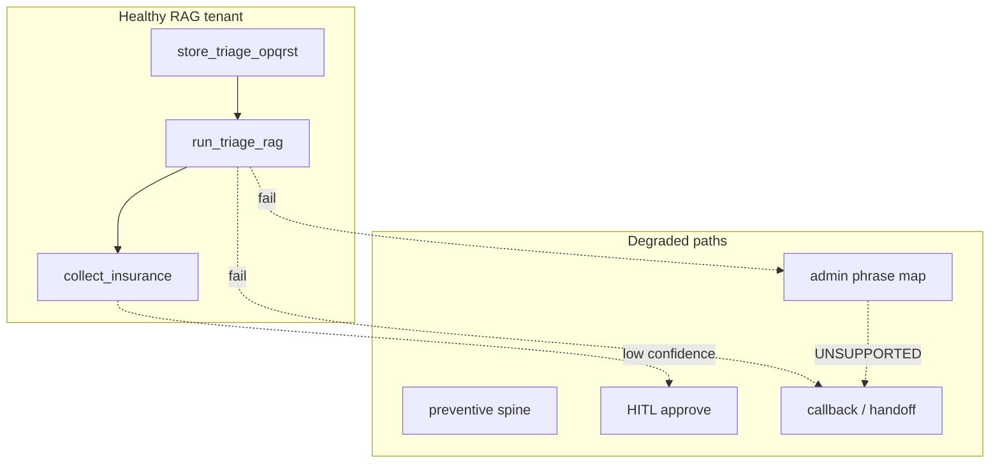

# Coding spine outage runbook

> **Last updated:** 2026-07-10  
> **Task:** CODING-FOUNDATION N-09  
> **Owner:** On-call Engineering  
> **Scope:** Voice/chat Kelly path — triage RAG, code retrieval, insurance collect, quote

When the coding spine is degraded or unavailable, **do not invent CPT/ICD codes**. Fall back to documented paths: **admin phrase map**, **preventive spine**, or **human callback/handoff**.

---

## Symptoms and severity

| Symptom | Likely cause | User impact | Default severity |
|---------|--------------|-------------|------------------|
| `run_triage_rag` tool errors / timeout | Groq, triage service, DB lock | RAG tenants cannot complete triage | **P1** for dermatology / `triage_policy: required` |
| `collect_insurance` returns `TRIAGE_REQUIRED` | Missing `triage_rag_results` row | Quote/book blocked mid-call | **P1** |
| `collect_insurance` returns `UNSUPPORTED_ADMIN_CODE` | Admin phrase map miss | Front-desk tenant cannot quote | **P2** |
| Pinecone timeout / empty remote leg | `PINECONE_*`, network, index health | Reduced recall; local SQLite may still return codes | **P3** if local leg OK |
| OpenAI embedding failures | `OPENAI_API_KEY`, rate limits | Semantic search off; keyword path remains | **P3** |
| `validateCodesExist` drops all candidates | Empty or corrupt codebook DB | No codes suggested | **P1** |
| Widespread `needs_review` HITL queue | Confidence / pair validation spike | Calls complete only after admin approve | **P2** |

---

## Architecture quick reference



**Router SSOT:** [`resolve-visit-codes.js`](../../middleware-platform/services/resolve-visit-codes.js)  
**Path matrix:** [CODING_PATH_MATRIX.md](../Medical%20Coding/CODING_PATH_MATRIX.md)

---

## Degradation ladder (in order)

### 1. Admin path (front-desk tenants)

**When:** `triage_policy: disabled` (default `healthcare_clinic`, `dental`, `small_business`) **or** ops explicitly routes tenant to admin.

**Behavior:**

- Kelly **does not** call `run_triage_rag`.
- `resolveAdminInsuranceCodes` / `resolveDentalCdtFromReason` maps visit reason → CPT/CDT.
- No Pinecone or triage DB row required for collect.

**Ops action:** None if tenant is already admin-routed. For RAG tenants in incident, **do not flip triage policy without product approval** — use step 3 or 4 instead.

### 2. Local-only retrieval (Pinecone / remote RAG down)

**When:** `retrieveRemoteCodeKnowledge` times out or Pinecone unhealthy; `getCodeCandidatesDualSource` still succeeds on local leg.

**Behavior:**

- Keyword + phrase + optional semantic (SQLite `code_embeddings`) continues.
- `coding_provenance_json` should reflect `local` not `pinecone`.

**Ops action:**

```bash
# Confirm Pinecone config on Cloud Run
gcloud run services describe somo-middleware --region=us-central1 --project=somo-callsomo \
  --format='yaml(spec.template.spec.containers[0].env)' | grep -E 'PINECONE|RAG_API|REMOTE_RAG'

# Temporarily shorten remote timeout (voice already 2000ms)
# REMOTE_RAG_TIMEOUT_MS=1000  — fail fast to local
```

Set `RAG_API_URL=disabled` (prod default). Do not point to dead Colab URLs.

### 3. Preventive spine

**When:** Visit reason matches wellness / annual / no symptoms ([`PREVENTIVE_TRIGGERS`](../../middleware-platform/services/resolve-visit-codes.js)).

**Behavior:** `preventive-visit-spine.js` → Z00.x + preventive CPT (e.g. 99395, G0438) without full RAG.

### 4. HITL queue

**When:** Confidence &lt; 0.65 (`CODING_CONFIDENCE_THRESHOLD`) or invalid code pair.

**Behavior:**

- `coding_decisions.validation_status = needs_review`
- Admin approves via [`coding-reviews.html`](../../unified-dashboard/admin/coding-reviews.html)
- Kelly resumes with `coding_hitl_resume_pending` meta

**Ops action:** Monitor queue depth; SLA per [VOICE_CODING_SPINE.md](../Medical%20Coding/VOICE_CODING_SPINE.md#hitl-admin).

### 5. Callback / human handoff (fail-safe)

**When:**

- RAG tenant and `run_triage_rag` cannot complete after retry
- `UNSUPPORTED_ADMIN_CODE` on admin tenant
- `collect_insurance` blocked with `TRIAGE_REQUIRED` and caller cannot complete OPQRST
- Codebook DB empty (`verify:prod-codebook` fails)
- Patient requests human or clinical complexity exceeds agent scope

**Behavior:**

- Kelly offers **transfer** (`transfer_call`) or **callback capture** (`end_call` with `disposition: callback_requested`, name, phone, preferred time).
- **Do not** pass client `service_code` on collect (rejected by design).
- **Do not** enable `KELLY_RAILS_FAST_RAG` or `triage-rag-fast-complete.js` in prod.

**Operator transfer target:**

```bash
gcloud run services update somo-middleware --region=us-central1 --project=somo-callsomo \
  --update-env-vars CALLSOMO_OPERATOR_FALLBACK_PSTN=+1XXXXXXXXXX
```

See [PHASE1_OPERATOR_RUNBOOK.md](./PHASE1_OPERATOR_RUNBOOK.md).

---

## Incident response playbook

### Step 0 — Triage the incident (5 min)

```bash
cd middleware-platform

npm run verify:prod-codebook
node scripts/verify-triage-spine.cjs
curl -s "$API_BASE_URL/health" | jq .
```

| Check | Pass criteria |
|-------|---------------|
| `verify:prod-codebook` | CPT ≥ 15k, embeddings parity |
| Health endpoint | 200, DB reachable |
| Recent deploy | Correlate with `gcloud run revisions list` |

### Step 1 — Identify affected tenants

| Tenant type | `triage_policy` | Outage experience |
|-------------|-----------------|-------------------|
| `healthcare_clinic` | `disabled` | Admin path only — Pinecone outage often **invisible** |
| `dental` | `disabled` | Phrase map + CDT — no Pinecone |
| `dermatology` | `required` | **Full outage** if triage RAG fails |
| `conditional` | clinical triggers | Symptom calls need RAG; routine may use admin/preventive |

### Step 2 — Mitigate by component

| Component | Mitigation |
|-----------|------------|
| **Corrupt / empty codebook** | Restore DB from GCS backup — [ARCHITECTURE.md § Codebook rollback](../Medical%20Coding/ARCHITECTURE.md#codebook-rollback) |
| **Pinecone** | Rely on local leg; fix index host / API key rotation |
| **OpenAI embeddings** | Set `SEMANTIC_SEARCH_ENABLED=false` temporarily — keyword path only |
| **Groq / LLM triage** | Handoff; do not enable fast-RAG synthetic writer |
| **SQLite lock / disk full** | Scale to single writer; expand disk; restore backup |

### Step 3 — Communicate

- **Internal:** Slack/incident channel — affected tenant IDs, degradation step in use.
- **Customer:** "Scheduling assistant is connecting you with our team" — no PHI in status page.
- **Post-incident:** Log in `PRODUCTION_PLAN_LOG.md`; open CODING-FOUNDATION task if systemic.

### Step 4 — Recovery verification

```bash
npm run verify:prod-codebook
npm run verify:kelly-http-collect
npm run verify:triage-spine
# Staging with Pinecone:
npm run verify:live-spine
```

For manual proof: [LIVE_CALL_CHECKLIST.md](../../middleware-platform/var/evidence/phase1/LIVE_CALL_CHECKLIST.md).

---

## Environment kill switches

| Variable | Safe incident value | Effect |
|----------|---------------------|--------|
| `KELLY_RAILS_FAST_RAG` | `0` (required prod) | Blocks synthetic triage writer |
| `RAG_API_URL` | `disabled` | Skips dead Colab proxy |
| `SEMANTIC_SEARCH_ENABLED` | `false` | Disables embedding query path |
| `CODING_SPINE_ONLY` | `1` | Enforces spine-only collect |
| `USE_TRIAGE_RAG_V2` | `1` | Keep on unless eng directs rollback |

**Never in prod incident:** `triage-rag-fast-complete.js`, seeded harness rows (`seeded_for_harness=1`).

---

## Escalation

| Level | Contact | When |
|-------|---------|------|
| L1 | On-call engineer | Single-tenant quote failure |
| L2 | Coding spine owner + clinical ops | HITL backlog &gt; 2h or dermatology down |
| L3 | Legal/compliance | Suspected PHI leak in logs or Pinecone |

---

## Related documentation

- [VOICE_CODING_SPINE.md](../Medical%20Coding/VOICE_CODING_SPINE.md)
- [CODING_PHI_RETENTION.md](../compliance/CODING_PHI_RETENTION.md)
- [CODEBOOK_REFRESH_CALENDAR.md](../Medical%20Coding/CODEBOOK_REFRESH_CALENDAR.md)
- [GCP_DEPLOY_ROLLBACK_RUNBOOK.md](./GCP_DEPLOY_ROLLBACK_RUNBOOK.md) — middleware revision rollback (distinct from codebook DB rollback)
