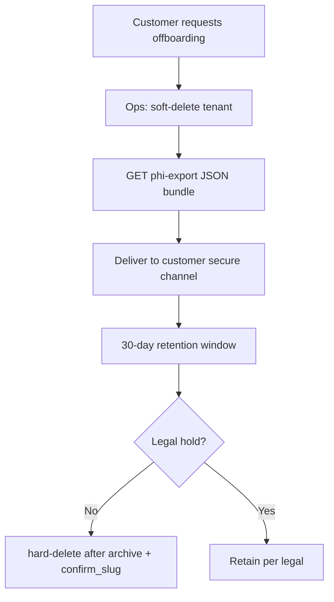

# Tenant Offboarding — PHI Export and Retention

**Related todos:** `fd0-offboarding`  
**API:** `GET /api/admin/tenants/:clinicId/phi-export` (requires `platform.tenants` capability)

## When to use

- Customer cancels subscription and requests their data.
- Practice changes PMS/vendor and needs a portability bundle.
- Pre-hard-delete archive verification.

## Workflow



## Step 1 — Pause services

1. Set `kelly_status=paused` or archive clinic (`DELETE /api/admin/tenants/:clinicId` mode=soft).
2. Confirm inbound calls forward to office `transfer_number` or hang up per config.

## Step 2 — Export PHI bundle

```bash
# Admin session required
curl -s -H "X-Admin-Secret: $ADMIN_PORTAL_SECRET" \
  "https://api.callsomo.com/api/admin/tenants/{clinicId}/phi-export" \
  -o tenant-export.json
```

Bundle includes (tenant-scoped, redacted):

- Clinic + customer metadata (no API secrets)
- Patients (`fhir_patients` for merchant)
- Call log metadata (duration, outcome — not full transcripts)
- Eligibility check summaries (no raw 271 `response_data`)
- Usage / billing month counters

## Step 3 — Retention

| Data class | Default retention after soft-delete |
|------------|-------------------------------------|
| PHI export audit | 7 years (compliance vault) |
| Application DB rows | 30 days then hard-delete eligible |
| GCS backups | Follow backup lifecycle policy |
| Stripe billing records | Per Stripe + tax requirements |

## Step 4 — Hard delete (optional)

Only when:

- Tenant is **archived**, or on seed/test allowlist.
- `confirm_slug` matches clinic slug.
- No legal hold.

```
DELETE /api/admin/tenants/:clinicId
Body: { "mode": "hard", "confirm_slug": "<slug>" }
```

Writes `admin_tenant_deletions` audit row before purge.

## HIPAA access log

Export requests are logged via `db.logHipaaAccess()` with action `phi_export`.

## Customer-facing communication template

> We have prepared a data export of your practice records from Somo. The file contains patient demographics, call metadata, and eligibility summaries as of [DATE]. Please confirm receipt. Per our agreement, production data will be removed from active systems after [DATE + 30 days] unless you request an extension.
