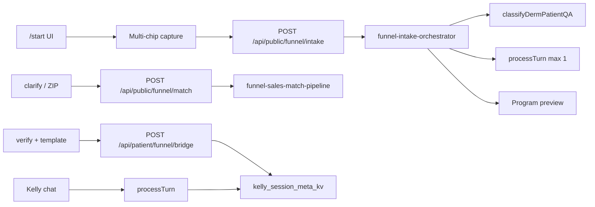

# Agentic architecture — funnel vs Kelly

**Last updated:** 2026-05-22

## Principle

`/start` runs **capture → bounded Kelly intake → single primary program**. Concern chips are multi-select (no auto-routing on tap). `POST /api/public/funnel/intake` (`funnel-intake-orchestrator.js`) fuses policy + at most **one** `KellyAgentService.processTurn` to validate the match before preview. `POST /api/public/funnel/match` remains for clarify sub-flows and specialist ZIP. After verify, Kelly chat reads funnel context via `POST /api/patient/funnel/bridge` → `kelly_session_meta_kv` (including `secondary_concern_ids`, `kelly_session_id`, `intake_proposal`).

North star: [01-north-star.md](./01-north-star.md) — verified patient + **active routine template** + first progress photo.

## Two pipelines

| Pipeline | Entry | Engine | Output |
|----------|-------|--------|--------|
| **Funnel capture** | `/start` What's going on | UI only | `concern_chips[]`, inquiry |
| **Funnel intake** | `/start` Kelly gate | `funnel-intake-orchestrator.js` | `proposal`: primary + secondaries |
| **Funnel sales** | clarify / legacy match | `funnel-sales-match-pipeline.js` | `program` \| `specialist` \| `clarify` \| `dual` |
| **Kelly agentic** | Landing assistant, patient app chat, voice | `kelly-agent-service.js` + `kelly-orchestrator-phase.js` | Tool calls, phases, PubMed planner |

## Rebuild vs keep vs defer

| Component | Verdict | Notes |
|-----------|---------|-------|
| `funnel-match-keywords.js` | **Keep as helpers** | L0 safety, escalation lexicon, legacy keyword boosts |
| `funnel-match-service.js` | **Delegate** | Thin wrapper → `funnel-sales-match-pipeline` |
| `funnel-sales-match-pipeline.js` | **Rebuild (MVP)** | Goal gate, catalog fusion, clarify `next_questions`, `dual` |
| `funnel-clinical-triage.js` | **Wire in** | Adapter: `classifyDermPatientQA` → funnel route (no duplicate rules) |
| `derm-patient-qa-triage.js` | **Wire in** | Same triage as Kelly derm Q&A / `POST /api/patient/derm-qa/triage` |
| `skin-condition-resolver.js` | **Wire in** | Same taxonomy Kelly uses |
| `concern-routine-service.js` | **Keep** | Catalog + preview + template activate |
| `clinical-recommendation-policy.js` | **Keep separate** | Full Kelly policy; funnel uses L0 + escalation only |
| `kelly-agent-service.js` | **Do not fork** | Post-signup only |
| `kelly-orchestrator-phase.js` | **No funnel phase** | Optional: read `funnel_match_json` in ROUTINE_INTAKE later |
| Pinecone / `result-summary-reasoning` | **Defer** | Scan reasoning, not Step 1 |
| `QueryPlanner` / PubMed | **Out of scope** | Kelly chat |
| `patient-funnel-bridge.js` | **Extend** | `user_goal`, `route`, `companion_concern_id`, `clarify_answers`, `secondary_concern_ids`, `kelly_session_id`, `intake_proposal` |
| `funnel-intake-orchestrator.js` | **Wire in** | Multi-chip fusion + bounded Kelly validation on `/start` |
| Face-read proxy | **Keep hook** | Copy/confidence only until `visual_hints` |
| NPPES specialists | **Keep** | Specialist + dual UX |

## Intent (two routes)

| Intent UI | `user_goal` | Notes |
|-----------|-------------|-------|
| Track a routine | `track_program` | Five programs via chips/symptoms (anti-aging = `anti_aging` chip, not a separate intent) |
| Find a specialist | `find_specialist` | Capture → Kelly safety (find-specialist prompt) → US ZIP → NPPES list; no template on save |

## Find specialist sub-flow (US only)

1. **Capture** — same multi-chip / inquiry step as track (goal-specific copy).
2. **Kelly gate** — one bounded `processTurn` with `buildKellyFindSpecialistMessage` (safety only; no skin-type or week-1 program). Static `copy` always states US ZIP / NPPES; `kelly_reply` holds safety text when present.
3. **ZIP** — US 5-digit ZIP only (`FunnelSpecialistZip`); symptoms omitted if already captured on match step.
4. **List** — `GET /api/public/funnel/specialists?zip=` → NPPES view. No country/state fields until a non-US directory exists.

## Specialist-only vs dual (product)

- **`find_specialist`** — directory + save; **no** template.
- **`both`** — set only via **Track while I find a derm** on the specialist screen (upsell), not on the intent step. `route: dual`; save activates template.

## Deferred

- Pinecone L3 on funnel
- Open-ended Kelly chat on `/start` (full landing assistant parity)
- MediaPipe / photo-driven program routing
- Returning-user continue card on landing
