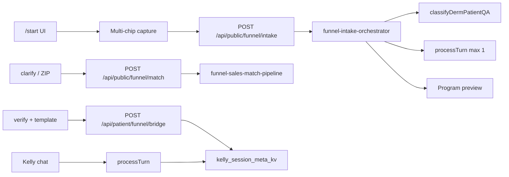

# JOURNEY

**Last updated:** 2026-06-02


---

<a id="02-journey-now"></a>

## 02-journey-now

*Merged from `docs/user-journey/02-journey-now.md` on 2026-06-02.*

# Journey — MVP (now)

**Last updated:** 2026-05-21

Frictionless path: **optional age hook → intent (why you’re here) → match (goal-aware inquiry + program, specialist, dual, or clarify) → week-1 preview, dual offer, or derm directory on `/start` → inline email + code → app with session + activated routine (program/dual only) → first progress photo on Today.**

## Principles

- **One auth moment** — email and 6-digit code only (no password, no duplicate login on web then app).
- **No profile gate** — do not block routine pick on demographics, insurance, or `onboarding.html`.
- **Web discovers and verifies** — landing and biological age on littlelab; account can start on `/start` (inline OTP) or `patient-login.html`.
- **App and web share the routine** — picker, Today, Timeline, Money; see [06-mobile-and-web-parity.md](./06-mobile-and-web-parity.md).
- **Age never blocks signup** — `/start` is optional; Signup from `/` skips the photo step.

## Happy path (7 steps)

1. **Discover** — User opens `/` (landing: `RoutineLanding.jsx`). CTAs: **Guess my age** or **Signup**.
2. **Optional hook + value** — **Guess my age** → `/start` (`BiologicalAgePage.jsx`): selfie → face-read estimate → confirm or correct age → **intent** (two routes: track routine or find dermatologist) → **match** (`POST /api/public/funnel/match` with `user_goal`, optional `clarify_answers`) → **program**, **specialist**, **clarify**, or **dual** (dual only after specialist upsell). Session stores `sc_user_goal`, `sc_match_json`, `sc_concern_id`, `sc_preview_json`, `sc_zip`, `sc_clarify_answers`.
3. **Account on funnel** — **Save** on `/start`: email → verify → `POST /api/patient/routine/template` only when `route` is `program` or `dual`. Specialist-only saves email + bridge meta without template. **Done** primary CTA: log today’s photo → `patient-dashboard.html`.
4. **Handoff** — **Get the app** (`POST /api/patient/auth/handoff/create` → `patientapp://auth?ticket=…`) or **Continue on web** (`patient-routine-pick.html` or dashboard if template exists).
5. **Alternate account** — **Signup** from `/` still goes to `/patients/patient-login.html?intent=signup` (same verify APIs).
6. **Land on Today** — `/(tabs)/today` as the first meaningful screen (default tab).
7. **Daily loop** — progress photo on Today; history on Timeline; bills via Money tab (optional).

## Alternate paths

| Entry | Path |
|-------|------|
| **Signup from landing** | `/` → `patient-login?intent=signup` → (steps 4–7) |
| **After age + preview** | `/start` save step → inline OTP → done handoff (app or web) |
| **Skip save on funnel** | `/start` → **Continue without saving** → done → web login |
| **Returning user (web)** | `patient-login.html` Login → template check → `patient-routine-pick.html` or `patient-dashboard.html` (Today) |
| **Returning user (app)** | App session in SecureStore → Home / routine tab; Login tab only if session expired |
| **Legacy URLs** | `/app`, `/join` → **302** → `patient-login.html` (preserves query e.g. `intent=signup`) |

## What we ask — now vs later

| Moment | Ask now | Defer (see [03-journey-later.md](./03-journey-later.md)) |
|--------|---------|----------------------------------------------------------|
| Account | Email + 6-digit code | Password, social login |
| After verify | App handoff or web pick → Today | Long intake, insurance |
| Activation | Concern on `/start` + template POST after verify (or pick on web/app) | Long intake, insurance, address |
| Age hook | Optional selfie + local confirm | Server-side confirmed age |
| Program preview | Week-1 `expect` + all `red_flags` from `concern-routines.json` | Full Kelly chat on funnel |
| Step 1 match | Goal-aware fusion pipeline (`funnel-sales-match-pipeline.js`); see [10-agentic-funnel-scope.md](./10-agentic-funnel-scope.md) | Kelly `processTurn` on `/start`; Pinecone L3 |
| Specialist path | NPPES derm directory (`/api/public/funnel/specialists`) | Booking on funnel |
| Daily | **One progress photo** = day logged; phase copy on Today | Step checklists as hero; AI chat |

## Flow diagram

```
/ ── Guess my age ──► /start: photo → age → intent → match → preview OR specialist OR dual → save (OTP)
 │                         │                              │
 │                         └── Continue without saving ───┼──► done (handoff)
 └── Signup ──► patient-login?intent=signup               │
                        email → code → confirm ──────────┤
                                                        ▼
                                              patient app (session) or web Today
                                                        │
                                                        ▼
                                              /(tabs)/today  (daily)
```

## Implementation status

Docs describe **target** behavior. Gaps below are intentional follow-up work (not blockers for writing the journey).

| Step | Target | Status |
|------|--------|--------|
| Post-verify redirect (signup) | App handoff → app `/routine/pick` | Done: `patient-login.html` handoff step |
| Post-verify redirect (login web) | Template check → pick or Today | Done: `finishAuthRedirect` + `redirectWebAfterAuth` |
| Session web → app | `patientapp://auth?ticket=…` | Done: handoff create/exchange; Expo `useAppDeepLinks` |
| Web parity nav | Today / Timeline / Money / Profile + FAB | Done: `patient-shell.js` + sidebar IA |
| Web Today / pick / Timeline copy | Routine-first, brand tokens | Done: see [06-mobile-and-web-parity.md](./06-mobile-and-web-parity.md) |
| App post-confirm | `/routine/pick` when `!has_template`, else Today | Done: `(tabs)/index.tsx` |
| Default tab | `/(tabs)/today` | Done: `(tabs)/_layout.tsx` |
| Progress photos | Photo → `completion_score` 100 + all `item_logs` complete; `today_logged` on summary | Done: see [07-v1-product-decisions.md](./07-v1-product-decisions.md) |
| Today phase card | `/phase` `expect` + collapsed steps | Done: web `patient-dashboard.html`, app `today.tsx` |
| Confirmed age | Optional enrichment | `sc_confirmed_age` in sessionStorage only |
| Funnel program | Match router + preview + optional inline verify | `sc_match_json`, `sc_concern_id`, `sc_preview_json`, `sc_patient_session_id` |
| Kelly bridge | After verify + template | `POST /api/patient/funnel/bridge` → `funnel_match_json` meta |
| Timeline trust | 48h backfill, read-only history, `frozen_steps` on past days | Done: `routine-day-mode.js`, Today/Journal banners |
| Sprint 3 compare | Ghost overlay before capture; long-press/dbl-click compare two days | Done: app `compare.tsx`, web dashboard ghost + schedule compare modal |
| v1.1 symptoms | Optional flare chips on photo day → timeline badges | Done: `symptom_tags` on upload + `calendar-range` |
| Phase-aware home cards | Progress cards use current phase names, not week-1 template | Done: `progress-summary` + web `renderRoutineCards` |
| Layering (V2-lite) | Conflict copy only (not Yuka scores) | Done: `layering-check` API; Today + Shelf surfaces |

When behavior changes, update this table and [06-mobile-and-web-parity.md](./06-mobile-and-web-parity.md) in the same PR.


---

<a id="04-surfaces-and-urls"></a>

## 04-surfaces-and-urls

*Merged from `docs/user-journey/04-surfaces-and-urls.md` on 2026-06-02.*

# Surfaces and URLs

**Last updated:** 2026-05-30

## Local development

```bash
# 1. Inference (optional for /start photo step)
./scripts/start-face-scan-stack.sh   # teamkelly :8765

# 2. Build Somo marketing landing
cd unified-dashboard/somo-landing && npm install && npm run build

# 3. Middleware (serves somo-landing build + patient static + APIs)
cd middleware-platform && npm start   # :4000

# 4. Patient app
cd patient-app && npx expo start
```

Open `http://127.0.0.1:4000/`

## URL map (MVP)

| URL | Surface | Purpose |
|-----|---------|---------|
| `/` | somo-landing | Somo marketing (hero, demo, pricing, signup CTA) |
| `/start` | _archive/littlelab-landing | Legacy funnel: face-age → match → OTP (archived CRA) |
| `/patients/patient-login.html` | unified-dashboard (static on middleware) | **Consumer signup/login** — email + 6-digit code (`?intent=signup` opens Sign Up tab) |
| `/app` | middleware redirect | **302** → `patient-login.html` (legacy; not a bridge page) |
| `/join` | middleware redirect | **302** → `patient-login.html` (legacy alias) |
| `/api/public/face-read` | middleware | Photo estimate (proxies teamkelly) |
| `/api/public/routines/concerns` | middleware | List concern programs for funnel chips |
| `/api/public/routines/:concernId/preview` | middleware | Week-1 preview (`week_one`, red flags) for funnel |
| `/api/public/funnel/match` | middleware | Step 1 router: `program` \| `specialist` \| `clarify` |
| `/api/public/funnel/specialists` | middleware | NPPES dermatology directory by ZIP (read-only) |
| `/api/patient/funnel/bridge` | middleware | After verify: write match context to Kelly session meta |
| `/api/patient/auth/handoff/create` | middleware | Web → app session ticket after funnel verify |
| `/api/patient/verify/send` | middleware | Email code (**web + app**) |
| `/api/patient/verify/confirm` | middleware | Create session (**web + app**) |
| `/api/patient/routine/template` | middleware | Activate routine (free) |
| `/api/patient/routine/phase` | middleware | Week/phase copy for Today |
| `/api/patient/routine/daily/:id/photo` | middleware | Progress photo → day logged |
| `/api/patient/home/progress-summary` | middleware | Portfolio cards + `today_logged` |
| `/patients/patient-dashboard.html` | unified-dashboard | **Web Today** (phase card + photo CTA) |
| `/patients/patient-routine-pick.html` | unified-dashboard | Web routine pick |
| `/patients/schedule.html` | unified-dashboard | Web Timeline |

**Legacy redirects:** `/consumer/*join*` → patient login; other `/consumer/*` → `/start` where applicable.

**Not primary path:** `onboarding.html`, `appointments.html` journal-only photo (`media-link`); use Today `/photo` for logging.

## Repos / folders

| Path | Role |
|------|------|
| `unified-dashboard/somo-landing/` | Somo marketing SPA (`/`) |
| `unified-dashboard/_archive/littlelab-landing/` | Archived consumer funnel (`/start`, Kelly) |
| `unified-dashboard/patients/` | Web patient login + legacy dashboard |
| `middleware-platform/` | API + serves `somo-landing/build/` + patient static |
| `patient-app/` | Routine picker, daily loop, prescriptions, bills |
| `teamkelly/` | Inference (gitignored in parent repo) |

## Patient app routes

| Route | Purpose |
|-------|---------|
| `/(tabs)/index` | Login tab — email + code (returning users or dev without web signup) |
| `/routine/pick` | Choose routine from bundled JSON (shown when `!has_template` after confirm) |
| `/(tabs)/today` | **Today** — phase card + photo (default tab) |
| `/(tabs)/timeline` | Calendar / journal |
| `/(tabs)/money` | Bills |
| `/(tabs)/profile` | Settings (profile depth deferred) |

After `verify/confirm` in the app, if the patient has no template, navigation goes to `/routine/pick` (`patient-app/app/(tabs)/index.tsx`).

## Deep links

| URL | Use |
|-----|-----|
| `patientapp://login` | **Returning users** — open Login tab when session expired |
| `patientapp://auth?ticket=…` | One-time web → app session handoff after signup |
| `patientapp://` + routine paths | Existing routine deep links |

Primary **new-user** path: web OTP on `patient-login.html` → handoff into app (not `patientapp://login` as a second signup).

## Env

- `FACE_READ_INFERENCE_BASE_URL=http://localhost:8765` (middleware `.env`)
- `EXPO_PUBLIC_API_BASE_URL=http://127.0.0.1:4000` (patient app)


---

<a id="06-mobile-and-web-parity"></a>

## 06-mobile-and-web-parity

*Merged from `docs/user-journey/06-mobile-and-web-parity.md` on 2026-06-02.*

# Mobile and web parity

**Last updated:** 2026-05-21

One routine-tracker journey on **Expo** and **web patient portal**. Same APIs, same steps, same tab names.

## Happy path (both surfaces)

| Step | User action | Expo route | Web URL |
|------|-------------|------------|---------|
| 1 | Discover (optional age) | — | `/`, `/start` |
| 2 | Email + 6-digit code | `/(tabs)/index` (Account) or web handoff | `/patients/patient-login.html` |
| 3 | Pick one of five routines | `/routine/pick` | `/patients/patient-routine-pick.html` |
| 4 | Land on Today | `/(tabs)/today` | `/patients/patient-dashboard.html` |
| 5 | Log progress photo | Today CTA or FAB → `/routine/capture` (front camera + live ghost) | Today **Log today's photo** |
| 6 | Review history | `/(tabs)/timeline` — **Photos** filmstrip default | `/patients/schedule.html` |
| 7 | Bills (optional) | `/(tabs)/money` via Account → Bills & receipts | `/patients/wallet.html` (secondary; Profile submenu intent) |
| 8 | Account / settings | `/(tabs)/account` | `/patients/profile.html` |

**Signup:** prefer app handoff (`patientapp://auth?ticket=…`). **Login / web:** template check → pick if none, else Today.

## Route map (web = in-portal, not a separate product)

| Web file | Role | Mobile tab |
|----------|------|------------|
| `patient-dashboard.html` | **Today** — stats, choose routine CTA | Today |
| `patient-routine-pick.html` | **Pick** — 5 concern templates | `/routine/pick` |
| `schedule.html` | **Timeline** — calendar, photos, list | Timeline |
| `wallet.html` | **Money** — bills, receipts (secondary) | Money (hidden tab; linked from Account) |
| `profile.html` | **Account** — profile, Bills link | Account |

**Mobile tabs (v1.2):** Today · Timeline · Account. Center FAB **Log photo** → `/routine/capture`.

**Web bottom nav:** [patient-shell.js](../../unified-dashboard/assets/js/patient-shell.js) — Today, Timeline, Account first; Routine, Products, Wallet follow (skincare-first order).

## Data: template → calendar

1. `POST /api/patient/routine/template` with `{ concern_id }` → `patient_routine_templates` (+ items from `concern-routines.json`).
2. **Today:** `GET /api/patient/routine/phase?date=` → week, phase, AM/PM steps, photo prompt.
3. **Timeline:** `GET /api/patient/journal/calendar-range` → `is_routine_day`, entries, thumbnails, billing overlays.

No separate “calendar product” — one template drives both screens.

**API ownership:** routine and journal → [`middleware-platform/routes/patient-routine.js`](../../middleware-platform/routes/patient-routine.js) (see [`docs/architecture/SERVER_DECOMPOSITION.md`](../architecture/SERVER_DECOMPOSITION.md)).

## Brand colors (consumer)

| Role | Hex | Use |
|------|-----|-----|
| Primary CTA | `#000000` | Choose routine, Start tracking |
| Brand accent | `#c85103` | Active tab, links, selected card, sidebar active |
| Capture FAB | `#314DB6` (`--sc-fab-capture-bg`) | Center camera only |
| Tertiary blue | `#378ADD` | Billing due/paid on Money/Timeline only |

Tokens: [skin-care-tokens.css](../../unified-dashboard/assets/css/skin-care-tokens.css), [GUIDELINES.md](../Brand/GUIDELINES.md).

## Do not use on primary path

| Surface | Why |
|---------|-----|
| `appointments.html` shelf wizard | Advanced custom routine; not 5-template onboarding |
| `my-records.html` as “home” | Product shelf browser; not Today |
| Billing-first Timeline copy | Misleading; routine journal is primary |
| `patient-dashboard` as login-only default without template check | Skips pick step |

**Deferred:** `appointments.html` remains reachable from Profile/advanced; not in primary sidebar.

## Signup vs login

| Intent | Default after verify |
|--------|----------------------|
| `intent=signup` | App handoff screen; optional “Use web” → template check |
| Login (web) | `GET /api/patient/routine/template` → pick or Today |

See [02-journey-now.md](./02-journey-now.md) implementation table for status.

## Automated sandbox (local)

```bash
cd middleware-platform && node scripts/sandbox-routine-photo-loop.cjs
```

Verifies all five concerns: every program phase has `expect` or `focus`, photo sync writes `item_logs`, card progress is non-zero after one photo day, and two-day `buildCompareDay` bundles resolve media URLs.

## Timeline trust + Sprint 3 (parity)

| Feature | Mobile (Expo) | Web |
|---------|---------------|-----|
| Day modes (today / backfill / historical) | `today.tsx` banners | `patient-dashboard.html?date=` |
| Ghost overlay before capture | `PhotoGhostOverlay` modal | Dashboard pre-picker preview |
| Two-photo compare | `compare.tsx`; journal long-press | `schedule.html` dbl-click thumbs; `GET /routine/compare` |
| Phase bands + milestone hints | `_journal.tsx` legend + badges | `schedule.html` calendar bands + legend |
| Inline day sheet | Journal bottom sheet | Dashboard date deep link |
| Optional symptom tags | Today chips after photo | Same via `/photo` |
| Phase-aware progress cards | Today stats (via API) | `renderRoutineCards` from `progress-summary` |
| Layering conflicts | Today expand + Shelf | Shelf N/A; routine steps on dashboard |
| `journal_date` deep link | N/A | `appointments.html?journal_date=` |

## Manual verification (web + Expo)

1. **Web login** — `patient-login.html` → no template → `patient-routine-pick.html`; with template → `patient-dashboard.html`.
2. **Pick** — select template → lands on Today with `?started=1` toast; bottom nav shows Today / Timeline / Money / Profile.
3. **Today** — black primary CTA; center FAB is blue; brown active sidebar tab.
4. **Photo** — Today CTA uploads via `/routine/daily/:id/photo`; progress cards not 0%; stat “Logged today” = Yes; Timeline calendar shows logged/media.
5. **Timeline** — routine-first header; `!has_template` banner links to pick; calendar shows routine days.
6. **Expo** — same pick → Today → Timeline; `_journal` redirects to `/routine/pick` when `has_template === false`.
7. **Compare** — log two days → journal long-press (app) or double-click photo thumb (web) → side-by-side compare.
8. **Ghost** — second-day capture shows faint prior photo guide before camera/file picker.
9. **Symptoms** — optional chips after photo; timeline cell shows top symptom when tagged.


---

<a id="07-v1-product-decisions"></a>

## 07-v1-product-decisions

*Merged from `docs/user-journey/07-v1-product-decisions.md` on 2026-06-02.*

# V1 product decisions — photo-first routine loop

**Last updated:** 2026-05-21

Locked decisions for Skin & Care routine tracker v1. See [06-mobile-and-web-parity.md](./06-mobile-and-web-parity.md) for routes and verification.

## Surface priority

Fix the **shared backend first**. The 0% progress bug lives in the API (photo did not write `item_logs`). Web and app both heal when `POST /api/patient/routine/daily/:id/photo` completes the day server-side.

## Clinical library on Today

1. **Phase summary card** — render `focus`, `expect`, `notes` from `GET /api/patient/routine/phase` (curated JSON, not RAG).
2. **Per-step “Why this?”** — deferred (retinoid / SPF); bounded RAG later.
3. **Floating chat** — not in v1 (support liability).

## Definition of a logged day

**One progress photo = day complete.** No required step checklists on the hero screen. Prescription and newly diagnosed users get depth from phase copy and red flags, not more logging UI.

## API contract (photo)

On successful photo upload:

- `patient_routine_daily_entries.completion_score` → `100`
- `patient_routine_daily_item_logs` → all active `template_items` marked `completed = 1` for that day
- `GET /api/patient/home/progress-summary` → `summary.today_logged: true`, `in_progress: 0`
- `assistant_summary` in response / `skin_report` includes phase `expect` when available
- `skin_report.frozen_steps` — phase-appropriate steps snapshot at upload time (used for historical display)
- **Today only:** `patient_routine_daily_item_logs` synced from active template items
- **Backfill (last 48h):** photo allowed; item_logs skipped; `frozen_steps` written to `skin_report` instead
- **Older than 48h:** read-only (`HISTORICAL_READ_ONLY`); no photo or daily POST mutations

## V1 readiness test

A user on week 3 of the acne program takes a photo, reads phase `expect` copy (e.g. mild purging is normal), sees no 0% on progress cards, and feels reassured — not blamed. Ship when that loop works.

## Progress photo capture (mobile)

- **Live ghost (v1.2):** `/routine/capture` uses `expo-camera` front-facing `CameraView` with the prior progress photo at ~35% opacity as an absolute overlay while framing.
- **Shorter ritual:** Shutter uploads immediately (haptics + celebrate banner on Today). Optional symptom chips in a collapsible sheet on the capture screen.
- **Align preview (optional):** Library uploads may open `PhotoAlignPreview` via **Review alignment** — not on the default camera path.
- **Prior photo lookup:** One `calendar-range` request (14-day window), not per-day serial fetches.
- **Symptoms:** Optional chips sent as `symptom_tags` on multipart `POST .../photo`.

## Out of scope (v1)

- Floating RAG chat on Today
- Mandatory post-capture align step on every photo (power users can opt in from library path)
- Handoff analytics (`auth_handoff_continue_web`) before loop is trusted
- Web journal `media-link` path unification (legacy; Today uses `/photo` like the app)


---

<a id="08-step1-match-users"></a>

## 08-step1-match-users

*Merged from `docs/user-journey/08-step1-match-users.md` on 2026-06-02.*

# Step 1 Match — users and stories

**Last updated:** 2026-05-21

Step 1 on `/start` starts with **intent** (two routes: track routine or find dermatologist), then match → program, specialist, clarify, or **dual** (only after specialist upsell). Save activates a template only on program/dual paths.

## Personas

| Persona | Goal on `/start` | Match outcome |
| ------- | ---------------- | ------------- |
| **RoutineStarter** | Wants a guided 12-week plan | `user_goal: track_program` → `route: program` (any of five concerns, incl. Lines & texture / `anti_aging`) |
| **SpecialistSeeker** | Wants a specialist near them | `user_goal: find_specialist` → ZIP step → `route: specialist` (no default template) |
| **DualSeeker** | Chose “Track while I find a derm” on specialist screen | `user_goal: both` → `route: dual` |
| **SafetyEscalation** | Mole change, spreading rash, systemic symptoms | `route: specialist`, `urgency: high`, no program |
| **ReturningPatient** | Already has an active template | Continue card; skip full match when session has template |

## User stories

1. As **RoutineStarter**, after intent “Track a routine” I describe my concern **or** tap a chip (including Lines & texture), then see a week-1 preview.
2. As **SpecialistSeeker**, after intent “Find a dermatologist” I enter ZIP and see NPPES directory cards; save does not activate a template unless I opt into tracking afterward.
3. As **DualSeeker**, on the specialist list I tap **Track while I find a derm**, pick a program, then save with template + directory context.
4. As **SafetyEscalation**, red-flag language never assigns a routine; specialist path only.
5. As any user, **Not sure** prompts clarify—not silent default to barrier repair.
6. As **ReturningPatient** with a patient session, I can continue my existing program without re-picking chips (deferred UI).

## When the account (user) is created

Unchanged from [02-journey-now.md](./02-journey-now.md):

- **Anonymous** through photo, age, and match (`sessionStorage`: `sc_match_json`, `sc_concern_id`, `sc_face_read`, `sc_zip`).
- **Account** = email + 6-digit OTP on the save step (`POST /api/patient/verify/confirm`).
- After confirm: `POST /api/patient/routine/template` when `route` is `program` or `dual`; `POST /api/patient/funnel/bridge` stores `user_goal`, `route`, `companion_concern_id`, `clarify_answers`.

## Non-goals on `/start`

- Full Kelly `processTurn` / OPQRST interview
- `run_triage_rag` or booking on the funnel
- Guaranteed appointment booking on NPPES cards

## Related

- Design copy and wireframes: [09-step1-match-design.md](./09-step1-match-design.md)
- Agentic split (funnel vs Kelly): [10-agentic-funnel-scope.md](./10-agentic-funnel-scope.md)
- URLs: [04-surfaces-and-urls.md](./04-surfaces-and-urls.md)


---

<a id="09-step1-match-design"></a>

## 09-step1-match-design

*Merged from `docs/user-journey/09-step1-match-design.md` on 2026-06-02.*

# Step 1 Match — design reference

**Last updated:** 2026-05-21

Wireframe-level spec for `/start` after biological age confirm. Implementation (archived): `unified-dashboard/_archive/littlelab-landing/src/pages/funnel/`.

## Funnel steps

| Step | Headline | Primary UI |
| ---- | -------- | ---------- |
| Photo | Guess my age / Your skin age | Camera or library |
| **intent** | How can we help? | Two cards: Track a routine / Find a specialist |
| **specialistZip** | Find specialists | ZIP required; optional symptoms |
| **match** | What's going on? | Chips-first triage + optional detail; **no ZIP** on track |
| **clarify** | A few quick questions | `next_questions` (duration; rash: location, changing) |
| **preview** | Your week 1 plan | Week-one card, tracking CTA copy, save |
| **specialist** | Specialists near you | NPPES `nppes_v_physicians_specialists`; specialty on card; **Save** primary; **Track while I find a specialist** upsell |
| **dual** | Track & find care | After upsell only: program preview + specialist list |
| save | Save this plan | Email OTP; template only program/dual |
| done | You're set | Primary: **Log today's photo** → patient-dashboard |

## Chapter dots (Photo · Goal · Match · Plan · Save)

- **Photo:** capture → analyzing → confirm → correct
- **Goal:** intent
- **Match:** match, clarify, specialistZip (find specialist only)
- **Plan:** preview, specialist, or dual
- **Save:** save → done

## Track triage screen (`FunnelTrackTriage`)

- Section **What's going on**: concern chips (primary); optional detail textarea below
- No ZIP; `POST /api/public/funnel/match` sends `zip: null` for `track_program`
- Unmapped or low-confidence text → `clarify` (not specialist directory)
- Continue disabled until chip selected or inquiry ≥ 8 characters

## Specialist ZIP screen (`FunnelSpecialistZip`)

- ZIP required (5 digits); optional symptoms
- `user_goal: find_specialist` → specialist list via NPPES physician specialists view

## Specialist screen

- Banner if `urgency: high` from L0 safety
- Cards: name, city/state, phone (if present), NPI
- Footer: *Directory information only. Booking is not guaranteed on Skin & Care. Confirm availability with the practice.*
- CTA: Save this list / Continue → same save step as program path

## L0 safety copy (server)

Uses `triage-service.detectRedFlags` — same rules as Kelly. Client must not be the only safety gate.

## Face-read (L2)

- Stored in `sc_face_read`
- If apparent vs confirmed age delta ≥ 8 or `quality: low`, show confidence note on **preview** only; does not change route

## Returning user

- If `GET /api/patient/routine/template` returns active template (session present): show *Continue your [concern] program?* on match step


---

<a id="10-agentic-funnel-scope"></a>

## 10-agentic-funnel-scope

*Merged from `docs/user-journey/10-agentic-funnel-scope.md` on 2026-06-02.*

# Agentic architecture — funnel vs Kelly

**Last updated:** 2026-05-22

## Principle

`/start` runs **capture → bounded Kelly intake → single primary program**. Concern chips are multi-select (no auto-routing on tap). `POST /api/public/funnel/intake` (`funnel-intake-orchestrator.js`) fuses policy + at most **one** `KellyAgentService.processTurn` to validate the match before preview. `POST /api/public/funnel/match` remains for clarify sub-flows and specialist ZIP. After verify, Kelly chat reads funnel context via `POST /api/patient/funnel/bridge` → `kelly_session_meta_kv` (including `secondary_concern_ids`, `kelly_session_id`, `intake_proposal`).

North star: [01-north-star.md](./01-north-star.md) — verified patient + **active routine template** + first progress photo.

## Two pipelines

| Pipeline | Entry | Engine | Output |
|----------|-------|--------|--------|
| **Funnel capture** | `/start` What's going on | UI only | `concern_chips[]`, inquiry |
| **Funnel intake** | `/start` Kelly gate | `funnel-intake-orchestrator.js` | `proposal`: primary + secondaries |
| **Funnel sales** | clarify / legacy match | `funnel-sales-match-pipeline.js` | `program` \| `specialist` \| `clarify` \| `dual` |
| **Kelly agentic** | Landing assistant, patient app chat, voice | `kelly-agent-service.js` + `kelly-orchestrator-phase.js` | Tool calls, phases, PubMed planner |



## Rebuild vs keep vs defer

| Component | Verdict | Notes |
|-----------|---------|-------|
| `funnel-match-keywords.js` | **Keep as helpers** | L0 safety, escalation lexicon, legacy keyword boosts |
| `funnel-match-service.js` | **Delegate** | Thin wrapper → `funnel-sales-match-pipeline` |
| `funnel-sales-match-pipeline.js` | **Rebuild (MVP)** | Goal gate, catalog fusion, clarify `next_questions`, `dual` |
| `funnel-clinical-triage.js` | **Wire in** | Adapter: `classifyDermPatientQA` → funnel route (no duplicate rules) |
| `derm-patient-qa-triage.js` | **Wire in** | Same triage as Kelly derm Q&A / `POST /api/patient/derm-qa/triage` |
| `skin-condition-resolver.js` | **Wire in** | Same taxonomy Kelly uses |
| `concern-routine-service.js` | **Keep** | Catalog + preview + template activate |
| `clinical-recommendation-policy.js` | **Keep separate** | Full Kelly policy; funnel uses L0 + escalation only |
| `kelly-agent-service.js` | **Do not fork** | Post-signup only |
| `kelly-orchestrator-phase.js` | **No funnel phase** | Optional: read `funnel_match_json` in ROUTINE_INTAKE later |
| Pinecone / `result-summary-reasoning` | **Defer** | Scan reasoning, not Step 1 |
| `QueryPlanner` / PubMed | **Out of scope** | Kelly chat |
| `patient-funnel-bridge.js` | **Extend** | `user_goal`, `route`, `companion_concern_id`, `clarify_answers`, `secondary_concern_ids`, `kelly_session_id`, `intake_proposal` |
| `funnel-intake-orchestrator.js` | **Wire in** | Multi-chip fusion + bounded Kelly validation on `/start` |
| Face-read proxy | **Keep hook** | Copy/confidence only until `visual_hints` |
| NPPES specialists | **Keep** | Specialist + dual UX |

## Intent (two routes)

| Intent UI | `user_goal` | Notes |
|-----------|-------------|-------|
| Track a routine | `track_program` | Five programs via chips/symptoms (anti-aging = `anti_aging` chip, not a separate intent) |
| Find a specialist | `find_specialist` | Capture → Kelly safety (find-specialist prompt) → US ZIP → NPPES list; no template on save |

## Find specialist sub-flow (US only)

1. **Capture** — same multi-chip / inquiry step as track (goal-specific copy).
2. **Kelly gate** — one bounded `processTurn` with `buildKellyFindSpecialistMessage` (safety only; no skin-type or week-1 program). Static `copy` always states US ZIP / NPPES; `kelly_reply` holds safety text when present.
3. **ZIP** — US 5-digit ZIP only (`FunnelSpecialistZip`); symptoms omitted if already captured on match step.
4. **List** — `GET /api/public/funnel/specialists?zip=` → NPPES view. No country/state fields until a non-US directory exists.

## Specialist-only vs dual (product)

- **`find_specialist`** — directory + save; **no** template.
- **`both`** — set only via **Track while I find a derm** on the specialist screen (upsell), not on the intent step. `route: dual`; save activates template.

## Deferred

- Pinecone L3 on funnel
- Open-ended Kelly chat on `/start` (full landing assistant parity)
- MediaPipe / photo-driven program routing
- Returning-user continue card on landing


---

<a id="11-growth-backlog"></a>

## 11-growth-backlog

*Merged from `docs/user-journey/11-growth-backlog.md` on 2026-06-02.*

# Growth and friction backlog

**Last updated:** 2026-05-21

Deferred items after Reddit-gap Waves A–F. Not blocking V1 routine trust.

- Home-screen widget / one-tap progress photo shortcut (iOS/Android)
- Extend backfill beyond 48 hours (product tradeoff vs data integrity)
- Per-step “Why this?” bounded RAG on Today
- Floating Kelly chat on Today (support liability — see `07-v1-product-decisions.md`)
- ~~Funnel analytics: `auth_handoff_continue_web`, handoff reliability metrics~~ — shipped: `POST /api/patient/funnel/event`; see [12-funnel-qa-checklist.md](./12-funnel-qa-checklist.md)
- Weekly template item rotation in DB without breaking `frozen_steps` (see optional F2 in Reddit gap plan)


---

<a id="12-funnel-qa-checklist"></a>

## 12-funnel-qa-checklist

*Merged from `docs/user-journey/12-funnel-qa-checklist.md` on 2026-06-02.*

# Funnel QA checklist (`/start`)

**Last updated:** 2026-05-21

Manual verification after funnel API or landing changes. Requires middleware on `:4000` and CRA build for `/start` (or dev server).

## Automated (API)

With server running:

```bash
cd middleware-platform && npm run test:e2e-funnel
```

## Happy paths

1. **Track program** — Photo → age → intent (track routine) → match → program preview → save (email + OTP) → done.
2. **Find specialist** — Intent (find derm) → capture → Kelly gate → US ZIP → NPPES list → save without template.
3. **Dual** — Specialist path → upsell “Track while I find a derm” → dual offer → save activates template.

## Handoff

4. **Continue on web** — After save with session, tap **Continue on web** → `patient-dashboard.html` loads; confirm `patient_portal_events` row `auth_handoff_continue_web`.
5. **Get the app** — Handoff link includes `patientapp://auth?ticket=…`; confirm `auth_handoff_app_link_shown` event when ticket returned.

## Redirects

6. **Legacy `/consumer`** → redirects to `/start` (or login for get-app/join paths).

## Portal events (SQL)

```sql
SELECT event_name, created_at, metadata_json
FROM patient_portal_events
WHERE session_id = '<portal_session_id>'
ORDER BY created_at DESC;
```

Expected funnel-related names: `auth_handoff_continue_web`, `auth_handoff_app_link_shown`, `auth_handoff_app_link_failed`, plus `auth_handoff_created` / `auth_handoff_exchanged` from routine routes.
