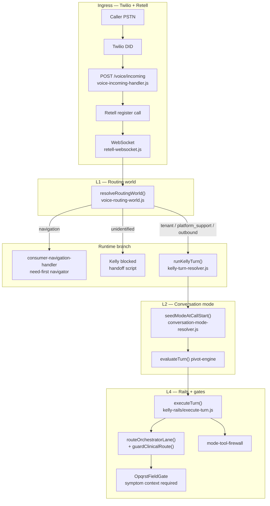
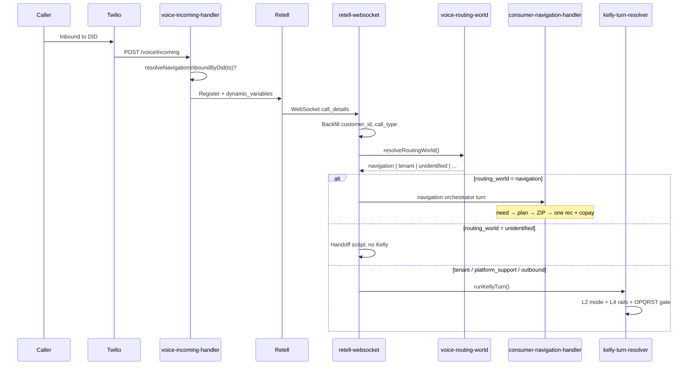
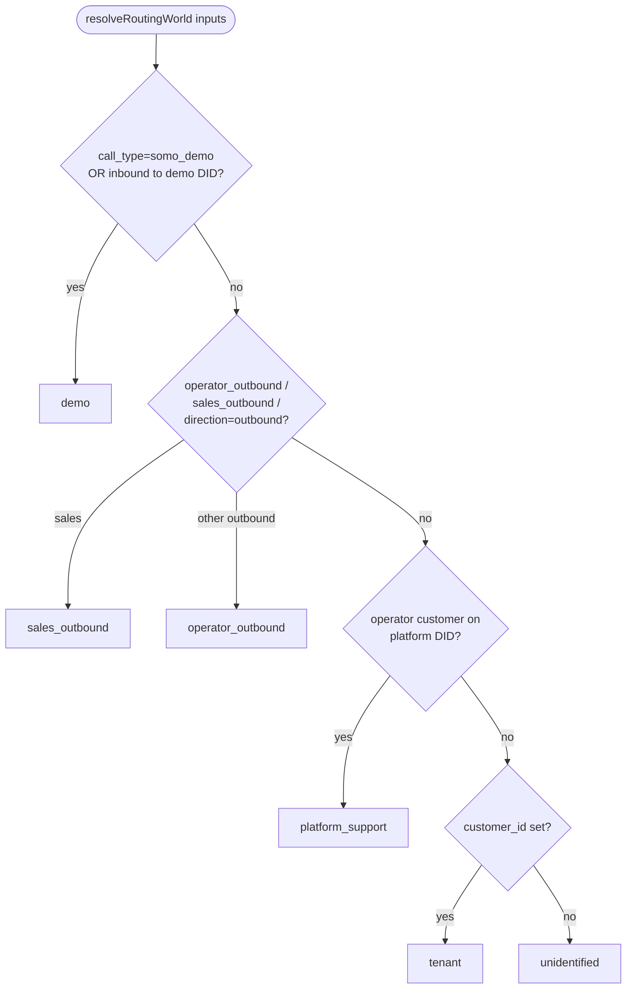
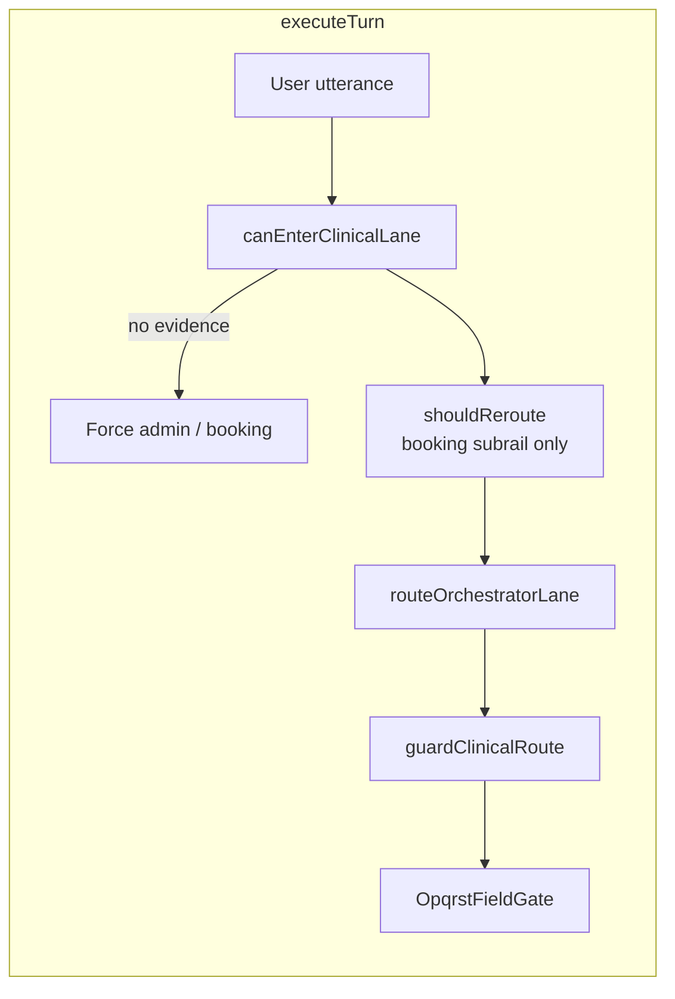
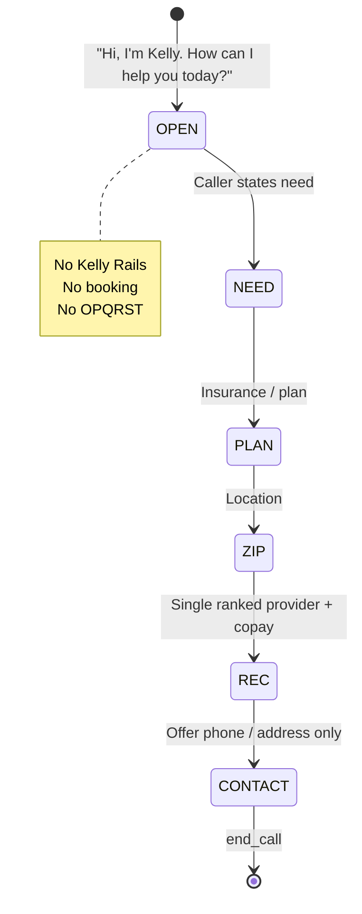
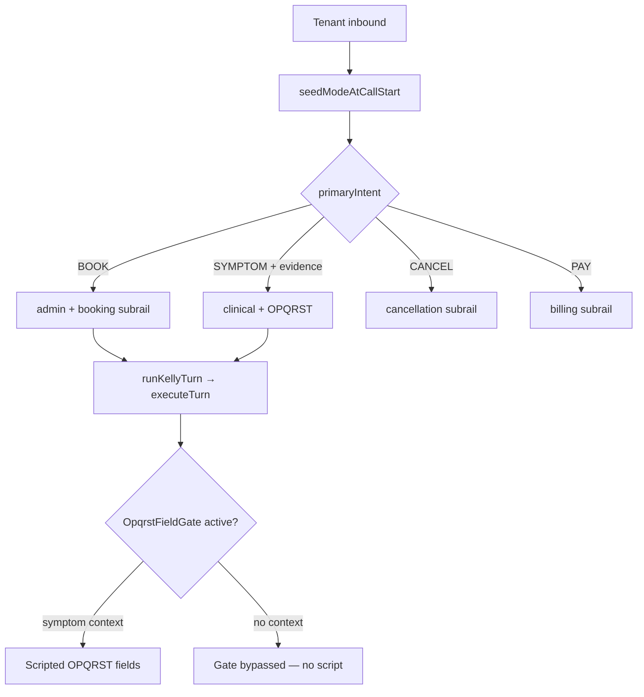

# Somo voice routing architecture

**Last updated:** 2026-06-24  
**Epic:** PLATFORM-VOICE  
**Production revision (PD-4 verified):** `somo-middleware-00079-kdz`

This document describes how inbound and outbound voice calls are classified, routed, and handled across **routing worlds**, and how **L2 conversation mode** and **L4 Kelly Rails / OPQRST guards** prevent clinical bleed on tenant lines.

**Platform DID (`+13639990205`):** Company **platform support / sales** when `PLATFORM_INBOUND_MODE=support` — not tenant Kelly. Landing demos use `/api/public/somo-demo` (separate outbound path). See [`VOICE_ROUTING_SSOT.md`](VOICE_ROUTING_SSOT.md) and [`PLATFORM_NUMBER_INBOUND_SPEC.md`](PLATFORM_NUMBER_INBOUND_SPEC.md).

---

## 1. System overview

Somo voice uses a **shared Retell agent** (Kelly) with **runtime branching** — the same agent ID can behave as consumer navigator, tenant front desk, or operator outbound depending on `to_number`, `call_type`, and `customer_id`.

---

## 2. Phone numbers and routing worlds

| Number / env | Typical role | `routing_world` | Handler |
|--------------|--------------|-----------------|---------|
| `+13639990205` / `CALLSOMO_OPERATOR_TWILIO_NUMBER` / `TWILIO_PHONE_NUMBER` | Company sales / platform support | `platform_support` | platform support rail |
| Tenant `customers.twilio_phone_number` | Clinic DID | `tenant` | Kelly Rails V2 |
| Operator CID (outbound) | Somo operator calls | `operator_outbound` | `operator-outbound-rail` |
| Sales outbound | Lead dialer | `sales_outbound` | Outbound sales rail |
| Any DID, no `customer_id`, not demo line | Misconfigured / anonymous | `unidentified` | Fail-closed handoff |
| Operator `customer_type` on platform DID | Internal / support | `platform_support` | Admin + handoff |

**Key rule:** `tenantResolved` = **`customer_id` present only** — `clinic_id` or `DEFAULT_CLINIC_ID` alone does **not** make a call a tenant call (R-5b).

---

## 3. Ingress path (Twilio → Retell → WebSocket)

### 3.1 Twilio webhook (`voice-incoming-handler.js`)

When a call hits a Twilio number:

1. **Demo detect** — `call_type=somo_demo` query param **or** `isDemoTwilioNumber(to)`.
2. **Account resolve** — `resolveVoiceAccount()` maps `to` → `customer_id`, `clinic_id`, Retell agent.
3. **Metadata build** — `metadata` + `retell_llm_dynamic_variables`: `call_type`, `customer_id`, `clinic_id`, `direction`, `demo_request_id`, etc.
4. **Retell register** — bridges PSTN to Retell custom LLM WebSocket URL.
5. **Mode seed (async)** — `seedModeAtCallStart()` with `isTenantResolvedForMode(customer_id)`.

### 3.2 Retell WebSocket (`retell-websocket.js`)

On `call_details`:

1. **Backfill identity (R-3)** — if Retell omits metadata, read `dynamic_variables`: `customer_id`, `call_type`, `to_number`, `from_number`.
2. **Clinic fallback (R-8)** — `DEFAULT_CLINIC_ID` only when `customer_id` is already resolved.
3. **Routing world (R-2, R-8)** — `resolveRoutingWorld()` → `connection.routing_world` + `routing_world_resolved` event.
4. **Demo gate (R-4)** — `isSomoDemoDemoConnection()`: `call_type=somo_demo` **OR** inbound `isDemoLineToNumber(to)`.
5. **Kelly block** — `shouldBlockKellyTurn(navigation|unidentified)` before `runKellyTurn()` on non-tenant paths.

---

## 4. Routing world resolution

**Source of truth:** `middleware-platform/services/voice-routing-world.js`

**Telemetry:** `emitRoutingWorldEvent()` → `kelly_call_events.event_type = routing_world_resolved` (when table exists) + Cloud Run log `[routing_world] call=… world=…`.

---

## 5. L2 — Conversation mode layer

**Purpose:** Decide *what kind of conversation* this is before tools and lanes run.

| Component | File | Role |
|-----------|------|------|
| Mode resolver | `conversation-mode/conversation-mode-resolver.js` | Seed mode at call start from `call_type`, `routing_world`, first utterance |
| Session SSOT | `conversation-mode/conversation-mode-session.js` | Persist `conversation_mode`, `active_subrail`, `fail_closed` |
| Pivot engine | `conversation-mode/pivot-engine.js` | Per-turn mode changes (e.g. admin → clinical) |
| Intent detector | `conversation-mode/intent-detector.js` | BOOK, SYMPTOM, HANDOFF, contact capture |
| Tool firewall | `conversation-mode/mode-tool-firewall.js` | Block `store_triage_opqrst` on demo, handoff, unidentified |

### Conversation modes (8)

| Mode | When | Clinical tools |
|------|------|----------------|
| `demo_qual` | Demo / platform qualification | **Blocked** |
| `tenant_inbound_admin` | Default tenant; booking, cancel | Booking allowed; OPQRST blocked on booking subrail |
| `tenant_inbound_clinical` | Symptom + evidence | OPQRST allowed |
| `tenant_billing` | Copay / payment | Payment tools |
| `tenant_records` | Records requests | Records QA |
| `operator_outbound` | Operator reminder / follow-up | **Blocked** |
| `outbound_sales` | Sales dialer | **Blocked** |
| `emergency_safety` | Emergency utterance | Handoff only |

### Intent hygiene (prevents false clinical)

| Guard | What it stops |
|-------|----------------|
| I-1 | `book`, `appointment`, `doctor` in `CLINICAL_SIGNALS` |
| I-3 | Email/phone → `GENERAL`, not `SYMPTOM` |
| I-5 / I-6 | `SYMPTOM` pivot/seed only with `hasSymptomEvidence()` |
| I-4 / LX-1 | HANDOFF → demo `record_interest` + `end_call` |

---

## 6. L4 — Kelly Rails and belt guards

**Purpose:** Even if L2 is wrong, L4 downgrades or blocks clinical lanes.

| Guard | File | Rule |
|-------|------|------|
| L-1 / L-3 | `kelly-rails/enter-clinical-lane.js` | Clinical lane only with symptom text or triage onset/quality/severity |
| L-2 | `kelly-rails/execute-turn.js` `shouldReroute()` | Booking keyword reroute only with booking subrail or explicit booking intent |
| L-4 | `services/opqrst-field-gate.js` | OPQRST scripting only when symptom context established |
| L-5 | `kelly-rails/hydrate.js` | L2 admin mode wins over L4 clinical lane on hydrate |
| CR-052+ | `mode-tool-firewall.js` | Unidentified / handoff / `triage_policy=disabled` blocks clinical tools |

---

## 7. Navigation path (platform inbound) — **disabled in production**

> **Status (2026-07-10):** `NAVIGATION_ENABLED=0` on Cloud Run.
> Platform DID `+13639990205` uses **`platform_support`** (sales rail); consumer-nav path disabled. See [VOICE_ROUTING_SSOT.md](./VOICE_ROUTING_SSOT.md).

**Entry (when enabled):** `routing_world=navigation` when `NAVIGATION_ENABLED=1` and inbound `To` matches platform DID (`resolveNavigationInboundByDid`).

**Handler:** `webhooks/consumer-navigation-handler.js` + `services/navigation/navigation-orchestrator.js`

**Operator runbook:** [`docs/runbooks/NAVIGATION_OPERATOR_RUNBOOK.md`](../runbooks/NAVIGATION_OPERATOR_RUNBOOK.md).

---

## 8. Tenant path (clinic DID)

**Entry:** `routing_world=tenant` + `customer_id` on Twilio URL and Retell metadata.

**Booking without symptoms:** `"Can I make a booking?"` → `BOOK` intent → booking lane — **not** OPQRST (verified PD-4 on platform demo; same intent logic on tenant).

---

## 9. Operator outbound path

**Entry:** `routing_world=operator_outbound`, `call_type=operator_outbound`.

**Rail:** `conversation-mode/rails/operator-outbound-rail.js`

Stages: `callback_intro` → `update` → `confirm` → `handoff_offer` → `close`

Special cases:
- **Voicemail / IVR (O-2):** Single short message, `endCall`
- **Opt-out (LX-6):** "Don't call again" → suppress + end

---

## 10. Unidentified / fail-closed path

When `customer_id` is missing and the call is **not** on the demo DID:

1. L2 seeds `tenant_inbound_admin` + `handoff` subrail, `fail_closed=true`.
2. WS blocks `runKellyTurn()` (`shouldBlockKellyTurn`).
3. Opener: *"Thanks for calling. I am having trouble loading your account details…"*
4. Tool firewall blocks all clinical tools (CR-052+).

**Historical bug (fixed):** `DEFAULT_CLINIC_ID` fallback + `tenantResolved = clinic_id || customer_id` caused platform calls to run tenant Kelly + OPQRST. Fixed by R-5b and R-8.

---

## 11. Data and telemetry

| Store | Contents |
|-------|----------|
| `kelly_call_events` | `routing_world_resolved`, `mode_resolved`, `orchestration_trace`, `mode_violation_blocked`, tool events |
| `kelly_rails_session_projection` | `active_lane`, `step`, `flags_json` (conversation_mode, subrail) |
| `triage_sessions` | OPQRST fields — **tenant clinical only** |
| `somo_demo_requests` | Demo qualification leads |
| `voice_call_log` | Provider portal call list |

**Provider UI:** `unified-dashboard/business/calls.html` shows `routing_world` pill from call forensics API.

**Note:** Prod GCS SQLite may lag on `kelly_call_events` migration — use Retell transcript + Cloud Run logs for PD-4 until migration completes.

---

## 11a. L1.5 — CallSiteContext (site admission)

**Module:** `services/call-site-context.js`  
**Table:** `call_site_context` (migration 062)

After L1 `routing_world` resolves, **CallSiteContext** determines whether the inbound DID maps to a single verified clinic:

| `site_context_status` | Meaning | Booking / clinical tools |
|------------------------|---------|---------------------------|
| `verified` | DID → clinic, customer matches | Allowed |
| `ambiguous` | Heuristic or customer/clinic mismatch | Blocked + escalation |
| `missing` | No clinic resolved | Blocked + escalation |
| `not_required` | Demo line, operator outbound | Allowed (world rules) |

**Ingress:** `voice-incoming-handler.js` calls `resolveCallSiteContext()` before Retell register; metadata + dynamic variables carry `site_context_status` and `clinic_id_source`.

**WebSocket:** `retell-websocket.js` re-hydrates from `to_number` → `clinic_phone_numbers` (DID-first); emits `call_site_context_resolved`.

**Tool gate:** `mode-tool-firewall.js` `SITE_SENSITIVE_TOOLS` + `execute-turn.js` / `kelly-tool-executor.js` enforce verified site for OPQRST writes.

---

## 11b. Escalation ladder

**Module:** `services/escalation-service.js`  
**Table:** `handoff_escalations` (migration 069)

Fail-closed and handoff paths:

1. Play handoff copy (`voice-identity-admission.handoffCopy`)
2. Insert `handoff_escalations` row + `fail_closed_escalation` Kelly event
3. Attempt PSTN transfer: clinic `transfer_number` → `fallback_pstn` → `CALLSOMO_OPERATOR_FALLBACK_PSTN`
4. Retell WS: `sendRetellResponse(..., transferNumber)`; Twilio ingress: `buildMissingRetellTwiml` optional `<Dial>`

**Emergency (ESC-06):** Before Kelly block on unidentified paths, scan `isEmergency()` + demo red-flag helper.

**Provider UI:** `calls.html` shows handoff escalations from `GET /api/kelly/calls/:sessionId`.

---

## 12. Key file index

| Layer | File |
|-------|------|
| Ingress | `services/voice-incoming-handler.js`, `routes/voice-incoming.js` |
| WebSocket | `webhooks/retell-websocket.js` |
| Routing world | `services/voice-routing-world.js` |
| Site context | `services/call-site-context.js` |
| Escalation | `services/escalation-service.js` |
| Navigation | `webhooks/consumer-navigation-handler.js`, `services/navigation/navigation-orchestrator.js` |
| Kelly turn | `services/kelly-turn-resolver.js` |
| L2 | `services/conversation-mode/*` |
| L4 | `services/kelly-rails/execute-turn.js`, `enter-clinical-lane.js`, `state-schema.js` |
| OPQRST gate | `services/opqrst-field-gate.js` |
| Operator | `services/conversation-mode/rails/operator-outbound-rail.js` |
| Verify | `scripts/pd-4-platform-live-verify.cjs`, `scripts/voice-routing-matrix-smoke.cjs` |

---

## 13. PD-4 live verification (2026-06-19)

**Call:** `call_c9768562b9a28d6d91d44a4903b` — inbound `+12028131474` → `+13639990205`

| Check | Result |
|-------|--------|
| Demo qualification flow | ✅ Practice-size question |
| `"Can I make a booking?"` | ✅ No OPQRST |
| Kelly clinical path | ✅ Not taken |

---

---

## 14. Scale limits (admission, concurrent, multi-replica)

Phone handling uses **three separate limit types**:

| Limit | Enforced on | Shared across replicas? |
|-------|-------------|-------------------------|
| **max_concurrent_calls** | Before call_admission + Retell register | Yes — Redis (`VOICE_RATE_LIMIT_BACKEND=redis`) |
| **call_admission** | After concurrent pass, on `POST /voice/incoming` | Yes — Redis |
| **turn_rate_limit** | Retell WS turn events (`update_only`, `response_required`, `function_call`) | Per-process abuse guard (high ceiling) |

Tier defaults (plan catalog): Starter 30 req/min + 2 concurrent; Practice 75 + 5; Clinic Pro 150 + 10.

**Production:** `REDIS_URL` required. `/health?detailed=true` includes `voice_redis` probe.

**Cloud Run:** Do not scale `min-instances > 1` until Redis voice limits are healthy.

Full ops checklist: [`docs/runbooks/VOICE_SCALE_READINESS.md`](../runbooks/VOICE_SCALE_READINESS.md).

---

## 15. Related docs

- [PLATFORM_NUMBER_INBOUND_SPEC.md](./PLATFORM_NUMBER_INBOUND_SPEC.md) — product spec
- [VOICE_RETELL_AGENT_CONTRACT.md](./VOICE_RETELL_AGENT_CONTRACT.md) — shared agent branching
- [R-1-PLATFORM-LINE-AUDIT.md](./R-1-PLATFORM-LINE-AUDIT.md) — number audit
- [../runbooks/OPERATIONS.md](../runbooks/OPERATIONS.md) — number map + OPQRST runbook
- [../../todos/PLATFORM-VOICE-ROUTING.md](../../todos/PLATFORM-VOICE-ROUTING.md) — implementation tracker
