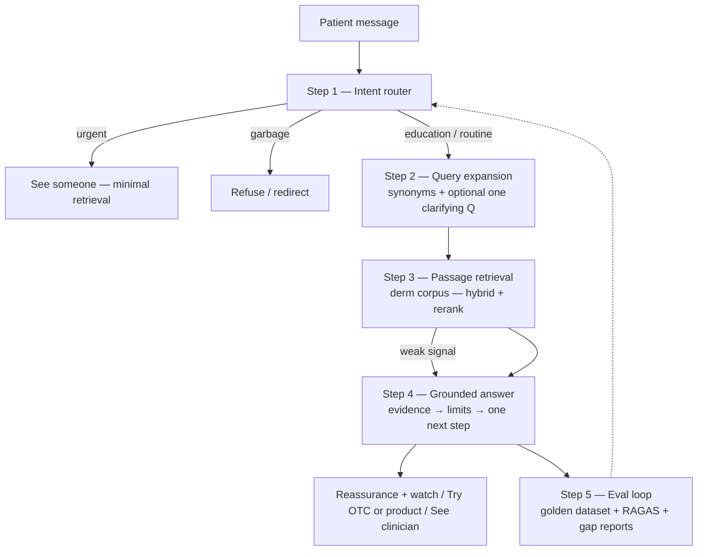

# Derm patient Q&A — backend completed (Phases 0–5) — Reddit-informed world model + triage-first

**Purpose:** Track work to answer **real patient-shaped queries** (vague titles, worry, family/third-party, routine product questions) using **triage-first routing**, **grounded retrieval**, and **safe answers** — aligned with the platform architecture (`knowledge-service`, Colab RAG, triage, optional Step10).

**North star:** *Right evidence for the right fear — fast, safe, and specific to skin.*  
**Not:** memorizing Reddit; **yes:** using Reddit + gold sets as a **distribution of how people ask** and as an **offline eval harness**.

---

## RAGAS baseline — what the numbers imply (fix order)

Baseline from offline eval (example: `ragas_results.json`). These are a **diagnosis**, not final truth — re-run after each phase.

| Metric | Example | Interpretation |
|--------|---------|----------------|
| **Context precision** | ~0.80 | When retrieval returns chunks, they are **often relevant** — index has **signal**. |
| **Context recall** | ~0.27 | Retrieval is **missing most** of what the answer needed — **wrong index shape** (code/billing vs patient language), not “only” a bigger embedding model. |
| **Faithfulness** | ~0.34 | The model **fills gaps** from parametric knowledge instead of **sticking to retrieved passages** — fix **generation / grounding** after retrieval is sane. |
| **Answer relevancy** | ~0.15 | The answer is the **wrong type** for the question — fix **intent routing first**; otherwise retrieval and prompts fight the wrong battle. |

**Inference:** Precision says the pipeline can find *something* useful when it searches the right place; low recall says **patients don’t speak ICD** and the **passage index** for education is missing or misaligned. Low faithfulness says **prompts/templates** must enforce “only from evidence.” Low relevancy says **“Please help me”** and similar get the wrong playbook (e.g. clinical differential instead of **one clarifying question**).

**Recommended fix order (matches phases below):**

1. **Answer relevancy → intent router** — classify *urgent / education / routine / garbage* (and “needs clarification”) **before** retrieval so answer *type* matches query *type*. Relevancy can jump **without** changing the index.
2. **Context recall → passage index** — **parallel** derm education corpus (guidelines, explainers), **hybrid** dense + keyword + **reranker**; keep **code RAG** (`RAG_API_URL`) for billing/coding; use **`RAG_EDUCATION_URL`** (or equivalent) for patient-facing passages.
3. **Faithfulness → grounded templates** — explicit rules: if passages don’t support a claim, **abstain** or ask **one** discriminating question; **no** filler from model opinion.

**Coverage gap reminder:** very large **uncategorised** buckets (e.g. thousands of misses on **“Please help me”**) are **router + clarification** problems — treat as P0 for intent routing, not as “add more chunks.”

---

## The three things you are actually building

1. **Intent router** — Maps messy input (including “Please help me” + follow-up context) into **urgent / education / routine / garbage** before retrieval. Mostly **rules + small classifier**; routes urgent to **see someone**, garbage to **refuse/redirect**, else continues the pipeline.
2. **Passage index (separate from code index)** — Derm-first **text chunks** with hybrid retrieval + rerank; **not** a longer ICD/CPT list.
3. **Grounded answer templates** — One template family per non-garbage bucket (e.g. urgent: short + next step; education: pattern language + limits; routine: habits/products + expectations). **No** gap-filling from latent knowledge when evidence is thin.

The **eval loop** (golden dataset + RAGAS + gap reports) proves each of the three is working and prevents regressions.

### Pipeline diagram (target architecture)

---

## Phase 0 — Align and scope ✅ (see spec)

**Implemented in:** [`docs/architecture/README.md#derm-patient-qa-phase-0-scope-and-metrics`](../docs/architecture/README.md#derm-patient-qa-phase-0-scope-and-metrics)

- [x] **P0.1** Document the **intent taxonomy** you will implement (minimum viable):
  - [x] Urgent / possible malignancy or severe infection → short answer + in-person/urgent care path
  - [x] Education / “what could this be?” → non-diagnostic pattern language + when to see a clinician
  - [x] Routine / products / routines → ingredients, expectations, no emergency framing
  - [x] Off-topic / non-derm / unusable → refuse, redirect, or one clarifying question  
  *(Plus **`needs_clarification`** gate and explicit non-goals — in doc §1.)*
- [x] **P0.2** Define **success metrics** (offline + online): e.g. clinician-graded relevance on a **fixed golden slice**, escalation rate, thumbs, abstention rate when evidence is weak  
  *(RAGAS dimensions + regression rule + online signals — in doc §2.)*
- [x] **P0.3** Confirm **regulatory / product** positioning: patient education vs diagnosis; disclaimers; age/pregnancy gates if you claim them  
  *(Disclaimer stance, pediatrics, pregnancy/lactation — in doc §3; Legal/Clinical owns final copy.)*

---

## Phase 1 — Data: world understanding (Reddit + gold) ✅

Reddit-derived JSON is a **map of query behavior**, not ground-truth medicine until reviewed.

**Artifacts:** `Knowledge/eval/datasets/`, `Knowledge/eval/baselines/`, `Knowledge/eval/scripts/build-golden-slices.cjs`, `Knowledge/eval/CLINICIAN_SPOT_CHECK.md`

- [x] **P1.1** **Vendor** `golden_dataset.json` (or `golden_v1.json`) into the repo under e.g. `Knowledge/eval/datasets/` (or document path if data stays private) — **`Knowledge/eval/datasets/golden_dataset.json`**
- [x] **P1.2** **Clean** the eval set:
  - [x] Remove or label **non-derm** rows (shipping, megathreads, etc.) — **`golden_dataset_cleaned.json`** + **`golden_dataset_dropped.json`**; heuristics in **`build-golden-slices.cjs`**
  - [x] Split **natural-language questions** vs **keyword-only** synthetic lines (evaluate separately) — field **`eval_phase1.query_style`**
  - [x] Tag **language** (EN vs mixed) for retrieval testing — **`eval_phase1.language`**
- [x] **P1.3** Build a **stratified eval slice** (e.g. 50–200 rows): high-risk (changing mole, ulcer, rapid growth), common benign patterns, product/routine, vague titles — **`golden_stratified_slice_v1.json`** (~120 rows) + **`golden_phase1_manifest.json`**
- [ ] **P1.4** **Clinician spot-check** a sample of `ground_truth` for clinical safety and tone (or mark as “editorial target” only) — **process in** [`Knowledge/eval/CLINICIAN_SPOT_CHECK.md`](../README.md#knowledge-eval-clinician-spot-check) *(manual sign-off)*
- [x] **P1.5** Import **gap reports** (`accuracy_gap_report`, `coverage_gap_report`, `synonym_gap_report`) as **regression baselines** — track specialty mismatch rate, synonym lift, cluster misses — **`Knowledge/eval/baselines/*.json`** + [`baselines/README.md`](../README.md#knowledge-eval-baselines-readme)

---

## Phase 2 — Triage (critical path)

Triage **before** heavy retrieval determines trust.

- [x] **P2.1** Specify **inputs**: raw user text, optional structured intake (OPQRST-like slots), optional image caption (if vision path exists) — [`PHASE_2_TRIAGE.md`](../docs/architecture/README.md#derm-patient-qa-phase-2-triage) + `classifyDermPatientQA` in `middleware-platform/services/derm-patient-qa-triage.js`
- [x] **P2.2** Implement **risk + intent classifier** (start with rules + keywords from `Knowledge/rules/triage-rules.json`, then LLM assist if needed):
  - [x] Map outputs to the Phase 0 taxonomy
  - [x] **Short-circuit** urgent path: minimal retrieval, strong escalation language, no long differential
- [x] **P2.3** Wire triage output to **retrieval policy** (what index, top_k, specialty filter, whether to ask **one** clarifying question)
- [x] **P2.4** Ensure consistency with existing **scheduling / red-flag gates** (`checkBeforeScheduling`, symptom triage services) — no contradictory “book” vs “urgent”
- [x] **P2.5** Add **logging**: intent, risk bucket, triage rationale (for eval and incident review)

---

## Phase 3 — Retrieval and corpus

Today’s default RAG path is **code-oriented** (ICD/CPT merge). Patient answers need **passages** (or a parallel education index).

- [x] **P3.1** **Corpus strategy**: curated **derm-first** chunks (guidelines, internal briefs, approved sources); version and ownership — [`Knowledge/corpus/derm-education/manifest.json`](../Knowledge/corpus/derm-education/manifest.json) + [`PHASE_3_CORPUS_AND_INDEX.md`](../docs/architecture/README.md#derm-patient-qa-phase-3-corpus-and-index)
- [x] **P3.2** **Index contract**: extend Colab **`/retrieve`** (or add **`/retrieve_passages`**) to return **text chunks + source ids + specialty**, not only codes — *or* stand up a **separate** education retrieval service — contract in Phase 3 doc; middleware calls **`POST /retrieve_passages`**
- [x] **P3.3** **Hybrid retrieval**: dense (Pinecone) + keyword/BM25 + **filters** (pediatric, pregnancy if applicable, derm specialty) — request payload `hybrid` + `filters`; single-query backends merge in `patient-education-client.js`
- [x] **P3.4** **Query construction**:
  - [x] Lay ↔ clinical expansion (reuse ideas from `synonym_gap_report` — expansion lifts scores) — [`Knowledge/rules/derm-lay-clinical-expansions.json`](../Knowledge/rules/derm-lay-clinical-expansions.json) + `patient-education-query.js`
  - [x] Optional **HyDE** only where it helps (see `triage-rag-service-v2` patterns); measure harm on vague queries — gated in `patient-education-query.js` (`shouldSkipHyde`, `DERM_EDU_HYDE=0` to disable)
- [x] **P3.5** **Reranking**: cross-encoder or derm-tuned reranker on query–passage pairs (phase 2 of retrieval) — lexical overlap rerank `patient-education-passage-rerank.js` (optional cross-encoder later)
- [x] **P3.6** **Middleware integration**:
  - [x] New client module (e.g. `layer2-rag/patient-education-client.js`) calling RAG with **passage** response shape
  - [x] Env: `RAG_EDUCATION_URL` vs overloading `RAG_API_URL` — document in `ARCHITECTURE_OVERVIEW_AND_COLAB_RAG.md`

---

## Phase 4 — Answer generation and safety

- [x] **P4.1** **Prompt / template library** by intent: urgent vs education vs routine; fixed sections (what evidence supports, limits, next step) — [`Knowledge/prompts/derm-patient-qa-templates.json`](../Knowledge/prompts/derm-patient-qa-templates.json) + `composeFromParts` / `composeDermPatientQAAnswer` in `middleware-platform/services/derm-patient-qa-answer.js`
- [x] **P4.2** **Grounding rules**: if retrieved passages don’t match question (see golden examples with **evidence mismatch**), **abstain** or ask one discriminating question — do not fill with unrelated acne text — `middleware-platform/services/derm-patient-qa-grounding.js` (`DERM_QA_GROUNDING_MIN_SCORE`)
- [x] **P4.3** **Citation** of chunk ids / source labels in UI or debug mode — `derm-patient-qa-citations.js`; compose returns `citations` / `citations_for_ui`; `debug: true` expands previews
- [x] **P4.4** **Image path** (if applicable): explicit “cannot diagnose from image alone”; align caption pipeline with retrieval query — `derm-patient-qa-image.js` + `buildRetrievalFacingText` used in compose/retrieval
- [x] **P4.5** **Content policy**: block cosmetic SEO spam in corpus; boost guideline-tagged chunks in rerank — [`Knowledge/rules/derm-corpus-content-policy.json`](../Knowledge/rules/derm-corpus-content-policy.json) + `rerankPassagesWithContentPolicy` in `patient-education-passage-rerank.js`

**API:** `POST /api/patient/derm-qa/compose` — **Spec:** [`docs/architecture/README.md#derm-patient-qa-phase-4-answer-and-safety`](../docs/architecture/README.md#derm-patient-qa-phase-4-answer-and-safety)

---

## Phase 5 — Product / API wiring

- [x] **P5.1** Choose **surface**: new route e.g. `POST /api/patient/derm-qa` **or** Step10 graph node **after** triage (see `step10-graph.js`, `invokeStep10`) — **`POST /api/patient/derm-qa`** + **`invokeStep10.inputs.derm_patient_qa`** short-circuit (see [`PHASE_5_PRODUCT_WIRING.md`](../docs/architecture/README.md#derm-patient-qa-phase-5-product-wiring))
- [x] **P5.2** **Auth / session**: same patient session patterns as other patient APIs; rate limits — `apiLimiter`, `requirePatientSession`, `requireCsrfForCookieAuth` on `/api/patient/derm-qa`
- [x] **P5.3** **Kelly / voice** (optional): tool that calls the same pipeline so voice and chat share behavior — **`run_derm_patient_qa`** when `DERM_EDUCATION_PIPELINE_ENABLED=true` (Kelly tool list + `kelly-tool-executor`)
- [x] **P5.4** **Feature flag**: `DERM_EDUCATION_PIPELINE_ENABLED` (or similar) for safe rollout — gates HTTP route, Step10 branch, Kelly tool registration; `DERM_QA_SKIP_LLM` for compose-only runs

---

---

*Archived 2026-05-31. Open UI/eval/ops work tracked in `pending/DERM_PATIENT_QA_REDDIT_PIPELINE_TODOS.md`.*
